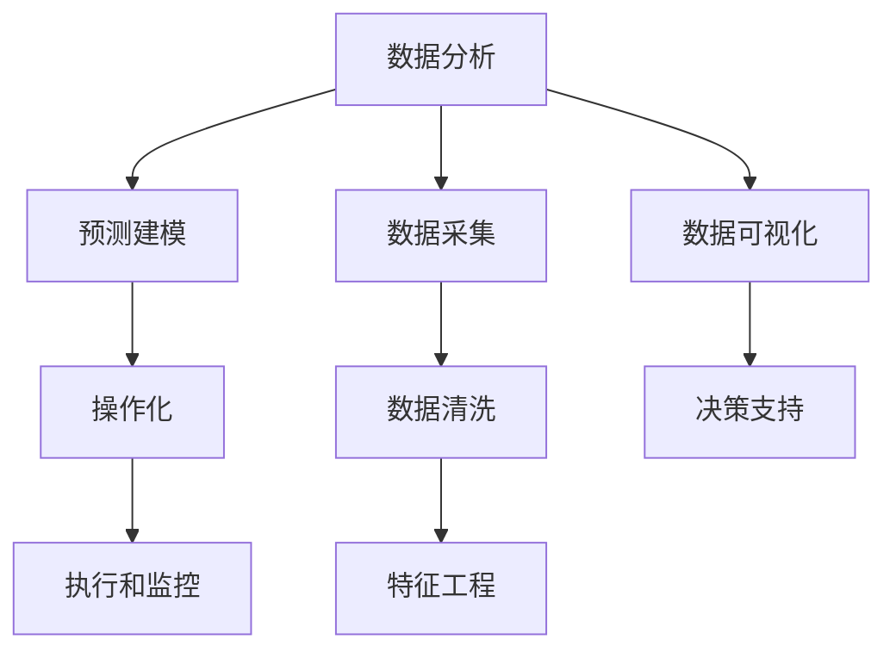

                 

# 如何利用数据分析指导运营决策

数据分析在运营决策中的应用已经成为企业和组织提高竞争力的关键工具。它帮助企业从大规模数据中提取有价值的洞察，指导战略决策，优化运营效率，提升客户体验。本文将深入探讨数据分析如何影响运营决策，并介绍几种核心技术及其应用方法，以期帮助企业更好地利用数据驱动决策。

## 1. 背景介绍

### 1.1 问题由来
在快速变化的市场环境中，企业需要快速响应市场需求，灵活调整运营策略。传统运营决策往往依赖经验和管理层直觉，但这种方式容易受到个人经验和认知偏差的限制，可能导致决策失误。而数据分析通过科学的方法论和数据驱动的洞察，能够提供更准确、更全面的决策支持。

### 1.2 问题核心关键点
数据分析在运营决策中的应用，主要包括以下几个关键点：
- 数据收集：获取多维度的运营数据，包括客户行为、市场趋势、供应链状况等。
- 数据处理：清洗、归一化、特征工程等预处理步骤，保证数据质量。
- 数据建模：运用统计学、机器学习等方法，构建预测模型和分析模型。
- 数据可视化：通过图表、仪表盘等工具，直观展示数据分析结果。
- 数据驱动决策：基于数据分析结果，指导企业战略调整、流程优化和资源分配。

### 1.3 问题研究意义
数据分析在运营决策中的应用，具有以下重要意义：
- 提升决策质量：基于数据驱动的洞察，减少主观判断误差，提升决策质量。
- 优化运营效率：通过数据挖掘和模型预测，识别优化机会，提升资源配置效率。
- 增强客户体验：利用客户行为数据，个性化服务，提升客户满意度和忠诚度。
- 降低风险：通过数据分析，提前识别潜在风险，制定应对策略。

## 2. 核心概念与联系

### 2.1 核心概念概述

为更好地理解数据分析在运营决策中的应用，本节将介绍几个密切相关的核心概念：

- **数据分析(Data Analysis)**：利用统计学、机器学习等方法，从大量数据中提取有价值的信息和洞察，指导决策过程。
- **数据可视化(Data Visualization)**：将数据分析结果转化为图表、仪表盘等可视化形式，便于理解和使用。
- **预测建模(Predictive Modeling)**：通过历史数据构建预测模型，预测未来趋势和结果。
- **操作化(Operationalization)**：将数据分析结果转化为可执行的策略和行动，实现数据驱动的运营决策。

这些核心概念之间的逻辑关系可以通过以下Mermaid流程图来展示：



这个流程图展示了数据分析的核心流程和关键组件：

1. 从数据采集开始，经过数据清洗和特征工程，构建出可供分析的数据集。
2. 利用预测建模进行数据分析，构建预测模型。
3. 将分析结果通过数据可视化展示，辅助决策。
4. 最终通过操作化将数据分析结果转化为可执行的运营策略，并监控执行效果。

## 3. 核心算法原理 & 具体操作步骤

### 3.1 算法原理概述

数据分析在运营决策中的应用，主要基于以下算法原理：

- **回归分析(Regression Analysis)**：通过历史数据构建线性或非线性模型，预测未来结果。
- **时间序列分析(Time Series Analysis)**：对时间序列数据进行建模，预测未来趋势和季节性波动。
- **聚类分析(Cluster Analysis)**：通过相似性度量，将数据分为若干群组，识别不同客户群体特征。
- **分类算法(Classification Algorithms)**：利用历史数据训练分类器，预测新数据所属类别。
- **决策树(Decision Trees)**：构建树形结构模型，描述决策路径和预测结果。
- **神经网络(Neural Networks)**：通过多层神经网络模型，学习复杂非线性关系，提高预测精度。

这些算法通常需要大量的数据和计算资源，企业需要投入人力和技术手段，进行数据准备和模型构建。

### 3.2 算法步骤详解

基于数据分析的运营决策流程一般包括以下几个关键步骤：

**Step 1: 数据采集**
- 从业务系统、客户反馈、市场调研等渠道，获取多维度运营数据。
- 确保数据格式和来源一致，便于后续处理和分析。

**Step 2: 数据清洗**
- 识别并处理缺失值、异常值和重复数据，保证数据质量。
- 对数据进行标准化和归一化处理，提高模型训练效果。

**Step 3: 特征工程**
- 从原始数据中提取和构建有意义的特征，增强模型预测能力。
- 使用降维技术，如主成分分析(PCA)，减少特征维度，提高模型效率。

**Step 4: 数据建模**
- 选择合适的算法模型，构建预测或分类模型。
- 利用历史数据训练模型，并进行交叉验证，评估模型效果。

**Step 5: 数据可视化**
- 使用图表、仪表盘等工具，展示模型预测结果和分析结果。
- 可视化分析结果，帮助管理层和运营团队理解数据洞察。

**Step 6: 数据驱动决策**
- 基于数据分析结果，制定和调整运营策略。
- 实施数据驱动的决策，监控执行效果，不断优化运营方案。

### 3.3 算法优缺点

数据分析在运营决策中的应用，具有以下优点：
1. 提升决策质量：基于数据驱动的洞察，减少主观判断误差，提升决策质量。
2. 优化运营效率：通过数据挖掘和模型预测，识别优化机会，提升资源配置效率。
3. 增强客户体验：利用客户行为数据，个性化服务，提升客户满意度和忠诚度。
4. 降低风险：通过数据分析，提前识别潜在风险，制定应对策略。

但数据分析也存在一些局限性：
1. 数据质量依赖：数据分析结果的准确性高度依赖于数据的质量和完整性。
2. 模型复杂性：复杂的模型可能需要大量的数据和计算资源，开发和维护成本较高。
3. 技术门槛：数据分析需要一定的技术背景和专业知识，企业需投入人力和技术资源。
4. 解释性不足：某些高级模型如神经网络，其决策过程难以解释，可能导致信任度下降。

尽管存在这些局限性，但数据分析在运营决策中的应用仍然是当前和未来的重要趋势。企业需要不断提升数据治理和分析能力，充分利用数据分析的优势，规避其局限性。

### 3.4 算法应用领域

数据分析在运营决策中的应用广泛，涉及多个领域：

- **市场营销**：通过客户行为分析，优化广告投放策略，提升品牌曝光度和市场份额。
- **供应链管理**：利用需求预测模型，优化库存管理，降低库存成本，提升供应链效率。
- **产品开发**：通过市场调研和用户反馈分析，指导产品设计和迭代，提升产品质量和市场竞争力。
- **客户服务**：通过客户满意度分析，优化客户服务流程，提升客户满意度和忠诚度。
- **金融风控**：利用信用评分模型，评估客户信用风险，优化信贷决策，降低金融风险。

除了上述这些常见应用外，数据分析还被创新性地应用于医疗、能源、物流等多个行业，为运营决策提供了新的视角和方法。

## 4. 数学模型和公式 & 详细讲解 & 举例说明

### 4.1 数学模型构建

数据分析的数学模型通常包括回归模型、分类模型、聚类模型等。这里以线性回归模型为例，介绍其构建过程。

线性回归模型定义为：
$$
y = \beta_0 + \beta_1 x_1 + \beta_2 x_2 + \cdots + \beta_n x_n + \epsilon
$$

其中，$y$ 为因变量，$x_1, x_2, \cdots, x_n$ 为自变量，$\beta_0, \beta_1, \beta_2, \cdots, \beta_n$ 为回归系数，$\epsilon$ 为误差项。

### 4.2 公式推导过程

在线性回归模型的训练过程中，主要涉及最小二乘法的推导。给定一组训练数据 $\{(x_i, y_i)\}_{i=1}^n$，其中 $x_i = (x_{i1}, x_{i2}, \cdots, x_{in})$，目标是最小化残差平方和：

$$
SSE = \sum_{i=1}^n (y_i - \hat{y}_i)^2
$$

其中，$\hat{y}_i = \beta_0 + \beta_1 x_{i1} + \beta_2 x_{i2} + \cdots + \beta_n x_{in}$ 为预测值。

最小二乘法的目标是找到使得 $SSE$ 最小的回归系数 $\beta_0, \beta_1, \beta_2, \cdots, \beta_n$。通过求解以下方程组，即可得到回归系数：

$$
\begin{cases}
\sum_{i=1}^n x_{i1} = X_1^T \\
\sum_{i=1}^n x_{i1} x_{i2} = X_2^T \\
\cdots \\
\sum_{i=1}^n x_{i1} x_{in} = X_n^T \\
\sum_{i=1}^n x_{i2} = X_1 \\
\cdots \\
\sum_{i=1}^n x_{in} = X_n
\end{cases}
$$

其中，$X_k^T = \sum_{i=1}^n x_{ik}$ 为自变量的列向量，$X_k$ 为自变量的行向量。

通过求解上述方程组，可以得到回归系数 $\beta_0, \beta_1, \beta_2, \cdots, \beta_n$，从而构建出线性回归模型。

### 4.3 案例分析与讲解

以一家电商企业的销售预测为例，展示数据分析的应用过程：

- **数据采集**：从订单系统、用户行为系统、市场活动系统等渠道，获取多维度销售数据，如订单量、销售额、用户点击率等。
- **数据清洗**：识别并处理缺失值和异常值，标准化数据格式，保证数据质量。
- **特征工程**：构建出用户活跃度、促销活动影响等特征，增强模型预测能力。
- **数据建模**：选择线性回归模型，利用历史数据训练模型，进行交叉验证，评估模型效果。
- **数据可视化**：使用图表展示模型预测结果，帮助管理层理解销售趋势和预测结果。
- **数据驱动决策**：根据销售预测结果，优化库存管理，提升供应链效率，制定促销策略。

## 5. 项目实践：代码实例和详细解释说明

### 5.1 开发环境搭建

在进行数据分析项目实践前，我们需要准备好开发环境。以下是使用Python进行数据分析实践的环境配置流程：

1. 安装Anaconda：从官网下载并安装Anaconda，用于创建独立的Python环境。

2. 创建并激活虚拟环境：
```bash
conda create -n data-env python=3.8 
conda activate data-env
```

3. 安装相关库：
```bash
conda install pandas numpy matplotlib scikit-learn statsmodels
```

4. 安装Jupyter Notebook：
```bash
conda install jupyterlab
```

5. 启动Jupyter Notebook：
```bash
jupyter lab
```

完成上述步骤后，即可在`data-env`环境中开始数据分析实践。

### 5.2 源代码详细实现

这里我们以线性回归模型为例，给出使用Python进行数据分析的完整代码实现。

首先，定义数据处理函数：

```python
import pandas as pd
from sklearn.model_selection import train_test_split
from sklearn.linear_model import LinearRegression

def load_data(file_path):
    data = pd.read_csv(file_path)
    X = data[['feature1', 'feature2', 'feature3']]
    y = data['target']
    return X, y

def preprocess_data(X, y):
    X = X.fillna(X.mean())
    X = (X - X.mean()) / X.std()
    y = y.fillna(y.mean())
    return X, y

def train_test_split_data(X, y):
    X_train, X_test, y_train, y_test = train_test_split(X, y, test_size=0.2, random_state=42)
    return X_train, X_test, y_train, y_test

def evaluate_model(model, X_train, X_test, y_train, y_test):
    y_pred_train = model.predict(X_train)
    y_pred_test = model.predict(X_test)
    print('Train RMSE:', np.sqrt(mean_squared_error(y_train, y_pred_train)))
    print('Test RMSE:', np.sqrt(mean_squared_error(y_test, y_pred_test)))
```

然后，定义模型训练和评估函数：

```python
from sklearn.linear_model import LinearRegression

def train_linear_model(X_train, y_train):
    model = LinearRegression()
    model.fit(X_train, y_train)
    return model

def test_linear_model(model, X_test, y_test):
    y_pred = model.predict(X_test)
    mse = mean_squared_error(y_test, y_pred)
    rmse = np.sqrt(mse)
    return rmse
```

最后，启动训练流程并在测试集上评估：

```python
X, y = load_data('sales_data.csv')
X, y = preprocess_data(X, y)
X_train, X_test, y_train, y_test = train_test_split_data(X, y)
model = train_linear_model(X_train, y_train)
rmse = test_linear_model(model, X_test, y_test)
print('RMSE:', rmse)
```

以上就是使用Python进行线性回归模型训练和评估的完整代码实现。可以看到，得益于Scikit-learn库的强大封装，我们可以用相对简洁的代码完成线性回归模型的训练和评估。

### 5.3 代码解读与分析

让我们再详细解读一下关键代码的实现细节：

**load_data函数**：
- 从指定文件路径读取数据，并分离自变量和因变量。

**preprocess_data函数**：
- 处理缺失值，标准化数据格式，提高模型训练效果。

**train_test_split_data函数**：
- 使用train_test_split函数将数据集分为训练集和测试集，便于模型评估。

**train_linear_model函数**：
- 利用LinearRegression模型训练线性回归模型。

**test_linear_model函数**：
- 在测试集上评估模型性能，计算RMSE作为评估指标。

**启动训练流程**：
- 定义数据路径，加载数据，预处理数据，分割数据集，训练模型，评估模型性能。

可以看到，使用Python和Scikit-learn库，我们可以快速搭建起数据分析项目，进行模型训练和评估。

当然，工业级的系统实现还需考虑更多因素，如数据存储和管理、模型调优和超参数搜索、模型部署和监控等。但核心的数据分析流程基本与此类似。

## 6. 实际应用场景

### 6.1 智能营销

数据分析在智能营销中的应用，主要体现在以下几个方面：

- **客户细分**：通过聚类分析，将客户分为高价值客户、潜在客户、流失客户等不同群体，制定针对性营销策略。
- **广告效果评估**：利用A/B测试和回归分析，评估不同广告活动的效果，优化广告投放策略。
- **推荐系统**：通过协同过滤和矩阵分解等方法，构建用户-商品关联矩阵，推荐符合用户兴趣的商品。

以电商平台的个性化推荐系统为例，通过分析用户行为数据，如浏览记录、购买历史、点击率等，构建用户画像，进行商品推荐。

### 6.2 供应链优化

数据分析在供应链优化中的应用，主要体现在以下几个方面：

- **需求预测**：通过时间序列分析，预测未来需求，优化库存管理和生产计划。
- **供应商评估**：利用回归分析和聚类分析，评估供应商的可靠性、成本和交付能力，优化供应链网络。
- **物流优化**：利用路线规划和优化算法，设计最优运输路线，提升物流效率。

以零售企业的库存管理为例，通过分析历史销售数据，预测未来销售趋势，优化库存配置，减少缺货和过剩库存。

### 6.3 客户服务

数据分析在客户服务中的应用，主要体现在以下几个方面：

- **客户满意度分析**：通过问卷调查和自然语言处理技术，分析客户满意度，识别服务改进机会。
- **服务流程优化**：利用聚类分析和回归分析，优化服务流程，提升服务效率。
- **客户投诉管理**：通过文本分析，识别客户投诉热点，快速响应和处理。

以银行客服中心的客户服务为例，通过分析客户投诉数据，识别常见问题和改进点，优化服务流程，提升客户满意度。

## 7. 工具和资源推荐

### 7.1 学习资源推荐

为了帮助开发者系统掌握数据分析的理论基础和实践技巧，这里推荐一些优质的学习资源：

1. 《Python数据科学手册》：由Jake VanderPlas撰写，全面介绍Python在数据分析中的应用，包括NumPy、Pandas、Matplotlib等库的使用。

2. CS229《机器学习》课程：斯坦福大学开设的机器学习经典课程，讲解回归分析、分类、聚类等核心算法。

3. 《数据科学实战》：由Joel Grus撰写，以Python为例，讲解数据清洗、特征工程、模型训练等数据分析过程。

4. Coursera《数据科学专项课程》：由Johns Hopkins大学提供，涵盖数据清洗、统计分析、机器学习等数据分析技能，适合初学者和进阶学习者。

5. Kaggle：数据科学竞赛平台，提供大量开源数据集和实战案例，帮助开发者提升数据分析能力。

通过对这些资源的学习实践，相信你一定能够快速掌握数据分析的精髓，并用于解决实际的运营决策问题。

### 7.2 开发工具推荐

高效的开发离不开优秀的工具支持。以下是几款用于数据分析开发的常用工具：

1. Jupyter Notebook：免费开源的交互式编程环境，支持Python、R等语言，适合数据科学和机器学习开发。

2. Tableau：强大的数据可视化工具，支持多种数据源，易于拖拽构建可视化报表。

3. Power BI：微软推出的商业智能工具，支持数据连接、可视化报表和仪表盘构建。

4. Qlik Sense：商业智能和分析平台，提供自服务数据探索、可视化报表和预测分析功能。

5. R Studio：基于R语言的数据分析工具，支持数据清洗、模型训练和可视化等流程。

合理利用这些工具，可以显著提升数据分析的开发效率，加快创新迭代的步伐。

### 7.3 相关论文推荐

数据分析在运营决策中的应用源于学界的持续研究。以下是几篇奠基性的相关论文，推荐阅读：

1. "Data Mining and Statistical Learning" by Trevor Hastie, Robert Tibshirani, Jerome Friedman：经典教材，讲解统计学习方法和数据挖掘技术。

2. "Predictive Analytics" by Eric Siegel：深入浅出地讲解预测分析方法，包括回归分析、分类算法、时间序列分析等。

3. "The Elements of Statistical Learning" by Trevor Hastie, Robert Tibshirani, Jerome Friedman：深度介绍统计学习方法，适合数据分析专业人士。

4. "Advances in Neural Information Processing Systems (NIPS)"：每年发布的机器学习会议论文集，涵盖最新的算法和应用研究。

5. "Data Mining and Statistical Learning: A Data Centric Perspective" by Ali Ghodsi, Michael Hong：全面介绍数据科学和机器学习的框架和方法。

这些论文代表了大数据分析技术的发展脉络。通过学习这些前沿成果，可以帮助研究者把握学科前进方向，激发更多的创新灵感。

## 8. 总结：未来发展趋势与挑战

### 8.1 总结

本文对数据分析在运营决策中的应用进行了全面系统的介绍。首先阐述了数据分析在运营决策中的重要性，明确了数据分析在提高决策质量、优化运营效率、增强客户体验和降低风险等方面的独特价值。其次，从原理到实践，详细讲解了数据分析的数学模型和操作步骤，给出了数据分析项目开发的完整代码实例。同时，本文还广泛探讨了数据分析在智能营销、供应链优化、客户服务等多个行业领域的应用前景，展示了数据分析范式的广阔前景。

通过本文的系统梳理，可以看到，数据分析在运营决策中的应用已经成为企业提升竞争力的关键工具。借助科学的数据分析方法，企业能够从大规模数据中提取有价值的洞察，指导战略决策，优化运营效率，提升客户体验，降低风险。未来，伴随数据分析技术的不断进步，相信更多企业能够充分利用数据分析的优势，实现数据驱动的运营决策，提升整体运营水平。

### 8.2 未来发展趋势

展望未来，数据分析在运营决策中的应用将呈现以下几个发展趋势：

1. **自动化数据分析**：随着AI和机器学习技术的发展，自动化数据分析将成为主流，企业能够快速获取数据洞察，加速决策过程。

2. **实时数据分析**：通过实时数据流处理技术，如Apache Kafka、Apache Flink等，企业能够实现实时数据分析和决策，提升响应速度。

3. **跨领域数据分析**：数据分析技术将更多应用于跨领域场景，如医疗、能源、金融等，为企业带来新的业务机会。

4. **数据治理和隐私保护**：随着数据规模的增大，数据治理和隐私保护成为关键问题。企业需要制定数据治理策略，保护数据安全和隐私。

5. **数据驱动的运营管理**：数据分析将成为企业运营管理的核心，通过数据驱动决策，优化资源配置，提升运营效率。

6. **数据可视化智能化**：数据可视化技术将更加智能化，支持自然语言查询和动态更新，帮助管理层和运营团队更高效地利用数据。

以上趋势凸显了数据分析技术的广阔前景。这些方向的探索发展，必将进一步提升企业的数据分析能力，推动运营决策的智能化、实时化和高效化。

### 8.3 面临的挑战

尽管数据分析在运营决策中的应用已经取得了显著成效，但在迈向更加智能化、实时化和高效化的过程中，它仍面临诸多挑战：

1. **数据质量问题**：数据的完整性、准确性和一致性直接影响数据分析结果的可靠性。数据清洗和预处理需要投入大量人力和时间。

2. **技术复杂性**：高级数据分析方法需要较高的技术门槛，企业需要投入专业人员和研发资源。

3. **计算资源限制**：数据分析需要大量的计算资源，特别是在处理大规模数据时，计算效率和成本成为关键问题。

4. **数据安全问题**：数据泄露和隐私问题成为企业关注的焦点，如何在数据治理和隐私保护方面做出平衡，成为重要挑战。

5. **模型解释性**：高级模型如深度学习，其决策过程难以解释，可能导致信任度下降。

6. **数据孤岛问题**：不同业务系统之间的数据共享和融合成为难题，数据孤岛现象普遍存在。

正视数据分析面临的这些挑战，积极应对并寻求突破，将是数据分析技术走向成熟的必由之路。相信随着技术的不断进步和应用的深入，数据分析必将在运营决策中发挥更大的作用。

### 8.4 研究展望

面对数据分析面临的种种挑战，未来的研究需要在以下几个方面寻求新的突破：

1. **自动化数据分析工具**：开发易于使用的自动化数据分析工具，降低技术门槛，提高数据处理效率。

2. **实时数据处理技术**：研发高效实时数据处理技术，支持数据流分析和实时决策。

3. **跨领域数据融合技术**：探索跨领域数据融合方法，构建多源数据融合平台，支持跨领域数据分析。

4. **数据治理和隐私保护**：制定数据治理和隐私保护策略，确保数据安全和隐私。

5. **模型解释性技术**：开发可解释的模型，增强数据分析的透明性和可解释性。

6. **数据孤岛解决方案**：探索数据孤岛解决方案，促进不同业务系统之间的数据共享和融合。

这些研究方向和创新思路，必将引领数据分析技术迈向更高的台阶，为运营决策提供更强大的数据支持，推动企业数字化转型和智能化升级。总之，数据分析需要从数据采集、处理、建模、可视化等多个环节进行全面优化，方能实现数据驱动的运营决策，助力企业提升竞争力和市场地位。

## 9. 附录：常见问题与解答

**Q1：数据分析在运营决策中的应用是否适用于所有行业？**

A: 数据分析在运营决策中的应用具有通用性，但不同行业需要根据具体业务特点进行适配。例如，金融行业需要考虑合规性和风险管理，医疗行业需要考虑数据隐私和安全，零售行业需要考虑客户行为和市场趋势等。企业需要根据自身业务特点，制定相应的数据分析策略和方法。

**Q2：数据清洗和预处理的重要性体现在哪里？**

A: 数据清洗和预处理是数据分析的基石，直接影响数据分析结果的准确性和可靠性。数据清洗能够处理缺失值、异常值和重复数据，提高数据质量。预处理能够对数据进行标准化和归一化处理，增强模型训练效果。因此，数据清洗和预处理是数据分析过程中不可或缺的环节。

**Q3：如何选择合适的数据分析工具？**

A: 选择合适的数据分析工具需要考虑多个因素，如数据量、计算资源、技术栈等。常用的数据分析工具包括Python、R、Tableau、Power BI等。对于大数据处理和机器学习应用，Python和R更为适合；对于数据可视化和报表展示，Tableau和Power BI更为便捷。企业应根据具体需求和技术资源，选择最合适的工具。

**Q4：数据分析在实际应用中应注意哪些问题？**

A: 数据分析在实际应用中需要注意以下几个问题：
1. 数据质量：确保数据完整性、准确性和一致性，避免数据噪声和偏差。
2. 数据安全：保护数据隐私和安全，避免数据泄露和滥用。
3. 模型解释性：选择易于解释的模型，增强数据分析的透明性和可解释性。
4. 实时性：支持实时数据处理和分析，提升决策响应速度。
5. 跨部门协作：促进数据共享和协同，消除数据孤岛。

合理应对这些问题，能够更好地实现数据驱动的运营决策，提升企业运营效率和竞争力。

**Q5：数据分析在运营决策中的未来发展方向是什么？**

A: 数据分析在运营决策中的未来发展方向包括：
1. 自动化和智能化：通过自动化数据分析工具和智能化算法，提升数据分析效率和准确性。
2. 实时性和动态性：实现实时数据处理和动态分析，支持实时决策和动态调整。
3. 跨领域和融合性：探索跨领域数据融合方法，构建多源数据融合平台，支持多领域数据分析。
4. 数据治理和隐私保护：制定数据治理和隐私保护策略，确保数据安全和隐私。
5. 数据可视化和智能化：开发智能化数据可视化工具，支持自然语言查询和动态更新，提升数据利用效率。

这些方向将引领数据分析技术迈向更高的台阶，为运营决策提供更强大的数据支持，推动企业数字化转型和智能化升级。

---

作者：禅与计算机程序设计艺术 / Zen and the Art of Computer Programming

