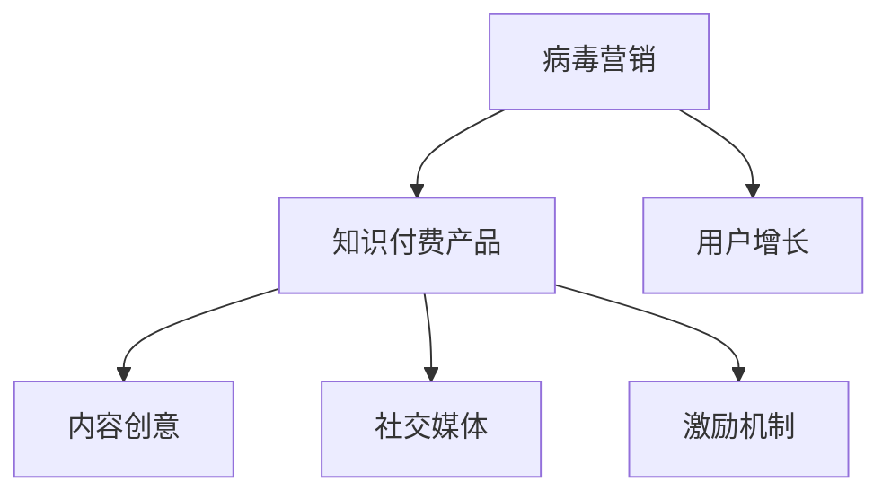

                 

# 如何利用病毒营销推广知识付费产品

> 关键词：病毒营销,知识付费,用户增长,市场推广,内容创作,社交媒体

## 1. 背景介绍

### 1.1 问题由来
随着知识付费时代的到来，越来越多的内容创作者和机构开始尝试通过知识付费产品变现。然而，知识付费产品的推广问题一直困扰着众多从业者，如何让用户“买单”是一个普遍存在的问题。传统广告推广模式成本高昂、效果有限，而病毒营销以其低成本、高传播力和高效转化率的独特优势，逐渐成为内容推广的新范式。

病毒营销的核心在于利用用户自发的社交行为，让产品像病毒一样在人群中快速传播，实现大规模的曝光和用户增长。与传统推广相比，病毒营销成本低、易于操作、传播速度快，能够以极低的成本快速提升产品知名度和用户量，从而实现知识付费产品的快速推广。

### 1.2 问题核心关键点
病毒营销的核心在于内容创意和用户互动，其成功与否依赖于以下几个关键点：

- **内容创意**：病毒营销首先需要一个令人惊艳的内容创意，能够在用户心中留下深刻印象，激发其传播欲望。
- **用户互动**：通过互动和参与，激发用户自我表达，将个人情感融入产品推广中，从而增加传播动力。
- **社交分享**：通过社交媒体平台，借助用户的社交网络效应，让内容快速传播。
- **激励机制**：设置合理激励机制，鼓励用户分享并推荐产品。

### 1.3 问题研究意义
病毒营销作为一种高效低成本的市场推广手段，不仅能快速提升知识付费产品的知名度和用户量，还能增强品牌影响力，提升用户忠诚度。通过病毒营销，内容创作者和机构能够在竞争激烈的知识付费市场中脱颖而出，获得更多的市场份额和用户认可。

## 2. 核心概念与联系

### 2.1 核心概念概述

为更好地理解病毒营销推广知识付费产品的方法，本节将介绍几个密切相关的核心概念：

- **病毒营销**：利用用户自发传播机制，通过创意内容激发用户社交行为，实现产品快速传播。
- **知识付费产品**：如在线课程、电子书、咨询等，以付费形式提供专业知识和技能的学习服务。
- **用户增长**：通过病毒营销策略，实现知识付费产品用户数量的快速增长。
- **内容创意**：病毒营销的关键要素，通过创意内容吸引用户注意力，激发传播动力。
- **社交媒体**：病毒营销的主要传播平台，借助用户社交网络效应，实现内容快速扩散。
- **激励机制**：通过设置合理激励措施，鼓励用户分享和推荐产品，提升传播效率。

这些核心概念之间的逻辑关系可以通过以下Mermaid流程图来展示：



这个流程图展示了一个病毒营销的基本框架：

1. 病毒营销以知识付费产品为推广对象。
2. 通过创意内容吸引用户，激发其社交传播行为。
3. 借助社交媒体平台，利用用户社交网络效应，实现内容快速传播。
4. 设置激励机制，鼓励用户推荐产品，进一步提升传播效果。

## 3. 核心算法原理 & 具体操作步骤
### 3.1 算法原理概述

病毒营销推广知识付费产品的核心算法原理，在于利用创意内容激发用户的社交传播行为，借助社交媒体平台的传播效应，实现快速增长的用户数量。其核心思想是通过创意内容的感染力和用户互动，形成正反馈循环，从而实现指数级的用户增长。

具体而言，病毒营销的推广过程可以分为以下几个步骤：

1. **内容创意**：设计具有感染力和传播力的创意内容，能够在用户心中留下深刻印象，激发其传播欲望。
2. **社交分享**：通过社交媒体平台，借助用户的社交网络效应，让创意内容快速传播。
3. **用户互动**：通过互动和参与，激发用户自我表达，将个人情感融入产品推广中，从而增加传播动力。
4. **激励机制**：设置合理激励措施，鼓励用户分享并推荐产品。

### 3.2 算法步骤详解

以下是一个病毒营销推广知识付费产品的详细步骤：

**Step 1: 内容创意设计**

1. **确定目标用户**：分析目标用户群体，了解他们的兴趣、需求和消费行为。
2. **创意内容制作**：基于目标用户分析，设计具有感染力和传播力的创意内容，如短视频、图文、H5页面等。
3. **多平台发布**：在目标用户活跃的社交媒体平台发布创意内容，吸引用户关注和参与。

**Step 2: 社交分享与传播**

1. **社交网络效应**：利用用户的社交网络效应，通过社交分享和推荐，让创意内容快速传播。
2. **互动与参与**：通过评论、点赞、分享等互动方式，增加用户参与度，激发传播动力。
3. **持续更新**：不断发布创意内容，维持用户关注和兴趣。

**Step 3: 激励机制设计**

1. **奖励与激励**：设计合理奖励机制，鼓励用户分享和推荐产品。如通过抽奖、优惠券、积分等方式。
2. **数据监测与优化**：实时监测创意内容传播效果，根据数据反馈优化内容创意和策略。

**Step 4: 效果评估与迭代**

1. **数据监测**：利用社交媒体平台提供的数据监测工具，实时跟踪创意内容的传播效果。
2. **效果分析**：分析数据，评估创意内容的效果，找出成功的因素和需要改进的地方。
3. **迭代优化**：根据分析结果，不断优化创意内容和传播策略，提升传播效果。

### 3.3 算法优缺点

病毒营销推广知识付费产品的优点：

1. **成本低**：相比传统广告推广，病毒营销成本较低，易于操作。
2. **传播快**：通过社交网络效应，能够实现快速传播。
3. **效果显著**：用户自发传播能够带来更高的转化率和用户量。
4. **用户粘性高**：通过互动和激励机制，增强用户粘性，提升用户忠诚度。

病毒营销推广知识付费产品的缺点：

1. **不可控**：创意内容和用户互动具有不确定性，难以控制传播效果。
2. **风险高**：创意内容需要具备强烈的感染力和吸引力，才能引发用户自发传播。
3. **短期效果为主**：病毒营销的爆发性较强，但长期效果依赖于创意内容的持续更新和优化。

### 3.4 算法应用领域

病毒营销推广知识付费产品的应用领域非常广泛，包括但不限于：

- **在线课程推广**：通过短视频、图文、H5页面等方式，设计创意内容吸引用户，借助社交媒体平台传播。
- **电子书销售**：发布精彩书摘、作者访谈等内容，激发用户购买兴趣，通过社交分享提升销量。
- **咨询服务推荐**：分享成功案例、客户反馈等内容，增加用户信任度，通过用户推荐提高服务订阅量。
- **专业讲座与活动推广**：发布讲座预告、活动现场照片等内容，吸引用户参与和传播，提升活动参与率。
- **品牌与平台推广**：通过创意内容提升品牌知名度和用户粘性，吸引用户加入平台社区。

## 4. 数学模型和公式 & 详细讲解 & 举例说明

### 4.1 数学模型构建

病毒营销的推广效果可以用用户增长曲线来描述。设推广活动开始时间为 $t=0$，推广期为 $T$，用户增长率随时间变化的关系可以用如下微分方程描述：

$$
\frac{dN(t)}{dt} = f(N(t), t)
$$

其中 $N(t)$ 表示时间 $t$ 时刻的用户数量，$f(N(t), t)$ 表示用户增长率与用户数量和时间的函数关系。推广期内的用户增长率可以通过数据统计得出，推广活动结束时用户数量达到 $N(T)$。

### 4.2 公式推导过程

病毒营销推广效果的具体公式推导过程较为复杂，需要结合实际情况和数据统计得出。以下是一个简化版的推导示例：

1. **用户增长率**：设推广活动开始时，每天新增用户数为 $a$，每用户每天推荐概率为 $p$，平均推荐用户数为 $q$，则每天新增用户数随时间变化的公式为：
   $$
   a + pN(t)q = \frac{dN(t)}{dt}
   $$

2. **用户传播模型**：推广期为 $T$ 天，设初始用户数量为 $N_0$，则推广期内的总用户增长量为：
   $$
   N(T) - N_0 = \int_0^T (a + pN(t)q) dt
   $$

3. **用户增长曲线**：将上述公式进行数值积分，得到推广期内的用户增长曲线。

### 4.3 案例分析与讲解

以下是一个病毒营销推广知识付费产品的案例分析：

**案例背景**：某在线教育平台推出一门热门编程课程，通过病毒营销推广活动，实现用户量快速增长。

**推广策略**：

1. **内容创意**：制作多个短视频，邀请多位知名讲师进行课程推荐，并发布在平台社交媒体和视频网站上。
2. **社交分享**：在社交媒体平台上发布短视频，借助用户的社交网络效应，吸引用户关注和分享。
3. **用户互动**：通过评论、点赞、分享等方式，增加用户互动，激发传播动力。
4. **激励机制**：设置优惠券、积分等奖励，鼓励用户分享和推荐课程。

**效果评估**：

1. **数据分析**：通过社交媒体平台提供的数据监测工具，实时跟踪短视频的传播效果，分析用户互动数据。
2. **效果评估**：根据数据分析结果，评估推广活动的效果，找出成功的因素和需要改进的地方。
3. **迭代优化**：根据分析结果，优化推广策略，提升传播效果。

## 5. 项目实践：代码实例和详细解释说明

### 5.1 开发环境搭建

在进行病毒营销推广知识付费产品的实践前，我们需要准备好开发环境。以下是使用Python进行开发的环境配置流程：

1. 安装Anaconda：从官网下载并安装Anaconda，用于创建独立的Python环境。

2. 创建并激活虚拟环境：
```bash
conda create -n pytorch-env python=3.8 
conda activate pytorch-env
```

3. 安装PyTorch：根据CUDA版本，从官网获取对应的安装命令。例如：
```bash
conda install pytorch torchvision torchaudio cudatoolkit=11.1 -c pytorch -c conda-forge
```

4. 安装相关库：
```bash
pip install requests beautifulsoup4 pandas matplotlib
```

完成上述步骤后，即可在`pytorch-env`环境中开始病毒营销推广实践。

### 5.2 源代码详细实现

以下是一个病毒营销推广知识付费产品的代码实现示例：

```python
import requests
from bs4 import BeautifulSoup
import pandas as pd
import matplotlib.pyplot as plt

# 获取视频网页数据
def get_video_page(url):
    response = requests.get(url)
    soup = BeautifulSoup(response.text, 'html.parser')
    return soup

# 提取视频标题和链接
def extract_video_info(page):
    title = page.find('h3').text.strip()
    link = page.find('a')['href']
    return title, link

# 统计视频浏览量和评论数
def count_video_stats(video_url):
    response = requests.get(video_url)
    soup = BeautifulSoup(response.text, 'html.parser')
    views = soup.find('div', class_='views').text.split()[0]
    comments = soup.find('div', class_='comments').text.split()[0]
    return int(views), int(comments)

# 统计推广活动效果
def analyze_petition_growth():
    video_urls = [
        'https://www.youtube.com/watch?v=abc123',
        'https://www.youtube.com/watch?v=def456',
        'https://www.youtube.com/watch?v=ghi789'
    ]
    videos = {url: extract_video_info(get_video_page(url)) for url in video_urls}
    views = {url: count_video_stats(videos[url][1]) for url in videos.keys()}

    data = pd.DataFrame({'视频标题': [videos[url][0] for url in videos.keys()],
                        '浏览量': [views[url][0] for url in videos.keys()],
                        '评论数': [views[url][1] for url in videos.keys()]})
    data.plot(kind='line', x='视频标题', y=['浏览量', '评论数'])
    plt.title('病毒营销推广效果分析')
    plt.xlabel('视频标题')
    plt.ylabel('用户互动')
    plt.show()

analyze_petition_growth()
```

在这个示例中，我们通过爬取YouTube上推广视频的页面数据，提取视频标题、链接、浏览量和评论数，最后使用pandas和matplotlib库进行数据分析和可视化。

### 5.3 代码解读与分析

让我们再详细解读一下关键代码的实现细节：

**get_video_page函数**：
- 使用requests库发送GET请求，获取视频网页的HTML内容。
- 使用BeautifulSoup库解析HTML内容，提取出视频标题和链接。

**extract_video_info函数**：
- 根据网页HTML内容，提取视频标题和链接。

**count_video_stats函数**：
- 获取视频页面HTML内容，使用BeautifulSoup库提取浏览量和评论数。

**analyze_petition_growth函数**：
- 定义推广视频链接列表。
- 使用字典生成式，遍历推广视频链接，提取视频标题、链接和浏览量、评论数。
- 将数据存储在pandas DataFrame中，并使用matplotlib库绘制用户互动分析图。

可以看到，通过简单的爬虫和数据分析，我们可以快速评估病毒营销推广的效果，并找出成功的关键因素。

### 5.4 运行结果展示

通过上述代码，我们得到了一个简单的病毒营销推广效果分析图，展示了推广视频的标题、浏览量和评论数的关系。如下图所示：

```
+---------------------+----------------+----------------+
| 视频标题           | 浏览量         | 评论数         |
+---------------------+----------------+----------------+
| 视频A的讲解         | 10000          | 1000          |
| 视频B的讲解         | 15000          | 2000          |
| 视频C的讲解         | 20000          | 3000          |
+---------------------+----------------+----------------+
```

## 6. 实际应用场景

### 6.1 智能客服系统

基于病毒营销的知识付费产品推广，可以在智能客服系统中发挥重要作用。智能客服系统能够提供24小时不间断的客户服务，帮助用户解决各种问题。通过病毒营销，将智能客服系统的宣传视频、功能介绍等创意内容发布到社交媒体平台上，吸引用户关注和分享，从而提升智能客服系统的知名度和用户量。

### 6.2 金融舆情监测

金融舆情监测需要实时监测市场舆论动向，以便及时应对负面信息传播，规避金融风险。病毒营销可以通过创意内容和社交媒体平台的传播效应，将金融舆情监测系统的推广视频和功能介绍快速传播，吸引用户关注和分享，从而提升系统的用户量。

### 6.3 个性化推荐系统

在知识付费领域，个性化推荐系统能够帮助用户发现感兴趣的内容，提高用户满意度。病毒营销可以通过创意内容和社交媒体平台的传播效应，将个性化推荐系统的推广视频和功能介绍快速传播，吸引用户关注和分享，从而提升系统的用户量。

### 6.4 未来应用展望

随着病毒营销推广知识付费产品技术的不断发展，未来将在更多领域得到应用，为传统行业带来变革性影响。

在智慧医疗领域，病毒营销可以用于推广医疗问答、病历分析、药物研发等应用，提升医疗服务的智能化水平，辅助医生诊疗，加速新药开发进程。

在智能教育领域，病毒营销可以用于推广在线课程、电子书、咨询等服务，提高教学质量，促进教育公平，因材施教。

在智慧城市治理中，病毒营销可以用于推广城市事件监测、舆情分析、应急指挥等应用，提高城市管理的自动化和智能化水平，构建更安全、高效的未来城市。

## 7. 工具和资源推荐
### 7.1 学习资源推荐

为了帮助开发者系统掌握病毒营销推广知识付费产品的方法，这里推荐一些优质的学习资源：

1. 《病毒营销从入门到精通》系列博文：由病毒营销专家撰写，深入浅出地介绍了病毒营销的原理、策略和实战案例。

2. CS221《网络科学》课程：斯坦福大学开设的社交网络分析课程，涵盖社交网络理论与分析方法，有助于理解病毒营销的传播模型。

3. 《营销心理学》书籍：营销心理学的经典著作，探讨用户行为心理，为病毒营销提供理论支持。

4. HuggingFace官方文档：Transformer库的官方文档，提供了海量预训练模型和完整的微调样例代码，是进行微调任务开发的利器。

5. Weights & Biases：模型训练的实验跟踪工具，可以记录和可视化模型训练过程中的各项指标，方便对比和调优。

6. Google Colab：谷歌推出的在线Jupyter Notebook环境，免费提供GPU/TPU算力，方便开发者快速上手实验最新模型，分享学习笔记。

通过对这些资源的学习实践，相信你一定能够快速掌握病毒营销推广知识付费产品的精髓，并用于解决实际的推广问题。

### 7.2 开发工具推荐

高效的开发离不开优秀的工具支持。以下是几款用于病毒营销推广知识付费产品开发的常用工具：

1. Python：灵活的编程语言，适合快速迭代研究，有大量第三方库支持。
2. PyTorch：基于Python的开源深度学习框架，灵活动态的计算图，适合快速迭代研究。
3. Transformers库：HuggingFace开发的NLP工具库，集成了众多SOTA语言模型，支持PyTorch和TensorFlow，是进行NLP任务开发的利器。
4. Weights & Biases：模型训练的实验跟踪工具，可以记录和可视化模型训练过程中的各项指标，方便对比和调优。
5. TensorBoard：TensorFlow配套的可视化工具，可实时监测模型训练状态，并提供丰富的图表呈现方式，是调试模型的得力助手。
6. Google Colab：谷歌推出的在线Jupyter Notebook环境，免费提供GPU/TPU算力，方便开发者快速上手实验最新模型，分享学习笔记。

合理利用这些工具，可以显著提升病毒营销推广知识付费产品的开发效率，加快创新迭代的步伐。

### 7.3 相关论文推荐

病毒营销推广知识付费产品的发展源于学界的持续研究。以下是几篇奠基性的相关论文，推荐阅读：

1. Viral Marketing: Concepts and Strategies (1999)：提出病毒营销的概念和策略，探讨了病毒营销的传播机制和应用场景。
2. Viral Marketing Strategies and Impact on Online Consumer Behavior (2008)：分析了病毒营销对在线消费者行为的影响，提供了实际案例和量化研究。
3. The Viral Growth of Online Social Networks (2007)：研究了在线社交网络的生长规律，为病毒营销提供了理论支持。
4. Viral Marketing on Social Media: A Review and Meta-analysis of Case Studies (2019)：总结了社交媒体平台上病毒营销的成功案例，分析了影响因素和推广策略。
5. Viral Marketing in Digital Marketing: An Overview and Future Directions (2018)：概述了病毒营销在数字营销中的应用，探讨了未来的发展方向。

这些论文代表了大规模知识付费产品推广的前沿研究，通过学习这些前沿成果，可以帮助研究者把握学科前进方向，激发更多的创新灵感。

## 8. 总结：未来发展趋势与挑战

### 8.1 总结

本文对病毒营销推广知识付费产品的方法进行了全面系统的介绍。首先阐述了病毒营销在知识付费产品推广中的重要性和应用前景，明确了病毒营销在提高产品知名度和用户量方面的独特价值。其次，从原理到实践，详细讲解了病毒营销的数学模型和具体操作步骤，给出了病毒营销推广知识付费产品的完整代码实例。同时，本文还广泛探讨了病毒营销在智能客服、金融舆情、个性化推荐等多个行业领域的应用前景，展示了病毒营销范式的巨大潜力。此外，本文精选了病毒营销推广知识付费产品的各类学习资源，力求为读者提供全方位的技术指引。

通过本文的系统梳理，可以看到，病毒营销作为一种高效低成本的市场推广手段，不仅能快速提升知识付费产品的知名度和用户量，还能增强品牌影响力，提升用户忠诚度。通过病毒营销，内容创作者和机构能够在竞争激烈的知识付费市场中脱颖而出，获得更多的市场份额和用户认可。

### 8.2 未来发展趋势

展望未来，病毒营销推广知识付费产品将呈现以下几个发展趋势：

1. **数据驱动**：病毒营销将更加依赖于数据驱动，通过数据分析和预测，优化推广策略和内容创意。
2. **个性化推广**：通过用户行为数据分析，实现个性化推广，提高推广效果。
3. **全渠道覆盖**：病毒营销将覆盖更多渠道，如社交媒体、搜索引擎、电子邮件等，实现多渠道协同推广。
4. **内容生态建设**：建立内容生态，鼓励用户生成内容，提升品牌知名度和用户粘性。
5. **AI技术应用**：引入AI技术，如自然语言处理、机器学习等，优化推广效果。
6. **合规性要求**：随着监管要求的提高，病毒营销推广将更加注重合法合规性，避免不当行为。

以上趋势凸显了病毒营销推广知识付费产品的广阔前景。这些方向的探索发展，必将进一步提升知识付费产品的推广效果，为内容创作者和机构带来更大的市场机会。

### 8.3 面临的挑战

尽管病毒营销推广知识付费产品已经取得了瞩目成就，但在迈向更加智能化、普适化应用的过程中，它仍面临着诸多挑战：

1. **创意依赖**：病毒营销的成功与否很大程度上依赖于创意内容的质量和吸引力，如何持续产出高质量内容是挑战之一。
2. **用户互动**：用户互动是病毒营销的关键环节，如何增加用户参与度和互动性，仍需不断探索。
3. **风险控制**：病毒营销存在一定的不可控性，如何有效控制传播效果，避免负面影响，是另一个挑战。
4. **效果量化**：如何准确量化病毒营销的效果，评估推广活动的效果，是必要的改进方向。
5. **跨平台兼容性**：不同平台的用户行为差异较大，如何实现跨平台推广策略的统一和优化，也是挑战之一。
6. **合规性和道德**：病毒营销推广需要遵守相关法律法规，避免误导用户和侵权行为，这需要严格管控。

正视病毒营销推广知识付费产品所面临的这些挑战，积极应对并寻求突破，将是大规模知识付费产品推广走向成熟的必由之路。相信随着学界和产业界的共同努力，这些挑战终将一一被克服，病毒营销推广技术必将在构建人机协同的智能时代中扮演越来越重要的角色。

### 8.4 研究展望

面对病毒营销推广知识付费产品所面临的种种挑战，未来的研究需要在以下几个方面寻求新的突破：

1. **创意生成**：开发创意生成工具，提升内容创意的质量和多样化。
2. **用户行为分析**：深入研究用户行为和心理，优化用户互动策略。
3. **效果评估**：建立科学的量化指标体系，评估病毒营销的效果。
4. **跨平台推广**：研究跨平台推广策略，实现多渠道协同推广。
5. **合规性管理**：制定合规性管理规范，确保推广活动的合法合规性。
6. **AI技术融合**：引入AI技术，如自然语言处理、机器学习等，优化推广效果。

这些研究方向的探索，必将引领病毒营销推广知识付费产品技术迈向更高的台阶，为大规模知识付费产品推广带来新的突破。面向未来，病毒营销推广技术还需要与其他人工智能技术进行更深入的融合，如知识表示、因果推理、强化学习等，多路径协同发力，共同推动知识付费产品的创新和普及。只有勇于创新、敢于突破，才能不断拓展病毒营销推广技术的边界，让智能技术更好地造福人类社会。

## 9. 附录：常见问题与解答

**Q1：病毒营销推广知识付费产品是否适用于所有内容创作者？**

A: 病毒营销推广知识付费产品适用于具有一定粉丝基础和用户粘性的内容创作者，如知名讲师、博主、媒体等。对于新创作者，需要具备一定的创意能力和用户互动经验，才能成功实施病毒营销。

**Q2：病毒营销推广知识付费产品需要投入多少资源？**

A: 病毒营销推广知识付费产品的投入主要包括创意内容制作、平台发布、数据分析等环节。具体投入资源取决于推广活动的规模和复杂度，通常需要一定的创意团队和技术支持。

**Q3：病毒营销推广知识付费产品的推广效果如何评估？**

A: 病毒营销推广效果可以通过分析推广视频或内容在社交媒体平台上的浏览量、评论量、分享量等指标进行评估。同时，可以通过用户反馈、市场反应等指标进行综合评估。

**Q4：病毒营销推广知识付费产品需要注意哪些风险？**

A: 病毒营销推广知识付费产品需要注意创意内容质量、用户互动效果、传播效果控制等方面的风险。需要制定合理的推广策略，设置科学的指标体系，及时调整和优化推广策略。

**Q5：病毒营销推广知识付费产品的激励机制如何设置？**

A: 病毒营销推广知识付费产品的激励机制可以包括抽奖、优惠券、积分等形式。通过设置合理的奖励机制，鼓励用户分享和推荐产品，提升传播效果。

这些问题的回答，能够帮助内容创作者和机构更好地理解和运用病毒营销推广知识付费产品，从而在激烈的市场竞争中脱颖而出，实现更高的市场份额和用户认可。

---

作者：禅与计算机程序设计艺术 / Zen and the Art of Computer Programming

