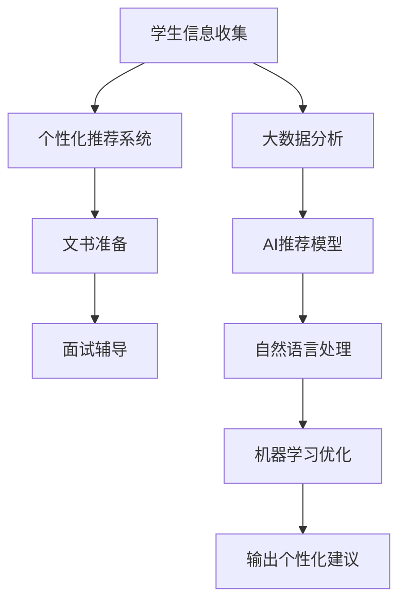

                 

# 如何利用知识付费实现在线留学咨询与申请服务？

在当今全球化的大背景下，留学已经成为越来越多中国学生的选择。然而，留学申请是一个复杂的过程，涉及到选校、文书、面试等多个环节。对于缺乏经验的高中生和家长来说，如何在众多留学机构中做出正确选择，如何准备充分、高效地完成留学申请，都是不小的挑战。

为了解决这一问题，知识付费平台近年来涌现出了一些提供在线留学咨询与申请服务的机构。这些平台利用AI和大数据技术，通过收取费用提供个性化的留学咨询服务，帮助用户提高申请成功率。本文将深入探讨这些平台的运作机制，以及如何利用知识付费实现在线留学咨询与申请服务。

## 1. 背景介绍

### 1.1 问题由来

随着国际化的加剧，出国留学已成为很多家长和学生的共同愿望。然而，留学申请过程复杂且耗时，涉及选校、申请材料准备、面试等多个环节，耗时数月之久。对于很多家庭来说，由于缺乏相关经验，申请过程不仅效率低下，而且成功率也无法保证。

为了解决这一问题，近年来，一些在线留学咨询平台开始兴起。这些平台通过收取费用提供个性化的留学咨询服务，帮助学生和家长解决留学申请过程中的疑难杂症。这些平台利用AI和大数据技术，可以根据学生的背景、兴趣和目标，推荐最适合的留学国家和学校，同时提供针对性的文书撰写和面试指导，显著提高申请成功率。

### 1.2 问题核心关键点

在线留学咨询与申请服务的核心在于利用AI和大数据技术，根据学生的背景和兴趣，提供个性化的咨询服务。平台通过收取费用，为学生和家长提供从选校、文书准备到面试辅导的全方位服务。

在线留学咨询与申请服务的关键点包括：

- **个性化咨询**：根据学生的背景、兴趣和目标，提供定制化的选校和申请建议。
- **文书准备**：提供专业、高效的文书撰写服务，提升文书质量和竞争力。
- **面试辅导**：针对不同国家和学校的面试要求，提供有针对性的模拟面试和反馈。
- **数据驱动**：利用大数据和AI技术，分析历年申请数据，提供科学的留学建议。

这些核心点构成了在线留学咨询与申请服务的基础，能够显著提升学生的申请成功率。

## 2. 核心概念与联系

### 2.1 核心概念概述

在线留学咨询与申请服务涉及多个核心概念：

- **AI和大数据**：通过分析海量申请数据和成功案例，为学生提供科学的留学建议和个性化咨询。
- **个性化推荐系统**：根据学生的背景和兴趣，推荐最适合的留学国家和学校。
- **自然语言处理(NLP)**：处理和分析学生的文书和面试回答，提供针对性的指导和建议。
- **机器学习(ML)**：利用机器学习模型优化咨询服务，提高文书和面试辅导的准确性和效率。

这些核心概念之间存在紧密联系，共同构成了在线留学咨询与申请服务的完整体系。

### 2.2 核心概念原理和架构的 Mermaid 流程图(Mermaid 流程节点中不要有括号、逗号等特殊字符)



此流程图展示了在线留学咨询与申请服务的主要流程和架构：

1. **学生信息收集**：平台收集学生的个人信息、成绩、兴趣等，构建完整的用户画像。
2. **个性化推荐系统**：基于用户画像，利用AI和大数据分析，推荐最适合的留学国家和学校。
3. **文书准备**：针对推荐学校的申请要求，提供个性化的文书撰写服务。
4. **面试辅导**：利用NLP技术，分析面试问题，提供有针对性的模拟面试和反馈。
5. **大数据分析**：分析历年申请数据，提供科学的留学建议和趋势分析。
6. **AI推荐模型**：利用机器学习模型优化推荐系统，提升个性化推荐的准确性。
7. **自然语言处理**：处理和分析文书和面试回答，提供针对性的指导和建议。
8. **机器学习优化**：利用机器学习技术优化文书和面试辅导，提高服务质量。
9. **输出个性化建议**：根据用户需求，输出科学的留学建议和个性化咨询。

这些核心概念通过互相协作，为学生提供一站式的留学咨询服务。

## 3. 核心算法原理 & 具体操作步骤

### 3.1 算法原理概述

在线留学咨询与申请服务的核心算法原理主要包括以下几个方面：

- **个性化推荐系统**：利用协同过滤、矩阵分解等技术，构建个性化推荐模型，推荐最适合的留学国家和学校。
- **自然语言处理(NLP)**：通过文本分类、情感分析等技术，分析学生的文书和面试回答，提供针对性的指导和建议。
- **机器学习(ML)**：利用分类、回归、聚类等算法，优化文书和面试辅导的流程和效果。

这些算法原理共同构成了在线留学咨询与申请服务的技术基础。

### 3.2 算法步骤详解

#### 3.2.1 个性化推荐系统

个性化推荐系统的核心步骤如下：

1. **数据收集**：收集学生的个人信息、成绩、兴趣、志愿等数据，构建完整用户画像。
2. **特征提取**：提取学生的背景信息、兴趣特征、语言水平等，作为个性化推荐的基础。
3. **模型训练**：利用协同过滤、矩阵分解等技术，训练个性化推荐模型。
4. **推荐输出**：根据学生的信息和目标，输出最适合的留学国家和学校推荐。

#### 3.2.2 自然语言处理(NLP)

自然语言处理(NLP)在文书准备和面试辅导中的应用主要包括以下几个步骤：

1. **文本预处理**：对文书和面试回答进行分词、去除停用词等预处理操作。
2. **文本分类**：利用分类算法，将文书分类为不同的类型，如申请信、个人陈述等。
3. **情感分析**：利用情感分析技术，评估文书和面试回答的情感倾向，提供针对性的建议。
4. **语义分析**：利用语义分析技术，理解文书和面试回答的核心含义，提供有针对性的修改建议。

#### 3.2.3 机器学习(ML)

机器学习在文书准备和面试辅导中的应用主要包括以下几个步骤：

1. **数据收集**：收集历年成功申请的数据，包括文书和面试的回答、录取结果等。
2. **特征提取**：提取文书和面试回答的关键词、语言风格、结构特点等，作为训练基础。
3. **模型训练**：利用分类、回归、聚类等算法，训练文书和面试辅导的优化模型。
4. **效果评估**：利用验证集和测试集，评估文书和面试辅导的效果，优化模型参数。

### 3.3 算法优缺点

在线留学咨询与申请服务的主要优点包括：

- **高效性**：平台利用AI和大数据分析，可以快速提供科学的留学建议和个性化咨询。
- **针对性**：根据学生的背景和兴趣，提供定制化的选校和申请建议。
- **成本低**：相比于传统留学中介的高昂费用，平台费用相对较低，性价比高。

然而，该服务也存在一些缺点：

- **数据隐私**：平台需要收集和分析学生的个人信息和申请数据，存在隐私泄露的风险。
- **算法偏见**：如果训练数据存在偏见，个性化推荐和文书辅导可能无法保证公平性和客观性。
- **技术门槛**：平台的技术实现涉及多个领域，需要专业的数据科学和自然语言处理背景。

### 3.4 算法应用领域

在线留学咨询与申请服务主要应用于以下几个领域：

- **个性化选校**：利用个性化推荐系统，根据学生的背景和兴趣，推荐最适合的留学国家和学校。
- **文书准备**：提供专业、高效的文书撰写服务，提升文书质量和竞争力。
- **面试辅导**：利用NLP技术，分析面试问题，提供有针对性的模拟面试和反馈。
- **数据驱动决策**：利用大数据和AI技术，分析历年申请数据，提供科学的留学建议和趋势分析。

这些应用领域展示了在线留学咨询与申请服务的广泛适用性。

## 4. 数学模型和公式 & 详细讲解 & 举例说明（备注：数学公式请使用latex格式，latex嵌入文中独立段落使用 $$，段落内使用 $)

### 4.1 数学模型构建

在线留学咨询与申请服务的数学模型构建主要包括以下几个方面：

- **个性化推荐系统**：基于协同过滤、矩阵分解等技术，构建个性化推荐模型。
- **文本分类**：利用朴素贝叶斯、支持向量机等算法，构建文本分类模型。
- **情感分析**：利用情感词典、情感分类器等技术，构建情感分析模型。
- **语义分析**：利用词向量、语义嵌入等技术，构建语义分析模型。
- **文书优化**：利用回归、聚类等算法，构建文书优化模型。

### 4.2 公式推导过程

#### 4.2.1 协同过滤推荐算法

协同过滤推荐算法的基本公式为：

$$
\hat{R}_{ui} = \frac{1}{1 + e^{-Sim(i,j) + \mu}}
$$

其中，$Sim(i,j)$表示用户i和用户j的相似度，$\mu$为常数。该公式通过计算用户i和用户j的相似度，预测用户i对物品j的评分。

#### 4.2.2 朴素贝叶斯文本分类算法

朴素贝叶斯文本分类算法的基本公式为：

$$
P(C_k|D_i) = \frac{P(C_k) \prod_{t \in D_i} P(W_t|C_k)}{\sum_{c \in C} P(C_k) \prod_{t \in D_i} P(W_t|C_k)}
$$

其中，$P(C_k|D_i)$表示文档$D_i$属于类别$C_k$的概率，$P(C_k)$为先验概率，$P(W_t|C_k)$为词$W_t$在类别$C_k$下的条件概率。

#### 4.2.3 情感分析算法

情感分析算法通常使用情感词典，如AFINN、VADER等，计算文本的情感得分。

$$
S = \sum_{t \in T} W_t \cdot S_t
$$

其中，$S_t$表示词$t$的情感得分，$W_t$为词$t$在文本中的权重。

### 4.3 案例分析与讲解

以一个简单的文书优化案例为例，利用回归算法优化文书质量：

假设文书质量由多个特征决定，如文书长度、用词多样性、语法错误等。设文书质量$y$与特征$x_1,x_2,\ldots,x_n$之间的关系为：

$$
y = \beta_0 + \beta_1 x_1 + \beta_2 x_2 + \ldots + \beta_n x_n + \epsilon
$$

其中，$\beta_0,\beta_1,\ldots,\beta_n$为回归系数，$\epsilon$为误差项。

通过收集大量成功文书的数据，利用最小二乘法等技术，训练回归模型，即可得到最优的文书优化方案。

## 5. 项目实践：代码实例和详细解释说明

### 5.1 开发环境搭建

以下是使用Python进行项目实践的环境配置流程：

1. 安装Anaconda：从官网下载并安装Anaconda，用于创建独立的Python环境。

2. 创建并激活虚拟环境：
```bash
conda create -n py-env python=3.8 
conda activate py-env
```

3. 安装必要的Python包：
```bash
pip install pandas numpy scikit-learn transformers tensorflow
```

4. 安装机器学习框架和工具包：
```bash
pip install torch torchtext
```

5. 安装自然语言处理库：
```bash
pip install spacy
```

### 5.2 源代码详细实现

以下是一个简单的文书优化模型的代码实现：

```python
import pandas as pd
from sklearn.linear_model import LinearRegression

# 读取文书数据
data = pd.read_csv('essay_data.csv')

# 提取特征和标签
features = data[['essay_length', 'word_diversity', 'grammar_error']]
labels = data['quality_score']

# 训练回归模型
model = LinearRegression()
model.fit(features, labels)

# 预测文书质量
new_essay = pd.DataFrame({'essay_length': [500], 'word_diversity': [10], 'grammar_error': [0]})
predicted_score = model.predict(new_essay)

print(f'预测文书质量：{predicted_score[0]}')
```

### 5.3 代码解读与分析

**数据预处理**：
- `pandas`用于读取和处理文书数据。
- `essay_length`表示文书的长度，`word_diversity`表示用词的多样性，`grammar_error`表示文书的语法错误。

**模型训练**：
- `LinearRegression`用于训练线性回归模型，预测文书质量。
- `fit`方法用于训练模型，`predict`方法用于预测新文书的质量。

**结果输出**：
- 根据新文书的质量特征，输出预测的文书质量得分。

## 6. 实际应用场景

### 6.1 智能客服系统

在线留学咨询与申请服务可以通过智能客服系统实现。平台可以提供7x24小时不间断服务，快速响应用户咨询，用自然流畅的语言解答各类留学问题。

在技术实现上，平台可以集成自然语言处理技术，利用NLP技术分析用户的提问，提供有针对性的回复。同时，利用AI和大数据技术，平台可以根据用户的历史咨询记录，提供个性化的留学建议。

### 6.2 金融舆情监测

在金融领域，在线留学咨询与申请服务同样适用。平台可以利用大数据和AI技术，实时监测市场舆情，提供科学的留学建议和趋势分析。

平台可以收集金融领域相关的新闻、报道、评论等文本数据，利用情感分析和文本分类技术，分析市场舆情变化趋势。一旦发现负面信息激增等异常情况，系统便会自动预警，帮助用户规避风险。

### 6.3 个性化推荐系统

在线留学咨询与申请服务可以与其他个性化推荐系统结合，提高服务质量。平台可以利用协同过滤、矩阵分解等技术，推荐用户最感兴趣的留学国家和学校。

平台可以收集用户的历史留学咨询数据，利用协同过滤算法，推荐用户可能感兴趣的学校和专业。同时，利用文本分类和情感分析技术，提供个性化的文书和面试辅导，进一步提升服务效果。

### 6.4 未来应用展望

随着技术的不断发展，在线留学咨询与申请服务将会有更多的应用场景：

- **虚拟留学助手**：利用AI和大数据技术，打造虚拟留学助手，提供全天候的咨询服务。
- **留学模拟面试**：利用NLP和机器学习技术，提供模拟面试服务，帮助用户提高面试能力。
- **留学社交平台**：利用社交网络技术，建立留学社交平台，提供留学经验分享和互助。
- **留学大数据分析**：利用大数据和AI技术，分析留学市场趋势，提供科学的留学建议。

## 7. 工具和资源推荐

### 7.1 学习资源推荐

为了帮助开发者系统掌握在线留学咨询与申请服务的理论基础和实践技巧，这里推荐一些优质的学习资源：

1. **《Python自然语言处理》**：介绍了自然语言处理的基本概念和常用技术，包括文本分类、情感分析、NLP库等。
2. **《机器学习实战》**：介绍了机器学习的基本原理和常用算法，包括回归、分类、聚类等。
3. **《深度学习入门》**：介绍了深度学习的基本概念和常用框架，包括TensorFlow、PyTorch等。
4. **Coursera《数据科学导论》课程**：介绍了数据科学的基本概念和常用工具，包括Python、R、SQL等。
5. **Kaggle**：提供了大量的数据集和竞赛，帮助开发者实践和提高技术水平。

通过对这些资源的学习实践，相信你一定能够快速掌握在线留学咨询与申请服务的技术精髓，并用于解决实际的留学问题。

### 7.2 开发工具推荐

高效的开发离不开优秀的工具支持。以下是几款用于在线留学咨询与申请服务的开发工具：

1. **Jupyter Notebook**：免费的Jupyter Notebook环境，支持Python、R等多种语言，方便开发和实验。
2. **GitHub**：免费的Git代码托管平台，方便团队协作和代码版本控制。
3. **Amazon SageMaker**：亚马逊提供的云端机器学习平台，方便训练和部署机器学习模型。
4. **Google Cloud AI Platform**：谷歌提供的云端机器学习平台，支持大规模训练和部署。
5. **Tesla T4 GPU**：NVIDIA的高性能GPU，支持深度学习和图像处理。

合理利用这些工具，可以显著提升在线留学咨询与申请服务的开发效率，加快创新迭代的步伐。

### 7.3 相关论文推荐

在线留学咨询与申请服务的研究源于学界的持续研究。以下是几篇奠基性的相关论文，推荐阅读：

1. **《深度学习》**：DeepMind公司的深度学习综述，介绍了深度学习的基本概念和常用技术。
2. **《大规模自然语言处理》**：斯坦福大学 natural language processing with deep learning 课程，详细介绍了NLP的基本概念和常用技术。
3. **《大规模推荐系统》**：亚马逊大规模推荐系统的论文，介绍了推荐系统的基本概念和常用算法。
4. **《自然语言处理中的文本分类和情感分析》**：斯坦福大学 natural language processing 课程，详细介绍了文本分类和情感分析的基本概念和常用技术。
5. **《机器学习中的回归分析》**：斯坦福大学 machine learning 课程，详细介绍了回归分析的基本概念和常用算法。

这些论文代表了大规模推荐系统和大数据处理技术的发展脉络。通过学习这些前沿成果，可以帮助研究者把握学科前进方向，激发更多的创新灵感。

## 8. 总结：未来发展趋势与挑战

### 8.1 研究成果总结

本文系统介绍了在线留学咨询与申请服务的背景、核心概念和应用场景。利用AI和大数据技术，平台可以为学生和家长提供科学的留学建议和个性化的咨询服务。

### 8.2 未来发展趋势

未来，在线留学咨询与申请服务将会有更多应用场景，包括虚拟留学助手、留学模拟面试、留学社交平台等。同时，平台将利用更加先进的算法和技术，如协同过滤、文本分类、情感分析等，提供更高质量的服务。

### 8.3 面临的挑战

尽管在线留学咨询与申请服务有着广阔的应用前景，但也面临一些挑战：

1. **数据隐私**：平台需要收集和分析学生的个人信息和申请数据，存在隐私泄露的风险。
2. **算法偏见**：如果训练数据存在偏见，个性化推荐和文书辅导可能无法保证公平性和客观性。
3. **技术门槛**：平台的技术实现涉及多个领域，需要专业的数据科学和自然语言处理背景。
4. **成本问题**：虽然平台费用相对较低，但对于一些高端服务，仍然需要投入大量人力和资源。

### 8.4 研究展望

未来，在线留学咨询与申请服务将会在以下几个方面进行研究：

1. **隐私保护**：探索数据隐私保护技术，如差分隐私、联邦学习等，保护用户隐私。
2. **公平性**：探索消除算法偏见的方法，确保个性化推荐和文书辅导的公平性和客观性。
3. **自动化**：探索自动化文书准备和面试辅导的方法，提高服务效率和质量。
4. **跨领域应用**：探索将在线留学咨询与申请服务应用于其他领域的可行性，如金融、医疗等。

这些研究方向的探索，将进一步提升在线留学咨询与申请服务的技术水平和应用范围。

## 9. 附录：常见问题与解答

**Q1：在线留学咨询与申请服务如何保证数据隐私？**

A: 平台采用差分隐私、联邦学习等技术，保护用户隐私。具体方法包括：

1. **数据匿名化**：对用户数据进行匿名化处理，保护用户隐私。
2. **差分隐私**：在数据分析过程中，加入噪声，保护用户隐私。
3. **联邦学习**：将数据分散到多个节点上进行处理，保护数据隐私。

**Q2：在线留学咨询与申请服务的算法偏见问题如何解决？**

A: 平台可以通过以下方法解决算法偏见问题：

1. **数据清洗**：清洗和去除偏见数据，保证训练数据的公平性。
2. **算法优化**：优化算法模型，确保输出结果的公平性。
3. **多模型集成**：利用多个模型的输出结果，降低偏见风险。

**Q3：在线留学咨询与申请服务的成本问题如何解决？**

A: 平台可以通过以下方法解决成本问题：

1. **规模化运营**：通过规模化运营，降低单次服务的成本。
2. **自助服务**：提供自助服务，减少人工干预，降低成本。
3. **合作伙伴**：与其他留学中介和机构合作，共享资源，降低成本。

**Q4：在线留学咨询与申请服务的个性化推荐系统如何构建？**

A: 平台可以通过以下方法构建个性化推荐系统：

1. **协同过滤**：利用协同过滤算法，根据用户的历史行为推荐相关学校和专业。
2. **矩阵分解**：利用矩阵分解技术，推荐用户可能感兴趣的留学国家和学校。
3. **深度学习**：利用深度学习模型，提高个性化推荐的准确性。

**Q5：在线留学咨询与申请服务的文书优化模型如何构建？**

A: 平台可以通过以下方法构建文书优化模型：

1. **回归分析**：利用回归分析，预测文书质量。
2. **分类算法**：利用分类算法，评估文书质量。
3. **聚类算法**：利用聚类算法，优化文书结构。

通过这些方法，平台可以构建高效的文书优化模型，提升文书质量。

---

作者：禅与计算机程序设计艺术 / Zen and the Art of Computer Programming

