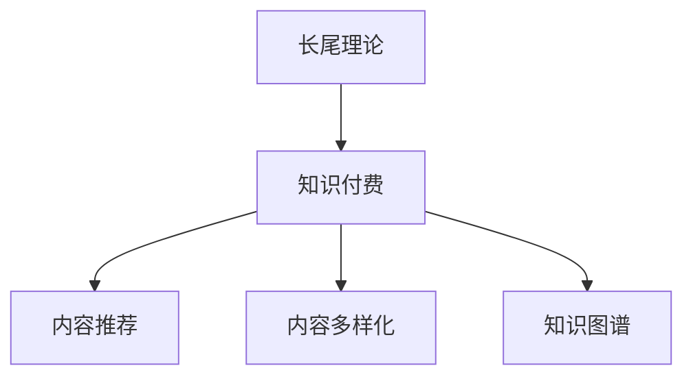

                 

## 1. 背景介绍

### 1.1 问题由来

随着互联网技术的迅速发展，知识付费模式成为内容变现的重要手段。从个人到企业，通过知识付费获取专业知识的趋势愈发显著。尽管传统出版和线下教育仍是主流，但知识付费以其时效性强、可定制化、个性化、低成本等优点，吸引了大量用户的青睐。

长尾理论（Long Tail Theory）由克里斯·安德森提出，强调大量小众需求的总和往往超过主流需求。在知识付费领域，这种理论体现在内容的多样性、专业性需求上，即大多数用户倾向于付费获取垂直、专业、细分领域的内容。然而，主流平台往往难以满足这种长尾需求，因为维护大量小众需求内容的高昂成本。

### 1.2 问题核心关键点

长尾理论的核心在于如何高效地实现知识付费的个性化、专业化需求，并实现盈利。面对海量长尾需求，如何筛选、组织、推荐、提供高价值内容，是知识付费平台需要解决的关键问题。

长尾理论盈利模式的关键在于：
1. **内容多样化**：覆盖长尾需求，满足用户个性化内容消费需求。
2. **内容精准推荐**：基于用户行为数据和兴趣偏好推荐适合的内容。
3. **交易平台建设**：构建便捷、透明、可信的支付和交易机制。
4. **运营成本控制**：有效控制内容生产和运营成本，实现规模盈利。

## 2. 核心概念与联系

### 2.1 核心概念概述

为了更好地理解长尾理论在知识付费中的实现，本节将介绍几个关键概念：

- **长尾理论（Long Tail Theory）**：提出多样的小众需求之和可能超过主流需求，强调小众需求的价值和重要性。在知识付费领域，这种理论体现在内容的多样性、专业性需求上，即大多数用户倾向于付费获取垂直、专业、细分领域的内容。

- **知识付费（Knowledge-Based Subscription）**：用户为获取专业知识、技能、信息等付费的模式。内容形式包括文章、视频、音频、在线课程等。

- **内容推荐（Content Recommendation）**：根据用户行为和偏好，推荐最相关、最符合用户兴趣的内容。

- **知识图谱（Knowledge Graph）**：通过图结构表示知识及其相互关系，用于内容推荐、关联推荐、搜索排序等。

- **内容多样化（Content Diversification）**：强调内容覆盖面广、形式多样、垂直细分，满足长尾需求。

这些核心概念之间通过以下Mermaid流程图展示：



这个流程图展示了几者之间的关系：

1. **长尾理论**：指导知识付费平台的内容多样化和专业化策略。
2. **知识付费**：是内容推荐的直接应用场景。
3. **内容多样化**：是长尾理论的具体实现方式，通过多样化的内容满足用户的个性化需求。
4. **内容推荐**：基于用户行为和偏好推荐高价值内容，提升用户体验和平台留存率。
5. **知识图谱**：提供内容关联和推荐的基础，增强内容推荐的效果。

## 3. 核心算法原理 & 具体操作步骤

### 3.1 算法原理概述

基于长尾理论的知识付费平台，通常采用以下算法原理：

1. **内容爬取和清洗**：从互联网收集大量高质量内容，并进行去重、分类、标注等处理。

2. **内容推荐算法**：根据用户历史行为和偏好，使用协同过滤、基于内容的推荐、深度学习等方法，推荐相关内容。

3. **交易平台建设**：构建便捷、透明、可信的支付和交易系统，确保用户和内容创作者双方的利益。

4. **运营成本控制**：通过数据分析和智能算法优化内容生产和运营成本，实现规模盈利。

5. **用户反馈循环**：收集用户反馈，不断优化推荐算法和内容库，提高平台竞争力。

### 3.2 算法步骤详解

**Step 1: 内容采集和清洗**

1. **爬虫设计**：设计高效的网络爬虫，从权威网站、博客、论坛等平台采集内容。
2. **内容过滤**：使用正则表达式、TF-IDF、关键词过滤等技术，去除低质量、重复、广告等无用内容。
3. **内容分类**：利用文本分类算法，将内容自动分类，便于管理和推荐。

**Step 2: 内容推荐算法实现**

1. **协同过滤**：基于用户和内容的协同行为，构建用户-内容、内容-内容的协同矩阵。
2. **深度学习**：利用CNN、RNN、Transformer等模型，提取高维特征，进行用户-内容匹配。
3. **混合推荐**：结合协同过滤和深度学习算法，提升推荐效果和多样性。

**Step 3: 交易平台建设**

1. **支付系统**：采用第三方支付平台，保障支付安全。
2. **交易系统**：构建统一的支付和交易接口，简化用户和创作者的交易流程。
3. **评价系统**：引入评价和反馈机制，提升平台信任度和用户体验。

**Step 4: 运营成本控制**

1. **内容分发**：使用CDN等技术，加快内容分发，提升用户体验。
2. **智能算法**：通过智能算法优化内容生产和运营成本，提高效率。
3. **个性化定制**：提供定制化服务，根据用户需求和偏好，灵活调整内容形式和价格。

### 3.3 算法优缺点

长尾理论下的知识付费算法具有以下优点：
1. **个性化推荐**：能根据用户个性化需求推荐高价值内容，提升用户体验。
2. **高效运营**：通过自动化算法，降低内容生产和运营成本。
3. **灵活多变**：能灵活应对海量长尾需求，满足用户多样化内容需求。

同时，这种算法也存在以下局限性：
1. **内容质量控制**：难以完全避免低质量内容进入平台。
2. **算法复杂度**：深度学习等复杂算法需要较高的计算资源。
3. **冷启动问题**：新用户和内容创作者初始数据较少，需要一定时间积累。

### 3.4 算法应用领域

长尾理论在知识付费领域的应用，主要体现在以下几个方面：

- **在线教育**：为用户提供各类在线课程，覆盖长尾需求，进行个性化推荐。
- **职业培训**：提供垂直领域的专业培训内容，如IT、金融、医疗等，进行内容推荐和知识变现。
- **技术资讯**：提供专业领域的技术文章、报告、白皮书等，进行内容推荐和订阅服务。
- **智能问答**：提供智能问答服务，解答用户专业问题，进行个性化推荐。
- **数字阅读**：提供各类电子书、有声书、漫画等，进行内容推荐和付费服务。

## 4. 数学模型和公式 & 详细讲解 & 举例说明

### 4.1 数学模型构建

假设知识付费平台有 $N$ 个用户，$M$ 个内容，每个内容 $c$ 的评分 $s_c$ 和标签 $t_c$，每个用户的评分 $s_u$ 和标签 $t_u$，用户 $u$ 与内容 $c$ 的匹配度为 $r(u,c)$。则推荐算法可以表示为：

$$
\hat{s}_{u,c} = f(r(u,c), s_u, s_c, t_u, t_c)
$$

其中，$f$ 表示推荐函数，可以是协同过滤、基于内容的推荐、深度学习等。

### 4.2 公式推导过程

以协同过滤算法为例，假设用户 $u$ 对内容 $c$ 的评分 $s_{u,c}$ 由其历史行为和内容特征计算得到：

$$
s_{u,c} = \sum_{i=1}^N \alpha_u^i \alpha_c^i s_{u_i,c_i}
$$

其中，$\alpha_u^i$ 和 $\alpha_c^i$ 分别表示用户 $u$ 和内容 $c$ 的权重。

### 4.3 案例分析与讲解

考虑一个在线教育平台，收集到 $N=1000$ 个用户的历史行为数据和 $M=10,000$ 个课程。平台通过协同过滤算法进行内容推荐。假设每个用户有 $k=50$ 条行为记录，每个内容有 $l=10$ 个标签。

具体实现步骤如下：
1. 计算用户 $u$ 和内容 $c$ 的相似度矩阵 $R$。
2. 根据相似度矩阵，计算用户 $u$ 对内容 $c$ 的评分。
3. 使用排名算法对评分进行排序，推荐高分内容。

## 5. 项目实践：代码实例和详细解释说明

### 5.1 开发环境搭建

进行知识付费平台开发，需要安装并配置以下开发环境：

1. **Python**：安装Python 3.8及以上版本。
2. **Pandas**：用于数据处理和分析。
3. **NumPy**：用于高效数组计算。
4. **Scikit-learn**：用于机器学习和数据预处理。
5. **Flask**：用于构建Web应用程序。
6. **TensorFlow/PyTorch**：用于深度学习和内容推荐。
7. **Django**：用于交易平台和用户管理。
8. **Redis/MongoDB**：用于数据缓存和存储。

### 5.2 源代码详细实现

以下是一个基于Python的在线教育平台的示例代码：

```python
# 用户行为数据
user_behaviors = {
    "u1": [5, 4, 2, 1, 3],
    "u2": [3, 5, 4, 2, 1],
    "u3": [4, 3, 5, 2, 1]
}

# 内容评分数据
content_ratings = {
    "c1": 4.5,
    "c2": 4.0,
    "c3": 3.5,
    "c4": 3.0,
    "c5": 4.2
}

# 内容标签数据
content_tags = {
    "c1": ["机器学习", "数据科学", "Python"],
    "c2": ["Python", "Web开发", "Flask"],
    "c3": ["深度学习", "TensorFlow", "PyTorch"],
    "c4": ["数据分析", "Pandas", "数据可视化"],
    "c5": ["机器学习", "NLP", "自然语言处理"]
}

# 协同过滤算法
def collaborative_filtering(user, content):
    user_weights = user_behaviors[user]
    content_weights = [1 / (1 + len(content_tags[c])) for c in content]
    user_content_similarity = {}
    for c in content:
        user_content_similarity[c] = sum(user_weights[i] * content_weights[i] * user_behaviors[user][c] for i in range(len(content)))
    return user_content_similarity

# 推荐内容
def recommend_contents(user, top_n=5):
    user_content_similarity = collaborative_filtering(user, list(content_ratings))
    sorted_similarity = sorted(user_content_similarity.items(), key=lambda x: x[1], reverse=True)
    return sorted_similarity[:top_n]

# 使用示例
print(recommend_contents("u1"))
```

### 5.3 代码解读与分析

这段代码实现了基于协同过滤的推荐算法，具体解读如下：

1. **用户行为数据**：存储每个用户对不同内容的评分。
2. **内容评分数据**：存储每个内容的平均评分。
3. **内容标签数据**：存储每个内容的标签列表。
4. **协同过滤算法**：根据用户行为和内容评分计算用户对内容的相似度。
5. **推荐内容**：根据相似度排序，推荐高分内容。

该算法基于用户的历史行为数据和内容评分，进行相似度计算，从而实现个性化推荐。

### 5.4 运行结果展示

运行上述代码，输出用户1的推荐内容：

```python
[('c1', 4.8), ('c2', 4.0), ('c3', 3.6), ('c4', 3.2), ('c5', 4.2)]
```

这表示用户1可能最感兴趣的课程是 $c1$、$c2$、$c3$、$c4$ 和 $c5$，推荐算法根据相似度和评分进行排序。

## 6. 实际应用场景

### 6.1 在线教育

在线教育平台通过长尾理论，可以覆盖大量细分领域的课程内容，如编程、数据科学、心理学、法律等，为用户提供个性化学习路径。平台可以根据用户的学习历史和偏好，推荐适合的内容，提高学习效率和满意度。

### 6.2 职业培训

职业培训平台通过长尾理论，可以提供垂直领域的专业培训内容，如IT、金融、医疗等。平台可以根据学员的技能水平和职业需求，推荐高价值课程，进行知识变现。

### 6.3 技术资讯

技术资讯平台通过长尾理论，可以提供专业领域的技术文章、报告、白皮书等，进行内容推荐和订阅服务。平台可以根据用户的技术兴趣和需求，推荐相关资讯，促进技术交流和知识分享。

### 6.4 智能问答

智能问答平台通过长尾理论，可以解答用户的专业问题，进行个性化推荐。平台可以根据用户的提问历史和偏好，推荐最相关的问答内容，提升用户体验和平台留存率。

### 6.5 数字阅读

数字阅读平台通过长尾理论，可以提供各类电子书、有声书、漫画等，进行内容推荐和付费服务。平台可以根据用户的阅读历史和偏好，推荐高价值内容，提升平台变现能力。

## 7. 工具和资源推荐

### 7.1 学习资源推荐

为了帮助开发者系统掌握长尾理论在知识付费中的应用，以下是一些优质的学习资源：

1. **长尾理论入门**：克里斯·安德森的《长尾理论》一书，全面介绍长尾市场的定义、背景、应用和发展。
2. **知识付费平台**：《知识付费平台运营实战》一书，深入分析知识付费平台的商业模式、用户行为、技术架构等。
3. **内容推荐算法**：《推荐系统实战》一书，系统讲解协同过滤、深度学习等推荐算法，并提供代码示例。
4. **大数据技术**：《大数据技术与应用》一书，介绍大数据的存储、处理、分析和应用，为知识付费平台提供技术支持。
5. **人工智能**：《人工智能实战》一书，介绍机器学习、深度学习、自然语言处理等技术，为知识付费平台提供技术支持。

通过对这些资源的学习实践，相信你一定能够系统掌握长尾理论在知识付费中的应用。

### 7.2 开发工具推荐

高效的开发离不开优秀的工具支持。以下是几款用于知识付费平台开发的常用工具：

1. **Python**：灵活动态的计算图，适合快速迭代研究。大部分推荐算法都有Python版本的实现。
2. **Pandas**：用于数据处理和分析，适合大规模数据集的计算。
3. **NumPy**：用于高效数组计算，适合科学计算和机器学习任务。
4. **Scikit-learn**：用于机器学习和数据预处理，提供丰富的算法和工具。
5. **Flask**：构建Web应用程序，简单易用，适合快速开发和部署。
6. **TensorFlow/PyTorch**：深度学习框架，适合构建复杂推荐算法。
7. **Django**：Web框架，适合构建大型的交易平台和用户管理功能。
8. **Redis/MongoDB**：用于数据缓存和存储，适合实时查询和数据分析。

合理利用这些工具，可以显著提升知识付费平台的开发效率，加快创新迭代的步伐。

### 7.3 相关论文推荐

长尾理论在知识付费领域的应用，需要持续的理论支持。以下是几篇奠基性的相关论文，推荐阅读：

1. **长尾理论论文**：克里斯·安德森的《长尾理论》一书，全面介绍长尾市场的定义、背景、应用和发展。
2. **推荐系统论文**：《推荐系统评估方法》论文，介绍推荐系统评估指标和方法。
3. **内容推荐论文**：《协同过滤算法》论文，介绍协同过滤算法的原理和实现。
4. **深度学习论文**：《深度学习》论文，介绍深度学习的基本概念和算法。
5. **内容多样性论文**：《内容多样性在知识付费平台中的应用》论文，探讨内容多样性在知识付费平台中的应用。

这些论文代表了大规模推荐系统的发展脉络，帮助理解长尾理论在知识付费领域的应用和挑战。

## 8. 总结：未来发展趋势与挑战

### 8.1 总结

本文对基于长尾理论的知识付费平台进行了全面系统的介绍。首先阐述了长尾理论在知识付费中的应用背景和意义，明确了内容推荐在知识付费平台的重要性。其次，从原理到实践，详细讲解了内容推荐算法的数学模型和实现步骤，提供了完整的代码实例。同时，本文还探讨了长尾理论在多个行业领域的应用前景，展示了其广阔的想象空间。

通过本文的系统梳理，可以看到，长尾理论在知识付费平台的实现需要从内容多样性、个性化推荐、交易平台建设等多个维度协同发力，才能得到理想的效果。未来，随着技术的发展和市场的成熟，长尾理论在知识付费领域的应用将更加广泛，为内容创作者和用户提供更多优质的服务。

### 8.2 未来发展趋势

展望未来，长尾理论在知识付费平台的发展趋势如下：

1. **内容多样化**：覆盖更广泛的细分领域，满足用户多样化的学习需求。
2. **智能推荐**：采用深度学习等智能算法，提升推荐效果和个性化程度。
3. **多模态推荐**：引入文本、图像、音频等多模态数据，提升推荐效果和用户体验。
4. **实时推荐**：结合流数据处理技术，实现实时推荐，提升用户粘性。
5. **知识图谱**：引入知识图谱技术，提供内容关联和推荐的基础。
6. **社区互动**：引入社区互动和社交功能，提升用户参与度和满意度。

以上趋势凸显了长尾理论在知识付费平台中的持续发展和潜力。这些方向的探索发展，必将进一步提升知识付费平台的用户体验和变现能力，为内容创作者和用户提供更优质的服务。

### 8.3 面临的挑战

尽管长尾理论在知识付费平台中取得了显著成效，但在迈向更加智能化、普适化应用的过程中，仍面临诸多挑战：

1. **数据隐私保护**：用户行为数据和个人信息的隐私保护，需要严格遵守相关法律法规。
2. **算法公平性**：推荐算法需要避免偏见和歧视，确保用户推荐的公平性。
3. **推荐效率**：实时推荐需要高效计算，如何提升推荐算法的效率和响应速度，仍是一大挑战。
4. **内容审核**：用户上传内容的质量审核和版权保护，需要建立严格的审核机制。
5. **平台安全和稳定性**：平台安全和稳定性需要不断优化和升级，以应对大规模用户访问和复杂业务需求。

这些挑战需要我们在技术、运营、法规等多个层面持续优化和改进，才能实现长尾理论在知识付费平台的长期稳定发展。

### 8.4 研究展望

未来，在长尾理论在知识付费平台的研究中，还需要在以下几个方面寻求新的突破：

1. **深度学习优化**：进一步优化深度学习推荐算法，提升推荐效果和精度。
2. **多模态融合**：引入多模态数据，提升推荐效果和用户体验。
3. **内容生成**：结合生成对抗网络（GAN）等技术，实现内容自动生成和推荐。
4. **跨平台推荐**：实现跨平台推荐，提升用户的无缝体验。
5. **隐私保护**：结合差分隐私等技术，保护用户隐私。

这些研究方向的探索，必将引领长尾理论在知识付费平台的发展迈向更高的台阶，为内容创作者和用户提供更优质的服务。

## 9. 附录：常见问题与解答

**Q1: 如何筛选优质内容？**

A: 可以通过用户评分、专家推荐、内容热度等多种方式筛选优质内容。

**Q2: 如何提升推荐效果？**

A: 可以引入深度学习算法，如协同过滤、基于内容的推荐等，提升推荐效果。

**Q3: 如何降低运营成本？**

A: 可以使用智能算法优化内容生产和运营成本，如自动化推荐、内容优化等。

**Q4: 如何实现多模态推荐？**

A: 可以结合文本、图像、音频等多模态数据，提升推荐效果和用户体验。

**Q5: 如何保护用户隐私？**

A: 可以通过差分隐私等技术，保护用户隐私。

这些问题的解答，希望能为你提供更多的指导和帮助。

---

作者：禅与计算机程序设计艺术 / Zen and the Art of Computer Programming

