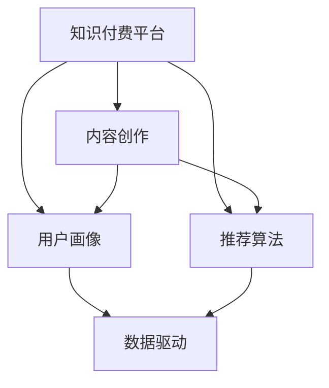

                 

## 1. 背景介绍

在快速发展的知识经济时代，知识付费平台成为了信息时代的重要组成部分，为知识创作者和消费者提供了一个有效的交流平台。然而，随着竞争的加剧，如何在知识付费领域建立独特的竞争优势成为了每一个平台和内容创作者亟需解决的问题。本博文旨在探讨如何通过技术创新、数据驱动、用户画像及推荐算法等方面的深度融合，实现知识付费领域的创新发展，探索知识付费平台的核心竞争力。

## 2. 核心概念与联系

### 2.1 核心概念概述

在知识付费领域，几个关键概念包括：

- **知识付费平台**：通过订阅、购买等方式向用户提供各类知识内容，如课程、文章、音频、视频等。
- **内容创作**：知识创作者（如专家学者、企业培训师、普通爱好者）利用自身专业知识创作内容，满足用户的多样化需求。
- **用户画像**：通过数据分析获取用户特征，识别用户的兴趣偏好、学习习惯等信息，为个性化推荐提供依据。
- **推荐算法**：算法技术构建用户与内容之间的关联网络，通过精准匹配，提高用户满意度和内容曝光率。
- **数据驱动**：利用大数据分析，预测用户需求，优化运营策略，提升平台竞争力。

### 2.2 核心概念原理和架构的 Mermaid 流程图



以上流程图示意了知识付费平台的核心架构，各组件之间的紧密协作使平台能够高效运营。

## 3. 核心算法原理 & 具体操作步骤

### 3.1 算法原理概述

知识付费平台的竞争优势在于其个性化推荐系统。推荐算法主要通过协同过滤、基于内容的推荐和混合推荐等方式，根据用户的历史行为和兴趣，推荐相关内容。本文将重点探讨协同过滤和基于内容的推荐算法。

### 3.2 算法步骤详解

#### 3.2.1 协同过滤算法

**步骤一：构建用户-物品评分矩阵**
首先，收集用户对内容的评分数据，构建用户-物品评分矩阵$R$。每个元素$r_{ui}$表示用户$u$对物品$i$的评分。

**步骤二：构建用户相似度和物品相似度矩阵**
基于用户评分数据，构建用户相似度矩阵$S_{uv}$和物品相似度矩阵$I_{ij}$，通过余弦相似度、皮尔逊相关系数等方法计算用户和物品之间的相似度。

**步骤三：基于相似度计算推荐分数**
利用相似度矩阵计算用户对物品的推荐分数，通过加权求和等方法得到最终的推荐列表。

#### 3.2.2 基于内容的推荐算法

**步骤一：提取特征**
首先，提取内容特征，包括关键词、作者、出版日期等。

**步骤二：构建特征矩阵**
将内容特征构建为特征矩阵$F$，其中每一列表示一个特征，每一行表示一个物品。

**步骤三：计算用户兴趣向量**
根据用户历史行为，计算用户的兴趣向量$P_u$，与内容特征矩阵$F$的元素进行点积，得到用户的兴趣评分。

**步骤四：计算推荐得分**
根据用户兴趣向量$P_u$和内容特征矩阵$F$，计算物品$i$对用户$u$的推荐得分，选取得分较高的物品作为推荐结果。

### 3.3 算法优缺点

**协同过滤算法的优点**：
- 可处理稀疏矩阵，不需要用户特征。
- 对新用户和新物品的推荐效果较好。

**协同过滤算法的缺点**：
- 数据稀疏性影响推荐效果。
- 冷启动问题严重。

**基于内容的推荐算法的优点**：
- 可处理冷启动问题。
- 推荐结果有理论依据，较为可靠。

**基于内容的推荐算法的缺点**：
- 对数据质量要求高。
- 需要较多的特征提取工作。

### 3.4 算法应用领域

协同过滤和基于内容的推荐算法可以应用于多个知识付费领域，如在线课程、专业培训、电子书阅读等。通过精准匹配用户需求，提供个性化的推荐，平台能够显著提升用户满意度和留存率。

## 4. 数学模型和公式 & 详细讲解

### 4.1 数学模型构建

假设知识付费平台有$M$个用户和$N$个物品，用户$u$对物品$i$的评分记为$r_{ui}$，构建用户-物品评分矩阵$R \in \mathbb{R}^{M \times N}$。

协同过滤算法基于矩阵分解$R \approx UV$，其中$U \in \mathbb{R}^{M \times K}$和$V \in \mathbb{R}^{K \times N}$分别为用户和物品的隐向量表示，$K$为隐向量维度。

基于内容的推荐算法主要依赖内容特征矩阵$F \in \mathbb{R}^{N \times D}$，其中$D$为特征维度。

### 4.2 公式推导过程

#### 协同过滤算法
假设用户$u$对物品$i$的评分$r_{ui}$为$R_{ui}$，用户$u$的隐向量表示为$U_u$，物品$i$的隐向量表示为$V_i$。
$$
R_{ui} = U_u^T V_i
$$

**步骤一：** 利用奇异值分解(SVD)，对评分矩阵$R$进行分解：
$$
R \approx UV
$$

**步骤二：** 根据相似度矩阵计算推荐分数。设用户$u$和物品$i$的相似度为$S_{ui}$，则物品$i$对用户$u$的推荐分数为：
$$
\widehat{R_{ui}} = S_{ui} \times V_i^T U_u
$$

#### 基于内容的推荐算法
设用户$u$的兴趣向量为$P_u \in \mathbb{R}^D$，内容特征矩阵$F \in \mathbb{R}^{N \times D}$，物品$i$的特征向量为$F_i \in \mathbb{R}^D$。
$$
P_u = \frac{1}{\sqrt{\sum_{d=1}^D F_{ui}^2}} \sum_{d=1}^D F_{ui} F_{ud}
$$

**步骤一：** 提取内容特征矩阵$F$，计算用户兴趣向量$P_u$。

**步骤二：** 计算物品$i$对用户$u$的推荐分数：
$$
R_{ui} = P_u^T F_i
$$

### 4.3 案例分析与讲解

假设某知识付费平台有1000名用户和1000门课程，用户$u$和课程$i$的评分矩阵$R$如下：

| r_11 | r_12 | ... | r_1N |
| --- | --- | --- | --- |
| ... | ... | ... | ... |
| r_M1 | r_M2 | ... | r_MN |

采用协同过滤算法，设用户相似度矩阵$S_{uv}$和物品相似度矩阵$I_{ij}$的元素均为1。计算用户$u$对课程$i$的推荐分数为：
$$
\widehat{R_{ui}} = 1 \times 1 \times V_i^T U_u
$$

采用基于内容的推荐算法，设内容特征矩阵$F$的元素为1。计算用户$u$对课程$i$的推荐分数为：
$$
P_u = \frac{1}{\sqrt{D}} \sum_{d=1}^D F_{ui} F_{ud}
$$

## 5. 项目实践：代码实例和详细解释说明

### 5.1 开发环境搭建

- 安装Python 3.8及以上版本。
- 安装Pandas、NumPy、Scikit-Learn、SciPy、Matplotlib等常用科学计算库。
- 安装推荐算法库：
  - 协同过滤：`surprise`
  - 基于内容推荐：`lightfm`

### 5.2 源代码详细实现

```python
from surprise import Reader, Dataset, KNNBasic
from surprise.model_selection import cross_validate
from surprise.prediction_algorithms.matrix_factorization import SVD

# 准备数据
reader = Reader(rating_scale=(1, 5))
data = Dataset.load_from_file('data/ratings.csv', reader=reader)

# 协同过滤算法实现
algo = KNNBasic(k=50)
cross_validate(algo, data, measures=['RMSE', 'MAE'], cv=5, verbose=True)

# 基于内容推荐算法实现
from lightfm import LightFM

model = LightFM(factors=10, learning_rate=0.05)
model.fit(train)
predictions = model.predict(test)
print(model.metrics.to_dict())
```

### 5.3 代码解读与分析

协同过滤算法基于用户-物品评分矩阵进行分解，计算用户和物品的隐向量表示。在实际应用中，需要注意评分矩阵的稀疏性，可以通过矩阵填充、降维等技术处理。

基于内容的推荐算法依赖内容特征矩阵，通过用户兴趣向量计算推荐分数。特征提取是推荐算法的关键环节，应根据具体任务选择合适的特征。

### 5.4 运行结果展示

运行代码后，可以得到协同过滤和基于内容的推荐算法的评估指标。通过调整模型参数，优化模型性能，可以得到较好的推荐结果。

## 6. 实际应用场景

### 6.1 在线课程推荐

在线课程平台利用协同过滤算法和基于内容的推荐算法，为用户推荐相关课程。平台可以通过分析用户历史评分、学习行为等数据，为用户提供个性化课程推荐，提升用户粘性和满意度。

### 6.2 电子书阅读推荐

电子书阅读平台基于用户的浏览历史、搜索历史等数据，通过推荐算法推荐相关书籍。平台可以设立专题推荐、作者推荐、出版社推荐等多种推荐方式，满足用户多样化的阅读需求。

### 6.3 专业培训推荐

专业培训平台利用推荐算法，为不同职业用户推荐适合的培训课程。平台通过分析用户职业、技能需求等信息，提供精准的培训推荐，提升用户培训效果和满意度。

### 6.4 未来应用展望

随着推荐算法技术的不断进步，未来的知识付费平台将更加智能和高效。利用强化学习、深度学习等先进技术，平台可以更好地理解用户需求，动态调整推荐策略，实现用户与内容之间的动态匹配。

## 7. 工具和资源推荐

### 7.1 学习资源推荐

1. **《推荐系统》**：
   - 介绍推荐系统的工作原理、算法设计和应用实践。
   - 推荐系统领域的经典教材，适合系统学习和理解推荐算法。

2. **Coursera《Recommender Systems》**：
   - 斯坦福大学的推荐系统课程，涵盖推荐系统的基础理论和算法设计。
   - 提供丰富的学习资源和作业练习，适合深入学习推荐算法。

3. **Kaggle数据集和比赛**：
   - Kaggle上包含大量的推荐系统数据集和比赛，可供数据驱动的推荐算法研究。
   - 通过参加比赛和竞赛，可以获得实战经验和提升算法水平。

### 7.2 开发工具推荐

1. **PyTorch**：
   - 灵活高效的深度学习框架，适合搭建复杂推荐系统。
   - 具备强大的GPU支持，加速模型训练和推理。

2. **TensorFlow**：
   - 谷歌开源的深度学习框架，支持大规模模型训练。
   - 具备丰富的工具和库，方便模型部署和优化。

3. **Scikit-Learn**：
   - 简单易用的机器学习库，支持协同过滤等经典推荐算法。
   - 适合初学者快速上手推荐系统开发。

### 7.3 相关论文推荐

1. **《The BellKor MovieLens Dataset》**：
   - 经典的Kaggle推荐系统数据集，包含用户评分数据，适合推荐算法研究。
   - 提供了详细的论文和数据说明，便于研究和理解推荐算法。

2. **《Contextual Bandits: Exploration, Exploitation and Learning with Linear Policies》**：
   - 介绍强化学习在推荐系统中的应用。
   - 论文提供详细的算法设计和实验结果，具有较高的学术价值。

3. **《A Survey on Multi-View Learning for Recommender Systems》**：
   - 综述多视图学习在推荐系统中的应用。
   - 提供多视图数据的处理和融合方法，提升推荐算法性能。

## 8. 总结：未来发展趋势与挑战

### 8.1 研究成果总结

在知识付费领域，协同过滤和基于内容的推荐算法已经展现出巨大的潜力。通过个性化推荐系统，平台可以提升用户粘性和满意度，扩大用户基础。

### 8.2 未来发展趋势

未来推荐算法将向以下几个方向发展：

1. **深度学习推荐系统**：深度学习在推荐系统中的应用逐渐深入，有望解决传统推荐算法的缺陷，提升推荐效果。
2. **多视图推荐**：利用多模态数据进行推荐，提升推荐算法的准确性和多样性。
3. **强化学习推荐**：通过强化学习进行推荐，优化推荐策略，提升用户满意度和系统效率。
4. **联邦学习**：在数据隐私保护的前提下，利用联邦学习进行推荐系统训练和优化。
5. **解释性推荐**：提升推荐算法的可解释性，增强用户对推荐结果的理解和信任。

### 8.3 面临的挑战

推荐系统在发展过程中，还面临以下几个挑战：

1. **数据质量**：推荐系统对数据质量要求高，数据缺失、噪音等问题会严重影响推荐效果。
2. **冷启动问题**：对于新用户和新物品，推荐系统缺乏足够的信息，难以提供准确的推荐。
3. **模型复杂度**：复杂的推荐模型需要更多的计算资源，模型优化和部署难度较大。
4. **可解释性**：推荐算法的可解释性不足，用户难以理解推荐结果的生成过程。
5. **隐私保护**：推荐系统需要处理大量的用户数据，数据隐私和安全问题亟需解决。

### 8.4 研究展望

未来的研究重点在于：

1. **数据质量提升**：采用数据清洗、数据增强等技术，提升数据质量，增强推荐效果。
2. **冷启动策略**：采用基于内容的推荐、协同过滤等技术，解决冷启动问题。
3. **模型优化**：优化推荐算法的复杂度，降低计算成本，提升模型可解释性。
4. **隐私保护**：采用差分隐私、联邦学习等技术，保障数据隐私和安全。
5. **跨模态推荐**：结合文本、图像、音频等多模态数据，提升推荐系统的多样性和准确性。

## 9. 附录：常见问题与解答

### 9.1 问题1：如何处理推荐系统的稀疏性问题？

**解答**：
- 矩阵填充：对评分矩阵进行填充，增加样本数量，缓解稀疏性。
- 降维技术：利用矩阵分解、奇异值分解等技术，降低矩阵维度。
- 稀疏矩阵算法：利用Spark、Hadoop等分布式计算框架，处理大规模稀疏矩阵。

### 9.2 问题2：如何优化推荐算法的计算效率？

**解答**：
- 并行计算：利用多核CPU、GPU等计算资源，加速模型训练和推理。
- 数据预处理：优化数据加载和预处理，减少计算时间。
- 模型优化：采用高效的模型结构和算法，降低计算复杂度。

### 9.3 问题3：如何在推荐系统中处理新用户和新物品？

**解答**：
- 协同过滤：采用基于内容的推荐，利用用户历史行为和新物品的特征进行推荐。
- 多模态推荐：结合用户的多模态数据（如社交网络、浏览历史、购买记录等），提高推荐效果。

### 9.4 问题4：如何增强推荐算法的可解释性？

**解答**：
- 特征工程：选择具有明确意义的特征，提升模型可解释性。
- 模型可视化：利用可视化工具（如t-SNE、UMAP等）展示模型的特征空间，增强用户理解。
- 解释性算法：采用可解释性较强的推荐算法，如基于规则的推荐系统。

### 9.5 问题5：如何在推荐系统中保护用户隐私？

**解答**：
- 差分隐私：采用差分隐私技术，保护用户隐私信息。
- 联邦学习：利用联邦学习技术，在用户端进行模型训练，降低数据泄露风险。
- 数据脱敏：对用户数据进行匿名化处理，保护用户隐私。

---

作者：禅与计算机程序设计艺术 / Zen and the Art of Computer Programming

