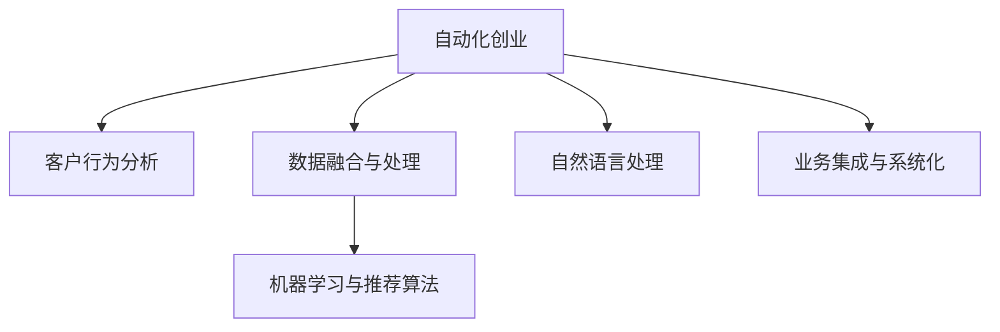

                 

# 如何在自动化创业中实现个性化服务

> 关键词：自动化创业、个性化服务、数据分析、机器学习、自然语言处理、业务集成

## 1. 背景介绍

在数字化转型的浪潮下，自动化创业成为了新的增长引擎。个性化服务作为提升客户满意度和竞争力的关键，越来越受到企业的重视。通过数据分析、机器学习等技术手段，结合自然语言处理和业务集成，企业可以构建高效、精准、个性化的自动化服务体系，提升运营效率和用户体验。

### 1.1 问题由来

自动化创业中，企业往往面临着如何高效、精准地为客户提供个性化服务的需求。传统的方式依赖人工分析，效率低、成本高，难以满足客户日益增长的需求。通过引入数据分析和机器学习技术，企业可以实现自动化、个性化服务，提升客户满意度和企业竞争力。

### 1.2 问题核心关键点

个性化服务的核心在于了解客户需求，并根据客户特点提供量身定制的服务。这涉及以下几个关键点：

- **客户行为分析**：通过对客户行为数据的分析，了解客户偏好和需求。
- **数据融合与处理**：整合不同来源的数据，进行清洗、标准化和集成，形成统一的客户视图。
- **机器学习与推荐算法**：利用机器学习模型分析客户行为数据，生成个性化推荐。
- **自然语言处理**：结合自然语言处理技术，实现客户需求理解和智能回复。
- **业务集成与系统化**：将个性化服务功能集成到企业现有业务系统中，形成闭环。

### 1.3 问题研究意义

在自动化创业中实现个性化服务，有助于企业提升客户满意度，增强市场竞争力，同时降低运营成本。具体而言：

- 提升客户体验：通过个性化推荐和服务，提高客户满意度和忠诚度。
- 提高运营效率：自动化处理大量重复性工作，减少人力投入。
- 创造新业务增长点：个性化服务作为差异化竞争手段，带来新业务机会。
- 强化数据驱动决策：通过数据分析驱动决策，优化运营策略，提升业务绩效。

## 2. 核心概念与联系

### 2.1 核心概念概述

为更好地理解如何在自动化创业中实现个性化服务，本节将介绍几个密切相关的核心概念：

- **自动化创业**：利用技术手段，自动化实现业务流程，提升运营效率和客户体验。
- **客户行为分析**：通过数据挖掘和机器学习技术，分析客户行为数据，挖掘客户需求和偏好。
- **数据融合与处理**：整合不同来源的数据，进行清洗、标准化和集成，形成统一的客户视图。
- **机器学习与推荐算法**：利用机器学习模型分析客户行为数据，生成个性化推荐。
- **自然语言处理**：结合自然语言处理技术，实现客户需求理解和智能回复。
- **业务集成与系统化**：将个性化服务功能集成到企业现有业务系统中，形成闭环。

这些核心概念之间的逻辑关系可以通过以下Mermaid流程图来展示：



这个流程图展示了个性化服务的核心概念及其之间的关系：

1. 自动化创业通过技术手段实现业务自动化。
2. 客户行为分析通过数据挖掘了解客户需求和偏好。
3. 数据融合与处理整合数据源，形成统一的客户视图。
4. 机器学习与推荐算法生成个性化推荐。
5. 自然语言处理实现客户需求理解和智能回复。
6. 业务集成与系统化将个性化服务功能集成到业务系统中。

## 3. 核心算法原理 & 具体操作步骤
### 3.1 算法原理概述

在自动化创业中实现个性化服务，本质上是一个数据驱动的决策优化过程。其核心思想是：通过客户行为数据分析，结合机器学习算法，构建个性化推荐模型，并通过自然语言处理技术实现智能回复，最终将个性化服务功能集成到企业现有业务系统中。

形式化地，假设客户数据集为 $D=\{(x_i, y_i)\}_{i=1}^N$，其中 $x_i$ 为第 $i$ 个客户的行为数据，$y_i$ 为第 $i$ 个客户的个性化需求标签。个性化服务的优化目标是最小化客户满意度的预期损失，即找到最优的个性化推荐模型：

$$
\theta^* = \mathop{\arg\min}_{\theta} E[\ell(\hat{y}, y)]
$$

其中 $\ell(\hat{y}, y)$ 为损失函数，$\hat{y}$ 为个性化推荐模型的预测结果，$y$ 为真实标签。

### 3.2 算法步骤详解

在自动化创业中实现个性化服务的步骤主要包括：

**Step 1: 数据采集与预处理**

- 收集客户行为数据，包括点击记录、浏览历史、购买记录等。
- 对数据进行清洗、去重、标准化等预处理，去除噪声和异常值。
- 整合不同来源的数据，如CRM系统、网站日志、社交媒体等，形成统一的客户视图。

**Step 2: 客户行为分析**

- 通过数据挖掘技术，如聚类、关联规则挖掘等，分析客户行为数据，挖掘客户需求和偏好。
- 利用机器学习算法，如协同过滤、内容推荐、深度学习等，对客户行为数据建模，生成个性化推荐。
- 应用推荐算法，如矩阵分解、梯度提升树、神经网络等，优化推荐模型，提高推荐效果。

**Step 3: 自然语言处理**

- 利用自然语言处理技术，如分词、词性标注、依存句法分析等，实现客户需求理解和智能回复。
- 结合机器翻译、语音识别等技术，实现多语言支持，提升服务泛化能力。
- 应用情感分析、主题建模等技术，增强对客户情感和话题的识别能力。

**Step 4: 业务集成与系统化**

- 将个性化推荐功能集成到企业现有业务系统中，如电商平台、客服系统、营销系统等。
- 应用API接口、消息队列等技术手段，实现不同系统间的协同工作。
- 应用持续集成(CI)和持续部署(CD)工具，实现自动化部署和测试，提升系统稳定性。

**Step 5: 系统优化与评估**

- 实时监测系统性能，通过A/B测试等方法评估推荐效果，优化模型参数。
- 应用反馈机制，根据客户反馈不断改进个性化服务功能，提升用户体验。
- 定期回溯历史数据，评估个性化服务的长期效果，持续优化推荐算法。

### 3.3 算法优缺点

在自动化创业中实现个性化服务的优点在于：

1. **高效性**：通过自动化技术处理大量重复性工作，提高运营效率。
2. **精准性**：利用机器学习算法分析客户数据，生成个性化推荐，提升推荐精度。
3. **灵活性**：通过自然语言处理技术，实现智能回复，提升客户满意度。
4. **可扩展性**：将个性化服务功能集成到现有系统中，实现闭环管理，易于扩展。

缺点在于：

1. **数据依赖**：个性化服务的效果依赖于高质量的数据，获取和处理数据成本较高。
2. **模型复杂**：机器学习模型和自然语言处理技术的实现需要一定的技术积累和资源投入。
3. **隐私风险**：收集和分析客户数据可能涉及隐私问题，需要遵守相关法律法规。
4. **模型可解释性不足**：机器学习模型的决策过程复杂，难以解释其内部逻辑。

尽管存在这些局限性，但就目前而言，个性化服务的自动化实现已经成为企业数字化转型的重要方向，能够显著提升客户体验和企业竞争力。

### 3.4 算法应用领域

在自动化创业中实现个性化服务，已经广泛应用于以下领域：

- **电子商务**：通过个性化推荐系统，提升用户购买转化率。
- **金融服务**：通过智能客服系统，提供个性化理财和投资建议。
- **旅游出行**：通过个性化推荐，提升用户旅游体验，增加预订量。
- **医疗健康**：通过个性化健康管理，提供精准医疗服务，提升用户满意度。
- **教育培训**：通过个性化学习推荐，提升学习效果和用户体验。

## 4. 数学模型和公式 & 详细讲解 & 举例说明

### 4.1 数学模型构建

本节将使用数学语言对自动化创业中个性化服务的实现过程进行更加严格的刻画。

假设客户数据集为 $D=\{(x_i, y_i)\}_{i=1}^N$，其中 $x_i$ 为第 $i$ 个客户的行为数据，$y_i$ 为第 $i$ 个客户的个性化需求标签。定义客户行为数据为 $x_i = (x_{i1}, x_{i2}, \dots, x_{in})$，其中 $x_{ij}$ 为第 $i$ 个客户在第 $j$ 个特征上的值。

定义个性化推荐模型为 $M_{\theta}$，其中 $\theta$ 为模型参数。假设推荐模型的输出为 $y=\hat{y}=M_{\theta}(x)$。推荐模型的损失函数为 $\ell(y,y_i)$，用于衡量推荐结果与真实标签之间的差异。个性化服务的优化目标是最小化客户满意度的预期损失，即找到最优参数：

$$
\theta^* = \mathop{\arg\min}_{\theta} E[\ell(\hat{y}, y)]
$$

在实践中，我们通常使用基于梯度的优化算法（如SGD、Adam等）来近似求解上述最优化问题。设 $\eta$ 为学习率，$\lambda$ 为正则化系数，则参数的更新公式为：

$$
\theta \leftarrow \theta - \eta \nabla_{\theta}\mathcal{L}(\theta) - \eta\lambda\theta
$$

其中 $\nabla_{\theta}\mathcal{L}(\theta)$ 为损失函数对参数 $\theta$ 的梯度，可通过反向传播算法高效计算。

### 4.2 公式推导过程

以下我们以协同过滤算法为例，推导推荐模型的损失函数及其梯度的计算公式。

假设推荐模型的输出为 $\hat{y} = M_{\theta}(x)$，其中 $\theta$ 为模型参数。推荐模型的损失函数为：

$$
\ell(\hat{y}, y) = \frac{1}{N}\sum_{i=1}^N \log(\sigma(\hat{y}_i)) + (1-y_i)\log(1-\sigma(\hat{y}_i))
$$

其中 $\sigma$ 为Sigmoid函数，用于将输出映射到 $(0,1)$ 区间。将损失函数代入预期损失公式，得：

$$
\mathcal{L}(\theta) = \frac{1}{N}\sum_{i=1}^N \left[\log(\sigma(\hat{y}_i)) + (1-y_i)\log(1-\sigma(\hat{y}_i))\right]
$$

根据链式法则，损失函数对参数 $\theta$ 的梯度为：

$$
\frac{\partial \mathcal{L}(\theta)}{\partial \theta} = \frac{1}{N}\sum_{i=1}^N \frac{\partial \log(\sigma(\hat{y}_i))}{\partial \theta} + \frac{1}{N}\sum_{i=1}^N \frac{\partial \log(1-\sigma(\hat{y}_i))}{\partial \theta}
$$

将 $\sigma(\hat{y}_i) = \frac{1}{1+e^{-\hat{y}_i}}$ 代入上述梯度公式，得：

$$
\frac{\partial \mathcal{L}(\theta)}{\partial \theta} = \frac{1}{N}\sum_{i=1}^N \frac{1}{1+e^{\hat{y}_i}}\left(1-\frac{1}{1+e^{\hat{y}_i}}\right)\frac{\partial \hat{y}_i}{\partial \theta}
$$

其中 $\frac{\partial \hat{y}_i}{\partial \theta}$ 可通过反向传播算法计算得到。

在得到损失函数的梯度后，即可带入参数更新公式，完成模型的迭代优化。重复上述过程直至收敛，最终得到适应个性化服务需求的推荐模型参数 $\theta^*$。

## 5. 项目实践：代码实例和详细解释说明

### 5.1 开发环境搭建

在进行个性化服务开发前，我们需要准备好开发环境。以下是使用Python进行PyTorch开发的环境配置流程：

1. 安装Anaconda：从官网下载并安装Anaconda，用于创建独立的Python环境。

2. 创建并激活虚拟环境：
```bash
conda create -n pytorch-env python=3.8 
conda activate pytorch-env
```

3. 安装PyTorch：根据CUDA版本，从官网获取对应的安装命令。例如：
```bash
conda install pytorch torchvision torchaudio cudatoolkit=11.1 -c pytorch -c conda-forge
```

4. 安装TensorFlow：
```bash
pip install tensorflow
```

5. 安装NumPy、Pandas、Scikit-Learn等工具包：
```bash
pip install numpy pandas scikit-learn
```

6. 安装PyTorch库：
```bash
pip install torch torchvision torchaudio
```

完成上述步骤后，即可在`pytorch-env`环境中开始个性化服务开发。

### 5.2 源代码详细实现

下面是使用PyTorch实现协同过滤推荐系统的代码示例：

```python
import torch
import torch.nn as nn
import torch.optim as optim
from sklearn.datasets import make_biclusters
from sklearn.metrics import precision_score, recall_score, f1_score

# 构建数据集
n_users, n_items, n_clusters = 100, 20, 5
X, Y = make_biclusters(n_samples=n_users, n_features=n_items, n_clusters=n_clusters, random_state=42)

# 将数据转换为张量
X_tensor = torch.tensor(X)
Y_tensor = torch.tensor(Y)

# 构建模型
class CollaborativeFiltering(nn.Module):
    def __init__(self, n_users, n_items, n_clusters):
        super(CollaborativeFiltering, self).__init__()
        self.n_users = n_users
        self.n_items = n_items
        self.n_clusters = n_clusters
        self.user_embeddings = nn.Embedding(n_users, n_clusters)
        self.item_embeddings = nn.Embedding(n_items, n_clusters)
        self.prediction = nn.Linear(n_clusters, 1)
    
    def forward(self, user_idx, item_idx):
        user_embeddings = self.user_embeddings(user_idx)
        item_embeddings = self.item_embeddings(item_idx)
        scores = torch.bmm(user_embeddings, item_embeddings.transpose(1, 2))
        scores = self.prediction(scores)
        return scores
    
# 定义损失函数
def loss_function(y_true, y_pred):
    return nn.BCELoss()(y_pred, y_true)

# 训练模型
def train_model(model, X_tensor, Y_tensor, epochs=10, learning_rate=0.01):
    optimizer = optim.Adam(model.parameters(), lr=learning_rate)
    for epoch in range(epochs):
        for i in range(X_tensor.shape[0]):
            user_idx = X_tensor[i, :]
            item_idx = X_tensor[i, :]
            y_true = Y_tensor[i, :]
            y_pred = model(user_idx, item_idx)
            loss = loss_function(y_true, y_pred)
            optimizer.zero_grad()
            loss.backward()
            optimizer.step()
        print(f"Epoch {epoch+1}, loss: {loss.item()}")

# 加载模型并进行预测
model = CollaborativeFiltering(n_users, n_items, n_clusters)
train_model(model, X_tensor, Y_tensor)
y_pred = model(X_tensor)
print(f"Precision: {precision_score(Y_tensor, y_pred.data.numpy(), average='macro')}")
print(f"Recall: {recall_score(Y_tensor, y_pred.data.numpy(), average='macro')}")
print(f"F1-score: {f1_score(Y_tensor, y_pred.data.numpy(), average='macro')}")
```

### 5.3 代码解读与分析

让我们再详细解读一下关键代码的实现细节：

**CollaborativeFiltering类**：
- `__init__`方法：初始化用户、物品和簇的数量，以及模型参数。
- `forward`方法：定义前向传播过程，计算用户-物品评分矩阵，并输出预测评分。

**loss_function函数**：
- 定义二分类交叉熵损失函数，用于衡量模型预测与真实标签之间的差异。

**train_model函数**：
- 定义训练过程，通过Adam优化器更新模型参数。
- 在每个epoch内，对数据集进行批次化加载，计算损失并反向传播。
- 输出每个epoch的损失，显示训练进度。

**代码示例总结**：
- 使用PyTorch定义协同过滤推荐模型，通过前向传播和反向传播完成训练。
- 应用二分类交叉熵损失函数，评估模型预测性能。
- 通过Adam优化器更新模型参数，实现模型迭代优化。
- 结合sklearn评估指标，对模型预测效果进行评估。

## 6. 实际应用场景
### 6.1 智能客服系统

基于个性化服务的智能客服系统，可以实现对客户需求的快速响应和精准服务。系统通过分析客户历史行为数据，预测客户需求，并根据预测结果生成智能回复，提升客户满意度。

在技术实现上，可以收集客户的历史咨询记录、反馈信息等，将问题-回答对作为监督数据，训练推荐模型进行客户需求预测。在实际应用中，系统根据客户当前的问题，预测其最可能感兴趣的回答，并自动选择回答内容进行回复。对于新问题，系统可以通过检索系统实时搜索相关内容，动态生成回答，提升客户体验。

### 6.2 个性化推荐系统

在电商、视频、音乐等平台，个性化推荐系统已成为提升用户体验的重要手段。通过分析用户行为数据，推荐系统可以生成个性化推荐内容，提升用户购买、观看、播放等行为转化率。

在技术实现上，可以收集用户的浏览记录、购买记录、评分数据等，将物品-评分对作为监督数据，训练协同过滤、内容推荐等推荐模型。系统根据用户的当前行为，预测其最感兴趣的物品，并生成推荐列表，提升用户满意度和转化率。

### 6.3 个性化健康管理

在医疗健康领域，个性化服务可以提供精准的健康管理方案，提升用户体验和满意度。通过分析用户的健康数据、生活习惯等，推荐系统可以生成个性化的健康建议和治疗方案。

在技术实现上，可以收集用户的健康数据、饮食记录、运动数据等，将健康数据-建议对作为监督数据，训练推荐模型进行个性化健康建议推荐。系统根据用户的健康数据，预测其最可能感兴趣的健康建议，并生成推荐列表，提升用户健康水平和生活质量。

## 7. 工具和资源推荐
### 7.1 学习资源推荐

为了帮助开发者系统掌握个性化服务的理论基础和实践技巧，这里推荐一些优质的学习资源：

1. 《推荐系统实践》系列博文：由大模型技术专家撰写，深入浅出地介绍了推荐系统原理、算法、应用等前沿话题。

2. 《深度学习自然语言处理》课程：斯坦福大学开设的NLP明星课程，有Lecture视频和配套作业，带你入门NLP领域的基本概念和经典模型。

3. 《深度学习与推荐系统》书籍：深度学习与推荐系统的系统讲解，涵盖协同过滤、深度学习、强化学习等推荐算法。

4. TensorFlow官方文档：TensorFlow配套的官方文档，提供了丰富的API接口和样例代码，是上手实践的必备资料。

5. Kaggle：全球知名的数据科学竞赛平台，提供丰富的推荐系统比赛和数据集，助力开发者实践和创新。

通过对这些资源的学习实践，相信你一定能够快速掌握个性化服务的精髓，并用于解决实际的NLP问题。

### 7.2 开发工具推荐

高效的开发离不开优秀的工具支持。以下是几款用于个性化服务开发的常用工具：

1. PyTorch：基于Python的开源深度学习框架，灵活动态的计算图，适合快速迭代研究。大部分预训练语言模型都有PyTorch版本的实现。

2. TensorFlow：由Google主导开发的开源深度学习框架，生产部署方便，适合大规模工程应用。同样有丰富的预训练语言模型资源。

3. Scikit-Learn：Python科学计算库，提供了丰富的机器学习算法和数据处理工具，是数据分析和建模的得力助手。

4. Weights & Biases：模型训练的实验跟踪工具，可以记录和可视化模型训练过程中的各项指标，方便对比和调优。与主流深度学习框架无缝集成。

5. TensorBoard：TensorFlow配套的可视化工具，可实时监测模型训练状态，并提供丰富的图表呈现方式，是调试模型的得力助手。

合理利用这些工具，可以显著提升个性化服务开发的效率，加快创新迭代的步伐。

### 7.3 相关论文推荐

个性化服务的研究源于学界的持续研究。以下是几篇奠基性的相关论文，推荐阅读：

1. collaborative filtering for implicit feedback datasets（SVD算法）：提出基于矩阵分解的协同过滤算法，用于推荐系统。

2. Matrix factorization techniques for recommender systems：综述了矩阵分解在推荐系统中的应用，介绍了多种矩阵分解算法。

3. BPR: bayesian personalized ranking from implicit feedback：提出基于贝叶斯概率模型的协同过滤算法，用于推荐系统。

4. Deep BPR：提出基于深度学习的协同过滤算法，提升了推荐系统的效果。

5. Factorization Machines for Personalized Recommendation：提出基于因子分解机的推荐算法，融合了深度学习与矩阵分解的思想。

这些论文代表了个性化服务的研究进展，通过学习这些前沿成果，可以帮助研究者把握学科前进方向，激发更多的创新灵感。

## 8. 总结：未来发展趋势与挑战

### 8.1 总结

本文对在自动化创业中实现个性化服务的方法进行了全面系统的介绍。首先阐述了个性化服务的背景和意义，明确了微调在提升客户满意度、提升运营效率方面的独特价值。其次，从原理到实践，详细讲解了个性化服务的数学原理和关键步骤，给出了个性化服务任务开发的完整代码实例。同时，本文还广泛探讨了个性化服务在智能客服、个性化推荐、健康管理等多个行业领域的应用前景，展示了个性化服务范式的巨大潜力。此外，本文精选了个性化服务的各类学习资源，力求为读者提供全方位的技术指引。

通过本文的系统梳理，可以看到，在自动化创业中实现个性化服务已经成为企业数字化转型的重要方向，能够显著提升客户体验和企业竞争力。未来，伴随个性化服务技术的不断发展，在更多领域得到应用，为传统行业带来变革性影响。

### 8.2 未来发展趋势

展望未来，个性化服务技术将呈现以下几个发展趋势：

1. 数据驱动的决策优化。通过数据挖掘和机器学习技术，不断优化个性化推荐算法，提升服务效果。

2. 多模态信息融合。将文本、图像、语音等多模态信息结合，提升对用户需求的理解和预测能力。

3. 实时数据处理。通过流式计算和大数据技术，实现对实时数据的快速分析和处理，提升服务响应速度。

4. 跨领域知识整合。将知识图谱、逻辑规则等专家知识与推荐算法结合，提升模型的智能水平。

5. 个性化服务与业务集成。将个性化服务功能集成到企业现有业务系统中，形成闭环管理，提升运营效率。

这些趋势凸显了个性化服务技术的广阔前景。这些方向的探索发展，必将进一步提升企业客户满意度，增强市场竞争力。

### 8.3 面临的挑战

尽管个性化服务技术已经取得了瞩目成就，但在迈向更加智能化、普适化应用的过程中，它仍面临着诸多挑战：

1. 数据依赖。个性化服务的效果依赖于高质量的数据，获取和处理数据成本较高。

2. 模型复杂。机器学习模型和自然语言处理技术的实现需要一定的技术积累和资源投入。

3. 隐私风险。收集和分析客户数据可能涉及隐私问题，需要遵守相关法律法规。

4. 模型可解释性不足。机器学习模型的决策过程复杂，难以解释其内部逻辑。

5. 实时性要求高。实时数据处理对计算资源和系统架构提出了更高要求。

尽管存在这些局限性，但就目前而言，个性化服务的自动化实现已经成为企业数字化转型的重要方向，能够显著提升客户体验和企业竞争力。未来，随着技术的不断发展，这些挑战终将一一被克服，个性化服务必将在构建人机协同的智能时代中扮演越来越重要的角色。

### 8.4 研究展望

面对个性化服务技术面临的挑战，未来的研究需要在以下几个方面寻求新的突破：

1. 探索无监督和半监督个性化服务方法。摆脱对大规模标注数据的依赖，利用自监督学习、主动学习等无监督和半监督范式，最大限度利用非结构化数据。

2. 研究参数高效和计算高效的个性化服务范式。开发更加参数高效的个性化服务方法，在固定大部分预训练参数的同时，只更新极少量的任务相关参数。同时优化个性化服务模型的计算图，减少前向传播和反向传播的资源消耗。

3. 引入因果和对比学习范式。通过引入因果推断和对比学习思想，增强个性化服务模型建立稳定因果关系的能力，学习更加普适、鲁棒的语言表征，从而提升模型泛化性和抗干扰能力。

4. 结合因果分析和博弈论工具。将因果分析方法引入个性化服务模型，识别出模型决策的关键特征，增强输出解释的因果性和逻辑性。借助博弈论工具刻画人机交互过程，主动探索并规避模型的脆弱点，提高系统稳定性。

5. 纳入伦理道德约束。在个性化服务模型的训练目标中引入伦理导向的评估指标，过滤和惩罚有偏见、有害的输出倾向。同时加强人工干预和审核，建立模型行为的监管机制，确保输出符合人类价值观和伦理道德。

这些研究方向的探索，必将引领个性化服务技术迈向更高的台阶，为构建安全、可靠、可解释、可控的智能系统铺平道路。面向未来，个性化服务技术还需要与其他人工智能技术进行更深入的融合，如知识表示、因果推理、强化学习等，多路径协同发力，共同推动个性化服务系统的进步。只有勇于创新、敢于突破，才能不断拓展个性化服务的边界，让智能技术更好地造福人类社会。

## 9. 附录：常见问题与解答

**Q1：如何评估个性化服务的推荐效果？**

A: 个性化服务的推荐效果可以通过多种评估指标进行衡量，主要包括：

1. **精确度(Precision)**：衡量推荐结果中与真实标签相符的样本比例，即 $Precision = \frac{TP}{TP+FP}$，其中 $TP$ 为推荐结果中与真实标签相符的样本数，$FP$ 为误报的样本数。

2. **召回率(Recall)**：衡量推荐结果中真实标签样本被覆盖的比例，即 $Recall = \frac{TP}{TP+FN}$，其中 $TN$ 为误报的样本数，$FN$ 为漏报的样本数。

3. **F1分数(F1-score)**：精确度和召回率的调和平均数，即 $F1-score = \frac{2 \times Precision \times Recall}{Precision + Recall}$。

4. **准确率(Accuracy)**：衡量推荐结果中与真实标签相符的样本比例，即 $Accuracy = \frac{TP + TN}{TP + TN + FP + FN}$。

5. **ROC曲线和AUC指标**：通过绘制ROC曲线和计算AUC值，衡量模型在不同阈值下的性能表现。

6. **排序误差指标(MAE)**：衡量推荐结果排序的准确性，即 $MAE = \frac{1}{N} \sum_{i=1}^N |y_i - \hat{y}_i|$，其中 $y_i$ 为真实标签，$\hat{y}_i$ 为推荐结果。

通过应用这些评估指标，可以全面评估个性化服务的推荐效果，指导模型的迭代优化。

**Q2：如何提高个性化服务的实时性？**

A: 提高个性化服务的实时性需要从多个方面进行优化：

1. **数据预处理**：通过数据预处理技术，如数据清洗、特征提取等，优化数据输入流程，减少数据处理时间。

2. **模型优化**：通过模型压缩、剪枝、量化等技术，减小模型尺寸，提高模型计算效率。

3. **硬件加速**：利用GPU、TPU等高性能设备，加速模型推理和计算。

4. **分布式计算**：通过分布式计算技术，如MapReduce、Spark等，实现并行计算，提高系统处理能力。

5. **缓存技术**：通过缓存技术，如Redis、Memcached等，缓存常用数据和计算结果，减少重复计算。

6. **流式计算**：通过流式计算技术，实时处理数据流，提升系统响应速度。

通过综合应用这些技术手段，可以有效提高个性化服务的实时性，满足客户对即时反馈的需求。

**Q3：如何保护个性化服务的隐私性？**

A: 保护个性化服务的隐私性需要从多个方面进行考虑：

1. **数据脱敏**：在数据收集和处理过程中，对敏感数据进行脱敏处理，保护用户隐私。

2. **访问控制**：通过访问控制技术，限制对敏感数据的访问权限，防止数据泄露。

3. **加密技术**：在数据传输和存储过程中，采用加密技术，保护数据安全。

4. **匿名化处理**：通过匿名化处理，将用户数据与真实身份分离，保护用户隐私。

5. **隐私保护算法**：采用隐私保护算法，如差分隐私、同态加密等，保护用户数据隐私。

6. **法律法规**：遵守相关法律法规，如GDPR、CCPA等，保护用户隐私权利。

通过综合应用这些隐私保护手段，可以有效保护个性化服务的隐私性，满足用户对隐私保护的需求。

---

作者：禅与计算机程序设计艺术 / Zen and the Art of Computer Programming

