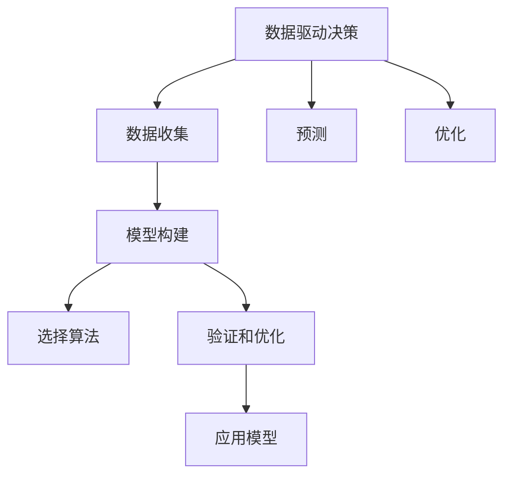

                 

# 如何将模型思维应用于实际管理

> 关键词：模型思维,实际管理,算法优化,项目管理,流程控制

## 1. 背景介绍

### 1.1 问题由来
在当今快速变化的商业环境中，企业需要不断调整其业务策略以适应新的市场动态。然而，这些决策往往涉及复杂的变量和不确定性，传统的经验决策模式已无法满足需求。模型思维（Model Thinking）作为一种新兴的决策工具，正逐渐被企业所采用。模型思维利用数学模型和算法对现实世界进行建模，以优化决策过程，提高管理效率。

### 1.2 问题核心关键点
模型思维的核心关键点在于通过建立模型对业务变量进行量化，并利用算法优化决策。具体而言，模型的构建过程需要：
- 收集和整理数据。
- 确定模型参数和变量。
- 选择合适的算法进行建模。
- 验证和优化模型。
- 应用模型进行决策。

## 2. 核心概念与联系

### 2.1 核心概念概述

为更好地理解模型思维在实际管理中的应用，本节将介绍几个关键概念及其联系：

- **数据驱动决策（Data-Driven Decision Making）**：指通过数据分析和建模，辅助或代替经验决策。其核心是利用数据建立模型，使决策过程更加科学和客观。

- **模型（Model）**：指用于模拟真实世界现象的数学表示形式。在管理中，模型可以是简化的线性回归、非线性模型、机器学习模型等。

- **算法（Algorithm）**：指解决问题的计算过程。在模型思维中，算法用于构建和优化模型。

- **预测（Prediction）**：指利用模型对未来事件进行预测。在管理中，预测可用于市场趋势预测、客户行为分析、库存管理等。

- **优化（Optimization）**：指通过算法在一定条件下寻找最优解。在管理中，优化可用于资源配置、成本控制、供应链管理等。

这些概念之间的逻辑关系可以通过以下Mermaid流程图来展示：



这个流程图展示了从数据驱动决策到模型构建、算法选择、验证优化，再到预测和优化的全流程。

## 3. 核心算法原理 & 具体操作步骤
### 3.1 算法原理概述

模型思维的算法原理通常包括以下几个步骤：

- **数据预处理**：对原始数据进行清洗、整理和转换，以便于模型训练。
- **模型构建**：选择合适的模型结构和参数，构建模型。
- **训练和优化**：利用训练数据集对模型进行训练，并通过验证集进行模型验证和参数优化。
- **模型应用**：将训练好的模型应用于实际管理问题，进行预测和决策。

在模型构建和训练过程中，选择合适的算法至关重要。常用的算法包括：
- **回归算法**：用于预测连续数值型变量。如线性回归、岭回归、随机森林回归等。
- **分类算法**：用于预测离散分类变量。如逻辑回归、决策树、支持向量机等。
- **聚类算法**：用于对数据进行分组。如K-Means、层次聚类等。
- **关联规则算法**：用于发现变量间的关联关系。如Apriori、FP-Growth等。
- **时间序列算法**：用于预测时间序列数据。如ARIMA、LSTM等。

### 3.2 算法步骤详解

以线性回归算法为例，我们详细讲解其操作步骤：

**Step 1: 数据预处理**

- 收集数据集：数据来源可以是企业内部数据、公开数据集、爬虫抓取等。
- 数据清洗：删除缺失值、异常值、重复值等。
- 数据转换：对数据进行归一化、标准化、离散化等处理。

**Step 2: 模型构建**

- 确定变量：选择自变量和因变量，通常自变量代表影响因变量的因素。
- 确定模型：选择线性回归模型。
- 参数初始化：初始化模型参数，如截距、斜率等。

**Step 3: 训练和优化**

- 数据分割：将数据集分为训练集和验证集。
- 模型训练：利用训练集对模型进行训练。
- 参数优化：通过梯度下降等算法优化模型参数，最小化误差。
- 模型验证：在验证集上验证模型的泛化能力，调整模型参数。

**Step 4: 模型应用**

- 预测：利用训练好的模型进行预测。
- 决策：结合实际业务场景，制定决策方案。

### 3.3 算法优缺点

模型思维在实际管理中的应用具有以下优点：
1. 数据驱动：利用数据进行决策，提高决策的科学性和客观性。
2. 模型验证：通过验证集评估模型性能，避免过拟合。
3. 预测和优化：提高预测精度，优化资源配置。
4. 灵活性：多种算法可供选择，适用于不同场景。

同时，该方法也存在一定的局限性：
1. 数据质量要求高：数据质量直接影响模型性能，数据收集和清洗难度大。
2. 模型复杂度高：构建和训练模型需要较高的技术和资源投入。
3. 模型解释性不足：模型结果往往缺乏直观解释，影响业务理解。
4. 实际应用复杂：将模型应用于实际管理，需要综合考虑业务场景和模型结果。

尽管存在这些局限性，但就目前而言，模型思维在实际管理中的应用前景广阔，正逐渐成为企业管理决策的重要工具。

### 3.4 算法应用领域

模型思维在实际管理中的应用领域广泛，以下是几个典型场景：

- **财务预测**：利用时间序列算法对企业财务数据进行预测，如收入、成本、利润等。
- **销售预测**：利用回归算法对市场需求、销售量进行预测，指导库存管理和销售策略。
- **客户细分**：利用聚类算法对客户进行分组，制定差异化营销策略。
- **风险评估**：利用分类算法对贷款、保险等高风险业务进行风险评估和控制。
- **供应链优化**：利用优化算法对供应链进行资源配置和流程控制，降低成本，提高效率。

## 4. 数学模型和公式 & 详细讲解  
### 4.1 数学模型构建

线性回归模型的数学公式如下：

$$
y = \beta_0 + \beta_1 x_1 + \beta_2 x_2 + \cdots + \beta_n x_n + \epsilon
$$

其中，$y$ 为因变量，$x_i$ 为自变量，$\beta_i$ 为回归系数，$\epsilon$ 为误差项。线性回归模型的目标是最小化误差项的平方和。

### 4.2 公式推导过程

线性回归模型的推导过程如下：

1. 确定模型：
   - 假设因变量 $y$ 与自变量 $x_1, x_2, \cdots, x_n$ 呈线性关系。
   - 设定模型为 $y = \beta_0 + \beta_1 x_1 + \beta_2 x_2 + \cdots + \beta_n x_n + \epsilon$。

2. 设定目标函数：
   - 最小化误差项的平方和 $J(\beta_0, \beta_1, \cdots, \beta_n) = \frac{1}{2} \sum_{i=1}^n (y_i - (\beta_0 + \beta_1 x_{1i} + \beta_2 x_{2i} + \cdots + \beta_n x_{ni}))^2$。

3. 求偏导数：
   - 对每个回归系数求偏导数，得到：
   $$
   \frac{\partial J}{\partial \beta_j} = -\sum_{i=1}^n (y_i - (\beta_0 + \beta_1 x_{1i} + \beta_2 x_{2i} + \cdots + \beta_n x_{ni}))
   $$

4. 求解线性方程组：
   - 解方程组 $\frac{\partial J}{\partial \beta_j} = 0$，得到回归系数 $\beta_0, \beta_1, \cdots, \beta_n$。

### 4.3 案例分析与讲解

假设某公司想要预测未来的销售额。收集了过去五年销售额及其影响因素数据，构建线性回归模型：

$$
y = \beta_0 + \beta_1 x_1 + \beta_2 x_2 + \beta_3 x_3 + \epsilon
$$

其中，$y$ 为销售额，$x_1$ 为广告支出，$x_2$ 为产品成本，$x_3$ 为市场竞争程度。利用历史数据对模型进行训练和优化，得到最优回归系数 $\beta_0, \beta_1, \beta_2, \beta_3$。

根据训练好的模型，可以对未来的销售额进行预测，指导企业制定销售策略。

## 5. 项目实践：代码实例和详细解释说明
### 5.1 开发环境搭建

在进行模型思维项目实践前，我们需要准备好开发环境。以下是使用Python进行Scikit-learn开发的环境配置流程：

1. 安装Anaconda：从官网下载并安装Anaconda，用于创建独立的Python环境。

2. 创建并激活虚拟环境：
```bash
conda create -n model-env python=3.8 
conda activate model-env
```

3. 安装Scikit-learn：
```bash
pip install scikit-learn
```

4. 安装各类工具包：
```bash
pip install numpy pandas matplotlib scikit-learn statsmodels jupyter notebook ipython
```

完成上述步骤后，即可在`model-env`环境中开始项目实践。

### 5.2 源代码详细实现

以下是利用Scikit-learn进行线性回归模型开发的PyTorch代码实现：

```python
import pandas as pd
from sklearn.linear_model import LinearRegression
from sklearn.metrics import mean_squared_error
import matplotlib.pyplot as plt

# 数据预处理
data = pd.read_csv('sales_data.csv')
data = data.dropna()  # 删除缺失值
X = data[['ad_cost', 'prod_cost', 'competition']]  # 自变量
y = data['sales']  # 因变量

# 模型构建和训练
model = LinearRegression()
model.fit(X, y)

# 模型验证和预测
y_pred = model.predict(X)
mse = mean_squared_error(y, y_pred)

# 输出结果
print('训练误差：', mse)
plt.scatter(y, y_pred)
plt.xlabel('实际销售额')
plt.ylabel('预测销售额')
plt.show()
```

### 5.3 代码解读与分析

让我们再详细解读一下关键代码的实现细节：

**数据预处理**

- `data.read_csv()`方法：从CSV文件中读取数据集。
- `data.dropna()`方法：删除包含缺失值的行。
- `X`和`y`变量：分别表示自变量和因变量。

**模型构建和训练**

- `LinearRegression()`方法：创建线性回归模型对象。
- `model.fit(X, y)`方法：利用训练集对模型进行拟合。

**模型验证和预测**

- `y_pred`变量：表示模型对因变量的预测值。
- `mean_squared_error()`方法：计算预测值与实际值之间的均方误差。
- `plt.scatter()`方法：绘制实际值与预测值的关系图。

**输出结果**

- `print()`方法：输出均方误差。
- `plt.show()`方法：显示绘制的散点图。

可以看到，通过Scikit-learn，我们可以用相对简洁的代码实现线性回归模型的开发和应用。

## 6. 实际应用场景
### 6.1 智能制造

在智能制造领域，模型思维可以用于优化生产流程、提高设备利用率、降低成本等。通过收集历史生产数据，构建预测模型，可以实现对生产线的实时监控和调整，提高生产效率和产品质量。

### 6.2 零售行业

在零售行业，模型思维可以用于优化库存管理、制定促销策略、提高客户满意度等。通过构建销售预测模型，可以准确预测市场需求，优化库存水平，减少缺货或积压情况。同时，利用客户行为分析模型，可以制定个性化的营销策略，提高客户忠诚度和销售额。

### 6.3 金融服务

在金融服务领域，模型思维可以用于风险管理、投资决策、客户分析等。通过构建信用评分模型，可以评估客户的信用风险，优化贷款审批流程。利用市场预测模型，可以预测股票、债券等金融产品的走势，指导投资决策。通过客户行为分析模型，可以识别潜在客户，提高营销效果。

### 6.4 未来应用展望

随着模型思维的不断发展，其在实际管理中的应用前景将更加广阔。未来可能的应用方向包括：

- **智能城市管理**：利用模型思维优化交通、能源、公共安全等城市运行系统。
- **医疗健康**：构建预测模型，优化诊疗流程，提高诊断准确性。
- **教育培训**：利用模型分析学生表现，制定个性化教学方案，提高教学效果。
- **物流运输**：优化货物运输路径，提高运输效率和降低成本。
- **环境保护**：利用模型预测环境变化，制定环境保护措施，提高环境治理效果。

## 7. 工具和资源推荐
### 7.1 学习资源推荐

为了帮助开发者系统掌握模型思维的理论基础和实践技巧，这里推荐一些优质的学习资源：

1. 《统计学习基础》（Pearson）：由李航等人编写，介绍了统计学习的基本概念和算法。
2. 《机器学习实战》（Peter Harrington）：提供了机器学习算法的Python实现，适合实践学习。
3. 《Python数据科学手册》（Jake VanderPlas）：介绍了Python数据科学库的使用方法和实践案例。
4. Coursera《机器学习》课程：由斯坦福大学Andrew Ng教授主讲，介绍了机器学习的基本原理和算法。
5. Kaggle竞赛平台：提供了大量数据集和竞赛任务，适合实战练习。

通过对这些资源的学习实践，相信你一定能够快速掌握模型思维的精髓，并用于解决实际的业务问题。
### 7.2 开发工具推荐

高效的开发离不开优秀的工具支持。以下是几款用于模型思维开发的常用工具：

1. Scikit-learn：基于Python的科学计算库，提供了丰富的机器学习算法实现。
2. TensorFlow：由Google主导开发的开源深度学习框架，生产部署方便，适合大规模工程应用。
3. PyTorch：基于Python的深度学习框架，灵活易用，适合研究和原型开发。
4. Weights & Biases：模型训练的实验跟踪工具，可以记录和可视化模型训练过程中的各项指标，方便对比和调优。
5. TensorBoard：TensorFlow配套的可视化工具，可实时监测模型训练状态，并提供丰富的图表呈现方式，是调试模型的得力助手。

合理利用这些工具，可以显著提升模型思维项目的开发效率，加快创新迭代的步伐。

### 7.3 相关论文推荐

模型思维的研究源于学界的持续研究。以下是几篇奠基性的相关论文，推荐阅读：

1. A Course in Machine Learning（Andrew Ng）：斯坦福大学的入门课程，介绍了机器学习的基本概念和算法。
2. Learning from Data（Peter Flach）：介绍了机器学习模型的构建和应用。
3. Machine Learning Yearning（Andrew Ng）：提供了机器学习项目开发的最佳实践和经验总结。
4. Pattern Recognition and Machine Learning（Christopher Bishop）：介绍了模式识别和机器学习的基本原理。
5. Deep Learning（Ian Goodfellow）：介绍了深度学习的基本原理和算法。

这些论文代表了大语言模型微调技术的发展脉络。通过学习这些前沿成果，可以帮助研究者把握学科前进方向，激发更多的创新灵感。

## 8. 总结：未来发展趋势与挑战

### 8.1 总结

本文对模型思维在实际管理中的应用进行了全面系统的介绍。首先阐述了模型思维的研究背景和意义，明确了模型思维在企业管理决策中的重要地位。其次，从原理到实践，详细讲解了模型构建、算法选择、数据预处理等关键步骤，给出了模型思维项目开发的完整代码实例。同时，本文还探讨了模型思维在多个行业领域的应用前景，展示了模型思维范式的巨大潜力。此外，本文精选了模型思维技术的各类学习资源，力求为读者提供全方位的技术指引。

通过本文的系统梳理，可以看到，模型思维在实际管理中的应用前景广阔，正逐渐成为企业管理决策的重要工具。随着模型思维的不断发展，相信其将会在更多领域得到应用，为企业管理决策提供更科学、客观、高效的支撑。

### 8.2 未来发展趋势

展望未来，模型思维在实际管理中的应用将呈现以下几个发展趋势：

1. 技术复杂度降低：随着AI技术的不断普及，模型构建和训练的门槛将逐渐降低，更多企业管理人员将能够独立使用模型思维工具。
2. 应用场景拓展：模型思维将逐步应用于更多垂直行业，如教育、医疗、物流等，帮助企业解决实际业务问题。
3. 数据质量和多样性提升：随着数据采集和清洗技术的进步，模型输入数据的质量和多样性将得到提升，模型性能将进一步提升。
4. 模型自动化和智能推荐：自动化模型构建和智能推荐工具的普及，将使得模型开发和应用更加高效和智能。
5. 跨领域融合：模型思维将与其他AI技术（如自然语言处理、计算机视觉、智能推荐等）进行深度融合，形成更加全面的AI决策支持系统。

以上趋势凸显了模型思维在实际管理中的应用前景。这些方向的探索发展，必将进一步提升企业管理决策的科学性和智能化水平，推动企业向数字化、智能化转型升级。

### 8.3 面临的挑战

尽管模型思维在实际管理中的应用前景广阔，但在迈向更加智能化、普适化应用的过程中，它仍面临着诸多挑战：

1. 数据获取和预处理难度大：模型思维需要大量的高质量数据，数据获取和预处理成本高，且数据质量和多样性难以保证。
2. 模型解释性不足：模型结果往往缺乏直观解释，难以满足企业管理人员的理解和接受。
3. 模型参数复杂度高：模型参数较多，模型训练和调优难度大，且容易过拟合。
4. 实际应用复杂：模型思维在实际管理中的应用需要综合考虑业务场景和模型结果，开发和部署难度较大。
5. 人才短缺：模型思维的应用需要具备数据分析和算法开发等专业技能，人才短缺问题将制约其发展。

尽管存在这些挑战，但随着技术的不断进步和应用的深入，模型思维必将克服这些困难，成为企业管理决策的重要工具。

### 8.4 研究展望

面对模型思维面临的种种挑战，未来的研究需要在以下几个方面寻求新的突破：

1. 简化模型构建和训练：开发更加易用的模型构建和训练工具，降低模型开发门槛，提升模型应用效率。
2. 增强模型解释性：研究模型解释性技术，如可解释机器学习、因果推理等，提升模型透明度。
3. 优化模型参数配置：研究和应用模型自动调参技术，减少手动调整模型参数的工作量。
4. 跨领域融合：探索模型思维与其他AI技术的深度融合，形成更加全面的AI决策支持系统。
5. 数据管理和治理：研究和应用数据管理和治理技术，提升数据质量和多样性，降低模型开发成本。
6. 人才培养：加强相关人才培养，提升企业数据科学和AI应用能力。

这些研究方向的研究和实践，必将推动模型思维技术的进一步发展和应用，为企业管理决策提供更科学、高效、可靠的支持。

## 9. 附录：常见问题与解答

**Q1：模型思维在实际管理中的应用前景如何？**

A: 模型思维在实际管理中的应用前景广阔，已经广泛应用于多个行业领域。通过构建和应用模型，企业可以更科学、客观、高效地进行决策，提高管理效率和业务竞争力。未来，随着技术的不断进步和应用的深入，模型思维的应用将更加广泛，成为企业管理决策的重要工具。

**Q2：如何选择合适的模型和算法？**

A: 选择合适的模型和算法需要考虑多个因素，包括问题类型、数据特点、业务需求等。一般而言，可以采用以下步骤：
1. 确定问题类型：问题类型决定了模型和算法的选择。
2. 收集和整理数据：数据质量和多样性对模型性能有重要影响。
3. 选择模型：根据问题类型和数据特点选择合适的模型。
4. 选择算法：根据模型特点选择合适的算法。
5. 模型训练和验证：利用训练数据集对模型进行训练，并通过验证集进行模型验证和参数优化。

**Q3：模型思维在实际应用中需要注意哪些问题？**

A: 在模型思维的实际应用中，需要注意以下问题：
1. 数据质量：数据质量直接影响模型性能，需要保证数据完整、准确、可靠。
2. 模型解释性：模型结果往往缺乏直观解释，需要考虑模型的可解释性。
3. 实际应用复杂：模型思维在实际应用中需要综合考虑业务场景和模型结果，开发和部署难度较大。
4. 人才短缺：模型思维的应用需要具备数据分析和算法开发等专业技能，人才短缺问题将制约其发展。

**Q4：如何提高模型预测的准确性？**

A: 提高模型预测准确性需要从多个方面进行改进，包括：
1. 数据预处理：对数据进行清洗、整理和转换，去除异常值和噪声。
2. 模型选择：选择合适的模型和算法，适应问题类型和数据特点。
3. 模型调参：对模型参数进行优化，减少过拟合风险，提高模型泛化能力。
4. 模型验证：利用验证集评估模型性能，调整模型参数。
5. 模型集成：利用多个模型的预测结果进行集成，提高预测精度。

**Q5：模型思维在实际应用中有哪些具体场景？**

A: 模型思维在实际应用中具有广泛的应用场景，包括：
1. 财务预测：利用时间序列算法对企业财务数据进行预测，如收入、成本、利润等。
2. 销售预测：利用回归算法对市场需求、销售量进行预测，指导库存管理和销售策略。
3. 客户细分：利用聚类算法对客户进行分组，制定差异化营销策略。
4. 风险评估：利用分类算法对贷款、保险等高风险业务进行风险评估和控制。
5. 供应链优化：利用优化算法对供应链进行资源配置和流程控制，降低成本，提高效率。
6. 智能制造：利用模型思维优化生产流程、提高设备利用率、降低成本等。
7. 零售行业：利用模型思维优化库存管理、制定促销策略、提高客户满意度等。
8. 金融服务：利用模型思维进行风险管理、投资决策、客户分析等。

通过以上具体场景的应用，可以看到模型思维在实际管理中的巨大潜力。

---

作者：禅与计算机程序设计艺术 / Zen and the Art of Computer Programming

