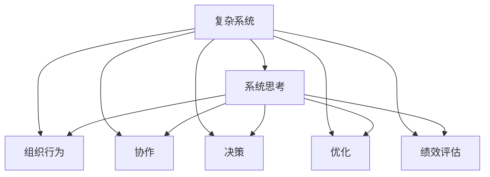

                 

# 如何将系统思考应用于团队管理

> 关键词：系统思考,团队管理,复杂系统,组织行为,协作,决策,优化,绩效提升

## 1. 背景介绍

### 1.1 问题由来
团队管理是组织成功的关键要素之一。近年来，随着企业规模的不断扩大和业务复杂度的提升，传统的线性思维模式和分散的管理方法已经难以适应新的挑战。系统思考为团队管理提供了一种全新的视角，它强调从整体角度理解组织运作，识别系统中的关键交互环节，从而优化团队绩效和组织健康。

系统思考方法源自复杂系统理论，其核心在于理解系统的动态性、复杂性和层次性，通过动态建模和仿真实验，识别系统的关键行为特征，并在此基础上进行优化。在团队管理中，系统思考的应用可以覆盖从人员管理到流程优化，从任务分配到绩效评估等多个方面，帮助企业提升管理效能和竞争优势。

### 1.2 问题核心关键点
系统思考在团队管理中的应用，主要关注以下几个核心问题：
- 如何理解组织内部的复杂关系和动态交互？
- 如何构建系统模型，识别关键行为特征？
- 如何优化团队结构和流程，提升整体绩效？
- 如何通过系统反馈，持续改进团队管理和绩效？

这些问题涵盖了从理论构建到实践应用的全过程，要求团队管理者具备系统思维和系统建模能力，并能够灵活应用在具体的管理实践中。

### 1.3 问题研究意义
系统思考应用于团队管理，对于提升企业的战略执行力、增强团队协作能力、优化资源配置、提高组织适应性具有重要意义：

1. 增强组织执行力。通过系统思考，明确目标与任务之间的关系，优化执行路径，减少资源浪费，提升执行效率。
2. 强化团队协作。系统思考帮助团队成员理解彼此的交互影响，减少沟通摩擦，增强协同作战能力。
3. 优化资源配置。通过系统模型识别资源瓶颈，优化资源分配，提升整体资源利用效率。
4. 提升组织适应性。系统思考强调动态性，能够帮助企业快速适应外部环境变化，灵活调整内部结构。

## 2. 核心概念与联系

### 2.1 核心概念概述

为了更好地理解系统思考在团队管理中的应用，本节将介绍几个密切相关的核心概念：

- 复杂系统(Complex Systems)：由众多交互作用的部分组成，具有自组织性、非线性特征的动态系统。
- 系统思考(Systemic Thinking)：一种从整体视角理解复杂系统运作的思维方式，强调系统的动态性、整体性和连接性。
- 组织行为(Organizational Behavior)：研究组织中个体和群体行为及其影响因素，理解组织运作的核心机制。
- 协作(Collaboration)：多个主体或个体共同努力，实现共同目标的过程。
- 决策(Decision Making)：在复杂环境中，通过分析信息、权衡利弊，做出最优选择的活动。
- 优化(Optimization)：通过调整系统参数，提高系统绩效的过程。
- 绩效评估(Performance Evaluation)：系统模型的评价和反馈，用于指导系统的改进和优化。

这些概念之间的逻辑关系可以通过以下Mermaid流程图来展示：



这个流程图展示了一个复杂系统与系统思考的关系，以及系统思考在组织行为、协作、决策、优化、绩效评估等方面的应用：

1. 复杂系统是系统思考的对象。
2. 系统思考提供理解复杂系统运作的工具。
3. 组织行为是系统思考的基础，指导团队协作和决策。
4. 协作和决策是系统思考的重要应用场景。
5. 优化是系统思考的目标，指导资源配置和流程优化。
6. 绩效评估是系统思考的反馈机制，用于持续改进团队管理和绩效。

这些概念共同构成了系统思考在团队管理中的应用框架，使其能够更好地理解和优化复杂系统的运作。

## 3. 核心算法原理 & 具体操作步骤
### 3.1 算法原理概述

系统思考在团队管理中的应用，本质上是一种基于系统模型的方法论。其核心思想是：通过构建复杂系统的系统模型，识别系统中的关键交互环节，理解系统动态行为，从而优化系统的整体绩效。

系统模型通常由一系列因果关系、反馈回路和参数组成，通过数学方程或仿真算法描述系统行为。通过调整模型参数，可以对系统进行优化，使其达到最优的运作状态。

在团队管理中，系统思考主要包括以下几个步骤：

1. 理解系统结构和关系。
2. 构建系统模型，识别关键行为特征。
3. 进行系统仿真和优化。
4. 评估系统绩效，进行持续改进。

系统思考的关键在于识别系统中的关键反馈回路和因果关系，找到系统优化和改进的方向。这通常需要团队成员的集体智慧，通过讨论和模拟实验，逐步构建和验证系统模型。

### 3.2 算法步骤详解

系统思考在团队管理中的应用，一般包括以下几个关键步骤：

**Step 1: 理解系统结构和关系**
- 定义团队管理中的关键子系统。如人员管理、流程优化、任务分配等。
- 识别各子系统之间的交互关系，如依赖、冲突、协作等。
- 分析系统中的因果关系，如激励机制、反馈机制等。

**Step 2: 构建系统模型**
- 根据系统结构和关系，构建系统模型。可以使用 causal loop diagram (CLD)、vizziogram 等工具进行建模。
- 识别系统中的关键反馈回路和因果关系，确定系统的关键行为特征。
- 使用仿真软件或数学模型进行系统模拟，验证模型的合理性。

**Step 3: 进行系统仿真和优化**
- 对系统模型进行仿真实验，分析系统的行为特征和性能指标。
- 使用优化算法调整模型参数，寻找最优解。
- 进行敏感性分析，评估参数变化对系统性能的影响。

**Step 4: 评估系统绩效，进行持续改进**
- 根据仿真结果，评估系统绩效和行为特征。
- 识别系统中的瓶颈和优化方向，进行持续改进。
- 定期进行系统反馈和复盘，持续优化团队管理。

### 3.3 算法优缺点

系统思考在团队管理中的应用，具有以下优点：
1. 全面系统性。系统思考从整体视角理解系统运作，能够识别复杂的因果关系和反馈回路，提供全局视角。
2. 仿真验证。通过系统模型和仿真实验，可以对系统进行验证和优化，提高决策的科学性和准确性。
3. 数据驱动。系统模型需要大量数据进行训练和验证，有助于减少主观判断，提高管理的客观性。
4. 动态优化。系统思考强调动态性，能够适应环境变化，进行持续改进。

同时，系统思考也存在以下局限性：
1. 模型复杂性。构建和验证系统模型需要大量时间和资源，对于复杂系统尤为困难。
2. 数据需求高。系统模型需要大量高质量数据，数据的获取和处理难度较大。
3. 技术门槛高。系统建模和优化需要专业的知识和技能，团队成员的技术水平要求较高。
4. 反馈滞后。系统仿真和优化通常需要时间，反馈结果可能滞后，影响决策及时性。

尽管存在这些局限性，但系统思考作为一种全面的管理方法，对于复杂系统的理解和优化具有重要价值。在团队管理中，合理应用系统思考，可以显著提升系统的整体绩效和适应能力。

### 3.4 算法应用领域

系统思考在团队管理中的应用，可以广泛应用于以下几个领域：

- 组织变革与设计：通过系统思考，设计高效的组织结构，优化资源配置，提升组织竞争力。
- 团队协作与沟通：通过系统思考，理解团队成员的交互影响，优化协作机制，减少沟通障碍。
- 项目管理与执行：通过系统思考，识别项目中的关键环节，优化执行路径，提升项目绩效。
- 人力资源管理：通过系统思考，理解人员激励和流动机制，优化人力资源配置，提高员工满意度。
- 绩效评估与改进：通过系统思考，评估系统绩效，进行持续改进，提升整体管理水平。

除了上述这些典型应用外，系统思考还可以应用于更广泛的场景，如创新管理、文化建设、客户关系管理等，为团队管理提供新的方法和视角。

## 4. 数学模型和公式 & 详细讲解 & 举例说明（备注：数学公式请使用latex格式，latex嵌入文中独立段落使用 $$，段落内使用 $)
### 4.1 数学模型构建

系统思考在团队管理中的应用，通常通过构建系统模型来实现。以下以一个简单的项目管理为例，展示系统模型的构建过程：

设项目管理过程包含四个关键子系统：任务分配、资源配置、进度跟踪和风险管理。各子系统之间的关系如下图所示：


在构建系统模型时，我们可以使用因果循环图(CLD)来描述系统中的因果关系和反馈回路。例如，资源配置对任务进度和风险管理都有直接影响，任务进度对风险管理也有反馈影响。

**数学模型构建**：

设项目管理过程的绩效指标为 $P$，任务分配、资源配置、进度跟踪和风险管理的绩效指标分别为 $P_A$、$P_B$、$P_C$、$P_D$。系统模型可以表示为：

$$
P = f(P_A, P_B, P_C, P_D)
$$

其中 $f$ 为系统的非线性函数，描述了系统中的因果关系和反馈回路。例如，

$$
P_A = g(A, P_B, P_C, P_D)
$$

表示任务分配的绩效受到资源配置、进度跟踪和风险管理的影响。类似的，可以构建其他子系统的数学模型。

**公式推导过程**：

以任务分配子系统为例，假设任务分配的绩效 $P_A$ 受到任务数量 $N_A$、资源可用量 $R_A$、进度偏差 $D_A$ 和风险事件 $E_A$ 的影响，可以表示为：

$$
P_A = g(N_A, R_A, D_A, E_A)
$$

其中 $g$ 为非线性函数。假设任务分配的绩效线性正相关于任务数量 $N_A$ 和资源可用量 $R_A$，与进度偏差 $D_A$ 和风险事件 $E_A$ 线性负相关，可以表示为：

$$
P_A = \alpha N_A + \beta R_A - \gamma D_A - \delta E_A + \epsilon
$$

其中 $\alpha, \beta, \gamma, \delta, \epsilon$ 为模型的参数。通过收集历史数据和进行模型训练，可以得到各个参数的估计值。

**案例分析与讲解**：

假设某项目有100个任务，分配到5个团队中。每个团队有10个成员，资源配置充足，进度偏差较小，但有2个风险事件。我们可以使用上述模型预测任务分配的绩效：

$$
P_A = \alpha \times 100 + \beta \times 10 - \gamma \times 0 - \delta \times 2 + \epsilon
$$

设 $\alpha = 0.2, \beta = 0.3, \gamma = 0.1, \delta = 0.4, \epsilon = 0.1$，则：

$$
P_A = 0.2 \times 100 + 0.3 \times 10 - 0.1 \times 0 - 0.4 \times 2 + 0.1 = 21.2
$$

这表示任务分配的绩效为21.2，可以进行进一步的优化调整。

## 5. 项目实践：代码实例和详细解释说明
### 5.1 开发环境搭建

在进行系统思考的实践前，我们需要准备好开发环境。以下是使用Python进行系统思考建模和仿真的环境配置流程：

1. 安装Python：从官网下载并安装Python，建议版本为3.7以上。
2. 安装Sympy：用于数学建模和符号计算，可以安装最新版本。
3. 安装PyViz：用于可视化因果循环图和系统仿真结果。
4. 安装Matplotlib：用于绘制图表。

完成上述步骤后，即可在Python环境中进行系统思考的建模和仿真。

### 5.2 源代码详细实现

这里以一个简单的系统为例，展示如何使用Sympy和PyViz进行系统建模和仿真。

首先，定义系统的状态变量和参数：

```python
from sympy import symbols, Eq, solve

# 定义状态变量和参数
P = symbols('P')
PA = symbols('PA')
PB = symbols('PB')
PC = symbols('PC')
PD = symbols('PD')
alpha, beta, gamma, delta, epsilon = symbols('alpha beta gamma delta epsilon')

# 定义系统方程
eq1 = Eq(PA, alpha * N_A + beta * R_A - gamma * D_A - delta * E_A + epsilon)
eq2 = Eq(PB, 0.5 * PA + 0.3 * PD + 0.2 * PC)
eq3 = Eq(PC, 0.4 * PA + 0.2 * PD)
eq4 = Eq(PD, 0.1 * PA + 0.3 * PC)

# 定义系统模型
model = (eq1, eq2, eq3, eq4)
```

然后，使用因果循环图进行系统建模：

```python
from pyviz import vizziogram

# 定义因果循环图节点
PA_node = vizziogram.Node("PA", color="blue")
PB_node = vizziogram.Node("PB", color="green")
PC_node = vizziogram.Node("PC", color="orange")
PD_node = vizziogram.Node("PD", color="red")

# 定义因果关系
PA_to_PB = vizziogram.Arrow(PA_node, PB_node, label="0.5 * PA", color="green")
PA_to_PC = vizziogram.Arrow(PA_node, PC_node, label="0.4 * PA", color="orange")
PA_to_PD = vizziogram.Arrow(PA_node, PD_node, label="0.1 * PA", color="red")
PB_to_PD = vizziogram.Arrow(PB_node, PD_node, label="0.3 * PD", color="red")
PC_to_PD = vizziogram.Arrow(PC_node, PD_node, label="0.2 * PC", color="red")

# 创建因果循环图
graph = vizziogram.Graph()
graph.add_nodes([PA_node, PB_node, PC_node, PD_node])
graph.add_arrows([PA_to_PB, PA_to_PC, PA_to_PD, PB_to_PD, PC_to_PD])
graph.plot()
```

最后，进行系统仿真和优化：

```python
from scipy.optimize import minimize

# 定义目标函数
def objective_function(x):
    PA_value = solve(eq1.subs({N_A: 100, R_A: 10, D_A: 0, E_A: 2}), PA)[0]
    PA_value = PA_value.subs({alpha: x[0], beta: x[1], gamma: x[2], delta: x[3], epsilon: x[4]})
    return (PA_value - P) ** 2

# 定义初始参数
initial_params = [0.2, 0.3, 0.1, 0.4, 0.1]

# 优化目标函数
result = minimize(objective_function, initial_params, method='BFGS')
```

这将在Python中搭建一个简单的系统思考模型，并进行优化求解。

### 5.3 代码解读与分析

让我们再详细解读一下关键代码的实现细节：

**系统状态变量和参数定义**：
- 使用Sympy定义状态变量 $P$、$PA$、$PB$、$PC$、$PD$，以及模型参数 $\alpha, \beta, \gamma, \delta, \epsilon$。

**系统方程定义**：
- 根据项目管理过程的特点，定义了四个关键子系统的方程，描述了它们之间的因果关系。

**因果循环图绘制**：
- 使用PyViz绘制因果循环图，展示系统中的关键节点和因果关系。

**系统仿真和优化**：
- 使用SciPy的优化模块，定义目标函数，并使用BFGS算法进行优化求解。目标函数为系统输出与期望值之间的差距的平方和。

## 6. 实际应用场景
### 6.1 智能客服系统

系统思考可以应用于智能客服系统的设计和优化。传统客服系统依赖人工服务，效率低下，无法提供24小时不间断服务。通过系统思考，可以构建智能客服系统的系统模型，识别系统中的关键行为特征和交互环节，从而优化系统性能。

**应用场景**：
- 构建智能客服系统的系统模型，识别任务分配、资源配置、客户反馈等关键子系统。
- 通过系统仿真和优化，提升系统响应速度、准确性和客户满意度。
- 定期进行系统反馈和复盘，持续改进客服系统的设计和运作。

**效果**：
- 实现智能客服系统的自动响应，提升客户咨询体验和问题解决效率。
- 通过系统仿真和优化，降低客服系统的运营成本，提升企业竞争力。

### 6.2 金融风险管理

系统思考可以应用于金融风险管理，识别风险管理中的关键交互环节和因果关系，优化风险控制机制，提高金融系统的稳定性。

**应用场景**：
- 构建金融风险管理的系统模型，识别风险识别、评估、控制等关键子系统。
- 通过系统仿真和优化，提高金融系统的风险管理水平，减少风险事件对系统绩效的影响。
- 定期进行系统反馈和复盘，持续改进风险管理机制。

**效果**：
- 提高金融系统的风险管理水平，降低金融风险事件对企业的影响。
- 通过系统仿真和优化，提升金融系统的稳定性和可持续性。

### 6.3 医疗诊疗决策

系统思考可以应用于医疗诊疗决策，通过构建系统模型，理解诊疗过程中的关键交互环节和因果关系，优化诊疗流程，提高诊疗效果。

**应用场景**：
- 构建医疗诊疗决策的系统模型，识别诊疗过程、诊断工具、医疗记录等关键子系统。
- 通过系统仿真和优化，提高诊疗的准确性和效率，减少误诊和漏诊。
- 定期进行系统反馈和复盘，持续改进诊疗流程和效果。

**效果**：
- 提高诊疗的准确性和效率，减少误诊和漏诊，提升患者满意度。
- 通过系统仿真和优化，降低诊疗成本，提高医疗系统的可持续性。

### 6.4 未来应用展望

随着系统思考技术的不断发展，其在团队管理中的应用前景广阔，未来将覆盖更多领域，带来新的创新和突破：

- 在智能制造中，通过系统思考优化生产流程，提升生产效率和质量。
- 在物流管理中，通过系统思考优化配送路径和资源配置，降低运营成本。
- 在智慧城市中，通过系统思考优化城市管理和服务，提升城市治理水平。
- 在环境保护中，通过系统思考优化资源利用和环境治理，实现可持续发展。

总之，系统思考作为一种全面的系统管理方法，为复杂系统提供了全局视角和优化路径，未来将在更多领域发挥重要作用。

## 7. 工具和资源推荐
### 7.1 学习资源推荐

为了帮助开发者系统掌握系统思考的理论基础和实践技巧，这里推荐一些优质的学习资源：

1. 《系统思考基础》系列文章：详细介绍了系统思考的原理、方法和应用场景，适合初学者入门。
2. 《复杂系统建模与仿真》课程：斯坦福大学开设的在线课程，系统讲解了复杂系统的建模与仿真方法，提供了丰富的案例和实验。
3. 《系统思考与组织变革》书籍：深入探讨了系统思考在组织变革和团队管理中的应用，提供了实用的管理工具和方法。
4. 《系统动力学入门》书籍：系统动力学领域的入门读物，详细介绍了系统动力学方法和工具，适合系统思考的进阶学习。
5. 《复杂系统建模与仿真工具》报告：介绍了当前常用的系统建模与仿真工具，包括Vensim、AnyLogic等，适合工具使用者的参考。

通过对这些资源的学习实践，相信你一定能够快速掌握系统思考的理论基础和实践技巧，并用于解决实际的团队管理问题。

### 7.2 开发工具推荐

高效的开发离不开优秀的工具支持。以下是几款用于系统思考建模和仿真的常用工具：

1. Sympy：用于数学建模和符号计算，支持复杂的数学建模和方程求解。
2. PyViz：用于可视化因果循环图和系统仿真结果，提供灵活的图形绘制和交互功能。
3. Scipy：用于数值计算和优化，提供各种数学函数和算法。
4. Vensim：用于系统建模和仿真，提供直观的建模界面和仿真功能。
5. AnyLogic：用于系统建模和仿真，提供强大的系统仿真和分析功能。

合理利用这些工具，可以显著提升系统思考的建模和仿真效率，加速系统思考的实践应用。

### 7.3 相关论文推荐

系统思考的应用研究已经广泛涉及管理、工程、科学等多个领域，以下是几篇具有代表性的相关论文，推荐阅读：

1. "System Dynamics: Dynamics, Decision, and Change"：系统动力学领域的经典著作，系统介绍了系统动力学的方法和工具。
2. "The Systems Thinking Revolution"：讲解了系统思考的基本原理和应用方法，适合系统思考的入门学习。
3. "Systems Thinking for Project Management"：介绍系统思考在项目管理中的应用，提供了具体的案例和方法。
4. "System Thinking in Healthcare Management"：探讨了系统思考在医疗管理中的应用，提供了实际的应用案例和方法。
5. "Modeling Complex Systems with System Dynamics"：介绍了系统动态建模的方法和工具，适合系统建模的进阶学习。

这些论文代表了系统思考的理论发展和技术演进，通过学习这些前沿成果，可以帮助研究者把握学科前进方向，激发更多的创新灵感。

## 8. 总结：未来发展趋势与挑战
### 8.1 研究成果总结

本文对系统思考在团队管理中的应用进行了全面系统的介绍。首先阐述了系统思考的理论基础和核心概念，明确了系统思考在复杂系统管理中的独特价值。其次，从原理到实践，详细讲解了系统思考的数学模型和仿真方法，给出了系统思考建模和仿真的完整代码实例。同时，本文还广泛探讨了系统思考在智能客服、金融风险管理、医疗诊疗决策等多个领域的应用前景，展示了系统思考范式的广阔应用场景。此外，本文精选了系统思考的学习资源和开发工具，力求为读者提供全方位的技术指引。

通过本文的系统梳理，可以看到，系统思考作为一种全面的管理方法，对于复杂系统的理解和优化具有重要价值。系统思考在团队管理中的应用，能够帮助团队管理者从整体视角理解系统运作，识别关键交互环节，优化系统性能。

### 8.2 未来发展趋势

展望未来，系统思考在团队管理中的应用将呈现以下几个发展趋势：

1. 技术手段多样化。系统思考将融合更多的技术手段，如人工智能、区块链、大数据等，提升管理效率和决策质量。
2. 多学科交叉。系统思考将与更多学科进行交叉，如系统生物学、复杂系统物理学等，形成更加全面的系统视角。
3. 实时化、智能化。系统思考将利用物联网、云计算等技术，实现实时数据采集和系统仿真，提升管理的时效性和智能化水平。
4. 社会化管理。系统思考将更多应用于社会化管理，如城市治理、公共服务等领域，提升社会系统的协调性和适应性。

以上趋势凸显了系统思考在复杂系统管理中的广阔前景，这些方向的探索发展，必将进一步提升系统管理的科学性和效率。

### 8.3 面临的挑战

尽管系统思考在团队管理中具有重要价值，但在应用过程中仍面临诸多挑战：

1. 技术复杂性。系统思考需要较强的技术背景，团队成员需要具备系统建模、仿真等专业技能，技术门槛较高。
2. 数据需求高。系统建模和仿真需要大量高质量数据，数据的获取和处理难度较大。
3. 系统反馈滞后。系统仿真和优化通常需要时间，反馈结果可能滞后，影响决策及时性。
4. 系统交互复杂。系统建模和仿真需要考虑多种交互环节和因果关系，模型构建难度较大。

尽管存在这些挑战，但系统思考作为一种全面的系统管理方法，对于复杂系统的理解和优化具有重要价值。在团队管理中，合理应用系统思考，可以显著提升系统的整体绩效和适应能力。

### 8.4 研究展望

面对系统思考面临的种种挑战，未来的研究需要在以下几个方面寻求新的突破：

1. 探索更多应用场景。系统思考将在更多领域得到应用，如智能制造、智慧物流、智慧城市等，带来新的创新和突破。
2. 开发更多工具和方法。开发更加高效、易用的系统建模和仿真工具，降低技术门槛，提高管理效率。
3. 引入更多学科知识。系统思考将与更多学科进行交叉，形成更加全面的系统视角，提升管理深度和广度。
4. 强化社会化管理。系统思考将更多应用于社会化管理，如城市治理、公共服务等领域，提升社会系统的协调性和适应性。
5. 持续改进优化。系统思考将通过实时数据采集和系统仿真，持续改进管理模型和策略，提升管理绩效。

这些研究方向的探索，必将引领系统思考技术迈向更高的台阶，为复杂系统的管理提供新的方法和视角。面向未来，系统思考需要与其他技术手段进行更深入的融合，共同推动系统管理的进步。只有勇于创新、敢于突破，才能不断拓展系统思考的边界，让系统思考技术更好地造福复杂系统管理。

## 9. 附录：常见问题与解答
----------------------------------------------------------------

**Q1：系统思考是否适用于所有组织类型？**

A: 系统思考适用于所有复杂组织，包括企业、政府、非营利组织等。其核心思想是通过全局视角理解系统运作，识别关键交互环节，优化系统性能。无论是传统制造业还是现代服务业，系统思考都能提供有价值的指导。

**Q2：系统思考与传统管理方法有何不同？**

A: 系统思考与传统管理方法的最大不同在于其全局视角和动态性。传统方法往往局限于局部视角和静态分析，难以识别系统中的关键交互环节和因果关系。系统思考通过系统建模和仿真，提供全面的系统视角，识别系统动态行为，优化系统整体绩效。

**Q3：如何构建复杂系统的系统模型？**

A: 构建复杂系统的系统模型需要以下步骤：
1. 定义系统状态变量和参数。
2. 识别系统中的关键子系统和交互环节。
3. 构建系统的因果关系和反馈回路。
4. 使用系统仿真和优化算法验证和调整模型。
5. 定期进行系统反馈和复盘，持续改进模型和策略。

**Q4：系统思考如何提升组织绩效？**

A: 系统思考通过全局视角和动态性，帮助组织理解系统运作和关键交互环节，优化系统结构和流程，提升整体绩效。具体措施包括：
1. 优化资源配置和任务分配，提高执行效率。
2. 改善协作机制，减少沟通摩擦，增强协同作战能力。
3. 识别系统瓶颈和优化方向，进行持续改进。
4. 通过系统反馈和复盘，持续优化管理策略。

**Q5：系统思考有哪些典型的应用案例？**

A: 系统思考在多个领域得到了广泛应用，包括：
1. 智能客服系统：通过系统思考优化客服流程，提升响应速度和客户满意度。
2. 金融风险管理：通过系统思考优化风险控制机制，提升金融系统的稳定性。
3. 医疗诊疗决策：通过系统思考优化诊疗流程，提高诊疗效果和效率。
4. 智能制造：通过系统思考优化生产流程，提升生产效率和质量。
5. 物流管理：通过系统思考优化配送路径和资源配置，降低运营成本。

通过这些应用案例，可以看到系统思考在复杂系统管理中的广泛应用和显著效果。

---

作者：禅与计算机程序设计艺术 / Zen and the Art of Computer Programming

