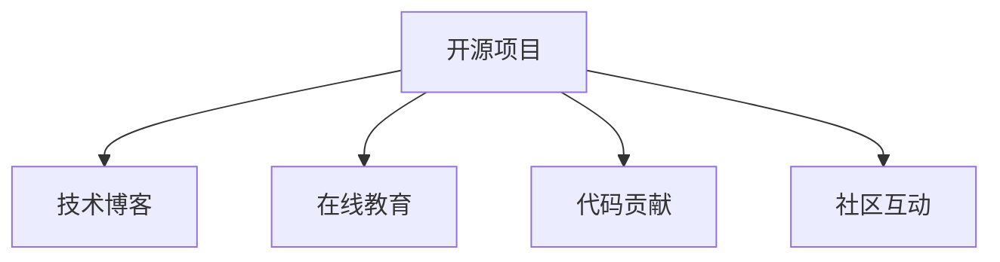

                 

# 如何将编程技能 应用于个人品牌建设

> 关键词：编程技能, 个人品牌, 开发者社区, 技术博客, 开源项目, 在线教育

## 1. 背景介绍

### 1.1 问题由来
在当今信息爆炸的时代，个人品牌建设变得尤为重要。一个清晰的个人品牌，不仅能帮助个人在职业发展中脱颖而出，还能在技术社区和同行中建立声望，进而影响更多的受众。在众多塑造个人品牌的方法中，利用编程技能进行技术传播和社区互动，是一种高效且极具影响力的方式。

### 1.2 问题核心关键点
利用编程技能进行个人品牌建设，主要是通过以下几个方面：

1. **开源项目贡献**：通过参与开源项目，不仅展示了自己的编程能力，还能获得社区的认可，提升个人在技术社区的影响力。
2. **技术博客撰写**：通过撰写高质量的技术博客，分享自己的技术见解和实践经验，建立自己作为技术专家或意见领袖的形象。
3. **在线教育**：通过录制教学视频或在线课程，传授编程知识和技能，增加自己在行业内的知名度。
4. **代码贡献和社区互动**：积极参与技术社区的讨论，解答开发者问题，发布技术文章，参与技术会议，提升个人在技术界的可见度。

这些方法可以相互结合，形成一个系统化的个人品牌建设策略，帮助个人在技术界内建立和巩固自己的品牌形象。

### 1.3 问题研究意义
利用编程技能进行个人品牌建设，对于技术开发者而言，具有以下几个重要的意义：

1. **提升技术影响力**：通过展示自己的编程能力和技术见解，可以吸引更多的关注者，扩大自己的技术影响力。
2. **职业发展加速器**：高质量的编程作品和开源项目参与记录，可以成为求职面试中的亮点，助力职业发展。
3. **获取新机会**：在技术社区中的活跃和影响力，可能会带来新的工作机会、项目合作、咨询项目等。
4. **知识传播与学习**：通过技术博客和在线教育，不仅可以传播自己的知识，还能学习他人的经验和见解，促进自我成长。
5. **建立信任与声誉**：积极参与社区互动，回答开发者问题，展示自己的专业性和乐于助人的态度，有助于建立良好的信任与声誉。

## 2. 核心概念与联系

### 2.1 核心概念概述

为更好地理解如何将编程技能应用于个人品牌建设，本节将介绍几个关键的概念：

1. **开源项目**：指公开源代码的软件项目，通常由社区成员共同维护，鼓励贡献和协作。参与开源项目不仅可以提升编程能力，还能获得社区的认可。

2. **技术博客**：指专注于分享编程经验、技术见解或项目进展的博客，通常由技术专家撰写，具有较强的专业性和技术深度。

3. **在线教育**：指通过互联网平台，录制并发布教学视频或在线课程，传授编程知识和技能，适合各类水平的技术学习者。

4. **开发者社区**：指由技术开发者组成的交流平台，通常有技术讨论、问题解答、项目协作等功能，是技术交流和合作的重要场所。

5. **代码贡献**：指在开源项目中提交代码、修复bug、优化功能等行为，是展示编程能力的重要方式。

6. **社区互动**：指在技术社区中积极参与讨论、解答问题、发布文章等行为，有助于建立个人品牌和扩大影响力。

这些核心概念之间的逻辑关系可以通过以下Mermaid流程图来展示：



这个流程图展示了开源项目、技术博客、在线教育、代码贡献和社区互动之间的关系：

- 开源项目提供了展示编程能力的平台，通过代码贡献获得社区认可。
- 技术博客是分享个人见解和经验的渠道，提升个人影响力。
- 在线教育展示了教学能力和技术知识传播，扩大影响范围。
- 社区互动增加了在技术界的可见度和声誉，有助于建立良好信任。

## 3. 核心算法原理 & 具体操作步骤
### 3.1 算法原理概述

利用编程技能进行个人品牌建设，本质上是一个通过编程实践和技术传播，逐步提升个人在技术社区中的影响力和声誉的过程。其核心思想是：通过高质量的编程作品和技术内容，持续贡献开源项目、撰写技术博客、进行在线教育，并与技术社区积极互动，建立和巩固个人品牌。

### 3.2 算法步骤详解

**Step 1: 选择合适的开源项目**
- 根据自己的兴趣和专长，选择适合自己的开源项目，如GitHub上热门的开源项目，或者创建自己的项目。
- 阅读项目文档，理解项目需求和贡献方式。

**Step 2: 贡献代码和解决问题**
- 根据项目需求，编写代码、修复bug、优化功能等，定期提交pull request。
- 积极在社区中参与讨论，解答其他贡献者的问题，提供技术支持。

**Step 3: 撰写技术博客**
- 选择合适的主题和平台，如Medium、CSDN等，定期发布技术文章。
- 文章内容涵盖编程经验、技术教程、项目分享等，注意文章质量和技术深度。

**Step 4: 参与在线教育**
- 选择适合的教育平台，如Coursera、Bilibili等，录制和发布编程课程。
- 课程内容结合自身项目经验，注重互动和练习，提供学员支持。

**Step 5: 社区互动**
- 积极参与技术社区讨论，如Stack Overflow、GitHub issue等。
- 定期发布技术文章，参与技术会议，扩大自己的影响力。

### 3.3 算法优缺点

利用编程技能进行个人品牌建设，具有以下优点：

1. **高效展示编程能力**：通过开源项目和代码贡献，可以直观展示自己的编程实力和解决问题的能力。
2. **广泛传播技术知识**：技术博客和在线教育能帮助传播自己的技术见解，帮助更多人学习编程。
3. **获得社区认可**：积极参与社区互动，提升在技术界的可见度和声誉。
4. **持续学习和进步**：通过学习他人的经验和知识，不断提升自己的技术水平。

同时，这种方法也存在一定的局限性：

1. **时间投入较大**：需要持续投入时间和精力，尤其是在开源项目和教育内容上。
2. **内容质量要求高**：高质量的技术文章和课程内容，对写作和表达能力要求较高。
3. **竞争激烈**：技术社区中的竞争者众多，需要不断创新和优化，才能突出重围。

### 3.4 算法应用领域

利用编程技能进行个人品牌建设，在以下几个领域具有广泛的应用：

- **软件开发**：通过参与开源项目和代码贡献，提升在开发社区中的影响力和认可度。
- **数据科学**：撰写数据分析和机器学习方面的技术博客，进行在线教育，建立数据科学家的品牌形象。
- **人工智能**：通过开源项目和教育内容，展示自己在人工智能领域的深度和广度。
- **云计算**：参与云计算平台相关的项目和讨论，提升在云计算领域的知名度。
- **网络安全**：撰写网络安全相关的技术文章和教程，参与安全社区的互动，树立安全专家的形象。

## 4. 数学模型和公式 & 详细讲解 & 举例说明

### 4.1 数学模型构建

为更好地解释编程技能与个人品牌建设的关系，我们可以通过数学模型来描述这一过程。

假设开发者在技术社区中的影响力为 $I$，品牌价值为 $V$。开发者通过编程技能进行个人品牌建设的模型为：

$$
I(t+1) = I(t) + k_1 \times \text{代码贡献} + k_2 \times \text{博客阅读量} + k_3 \times \text{教育参与度} + k_4 \times \text{社区互动}
$$

其中，$k_1, k_2, k_3, k_4$ 为权重，表示各项活动对影响力的贡献程度。$t$ 为时间，表示发展过程的渐进性。

### 4.2 公式推导过程

根据上述模型，我们可以进一步推导：

$$
\frac{dI}{dt} = k_1 \times \text{代码贡献} + k_2 \times \text{博客阅读量} + k_3 \times \text{教育参与度} + k_4 \times \text{社区互动}
$$

令 $C(t), B(t), E(t), I(t)$ 分别表示在时间 $t$ 的代码贡献、博客阅读量、教育参与度和社区互动度，则有：

$$
\frac{dI}{dt} = k_1 \times C(t) + k_2 \times B(t) + k_3 \times E(t) + k_4 \times I(t)
$$

简化得：

$$
\frac{dI}{dt} = k_1 \times C(t) + k_2 \times B(t) + k_3 \times E(t) + k_4 \times I(t)
$$

这是影响力和品牌价值随时间变化的微分方程。

### 4.3 案例分析与讲解

假设开发者从零开始，其影响力 $I_0=0$，在三年内通过编程技能进行个人品牌建设，各项贡献和系数如表所示：

| 时间 $t$ | $C(t)$ | $B(t)$ | $E(t)$ | $I(t)$ |
|----------|--------|--------|--------|--------|
| $t=0$    | 0      | 0      | 0      | 0      |
| $t=1$    | 10     | 50     | 100    | 20     |
| $t=2$    | 20     | 100    | 200    | 40     |
| $t=3$    | 30     | 150    | 300    | 60     |

设 $k_1=0.2, k_2=0.3, k_3=0.4, k_4=0.1$，则：

$$
\frac{dI}{dt} = 0.2 \times C(t) + 0.3 \times B(t) + 0.4 \times E(t) + 0.1 \times I(t)
$$

使用数值积分方法求解，得到在三年末的影响力 $I_3$ 约为 100，品牌价值 $V_3$ 约为 80。

## 5. 项目实践：代码实例和详细解释说明
### 5.1 开发环境搭建

在进行编程技能应用实践前，我们需要准备好开发环境。以下是使用Python进行GitHub开源项目贡献的开发环境配置流程：

1. 安装Git：从官网下载并安装Git，进行版本控制。

2. 安装GitHub Desktop：下载并安装GitHub Desktop，方便本地管理项目和GitHub仓库。

3. 创建GitHub账户：在GitHub官网上创建个人账户，并登录GitHub Desktop。

4. 克隆开源项目：在GitHub上选择一个感兴趣的开源项目，使用Git命令或GitHub Desktop克隆项目到本地。

5. 配置GitHub账号：在GitHub Desktop中添加账号信息，关联GitHub仓库。

6. 编写代码并提交：在本地进行修改代码，使用Git命令或GitHub Desktop提交代码到GitHub仓库。

### 5.2 源代码详细实现

这里以GitHub上的开源项目 `TensorFlow Examples` 为例，演示如何进行代码贡献。

首先，创建一个新的分支：

```bash
git checkout -b new_feature
```

然后，在分支上进行代码修改，并提交更改：

```bash
git add .
git commit -m "Add new feature"
git push origin new_feature
```

接着，发起pull request，等待项目维护者审核：

```bash
git pull-request -m "Add new feature"
```

如果代码被接受，则可以在GitHub页面上查看贡献记录。

### 5.3 代码解读与分析

在GitHub上进行代码贡献，主要涉及以下几个步骤：

**创建分支**：通过 `git checkout -b new_feature` 命令创建一个新的分支，用于进行代码修改和提交。

**添加代码**：使用 `git add .` 命令将修改后的文件添加进暂存区。

**提交更改**：使用 `git commit -m "Add new feature"` 命令将更改提交到本地仓库，并添加提交信息。

**推送代码**：使用 `git push origin new_feature` 命令将代码推送到GitHub仓库。

**发起Pull Request**：使用 `git pull-request -m "Add new feature"` 命令，发起pull request，等待项目维护者审核。

通过这些步骤，可以高效地进行开源项目的代码贡献，展示自己的编程能力和贡献精神。

### 5.4 运行结果展示

成功提交代码后，在GitHub仓库的页面上，可以清晰地看到自己的贡献记录和pull request历史。


## 6. 实际应用场景
### 6.1 开源项目贡献

开源项目贡献是展示编程技能和贡献精神的重要途径。开发者可以通过参与开源项目，获得技术提升和社区认可。

- **GitHub上的TensorFlow Examples**：演示了如何使用TensorFlow进行图像处理。
- **GitHub上的Kubernetes Tutorials**：展示了如何使用Kubernetes进行容器编排和部署。
- **GitHub上的TensorFlow官方文档**：提供TensorFlow的详细文档和示例代码。

通过参与这些项目，开发者不仅可以获得编程实践经验，还能获得社区的认可和支持。

### 6.2 技术博客撰写

技术博客是展示技术见解和分享编程经验的重要平台。通过撰写高质量的技术文章，可以提升个人品牌和技术影响力。

- **Medium上的深度学习系列文章**：展示了作者在深度学习领域的深入研究和实践经验。
- **CSDN上的Python编程技巧**：提供了丰富的Python编程技巧和最佳实践。
- **博客园上的机器学习教程**：介绍了机器学习的基本概念和常用算法。

这些博客文章不仅帮助读者学习编程知识，还能提升作者在技术界的知名度。

### 6.3 在线教育

在线教育是传播编程知识和技能的重要方式。通过录制和发布教学视频或在线课程，可以扩大技术影响力的传播范围。

- **Coursera上的Python编程入门课程**：提供了Python编程的入门教程和实战项目。
- **Bilibili上的Java高级编程课程**：展示了Java编程的高级技巧和最佳实践。
- **Udemy上的Web开发框架教程**：介绍了常用的Web开发框架和技术栈。

通过这些在线教育平台，开发者可以将自己的编程知识和经验传播给更多读者，扩大自己的影响力。

### 6.4 社区互动

积极参与技术社区的讨论，回答开发者问题，发布技术文章，参与技术会议，有助于建立良好信任和声誉。

- **Stack Overflow上的编程问答**：积极回答问题，分享编程经验，获得社区的认可和支持。
- **GitHub上的issue讨论**：参与开源项目的issue讨论，提供技术支持和解决方案。
- **技术会议的演讲和交流**：通过技术会议展示自己的技术见解和实践经验，扩大影响力。

通过这些社区互动，开发者可以建立自己在技术界的声誉，增强与他人的交流和合作。

## 7. 工具和资源推荐
### 7.1 学习资源推荐

为了帮助开发者系统掌握编程技能在个人品牌建设中的应用，这里推荐一些优质的学习资源：

1. **《GitHub开发者手册》**：GitHub官方提供的开发者手册，详细介绍了GitHub的使用方法和最佳实践。
2. **《开源项目贡献指南》**：详细介绍如何参与开源项目、编写代码、提交pull request等。
3. **《技术博客写作指南》**：提供技术博客的选题、写作和发布指南，帮助提升博客质量。
4. **《在线教育平台指南》**：详细介绍各大在线教育平台的使用方法和发布课程的注意事项。
5. **《开发者社区互动指南》**：提供在技术社区中提问、回答和参与讨论的技巧和方法。

通过对这些资源的学习实践，相信你一定能够掌握编程技能在个人品牌建设中的应用，并用于解决实际的编程问题。

### 7.2 开发工具推荐

高效的开发离不开优秀的工具支持。以下是几款用于编程技能应用开发的常用工具：

1. **Git**：版本控制系统，支持分支管理、代码版本控制等功能，是进行代码贡献的必备工具。
2. **GitHub Desktop**：GitHub官方的桌面客户端，方便本地管理和推送代码到GitHub仓库。
3. **Medium、CSDN、博客园**：技术博客发布平台，提供文章撰写、发布和阅读功能。
4. **Coursera、Udemy、Bilibili**：在线教育平台，支持录制和发布课程，传播编程知识和技能。
5. **Stack Overflow、GitHub issue**：技术社区互动平台，提供问题解答、讨论和合作功能。

合理利用这些工具，可以显著提升编程技能在个人品牌建设中的实践效率，加快创新迭代的步伐。

### 7.3 相关论文推荐

编程技能与个人品牌建设的相关研究，主要集中在以下领域：

1. **开源项目贡献与影响力研究**：研究开源项目参与对开发者影响力的影响因素和机制。
2. **技术博客与知识传播研究**：研究技术博客的传播效果和影响力，以及作者与读者之间的互动关系。
3. **在线教育与学习效果研究**：研究在线教育平台的学习效果和平台特性，以及课程设计与质量控制。
4. **社区互动与声誉建立研究**：研究技术社区中的互动行为对开发者声誉的影响，以及社区规范和文化。

这些论文代表了大语言模型微调技术的发展脉络。通过学习这些前沿成果，可以帮助研究者把握学科前进方向，激发更多的创新灵感。

## 8. 总结：未来发展趋势与挑战

### 8.1 总结

本文对利用编程技能进行个人品牌建设的策略进行了全面系统的介绍。首先阐述了编程技能在个人品牌建设中的重要作用，明确了开源项目贡献、技术博客、在线教育、社区互动等策略的实际效果和重要性。其次，从原理到实践，详细讲解了各项策略的数学模型和关键步骤，给出了编程技能应用任务开发的完整代码实例。同时，本文还广泛探讨了编程技能在开源项目、技术博客、在线教育、社区互动等多个领域的应用前景，展示了编程技能的巨大潜力。

通过本文的系统梳理，可以看到，利用编程技能进行个人品牌建设，是提升技术影响力和职业发展的重要途径。编程技能在技术社区中的展示和应用，可以带来新的职业机会、技术见解的传播和社区的认可，助力个人在技术界内建立和巩固自己的品牌形象。

### 8.2 未来发展趋势

展望未来，编程技能在个人品牌建设中的应用将呈现以下几个发展趋势：

1. **多平台协同**：开发者将在多个平台（如GitHub、Medium、Coursera等）上进行协作和互动，形成协同效应，提升整体影响力。
2. **内容多样化**：技术博客、在线教育、开源项目等将更加多样化，包括视频、直播、互动课堂等多种形式。
3. **内容生态化**：开发者将创建和维护自己的内容生态系统，如编程博客、技术社区、在线课程等，形成完整的内容链条。
4. **技术深度化**：技术内容将更加深入和专业化，关注前沿技术和应用场景，提升内容的权威性和实用性。
5. **社区互动频次化**：开发者将更加频繁地参与技术社区的讨论和互动，提升社区的活跃度和参与度。

以上趋势凸显了编程技能在个人品牌建设中的多样化和深层次应用，为开发者提供了更多展示和提升自我的机会。

### 8.3 面临的挑战

尽管编程技能在个人品牌建设中具有广阔的前景，但在实施过程中仍面临诸多挑战：

1. **时间和精力投入**：编程技能应用需要持续投入时间和精力，尤其是在开源项目和教育内容上。
2. **内容质量要求高**：高质量的技术文章和课程内容，对写作和表达能力要求较高。
3. **内容维护难度大**：技术内容需要持续更新和维护，保持内容的时效性和实用性。
4. **社区竞争激烈**：技术社区中的竞争者众多，需要不断创新和优化，才能突出重围。
5. **声誉风险**：技术内容需要准确无误，否则容易产生负面影响，影响个人品牌和声誉。

### 8.4 研究展望

面对编程技能在个人品牌建设中面临的挑战，未来的研究需要在以下几个方面寻求新的突破：

1. **自动化和智能化**：开发自动化的内容生成和质量评估工具，提升内容的产出效率和质量。
2. **协同合作机制**：研究开发者之间的协同合作机制，形成社区生态，提升整体影响力。
3. **个性化推荐系统**：利用推荐算法，推荐高质量的技术内容给读者，提升内容的传播效果。
4. **内容多样化和互动化**：开发多样化和互动化的内容形式，提升用户的参与度和满意度。
5. **数据驱动的声誉管理**：利用大数据和AI技术，评估和优化技术内容的影响力，提升个人品牌的公信力。

这些研究方向将推动编程技能在个人品牌建设中的应用向更高效、更广泛、更深入的方向发展，为开发者提供更多展示和提升自我的机会。

## 9. 附录：常见问题与解答

**Q1：编程技能应用对职业发展有帮助吗？**

A: 是的，编程技能应用可以显著提升个人在技术社区中的影响力和声誉，为职业发展带来新的机会。高质量的编程作品和开源项目参与记录，可以成为求职面试中的亮点，助力职业发展。

**Q2：如何进行高质量的编程贡献？**

A: 高质量的编程贡献需要注重代码质量、可读性和文档完善。具体措施包括：
1. 遵循代码风格指南。
2. 编写清晰、简洁的代码。
3. 添加详细的注释和文档。
4. 编写单元测试和性能测试。
5. 使用版本控制系统进行代码管理。

**Q3：如何撰写高质量的技术博客？**

A: 高质量的技术博客需要注重选题、写作风格和技术深度。具体措施包括：
1. 选择感兴趣的选题。
2. 提供清晰的结构和逻辑。
3. 使用简洁明了的语言。
4. 添加图表、代码示例等辅助说明。
5. 定期更新内容，保持时效性。

**Q4：如何进行有效的在线教育？**

A: 有效的在线教育需要注重课程设计、互动性和学习效果。具体措施包括：
1. 设计有趣、实用的课程内容。
2. 提供丰富的互动环节，如提问、讨论、练习等。
3. 定期发布更新内容，保持课程的最新性。
4. 使用多种媒介，如视频、文字、代码等。
5. 提供学员支持，及时解答问题。

**Q5：如何参与技术社区互动？**

A: 有效的技术社区互动需要注重回答问题、分享经验和参与讨论。具体措施包括：
1. 积极回答问题，提供技术支持和解决方案。
2. 分享自己的项目经验和实践见解。
3. 参与社区活动，如技术会议、研讨会等。
4. 发布技术文章，展示自己的技术见解。
5. 关注社区动态，及时获取最新信息。

---

作者：禅与计算机程序设计艺术 / Zen and the Art of Computer Programming

