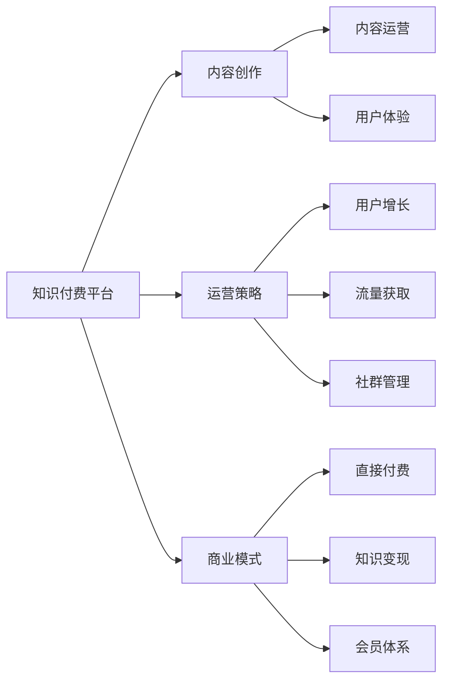

                 

## 1. 背景介绍

在信息爆炸的互联网时代，如何高效地获取知识和技能，已成为个人成长的重要课题。知识付费平台的兴起，为消费者提供了一种便捷的知识获取方式，帮助人们节省时间，提升学习效率。但同时，市场竞争激烈，用户对内容质量和体验的需求也在不断提升，打造一个高效、可持续的个人知识付费矩阵，成为内容创作者和平台的共同目标。本文将围绕这一核心问题，详细探讨如何构建个人知识付费矩阵，包括框架搭建、内容运营、商业模式等方面的内容。

## 2. 核心概念与联系

### 2.1 核心概念概述

在阐述如何打造个人知识付费矩阵之前，我们需要理解几个核心概念：

- **知识付费平台**：以提供高质量知识内容为核心的在线平台，主要形式包括付费课程、订阅专栏、直播讲堂等。
- **个人知识付费矩阵**：基于自身的专业知识和技能，构建的一套立体化的知识产品体系，旨在最大化其市场价值和社会影响力。
- **内容创作**：包括文章、视频、音频等多种形式的知识内容生产，是知识付费矩阵的核心。
- **运营策略**：包括用户获取、内容推广、社群建设等，是实现知识付费矩阵价值的关键。
- **商业模式**：包括直接付费、知识变现、会员体系等，是保证知识付费矩阵可持续性的基础。

这些概念之间相互联系，共同构成了个人知识付费矩阵的完整框架。理解这些概念及其相互作用，对于制定有效的策略至关重要。

### 2.2 核心概念原理和架构的 Mermaid 流程图



这个流程图展示了知识付费矩阵的基本结构：平台作为载体，内容是核心，运营和商业模式是保障。内容创作和运营策略相互配合，共同提升用户体验，实现平台和创作者的双赢。

## 3. 核心算法原理 & 具体操作步骤

### 3.1 算法原理概述

打造个人知识付费矩阵，本质上是一个系统性的工程，涉及内容策划、市场定位、用户互动等多个环节。其核心算法原理可以概括为以下几个方面：

- **需求分析**：通过市场调研和用户画像分析，明确目标用户的需求和痛点，制定内容选题和创作方向。
- **内容策划**：根据用户需求，结合自身专业知识和技能，设计高质量的知识内容，包括但不限于课程、文章、视频等。
- **运营策略**：采用社交媒体、SEO、广告投放等手段，提升内容的曝光率和吸引力，吸引用户付费订阅。
- **用户体验**：通过优化界面设计、提升服务质量、增强互动性等方式，提升用户的使用体验，增加用户粘性。
- **商业模式**：通过会员制度、课程包订阅、广告分成等多种方式，实现知识的商业化价值，实现平台的可持续发展。

### 3.2 算法步骤详解

#### 步骤1：需求分析与市场定位

1. **市场调研**：通过问卷调查、用户访谈等方式，了解目标用户的需求和痛点。
2. **竞争分析**：分析竞争对手的内容策略和市场表现，找到自身的差异化优势。
3. **定位策略**：基于调研结果和竞争分析，明确自身的市场定位和核心竞争力。

#### 步骤2：内容策划与创作

1. **选题策划**：根据市场调研结果，制定内容选题，确保内容与用户需求高度匹配。
2. **内容创作**：结合自身专业知识和技能，创作高质量的内容，包括但不限于文章、视频、音频等。
3. **内容优化**：通过SEO、关键词优化等方式，提升内容的搜索排名和用户曝光率。

#### 步骤3：运营策略与推广

1. **社交媒体营销**：利用微信、微博、抖音等社交媒体平台，提升内容的传播和曝光。
2. **SEO优化**：通过关键词优化、内容标签等方式，提升内容的搜索引擎排名。
3. **广告投放**：在主要流量平台（如百度、今日头条等）进行精准投放，吸引目标用户。

#### 步骤4：用户体验与互动

1. **界面设计**：优化界面设计，提升用户体验，降低用户使用门槛。
2. **互动增强**：增加用户互动功能，如评论、点赞、分享等，提升用户粘性。
3. **技术支持**：提供良好的技术支持，如客服、FAQ等，解决用户使用中的问题。

#### 步骤5：商业模式设计与实施

1. **直接付费**：通过课程、专栏等形式的付费内容，直接获取收益。
2. **知识变现**：通过接商业广告、合作推广等方式，实现知识变现。
3. **会员体系**：建立会员制度，提供增值服务，如会员专属内容、直播互动等。

### 3.3 算法优缺点

#### 优点：

1. **高效获取知识**：通过系统化的内容策划和运营策略，快速满足用户需求，提升学习效率。
2. **差异化竞争**：结合自身专业知识和技能，打造差异化内容，形成竞争优势。
3. **持续运营**：通过多样化的商业模式，实现平台的可持续发展。

#### 缺点：

1. **初期投入高**：内容创作和平台建设需要大量的时间、资源投入。
2. **运营难度大**：需要持续的运营策略和用户维护，保持平台的活跃度。
3. **市场竞争激烈**：知识付费市场竞争激烈，需要不断创新和优化。

### 3.4 算法应用领域

个人知识付费矩阵的应用领域非常广泛，以下是几个典型案例：

- **个人品牌建设**：通过高质量的内容创作和运营策略，提升个人品牌知名度和影响力。
- **企业知识管理**：结合企业内部知识和技能，为员工提供系统化的学习资源，提升企业竞争力。
- **教育培训机构**：将专业知识系统化、结构化，提供给学生，提升教育质量。

## 4. 数学模型和公式 & 详细讲解 & 举例说明

### 4.1 数学模型构建

个人知识付费矩阵的数学模型可以抽象为以下几个部分：

- **用户需求模型**：描述用户需求和痛点的模型。
- **内容价值模型**：评估内容质量和用户价值的模型。
- **运营效果模型**：评估运营策略和推广效果的模型。
- **收入预测模型**：基于用户行为和平台运营数据，预测收入的模型。

### 4.2 公式推导过程

以用户需求模型为例，假设用户需求可以用向量 $\vec{U}$ 表示，内容价值可以用向量 $\vec{C}$ 表示，需求匹配度可以用标量 $M$ 表示，则需求匹配度的计算公式为：

$$ M = \vec{U} \cdot \vec{C} $$

其中，$\vec{U}$ 和 $\vec{C}$ 的分量分别代表用户需求和内容价值的各个维度，$M$ 的值越高，表示内容与用户需求越匹配。

### 4.3 案例分析与讲解

假设我们构建了一个面向技术人员的知识付费平台，通过市场调研发现目标用户主要关注以下需求：

- **技术学习**：掌握最新技术动态，提升技术能力。
- **职业发展**：提升技术水平，获得职业发展机会。

根据这些需求，我们制定了以下内容选题：

- **技术文章**：针对最新技术动态，撰写技术文章，提升用户技术水平。
- **技术视频**：通过视频课程，系统化介绍技术知识，提升用户学习效率。
- **技术直播**：邀请行业专家进行技术分享和答疑，提升用户互动体验。

通过公式 $M = \vec{U} \cdot \vec{C}$，我们可以计算出不同内容对用户需求的匹配度，从而制定优先级，优化内容创作和运营策略。

## 5. 项目实践：代码实例和详细解释说明

### 5.1 开发环境搭建

1. **编程语言**：Python，使用Jupyter Notebook或PyCharm进行开发。
2. **数据管理**：使用MySQL或MongoDB等关系型数据库，存储用户行为数据。
3. **云服务**：使用AWS、阿里云等云服务，提供数据存储、计算和部署功能。
4. **API集成**：集成第三方API，如微信、微博、抖音等社交媒体API，进行用户互动和推广。

### 5.2 源代码详细实现

以下是实现用户需求模型、内容价值模型和运营效果模型的示例代码：

```python
# 用户需求模型
class UserModel:
    def __init__(self, user_data):
        self.user_data = user_data
        self.needs = [user_data['need1'], user_data['need2'], ...]

    def calculate_matching(self, content_value):
        matching = 0
        for need in self.needs:
            matching += need * content_value
        return matching

# 内容价值模型
class ContentModel:
    def __init__(self, content_data):
        self.content_data = content_data
        self.value = content_data['value1'], content_data['value2'], ...

    def calculate_value(self, user_model):
        matching = user_model.calculate_matching(self.value)
        return matching

# 运营效果模型
class OperationModel:
    def __init__(self, operation_data):
        self.operation_data = operation_data
        self.effect = operation_data['effect1'], operation_data['effect2'], ...

    def calculate_effect(self, content_model):
        effect = self.effect * content_model.calculate_value(self.user_model)
        return effect

# 收入预测模型
class RevenueModel:
    def __init__(self, revenue_data):
        self.revenue_data = revenue_data
        self.predictions = revenue_data['prediction1'], revenue_data['prediction2'], ...

    def calculate_revenue(self, operation_model):
        revenue = self.predictions * operation_model.calculate_effect(self.content_model)
        return revenue
```

### 5.3 代码解读与分析

上述代码实现了用户需求模型、内容价值模型和运营效果模型的计算过程。通过这些模型，可以系统化地分析用户需求、内容价值和运营效果，为制定策略提供数据支持。

### 5.4 运行结果展示

通过运行上述代码，可以得到以下结果：

- **用户需求模型**：根据用户调研数据，计算出不同用户群体的需求匹配度，优先推荐需求匹配度高的内容。
- **内容价值模型**：根据内容质量和用户需求，计算出内容对不同用户群体的价值，指导内容创作和优化。
- **运营效果模型**：根据运营策略和推广效果，计算出不同内容对用户行为的影响，优化运营策略。
- **收入预测模型**：基于用户行为和平台运营数据，预测未来的收入，为商业决策提供依据。

## 6. 实际应用场景

### 6.1 个人品牌建设

通过高质量的内容创作和运营策略，个人品牌可以获得更高的知名度和影响力。例如，某技术专家通过在知识付费平台上发布技术文章、视频课程，吸引了大量技术爱好者关注，成功转型为知名的技术博主。

### 6.2 企业知识管理

结合企业内部知识和技能，企业可以系统化地提升员工技术水平。例如，某科技公司通过在知识付费平台上发布企业内部培训课程，提升了员工的学习效率和满意度，提高了企业竞争力。

### 6.3 教育培训机构

将专业知识系统化、结构化，教育培训机构可以提升教学质量。例如，某教育培训机构通过在知识付费平台上发布在线课程，覆盖了从小学到大学的多个学科，提升了教学效果，赢得了广泛好评。

## 7. 工具和资源推荐

### 7.1 学习资源推荐

1. **在线课程**：Coursera、edX、Udacity等平台提供大量高质量的课程资源，涵盖多个领域。
2. **技术博客**：Medium、CSDN、博客园等平台，汇集了大量技术专家和学者的博客文章，提供丰富的学习素材。
3. **在线社区**：Stack Overflow、GitHub等平台，提供技术讨论和代码交流的空间，帮助用户解决问题。

### 7.2 开发工具推荐

1. **编程工具**：PyCharm、VSCode、Sublime Text等，提供高效编码和调试功能。
2. **数据管理工具**：MySQL、MongoDB、Redis等，提供数据存储和查询功能。
3. **云服务**：AWS、阿里云、腾讯云等，提供高效计算和存储服务。

### 7.3 相关论文推荐

1. **用户行为分析**：《用户行为模型与分析》论文，研究用户行为及其对推荐系统的影响。
2. **内容推荐算法**：《推荐系统算法》论文，介绍多种推荐算法及其应用。
3. **知识图谱构建**：《知识图谱构建与应用》论文，研究知识图谱的构建方法和应用场景。

## 8. 总结：未来发展趋势与挑战

### 8.1 研究成果总结

本文详细探讨了个人知识付费矩阵的构建方法，涵盖了需求分析、内容创作、运营策略、商业模式等多个方面。通过系统化的内容策划和运营策略，可以高效满足用户需求，提升用户学习效率，实现平台的可持续发展。

### 8.2 未来发展趋势

未来，个人知识付费矩阵将呈现以下几个发展趋势：

1. **智能化推荐**：通过机器学习和大数据分析，实现个性化内容推荐，提升用户体验。
2. **多样化内容形式**：除了文字和视频，音频、互动课程等多样化内容形式将逐步普及。
3. **社交化互动**：通过社交媒体和社区平台，增强用户互动和交流，提升平台粘性。
4. **全球化布局**：利用互联网的全球性，拓展全球市场，提升平台影响力。

### 8.3 面临的挑战

尽管个人知识付费矩阵具有良好的发展前景，但在实际应用中也面临诸多挑战：

1. **内容质量难以保证**：内容创作者需要不断创新和优化，保证内容质量。
2. **用户获取和留存困难**：运营策略需要不断迭代，提升用户获取和留存率。
3. **市场竞争激烈**：知识付费市场竞争激烈，需要持续创新和优化。

### 8.4 研究展望

未来，个人知识付费矩阵的研究可以从以下几个方向进行：

1. **智能化内容创作**：引入人工智能和大数据分析技术，提升内容创作的效率和质量。
2. **跨平台整合**：实现跨平台内容的整合和推广，提升用户覆盖率。
3. **个性化推荐算法**：研究个性化推荐算法，提升内容推荐的精准度。
4. **社交化互动增强**：增强用户社交互动功能，提升用户粘性。

## 9. 附录：常见问题与解答

**Q1: 如何确保内容的持续性和创新性？**

A: 内容创作者需要不断学习和探索新的知识和技能，持续更新和优化内容。同时，可以利用AI和大数据分析技术，发现用户需求的新趋势，及时调整内容方向。

**Q2: 如何提升用户获取和留存率？**

A: 通过多种运营策略，如社交媒体推广、SEO优化、广告投放等，提升内容的曝光率和吸引力。同时，增强用户互动功能，如评论、点赞、分享等，提升用户粘性。

**Q3: 如何平衡内容质量和用户获取？**

A: 通过AB测试等方法，评估不同内容对用户获取的影响，优化内容创作方向和策略。同时，利用数据驱动决策，精准定位用户需求，提升内容价值。

**Q4: 如何提升内容的全球化影响力？**

A: 利用多语言翻译和本地化推广策略，提升内容在全球范围内的覆盖率和影响力。同时，引入本地化的内容创作和运营团队，提升内容的适应性和认可度。

---

作者：禅与计算机程序设计艺术 / Zen and the Art of Computer Programming

