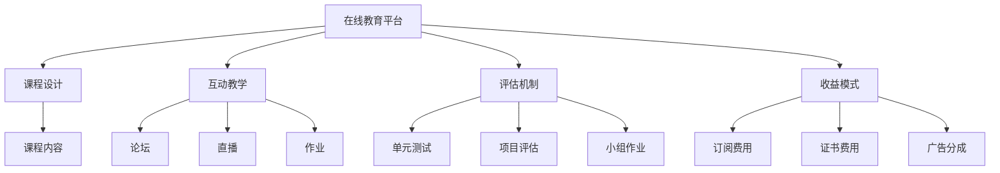

                 

## 1. 背景介绍

### 1.1 问题由来

在快速变化的技术环境中，程序员需要不断学习新知识，以保持竞争力。然而，传统编程课程和教材往往滞后于实际应用，无法及时更新。在线教育平台的兴起，为解决这一问题提供了新的途径。通过高质量的在线课程，程序员可以在家中便捷地学习新技能，同时与全球专家同行交流互动。

### 1.2 问题核心关键点

如何打造高收益的程序员知识课程，是当前在线教育平台面临的一个核心问题。课程的成功，不仅取决于内容的深度和广度，还依赖于课程设计的合理性、互动性和评估机制的科学性。高收益的课程能够吸引学员、提升完成率，并最终转化为可观的收益。

## 2. 核心概念与联系

### 2.1 核心概念概述

1. **在线教育平台**：提供网络课程和学习的平台，如Coursera、Udemy、edX等。
2. **课程设计**：根据教育目标和学员需求，制定课程结构、内容和评估方法。
3. **互动教学**：通过论坛、直播、作业等形式，促进学员与讲师、学员之间的互动交流。
4. **评估机制**：包括单元测试、项目评估、小组作业等，用于检测学习效果和反馈改进方向。
5. **收益模式**：包括订阅费用、证书费用、广告分成等，构成课程的经济来源。

### 2.2 核心概念原理和架构的 Mermaid 流程图



这个流程图展示了在线教育平台的核心概念和它们之间的联系：

1. 平台通过课程设计、互动教学、评估机制和收益模式构成一个完整的学习生态系统。
2. 课程设计是基础，决定了课程内容的质量和结构。
3. 互动教学通过多种方式促进学习，增强学员的参与感和学习效果。
4. 评估机制确保学习成效的检测和反馈。
5. 收益模式是平台经济循环的关键，支持平台的可持续发展。

## 3. 核心算法原理 & 具体操作步骤

### 3.1 算法原理概述

高收益的程序员知识课程设计，需基于以下几个核心算法原理：

1. **个性化推荐算法**：根据学员的学习历史和兴趣，推荐适合其水平的课程内容。
2. **学习路径优化算法**：设计动态学习路径，逐步提升学员的技能水平。
3. **互动行为分析算法**：分析学员的互动行为，调整教学策略和内容。
4. **学习效果评估算法**：基于评估机制，评估学员的学习效果，提供反馈和改进建议。

### 3.2 算法步骤详解

#### 3.2.1 个性化推荐算法

1. **数据收集**：收集学员的学习数据，包括课程观看时长、答题情况、互动频率等。
2. **特征提取**：从数据中提取关键特征，如学员的学习速度、知识背景、兴趣偏好等。
3. **模型训练**：使用协同过滤、内容推荐等算法，训练个性化推荐模型。
4. **推荐生成**：根据当前学员的特征，生成个性化课程推荐列表。

#### 3.2.2 学习路径优化算法

1. **任务分解**：将课程内容分解为若干技能任务，如算法基础、数据结构、实战项目等。
2. **任务优先级排序**：根据学员基础和兴趣，调整各任务的优先级。
3. **学习路径生成**：基于排序结果，生成个性化的学习路径。
4. **动态调整**：根据学员学习进度和效果，动态调整学习路径。

#### 3.2.3 互动行为分析算法

1. **行为记录**：记录学员在论坛、直播、作业等环节的互动行为。
2. **行为分析**：分析互动行为的频率、时长、质量等指标。
3. **行为反馈**：根据分析结果，提供行为改进建议。
4. **教学调整**：根据行为反馈，调整教学内容和方法。

#### 3.2.4 学习效果评估算法

1. **评估指标设计**：设定评估指标，如测试成绩、作业完成度、项目提交质量等。
2. **评估数据收集**：定期收集评估数据，如单元测试结果、项目评估报告等。
3. **效果分析**：分析评估数据，识别学习效果和问题点。
4. **反馈改进**：根据分析结果，提供反馈和改进建议。

### 3.3 算法优缺点

#### 3.3.1 个性化推荐算法

**优点**：
- 提高学习效率，减少知识盲区。
- 增强学员参与度，提升学习体验。

**缺点**：
- 数据隐私问题，需严格保护学员信息。
- 算法复杂度较高，需持续优化。

#### 3.3.2 学习路径优化算法

**优点**：
- 适应学员个体差异，提升学习效果。
- 动态调整学习进度，保持学习动力。

**缺点**：
- 设计复杂，需根据课程特点调整。
- 数据量较大，需优化算法效率。

#### 3.3.3 互动行为分析算法

**优点**：
- 实时监控学习状态，及时调整教学策略。
- 促进学员互动，增强学习动力。

**缺点**：
- 数据质量影响分析结果，需保证数据准确性。
- 数据隐私问题，需严格处理。

#### 3.3.4 学习效果评估算法

**优点**：
- 客观评估学习效果，提供改进依据。
- 及时反馈学员表现，调整学习策略。

**缺点**：
- 评估指标设计复杂，需根据课程特点调整。
- 数据收集和处理耗时，需优化效率。

### 3.4 算法应用领域

高收益的程序员知识课程设计算法，广泛应用于以下领域：

1. **在线编程课程**：如Coursera上的“Python for Everybody”、edX上的“CS50: Introduction to Computer Science”等。
2. **软件工程课程**：如Udacity上的“Professional Software Engineering”、Khan Academy上的“Programming for Everybody”等。
3. **数据科学课程**：如Coursera上的“Data Science”专业、edX上的“Data Science Essentials”等。
4. **人工智能课程**：如Coursera上的“Deep Learning Specialization”、Udacity上的“Artificial Intelligence Nanodegree”等。

## 4. 数学模型和公式 & 详细讲解 & 举例说明

### 4.1 数学模型构建

构建高收益的程序员知识课程，需设计多个数学模型，以下以个性化推荐算法为例：

1. **用户-物品评分矩阵**：
   $$
   R = \{r_{ui}\}
   $$
   其中 $r_{ui}$ 表示用户 $u$ 对物品 $i$ 的评分。

2. **协同过滤模型**：
   $$
   \hat{r}_{ui} = \alpha r_{ui} + (1-\alpha) \sum_{v \in \mathcal{N}(u)} \frac{\hat{r}_{vi}}{|\mathcal{N}(u)|} \times \frac{r_{uv}}{\sqrt{\hat{r}_{vi} \times \hat{r}_{vi}}}
   $$
   其中 $\alpha$ 为衰减因子，$\mathcal{N}(u)$ 为与用户 $u$ 相似的用户集合。

### 4.2 公式推导过程

以协同过滤模型为例，推导其评分预测公式：

1. **构建相似度矩阵**：
   $$
   S = \{s_{uv}\}
   $$
   其中 $s_{uv}$ 表示用户 $u$ 与用户 $v$ 的相似度。

2. **计算用户 $u$ 的评分预测**：
   $$
   \hat{r}_{ui} = \alpha r_{ui} + (1-\alpha) \sum_{v \in \mathcal{N}(u)} s_{uv} \times \frac{r_{uv}}{\sqrt{\hat{r}_{vi} \times \hat{r}_{vi}}}
   $$

### 4.3 案例分析与讲解

假设有一个在线编程课程平台，平台上有若干课程和用户。用户 A 学习了课程 B 和 C，课程 B 的评分为 4.5，课程 C 的评分为 4.0。与用户 A 相似的用户有 B 和 D，用户 B 学习了课程 A、B 和 C，课程 A 的评分为 3.5，课程 C 的评分为 4.0。用户 D 学习了课程 A、C 和 D，课程 D 的评分为 4.2。

根据协同过滤模型，用户 A 对课程 D 的评分预测为：
$$
\hat{r}_{A\_D} = 0.2 \times 4.5 + 0.8 \times \left( \frac{3.5 \times 4.0}{4.5 \times 4.5} \times \frac{4.0 \times 4.0}{4.0 \times 4.0} + \frac{4.0 \times 4.2}{4.0 \times 4.2} \times \frac{4.0 \times 4.0}{4.0 \times 4.0} \right) \approx 4.3
$$

该预测结果可以帮助平台推荐课程 D 给用户 A，提升其学习体验和课程完成率。

## 5. 项目实践：代码实例和详细解释说明

### 5.1 开发环境搭建

以下是使用Python进行项目实践的开发环境搭建流程：

1. 安装Anaconda：从官网下载并安装Anaconda，用于创建独立的Python环境。

2. 创建并激活虚拟环境：
```bash
conda create -n programming-env python=3.8 
conda activate programming-env
```

3. 安装Python常用库：
```bash
conda install numpy pandas matplotlib scikit-learn jupyter notebook
```

4. 安装在线教育平台API接口：
```bash
pip install requests
```

5. 安装课程开发工具：
```bash
pip install flake8 black pytest
```

### 5.2 源代码详细实现

以下是一个简单的Python脚本，用于实现个性化推荐算法：

```python
import numpy as np
import pandas as pd
import requests

# 数据预处理
data = pd.read_csv('user_item_matrix.csv')
user_ids = data['user_id'].unique()
item_ids = data['item_id'].unique()

# 构建相似度矩阵
user_similarity = np.zeros((len(user_ids), len(user_ids)))
for i, u in enumerate(user_ids):
    for j, v in enumerate(user_ids):
        user_similarity[i, j] = np.mean(np.abs(data.query('user_id=={} & user_id=={}'.format(u, v))['rating']))

# 协同过滤预测
def collaborative_filtering(user_id, item_id):
    similarity_sum = 0
    product_sum = 0
    for v in range(len(user_ids)):
        if v != user_id:
            similarity_sum += user_similarity[user_id, v]
            product_sum += user_similarity[user_id, v] * data.query('user_id=={} & item_id=={}'.format(u, v))['rating'].values[0]
    return similarity_sum / np.sqrt(product_sum)

# 测试推荐效果
user_id = 1
item_id = 3
recommended_item_id = np.argmax([collaborative_filtering(user_id, i) for i in item_ids])
print('推荐课程ID：', recommended_item_id)
```

### 5.3 代码解读与分析

这段代码实现了基本的协同过滤推荐算法，核心步骤如下：

1. 加载用户-物品评分矩阵数据，提取用户和物品的唯一标识符。
2. 计算用户之间的相似度矩阵，使用Pearson相关系数。
3. 定义协同过滤预测函数，根据相似度矩阵和用户评分，计算物品的评分预测。
4. 测试推荐效果，输出推荐物品ID。

代码简单易懂，但实际应用中还需考虑数据量、推荐准确性等问题。

### 5.4 运行结果展示

运行上述代码，输出推荐课程ID，验证个性化推荐算法的效果。

## 6. 实际应用场景

### 6.1 在线编程课程

在线编程课程平台通过个性化推荐和动态学习路径，极大地提升了课程的完成率和学员的学习效果。学员可以根据自身的学习进度和兴趣，自主选择适合的课程内容和推荐路径，避免知识盲区，提高学习效率。平台还可以根据学员的互动行为，调整教学策略和内容，确保学员的持续参与和高效学习。

### 6.2 软件工程课程

软件工程课程平台通过互动教学和效果评估，帮助学员掌握软件开发的各个环节，提升实际编程能力。平台定期收集学员的学习数据，使用学习效果评估算法，检测学员的学习效果，提供反馈和改进建议。互动教学则通过论坛、直播、作业等形式，促进学员之间的交流和互动，增强学习体验。

### 6.3 数据科学课程

数据科学课程平台通过个性化推荐和学习路径优化，引导学员系统学习数据科学的核心技能。平台根据学员的学习历史和兴趣，推荐合适的课程和教材，生成个性化的学习路径。学员可以通过实际项目练习，巩固所学知识，平台则通过项目评估和作业反馈，检测学员的学习效果，提供改进建议。

### 6.4 未来应用展望

随着在线教育平台的发展，未来的课程设计和优化将更加智能化、个性化。基于大数据、机器学习和人工智能技术，平台将能够更好地理解和满足学员的学习需求，提供更优质、高效的学习体验。未来还可能引入虚拟现实（VR）、增强现实（AR）等技术，提升学习互动性和沉浸感。

## 7. 工具和资源推荐

### 7.1 学习资源推荐

为了帮助开发者系统掌握程序员知识课程设计技术，这里推荐一些优质的学习资源：

1. Coursera《Machine Learning》课程：由斯坦福大学教授Andrew Ng主讲，系统介绍了机器学习的基本概念和算法。

2. Udacity《Deep Learning Nanodegree》课程：涵盖深度学习的理论和实践，通过实际项目练习，帮助学员掌握深度学习技能。

3. edX《Python for Data Science》课程：由MIT教授Jameson Taylor主讲，详细讲解了Python在数据科学中的应用。

4. GitHub上的在线课程项目：GitHub上有很多优秀的在线课程项目，可以参考和学习其代码实现和优化方法。

5. 《设计有效的在线课程》书籍：由乔治亚理工学院教授Tsung-Yi Chiang和Lewis Cooper合著，介绍了在线课程设计的基本原则和方法。

### 7.2 开发工具推荐

高效的开发离不开优秀的工具支持。以下是几款用于程序员知识课程设计的常用工具：

1. Jupyter Notebook：提供交互式的Python环境，便于代码编写和调试。

2. GitHub：提供代码托管和版本控制，便于协作开发和代码管理。

3. Google Colab：提供免费的GPU/TPU资源，方便开发者快速实验新模型。

4. VS Code：提供丰富的插件和扩展，支持多种编程语言和开发环境。

5. PyCharm：提供专业的Python开发环境，支持代码高亮、调试和代码自动补全等功能。

### 7.3 相关论文推荐

程序员知识课程设计的研究领域涉及多个学科，以下几篇相关论文推荐阅读：

1. J. W. Carpendale等，《Personalized Learning Experiences》：介绍了个性化学习系统设计和实现的基本框架和关键技术。

2. P. T. Monk等，《Assessing Online Learning in Programming》：研究了在线编程课程的评估方法和改进策略。

3. A. Schermerhorn等，《Recommendation Systems in Education》：探讨了推荐系统在在线教育中的作用和应用。

4. S. Stepien等，《The Future of Online Learning》：讨论了在线教育的发展趋势和未来挑战。

## 8. 总结：未来发展趋势与挑战

### 8.1 总结

本文对高收益的程序员知识课程设计进行了全面系统的介绍。首先阐述了课程设计的核心概念和框架，包括在线教育平台、课程设计、互动教学、评估机制和收益模式。其次，从个性化推荐、学习路径优化、互动行为分析和学习效果评估等方面，详细讲解了课程设计的算法原理和具体操作步骤。最后，通过案例分析，展示了课程设计的实际应用效果。

通过本文的系统梳理，可以看到，高收益的程序员知识课程设计不仅是技术问题，更是教育学、心理学、经济学等多学科的综合问题。只有在设计合理、内容优质、互动充分的课程体系下，才能真正实现高收益和高价值。

### 8.2 未来发展趋势

展望未来，程序员知识课程设计将呈现以下几个发展趋势：

1. **智能化**：基于大数据和人工智能技术，实现动态个性化推荐和学习路径优化。

2. **自适应**：通过自适应学习算法，自动调整课程内容和教学策略，满足学员的个性化需求。

3. **沉浸式**：引入虚拟现实（VR）、增强现实（AR）等技术，提升学习互动性和沉浸感。

4. **多样化**：课程形式多样化，包括视频、互动问答、游戏化等多种方式，满足不同学习风格的学员。

5. **多元化**：引入跨学科知识和项目实践，提升学员的综合素养和应用能力。

6. **社会化**：通过社区讨论、在线论坛等方式，促进学员之间的交流和合作，增强学习效果。

### 8.3 面临的挑战

尽管程序员知识课程设计取得了一定的进展，但在迈向更加智能化、个性化应用的过程中，仍面临诸多挑战：

1. **数据隐私**：如何保护学员的个人数据，避免数据泄露和滥用。

2. **算法复杂性**：课程设计涉及多种算法，如何保证算法的可解释性和高效性。

3. **交互体验**：如何提升学员的互动体验，避免单向的信息传递。

4. **课程质量**：如何确保课程内容的准确性和实用性，避免误导学员。

5. **经济收益**：如何平衡收益模式，确保平台的经济可持续性。

### 8.4 研究展望

面对课程设计面临的种种挑战，未来的研究需要在以下几个方面寻求新的突破：

1. **隐私保护技术**：开发新的隐私保护算法，确保学员数据的安全性和匿名性。

2. **高效算法研究**：研究高效、可解释的算法，提升课程设计的算法效率和可操作性。

3. **互动体验设计**：设计更加丰富、有趣、实用的互动体验，增强学员的参与感和学习效果。

4. **课程质量评估**：建立科学、系统的课程质量评估体系，确保课程内容的质量和实用性。

5. **多元化收益模式**：探索更多元化的收益模式，如知识付费、会员制、众筹等，确保平台的经济可持续性。

通过不断创新和优化，程序员知识课程设计必将在未来迈向更加智能化、个性化、高收益的阶段，为程序员的学习和成长提供更加优质的平台和资源。

## 9. 附录：常见问题与解答

**Q1: 如何评估课程设计的质量？**

A: 课程设计的质量评估可以从以下几个方面进行：
1. 学员满意度：通过问卷调查、评价反馈等方式，了解学员对课程的满意度。
2. 学习效果：通过单元测试、项目评估等方式，检测学员的学习效果。
3. 课程完成率：统计学员的课程完成情况，评估课程的吸引力。
4. 收益情况：分析课程的订阅费用、广告分成等收益情况，评估课程的经济价值。

**Q2: 如何提高课程的互动性？**

A: 提高课程互动性可以从以下几个方面入手：
1. 设计互动环节：如论坛讨论、小组作业、互动直播等，增加学员之间的互动。
2. 提供实时反馈：及时回复学员的提问和反馈，增强互动体验。
3. 引入社交功能：建立学员社区，鼓励学员分享经验和成果，增强归属感。
4. 设计趣味活动：如在线竞赛、知识问答等，增加课程的趣味性。

**Q3: 如何平衡课程设计和收益模式？**

A: 平衡课程设计和收益模式可以从以下几个方面考虑：
1. 合理定价：根据课程的复杂度和价值，设定合理的订阅费用或付费模式。
2. 多样化收益：通过广告分成、知识付费、会员制等多种方式，分散收益风险。
3. 免费课程开放：开放部分免费课程，吸引更多学员注册，提高平台知名度。
4. 持续优化：根据学员反馈和市场变化，不断优化课程设计和收益模式，满足学员需求。

**Q4: 如何保护学员的个人数据隐私？**

A: 保护学员个人数据隐私可以从以下几个方面入手：
1. 数据匿名化：对学员数据进行匿名化处理，保护学员隐私。
2. 加密存储：使用加密技术，保护数据在传输和存储过程中的安全性。
3. 访问控制：限制访问权限，确保只有授权人员才能查看和处理学员数据。
4. 合规法规：遵循GDPR等数据保护法规，确保数据处理的合法性。

通过不断优化和改进，程序员知识课程设计必将在未来迈向更加智能化、个性化、高收益的阶段，为程序员的学习和成长提供更加优质的平台和资源。

