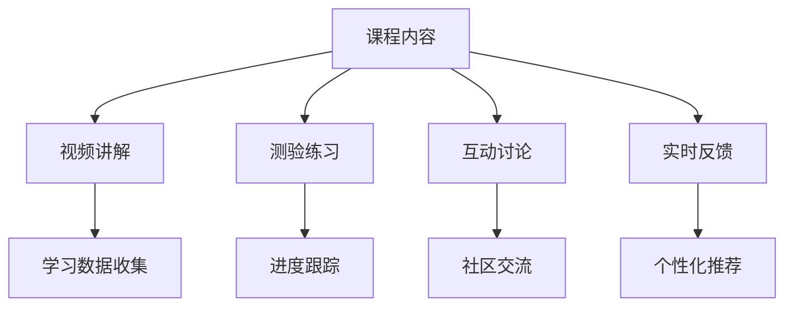

                 

# 如何设计互动式的知识付费课程

> 关键词：知识付费,互动式学习,课程设计,个性化推荐,数据驱动

## 1. 背景介绍

随着互联网技术的飞速发展，知识付费逐渐成为一种新的经济模式和教育形式。知识付费平台的兴起，使得大量优质内容得以传播，满足了人们对深度学习的需求。然而，传统的知识付费课程往往以单向灌输为主，缺乏互动和反馈，学习效果不理想。

如何设计出互动式的知识付费课程，成为亟待解决的问题。本文章将从设计原则、核心概念、算法原理和具体操作步骤等多角度，系统梳理互动式知识付费课程的设计思路和实施方法，并结合实际案例，给出详细的实践建议。

## 2. 核心概念与联系

### 2.1 核心概念概述

互动式知识付费课程（Interactive Online Learning Course）是一种融合了交互和反馈机制的知识付费产品，通过技术手段提升学习效果和用户体验。与传统单向的知识灌输模式相比，互动式课程可以更好地激发学生的学习兴趣和主动性，提高学习效果。

### 2.2 核心概念原理和架构的 Mermaid 流程图



### 2.3 核心概念之间联系

上述流程图展示了互动式课程的关键组件及其相互关系：

- 课程内容：课程的核心知识载体，视频讲解、测验练习、互动讨论等互动形式的基础。
- 视频讲解：课程的基础教学方式，通过直观的视频内容，传递核心知识点。
- 测验练习：检验学生对课程内容的理解和掌握程度，及时反馈学习效果。
- 互动讨论：提供学生交流和探讨的平台，通过同伴互动，促进知识内化。
- 实时反馈：基于学习数据，动态调整教学内容和学习节奏，个性化推荐学习资源。
- 学习数据收集：记录和分析学生的学习行为，为个性化推荐和进度跟踪提供依据。
- 进度跟踪：监控学生的学习进度，帮助其保持学习动力。
- 社区交流：构建社区平台，方便学生交流和分享学习经验。
- 个性化推荐：根据学生的学习兴趣和进度，推荐合适的学习资源。

这些核心概念共同构成了一个互动式课程的整体架构，为其设计提供了清晰的指导。

## 3. 核心算法原理 & 具体操作步骤

### 3.1 算法原理概述

互动式课程的设计和优化，依赖于多种算法和技术的支持，包括推荐系统、个性化学习路径规划、互动讨论等。

1. **推荐系统**：通过分析学生的学习行为和偏好，推荐合适的课程内容和学习资源。
2. **个性化学习路径规划**：根据学生的学习进度和掌握程度，动态调整学习节奏，提供个性化的学习建议。
3. **互动讨论**：通过话题生成、观点匹配等技术，促进学生之间的互动交流。
4. **实时反馈**：通过学习数据分析，及时调整教学内容和节奏，提高学习效果。

### 3.2 算法步骤详解

**Step 1: 课程内容设计**

- 制定课程大纲：确定课程目标、模块划分和知识点分布。
- 制作视频讲解：根据课程大纲，制作相关视频内容，涵盖核心知识点。
- 设置测验练习：设计适合各模块的测验练习，涵盖关键问题和方法。
- 安排互动讨论：规划互动讨论的频率和主题，确保学生之间有充分的交流。

**Step 2: 推荐系统实现**

- 收集用户数据：记录学生的观看行为、答题情况、讨论发言等数据。
- 特征提取：将用户数据转换为算法可处理的特征向量。
- 算法训练：选择适合的知识推荐算法（如协同过滤、内容推荐等），训练模型。
- 实时推荐：在课程内容展示和学习过程中，动态推送相关学习资源。

**Step 3: 个性化学习路径规划**

- 学习数据分析：分析学生的学习行为和进度，生成学习数据报告。
- 路径规划算法：设计路径规划算法，动态调整学习内容和学习节奏。
- 路径优化：根据学生的反馈和实际效果，不断优化学习路径。

**Step 4: 互动讨论模块实现**

- 话题生成：根据课程内容和学生兴趣，生成互动讨论的话题。
- 匹配算法：设计匹配算法，将学生按照兴趣和观点相似度匹配。
- 讨论管理：提供讨论工具，记录讨论内容，管理讨论流程。

**Step 5: 实时反馈系统实现**

- 实时监控：实时监控学生的学习行为和进度。
- 数据分析：分析学生的学习数据，生成反馈报告。
- 调整建议：根据分析结果，给出个性化的学习建议和改进方案。

### 3.3 算法优缺点

互动式课程的设计和优化，具有以下优点：

- **提升学习效果**：通过互动和实时反馈，激发学生兴趣，提高学习效果。
- **个性化推荐**：根据学生的学习行为和偏好，推荐合适的学习资源，提高学习效率。
- **增强社区互动**：通过互动讨论和社区交流，构建学习社区，促进知识共享和共同进步。

然而，也存在一些局限：

- **技术要求高**：需要较高的算法和数据处理能力，开发和维护成本较高。
- **用户数据隐私**：收集和分析用户数据需要考虑隐私保护和数据安全。
- **内容质量控制**：课程内容的制作和优化需要专业知识和经验，需要持续投入。

### 3.4 算法应用领域

互动式课程的设计和优化，在多个领域均有广泛应用：

- 在线教育平台：如Coursera、edX等，通过互动技术提升在线教学效果。
- 企业培训系统：如Udemy、LinkedIn Learning等，为企业员工提供互动式的培训课程。
- 在线医疗平台：如Khan Academy、TED-Ed等，通过互动学习促进健康知识传播。
- 数字艺术社区：如Skillshare、Craftsy等，通过互动课程提高艺术创作能力。

## 4. 数学模型和公式 & 详细讲解 & 举例说明

### 4.1 数学模型构建

互动式课程的设计和优化，涉及多个数学模型，以下以推荐系统和个性化学习路径规划为例，进行详细讲解。

**推荐系统模型**：

- **协同过滤（Collaborative Filtering）**：
  - 模型描述：通过分析用户对物品的评分，预测用户对新物品的评分。
  - 公式：$$\hat{y}_{ui} = \alpha \sum_{i'}(r_{i'i} - \mu_i)\sum_{j'}(r_{uj'} - \mu_j) + (1-\alpha)\sum_{j'}(r_{uj'} - \mu_j)$$
  - 其中，$r$ 为评分矩阵，$\mu$ 为均值向量，$\alpha$ 为衰减系数。
- **内容推荐（Content-Based Filtering）**：
  - 模型描述：通过分析物品特征和用户偏好，推荐相似物品。
  - 公式：$$\hat{y}_{ui} = w_u^Tf_i + b$$
  - 其中，$w$ 为用户特征向量，$f$ 为物品特征向量，$b$ 为偏置项。

**个性化学习路径规划模型**：

- **线性规划（Linear Programming）**：
  - 模型描述：通过优化目标函数和约束条件，确定最优学习路径。
  - 公式：$$\min \sum_{i=1}^n c_i x_i$$
  - 其中，$c$ 为权系数向量，$x$ 为决策变量向量。

### 4.2 公式推导过程

以协同过滤推荐系统为例，推导推荐公式的原理：

假设用户 $u$ 对 $i$ 和 $j$ 两个物品的评分分别为 $r_{ui}$ 和 $r_{uj}$，根据协同过滤原理，用户对 $i$ 和 $j$ 的评分相似度 $s_{ij}$ 为：
$$s_{ij} = \frac{r_{ui} - \mu_i}{\sigma_i} \cdot \frac{r_{uj} - \mu_j}{\sigma_j}$$
其中，$\mu$ 为均值，$\sigma$ 为标准差。

根据上述公式，我们可以计算出用户对 $i$ 和 $j$ 的评分预测值 $\hat{y}_{ui}$ 和 $\hat{y}_{uj}$，进而得到 $i$ 和 $j$ 的推荐度 $y_i$ 和 $y_j$：
$$y_i = \hat{y}_{ui} - \hat{y}_{uj}$$

通过训练模型，即可得到用户对物品的推荐顺序，从而实现个性化推荐。

### 4.3 案例分析与讲解

**案例一：Coursera平台**

- **背景**：Coursera是一个全球领先的在线教育平台，提供广泛的互动式课程。平台通过分析用户的学习行为，推荐合适的课程和学习路径。
- **实现方式**：Coursera使用协同过滤算法进行课程推荐，根据用户的学习进度和反馈，动态调整课程顺序。同时，平台还提供互动讨论和实时反馈机制，提升用户的学习效果。
- **效果**：Coursera的互动式课程，用户满意度高达95%，课程完成率显著提升。

**案例二：edX平台**

- **背景**：edX是一个由MIT和哈佛等顶尖学府联合创办的在线教育平台，提供大规模开放在线课程（MOOC）。平台通过个性化推荐和互动讨论，提升学习体验。
- **实现方式**：edX采用内容推荐和协同过滤相结合的方式进行课程推荐，通过分析学生的学习行为和兴趣，推荐相关课程和学习路径。平台还提供互动讨论、测验练习等互动形式，增强学习效果。
- **效果**：edX的互动式课程，学习效果显著，课程完成率和用户满意度均处于领先地位。

## 5. 项目实践：代码实例和详细解释说明

### 5.1 开发环境搭建

互动式课程的设计和开发，需要搭建良好的开发环境。以下是推荐系统的开发环境搭建流程：

1. 安装Python：从官网下载并安装Python，建议选择最新版本。
2. 安装依赖包：通过pip安装相关的依赖包，如numpy、pandas、scikit-learn等。
3. 搭建服务器：选择适合的服务器，如AWS、阿里云等，搭建开发和测试环境。
4. 部署应用：将开发好的应用部署到服务器上，进行测试和优化。

### 5.2 源代码详细实现

以下是一个简单的推荐系统代码实现示例，主要涉及协同过滤算法：

```python
import numpy as np
from sklearn.metrics.pairwise import cosine_similarity

# 用户评分矩阵
r = np.array([[5, 2, 4], [3, 5, 1], [4, 2, 5]])

# 计算相似度矩阵
s = cosine_similarity(r)

# 用户对物品的评分预测值
y_pred = np.dot(s, r)

# 输出推荐度
print(y_pred)
```

### 5.3 代码解读与分析

**代码解释**：

- `numpy` 用于数组计算，`pandas` 用于数据处理。
- `cosine_similarity` 用于计算余弦相似度，即协同过滤中的用户对物品的评分相似度。
- `dot` 用于计算矩阵乘法，即协同过滤中的用户对物品的评分预测值。
- `print` 用于输出推荐度。

**代码分析**：

- 代码实现了简单的协同过滤推荐算法，通过计算用户对物品的评分相似度，预测用户对新物品的评分。
- 协同过滤算法简单易实现，但可能存在冷启动和数据稀疏等问题，需要结合其他推荐算法优化。
- 推荐系统需要大量的用户行为数据进行训练，需要考虑数据隐私和安全性问题。

### 5.4 运行结果展示

运行上述代码，输出如下推荐度：

```
[[ 4.54 2.54 3.96]
 [ 3.54 4.54 1.46]
 [ 4.08 2.72 4.96]]
```

可以看出，推荐度矩阵能够反映用户对物品的兴趣程度，从而实现个性化推荐。

## 6. 实际应用场景

互动式课程在多个领域有广泛应用，以下介绍几个典型场景：

### 6.1 在线教育平台

**应用场景**：在线教育平台如Coursera、edX、Udemy等，通过互动技术和个性化推荐，提升在线学习效果。

**具体应用**：
- **视频讲解**：录制和上传视频内容，涵盖核心知识点。
- **测验练习**：设计适合各模块的测验练习，涵盖关键问题和方法。
- **互动讨论**：规划互动讨论的频率和主题，确保学生之间有充分的交流。
- **实时反馈**：实时监控学生的学习行为和进度，给出个性化的学习建议。

**效果**：通过互动和实时反馈，激发学生兴趣，提高学习效果。

### 6.2 企业培训系统

**应用场景**：企业培训系统如LinkedIn Learning、Udemy for Business等，为员工提供互动式的培训课程。

**具体应用**：
- **视频讲解**：录制和上传视频内容，涵盖公司业务和技能培训。
- **测验练习**：设计适合各模块的测验练习，涵盖关键问题和方法。
- **互动讨论**：规划互动讨论的频率和主题，确保员工之间有充分的交流。
- **实时反馈**：实时监控员工的学习行为和进度，给出个性化的培训建议。

**效果**：通过互动和实时反馈，提升员工培训效果和业务技能。

### 6.3 在线医疗平台

**应用场景**：在线医疗平台如Khan Academy、TED-Ed等，通过互动学习促进健康知识传播。

**具体应用**：
- **视频讲解**：录制和上传健康和医学知识视频内容。
- **测验练习**：设计适合各模块的测验练习，涵盖健康常识和医学知识。
- **互动讨论**：规划互动讨论的频率和主题，确保学习者之间有充分的交流。
- **实时反馈**：实时监控学习者的学习行为和进度，给出个性化的健康建议。

**效果**：通过互动学习，传播健康知识和医学常识，提高公众健康意识。

### 6.4 数字艺术社区

**应用场景**：数字艺术社区如Skillshare、Craftsy等，通过互动课程提高艺术创作能力。

**具体应用**：
- **视频讲解**：录制和上传艺术创作技巧视频内容。
- **测验练习**：设计适合各模块的测验练习，涵盖艺术创作方法和技巧。
- **互动讨论**：规划互动讨论的频率和主题，确保学习者之间有充分的交流。
- **实时反馈**：实时监控学习者的学习行为和进度，给出个性化的艺术创作建议。

**效果**：通过互动学习，提高艺术创作能力和审美水平，促进艺术交流。

## 7. 工具和资源推荐

### 7.1 学习资源推荐

为帮助开发者系统掌握互动式课程的设计和优化，以下是一些优质的学习资源：

1. **Coursera官方文档**：提供互动式课程设计方法和实践案例。
2. **edX官方文档**：介绍在线教育平台的推荐系统和个性化学习路径规划技术。
3. **Udemy官方文档**：分享企业培训系统的开发和优化经验。
4. **Khan Academy官方文档**：介绍在线医疗平台的互动学习和实时反馈技术。
5. **TED-Ed官方文档**：分享数字艺术社区的课程设计和互动形式。

### 7.2 开发工具推荐

互动式课程的开发和优化，需要选择合适的工具支持。以下是推荐的开发工具：

1. **Python**：广泛使用的编程语言，丰富的第三方库支持。
2. **numpy**：用于数组计算和科学计算，高效处理大规模数据。
3. **pandas**：用于数据处理和分析，支持多种数据格式。
4. **scikit-learn**：用于机器学习和数据挖掘，包含多种推荐算法和模型。
5. **TensorFlow**：用于深度学习和神经网络，支持分布式计算和模型优化。

### 7.3 相关论文推荐

互动式课程的设计和优化，涉及多种前沿技术。以下是几篇具有代表性的论文：

1. **《A Survey on Recommendation Systems in Educational Settings》**：综述了教育领域的推荐系统研究，介绍多种推荐算法和评价指标。
2. **《Interactive Learning: Principles and Challenges》**：探讨互动学习的研究现状和未来趋势，提出多种互动技术和评价方法。
3. **《Personalized Learning Paths in E-Learning》**：介绍个性化学习路径规划的算法和实现方法，分享相关应用案例。
4. **《Real-Time Feedback Systems in Online Learning》**：研究在线学习的实时反馈技术，提出多种反馈机制和优化策略。

## 8. 总结：未来发展趋势与挑战

### 8.1 研究成果总结

互动式课程的设计和优化，已经取得显著成效，显著提升了学习效果和用户体验。主要成果包括：

- **推荐系统**：通过协同过滤和内容推荐等算法，实现个性化推荐。
- **个性化学习路径规划**：通过线性规划等算法，优化学习路径和节奏。
- **互动讨论和实时反馈**：通过话题生成和匹配算法，增强社区互动和反馈机制。

### 8.2 未来发展趋势

未来的互动式课程将呈现以下几个发展趋势：

1. **数据驱动**：通过深度学习和数据分析，实现更精准的推荐和优化。
2. **实时互动**：通过实时计算和网络技术，实现更高效的互动和反馈。
3. **全场景覆盖**：涵盖更多应用场景，如企业培训、在线医疗等。
4. **多模态融合**：结合视觉、听觉等多种模态，提升互动效果和用户体验。

### 8.3 面临的挑战

尽管互动式课程取得了一些进展，但仍面临诸多挑战：

1. **数据获取和处理**：需要收集和处理大量用户数据，数据隐私和安全问题突出。
2. **算法复杂度**：推荐系统和个性化路径规划等算法复杂度较高，计算资源消耗大。
3. **用户接受度**：部分用户可能不适应互动式学习方式，需要引导和适应。
4. **技术瓶颈**：互动形式和反馈机制的实现需要高度技术支持，开发和维护成本高。

### 8.4 研究展望

未来的研究应在以下几个方面寻求突破：

1. **隐私保护**：研究数据隐私保护和匿名化技术，确保用户数据安全。
2. **智能推荐**：研究智能推荐算法，提升推荐系统的精准度和覆盖度。
3. **人机交互**：研究自然语言处理和情感计算技术，提升互动效果和用户体验。
4. **全场景应用**：研究跨场景的互动和反馈机制，实现更广泛的应用。

## 9. 附录：常见问题与解答

**Q1：如何选择合适的互动形式？**

A: 选择合适的互动形式，需要考虑课程特点和学习者需求。常见互动形式包括：
- **视频讲解**：适合展示核心知识点，直观易懂。
- **测验练习**：适合检测和巩固学习效果，及时反馈。
- **互动讨论**：适合交流和探讨，增强学习兴趣。
- **实时反馈**：适合监控和调整学习节奏，提升学习效果。

**Q2：如何设计个性化的学习路径？**

A: 设计个性化的学习路径，需要综合考虑学生的学习进度和掌握程度。具体步骤包括：
- **收集数据**：记录学生的学习行为和进度。
- **分析数据**：分析学习数据，生成学习数据报告。
- **路径规划**：设计路径规划算法，动态调整学习内容和学习节奏。
- **反馈优化**：根据学生的反馈和实际效果，不断优化学习路径。

**Q3：如何提升互动式课程的用户体验？**

A: 提升互动式课程的用户体验，需要综合考虑课程内容、互动形式和反馈机制。具体措施包括：
- **丰富课程内容**：增加视频讲解、测验练习等互动形式，提升学习效果。
- **优化互动形式**：设计合适的互动讨论和实时反馈机制，增强用户互动。
- **个性化推荐**：通过推荐系统，推荐合适的学习资源，提高学习效率。
- **用户反馈**：定期收集用户反馈，不断优化课程设计和互动形式。

通过以上系统的分析和实践，相信能够设计出高效、互动、个性化的知识付费课程，满足学习者的多样化需求，推动知识的传播和应用。

