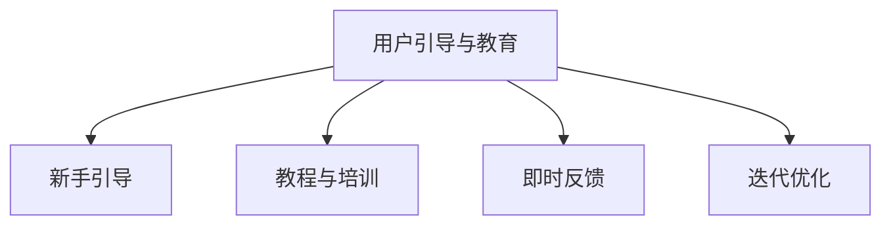

                 

## 1. 背景介绍

### 1.1 问题由来
在数字化时代，科技与日俱进，用户对数字产品的理解和使用的门槛也在不断提高。而技术驱动下的数字产品和服务的普及，不仅需要产品本身具备优秀的功能和体验，还需要用户具备足够的技术素养。用户教育成为科技产品设计中的一项重要任务。用户引导与教育（User Guidance and Education）是提升用户体验、增强用户粘性、实现产品价值的关键。

#### 1.2 问题核心关键点
在数字产品开发过程中，用户引导与教育的目的在于：
- 使用户能够充分理解产品的核心功能和操作方式。
- 提升用户对产品的兴趣和满意度，增强用户的忠诚度。
- 促进产品功能的最大化利用，提升产品的实际价值。

实现有效的用户引导和教育，需要系统性、科学性的方法。包括选择合适的引导方式、设计清晰合理的引导流程、选择和制作高质引导内容、实时反馈与迭代优化等环节。

## 2. 核心概念与联系

### 2.1 核心概念概述
在用户引导和教育中，涉及的核心概念包括：

- **用户引导与教育（User Guidance and Education）**：通过精心设计的产品和使用场景，帮助用户快速掌握产品使用方法，提高用户满意度，提升产品价值。
- **新手引导（Onboarding）**：针对新用户，通过引导流程帮助其快速上手，了解产品功能。
- **教程与培训（Tutorial and Training）**：通过具体的教学材料、互动练习等，进一步增强用户对产品功能的理解与应用。
- **即时反馈（Real-time Feedback）**：通过工具或机制，在用户操作过程中提供及时的反馈与指导，帮助用户发现问题、改正错误，提升学习效率。
- **迭代优化（Iteration and Optimization）**：持续收集用户反馈，根据反馈不断优化引导流程与内容，提升用户体验。

这些概念之间的逻辑关系可以通过以下Mermaid流程图来展示：



### 2.2 核心概念原理和架构

**新手引导（Onboarding）**：通过简单的注册流程、入门指南等，帮助用户快速进入产品，了解产品核心功能。新手引导的设计需要考虑用户的初次体验，避免复杂的流程和信息。

**教程与培训（Tutorial and Training）**：通过文字、视频、互动练习等多种形式，详细阐述产品功能与操作。教程与培训的设计需要考虑用户的学习习惯和接受程度，内容应浅显易懂，且能通过互动环节提升用户兴趣和参与度。

**即时反馈（Real-time Feedback）**：通过提示、提示框、弹框、辅助工具等，在用户操作过程中提供即时反馈。即时反馈的设计需要考虑用户的错误行为和习惯，通过正面提示帮助用户纠正错误，同时通过负面反馈引导用户改正不良操作习惯。

**迭代优化（Iteration and Optimization）**：通过用户行为数据分析、问卷调查、用户访谈等手段，收集用户反馈，根据反馈优化产品功能和引导流程。迭代优化需要持续进行，确保用户始终感受到产品改进带来的价值。

## 3. 核心算法原理 & 具体操作步骤

### 3.1 算法原理概述
用户引导与教育的核心算法原理是基于行为科学和心理学理论，通过系统性的设计提升用户的学习效率和满意度。其基本步骤包括：

1. **用户建模**：根据用户行为数据分析，了解用户特性和需求。
2. **内容设计**：根据用户特性，设计合适的引导内容与形式。
3. **流程优化**：根据用户行为分析，优化引导流程，提高用户体验。
4. **反馈与迭代**：通过实时反馈和数据分析，不断优化引导效果。

### 3.2 算法步骤详解

#### 3.2.1 用户建模
用户建模需要收集和分析用户的行为数据，了解用户的特性、需求和使用习惯。常见的数据来源包括：
- 注册信息、设备信息、地理位置等基本信息。
- 用户的操作日志、页面访问路径、点击行为等行为数据。
- 用户的反馈与评价、互动行为等交互数据。

#### 3.2.2 内容设计
根据用户建模的结果，设计适合用户特性的引导内容与形式。常见的引导内容与形式包括：
- **文字说明**：简洁明了地描述产品的核心功能和操作方式。
- **视频教程**：通过动态演示，直观展示操作流程和功能特点。
- **互动练习**：通过小游戏或实操练习，让用户亲身体验产品功能。
- **语音指引**：对于视力不佳的用户，通过语音描述帮助其理解操作。

#### 3.2.3 流程优化
设计合理的引导流程，使引导过程自然流畅，易于理解与操作。常见的优化方式包括：
- **分阶段引导**：根据用户的操作进度，逐步引入复杂功能，避免一次性信息过载。
- **页面导航**：通过明确的导航条和分页，帮助用户快速定位当前任务。
- **提示与提示框**：在用户操作时提供及时的提示和提示框，帮助用户纠正错误。

#### 3.2.4 反馈与迭代
通过即时反馈和数据分析，不断优化引导效果。常见的反馈与迭代方式包括：
- **反馈与纠正**：在用户操作错误时，通过提示框或弹窗提供纠正建议。
- **数据分析**：通过行为数据分析，了解用户的学习情况和常见问题，优化引导内容。
- **用户访谈**：通过用户访谈了解用户使用体验，收集具体反馈，优化产品功能。

### 3.3 算法优缺点

**优点**：
1. **系统性设计**：通过用户建模和行为分析，可以设计出符合用户特性与需求的引导与教育方案。
2. **交互性强**：通过互动练习、语音指引等形式，提升用户参与度和学习效率。
3. **实时反馈**：通过即时反馈机制，帮助用户及时纠正错误，提升学习效果。

**缺点**：
1. **数据隐私问题**：用户行为数据的收集与分析需要遵守数据隐私法规，确保用户隐私安全。
2. **成本高**：用户建模和数据分析需要投入大量人力和时间，成本较高。
3. **用户反馈差异大**：用户反馈差异较大，需要设计多渠道、多形式的引导内容，难以统一管理。

### 3.4 算法应用领域

用户引导与教育技术在多个领域中都有广泛应用，例如：

- **数字产品**：如电商平台、社交媒体、金融产品等，通过新手引导、教程培训、即时反馈等手段，提升用户体验。
- **企业软件**：如CRM系统、ERP系统、办公协作工具等，通过分阶段引导、实操练习等手段，帮助用户快速上手。
- **移动应用**：如教育应用、健身应用、娱乐应用等，通过图文教程、视频演示、互动练习等形式，提升用户参与度和学习效率。
- **智能设备**：如智能家居、智能穿戴设备等，通过新手引导、即时反馈等手段，提升设备的使用便捷性和用户满意度。

## 4. 数学模型和公式 & 详细讲解 & 举例说明

### 4.1 数学模型构建

在用户引导与教育中，常见的数学模型包括：

- **学习模型**：描述用户学习行为与学习效果的关系。
- **决策模型**：描述用户决策行为与引导效果的关系。
- **行为模型**：描述用户行为习惯与产品使用效果的关系。

### 4.2 公式推导过程

以**学习模型**为例，假设用户的学习效果 $E$ 与学习时间 $T$ 和引导内容质量 $C$ 的关系如下：

$$
E = f(T, C)
$$

其中，$f$ 为学习模型函数。可以进一步假设学习效果与学习时间、引导内容质量呈线性关系：

$$
E = aT + bC + c
$$

其中，$a, b, c$ 为模型参数。

### 4.3 案例分析与讲解

**案例1：电商平台用户引导**

假设电商平台的新手引导流程分为注册、登录、浏览、购物四个阶段。通过行为数据分析，发现用户在学习浏览商品时，容易忽略商品的分类信息。于是，在浏览商品时，通过弹窗展示分类信息，并添加分类筛选功能，提升用户购物体验。

通过数据分析，发现用户浏览时间与学习效果呈正相关关系，即用户浏览时间越长，学习效果越好。于是，通过设置引导内容质量评分，将分类信息的展示位置放在用户浏览时间较长的页面，进一步提升学习效果。

**案例2：企业CRM系统的用户培训**

假设企业CRM系统的用户培训分为基础操作、客户管理、销售管理三个阶段。通过问卷调查和用户访谈，发现用户在客户管理阶段容易出现错误操作。于是，在客户管理模块添加详细的教程和实操练习，并通过实时反馈机制，帮助用户及时纠正错误。

通过行为数据分析，发现用户在客户管理阶段的学习效果与实操练习次数呈正相关关系，即用户实操练习次数越多，学习效果越好。于是，在实操练习环节设置反馈机制，根据用户的操作情况提供个性化建议，进一步提升学习效果。

## 5. 项目实践：代码实例和详细解释说明

### 5.1 开发环境搭建

用户引导与教育项目的开发环境需要以下配置：

1. **编程语言**：Python 3.x
2. **数据处理库**：Pandas、NumPy
3. **数据分析库**：Scikit-learn
4. **用户界面库**：Flask、Django
5. **数据可视化库**：Matplotlib、Seaborn
6. **实时反馈库**：React、Vue

### 5.2 源代码详细实现

以下是一个简单的用户引导与教育系统的Python代码实现：

```python
import pandas as pd
import numpy as np
from sklearn.linear_model import LinearRegression
from flask import Flask, render_template, request

app = Flask(__name__)

@app.route('/')
def index():
    # 数据读取与处理
    data = pd.read_csv('user_guide_data.csv')
    X = data[['time', 'quality']]
    y = data['effect']

    # 学习模型训练
    model = LinearRegression()
    model.fit(X, y)

    # 实时反馈处理
    user_data = request.form.get('user_data')
    time = float(user_data['time'])
    quality = float(user_data['quality'])
    effect = model.predict([[time, quality]])

    return render_template('index.html', effect=effect)

if __name__ == '__main__':
    app.run(debug=True)
```

### 5.3 代码解读与分析

**用户数据处理**：
- 使用Pandas库读取用户行为数据，提取时间、引导内容质量、学习效果等特征。
- 使用NumPy库进行数据处理，将数据转化为模型所需的格式。

**学习模型训练**：
- 使用Scikit-learn库的线性回归模型，训练学习效果与时间、引导内容质量的关系。
- 在模型训练阶段，设置合适的超参数，如学习率、正则化参数等，确保模型泛化能力。

**实时反馈处理**：
- 使用Flask库搭建Web服务器，接收用户反馈数据。
- 根据用户反馈数据，实时计算用户学习效果，并通过模板渲染展示。

### 5.4 运行结果展示

在运行上述代码后，可以通过访问Web页面，实时查看用户的学习效果。例如，用户输入浏览时间为20分钟，引导内容质量评分为4分，系统通过线性回归模型计算用户的学习效果为80分，并在页面中展示：

```html
User Effect: 80
```

## 6. 实际应用场景

### 6.1 智能家居设备

智能家居设备的使用涉及众多功能，如语音控制、智能照明、安全监控等。通过用户引导与教育技术，帮助用户快速上手并掌握各类功能的使用，提升用户体验和设备满意度。

在智能家居设备的用户引导与教育中，可以设计新手引导、视频教程、互动练习等多种形式。例如，在智能音箱中，通过新手引导帮助用户了解语音控制功能，通过视频教程展示智能照明功能的操作流程，通过互动练习让用户亲身体验设备响应速度和准确性。

### 6.2 在线教育平台

在线教育平台为用户提供丰富的学习资源和互动环境。通过用户引导与教育技术，帮助学生快速掌握课程内容和使用方法，提升学习效果和平台满意度。

在线教育平台的用户引导与教育包括注册、登录、选课、学习四个阶段。例如，通过新手引导帮助学生了解平台功能和课程设置，通过视频教程和实操练习帮助学生掌握课程内容，通过实时反馈机制帮助学生及时纠正错误，通过问卷调查和用户访谈了解学生反馈，不断优化引导内容和方法。

### 6.3 医疗健康应用

医疗健康应用为用户提供健康监测、健康建议等功能。通过用户引导与教育技术，帮助用户掌握设备使用和数据监测方法，提升健康管理效果和用户满意度。

在医疗健康应用的用户引导与教育中，可以设计新手引导、视频教程、实时反馈等多种形式。例如，在智能手表中，通过新手引导帮助用户了解健康监测功能和数据报告，通过视频教程展示数据解读方法和健康建议，通过实时反馈机制帮助用户及时发现异常数据和健康问题，通过问卷调查和用户访谈了解用户反馈，不断优化引导内容和方法。

## 7. 工具和资源推荐

### 7.1 学习资源推荐

1. **《行为科学导论》**：系统介绍行为科学的基本理论和应用方法，帮助理解用户行为与引导效果的关系。
2. **《用户界面设计指南》**：介绍用户界面设计的最佳实践和常用工具，帮助设计合适的引导与教育内容。
3. **《用户体验研究方法》**：介绍用户研究的方法和工具，帮助收集和分析用户反馈。
4. **《数据可视化实战》**：介绍数据可视化的常用方法和工具，帮助展示用户行为数据和学习效果。

### 7.2 开发工具推荐

1. **Python编程语言**：广泛用于数据分析和机器学习，适合开发用户引导与教育系统。
2. **Pandas和NumPy库**：用于数据处理和分析，适合处理用户行为数据。
3. **Scikit-learn库**：用于机器学习模型训练，适合建立学习模型和决策模型。
4. **Flask和Django库**：用于Web应用开发，适合搭建用户界面和实时反馈系统。
5. **React和Vue库**：用于Web前端开发，适合实现用户界面和互动练习。

### 7.3 相关论文推荐

1. **《行为科学在用户界面设计中的应用》**：介绍行为科学在用户界面设计中的应用，帮助提升用户体验。
2. **《基于用户模型的个性化推荐系统》**：介绍用户建模和个性化推荐技术，帮助提升用户引导效果。
3. **《交互式用户界面设计与用户学习效果的关系》**：研究交互式用户界面对用户学习效果的影响，帮助设计合适的引导与教育内容。
4. **《实时反馈对用户学习效果的影响》**：研究实时反馈对用户学习效果的影响，帮助提升实时反馈机制的效果。

## 8. 总结：未来发展趋势与挑战

### 8.1 研究成果总结

用户引导与教育技术通过科学的设计和有效的引导，帮助用户快速掌握产品功能，提升用户体验和产品满意度。在当前数字化时代，用户引导与教育技术已成为产品设计和应用的重要环节。

### 8.2 未来发展趋势

未来用户引导与教育技术将呈现以下几个发展趋势：

1. **智能化引导**：通过AI技术，如自然语言处理和推荐系统，提升用户引导的智能化水平，实现个性化推荐和动态引导。
2. **多模态引导**：通过多模态数据融合，实现视觉、听觉、触觉等多种形式的引导，提升用户引导的效果。
3. **实时反馈**：通过实时数据分析和动态引导，实现即时反馈和引导，提升用户学习效率。
4. **跨平台引导**：通过跨平台技术，实现设备间的无缝引导和数据共享，提升用户跨平台体验。
5. **用户体验优化**：通过用户反馈和行为数据分析，不断优化引导流程和内容，提升用户体验。

### 8.3 面临的挑战

虽然用户引导与教育技术取得了显著成效，但在实际应用中仍面临以下挑战：

1. **数据隐私问题**：用户行为数据的收集与分析需要严格遵守数据隐私法规，确保用户隐私安全。
2. **用户差异大**：不同用户具有不同的使用习惯和学习能力，需要设计多渠道、多形式的引导内容，难以统一管理。
3. **成本高**：用户建模和数据分析需要投入大量人力和时间，成本较高。
4. **实时反馈难度大**：实时反馈需要及时处理和响应，对系统性能要求较高。
5. **用户反馈不足**：用户反馈不足或反馈内容质量不高，可能导致引导内容不够全面和准确。

### 8.4 研究展望

未来的研究需要在以下几个方面进行探索：

1. **多模态引导技术**：通过视觉、听觉、触觉等多种形式，实现多模态引导，提升用户引导效果。
2. **智能化引导算法**：通过AI技术，实现个性化推荐和动态引导，提升用户引导的智能化水平。
3. **实时反馈优化**：通过优化实时反馈机制，实现即时反馈和动态引导，提升用户学习效率。
4. **用户体验优化**：通过用户反馈和行为数据分析，不断优化引导流程和内容，提升用户体验。
5. **跨平台引导技术**：通过跨平台技术，实现设备间的无缝引导和数据共享，提升用户跨平台体验。

## 9. 附录：常见问题与解答

**Q1：用户引导与教育中的数据隐私问题如何处理？**

A: 在用户引导与教育中，数据隐私问题需要严格遵守数据隐私法规，如GDPR、CCPA等。常见的处理方式包括：
1. **匿名化处理**：对用户数据进行匿名化处理，确保用户隐私安全。
2. **用户同意**：在使用用户数据前，获取用户的明确同意，并提供数据使用的透明度。
3. **数据最小化**：仅收集和处理必要的用户数据，避免收集过多敏感信息。
4. **数据加密**：对用户数据进行加密处理，防止数据泄露和未授权访问。

**Q2：如何在用户引导与教育中设计多渠道、多形式的引导内容？**

A: 在用户引导与教育中，设计多渠道、多形式的引导内容需要考虑用户的特性和使用习惯。常见的方法包括：
1. **多模态数据融合**：通过视觉、听觉、触觉等多种形式，实现多模态引导，提升用户引导效果。
2. **个性化推荐**：根据用户特性和行为数据，推荐合适的引导内容和形式，提升用户引导的个性化水平。
3. **用户测试与反馈**：通过用户测试和反馈，不断优化引导内容和方法，提升用户引导的效果。

**Q3：用户引导与教育中的成本控制问题如何解决？**

A: 用户引导与教育中的成本控制问题需要从多个方面进行优化：
1. **数据自动化处理**：通过自动化数据处理工具，提高数据收集和处理的效率，降低人力成本。
2. **多平台协作**：通过跨平台技术，实现设备间的无缝引导和数据共享，降低设备配置和维护成本。
3. **知识共享与复用**：通过知识共享与复用，减少重复开发和培训成本。

**Q4：用户引导与教育中的实时反馈机制如何实现？**

A: 用户引导与教育中的实时反馈机制需要高效的反馈处理和数据处理能力：
1. **前端技术优化**：通过前端技术优化，实现快速响应用户操作和实时反馈。
2. **后端技术优化**：通过优化后端处理机制，确保实时反馈的准确性和及时性。
3. **数据分析优化**：通过优化数据分析机制，及时发现用户错误和问题，提供个性化反馈。

**Q5：用户引导与教育中的用户反馈如何收集和利用？**

A: 用户引导与教育中的用户反馈需要系统化收集和分析：
1. **问卷调查与用户访谈**：通过问卷调查和用户访谈，了解用户反馈和需求。
2. **行为数据分析**：通过行为数据分析，了解用户使用情况和常见问题。
3. **数据可视化**：通过数据可视化工具，展示用户反馈和分析结果，帮助优化引导内容和流程。

---

作者：禅与计算机程序设计艺术 / Zen and the Art of Computer Programming

