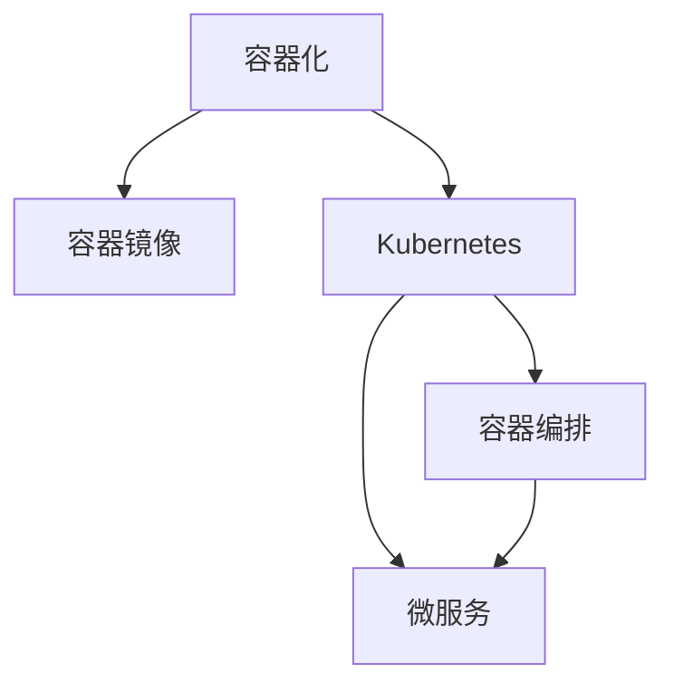

                 

# 容器化和 Kubernetes：管理应用程序部署

> 关键词：容器化, Kubernetes, 应用程序部署, 容器编排, 微服务, 容器镜像, 服务发现

## 1. 背景介绍

### 1.1 问题由来

随着应用程序的规模不断扩大，企业对软件部署、运维和管理的要求也越来越高。传统的基于虚拟机的部署方式面临着诸多挑战：资源利用率低、扩展性差、管理复杂、故障难以快速定位等问题。这些问题不仅增加了企业的运维成本，还降低了系统的稳定性和可靠性。

容器化技术应运而生，通过将应用程序和其依赖打包成独立的容器镜像，可以在任何支持容器技术的平台上快速、一致地部署和运行。同时，容器编排工具 Kubernetes 的出现，使得容器化应用程序的管理和调度变得简单高效。

### 1.2 问题核心关键点

容器化和 Kubernetes 的核心价值在于其提供了一种高效、弹性、自动化的应用程序部署和管理机制。通过容器化，企业可以将应用程序的依赖和配置打包成可移植的镜像，简化部署过程。通过 Kubernetes，企业可以实现应用的自动化部署、扩展、负载均衡、故障恢复等，从而显著提高运维效率和系统可靠性。

### 1.3 问题研究意义

容器化和 Kubernetes 为应用程序的自动化管理和扩展提供了新的解决方案，能够大大降低运维成本，提高系统稳定性，助力企业快速响应市场变化，提升竞争力。同时，容器化技术的应用还有助于实现微服务架构，提升系统的可维护性和可扩展性。

## 2. 核心概念与联系

### 2.1 核心概念概述

为更好地理解容器化和 Kubernetes 的部署机制，本节将介绍几个密切相关的核心概念：

- 容器化（Containerization）：指将应用程序及其依赖打包成独立运行单元的技术，每个容器拥有自己的隔离运行环境，包括内存、CPU、磁盘等资源。
- 容器镜像（Container Image）：容器化的部署方式，包含了应用程序及其依赖的完整配置，可以方便地进行复制、分发和部署。
- Kubernetes：基于容器技术的开源容器编排工具，提供了自动化管理、扩展、调度等功能，是现代微服务架构的重要组成部分。
- 微服务架构（Microservices Architecture）：一种分布式系统架构，将系统拆分为多个独立的微服务，每个服务负责特定的业务功能，通过 API 相互调用，提高了系统的可维护性和可扩展性。
- 容器编排（Container Orchestration）：指通过容器编排工具管理容器的生命周期、资源分配和调度，确保系统的高可用性和弹性。

这些核心概念之间的逻辑关系可以通过以下 Mermaid 流程图来展示：



这个流程图展示了一些关键概念之间的关系：

1. 容器化将应用程序打包成独立的容器镜像。
2. Kubernetes 管理容器镜像的部署和调度。
3. 容器编排提供了自动化的容器生命周期管理。
4. 微服务架构通过容器化实现系统的模块化和可扩展性。

## 3. 核心算法原理 & 具体操作步骤

### 3.1 算法原理概述

容器化和 Kubernetes 的核心算法原理，主要是围绕容器镜像的部署、调度和管理展开。通过容器化，应用程序及其依赖被打包成独立的容器镜像，然后在 Kubernetes 集群中自动部署和调度。Kubernetes 通过容器编排技术，实现了容器的自动化管理、负载均衡、扩展、故障恢复等。

容器化和 Kubernetes 的工作流程大致可以分为以下几个步骤：

1. 打包容器镜像：将应用程序及其依赖打包成容器镜像。
2. 部署容器镜像：将容器镜像部署到 Kubernetes 集群中。
3. 容器编排：通过 Kubernetes 实现容器的自动化管理、扩展、负载均衡和故障恢复。
4. 服务发现：通过服务发现机制，使得容器之间的通信更加便捷。

### 3.2 算法步骤详解

#### 3.2.1 容器镜像打包

容器镜像的打包过程通常使用 Docker。Docker 提供了丰富的工具和命令，可以方便地构建、打包和管理容器镜像。以下是一个简单的 Dockerfile 示例，演示了如何将一个 Node.js 应用程序打包成容器镜像：

```Dockerfile
# 使用 Node.js 运行环境
FROM node:14

# 设置工作目录
WORKDIR /app

# 安装 Node.js 依赖
COPY package.json package-lock.json ./
RUN npm install

# 拷贝应用代码
COPY . .

# 暴露端口
EXPOSE 8080

# 启动应用程序
CMD ["npm", "start"]
```

通过运行 `docker build -t my-app`，即可构建出包含 Node.js 应用程序的容器镜像。

#### 3.2.2 容器镜像部署

容器镜像的部署过程通常通过 Kubernetes 的 `kubectl` 命令来完成。以下是一个简单的 `kubectl` 命令示例，演示了如何创建一个名为 `my-app` 的 Deployment 并指定镜像：

```bash
kubectl create deployment my-app --image=my-app:latest
```

该命令会创建一个名为 `my-app` 的 Deployment，指定使用 `my-app:latest` 镜像进行部署。

#### 3.2.3 容器编排

Kubernetes 提供了丰富的编排工具和机制，用于自动化管理容器的生命周期、资源分配和调度。以下是一些常用的 Kubernetes 资源和对象：

- Pod：Kubernetes 的基本部署单位，一个 Pod 包含了多个容器镜像，通常用于部署一个应用程序。
- Service：用于在集群中发现容器，提供了负载均衡和服务的稳定性。
- Deployment：用于自动扩展和管理 Pod，确保系统的可用性和可靠性。
- Ingress：用于管理外部流量进入集群，提供负载均衡和安全性。
- StatefulSet：用于管理具有唯一 ID 的 Pod，如数据库等。

#### 3.2.4 服务发现

Kubernetes 通过 Service 和 Ingress 机制实现了容器之间的服务发现和通信。Service 是一个抽象的负载均衡器，可以将多个 Pod 暴露为一个统一的地址，从而方便其他容器访问。Ingress 则提供了更高级的流量管理功能，支持 HTTP、TLS 等协议，可以配置 SSL、负载均衡、缓存等功能。

## 4. 数学模型和公式 & 详细讲解 & 举例说明

### 4.1 数学模型构建

在 Kubernetes 中，容器编排的数学模型主要是围绕资源分配和调度展开的。以下是一些关键的数学模型和公式：

- 资源分配模型：描述集群中的资源分配情况，如 CPU、内存等。通常使用线性规划模型来求解最优分配方案。
- 调度算法：描述如何分配容器到节点上，如 Best Fit、Least Cost Fit 等。调度算法的选择会影响系统的性能和稳定性。
- 负载均衡算法：描述如何将请求负载均衡分配到不同的 Pod 上，如轮询、随机、IP Hash 等。负载均衡算法的选择会影响系统的可用性和扩展性。

### 4.2 公式推导过程

以一个简单的资源分配模型为例，假设集群中有 $n$ 个 Pod，每个 Pod 需要 $a_i$ 个 CPU 和 $b_i$ 个内存。假设集群中有 $m$ 个 CPU 和 $p$ 个内存。我们的目标是最小化成本，即最大化资源利用率。

根据上述条件，可以建立如下线性规划模型：

$$
\begin{aligned}
& \text{minimize} & c_1 \sum_{i=1}^{n} a_i x_i + c_2 \sum_{i=1}^{n} b_i x_i \\
& \text{subject to} & \sum_{i=1}^{n} x_i &\leq m \\
& & \sum_{i=1}^{n} a_i x_i &\leq p \\
& & x_i &\geq 0, & \forall i \in \{1, 2, ..., n\}
\end{aligned}
$$

其中，$c_1$ 和 $c_2$ 分别是 CPU 和内存的单位成本。

求解上述线性规划模型，可以得到最优的资源分配方案。具体求解过程可以使用各种优化算法，如单纯形法、内点法等。

### 4.3 案例分析与讲解

假设某公司有 10 个 Node，每个 Node 有 8 个 CPU 和 16GB 内存。需要部署 5 个 Pod，每个 Pod 需要 2 个 CPU 和 4GB 内存。如何分配资源以最大化资源利用率？

根据上述条件，可以建立如下线性规划模型：

$$
\begin{aligned}
& \text{minimize} & 2 \sum_{i=1}^{5} a_i x_i + 4 \sum_{i=1}^{5} b_i x_i \\
& \text{subject to} & \sum_{i=1}^{5} x_i &\leq 10 \\
& & \sum_{i=1}^{5} a_i x_i &\leq 80 \\
& & \sum_{i=1}^{5} b_i x_i &\leq 80 \\
& & x_i &\geq 0, & \forall i \in \{1, 2, ..., 5\}
\end{aligned}
$$

求解上述线性规划模型，可以得到最优的资源分配方案：

$$
x_1 = x_2 = x_3 = x_4 = x_5 = 2
$$

这意味着可以将 5 个 Pod 均匀分配到 10 个 Node 上，每个 Node 部署 2 个 Pod，每个 Pod 使用 2 个 CPU 和 4GB 内存。这种分配方式可以最大化资源利用率，同时保证系统的稳定性和扩展性。

## 5. 项目实践：代码实例和详细解释说明

### 5.1 开发环境搭建

要进行容器化和 Kubernetes 的实践，首先需要搭建开发环境。以下是一些常用工具和命令的介绍：

- Docker：用于构建、打包和部署容器镜像。
- Kubernetes：用于管理容器镜像的部署和调度。
- Minikube：用于在本地搭建 Kubernetes 集群。
- Helm：用于管理 Kubernetes 应用程序的部署和扩展。
- kubectl：用于管理 Kubernetes 资源的命令行工具。

以下是在本地搭建 Kubernetes 集群的步骤：

1. 安装 Minikube：
   ```bash
   curl -Lo ./minikube https://storage.googleapis.com/minikube/releases/latest/minikube
   chmod +x ./minikube
   sudo mv ./minikube /usr/local/bin/minikube
   ```

2. 启动 Minikube 集群：
   ```bash
   minikube start
   ```

3. 验证 Minikube 集群：
   ```bash
   kubectl get nodes
   ```

4. 配置 kubectl：
   ```bash
   kubectl config use-context minikube
   kubectl config set-cluster-name kubernetes
   kubectl config set-cluster-url http://127.0.0.1:8080
   ```

### 5.2 源代码详细实现

以下是一个简单的 Node.js 应用程序的 Kubernetes 部署示例。首先，需要创建一个名为 `my-app` 的 Deployment，并指定镜像：

```yaml
apiVersion: apps/v1
kind: Deployment
metadata:
  name: my-app
spec:
  replicas: 3
  selector:
    matchLabels:
      app: my-app
  template:
    metadata:
      labels:
        app: my-app
    spec:
      containers:
      - name: my-app
        image: my-app:latest
        ports:
        - containerPort: 8080
```

然后，通过 `kubectl apply -f my-app.yaml` 命令创建 Deployment。接下来，可以创建 Service 来为该 Deployment 提供服务发现：

```yaml
apiVersion: v1
kind: Service
metadata:
  name: my-app-service
spec:
  selector:
    app: my-app
  ports:
  - protocol: TCP
    port: 80
    targetPort: 8080
  type: LoadBalancer
```

通过 `kubectl apply -f my-app-service.yaml` 命令创建 Service。最后，可以通过 `kubectl get services` 命令查看 Service 的创建情况：

```bash
kubectl get services
```

### 5.3 代码解读与分析

在上述示例中，我们首先定义了一个名为 `my-app` 的 Deployment，指定了要部署的镜像 `my-app:latest`。然后，通过指定 `replicas` 字段来定义 Pod 的副本数量。接下来，通过 `selector` 和 `template` 字段定义了 Pod 的标签和容器镜像。最后，通过 `spec.containers` 字段定义了容器的端口。

在 Service 的定义中，我们指定了 `selector` 和 `ports` 字段，用于选择 Pod 和定义服务的端口。其中，`type` 字段定义了 Service 的类型，可以是 `ClusterIP`、`LoadBalancer` 等。

## 6. 实际应用场景

### 6.1 微服务架构

容器化和 Kubernetes 在微服务架构中的应用最为典型。通过将应用程序拆分为多个独立的微服务，每个微服务负责特定的业务功能，可以实现系统的模块化和可扩展性。以下是一个微服务架构的示例：


该架构中，各个微服务通过 API 相互调用，组成了一个完整的系统。通过 Kubernetes 管理各个微服务的部署、扩展和故障恢复，可以实现系统的自动化管理。

### 6.2 云原生应用

云原生应用是容器化和 Kubernetes 的重要应用场景。云原生应用通过将应用程序容器化，并部署在云平台上，可以实现自动化的资源管理、扩展和调度。云原生应用还具有高可用性、弹性、可扩展性等特点。以下是一个云原生应用的示例：


该应用将应用程序容器化，并部署在云平台上，通过 Kubernetes 管理容器的生命周期和资源分配，实现系统的自动化管理。

### 6.3 数据中心

容器化和 Kubernetes 在数据中心中的应用也非常广泛。数据中心通过将应用程序容器化，并部署在虚拟化环境中，可以实现快速部署、高可用性和弹性。以下是一个数据中心的示例：


该数据中心将应用程序容器化，并部署在虚拟化环境中，通过 Kubernetes 管理容器的生命周期和资源分配，实现系统的自动化管理。

## 7. 工具和资源推荐

### 7.1 学习资源推荐

为了帮助开发者系统掌握容器化和 Kubernetes 的原理和实践，以下是一些优质的学习资源：

- Docker 官方文档：提供了 Docker 的详细使用指南和最佳实践。
- Kubernetes 官方文档：提供了 Kubernetes 的详细使用指南和最佳实践。
- Kubernetes in Action 书籍：提供了 Kubernetes 的实践指南，适合初学者入门。
- Docker Mastery 书籍：提供了 Docker 的实践指南，适合深入理解 Docker。
- Minikube 官方文档：提供了 Minikube 的详细使用指南和最佳实践。

通过对这些资源的学习实践，相信你一定能够快速掌握容器化和 Kubernetes 的精髓，并用于解决实际的系统问题。

### 7.2 开发工具推荐

以下是一些常用的工具和命令，用于容器化和 Kubernetes 的开发和部署：

- Docker：用于构建、打包和部署容器镜像。
- Kubernetes：用于管理容器镜像的部署和调度。
- Helm：用于管理 Kubernetes 应用程序的部署和扩展。
- kubectl：用于管理 Kubernetes 资源的命令行工具。
- Minikube：用于在本地搭建 Kubernetes 集群。

### 7.3 相关论文推荐

容器化和 Kubernetes 的发展源于学界的持续研究。以下是几篇奠基性的相关论文，推荐阅读：

- Containers and Cluster Orchestration: The Kubernetes Way：介绍了 Kubernetes 的架构和设计理念。
- Docker Swarm and Kubernetes 2017：介绍了 Docker Swarm 和 Kubernetes 的区别和优势。
- An Overview of Kubernetes Scheduling：介绍了 Kubernetes 的调度算法和优化。
- Container Platforms, Orchestration, and Cloud-native Applications: Trends, Challenges, and Roadmap：介绍了容器平台和云原生应用的发展趋势和挑战。

## 8. 总结：未来发展趋势与挑战

### 8.1 研究成果总结

容器化和 Kubernetes 已经广泛应用于各种应用场景，推动了 DevOps 的自动化和标准化。通过容器化和 Kubernetes，企业可以显著提高系统的稳定性和可扩展性，降低运维成本，快速响应市场变化。

### 8.2 未来发展趋势

未来，容器化和 Kubernetes 将进一步融合云原生技术，实现更高效的资源管理、更灵活的应用部署、更强大的自动化工具。同时，容器化和 Kubernetes 还将进一步融合人工智能和大数据技术，实现更智能的自动化管理、更高效的资源调度和更智能的决策支持。

### 8.3 面临的挑战

虽然容器化和 Kubernetes 已经取得了显著进展，但在迈向更加智能化、普适化应用的过程中，仍然面临诸多挑战：

- 资源管理：如何更高效地管理集群资源，避免资源浪费和过度调度。
- 自动化管理：如何更智能地自动化管理容器的生命周期，提高系统的稳定性和可靠性。
- 扩展性：如何更灵活地扩展应用程序，满足不断增长的业务需求。
- 安全性：如何更安全地管理容器镜像和容器编排，避免安全漏洞和攻击。

### 8.4 研究展望

未来，容器化和 Kubernetes 的研究将更多地关注以下方向：

- 容器编排的新算法和新模型：通过引入更先进的算法和模型，实现更高效、更智能的资源管理和调度。
- 容器编排与人工智能的融合：通过引入 AI 技术，实现更智能的自动化管理、更高效的资源调度和更智能的决策支持。
- 容器编排与大数据的融合：通过引入大数据技术，实现更智能的监控和告警、更高效的资源调度和更智能的决策支持。

## 9. 附录：常见问题与解答

**Q1：容器化和 Kubernetes 是否适用于所有应用程序？**

A: 容器化和 Kubernetes 适用于大多数应用程序，尤其是需要快速部署、高可用性和弹性的应用程序。但对于一些需要特殊处理的低延迟、高吞吐量的应用程序，可能还需要结合其他技术进行优化。

**Q2：如何提高容器的资源利用率？**

A: 可以通过容器编排工具实现资源优化。具体方法包括：
- 水平扩展：增加 Pod 的数量，提高系统的吞吐量。
- 垂直扩展：增加单个 Pod 的资源配置，提高系统的处理能力。
- 自动调度和负载均衡：通过容器编排工具自动调度容器，实现更高效的资源利用。

**Q3：如何在 Kubernetes 中实现自动化的服务发现？**

A: 可以使用 Kubernetes 的 Service 和 Ingress 资源实现自动化的服务发现。Service 提供了负载均衡和服务的稳定性，Ingress 提供了更高级的流量管理功能，支持 SSL、负载均衡、缓存等功能。

**Q4：如何确保容器编排的安全性？**

A: 可以通过以下方法确保容器编排的安全性：
- 使用容器镜像的安全扫描工具，避免使用恶意软件和漏洞。
- 配置容器编排工具的安全策略，避免恶意用户访问和攻击。
- 使用网络安全技术，如网络隔离、访问控制等，保护容器编排的安全性。

通过上述方法，可以确保容器编排的安全性，避免安全漏洞和攻击。

---

作者：禅与计算机程序设计艺术 / Zen and the Art of Computer Programming

