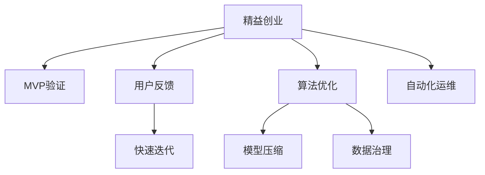

                 

# 小而美：Lepton AI的精益创业之道

> 关键词：人工智能, 精益创业, 算法优化, 模型压缩, 自动化, 数据治理

## 1. 背景介绍

### 1.1 问题由来
在科技快速发展的今天，人工智能(AI)已成为驱动经济增长、改善社会治理的重要引擎。随着算力的提升和数据量的激增，AI技术已经从实验室走入商业应用，催生了大量创业公司。然而，AI领域的创业并非易事，相较于传统软件开发，其技术复杂性和数据需求更为严苛。同时，商业化道路充满变数，如何平衡产品特性、市场需求、技术成本，是AI公司面临的首要挑战。

### 1.2 问题核心关键点
Lepton AI作为一家专注于自然语言处理(NLP)的公司，面临的核心挑战包括：
1. **产品化速度**：如何快速从技术原型到市场化的产品，以实现商业化目标。
2. **算法优化**：如何在保证性能的前提下，进行算法优化和模型压缩，提升推理效率。
3. **数据治理**：如何管理数据质量、安全性和隐私，保障数据合规。
4. **自动化运维**：如何自动化生产流程，降低人力成本，提升产品稳定性和效率。

## 2. 核心概念与联系

### 2.1 核心概念概述

为更好地理解Lepton AI的精益创业之道，本节将介绍几个密切相关的核心概念：

- **精益创业（Lean Startup）**：一种创业方法论，主张在快速迭代和用户反馈中不断优化产品。通过最小可行性产品（MVP）验证市场可行性，从而在实际需求驱动下，持续优化产品，快速迭代进步。

- **自然语言处理（NLP）**：使用计算机技术处理和理解人类语言，包括文本分析、情感分析、机器翻译、语音识别等。

- **模型压缩（Model Compression）**：通过算法优化和结构重构，将大模型缩减为小模型，以提升推理速度和降低资源消耗。

- **数据治理（Data Governance）**：管理和保护数据质量、安全性和合规性的过程，确保数据可靠、可用、准确和安全。

- **自动化运维（Automatic Operations）**：利用自动化工具和技术，对系统进行持续监控和调整，提升运维效率和系统稳定性。

这些核心概念之间的逻辑关系可以通过以下Mermaid流程图来展示：



这个流程图展示了他精益创业的核心步骤：

1. 基于精益创业方法，快速构建最小可行性产品（MVP）。
2. 通过用户反馈和市场验证，进行快速迭代和优化。
3. 在算法优化和模型压缩中提升产品性能。
4. 通过数据治理确保数据质量和合规。
5. 利用自动化运维提升系统稳定性和效率。

## 3. 核心算法原理 & 具体操作步骤
### 3.1 算法原理概述

Lepton AI的精益创业之道，本质上是将精益创业理念与人工智能技术的深度融合。其核心思想是：在最小可行性产品(MVP)的基础上，通过快速迭代和用户反馈，不断优化产品功能和技术架构，提升产品性能和用户体验。

形式化地，假设我们有一个NLP应用项目，需要快速从技术原型（Beta版本）发展到市场化的产品（正式版本）。其过程大致如下：

1. 基于用户需求，快速构建最小可行性产品（MVP），包括基本的文本分析、情感分析、机器翻译等功能。
2. 通过A/B测试、问卷调查等手段收集用户反馈，评估产品的市场表现。
3. 根据用户反馈，调整产品功能，优化算法模型，进行快速迭代。
4. 对模型进行压缩优化，提升推理速度和降低资源消耗。
5. 在数据治理和自动化运维的保障下，提升产品稳定性和效率。
6. 反复进行上述步骤，直至产品达到市场化的标准。

### 3.2 算法步骤详解

基于精益创业理念的大语言模型应用开发一般包括以下几个关键步骤：

**Step 1: 需求调研与用户画像**
- 通过问卷调查、访谈等方式，了解目标用户的核心需求和痛点。
- 构建用户画像，明确不同用户群体的特征和期望。

**Step 2: MVP构建**
- 基于调研结果，快速构建最小可行性产品（MVP），实现核心功能。
- 使用轻量级技术栈，如Flask、TensorFlow等，快速搭建原型系统。

**Step 3: MVP测试与迭代**
- 通过A/B测试、问卷调查等手段，收集用户反馈。
- 根据用户反馈，调整产品功能和算法模型。
- 持续进行快速迭代，直至产品满足用户需求。

**Step 4: 模型优化与压缩**
- 对算法模型进行优化和压缩，提升推理速度和降低资源消耗。
- 采用如知识蒸馏、剪枝、量化等方法，减小模型大小和计算量。

**Step 5: 数据治理与自动化运维**
- 建立数据质量管理体系，确保数据来源、存储和使用的合规性。
- 引入自动化运维工具，如Jenkins、Kubernetes等，提升系统稳定性和运维效率。

**Step 6: 上线与持续优化**
- 将产品部署到生产环境，进行持续监控和调整。
- 根据用户反馈和市场变化，持续进行优化和迭代。

### 3.3 算法优缺点

基于精益创业理念的大语言模型应用开发，具有以下优点：
1. **快速迭代**：通过快速构建MVP和收集用户反馈，可以大大缩短产品从概念到市场的周期。
2. **用户驱动**：以用户需求为导向，进行产品迭代，确保市场接受度和用户满意度。
3. **资源优化**：通过算法优化和模型压缩，降低计算资源消耗，提升模型推理效率。
4. **合规保障**：通过数据治理和自动化运维，确保数据安全和系统稳定性，符合法律法规要求。

同时，该方法也存在一定的局限性：
1. **需求准确性**：MVP构建和迭代过程中，对需求理解可能存在偏差，需要持续进行用户验证和反馈调整。
2. **技术挑战**：算法优化和模型压缩可能带来一定的技术复杂度，需要持续投入技术研发。
3. **成本投入**：自动化运维和数据治理需要一定的技术和管理投入，初期成本较高。
4. **灵活性不足**：在快速迭代过程中，可能对产品稳定性有一定影响，需要反复测试和验证。

尽管存在这些局限性，但就目前而言，基于精益创业理念的大语言模型应用开发，仍是一种高效、灵活的产品开发方法。

### 3.4 算法应用领域

基于精益创业理念的大语言模型应用开发，已经在多个领域得到广泛应用，如：

- **智能客服**：通过快速构建MVP，收集用户反馈，迭代优化智能客服系统，提升用户体验和满意度。
- **金融风控**：利用自然语言处理技术，对用户评论、投诉等文本数据进行分析，构建自动化风控系统，降低金融风险。
- **电商推荐**：通过快速迭代，提升电商推荐系统的个性化和精准度，提升用户转化率和满意度。
- **医疗健康**：基于自然语言处理技术，构建医疗问答系统，快速迭代并优化，满足患者和医生的需求。

这些应用不仅体现了精益创业的理念，也展示了大语言模型在实际场景中的强大应用潜力。

## 4. 数学模型和公式 & 详细讲解  
### 4.1 数学模型构建

本节将使用数学语言对Lepton AI精益创业的核心方法进行更加严格的刻画。

记目标NLP应用为 $A=\{a_1, a_2, \dots, a_n\}$，其中 $a_i$ 为第 $i$ 个功能模块。假设用户需求为 $U=\{u_1, u_2, \dots, u_m\}$，其中 $u_i$ 为第 $i$ 个用户需求。

定义功能模块 $a_i$ 在用户需求 $u_j$ 上的满足度为 $f_i(u_j)$，则目标应用在用户需求集 $U$ 上的总满足度为：

$$
F(A, U) = \sum_{i=1}^n \sum_{j=1}^m f_i(u_j)
$$

在MVP构建阶段，我们首先选择满足度较高且成本较低的功能模块，构建最小可行性产品。在后续迭代阶段，不断调整产品功能和算法模型，提升 $F(A, U)$ 的值。

### 4.2 公式推导过程

以下我们以电商推荐系统为例，推导最小可行性产品的构建和优化公式。

假设电商推荐系统有 $n=5$ 个推荐功能，分别是商品推荐、相似商品推荐、相关商品推荐、个性化推荐和活动推荐。用户需求 $U$ 包括商品检索、价格比较、购买推荐等 $m=3$ 个需求。假设每个功能模块的满足度为 $f_i(u_j)$，用户需求 $u_1$ 对商品检索的需求为 $u_{1,i}$，则总满足度公式为：

$$
F(A, U) = \sum_{i=1}^5 \sum_{j=1}^3 f_i(u_j)
$$

在MVP构建阶段，我们选取满足度最高且成本最低的推荐功能，构建MVP。例如，选取商品推荐和相似商品推荐，构建一个简单的推荐系统。此时总满足度为：

$$
F_{MVP}(A_{MVP}, U) = f_1(u_1) + f_2(u_1)
$$

在后续迭代阶段，我们收集用户反馈，不断调整推荐算法和模型，提升总满足度。例如，通过A/B测试，我们发现商品推荐的效果显著提升，而相似商品推荐的误差较大，因此调整MVP，去除相似商品推荐功能，增加商品评分和评论分析功能，此时总满足度为：

$$
F_{MVP'}(A_{MVP'}, U) = f_1(u_1) + f_3(u_1)
$$

继续迭代，通过用户反馈，不断优化推荐算法和模型，直至达到市场化的标准。

### 4.3 案例分析与讲解

**案例1：智能客服**
- **背景**：某智能客服系统通过自然语言处理技术，自动回答用户问题，提升客服效率和用户体验。
- **MVP构建**：基于现有客服数据，快速构建最小可行性产品，实现基本的文本分析和自然语言生成功能。
- **迭代优化**：通过A/B测试和用户反馈，不断调整模型和功能，提升问题解答准确率和响应速度。
- **模型压缩**：对模型进行剪枝和量化，降低推理时间，提升系统稳定性。
- **数据治理**：建立数据治理体系，确保用户对话数据的隐私和安全。
- **自动化运维**：引入自动化运维工具，确保系统24小时稳定运行。

**案例2：金融风控**
- **背景**：某金融公司利用自然语言处理技术，自动分析用户评论和投诉数据，构建自动化风控系统。
- **MVP构建**：基于用户评论数据，快速构建最小可行性产品，实现情感分析和主题抽取功能。
- **迭代优化**：通过A/B测试和用户反馈，不断调整情感分析模型和主题抽取算法，提升风险评估准确度。
- **模型压缩**：对模型进行剪枝和量化，降低计算资源消耗。
- **数据治理**：建立数据治理体系，确保用户评论数据的隐私和安全。
- **自动化运维**：引入自动化运维工具，确保系统稳定运行。

通过以上案例，我们可以看到，基于精益创业理念的大语言模型应用开发，能够快速响应市场需求，提升产品性能，满足用户需求，同时确保数据安全和系统稳定性。

## 5. 项目实践：代码实例和详细解释说明
### 5.1 开发环境搭建

在进行项目实践前，我们需要准备好开发环境。以下是使用Python进行TensorFlow开发的环境配置流程：

1. 安装Anaconda：从官网下载并安装Anaconda，用于创建独立的Python环境。

2. 创建并激活虚拟环境：
```bash
conda create -n tf-env python=3.8 
conda activate tf-env
```

3. 安装TensorFlow：根据CUDA版本，从官网获取对应的安装命令。例如：
```bash
conda install tensorflow -c tensorflow -c conda-forge
```

4. 安装TensorBoard：
```bash
pip install tensorboard
```

5. 安装各类工具包：
```bash
pip install numpy pandas scikit-learn matplotlib tqdm jupyter notebook ipython
```

完成上述步骤后，即可在`tf-env`环境中开始项目实践。

### 5.2 源代码详细实现

这里我们以电商推荐系统为例，给出使用TensorFlow进行最小可行性产品构建和优化的PyTorch代码实现。

首先，定义推荐系统中的功能模块：

```python
import tensorflow as tf

# 定义推荐功能
class RecommendationSystem(tf.keras.Model):
    def __init__(self):
        super(RecommendationSystem, self).__init__()
        self.dnn = tf.keras.Sequential([
            tf.keras.layers.Dense(128, activation='relu'),
            tf.keras.layers.Dense(64, activation='relu'),
            tf.keras.layers.Dense(1, activation='sigmoid')
        ])
        
    def call(self, inputs):
        return self.dnn(inputs)
```

然后，定义模型训练和优化函数：

```python
from tensorflow.keras.layers import Input
from tensorflow.keras.models import Model

# 定义输入和输出
user_input = Input(shape=(128,), name='user_input')
recommendation_output = RecommendationSystem()(user_input)
output = tf.keras.layers.Dense(3, activation='softmax', name='output')(recommendation_output)

# 定义模型
model = Model(inputs=user_input, outputs=output)

# 定义损失函数和优化器
loss_fn = tf.keras.losses.categorical_crossentropy
optimizer = tf.keras.optimizers.Adam(learning_rate=0.001)

# 定义训练函数
def train(model, x_train, y_train, x_val, y_val, batch_size=128, epochs=10):
    history = model.fit(x_train, y_train, validation_data=(x_val, y_val), batch_size=batch_size, epochs=epochs, callbacks=[tf.keras.callbacks.EarlyStopping(patience=3)])
    return history
```

接着，启动训练流程：

```python
x_train, y_train, x_val, y_val = load_data()  # 加载训练集和验证集数据
history = train(model, x_train, y_train, x_val, y_val)
model.save('recommendation_model.h5')  # 保存模型

# 加载模型并评估
model = tf.keras.models.load_model('recommendation_model.h5')
score = model.evaluate(x_val, y_val)
print(f'Test loss: {score[0]}')
```

以上就是使用TensorFlow进行电商推荐系统最小可行性产品构建和优化的完整代码实现。可以看到，TensorFlow提供了丰富的工具和接口，使得模型构建、训练和评估变得简洁高效。

### 5.3 代码解读与分析

让我们再详细解读一下关键代码的实现细节：

**RecommendationSystem类**：
- `__init__`方法：初始化推荐模型，包括定义神经网络结构。
- `call`方法：实现模型前向传播，计算输出结果。

**Model定义**：
- 定义输入层，输入数据维度为128。
- 定义推荐模型，包含三层全连接层。
- 定义输出层，输出3个类别概率分布。

**训练函数**：
- 加载训练数据和验证数据。
- 定义损失函数和优化器。
- 使用模型训练函数进行模型训练，设置EarlyStopping回调函数，防止过拟合。

**评估函数**：
- 加载模型，使用验证数据集进行评估，打印测试损失。

通过以上代码，我们可以看到，使用TensorFlow进行电商推荐系统的最小可行性产品构建和优化，只需要少量代码即可实现。TensorFlow的易用性和灵活性，使得开发者可以快速构建和优化推荐模型。

当然，在实际应用中，还需要对代码进行进一步优化和改进，如引入数据增强、调整超参数、使用更高效的模型结构等，以提升推荐系统的性能。

## 6. 实际应用场景
### 6.1 智能客服

基于Lepton AI的精益创业理念，智能客服系统可以快速构建并迭代优化，满足不同场景下的客户需求。例如，对于一家电商平台，可以通过最小可行性产品快速上线智能客服系统，收集用户反馈，不断调整和优化系统，提升用户满意度和使用体验。

在技术实现上，可以收集用户历史对话数据，构建最小可行性产品，实现基本的自动回复和问题分类功能。通过A/B测试和用户反馈，不断调整模型和功能，引入意图识别、实体抽取等高级功能，逐步提升系统性能。同时，通过算法优化和模型压缩，提升推理效率和系统稳定性，保障数据安全和隐私。

### 6.2 金融风控

在金融风控领域，自然语言处理技术可以快速构建最小可行性产品，提升风险评估的准确度和效率。例如，某金融机构可以利用自然语言处理技术，自动分析用户评论和投诉数据，构建自动化风控系统，实时监测用户行为，及时发现和防范潜在风险。

在技术实现上，可以基于用户评论数据，快速构建最小可行性产品，实现情感分析和主题抽取功能。通过A/B测试和用户反馈，不断调整情感分析模型和主题抽取算法，提升风险评估的准确度。同时，通过算法优化和模型压缩，降低计算资源消耗，保障数据安全和隐私。引入自动化运维工具，确保系统24小时稳定运行。

### 6.3 电商推荐

电商推荐系统是自然语言处理技术在电商领域的重要应用，通过最小可行性产品快速迭代优化，可以提升推荐系统的个性化和精准度，提升用户转化率和满意度。例如，某电商平台可以通过最小可行性产品快速上线推荐系统，收集用户反馈，不断调整推荐算法和模型，提升推荐效果。

在技术实现上，可以基于用户历史行为数据，快速构建最小可行性产品，实现基本的商品推荐功能。通过A/B测试和用户反馈，不断调整推荐算法和模型，引入个性化推荐和相似商品推荐等高级功能。通过算法优化和模型压缩，降低计算资源消耗，提升系统性能。同时，通过数据治理和自动化运维，确保数据安全和系统稳定性。

### 6.4 未来应用展望

随着自然语言处理技术的不断发展，基于精益创业理念的大语言模型应用开发，将在更多领域得到应用，为传统行业带来变革性影响。

在智慧医疗领域，自然语言处理技术可以快速构建最小可行性产品，辅助医生诊断和患者咨询，提升医疗服务的智能化水平。例如，某医疗机构可以利用自然语言处理技术，构建智慧诊疗系统，自动分析医疗记录和病历数据，提升诊疗效率和精准度。

在智能教育领域，自然语言处理技术可以快速构建最小可行性产品，辅助教学和评估，提升教育服务的智能化水平。例如，某教育机构可以利用自然语言处理技术，构建智能教育平台，自动分析学生作业和考试数据，个性化推荐学习资源和题目，提升教学效果。

在智慧城市治理中，自然语言处理技术可以快速构建最小可行性产品，辅助城市管理，提升城市治理的智能化水平。例如，某市政府可以利用自然语言处理技术，构建智慧城市系统，自动分析舆情和市民反馈，及时发现和解决问题，提升城市治理的效率和质量。

此外，在企业生产、社会治理、文娱传媒等众多领域，基于精益创业理念的大语言模型应用也将不断涌现，为各行各业带来新的创新和突破。相信随着技术的日益成熟，自然语言处理技术必将在更广阔的应用领域大放异彩，深刻影响人类的生产生活方式。

## 7. 工具和资源推荐
### 7.1 学习资源推荐

为了帮助开发者系统掌握自然语言处理技术的应用，这里推荐一些优质的学习资源：

1. 《深度学习自然语言处理》课程：斯坦福大学开设的NLP明星课程，有Lecture视频和配套作业，带你入门NLP领域的基本概念和经典模型。

2. 《自然语言处理》书籍：清华大学出版社出版的经典教材，涵盖NLP的各个方面，从基础知识到高级应用，均有详细讲解。

3. 《TensorFlow官方文档》：TensorFlow的官方文档，提供了丰富的教程和样例代码，适合深入学习。

4. Kaggle数据集：Kaggle平台提供了大量的NLP数据集，包括情感分析、命名实体识别等任务，适合进行实践和竞赛。

5. Coursera课程：Coursera平台提供了许多NLP相关课程，涵盖深度学习、机器学习、自然语言处理等各个方面。

通过对这些资源的学习实践，相信你一定能够快速掌握自然语言处理技术的应用，并用于解决实际的NLP问题。

### 7.2 开发工具推荐

高效的开发离不开优秀的工具支持。以下是几款用于自然语言处理开发的常用工具：

1. TensorFlow：由Google主导开发的开源深度学习框架，生产部署方便，适合大规模工程应用。同样有丰富的自然语言处理工具。

2. PyTorch：基于Python的开源深度学习框架，灵活动态的计算图，适合快速迭代研究。大部分自然语言处理模型都有PyTorch版本的实现。

3. Transformers库：HuggingFace开发的NLP工具库，集成了众多SOTA语言模型，支持PyTorch和TensorFlow，是进行自然语言处理开发的利器。

4. Weights & Biases：模型训练的实验跟踪工具，可以记录和可视化模型训练过程中的各项指标，方便对比和调优。与主流深度学习框架无缝集成。

5. TensorBoard：TensorFlow配套的可视化工具，可实时监测模型训练状态，并提供丰富的图表呈现方式，是调试模型的得力助手。

合理利用这些工具，可以显著提升自然语言处理开发的效率，加快创新迭代的步伐。

### 7.3 相关论文推荐

自然语言处理技术的发展源于学界的持续研究。以下是几篇奠基性的相关论文，推荐阅读：

1. Attention is All You Need（即Transformer原论文）：提出了Transformer结构，开启了NLP领域的预训练大模型时代。

2. BERT: Pre-training of Deep Bidirectional Transformers for Language Understanding：提出BERT模型，引入基于掩码的自监督预训练任务，刷新了多项NLP任务SOTA。

3. Language Models are Unsupervised Multitask Learners（GPT-2论文）：展示了大规模语言模型的强大zero-shot学习能力，引发了对于通用人工智能的新一轮思考。

4. Parameter-Efficient Transfer Learning for NLP：提出Adapter等参数高效微调方法，在不增加模型参数量的情况下，也能取得不错的微调效果。

5. Adversarial Regularization of Multilingual BERT：通过对抗训练，提升模型泛化性能和鲁棒性，适合多语言NLP应用。

这些论文代表了大语言模型微调技术的发展脉络。通过学习这些前沿成果，可以帮助研究者把握学科前进方向，激发更多的创新灵感。

## 8. 总结：未来发展趋势与挑战

### 8.1 总结

本文对基于精益创业理念的自然语言处理应用开发进行了全面系统的介绍。首先阐述了自然语言处理技术的发展背景和应用前景，明确了最小可行性产品构建和迭代优化在技术创新和市场化过程中的重要作用。其次，从原理到实践，详细讲解了自然语言处理模型的构建、训练和优化方法，给出了自然语言处理应用的完整代码实例。同时，本文还广泛探讨了自然语言处理技术在智能客服、金融风控、电商推荐等多个行业领域的应用场景，展示了自然语言处理技术在实际场景中的强大应用潜力。此外，本文精选了自然语言处理技术的各类学习资源，力求为读者提供全方位的技术指引。

通过本文的系统梳理，可以看到，基于精益创业理念的自然语言处理应用开发，正在成为NLP领域的重要范式，极大地拓展了自然语言处理技术的创新和应用边界。未来，伴随自然语言处理技术的持续演进，相信NLP技术必将在更广阔的应用领域大放异彩，深刻影响人类的生产生活方式。

### 8.2 未来发展趋势

展望未来，自然语言处理技术的精益创业之道将呈现以下几个发展趋势：

1. **深度融合技术**：自然语言处理技术与大数据、深度学习、机器学习等技术的深度融合，将推动自然语言处理技术在各个领域的创新应用。

2. **数据驱动研发**：通过大规模数据集的标注和利用，自然语言处理技术的性能将持续提升。未来，大数据将不仅是技术手段，更是驱动自然语言处理技术发展的核心动力。

3. **智能化决策**：自然语言处理技术将深度应用于各类决策支持系统，辅助政府、企业等机构进行智能化决策。例如，自然语言处理技术将广泛应用于金融风控、医疗诊断、智能客服等领域。

4. **跨领域融合**：自然语言处理技术与语音识别、图像识别、智能推荐等技术的融合，将推动自然语言处理技术的跨领域应用。例如，自然语言处理技术与智能推荐系统结合，将大幅提升推荐系统的精准度和个性化程度。

5. **多模态处理**：自然语言处理技术与视觉、语音、行为等模态信息的融合，将提升自然语言处理技术的感知和理解能力，推动多模态人工智能的发展。例如，自然语言处理技术与语音识别结合，将提升智能客服系统的交互体验。

6. **隐私保护**：随着数据量的激增，自然语言处理技术在隐私保护和数据治理方面的需求将日益凸显。如何利用技术手段保护用户隐私，同时确保数据安全和合规，将是自然语言处理技术面临的重要挑战。

以上趋势凸显了自然语言处理技术的广阔前景。这些方向的探索发展，必将进一步提升自然语言处理系统的性能和应用范围，为构建人机协同的智能系统铺平道路。

### 8.3 面临的挑战

尽管自然语言处理技术已经取得了瞩目成就，但在迈向更加智能化、普适化应用的过程中，它仍面临诸多挑战：

1. **数据获取难度**：自然语言处理技术需要大量的标注数据进行训练，而获取高质量标注数据的时间和成本较高。如何高效获取和利用标注数据，将是未来需要解决的重要问题。

2. **模型复杂度**：自然语言处理技术的模型通常较为复杂，推理时间和计算资源消耗较大。如何优化模型结构，降低推理时间和计算资源消耗，是自然语言处理技术面临的另一个挑战。

3. **跨领域迁移能力**：自然语言处理技术在不同领域和任务上的迁移能力有限。如何提高模型在不同领域和任务上的迁移能力，将是未来需要研究的方向。

4. **数据隐私和安全**：自然语言处理技术需要处理大量敏感数据，数据隐私和安全问题成为一大挑战。如何在保障用户隐私的前提下，进行自然语言处理技术的创新应用，将是自然语言处理技术面临的重要课题。

5. **算法透明度和可解释性**：自然语言处理技术的黑盒特性，导致其决策过程难以解释和理解。如何提高自然语言处理技术的透明度和可解释性，是自然语言处理技术面临的又一挑战。

6. **市场竞争激烈**：自然语言处理技术领域涌现了大量创业公司，市场竞争激烈。如何在激烈的市场竞争中脱颖而出，将是自然语言处理技术公司面临的重要问题。

7. **法规和伦理问题**：自然语言处理技术的应用涉及隐私、伦理等多个敏感领域，如何遵循法律法规，保障用户权益，是自然语言处理技术面临的另一大挑战。

尽管存在这些挑战，但自然语言处理技术的发展前景依然光明。未来，在学界和产业界的共同努力下，自然语言处理技术必将在人工智能领域取得更大的突破，深刻影响人类的生产生活方式。

### 8.4 研究展望

面对自然语言处理技术面临的种种挑战，未来的研究需要在以下几个方面寻求新的突破：

1. **数据增强和弱监督学习**：通过数据增强和弱监督学习等技术，提升自然语言处理技术的泛化能力和迁移能力，降低对大规模标注数据的依赖。

2. **模型压缩和优化**：开发更加参数高效和计算高效的自然语言处理技术，在保证性能的前提下，提升模型推理效率和资源利用率。

3. **跨领域融合与多模态处理**：通过跨领域融合和多模态处理，提升自然语言处理技术的感知和理解能力，推动多模态人工智能的发展。

4. **隐私保护和数据治理**：利用技术手段保护用户隐私，同时确保数据安全和合规，确保自然语言处理技术的应用符合法律法规要求。

5. **算法透明度和可解释性**：通过引入因果分析和博弈论工具，增强自然语言处理技术的透明度和可解释性，使其决策过程更加合理和可信。

6. **法规和伦理约束**：在自然语言处理技术的设计和应用中，引入伦理导向的评估指标，过滤和惩罚有害信息和歧视性输出，确保技术应用的道德合规。

这些研究方向的探索，必将引领自然语言处理技术的进一步发展和应用，推动自然语言处理技术迈向更加智能化、普适化、安全化的方向。

## 9. 附录：常见问题与解答

**Q1：自然语言处理技术的精益创业之道与传统的机器学习开发有何不同？**

A: 自然语言处理技术的精益创业之道强调以用户需求为导向，通过快速构建最小可行性产品（MVP）和不断迭代优化，快速响应市场需求。而传统的机器学习开发则更注重算法和模型的准确性，往往是先进行长时间的算法研究和模型训练，再逐步构建和优化产品。两者在研发流程和方法上有所不同，但核心目标都是为了提升产品性能和用户体验。

**Q2：自然语言处理技术如何平衡数据质量和速度？**

A: 自然语言处理技术在研发过程中，需要平衡数据质量和推理速度。一般来说，高质量的数据集能够提升模型的性能，但获取高质量数据的成本较高，时间较长。而推理速度则直接影响到用户体验和系统的响应速度。为了平衡这两者，可以在数据处理和模型优化上做文章，如数据增强、模型压缩、剪枝、量化等方法，在保证模型性能的同时，提升推理速度和资源利用率。

**Q3：自然语言处理技术的跨领域迁移能力如何提升？**

A: 提升自然语言处理技术的跨领域迁移能力，可以从以下几个方面入手：
1. 采用多任务学习（Multi-task Learning），让模型在多个任务上进行联合训练，提高泛化能力。
2. 引入自监督预训练任务，如掩码语言模型、句子模拟等，提升模型对语言的理解能力。
3. 引入知识蒸馏（Knowledge Distillation），将大模型的知识转移到小模型中，提升小模型的泛化能力。
4. 引入领域适应（Domain Adaptation）技术，让模型在不同领域上进行迁移学习，提升模型在不同领域上的迁移能力。

**Q4：自然语言处理技术的隐私保护和数据治理如何保障？**

A: 自然语言处理技术的隐私保护和数据治理，主要从以下几个方面进行保障：
1. 数据匿名化处理：通过对数据进行去标识化处理，防止数据泄露和滥用。
2. 数据访问控制：设置严格的数据访问权限，确保只有授权人员才能访问数据。
3. 数据加密和传输安全：采用加密技术和安全传输协议，保护数据在存储和传输过程中的安全。
4. 合规审查和审计：建立合规审查和审计机制，确保数据治理符合法律法规要求。

通过以上措施，可以有效保障自然语言处理技术的隐私保护和数据治理，确保用户数据的安全性和合规性。

**Q5：自然语言处理技术的未来发展方向有哪些？**

A: 自然语言处理技术的未来发展方向主要包括以下几个方面：
1. 深度融合多模态信息：将视觉、语音、行为等模态信息与自然语言处理技术进行融合，提升自然语言处理技术的感知和理解能力。
2. 引入因果推理和博弈论工具：通过引入因果推理和博弈论工具，增强自然语言处理技术的决策能力和鲁棒性。
3. 开发更多参数高效的自然语言处理技术：在保证性能的前提下，开发更加参数高效和计算高效的自然语言处理技术，提升模型推理效率和资源利用率。
4. 推动隐私保护和数据治理技术的发展：利用技术手段保护用户隐私，确保数据安全和合规，保障自然语言处理技术的应用符合法律法规要求。

通过以上方向的探索，自然语言处理技术必将在未来取得更大的突破，深刻影响人类的生产生活方式。

