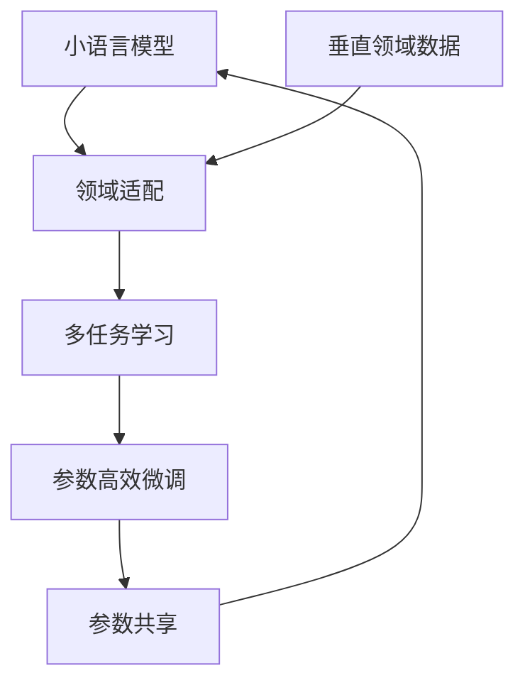

                 

# 小语言模型的应用前景:垂直领域的机遇

> 关键词：小语言模型, 垂直领域, 领域适配, 多任务学习, 参数高效微调, 参数共享, 资源限制

## 1. 背景介绍

在过去的几年里，深度学习和大规模预训练语言模型（Large Language Models, LLMs）在自然语言处理（NLP）领域取得了显著的进展。这些模型，如GPT-3、BERT等，通过在大量无标签文本数据上进行预训练，学习到丰富的语言知识和表示能力。它们在各种通用NLP任务上展现出了强大的泛化能力，推动了NLP技术的快速发展。

然而，面对垂直领域的专业任务，例如法律、医疗、金融等，这些通用大模型的表现却往往不尽如人意。由于这些领域具有高度的专业性和领域特异性，通用大模型可能无法直接适用于这些任务，或者需要进行大量额外的微调（Fine-Tuning）才能达到理想的性能。

小语言模型（Small Language Models, SLMs）作为一类新型的深度学习模型，近年来逐渐引起研究者和工程师的关注。与大模型相比，小语言模型具有参数量小、计算效率高、灵活适应性强等优点，特别是在资源有限、任务多样化的垂直领域中展现出巨大的应用潜力。

本文将深入探讨小语言模型在垂直领域的应用前景，分析其核心原理和操作步骤，提供数学模型和算法推导，并通过项目实践和实际应用场景展示其优势和挑战。

## 2. 核心概念与联系

### 2.1 核心概念概述

为了更好地理解小语言模型在垂直领域的应用，首先需要梳理一些核心概念：

- **小语言模型（SLMs）**：与通用大模型不同，SLMs具有较小的参数量，通常在几十到几百万之间，适用于资源受限的垂直领域。
- **垂直领域**：指具有高度专业性和领域特异性的任务领域，如法律、医疗、金融等，这些领域需要模型具备专业知识。
- **领域适配（Domain Adaptation）**：通过在特定领域的数据上进行微调，使通用模型适应该领域的特性。
- **多任务学习（Multi-task Learning）**：同时学习多个相关任务，以共享知识和减少过拟合。
- **参数高效微调（Parameter-Efficient Fine-Tuning, PEFT）**：只调整少量参数，固定大部分预训练权重，以提高微调效率。
- **参数共享（Parameter Sharing）**：不同任务间共享部分参数，以提升模型泛化能力和减少计算量。

### 2.2 核心概念原理和架构的 Mermaid 流程图



这个流程图展示了小语言模型在垂直领域应用的核心流程：首先，在垂直领域的数据上对小语言模型进行领域适配；然后，通过多任务学习共享不同任务的知识点；接着，利用参数高效微调提高模型效率；最后，通过参数共享进一步提升模型泛化能力。

## 3. 核心算法原理 & 具体操作步骤

### 3.1 算法原理概述

小语言模型在垂直领域的应用，主要依赖于领域适配、多任务学习和参数高效微调等技术。其核心思想是通过在特定领域的数据上微调模型，使其能够更好地理解领域知识，同时通过共享参数和高效微调来提升模型性能和计算效率。

具体而言，小语言模型在垂直领域的应用过程可以分为以下几个步骤：

1. **预训练**：在通用大模型上进行预训练，学习到通用的语言表示。
2. **领域适配**：在特定领域的数据上进行微调，学习领域特定的知识。
3. **多任务学习**：在多个相关任务上共享部分参数，减少过拟合，提升泛化能力。
4. **参数高效微调**：只更新少量参数，提高微调效率，同时保持模型的整体性能。

### 3.2 算法步骤详解

下面将详细介绍小语言模型在垂直领域应用的具体操作步骤：

**Step 1: 准备数据集**

在垂直领域的数据集上，需要准备训练集、验证集和测试集。这些数据集应充分覆盖领域的典型场景和语境，以便模型能够学习到领域特定的知识。

**Step 2: 构建预训练模型**

选择一个小型预训练模型作为初始化参数。常用的模型包括LSTM、GRU等序列模型，或者基于Transformer的小型模型，如DistilBERT、TinyBERT等。这些模型已经在通用文本数据上进行了预训练，具有一定的语言理解能力。

**Step 3: 领域适配**

在特定领域的数据上，对预训练模型进行微调。这个过程通常涉及任务相关的输入输出设计和损失函数的设计。例如，对于命名实体识别（NER）任务，可以设计特定的输入格式，如BIO标签序列，并使用交叉熵损失函数。

**Step 4: 多任务学习**

如果存在多个相关任务，可以设计共享层的结构，使得不同任务之间共享部分参数。例如，可以在预训练模型的顶层设计多个输出头，分别对应不同的任务，同时共享底层的编码器参数。

**Step 5: 参数高效微调**

为了提高微调效率，可以选择参数高效微调技术。例如，可以设计Adapters等结构，只更新任务相关的参数，固定底层的预训练权重。这样可以在保证模型性能的同时，显著减少计算量。

### 3.3 算法优缺点

小语言模型在垂直领域的应用具有以下优点：

- **参数量小**：模型参数量小，计算效率高，适合资源受限的环境。
- **灵活性高**：模型结构简单，易于修改和扩展，适合多任务学习和领域适配。
- **泛化能力强**：通过多任务学习和参数共享，模型能够更好地泛化到不同的任务和领域。

同时，小语言模型也存在一些缺点：

- **通用性不足**：由于参数量小，模型可能无法处理非常复杂和多样化的语言现象。
- **鲁棒性较差**：模型对数据质量和任务复杂度的变化较为敏感，容易出现过拟合或欠拟合。
- **可解释性差**：由于模型结构简单，可能难以提供足够的解释性，影响信任度和可审计性。

### 3.4 算法应用领域

小语言模型在垂直领域的应用非常广泛，以下列举几个典型的应用场景：

- **医疗领域**：用于电子病历的自然语言理解、疾病诊断、药物推荐等任务。通过在医疗领域的数据上进行微调，小语言模型能够更好地理解医学专业术语，辅助医生进行诊断和治疗。
- **法律领域**：用于合同解析、法律文书生成、法条匹配等任务。通过在法律领域的数据上进行微调，小语言模型能够理解法律语境，提供法律咨询和文书生成服务。
- **金融领域**：用于金融舆情分析、投资分析、风险评估等任务。通过在金融领域的数据上进行微调，小语言模型能够理解金融市场的变化，辅助投资者进行决策。
- **教育领域**：用于智能辅导、自动批改作业、知识图谱构建等任务。通过在教育领域的数据上进行微调，小语言模型能够理解学生的学习需求，提供个性化学习服务。

## 4. 数学模型和公式 & 详细讲解 & 举例说明

### 4.1 数学模型构建

为了更好地理解小语言模型在垂直领域的应用，我们将构建一个简单的数学模型。

假设我们有一个小型预训练模型 $M_\theta$，其中 $\theta$ 为模型参数。对于垂直领域的任务 $T$，假设我们有训练集 $D=\{(x_i, y_i)\}_{i=1}^N$，其中 $x_i$ 为输入，$y_i$ 为输出。

定义模型 $M_\theta$ 在输入 $x$ 上的输出为 $\hat{y}=M_\theta(x)$，并定义损失函数 $\ell(\hat{y},y)$，如交叉熵损失函数。则模型在数据集 $D$ 上的经验风险为：

$$
\mathcal{L}(\theta) = \frac{1}{N} \sum_{i=1}^N \ell(M_\theta(x_i),y_i)
$$

### 4.2 公式推导过程

接下来，我们将推导一个简单的多任务学习模型的损失函数。

假设我们有 $K$ 个相关任务 $T_1, T_2, \ldots, T_K$，对于每个任务 $T_k$，有训练集 $D_k=\{(x_{ik}, y_{ik})\}_{i=1}^{N_k}$。则每个任务的损失函数为：

$$
\mathcal{L}_k(\theta) = \frac{1}{N_k} \sum_{i=1}^{N_k} \ell(M_\theta(x_{ik}),y_{ik})
$$

通过共享底层的编码器参数，可以构建多任务学习的模型。对于任务 $T_k$，其输入为 $x_{ik}$，输出为 $\hat{y}_{ik}$。则模型在任务 $T_k$ 上的输出为：

$$
\hat{y}_{ik} = M_\theta(x_{ik})
$$

模型在任务 $T_k$ 上的损失函数为：

$$
\mathcal{L}_k(\theta) = \frac{1}{N_k} \sum_{i=1}^{N_k} \ell(M_\theta(x_{ik}),y_{ik})
$$

由于模型共享底层的编码器参数，因此不同任务之间的参数可以部分共享。例如，可以通过设计Adapters等结构，只更新任务相关的参数，固定底层的预训练权重。这样可以在保证模型性能的同时，显著减少计算量。

### 4.3 案例分析与讲解

下面以命名实体识别（NER）任务为例，展示小语言模型在垂直领域的应用。

**Step 1: 数据准备**

假设我们有一个包含医学领域数据集的NER任务。这些数据集包含病历文本和对应的实体标签。

**Step 2: 模型构建**

选择一个小型预训练模型，如DistilBERT，作为初始化参数。然后，根据医学领域的特性，设计特定的输入输出格式和损失函数。

**Step 3: 领域适配**

在医学领域的数据集上，对DistilBERT进行微调。具体而言，将病历文本作为输入，将标注的实体标签作为输出，使用交叉熵损失函数进行优化。

**Step 4: 多任务学习**

如果存在多个相关任务，如疾病诊断、药物推荐等，可以设计共享层的结构，使得不同任务之间共享部分参数。例如，可以在DistilBERT的顶层设计多个输出头，分别对应不同的任务。

**Step 5: 参数高效微调**

为了提高微调效率，可以选择参数高效微调技术，如Adapters。例如，可以设计一个Adapters层，只更新任务相关的参数，固定底层的预训练权重。

## 5. 项目实践：代码实例和详细解释说明

### 5.1 开发环境搭建

在进行小语言模型在垂直领域的项目实践前，需要准备好开发环境。以下是使用Python进行PyTorch开发的环境配置流程：

1. 安装Anaconda：从官网下载并安装Anaconda，用于创建独立的Python环境。

2. 创建并激活虚拟环境：
```bash
conda create -n pytorch-env python=3.8 
conda activate pytorch-env
```

3. 安装PyTorch：根据CUDA版本，从官网获取对应的安装命令。例如：
```bash
conda install pytorch torchvision torchaudio cudatoolkit=11.1 -c pytorch -c conda-forge
```

4. 安装Transformers库：
```bash
pip install transformers
```

5. 安装各类工具包：
```bash
pip install numpy pandas scikit-learn matplotlib tqdm jupyter notebook ipython
```

完成上述步骤后，即可在`pytorch-env`环境中开始项目实践。

### 5.2 源代码详细实现

下面以命名实体识别（NER）任务为例，给出使用Transformers库对DistilBERT模型进行微调的PyTorch代码实现。

首先，定义NER任务的数据处理函数：

```python
from transformers import DistilBertTokenizer
from torch.utils.data import Dataset
import torch

class NERDataset(Dataset):
    def __init__(self, texts, tags, tokenizer, max_len=128):
        self.texts = texts
        self.tags = tags
        self.tokenizer = tokenizer
        self.max_len = max_len
        
    def __len__(self):
        return len(self.texts)
    
    def __getitem__(self, item):
        text = self.texts[item]
        tags = self.tags[item]
        
        encoding = self.tokenizer(text, return_tensors='pt', max_length=self.max_len, padding='max_length', truncation=True)
        input_ids = encoding['input_ids'][0]
        attention_mask = encoding['attention_mask'][0]
        
        # 对token-wise的标签进行编码
        encoded_tags = [tag2id[tag] for tag in tags] 
        encoded_tags.extend([tag2id['O']] * (self.max_len - len(encoded_tags)))
        labels = torch.tensor(encoded_tags, dtype=torch.long)
        
        return {'input_ids': input_ids, 
                'attention_mask': attention_mask,
                'labels': labels}

# 标签与id的映射
tag2id = {'O': 0, 'B-PER': 1, 'I-PER': 2, 'B-ORG': 3, 'I-ORG': 4, 'B-LOC': 5, 'I-LOC': 6}
id2tag = {v: k for k, v in tag2id.items()}

# 创建dataset
tokenizer = DistilBertTokenizer.from_pretrained('distilbert-base-cased')

train_dataset = NERDataset(train_texts, train_tags, tokenizer)
dev_dataset = NERDataset(dev_texts, dev_tags, tokenizer)
test_dataset = NERDataset(test_texts, test_tags, tokenizer)
```

然后，定义模型和优化器：

```python
from transformers import DistilBertForTokenClassification, AdamW

model = DistilBertForTokenClassification.from_pretrained('distilbert-base-cased', num_labels=len(tag2id))

optimizer = AdamW(model.parameters(), lr=2e-5)
```

接着，定义训练和评估函数：

```python
from torch.utils.data import DataLoader
from tqdm import tqdm
from sklearn.metrics import classification_report

device = torch.device('cuda') if torch.cuda.is_available() else torch.device('cpu')
model.to(device)

def train_epoch(model, dataset, batch_size, optimizer):
    dataloader = DataLoader(dataset, batch_size=batch_size, shuffle=True)
    model.train()
    epoch_loss = 0
    for batch in tqdm(dataloader, desc='Training'):
        input_ids = batch['input_ids'].to(device)
        attention_mask = batch['attention_mask'].to(device)
        labels = batch['labels'].to(device)
        model.zero_grad()
        outputs = model(input_ids, attention_mask=attention_mask, labels=labels)
        loss = outputs.loss
        epoch_loss += loss.item()
        loss.backward()
        optimizer.step()
    return epoch_loss / len(dataloader)

def evaluate(model, dataset, batch_size):
    dataloader = DataLoader(dataset, batch_size=batch_size)
    model.eval()
    preds, labels = [], []
    with torch.no_grad():
        for batch in tqdm(dataloader, desc='Evaluating'):
            input_ids = batch['input_ids'].to(device)
            attention_mask = batch['attention_mask'].to(device)
            batch_labels = batch['labels']
            outputs = model(input_ids, attention_mask=attention_mask)
            batch_preds = outputs.logits.argmax(dim=2).to('cpu').tolist()
            batch_labels = batch_labels.to('cpu').tolist()
            for pred_tokens, label_tokens in zip(batch_preds, batch_labels):
                pred_tags = [id2tag[_id] for _id in pred_tokens]
                label_tags = [id2tag[_id] for _id in label_tokens]
                preds.append(pred_tags[:len(label_tags)])
                labels.append(label_tags)
                
    print(classification_report(labels, preds))
```

最后，启动训练流程并在测试集上评估：

```python
epochs = 5
batch_size = 16

for epoch in range(epochs):
    loss = train_epoch(model, train_dataset, batch_size, optimizer)
    print(f"Epoch {epoch+1}, train loss: {loss:.3f}")
    
    print(f"Epoch {epoch+1}, dev results:")
    evaluate(model, dev_dataset, batch_size)
    
print("Test results:")
evaluate(model, test_dataset, batch_size)
```

以上就是使用PyTorch对DistilBERT进行命名实体识别任务微调的完整代码实现。可以看到，得益于Transformers库的强大封装，我们可以用相对简洁的代码完成DistilBERT模型的加载和微调。

### 5.3 代码解读与分析

让我们再详细解读一下关键代码的实现细节：

**NERDataset类**：
- `__init__`方法：初始化文本、标签、分词器等关键组件。
- `__len__`方法：返回数据集的样本数量。
- `__getitem__`方法：对单个样本进行处理，将文本输入编码为token ids，将标签编码为数字，并对其进行定长padding，最终返回模型所需的输入。

**tag2id和id2tag字典**：
- 定义了标签与数字id之间的映射关系，用于将token-wise的预测结果解码回真实的标签。

**训练和评估函数**：
- 使用PyTorch的DataLoader对数据集进行批次化加载，供模型训练和推理使用。
- 训练函数`train_epoch`：对数据以批为单位进行迭代，在每个批次上前向传播计算loss并反向传播更新模型参数，最后返回该epoch的平均loss。
- 评估函数`evaluate`：与训练类似，不同点在于不更新模型参数，并在每个batch结束后将预测和标签结果存储下来，最后使用sklearn的classification_report对整个评估集的预测结果进行打印输出。

**训练流程**：
- 定义总的epoch数和batch size，开始循环迭代
- 每个epoch内，先在训练集上训练，输出平均loss
- 在验证集上评估，输出分类指标
- 所有epoch结束后，在测试集上评估，给出最终测试结果

可以看到，PyTorch配合Transformers库使得DistilBERT微调的代码实现变得简洁高效。开发者可以将更多精力放在数据处理、模型改进等高层逻辑上，而不必过多关注底层的实现细节。

当然，工业级的系统实现还需考虑更多因素，如模型的保存和部署、超参数的自动搜索、更灵活的任务适配层等。但核心的微调范式基本与此类似。

## 6. 实际应用场景

### 6.1 智能客服系统

小语言模型在智能客服系统中有着广泛的应用前景。传统客服系统依赖大量人力，高峰期响应速度慢，且难以保证服务质量。小语言模型可以7x24小时不间断服务，快速响应客户咨询，用自然流畅的语言解答各类常见问题。

在技术实现上，可以收集企业内部的历史客服对话记录，将问题和最佳答复构建成监督数据，在此基础上对小语言模型进行微调。微调后的模型能够自动理解用户意图，匹配最合适的答案模板进行回复。对于客户提出的新问题，还可以接入检索系统实时搜索相关内容，动态组织生成回答。如此构建的智能客服系统，能大幅提升客户咨询体验和问题解决效率。

### 6.2 金融舆情监测

金融机构需要实时监测市场舆论动向，以便及时应对负面信息传播，规避金融风险。小语言模型在金融舆情监测中的应用，可以显著降低人工成本和提高监测效率。

具体而言，可以收集金融领域相关的新闻、报道、评论等文本数据，并对其进行主题标注和情感标注。在此基础上对小语言模型进行微调，使其能够自动判断文本属于何种主题，情感倾向是正面、中性还是负面。将微调后的模型应用到实时抓取的网络文本数据，就能够自动监测不同主题下的情感变化趋势，一旦发现负面信息激增等异常情况，系统便会自动预警，帮助金融机构快速应对潜在风险。

### 6.3 个性化推荐系统

当前的推荐系统往往只依赖用户的历史行为数据进行物品推荐，无法深入理解用户的真实兴趣偏好。小语言模型在个性化推荐系统中也有着显著的优势。

在实践中，可以收集用户浏览、点击、评论、分享等行为数据，提取和用户交互的物品标题、描述、标签等文本内容。将文本内容作为模型输入，用户的后续行为（如是否点击、购买等）作为监督信号，在此基础上微调小语言模型。微调后的模型能够从文本内容中准确把握用户的兴趣点。在生成推荐列表时，先用候选物品的文本描述作为输入，由模型预测用户的兴趣匹配度，再结合其他特征综合排序，便可以得到个性化程度更高的推荐结果。

### 6.4 未来应用展望

随着小语言模型和微调方法的不断发展，基于微调范式将在更多领域得到应用，为传统行业带来变革性影响。

在智慧医疗领域，基于小语言模型的医疗问答、病历分析、药物推荐等应用将提升医疗服务的智能化水平，辅助医生诊疗，加速新药开发进程。

在智能教育领域，小语言模型可应用于作业批改、学情分析、知识推荐等方面，因材施教，促进教育公平，提高教学质量。

在智慧城市治理中，小语言模型可应用于城市事件监测、舆情分析、应急指挥等环节，提高城市管理的自动化和智能化水平，构建更安全、高效的未来城市。

此外，在企业生产、社会治理、文娱传媒等众多领域，基于小语言模型的微调技术也将不断涌现，为NLP技术带来新的突破。相信随着技术的日益成熟，小语言模型微调技术将成为人工智能落地应用的重要范式，推动人工智能技术向更广阔的领域加速渗透。

## 7. 工具和资源推荐

### 7.1 学习资源推荐

为了帮助开发者系统掌握小语言模型微调的理论基础和实践技巧，这里推荐一些优质的学习资源：

1. 《小语言模型理论与实践》系列博文：由小语言模型专家撰写，深入浅出地介绍了小语言模型的原理、微调技术等前沿话题。

2. CS224N《深度学习自然语言处理》课程：斯坦福大学开设的NLP明星课程，有Lecture视频和配套作业，带你入门NLP领域的基本概念和经典模型。

3. 《小语言模型与多任务学习》书籍：全面介绍了小语言模型和多任务学习的理论基础和实际应用，适合深入研究。

4. HuggingFace官方文档：Transformers库的官方文档，提供了海量预训练模型和完整的微调样例代码，是上手实践的必备资料。

5. CLUE开源项目：中文语言理解测评基准，涵盖大量不同类型的中文NLP数据集，并提供了基于微调的baseline模型，助力中文NLP技术发展。

通过对这些资源的学习实践，相信你一定能够快速掌握小语言模型微调的精髓，并用于解决实际的NLP问题。

### 7.2 开发工具推荐

高效的开发离不开优秀的工具支持。以下是几款用于小语言模型微调开发的常用工具：

1. PyTorch：基于Python的开源深度学习框架，灵活动态的计算图，适合快速迭代研究。大部分预训练语言模型都有PyTorch版本的实现。

2. TensorFlow：由Google主导开发的开源深度学习框架，生产部署方便，适合大规模工程应用。同样有丰富的预训练语言模型资源。

3. Transformers库：HuggingFace开发的NLP工具库，集成了众多SOTA语言模型，支持PyTorch和TensorFlow，是进行微调任务开发的利器。

4. Weights & Biases：模型训练的实验跟踪工具，可以记录和可视化模型训练过程中的各项指标，方便对比和调优。与主流深度学习框架无缝集成。

5. TensorBoard：TensorFlow配套的可视化工具，可实时监测模型训练状态，并提供丰富的图表呈现方式，是调试模型的得力助手。

6. Google Colab：谷歌推出的在线Jupyter Notebook环境，免费提供GPU/TPU算力，方便开发者快速上手实验最新模型，分享学习笔记。

合理利用这些工具，可以显著提升小语言模型微调的开发效率，加快创新迭代的步伐。

### 7.3 相关论文推荐

小语言模型和微调技术的发展源于学界的持续研究。以下是几篇奠基性的相关论文，推荐阅读：

1. Small Language Models: Current Status and Future Directions：介绍了小语言模型的发展现状和未来趋势，适合了解当前研究热点。

2. Multitask Learning for NLP：研究多任务学习在NLP中的应用，探讨了不同任务的共性和互补性。

3. Adapters for Parameter-Efficient Learning in Transformers：提出了Adapters结构，用于参数高效微调，是当前小语言模型微调的重要参考。

4. Exploring the Limits of Language Models with Datasets from CLUE：介绍了CLUE数据集，并展示了小语言模型在不同任务上的表现，适合了解小语言模型的应用范围。

5. Learning to Query Visual Data for Compositional Generalization in Language：研究多模态学习在小语言模型中的应用，展示了如何利用视觉信息提升语言模型的泛化能力。

这些论文代表了大语言模型微调技术的发展脉络。通过学习这些前沿成果，可以帮助研究者把握学科前进方向，激发更多的创新灵感。

## 8. 总结：未来发展趋势与挑战

### 8.1 总结

本文对小语言模型在垂直领域的应用前景进行了全面系统的介绍。首先阐述了小语言模型和微调技术的研究背景和意义，明确了微调在拓展预训练模型应用、提升下游任务性能方面的独特价值。其次，从原理到实践，详细讲解了小语言模型的核心算法原理和操作步骤，提供了数学模型和算法推导，并通过项目实践和实际应用场景展示其优势和挑战。

通过本文的系统梳理，可以看到，小语言模型在垂直领域的应用前景广阔，具有参数量小、计算效率高、灵活适应性强等优点。未来，伴随小语言模型微调方法的持续演进，基于微调范式将在更多领域得到应用，为传统行业带来变革性影响。

### 8.2 未来发展趋势

展望未来，小语言模型微调技术将呈现以下几个发展趋势：

1. **参数量进一步减小**：随着硬件性能的提升和模型压缩技术的进步，未来的小语言模型参数量将进一步减小，计算效率更高，更加适合资源受限的环境。

2. **多任务学习更加普及**：多任务学习能够显著提升小语言模型的泛化能力，未来将在更多的垂直领域得到应用，提升模型性能和实用性。

3. **参数高效微调成为标配**：参数高效微调技术能够在不增加模型参数量的情况下，提高微调效率和模型性能，未来将成为小语言模型微调的重要方向。

4. **更多先验知识融合**：小语言模型将更多地结合知识图谱、逻辑规则等先验知识，提升模型的推理能力和可解释性。

5. **多模态学习发展**：未来的小语言模型将更多地利用视觉、语音等多模态信息，提升模型的表达能力和泛化能力。

6. **模型部署优化**：为了满足实际应用的需求，小语言模型的部署将更加注重效率和可扩展性，优化模型裁剪、量化等技术。

以上趋势凸显了小语言模型微调技术的广阔前景。这些方向的探索发展，必将进一步提升小语言模型在垂直领域的应用效果，为人工智能技术的规模化落地提供新的路径。

### 8.3 面临的挑战

尽管小语言模型微调技术已经取得了显著进展，但在迈向更加智能化、普适化应用的过程中，它仍面临诸多挑战：

1. **数据量限制**：由于模型参数量小，小语言模型可能难以处理非常复杂和多样化的语言现象，需要更多高质量的标注数据支持。

2. **过拟合问题**：小语言模型在微调过程中容易过拟合，特别是在数据量较小的情况下。如何提高模型的鲁棒性和泛化能力，仍然是一个重要的研究课题。

3. **可解释性不足**：小语言模型结构简单，难以提供足够的解释性，影响信任度和可审计性。如何提升模型的可解释性，增强其应用安全性，将是一个重要的研究方向。

4. **多任务学习复杂性**：多任务学习需要平衡不同任务间的参数共享和特定任务的学习，如何设计合理的结构，达到最优的性能，仍然是一个挑战。

5. **资源限制**：小语言模型虽然计算效率高，但在某些高要求的应用场景中，仍可能面临资源限制，需要进一步优化模型结构和计算图。

6. **公平性和偏见**：小语言模型可能学习到有偏见的数据，导致输出结果不公平。如何在模型训练中消除偏见，确保公平性，是一个重要的伦理问题。

这些挑战反映了小语言模型微调技术的复杂性和多样性，需要持续的创新和改进。相信随着学界和产业界的共同努力，这些挑战终将一一被克服，小语言模型微调技术将在更多的应用场景中发挥其优势。

### 8.4 研究展望

面对小语言模型微调技术所面临的挑战，未来的研究需要在以下几个方面寻求新的突破：

1. **无监督和半监督学习**：探索无监督和半监督学习范式，摆脱对大规模标注数据的依赖，利用非结构化数据进行高效的微调。

2. **自适应学习**：研究自适应学习技术，使模型能够动态调整参数，应对数据分布的变化，保持模型性能的稳定性和鲁棒性。

3. **参数共享优化**：优化多任务学习中的参数共享策略，平衡共享参数的通用性和特定任务的个性化需求。

4. **知识融合**：将知识图谱、逻辑规则等先验知识与小语言模型结合，提升模型的推理能力和可解释性。

5. **多模态融合**：研究多模态学习技术，将视觉、语音等模态信息与文本信息结合，提升模型的表达能力和泛化能力。

6. **模型压缩与优化**：研究模型压缩和优化技术，提升小语言模型的部署效率和可扩展性。

7. **公平性与偏见缓解**：研究如何通过数据处理、算法设计等手段，消除模型的偏见，确保输出结果的公平性。

这些研究方向的探索，必将引领小语言模型微调技术迈向更高的台阶，为构建更加智能、普适的AI系统提供坚实的基础。面向未来，小语言模型微调技术将在垂直领域发挥更大的作用，为人类认知智能的进化带来新的突破。

