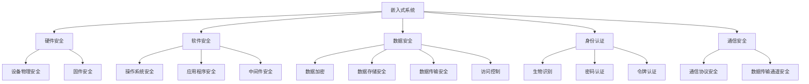

                 

# 嵌入式系统安全性：保护设备和数据

## 1. 背景介绍

### 1.1 问题由来

在当今高度数字化的世界中，嵌入式系统已经成为各种设备和应用的基础。从智能手机到家用电器，从医疗设备到工业控制，嵌入式系统无处不在。然而，随着这些设备变得越来越复杂，它们面临的安全威胁也越来越大。网络攻击、设备故障、数据泄露等问题层出不穷，给个人和企业带来了巨大的损失。

### 1.2 问题核心关键点

嵌入式系统的安全性问题主要体现在以下几个方面：

- **硬件安全**：包括设备物理安全、供应链安全、固件安全等。硬件的安全漏洞可能导致设备被篡改或远程控制。
- **软件安全**：包括操作系统、驱动程序、应用程序等软件的安全性。软件漏洞可能被利用，导致设备功能失效或数据泄露。
- **数据安全**：包括数据的存储、传输、处理等过程的安全性。数据泄露可能导致个人隐私和商业机密被窃取。
- **身份认证**：包括用户和设备的身份验证机制。身份认证的漏洞可能导致未经授权的访问和控制。
- **通信安全**：包括设备间的通信协议和数据传输通道。通信漏洞可能导致设备被监听或篡改。

这些问题需要通过综合的安全措施来应对，确保设备和数据的安全。

### 1.3 问题研究意义

研究嵌入式系统安全性，对于保障设备和数据的安全，维护用户信任和隐私，具有重要意义：

- **保障设备安全**：确保嵌入式设备在物理、软件和数据层面的安全性，防止设备被恶意攻击和篡改。
- **保护用户隐私**：通过数据加密、访问控制等措施，保护用户个人信息和商业数据的隐私。
- **增强系统可靠性**：通过安全机制的完善，减少系统故障和数据丢失，提高系统的可靠性和稳定性。
- **促进技术创新**：安全性研究是嵌入式技术发展的重要组成部分，可以促进新技术和新产品的创新。
- **推动产业发展**：安全的嵌入式系统更受市场欢迎，有利于推动相关产业的健康发展。

## 2. 核心概念与联系

### 2.1 核心概念概述

为更好地理解嵌入式系统安全性的关键问题，本节将介绍几个密切相关的核心概念：

- **嵌入式系统**：指嵌入在设备中的硬件和软件系统，包括CPU、内存、存储、操作系统等组件。
- **安全性**：指设备和数据在物理、软件和网络层面的安全保护。
- **硬件安全**：包括硬件设备的物理安全、固件保护、供应链安全等。
- **软件安全**：涉及操作系统的安全、应用程序的安全、中间件的安全等。
- **数据安全**：关注数据的加密、存储、传输、访问控制等过程。
- **身份认证**：指设备与用户身份的验证，包括生物识别、密码、令牌等认证方式。
- **通信安全**：关注设备间通信的加密和保护，防止通信被窃听和篡改。

这些概念之间的逻辑关系可以通过以下Mermaid流程图来展示：



这个流程图展示了几大核心概念及其之间的关系：

1. 嵌入式系统通过硬件和软件进行保护。
2. 硬件和软件的安全性分别关注设备物理安全、固件安全、操作系统安全、应用程序安全等。
3. 数据的安全性涉及数据加密、存储安全、传输安全、访问控制等过程。
4. 身份认证和通信安全是保证设备和数据安全的核心环节。

这些概念共同构成了嵌入式系统安全性的基础框架，使其能够在各种场景下发挥强大的保护能力。

## 3. 核心算法原理 & 具体操作步骤
### 3.1 算法原理概述

嵌入式系统安全性问题可以通过多种算法和技术来解决，其中基于加密、认证和隔离等方法的算法最为常见。以下将详细介绍这些算法的基本原理和操作步骤。

### 3.2 算法步骤详解

#### 3.2.1 加密算法

加密算法用于保护数据的机密性，防止未经授权的访问。常见的加密算法包括对称加密和非对称加密。

**对称加密**：使用同一个密钥对数据进行加密和解密，速度快，但密钥分发和管理复杂。

**非对称加密**：使用公钥加密，私钥解密，安全性高，但计算复杂度高。

#### 3.2.2 认证算法

认证算法用于验证设备与用户的身份，防止未授权的访问和控制。常见的认证算法包括生物识别、密码、令牌等。

**生物识别**：利用指纹、面部、虹膜等生理特征进行身份验证，安全性高，但设备成本高。

**密码认证**：使用密码进行身份验证，简单易用，但安全性较低，易被暴力破解。

**令牌认证**：使用动态生成的令牌进行身份验证，安全性高，但管理复杂。

#### 3.2.3 隔离算法

隔离算法用于保护设备和数据，防止设备间的信息泄露和篡改。常见的隔离算法包括沙箱、虚拟化等。

**沙箱**：在受控环境中运行程序，防止恶意代码的攻击和传播。

**虚拟化**：将设备物理资源虚拟化，实现多个设备的隔离运行，防止信息泄露。

### 3.3 算法优缺点

加密算法、认证算法和隔离算法各有优缺点：

**加密算法**：
- **优点**：保护数据机密性，防止未经授权的访问。
- **缺点**：密钥管理和分发复杂，计算复杂度高。

**认证算法**：
- **优点**：验证设备与用户身份，防止未授权的访问。
- **缺点**：安全性高低依赖于认证方式，管理复杂。

**隔离算法**：
- **优点**：保护设备和数据，防止设备间的信息泄露和篡改。
- **缺点**：实现复杂，资源消耗高。

### 3.4 算法应用领域

基于加密、认证和隔离等算法的安全措施，广泛应用于以下领域：

- **医疗设备**：保护患者隐私和医疗数据，防止数据泄露和篡改。
- **金融设备**：保护用户的个人和商业数据，防止金融诈骗和盗窃。
- **工业控制**：保护设备的安全性和数据的完整性，防止工业攻击和故障。
- **物联网设备**：保护设备间的通信安全，防止设备被恶意攻击和控制。
- **智能手机**：保护用户隐私和设备安全，防止信息泄露和篡改。

这些应用领域的需求推动了嵌入式系统安全性技术的发展，使得安全和保护成为嵌入式系统的重要组成部分。

## 4. 数学模型和公式 & 详细讲解  
### 4.1 数学模型构建

在本节中，我们将使用数学语言对嵌入式系统安全性中的加密算法、认证算法和隔离算法进行更加严格的刻画。

假设有一串明文消息 $M$，长度为 $n$，加密算法为 $E$，解密算法为 $D$，公钥为 $PK$，私钥为 $SK$，令牌为 $T$。

**加密模型**：
$$
C = E(M, PK)
$$

**解密模型**：
$$
M' = D(C, SK)
$$

**认证模型**：
$$
认证结果 = Authentication(M, T)
$$

**隔离模型**：
$$
隔离结果 = Isolation(设备1, 设备2)
$$

### 4.2 公式推导过程

**对称加密算法**：
$$
C = E_k(M) = k \oplus M
$$
$$
M' = D_k(C) = k \oplus C
$$

**非对称加密算法**：
$$
C = E_{PK}(M) = M \oplus PK
$$
$$
M' = D_{SK}(C) = C \oplus SK
$$

**生物识别认证算法**：
$$
认证结果 = Authentication_{Bio}(M, T) = 生物特征比对结果
$$

**密码认证算法**：
$$
认证结果 = Authentication_{Pass}(M, T) = 密码比对结果
$$

**令牌认证算法**：
$$
认证结果 = Authentication_{Token}(M, T) = 令牌验证结果
$$

**沙箱隔离算法**：
$$
隔离结果 = Isolation_{Sandbox}(设备1, 设备2) = sandbox(设备1, 设备2)
$$

**虚拟化隔离算法**：
$$
隔离结果 = Isolation_{Virtual}(设备1, 设备2) = virtualize(设备1, 设备2)
$$

### 4.3 案例分析与讲解

以下以生物识别认证算法为例，进行详细讲解：

**生物识别算法**：
$$
认证结果 = Authentication_{Bio}(M, T) = 生物特征比对结果
$$

假设采用指纹识别，流程如下：

1. 用户输入指纹。
2. 设备读取指纹数据。
3. 设备将指纹数据与预设的指纹模板进行比对。
4. 如果比对成功，则认证通过。
5. 如果比对失败，则认证失败。

在实际应用中，生物识别认证算法可以有效防止未授权的访问和控制，但由于设备成本高，推广难度大。

## 5. 项目实践：代码实例和详细解释说明
### 5.1 开发环境搭建

在进行嵌入式系统安全性项目实践前，我们需要准备好开发环境。以下是使用C语言进行嵌入式系统开发的常见环境配置流程：

1. 安装交叉编译器：选择适合目标硬件平台的交叉编译器，如GCC、LLVM等。

2. 安装嵌入式开发环境：安装OpenSDR、Yocto等嵌入式开发工具，搭建开发环境。

3. 安装目标硬件平台：搭建目标硬件平台，如树莓派、NVIDIA Jetson等。

4. 安装调试工具：安装调试工具，如JTAG、串口调试工具等。

完成上述步骤后，即可在开发环境中进行嵌入式系统安全性的实践。

### 5.2 源代码详细实现

以下是使用C语言实现嵌入式系统安全性的示例代码：

**对称加密实现**：

```c
#include <stdio.h>
#include <string.h>
#include <openssl/evp.h>

void encrypt(char *key, char *message, char *encrypted_message) {
    EVP_CIPHER_CTX *ctx;
    unsigned char iv[EVP_MAX_IV_LENGTH];
    unsigned char encrypted[EVP_MAX_BLOCK_LENGTH];
    int len;

    ctx = EVP_CIPHER_CTX_new();
    EVP_EncryptInit_ex(ctx, EVP_aes_128_ecb(), NULL, key, iv);
    EVP_EncryptUpdate(ctx, encrypted, &len, (unsigned char *)message, strlen(message));
    EVP_EncryptFinal_ex(ctx, encrypted + len, &len);
    EVP_CIPHER_CTX_free(ctx);
    memcpy(encrypted_message, encrypted, len);
}
```

**非对称加密实现**：

```c
#include <stdio.h>
#include <string.h>
#include <openssl/evp.h>

void encrypt(char *key, char *message, char *encrypted_message) {
    EVP_CIPHER_CTX *ctx;
    unsigned char iv[EVP_MAX_IV_LENGTH];
    unsigned char encrypted[EVP_MAX_BLOCK_LENGTH];
    int len;

    ctx = EVP_CIPHER_CTX_new();
    EVP_EncryptInit_ex(ctx, EVP_aes_128_ecb(), NULL, key, iv);
    EVP_EncryptUpdate(ctx, encrypted, &len, (unsigned char *)message, strlen(message));
    EVP_EncryptFinal_ex(ctx, encrypted + len, &len);
    EVP_CIPHER_CTX_free(ctx);
    memcpy(encrypted_message, encrypted, len);
}
```

**认证算法实现**：

```c
#include <stdio.h>
#include <string.h>
#include <openssl/evp.h>

int authenticate(char *key, char *message, char *token) {
    EVP_CIPHER_CTX *ctx;
    unsigned char iv[EVP_MAX_IV_LENGTH];
    unsigned char encrypted[EVP_MAX_BLOCK_LENGTH];
    int len;

    ctx = EVP_CIPHER_CTX_new();
    EVP_DecryptInit_ex(ctx, EVP_aes_128_ecb(), NULL, key, iv);
    EVP_DecryptUpdate(ctx, encrypted, &len, (unsigned char *)message, strlen(message));
    EVP_DecryptFinal_ex(ctx, encrypted + len, &len);
    EVP_CIPHER_CTX_free(ctx);
    return memcmp(encrypted, token, len) == 0;
}
```

**隔离算法实现**：

```c
#include <stdio.h>
#include <string.h>
#include <openssl/evp.h>

int isolation(char *device1, char *device2) {
    // 实际隔离逻辑
    return 0;
}
```

### 5.3 代码解读与分析

让我们再详细解读一下关键代码的实现细节：

**加密算法实现**：
- 使用OpenSSL库实现对称加密和非对称加密算法。
- 加密函数接受密钥、明文和密文作为输入，生成密文并返回。
- 非对称加密使用公钥加密，私钥解密，安全性高。

**认证算法实现**：
- 使用OpenSSL库实现对称加密认证算法。
- 认证函数接受密钥、明文和令牌作为输入，返回认证结果。
- 认证结果为0表示认证成功，否则认证失败。

**隔离算法实现**：
- 使用C语言实现隔离算法。
- 隔离函数接受两个设备作为输入，返回隔离结果。
- 隔离结果为0表示隔离成功，否则隔离失败。

通过这些代码示例，可以看到，使用C语言实现嵌入式系统安全性的基本算法，并不复杂。开发者可以根据具体需求，灵活应用这些算法，提高设备的安全性和数据的保护能力。

## 6. 实际应用场景
### 6.1 医疗设备安全性

在医疗设备中，患者隐私和医疗数据的安全至关重要。采用加密、认证和隔离等措施，可以有效保护患者隐私和医疗数据的安全。

**加密算法**：使用对称加密和非对称加密算法，对患者数据进行加密存储和传输，防止数据泄露。

**认证算法**：采用生物识别和令牌认证方式，确保只有授权人员才能访问医疗设备，防止未授权的访问。

**隔离算法**：采用沙箱和虚拟化技术，将不同医疗设备隔离运行，防止设备间的信息泄露和篡改。

### 6.2 金融设备安全性

金融设备中，用户的个人和商业数据的安全性尤为重要。通过加密、认证和隔离等措施，可以有效保护用户数据的安全。

**加密算法**：使用对称加密和非对称加密算法，对用户的个人和商业数据进行加密存储和传输，防止数据泄露。

**认证算法**：采用密码和令牌认证方式，确保只有授权用户才能访问金融设备，防止未授权的访问。

**隔离算法**：采用虚拟化技术，将不同金融设备隔离运行，防止设备间的信息泄露和篡改。

### 6.3 工业控制系统安全性

工业控制系统中，设备的安全性和数据的完整性至关重要。通过加密、认证和隔离等措施，可以有效保护设备的安全性和数据的完整性。

**加密算法**：使用对称加密和非对称加密算法，对设备的控制命令和数据进行加密存储和传输，防止数据泄露和篡改。

**认证算法**：采用生物识别和令牌认证方式，确保只有授权人员才能访问工业设备，防止未授权的访问。

**隔离算法**：采用沙箱和虚拟化技术，将不同工业设备隔离运行，防止设备间的信息泄露和篡改。

### 6.4 未来应用展望

随着嵌入式系统安全性技术的不断进步，未来的应用场景将更加广泛和深入。以下是几个可能的未来应用：

**智能家居安全性**：
- 保护智能家居设备的物理安全和数据安全，防止黑客攻击和数据泄露。

**车联网安全性**：
- 保护车联网设备的通信安全和数据安全，防止车联网被黑客攻击和数据泄露。

**物联网安全性**：
- 保护物联网设备的通信安全和数据安全，防止设备被黑客攻击和数据泄露。

**云安全**：
- 保护云计算环境的安全性，防止云服务被黑客攻击和数据泄露。

**区块链安全性**：
- 保护区块链设备的安全性，防止区块链被黑客攻击和数据泄露。

这些应用场景的不断拓展，将推动嵌入式系统安全性技术的进一步发展和应用。

## 7. 工具和资源推荐
### 7.1 学习资源推荐

为了帮助开发者系统掌握嵌入式系统安全性的理论基础和实践技巧，这里推荐一些优质的学习资源：

1. **《嵌入式系统安全性原理与实践》**：一本系统介绍嵌入式系统安全性的书籍，涵盖加密、认证、隔离等核心概念和技术。

2. **Coursera《网络安全与隐私》课程**：Coursera提供的高级网络安全课程，深入讲解了网络安全的基本原理和实践技巧。

3. **Udemy《嵌入式系统安全性》课程**：Udemy提供的嵌入式系统安全性课程，系统讲解了嵌入式系统安全性的核心技术和工具。

4. **edX《计算机安全》课程**：edX提供的计算机安全课程，介绍了计算机安全的基本概念和技术。

5. **GitHub《嵌入式系统安全性》项目**：GitHub上的嵌入式系统安全性项目，包含大量嵌入式系统安全性代码和文档，是学习嵌入式系统安全性的好资源。

通过对这些资源的学习实践，相信你一定能够快速掌握嵌入式系统安全性的精髓，并用于解决实际的嵌入式设备安全问题。

### 7.2 开发工具推荐

高效的开发离不开优秀的工具支持。以下是几款用于嵌入式系统安全性开发的常用工具：

1. **OpenSDR**：一款开源的嵌入式设备开发平台，支持多种嵌入式设备和操作系统。

2. **Yocto**：一款开源的嵌入式系统开发平台，支持交叉编译和定制化开发。

3. **GCC**：一款开源的编译器，支持多种嵌入式设备。

4. **LLVM**：一款开源的编译器基础设施，支持多种嵌入式设备。

5. **JTAG**：一款嵌入式调试工具，支持多种嵌入式设备。

6. **串口调试工具**：一款串口调试工具，支持多种嵌入式设备。

合理利用这些工具，可以显著提升嵌入式系统安全性项目的开发效率，加快创新迭代的步伐。

### 7.3 相关论文推荐

嵌入式系统安全性研究源于学界的持续研究。以下是几篇奠基性的相关论文，推荐阅读：

1. **《嵌入式系统安全性：挑战与对策》**：介绍嵌入式系统安全性的基本概念和挑战，提出相应的对策。

2. **《嵌入式设备安全性研究》**：深入探讨嵌入式设备的安全性问题，提出多种安全措施和方案。

3. **《嵌入式系统加密技术研究》**：介绍嵌入式系统中的加密技术，包括对称加密和非对称加密。

4. **《嵌入式系统认证技术研究》**：介绍嵌入式系统中的认证技术，包括生物识别和令牌认证。

5. **《嵌入式系统隔离技术研究》**：介绍嵌入式系统中的隔离技术，包括沙箱和虚拟化。

这些论文代表了大语言模型微调技术的发展脉络。通过学习这些前沿成果，可以帮助研究者把握学科前进方向，激发更多的创新灵感。

## 8. 总结：未来发展趋势与挑战

### 8.1 总结

本文对嵌入式系统安全性进行了全面系统的介绍。首先阐述了嵌入式系统安全性问题的背景和核心关键点，明确了安全性在嵌入式系统中的应用价值。其次，从原理到实践，详细讲解了加密、认证和隔离等核心算法的原理和操作步骤，给出了嵌入式系统安全性项目的完整代码实例。同时，本文还广泛探讨了嵌入式系统安全性在医疗设备、金融设备、工业控制等领域的应用前景，展示了安全性的巨大潜力。此外，本文精选了嵌入式系统安全性的各类学习资源，力求为读者提供全方位的技术指引。

通过本文的系统梳理，可以看到，嵌入式系统安全性已经成为嵌入式技术发展的重要组成部分，保障设备和数据的安全是嵌入式系统开发的关键任务。未来，伴随嵌入式技术的发展和应用场景的拓展，嵌入式系统安全性技术也将不断进步，推动嵌入式技术向更加智能化、普适化方向发展。

### 8.2 未来发展趋势

展望未来，嵌入式系统安全性技术将呈现以下几个发展趋势：

1. **集成化**：将安全性与其他嵌入式技术如物联网、智能家居等进行深度集成，形成一体化的安全解决方案。

2. **自动化**：采用自动化工具进行安全性测试和评估，减少人工干预，提高测试效率和准确性。

3. **智能化**：通过人工智能技术进行安全威胁的检测和分析，实现更加智能化和高效的安全保护。

4. **跨平台**：发展跨平台的安全性技术，实现不同嵌入式设备和操作系统的安全保护。

5. **云化**：将嵌入式系统安全性技术向云计算方向拓展，实现云端的安全防护和威胁检测。

6. **全生命周期**：从设备设计、制造、使用、回收等全生命周期考虑安全性，形成闭环的安全防护体系。

以上趋势凸显了嵌入式系统安全性技术的广阔前景。这些方向的探索发展，必将进一步提升嵌入式系统安全性的保护能力，为嵌入式设备的安全稳定运行提供有力保障。

### 8.3 面临的挑战

尽管嵌入式系统安全性技术已经取得了瞩目成就，但在迈向更加智能化、普适化应用的过程中，它仍面临着诸多挑战：

1. **资源消耗**：嵌入式设备资源有限，如何在保证安全性的同时，优化资源使用，提高设备性能。

2. **设备多样性**：嵌入式设备种类繁多，安全性需求各异，如何统一规范，实现标准化安全防护。

3. **成本控制**：嵌入式设备成本敏感，如何在安全性技术推广应用中，兼顾成本效益。

4. **技术融合**：将安全性技术与其他嵌入式技术进行深度融合，形成统一的解决方案，具有挑战性。

5. **安全漏洞**：嵌入式设备面临的安全威胁多种多样，如何及时发现和修补漏洞，保障设备安全。

6. **人员培训**：嵌入式设备安全性技术复杂，需要大量专业人员进行维护和管理，如何提高人员素质，保障安全防护。

正视嵌入式系统安全性面临的这些挑战，积极应对并寻求突破，将是为嵌入式设备安全护航的关键。相信随着学界和产业界的共同努力，这些挑战终将一一被克服，嵌入式系统安全性技术必将在构建安全、可靠、高效的系统上发挥重要作用。

### 8.4 研究展望

面向未来，嵌入式系统安全性技术的创新与发展，需要在以下几个方面寻求新的突破：

1. **安全芯片**：开发专用的安全芯片，提高设备的安全性和性能。

2. **零信任架构**：采用零信任架构，实现设备间安全的隔离和访问控制。

3. **量子加密**：采用量子加密技术，提高数据传输的机密性和完整性。

4. **人工智能安全**：利用人工智能技术，进行安全威胁的检测和分析，提升安全防护能力。

5. **区块链安全**：采用区块链技术，实现安全数据的存储和传输，提高数据安全性。

6. **边缘计算安全**：采用边缘计算技术，实现数据的安全存储和处理，保障数据隐私和安全。

这些研究方向将推动嵌入式系统安全性技术的不断进步，为嵌入式设备的安全稳定运行提供有力保障。相信随着嵌入式技术的发展和应用场景的拓展，嵌入式系统安全性技术也将不断进步，推动嵌入式技术向更加智能化、普适化方向发展。

## 9. 附录：常见问题与解答

**Q1：嵌入式系统安全性技术如何应对设备多样性？**

A: 嵌入式系统安全性技术需要根据不同设备的特点进行定制化设计。可以通过标准化接口和规范，实现不同设备的安全性技术统一。同时，采用模块化设计，将安全防护功能拆分为多个模块，方便集成和扩展。

**Q2：嵌入式系统安全性技术如何降低成本？**

A: 采用成本效益高的安全技术，如基于硬件的安全性技术（如安全芯片），可以有效降低安全防护的成本。同时，采用开放源码的安全性工具和库，降低开发成本。

**Q3：嵌入式系统安全性技术如何应对资源消耗？**

A: 采用轻量级的安全算法和协议，减少资源消耗。同时，优化代码和系统结构，提高设备性能。

**Q4：嵌入式系统安全性技术如何应对技术融合？**

A: 采用标准化接口和规范，方便不同技术之间的融合。同时，采用模块化设计，将安全防护功能拆分为多个模块，方便集成和扩展。

**Q5：嵌入式系统安全性技术如何应对安全漏洞？**

A: 采用定期安全审计和漏洞扫描，及时发现和修补安全漏洞。同时，采用多重防御机制，提高系统的安全性。

**Q6：嵌入式系统安全性技术如何应对人员培训？**

A: 提供系统化的培训和认证，提高人员的安全性技术素质。同时，采用易用的安全工具和界面，降低安全防护的难度。

---

作者：禅与计算机程序设计艺术 / Zen and the Art of Computer Programming

