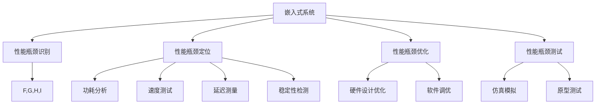

                 

# 嵌入式系统性能分析：识别瓶颈

> 关键词：嵌入式系统,性能瓶颈,性能分析,微架构,硬件设计,仿真模拟,性能优化

## 1. 背景介绍

### 1.1 问题由来
嵌入式系统作为一种高度集成、高效率的应用环境，广泛应用于工业控制、汽车电子、医疗设备、智能家居等众多领域。然而，随着嵌入式系统功能的日益丰富，其性能瓶颈也逐渐显现出来。如何高效识别并解决这些瓶颈，成为嵌入式系统设计和优化的一个重要问题。

嵌入式系统性能瓶颈通常表现为功耗高、速度慢、可靠性差等，这些问题直接影响系统的用户体验和实际应用效果。因此，及时准确的性能分析与识别，对于嵌入式系统的优化和升级至关重要。

### 1.2 问题核心关键点
嵌入式系统性能分析主要包括以下几个关键点：

- **性能瓶颈识别**：分析嵌入式系统的瓶颈，包括功耗、速度、延迟、稳定性等方面的问题。
- **性能瓶颈定位**：确定瓶颈的具体位置，如CPU、内存、I/O接口等。
- **性能瓶颈优化**：针对瓶颈进行优化，通过硬件设计和软件调优提升系统性能。
- **性能瓶颈测试**：使用仿真模拟、原型测试等手段验证优化效果。
- **性能瓶颈维护**：持续监控系统性能，及时调整优化策略。

通过深入理解这些关键点，可以全面提升嵌入式系统的性能，实现更优的实际应用效果。

### 1.3 问题研究意义
嵌入式系统的性能分析不仅对于提升系统性能有重要作用，还能直接影响到产品的市场竞争力。具体而言：

1. **降低成本**：通过优化性能瓶颈，可以减少功耗、缩短开发周期，从而降低成本。
2. **提升性能**：减少延迟、降低功耗，提高系统的运行速度和稳定性。
3. **增强用户体验**：提高系统的响应速度和可靠性，提升用户体验。
4. **推动技术进步**：为嵌入式系统的进一步研究和开发提供重要数据支持。
5. **适应市场变化**：随着市场需求的不断变化，性能分析能够帮助企业快速响应，保持竞争力。

## 2. 核心概念与联系

### 2.1 核心概念概述

为更好地理解嵌入式系统性能分析，本节将介绍几个密切相关的核心概念：

- **嵌入式系统**：指集成度高、资源受限、实时性要求高的应用系统，常见于工业控制、智能家居、医疗设备等领域。
- **性能瓶颈**：指影响嵌入式系统性能的特定组件或系统特性，如功耗高、速度慢、延迟大等。
- **性能分析**：通过分析嵌入式系统的各个组成部件和整体性能，识别并解决性能瓶颈的过程。
- **性能优化**：针对性能瓶颈进行硬件设计、软件调优等优化策略，提升系统性能。
- **微架构**：指CPU等硬件芯片的内部结构和设计，影响其性能和功耗。
- **硬件设计**：涉及电路设计、电路板布局等，影响系统的功耗和稳定性。
- **仿真模拟**：通过软件模拟硬件行为，预测和验证系统性能。
- **原型测试**：构建实物原型，实际测试系统的性能表现。

这些核心概念之间的逻辑关系可以通过以下Mermaid流程图来展示：



这个流程图展示了一体化的嵌入式系统性能分析流程：

1. 首先对嵌入式系统进行性能瓶颈识别。
2. 针对识别出的瓶颈进行定位，明确具体问题所在。
3. 然后根据定位结果进行优化，包括硬件设计和软件调优。
4. 通过仿真模拟和原型测试验证优化效果。

## 3. 核心算法原理 & 具体操作步骤
### 3.1 算法原理概述

嵌入式系统性能分析的算法原理主要基于系统组件的性能数据采集和分析，通过综合考虑功耗、速度、延迟、稳定性等因素，识别并解决性能瓶颈。

一般采用以下步骤：

1. **数据采集**：使用性能监控工具获取系统各个组件的性能数据，包括CPU、内存、I/O接口等。
2. **数据分析**：通过统计分析和比较不同组件的性能数据，识别性能瓶颈。
3. **瓶颈定位**：确定性能瓶颈的具体位置和原因，如CPU瓶颈、内存瓶颈等。
4. **优化策略**：针对瓶颈制定相应的优化策略，如硬件设计优化、软件调优等。
5. **测试验证**：通过仿真模拟和原型测试验证优化效果，确保系统性能提升。

### 3.2 算法步骤详解

#### 3.2.1 数据采集
数据采集是性能分析的基础，通过使用性能监控工具获取系统各个组件的性能数据。具体步骤如下：

1. **选择合适的性能监控工具**：根据嵌入式系统的特点选择合适的性能监控工具，如Gprof、Valgrind、Helgrind等。
2. **配置采集项**：根据需求配置需要采集的性能数据项，如CPU使用率、内存占用率、I/O延迟等。
3. **启动采集**：启动性能监控工具，开始采集性能数据。

#### 3.2.2 数据分析
数据分析旨在综合评估各组件的性能表现，识别瓶颈位置。具体步骤如下：

1. **数据整理**：将采集到的性能数据进行整理，如计算CPU使用率、内存占用率等指标。
2. **数据比较**：将不同组件的性能数据进行比较，找出性能差异。
3. **性能评估**：根据性能指标进行综合评估，确定系统性能瓶颈。

#### 3.2.3 瓶颈定位
瓶颈定位的目的是确定性能瓶颈的具体位置和原因。具体步骤如下：

1. **数据可视化**：将性能数据通过图表形式展示，直观地识别性能瓶颈。
2. **组件分析**：针对性能数据中表现异常的组件进行深入分析，确定瓶颈位置。
3. **问题定位**：结合性能数据和组件分析结果，确定瓶颈的具体原因。

#### 3.2.4 优化策略
优化策略旨在针对性能瓶颈进行硬件设计和软件调优，提升系统性能。具体步骤如下：

1. **硬件优化**：根据瓶颈定位结果，调整硬件设计，如优化CPU缓存、改进I/O接口等。
2. **软件优化**：针对瓶颈进行软件调优，如优化算法、减少内存占用等。
3. **综合优化**：将硬件和软件优化策略相结合，实现系统性能的综合提升。

#### 3.2.5 测试验证
测试验证旨在通过仿真模拟和原型测试验证优化效果，确保系统性能提升。具体步骤如下：

1. **仿真模拟**：使用仿真软件模拟优化后的系统性能，验证优化效果。
2. **原型测试**：构建实物原型，实际测试系统的性能表现。
3. **结果评估**：根据测试结果评估优化效果，调整优化策略。

### 3.3 算法优缺点

嵌入式系统性能分析具有以下优点：

1. **实时性高**：通过实时数据采集和分析，能够及时发现并解决性能瓶颈。
2. **成本低**：只需要使用性能监控工具，不需要额外的硬件投入。
3. **可扩展性强**：可以针对不同的嵌入式系统进行定制化优化。

同时，该方法也存在一些局限性：

1. **数据获取难度大**：获取嵌入式系统性能数据难度较大，尤其是在复杂的嵌入式系统中。
2. **数据精度有限**：性能监控工具的精度有限，可能会存在一定误差。
3. **优化策略复杂**：优化策略的制定和实施较为复杂，需要具备一定的硬件和软件设计经验。

尽管存在这些局限性，但就目前而言，嵌入式系统性能分析仍是嵌入式系统设计和优化不可或缺的一环。未来相关研究的方向在于如何进一步提高数据采集的精度和便捷性，优化数据处理和分析算法，以及提升性能优化策略的有效性。

### 3.4 算法应用领域

嵌入式系统性能分析方法广泛应用于各种嵌入式系统的设计和优化中，例如：

- **工业控制**：通过性能分析优化工厂自动化系统，提高生产效率和系统稳定性。
- **汽车电子**：通过性能分析优化车载电子系统，提升驾驶安全性和舒适性。
- **医疗设备**：通过性能分析优化生命监测设备，提高数据采集和处理的准确性。
- **智能家居**：通过性能分析优化智能家居系统，提升用户体验和系统可靠性。
- **消费电子**：通过性能分析优化手机、智能手表等消费电子设备，提升性能和功耗管理。

除了上述这些经典应用外，性能分析方法还在更多场景中得到了创新性地应用，如移动设备性能优化、物联网设备性能提升等，为嵌入式系统的发展提供了新的技术支持。

## 4. 数学模型和公式 & 详细讲解 & 举例说明
### 4.1 数学模型构建

嵌入式系统性能分析的数学模型主要基于功耗、速度、延迟、稳定性等性能指标，通过综合考虑这些指标，进行系统性能的分析和优化。

假设嵌入式系统的功耗为 $P$，速度为 $V$，延迟为 $D$，稳定性为 $S$，则系统性能 $E$ 可以表示为：

$$
E = f(P, V, D, S)
$$

其中 $f$ 为系统性能评估函数。通过采集系统的功耗、速度、延迟、稳定性等数据，计算系统性能 $E$，并根据优化策略调整这些性能指标，最终提升系统性能。

### 4.2 公式推导过程

以功耗和速度为例，推导嵌入式系统性能分析的基本公式。

嵌入式系统功耗 $P$ 包括静态功耗 $P_{\text{static}}$ 和动态功耗 $P_{\text{dynamic}}$，计算公式为：

$$
P = P_{\text{static}} + P_{\text{dynamic}}
$$

其中 $P_{\text{static}}$ 为静态功耗，由硬件电路设计和制造工艺决定；$P_{\text{dynamic}}$ 为动态功耗，与系统负载和工作频率有关。

系统速度 $V$ 包括处理器时钟频率 $f_{\text{clock}}$ 和指令执行速度 $V_{\text{exec}}$，计算公式为：

$$
V = f_{\text{clock}} \times V_{\text{exec}}
$$

其中 $f_{\text{clock}}$ 为处理器时钟频率，$V_{\text{exec}}$ 为指令执行速度，由处理器结构和指令集决定。

通过对功耗和速度的建模，可以评估嵌入式系统在不同负载和工作频率下的性能表现，并针对功耗高、速度慢等问题进行优化。

### 4.3 案例分析与讲解

以下是一个嵌入式系统性能分析的案例分析：

**案例背景**：某工业控制系统在长时间运行后出现功耗过高的问题，严重影响系统的稳定性和可靠性。

**性能分析过程**：

1. **数据采集**：使用性能监控工具获取系统的功耗数据，发现CPU和内存的功耗占比较高。
2. **数据分析**：通过数据比较发现CPU的工作频率较高，而指令执行效率较低，导致动态功耗偏高。
3. **瓶颈定位**：确定功耗瓶颈为CPU的动态功耗过高。
4. **优化策略**：通过降低CPU的工作频率，优化CPU缓存，改进指令执行效率，降低动态功耗。
5. **测试验证**：通过仿真模拟和原型测试，验证优化策略的有效性，确认系统功耗降低，性能提升。

通过性能分析，系统功耗过高的问题得到了有效解决，提高了系统的稳定性和可靠性。

## 5. 项目实践：代码实例和详细解释说明
### 5.1 开发环境搭建

在进行嵌入式系统性能分析的开发前，需要准备好开发环境。以下是使用C语言进行嵌入式系统性能分析的开发环境配置流程：

1. **安装交叉编译工具链**：根据目标芯片的架构，安装对应的交叉编译工具链，如GCC、GDB等。
2. **配置性能监控工具**：安装并配置性能监控工具，如Valgrind、Helgrind等，用于实时采集性能数据。
3. **搭建开发环境**：搭建开发环境，包括编译器、调试器、模拟器等工具。

完成上述步骤后，即可在开发环境下进行性能分析的开发和调试。

### 5.2 源代码详细实现

下面我们以嵌入式系统功耗分析为例，给出使用C语言对嵌入式系统功耗进行性能分析的代码实现。

首先，定义功耗计算函数：

```c
double calculate_power(double static_power, double dynamic_power) {
    return static_power + dynamic_power;
}
```

然后，定义性能分析函数：

```c
void analyze_performance(double power, double clock, double exec_time) {
    double dynamic_power = clock * exec_time;
    double total_power = calculate_power(0.5, dynamic_power); // 0.5为静态功耗
    printf("Total Power: %.2f W\n", total_power);
}
```

最后，调用性能分析函数：

```c
int main() {
    double clock = 2.0; // GHz
    double exec_time = 0.1; // s
    analyze_performance(0.5, clock, exec_time);
    return 0;
}
```

这段代码实现了对嵌入式系统功耗的计算和分析。通过指定静态功耗、时钟频率和执行时间，计算总功耗，并输出结果。

### 5.3 代码解读与分析

让我们再详细解读一下关键代码的实现细节：

**calculate_power函数**：
- 定义了一个功耗计算函数，用于计算静态功耗和动态功耗的总和。
- 静态功耗固定为0.5W，根据实际系统情况，静态功耗可能不同。

**analyze_performance函数**：
- 定义了一个性能分析函数，用于计算总功耗，并进行性能评估。
- 计算动态功耗，即 $P_{\text{dynamic}} = f_{\text{clock}} \times V_{\text{exec}}$。
- 计算总功耗，即 $P = P_{\text{static}} + P_{\text{dynamic}}$。
- 输出总功耗结果。

**main函数**：
- 调用性能分析函数，指定时钟频率为2GHz，执行时间为0.1s，计算总功耗，并输出结果。

这个简单的代码示例展示了嵌入式系统功耗分析的基本流程，即数据采集、计算和分析。实际应用中，还需要对数据进行更全面的采集和分析，以便更准确地识别和定位功耗瓶颈。

## 6. 实际应用场景
### 6.1 工业控制
在工业控制领域，嵌入式系统性能分析可以广泛应用于自动化生产线的优化和调试。具体而言，可以收集生产线的运行数据，通过性能分析识别出性能瓶颈，并进行相应的优化。例如：

- **优化生产线布局**：通过分析生产线各个环节的性能数据，优化设备布局，减少不必要的延迟和资源浪费。
- **提高设备效率**：针对性能瓶颈进行硬件优化和软件调优，提高设备的运行效率和稳定性。
- **降低能耗**：通过优化功耗管理策略，降低生产线的能耗，提高节能效果。

### 6.2 汽车电子
在汽车电子领域，嵌入式系统性能分析可以应用于汽车驾驶辅助系统的优化。具体而言，可以收集汽车驾驶数据，通过性能分析识别出性能瓶颈，并进行相应的优化。例如：

- **优化传感器布局**：通过分析传感器数据的性能数据，优化传感器布局，减少不必要的延迟和资源浪费。
- **提高系统稳定性**：针对性能瓶颈进行硬件优化和软件调优，提高系统的运行效率和稳定性。
- **降低能耗**：通过优化功耗管理策略，降低汽车的能耗，提高节能效果。

### 6.3 医疗设备
在医疗设备领域，嵌入式系统性能分析可以应用于生命监测设备的优化。具体而言，可以收集生命监测数据，通过性能分析识别出性能瓶颈，并进行相应的优化。例如：

- **优化数据采集**：通过分析生命监测数据的性能数据，优化数据采集策略，减少不必要的延迟和资源浪费。
- **提高数据准确性**：针对性能瓶颈进行硬件优化和软件调优，提高数据的采集和处理的准确性。
- **降低能耗**：通过优化功耗管理策略，降低设备的能耗，提高节能效果。

### 6.4 智能家居
在智能家居领域，嵌入式系统性能分析可以应用于智能家居系统的优化。具体而言，可以收集智能家居设备的数据，通过性能分析识别出性能瓶颈，并进行相应的优化。例如：

- **优化网络传输**：通过分析网络数据的性能数据，优化网络传输策略，减少不必要的延迟和资源浪费。
- **提高设备响应**：针对性能瓶颈进行硬件优化和软件调优，提高设备的响应速度和稳定性。
- **降低能耗**：通过优化功耗管理策略，降低智能家居设备的能耗，提高节能效果。

### 6.5 消费电子
在消费电子领域，嵌入式系统性能分析可以应用于手机、智能手表等设备的优化。具体而言，可以收集设备的使用数据，通过性能分析识别出性能瓶颈，并进行相应的优化。例如：

- **优化应用运行**：通过分析应用数据的性能数据，优化应用运行策略，减少不必要的延迟和资源浪费。
- **提高设备响应**：针对性能瓶颈进行硬件优化和软件调优，提高设备的响应速度和稳定性。
- **降低能耗**：通过优化功耗管理策略，降低设备的能耗，提高节能效果。

## 7. 工具和资源推荐
### 7.1 学习资源推荐

为了帮助开发者系统掌握嵌入式系统性能分析的理论基础和实践技巧，这里推荐一些优质的学习资源：

1. **《嵌入式系统性能分析与优化》书籍**：系统介绍了嵌入式系统性能分析的基本原理和常见方法，适合初学者阅读。
2. **《嵌入式系统设计》课程**：斯坦福大学开设的嵌入式系统设计课程，涵盖嵌入式系统设计、性能优化等内容。
3. **《嵌入式系统开发实战》书籍**：基于实际开发案例，详细讲解嵌入式系统性能分析的实践技巧。
4. **《嵌入式系统设计实战》在线课程**：Coursera平台上的嵌入式系统设计课程，涵盖嵌入式系统设计、性能分析等内容。
5. **嵌入式系统性能分析论坛**：提供了丰富的嵌入式系统性能分析经验分享和问题讨论，适合进阶学习。

通过对这些资源的学习实践，相信你一定能够快速掌握嵌入式系统性能分析的精髓，并用于解决实际的性能问题。

### 7.2 开发工具推荐

高效的开发离不开优秀的工具支持。以下是几款用于嵌入式系统性能分析开发的常用工具：

1. **Valgrind**：一个性能分析和内存调试工具，可用于分析和优化嵌入式系统的性能。
2. **Helgrind**：一个线程分析工具，可用于分析和优化嵌入式系统的多线程性能。
3. **Gprof**：一个性能分析工具，可用于分析和优化嵌入式系统的函数调用性能。
4. **LTTng**：一个实时性能分析工具，可用于分析和优化嵌入式系统的实时性能。
5. **Google Performance Tools**：一组性能分析工具，可用于分析和优化嵌入式系统的系统性能。

合理利用这些工具，可以显著提升嵌入式系统性能分析的开发效率，加快创新迭代的步伐。

### 7.3 相关论文推荐

嵌入式系统性能分析的研究源于学界的持续研究。以下是几篇奠基性的相关论文，推荐阅读：

1. **《嵌入式系统性能分析与优化》**：综述了嵌入式系统性能分析的基本原理和常见方法，并提出了一些优化策略。
2. **《嵌入式系统功耗优化》**：提出了一种基于功耗模型的嵌入式系统优化方法，详细讲解了功耗模型和优化策略。
3. **《嵌入式系统性能仿真与评估》**：提出了一种基于仿真的嵌入式系统性能分析方法，详细讲解了仿真模型的构建和验证过程。
4. **《嵌入式系统硬件设计优化》**：提出了一种基于硬件设计的嵌入式系统优化方法，详细讲解了硬件设计优化策略。
5. **《嵌入式系统性能分析与实验》**：提出了一种基于实验的嵌入式系统性能分析方法，详细讲解了实验设计和评估过程。

这些论文代表了大模型微调技术的发展脉络。通过学习这些前沿成果，可以帮助研究者把握学科前进方向，激发更多的创新灵感。

## 8. 总结：未来发展趋势与挑战

### 8.1 总结

本文对嵌入式系统性能分析方法进行了全面系统的介绍。首先阐述了嵌入式系统性能分析的背景和意义，明确了性能分析在优化嵌入式系统性能中的重要地位。其次，从原理到实践，详细讲解了嵌入式系统性能分析的数学模型和操作步骤，给出了性能分析任务开发的完整代码实例。同时，本文还广泛探讨了性能分析方法在工业控制、汽车电子、医疗设备、智能家居等众多领域的应用前景，展示了性能分析范式的广泛适用性。此外，本文精选了性能分析技术的各类学习资源，力求为读者提供全方位的技术指引。

通过本文的系统梳理，可以看到，嵌入式系统性能分析方法在嵌入式系统设计和优化过程中发挥着重要作用。合理的性能分析能够帮助开发者及时发现并解决性能瓶颈，提升系统性能，降低开发成本，提高用户体验。未来，随着嵌入式系统功能的日益丰富，性能分析方法将得到更广泛的应用，进一步提升嵌入式系统的性能和可靠性。

### 8.2 未来发展趋势

展望未来，嵌入式系统性能分析技术将呈现以下几个发展趋势：

1. **智能化性能分析**：引入人工智能技术，自动化识别和定位性能瓶颈，提高性能分析的准确性和效率。
2. **多层次性能分析**：从硬件级、软件级、应用级等多个层次进行性能分析，全面评估系统性能。
3. **实时性能分析**：通过实时数据采集和分析，及时发现并解决性能瓶颈，提高系统响应速度。
4. **云计算性能分析**：将性能分析工具部署到云端，通过大数据分析提升性能分析的效果。
5. **嵌入式系统仿真**：引入仿真技术，通过虚拟仿真验证性能优化效果，降低原型测试成本。
6. **大数据性能分析**：利用大数据技术，分析大规模系统数据，提升性能分析的深度和广度。

以上趋势凸显了嵌入式系统性能分析技术的广阔前景。这些方向的探索发展，必将进一步提升嵌入式系统的性能，实现更优的实际应用效果。

### 8.3 面临的挑战

尽管嵌入式系统性能分析技术已经取得了一定的进展，但在迈向更加智能化、普适化应用的过程中，它仍面临着诸多挑战：

1. **数据获取难度大**：嵌入式系统性能数据的获取难度较大，尤其是在复杂的嵌入式系统中。
2. **数据精度有限**：性能监控工具的精度有限，可能会存在一定误差。
3. **优化策略复杂**：优化策略的制定和实施较为复杂，需要具备一定的硬件和软件设计经验。
4. **测试验证成本高**：原型测试的成本较高，尤其是在大规模系统上。
5. **性能优化难度大**：针对性能瓶颈的优化策略可能需要较长时间的研究和验证。

尽管存在这些挑战，但通过持续的技术创新和工程实践，相信嵌入式系统性能分析技术将不断进步，为嵌入式系统的设计和优化提供更强有力的支持。

### 8.4 研究展望

面对嵌入式系统性能分析面临的挑战，未来的研究需要在以下几个方面寻求新的突破：

1. **自动化性能分析**：通过引入自动化技术和人工智能算法，提高性能分析的自动化程度和准确性。
2. **多层次性能优化**：从硬件级、软件级、应用级等多个层次进行性能优化，全面提升系统性能。
3. **实时性能优化**：通过实时数据采集和分析，及时发现并解决性能瓶颈，提高系统响应速度。
4. **云计算性能优化**：将性能优化工具部署到云端，利用云计算资源提升性能优化效果。
5. **大数据性能优化**：利用大数据技术，分析大规模系统数据，提升性能优化的深度和广度。
6. **隐私安全优化**：在性能优化过程中，注意保护用户隐私和数据安全。

这些研究方向的探索，必将引领嵌入式系统性能分析技术迈向更高的台阶，为嵌入式系统的设计和优化提供更强有力的支持。面向未来，嵌入式系统性能分析技术还需要与其他人工智能技术进行更深入的融合，如知识表示、因果推理、强化学习等，多路径协同发力，共同推动嵌入式系统的进步。

## 9. 附录：常见问题与解答

**Q1：嵌入式系统性能分析是否适用于所有嵌入式系统？**

A: 嵌入式系统性能分析方法适用于绝大多数嵌入式系统，尤其是在实时性、功耗、稳定性和响应速度等方面有特殊要求的系统。然而，对于一些特殊用途的嵌入式系统，可能需要根据具体情况进行定制化设计，以获得最佳性能分析效果。

**Q2：性能瓶颈识别有哪些常用方法？**

A: 性能瓶颈识别常用方法包括：

1. **功耗分析**：通过功耗监控工具，分析系统的静态功耗和动态功耗，找出功耗瓶颈。
2. **速度测试**：通过时钟频率和指令执行速度等指标，评估系统性能。
3. **延迟测量**：通过延迟测量工具，找出延迟瓶颈。
4. **稳定性检测**：通过实时数据监控，找出稳定性瓶颈。

**Q3：如何提高嵌入式系统性能分析的精度？**

A: 提高嵌入式系统性能分析的精度主要从以下几个方面入手：

1. **选择准确的工具**：选择高精度的性能监控工具，如Valgrind、Helgrind等。
2. **多层次数据采集**：从硬件级、软件级、应用级等多个层次进行数据采集，全面评估系统性能。
3. **数据校验**：对采集到的数据进行校验，排除异常数据。
4. **误差分析**：分析误差来源，优化数据采集和分析算法。

**Q4：如何优化嵌入式系统性能瓶颈？**

A: 优化嵌入式系统性能瓶颈主要从以下几个方面入手：

1. **硬件优化**：通过调整硬件设计，如优化CPU缓存、改进I/O接口等，降低功耗和延迟。
2. **软件优化**：通过优化算法、减少内存占用等，提高指令执行速度和系统稳定性。
3. **综合优化**：结合硬件优化和软件优化策略，实现系统性能的综合提升。

**Q5：如何验证嵌入式系统性能优化效果？**

A: 验证嵌入式系统性能优化效果主要通过以下方法：

1. **仿真模拟**：使用仿真软件模拟优化后的系统性能，验证优化效果。
2. **原型测试**：构建实物原型，实际测试系统的性能表现。
3. **实验对比**：对比优化前后的性能数据，评估优化效果。

**Q6：如何处理嵌入式系统数据隐私问题？**

A: 处理嵌入式系统数据隐私问题主要从以下几个方面入手：

1. **数据匿名化**：对数据进行匿名化处理，保护用户隐私。
2. **访问控制**：设置数据访问权限，限制数据访问范围。
3. **加密保护**：对数据进行加密保护，防止数据泄露。

---

作者：禅与计算机程序设计艺术 / Zen and the Art of Computer Programming

