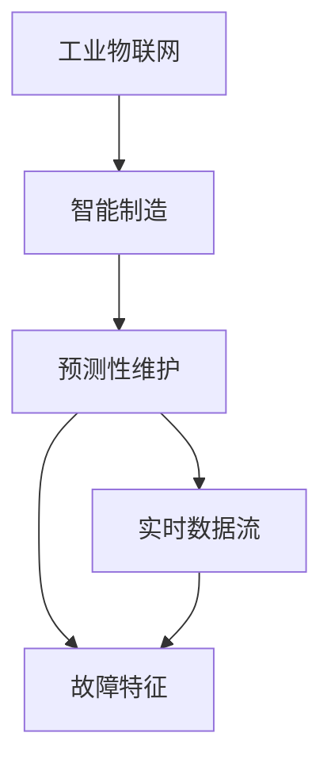

                 

# 工业物联网：智能制造和预测性维护

## 1. 背景介绍

### 1.1 问题由来
随着全球工业自动化和信息化的飞速发展，工业物联网（IIoT）正逐渐成为制造业转型升级的重要驱动力。IIoT融合了传感器、物联网技术、云计算、大数据、人工智能等现代信息技术，通过实时采集和分析工业设备运行数据，推动了智能制造和预测性维护的落地应用。智能制造利用数据驱动生产全流程的精细化和自动化，预测性维护则通过故障预测和健康管理，有效提升设备运行效率和可靠性能，降低维护成本。

在实际生产过程中，设备的故障率较高且不可预见性较强，给制造企业的生产计划和资源管理带来诸多挑战。传统的方法如基于定期的维护计划和时间表，往往难以有效预防故障，也无法及时发现设备的潜在问题。而工业物联网通过实时监测和分析设备状态，结合预测性维护算法，可以在设备故障发生前进行预警和维修，大大降低停机时间，提高生产效率和设备利用率。

### 1.2 问题核心关键点
预测性维护的本质在于利用机器学习算法，从设备运行数据中挖掘出潜在故障模式，通过数据分析和模型训练，提前识别设备故障，预测故障发生概率，进而制定最优的维护策略。关键问题在于：

1. **数据获取与处理**：如何高效、全面地采集和处理设备运行数据，获取有价值的故障特征。
2. **模型训练与优化**：如何设计有效的模型结构，优化算法训练过程，确保预测准确性。
3. **模型应用与决策**：如何将预测模型应用于实际生产，制定合理的维护策略。
4. **系统集成与优化**：如何将预测性维护系统与现有生产管理系统进行无缝集成，优化整体性能。

本文将重点介绍基于工业物联网的智能制造和预测性维护的核心概念、算法原理及具体实现步骤，希望能对工业企业提高设备维护效率、优化生产管理提供参考。

## 2. 核心概念与联系

### 2.1 核心概念概述

- **工业物联网（IIoT）**：利用传感器、通信技术、云计算、大数据、人工智能等现代信息技术，实现工业设备的互联互通，数据实时采集和分析。
- **智能制造**：通过数据驱动的生产流程优化和自动化，实现制造业的精益化和智能化。
- **预测性维护**：利用机器学习算法分析设备运行数据，预测设备故障，提前进行维护，减少停机时间和维护成本。
- **实时数据流（Streaming Data）**：指持续、实时生成的大量数据流，通常包括传感器、监控设备、日志记录等。
- **故障特征（Fault Features）**：设备运行状态中的异常行为、数据异常点等，是机器学习算法预测设备故障的关键特征。

这些概念之间的逻辑关系可以通过以下Mermaid流程图来展示：



这个流程图展示出IIoT、智能制造和预测性维护之间的联系，以及实时数据流和故障特征在预测性维护中的重要作用。

## 3. 核心算法原理 & 具体操作步骤

### 3.1 算法原理概述

基于工业物联网的预测性维护算法，通常采用统计学、机器学习等方法，通过分析设备运行数据中的故障特征，建立故障模式和预测模型。预测模型通过训练数据的特征挖掘，学习设备的故障模式，并在新数据上进行预测，实现故障预警和维护决策。

预测性维护的算法原理可以概括为以下几个关键步骤：

1. **数据采集与预处理**：从传感器、监控设备等获取设备的运行数据，并进行清洗、转换等预处理。
2. **特征提取与选择**：从原始数据中提取出与设备故障相关的特征，并进行选择、筛选。
3. **模型训练与优化**：选择合适的机器学习模型，使用历史数据进行训练，优化模型参数。
4. **故障预测与决策**：在新数据上使用训练好的模型进行预测，根据预测结果进行设备维护决策。
5. **系统集成与应用**：将预测性维护系统与生产管理系统集成，实现智能化生产流程。

### 3.2 算法步骤详解

下面详细介绍预测性维护算法的详细步骤：

**Step 1: 数据采集与预处理**

- 使用传感器、监控设备等采集设备的实时数据，包括温度、振动、电流、压力等物理量。
- 对数据进行清洗，去除异常值、重复数据等，确保数据质量。
- 将原始数据进行时间序列处理，使其变为适合分析的形式。

**Step 2: 特征提取与选择**

- 利用统计学方法，如均值、方差、标准差等，提取设备运行数据的统计特征。
- 使用机器学习方法，如PCA、LDA、ICA等，提取设备运行数据的特征向量。
- 对提取出的特征进行相关性分析，筛选出与故障相关的关键特征。

**Step 3: 模型训练与优化**

- 选择合适的机器学习模型，如SVM、随机森林、深度神经网络等。
- 使用历史数据进行模型训练，优化模型参数。
- 对模型进行交叉验证，确保模型泛化能力。

**Step 4: 故障预测与决策**

- 在新数据上使用训练好的模型进行预测，计算设备故障的概率。
- 根据预测结果，判断设备是否需要维护，并制定相应的维护策略。
- 当预测到设备故障时，及时触发维护流程，减少生产停机时间。

**Step 5: 系统集成与应用**

- 将预测性维护系统与生产管理系统集成，实现数据共享。
- 根据预测结果，自动调整生产计划，优化生产流程。
- 建立设备维护档案，记录维护历史和故障原因，不断优化模型和维护策略。

### 3.3 算法优缺点

预测性维护算法具有以下优点：

1. **提前预警**：通过分析设备的运行数据，能够提前预测设备故障，减少停机时间和生产损失。
2. **优化生产**：通过合理的维护策略，优化生产流程，提升设备利用率。
3. **数据驱动**：利用数据驱动的生产决策，降低人为失误和操作成本。
4. **实时监控**：实现对设备运行状态的实时监控，及时发现和解决问题。

同时，该算法也存在一些缺点：

1. **数据量要求高**：需要大量高质量的历史数据进行模型训练，才能获得准确的预测结果。
2. **算法复杂度高**：涉及到多种机器学习算法的选择和优化，实现起来较为复杂。
3. **维护成本高**：需要持续监控和维护设备运行数据，投入较大。
4. **数据隐私问题**：采集和存储设备运行数据，可能涉及数据隐私和安全问题。

### 3.4 算法应用领域

预测性维护算法广泛应用于制造企业的设备管理中，特别是在高价值和高风险设备（如汽车发动机、风力发电机、航空发动机等）上。其主要应用场景包括：

- **制造业**：利用预测性维护算法对生产设备进行故障预测和维护，提高生产效率和设备利用率。
- **能源行业**：对发电设备、输变电设备进行实时监控和故障预测，确保电力系统的稳定运行。
- **交通领域**：对车辆、轨道交通等设备进行故障预测和维护，保障交通安全和运营效率。
- **航空航天**：对飞机、卫星等高价值设备进行故障预测和健康管理，提升飞行安全性和可靠性。

## 4. 数学模型和公式 & 详细讲解 & 举例说明

### 4.1 数学模型构建

基于预测性维护的数学模型可以表示为：

$$
P(fault|data) = f(data; \theta)
$$

其中 $P(fault|data)$ 表示在给定设备运行数据 $data$ 下，设备发生故障的概率，$f(\cdot)$ 是一个机器学习模型，$\theta$ 是模型的参数。

通过历史数据 $D=\{(x_i, y_i)\}_{i=1}^N$，其中 $x_i$ 是设备运行数据，$y_i$ 是设备是否发生故障的标签，我们可以训练出一个能够预测故障的模型 $f(\cdot)$，即：

$$
\theta = \mathop{\arg\min}_{\theta} \frac{1}{N} \sum_{i=1}^N \ell(f(x_i; \theta), y_i)
$$

其中 $\ell(\cdot)$ 是损失函数，如交叉熵损失。

### 4.2 公式推导过程

以深度神经网络为例，推导预测性维护的数学模型。假设设备运行数据 $x$ 是一个高维向量，设备是否发生故障的标签 $y$ 是一个二值标签。

我们使用一个三层神经网络进行故障预测，其中输入层有 $d$ 个特征，隐含层有 $h$ 个神经元，输出层有 $1$ 个神经元，激活函数为 sigmoid 函数。神经网络的输出为：

$$
f(x; \theta) = \sigma(W_3x_3 + b_3)
$$

其中 $x_3$ 是隐含层的输出，$W_3$ 和 $b_3$ 是隐含层的权重和偏置。

通过反向传播算法，计算神经网络模型 $f(\cdot)$ 的参数 $\theta = \{W_1, b_1, W_2, b_2, W_3, b_3\}$。损失函数 $\ell(\cdot)$ 可以使用交叉熵损失：

$$
\ell(f(x; \theta), y) = -[y\log f(x; \theta) + (1-y)\log(1-f(x; \theta))]
$$

通过梯度下降算法，不断更新模型参数 $\theta$，使模型在训练数据集 $D$ 上的预测准确率最大化。

### 4.3 案例分析与讲解

以某制造企业的生产设备预测性维护为例，分析预测性维护算法的具体实现：

- **数据采集**：该企业使用传感器采集设备的振动数据、温度数据和压力数据。
- **数据预处理**：对采集到的数据进行清洗，去除异常值，并将数据转换为时间序列形式。
- **特征提取**：从时间序列数据中提取出振动幅值、温度变化、压力波动等关键特征。
- **模型训练**：使用随机森林算法，基于历史故障数据训练一个故障预测模型。
- **故障预测**：在新数据上使用训练好的模型进行预测，计算设备故障的概率。
- **决策与维护**：根据预测结果，判断设备是否需要维护，并制定相应的维护策略。

通过这个案例，可以看到预测性维护算法在实际生产中的应用过程。该算法通过实时监测和分析设备运行数据，有效降低了生产停机时间，提升了设备利用率和生产效率。

## 5. 项目实践：代码实例和详细解释说明

### 5.1 开发环境搭建

在进行预测性维护实践前，我们需要准备好开发环境。以下是使用Python进行TensorFlow开发的环境配置流程：

1. 安装Anaconda：从官网下载并安装Anaconda，用于创建独立的Python环境。

2. 创建并激活虚拟环境：
```bash
conda create -n iot-env python=3.7 
conda activate iot-env
```

3. 安装TensorFlow：根据CUDA版本，从官网获取对应的安装命令。例如：
```bash
conda install tensorflow tensorflow-gpu==2.6.0 -c conda-forge -c pytorch -c pypi
```

4. 安装其他相关库：
```bash
pip install pandas numpy sklearn matplotlib
```

完成上述步骤后，即可在`iot-env`环境中开始预测性维护实践。

### 5.2 源代码详细实现

下面以一个简单的预测性维护示例，展示使用TensorFlow进行模型训练和预测的代码实现：

```python
import tensorflow as tf
import pandas as pd
import numpy as np

# 读取设备数据
data = pd.read_csv('device_data.csv')

# 数据预处理
data['time'] = pd.to_datetime(data['time'], unit='s')
data['time'] = data['time'].dt.strftime('%Y-%m-%d %H:%M:%S')

# 特征提取
features = data[['vibration', 'temperature', 'pressure']]
labels = data['fault_label']

# 数据集划分
train_data = features.sample(frac=0.7, random_state=42)
test_data = features.drop(train_data.index)
train_labels = labels.sample(frac=0.7, random_state=42)
test_labels = labels.drop(train_labels.index)

# 构建模型
model = tf.keras.Sequential([
    tf.keras.layers.Dense(64, activation='relu', input_shape=(features.shape[1],)),
    tf.keras.layers.Dense(1, activation='sigmoid')
])

# 编译模型
model.compile(loss='binary_crossentropy', optimizer='adam', metrics=['accuracy'])

# 训练模型
model.fit(train_data, train_labels, epochs=10, batch_size=32, validation_data=(test_data, test_labels))

# 预测新数据
new_data = pd.read_csv('new_device_data.csv')
new_data['time'] = pd.to_datetime(new_data['time'], unit='s')
new_data['time'] = new_data['time'].dt.strftime('%Y-%m-%d %H:%M:%S')
new_data = new_data[['vibration', 'temperature', 'pressure']]
predictions = model.predict(new_data)
```

### 5.3 代码解读与分析

让我们再详细解读一下关键代码的实现细节：

**数据读取与预处理**：
- 使用Pandas库读取设备数据，并进行时间戳转换和数据清洗。
- 提取设备运行数据特征，如振动幅值、温度变化、压力波动等。

**模型构建与编译**：
- 使用TensorFlow的Sequential模型构建神经网络，包含一个隐藏层和一个输出层。
- 使用交叉熵损失和Adam优化器进行模型训练和优化。

**模型训练与预测**：
- 使用历史数据训练模型，并在测试集上进行验证，调整模型参数。
- 使用训练好的模型对新数据进行预测，输出设备故障的概率。

**运行结果展示**：
- 通过可视化工具，可以直观地展示模型的训练效果和预测结果。

以上代码实现仅为预测性维护的简化版示例，实际应用中还需要考虑更多的因素，如模型参数调优、特征选择、异常值处理等。

## 6. 实际应用场景

### 6.1 智能制造

智能制造通过数据分析和智能决策，实现生产过程的自动化和智能化。基于工业物联网的预测性维护算法，可以有效预测设备故障，优化生产流程，提高生产效率。

具体而言，智能制造系统可以集成预测性维护算法，实时监测设备运行状态，识别故障隐患，提前进行维护。系统根据预测结果，自动调整生产计划，减少生产停机时间，提升设备利用率。智能制造平台还可以利用预测性维护算法，实现设备的精准排程和维护，提高生产效率和产品质量。

### 6.2 故障预测

预测性维护的核心应用在于故障预测，即通过分析设备运行数据，提前预测设备故障，减少设备停机时间和维护成本。故障预测是预测性维护的核心环节，对于高价值和高风险设备尤为重要。

以某汽车生产线的发动机故障预测为例，该系统通过采集发动机振动数据、温度数据和压力数据，利用深度学习算法训练预测模型。模型能够准确预测发动机故障的概率，及时触发维护流程，减少生产停机时间，降低生产成本。

### 6.3 健康管理

健康管理是预测性维护的重要应用场景，通过实时监测和分析设备运行数据，及时发现和处理设备问题，确保设备长期稳定运行。

在化工行业，化工设备的高可靠性至关重要。通过预测性维护算法，该企业能够实时监控设备运行状态，提前预测设备故障，及时进行维护。系统通过健康管理模块，记录设备的维护历史和故障原因，不断优化预测模型和维护策略，提升了设备运行效率和设备利用率。

## 7. 工具和资源推荐

### 7.1 学习资源推荐

为了帮助开发者系统掌握预测性维护的理论基础和实践技巧，这里推荐一些优质的学习资源：

1. 《工业物联网与智能制造》书籍：全面介绍工业物联网、智能制造、预测性维护等核心概念和技术，适合技术开发者和产品经理阅读。
2. Udacity《工业物联网》课程：由业内专家授课，系统讲解工业物联网、预测性维护等技术，并涵盖实际项目案例。
3. 《深度学习与数据分析》书籍：深入讲解深度学习、数据分析等技术，适合想要深入理解机器学习算法的开发者。
4. GitHub开源项目：收集了大量的工业物联网和预测性维护开源项目，如TensorFlow、PyTorch等，供开发者参考和学习。
5. Kaggle数据竞赛：提供丰富的工业物联网和预测性维护数据集，供开发者进行模型训练和竞赛。

通过对这些资源的学习实践，相信你一定能够快速掌握预测性维护的精髓，并用于解决实际的工业问题。

### 7.2 开发工具推荐

高效的开发离不开优秀的工具支持。以下是几款用于预测性维护开发的常用工具：

1. TensorFlow：基于Python的开源深度学习框架，灵活的计算图设计，适合复杂模型的构建和优化。
2. PyTorch：动态计算图设计，灵活度较高，适合快速迭代研究。
3. TensorBoard：TensorFlow配套的可视化工具，可以实时监测模型训练状态，提供丰富的图表呈现方式。
4. Weights & Biases：模型训练的实验跟踪工具，记录和可视化模型训练过程中的各项指标，方便对比和调优。
5. Apache Kafka：高效的消息队列系统，适合工业物联网数据的实时采集和传输。

合理利用这些工具，可以显著提升预测性维护任务的开发效率，加快创新迭代的步伐。

### 7.3 相关论文推荐

预测性维护技术的发展源于学界的持续研究。以下是几篇奠基性的相关论文，推荐阅读：

1. Anomaly Detection and Classification: Tutorial and Review：综述了异常检测和分类的最新研究进展，是预测性维护算法的理论基础。
2. Predictive Maintenance for Industrial Systems：介绍了工业系统预测性维护的最新研究进展，包括算法、应用和案例分析。
3. Real-Time Predictive Maintenance in Industry 4.0：探讨了工业4.0背景下的预测性维护应用，包括数据采集、模型训练、决策与维护等关键技术。
4. Smart Manufacturing through Predictive Maintenance：探讨了智能制造中预测性维护的应用，包括故障预测、健康管理、智能排程等。

这些论文代表了大语言模型微调技术的发展脉络。通过学习这些前沿成果，可以帮助研究者把握学科前进方向，激发更多的创新灵感。

## 8. 总结：未来发展趋势与挑战

### 8.1 总结

本文对基于工业物联网的智能制造和预测性维护方法进行了全面系统的介绍。首先阐述了智能制造和预测性维护的研究背景和意义，明确了预测性维护在提升生产效率、降低维护成本方面的独特价值。其次，从原理到实践，详细讲解了预测性维护的数学模型和关键步骤，给出了预测性维护任务开发的完整代码实例。同时，本文还广泛探讨了预测性维护方法在智能制造、故障预测、健康管理等工业应用领域的应用前景，展示了预测性维护范式的巨大潜力。最后，本文精选了预测性维护技术的各类学习资源，力求为开发者提供全方位的技术指引。

通过本文的系统梳理，可以看到，基于工业物联网的预测性维护技术正在成为制造业智能化升级的重要驱动力，极大地提高了设备维护效率和生产管理水平。未来，伴随工业物联网的不断发展和技术的持续进步，预测性维护必将在更多行业领域得到应用，为制造企业的数字化转型提供新的技术路径。

### 8.2 未来发展趋势

展望未来，预测性维护技术将呈现以下几个发展趋势：

1. **多模态数据融合**：将传感器数据、物联网数据、云计算数据等进行融合，全面分析设备运行状态，提高故障预测的准确性。
2. **深度学习算法优化**：利用深度学习算法，进一步提升故障预测的精度和鲁棒性。
3. **实时数据处理**：通过流式计算和实时数据处理技术，实现设备运行数据的实时分析和故障预测。
4. **边缘计算应用**：将预测性维护算法部署到边缘计算设备上，实现数据本地化分析和处理，减少数据传输成本和延迟。
5. **模型解释性增强**：通过因果分析和模型解释技术，提高预测性维护算法的可解释性和可信度。

以上趋势凸显了预测性维护技术的广阔前景。这些方向的探索发展，必将进一步提升预测性维护系统的性能和应用范围，为制造企业的智能化转型提供坚实的技术支持。

### 8.3 面临的挑战

尽管预测性维护技术已经取得了瞩目成就，但在迈向更加智能化、普适化应用的过程中，它仍面临着诸多挑战：

1. **数据质量问题**：工业数据往往存在噪声、缺失等问题，影响故障预测的准确性。
2. **模型复杂性**：大规模深度学习模型需要大量计算资源，训练和推理效率较低。
3. **数据隐私问题**：设备数据的采集和存储可能涉及数据隐私和安全问题，需要严格的监管和保护。
4. **模型可解释性不足**：预测性维护算法通常是一个"黑盒"模型，难以解释其内部工作机制和决策逻辑。
5. **应用成本高**：预测性维护系统的部署和维护成本较高，需要较大的投入。

### 8.4 研究展望

面对预测性维护面临的挑战，未来的研究需要在以下几个方面寻求新的突破：

1. **数据增强与清洗**：提高数据质量，减少噪声和缺失数据对模型训练的影响。
2. **模型压缩与优化**：利用模型压缩、量化加速等技术，提升模型的训练和推理效率。
3. **隐私保护技术**：采用数据匿名化、差分隐私等技术，保护设备数据的隐私和安全。
4. **模型解释与可解释性**：引入因果分析、可解释性技术，提高预测性维护算法的透明度和可信度。
5. **边缘计算应用**：将预测性维护算法部署到边缘计算设备上，实现本地化分析和处理，减少数据传输成本和延迟。

这些研究方向将推动预测性维护技术向更高效、更智能、更安全的方向发展，为制造企业的智能化转型提供坚实的基础。相信随着技术的不断进步和创新，预测性维护必将在更多行业领域得到应用，为经济的可持续发展注入新的动力。

## 9. 附录：常见问题与解答

**Q1：如何提高工业物联网数据的采集质量和可靠性？**

A: 提高工业物联网数据的采集质量和可靠性，可以从以下几个方面入手：

1. **传感器选型与校准**：选择合适的传感器，并定期进行校准，确保数据的准确性和一致性。
2. **数据采集环境优化**：优化传感器安装环境，减少噪声和干扰，提高数据的采集质量。
3. **数据预处理与清洗**：对采集到的数据进行清洗，去除异常值和噪声，确保数据的质量。
4. **数据存储与传输**：采用可靠的数据存储和传输技术，保障数据的安全性和完整性。

通过以上措施，可以显著提高工业物联网数据的采集质量和可靠性，为预测性维护算法的训练和应用提供坚实的基础。

**Q2：预测性维护模型训练需要哪些关键步骤？**

A: 预测性维护模型训练的关键步骤如下：

1. **数据采集与预处理**：从传感器、监控设备等采集设备的运行数据，并进行清洗、转换等预处理。
2. **特征提取与选择**：从原始数据中提取出与设备故障相关的特征，并进行选择、筛选。
3. **模型选择与训练**：选择合适的机器学习模型，使用历史数据进行训练，优化模型参数。
4. **模型验证与优化**：使用测试集对模型进行验证，根据验证结果进行参数调整和优化。
5. **模型应用与决策**：在新数据上使用训练好的模型进行预测，根据预测结果进行设备维护决策。

通过以上步骤，可以构建一个高效的预测性维护模型，实现对设备故障的准确预测和及时维护。

**Q3：预测性维护在实际应用中需要注意哪些问题？**

A: 预测性维护在实际应用中需要注意以下问题：

1. **数据隐私问题**：采集和存储设备数据，可能涉及数据隐私和安全问题，需要严格的监管和保护。
2. **模型鲁棒性**：预测性维护模型需要在各种异常情况下保持鲁棒性，避免误报和漏报。
3. **模型更新与维护**：预测性维护模型需要定期更新和维护，以应对设备性能的变化和新技术的出现。
4. **系统集成与交互**：预测性维护系统需要与生产管理系统无缝集成，确保数据共享和实时监控。
5. **异常处理机制**：系统需要建立异常处理机制，及时处理模型预测中的异常情况，保障生产稳定。

通过以上措施，可以确保预测性维护系统在实际应用中的稳定性和可靠性。

---

作者：禅与计算机程序设计艺术 / Zen and the Art of Computer Programming

