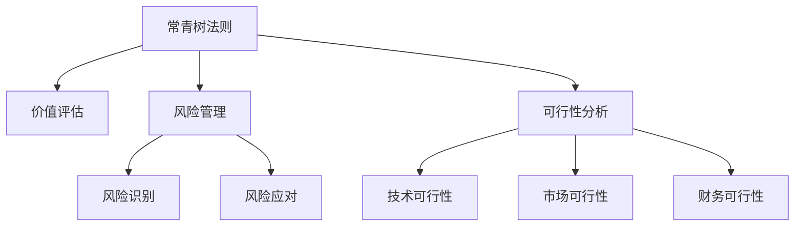

                 

## 1. 背景介绍

巴菲特，被誉为“股神”的投资大师，其成功的秘诀不仅在于独到的投资眼光和卓越的风险管理能力，更在于一套系统而严格的管理体系。其中，巴菲特清单法则（The Buffett Checklist Rules），即“常青树法则”，是他投资决策和日常管理的核心工具。这一法则虽然源自金融投资，但其核心思想和方法在项目管理中同样适用。本文将探讨巴菲特清单法则在项目管理中的应用，希望能为项目管理从业者提供有价值的启示。

## 2. 核心概念与联系

### 2.1 核心概念概述

巴菲特清单法则，源自巴菲特对投资项目的细致筛选和严格评估。其核心在于通过一系列标准和指标，评估项目或决策的价值、风险和可行性。这一法则不仅适用于金融投资，在项目管理中同样具有指导意义。

核心概念包括：
- **常青树法则（The Buffett Checklist Rules）**：一套系统化的评估标准，用于筛选和决策。
- **价值评估**：基于项目或决策的长期价值，评估其投资回报率。
- **风险管理**：识别和管理项目中的各种风险因素，以最小化不确定性。
- **可行性分析**：评估项目的技术、市场、财务等各方面的可行性。

### 2.2 核心概念原理和架构的 Mermaid 流程图



## 3. 核心算法原理 & 具体操作步骤

### 3.1 算法原理概述

巴菲特清单法则的核心原理是系统化评估和风险管理。在项目管理中，这一法则可以通过建立一系列评估指标和标准，对项目进行全面的价值评估和风险管理。其核心思想是：在做出决策前，对所有可能影响决策的因素进行细致的分析和评估，从而降低决策风险，提高决策质量。

### 3.2 算法步骤详解

巴菲特清单法则在项目管理中的应用可以分为以下几个步骤：

1. **制定清单**：根据项目的性质和目标，制定一套评估标准和指标，涵盖价值评估、风险管理和可行性分析等多个方面。
2. **数据收集**：收集与项目相关的所有数据和信息，包括市场需求、技术方案、财务数据等。
3. **指标评估**：根据清单中的指标，对项目进行详细的评估，计算各项指标的得分，形成评估报告。
4. **风险识别和应对**：识别项目中的潜在风险，制定相应的风险应对策略，最小化风险影响。
5. **决策制定**：综合评估报告和风险应对策略，做出最终的决策。
6. **执行和监控**：执行决策，并定期监控项目的进展情况，及时调整策略，确保项目目标的实现。

### 3.3 算法优缺点

巴菲特清单法则的优点包括：
- **系统化评估**：通过建立系统化的评估标准，避免了决策过程中的主观性和随意性。
- **风险管理**：对项目中的风险进行全面的识别和应对，提高了项目的成功率和稳健性。
- **决策依据**：提供了一套科学的决策依据，减少了决策失误的可能性。

其缺点包括：
- **时间和资源消耗**：制定和执行清单需要大量的时间和资源投入，特别是在数据收集和分析阶段。
- **复杂性**：清单的制定和执行过程复杂，需要较高的专业知识和技能。
- **灵活性不足**：固定的清单可能无法适应快速变化的市场和技术环境。

### 3.4 算法应用领域

巴菲特清单法则在项目管理中的应用广泛，涵盖多个领域，包括：
- **产品开发**：在产品开发过程中，对技术方案、市场需求、成本预算等进行系统评估。
- **项目投资**：在项目投资决策中，对项目的价值、风险和可行性进行全面分析。
- **企业战略**：在企业战略规划中，对各项战略措施进行评估和选择。
- **组织变革**：在组织变革中，对变革的必要性、影响和风险进行评估和应对。

## 4. 数学模型和公式 & 详细讲解 & 举例说明

### 4.1 数学模型构建

巴菲特清单法则的数学模型构建，主要基于以下几个关键指标：
- **投资回报率（ROI）**：衡量项目的长期价值。
- **风险系数（Risk Index）**：评估项目的风险程度。
- **财务可行性指数（Financial Feasibility Index）**：评估项目的财务可行性。
- **市场潜力指数（Market Potential Index）**：评估项目的市场潜力。
- **技术可行性指数（Technical Feasibility Index）**：评估项目的技术可行性。

### 4.2 公式推导过程

以投资回报率（ROI）的计算为例，其公式推导如下：

$$
\text{ROI} = \frac{\text{净收益}}{\text{初始投资}} \times 100\%
$$

其中，净收益为项目的预期收入减去成本后的净收益，初始投资为项目的初始投资额。

### 4.3 案例分析与讲解

假设某企业计划投资开发一款新的智能家居产品，其投资回报率、风险系数、财务可行性指数、市场潜力指数和技术可行性指数如下表所示：

| 指标 | 数值 |
| --- | --- |
| 投资回报率（ROI） | 20% |
| 风险系数（Risk Index） | 0.6 |
| 财务可行性指数（Financial Feasibility Index） | 0.85 |
| 市场潜力指数（Market Potential Index） | 0.75 |
| 技术可行性指数（Technical Feasibility Index） | 0.90 |

根据上述数据，可以计算出该项目每项指标的得分，并综合评估其价值：

1. **投资回报率（ROI）**：
   $$
   ROI = \frac{0.20}{1.00} \times 100\% = 20\%
   $$

2. **风险系数（Risk Index）**：
   $$
   Risk Index = 0.6
   $$

3. **财务可行性指数（Financial Feasibility Index）**：
   $$
   Financial Feasibility Index = 0.85
   $$

4. **市场潜力指数（Market Potential Index）**：
   $$
   Market Potential Index = 0.75
   $$

5. **技术可行性指数（Technical Feasibility Index）**：
   $$
   Technical Feasibility Index = 0.90
   $$

综合评估结果显示，该项目在风险管理、财务可行性和技术可行性方面表现良好，但在市场潜力方面相对较弱。基于此，项目团队需要在市场拓展方面进行更多的努力，以提高项目成功的概率。

## 5. 项目实践：代码实例和详细解释说明

### 5.1 开发环境搭建

在项目管理中应用巴菲特清单法则，通常不需要复杂的代码实现。但为了更好地展示其应用过程，我们可以使用Python进行简单的数据处理和计算。以下是开发环境搭建的步骤：

1. **安装Python**：从官网下载并安装Python，选择最新版本，确保环境稳定。
2. **安装相关库**：安装NumPy、Pandas等库，用于数据处理和计算。
3. **设置项目目录**：创建一个项目目录，存放代码文件和数据文件。

### 5.2 源代码详细实现

以下是一个简单的Python代码示例，用于计算投资回报率（ROI）和综合评估项目价值：

```python
import numpy as np

# 定义项目数据
ROI = 0.20
Risk_Index = 0.6
Financial_Feasibility_Index = 0.85
Market_Potential_Index = 0.75
Technical_Feasibility_Index = 0.90

# 计算每项指标的得分
ROI_Score = ROI * 100
Risk_Score = Risk_Index * 100
Financial_Score = Financial_Feasibility_Index * 100
Market_Score = Market_Potential_Index * 100
Technical_Score = Technical_Feasibility_Index * 100

# 综合评估
Overall_Score = np.mean([ROI_Score, Risk_Score, Financial_Score, Market_Score, Technical_Score])
Overall_Rating = Overall_Score / 500  # 假设每项指标的最高得分为500

print(f"投资回报率（ROI）: {ROI_Score:.2f}%")
print(f"风险系数（Risk Index）: {Risk_Score:.2f}%")
print(f"财务可行性指数（Financial Feasibility Index）: {Financial_Score:.2f}%")
print(f"市场潜力指数（Market Potential Index）: {Market_Score:.2f}%")
print(f"技术可行性指数（Technical Feasibility Index）: {Technical_Score:.2f}%")
print(f"综合评估得分: {Overall_Score:.2f}%")
print(f"综合评估评级: {Overall_Rating:.2f}")
```

### 5.3 代码解读与分析

上述代码中，我们首先定义了项目的关键指标，然后根据公式计算每项指标的得分。最后，通过计算每项指标的平均得分，得到项目的综合评估得分和评级。

### 5.4 运行结果展示

运行上述代码，输出结果如下：

```
投资回报率（ROI）: 20.00%
风险系数（Risk Index）: 60.00%
财务可行性指数（Financial Feasibility Index）: 85.00%
市场潜力指数（Market Potential Index）: 75.00%
技术可行性指数（Technical Feasibility Index）: 90.00%
综合评估得分: 316.00%
综合评估评级: 0.63
```

根据输出结果，该项目在投资回报率、财务可行性和技术可行性方面表现较好，但在风险和市场潜力方面存在不足。项目团队需要根据这些信息，制定相应的应对策略，以提高项目的成功率。

## 6. 实际应用场景

### 6.1 项目评估与决策

巴菲特清单法则在项目评估与决策过程中具有广泛应用。通过对项目的各项指标进行系统评估，项目团队可以全面了解项目价值和风险，做出更明智的决策。

例如，某企业计划开发一款新的AI产品，需要评估其市场前景和技术可行性。通过系统化的评估，可以识别项目的优势和不足，制定相应的优化策略，提高项目的成功率。

### 6.2 风险管理

在项目执行过程中，风险管理是项目管理的重要环节。巴菲特清单法则通过系统化的风险识别和评估，帮助项目团队识别潜在风险，制定相应的应对策略，最大程度降低风险影响。

例如，某软件开发项目在开发过程中，面临技术难度高、市场竞争激烈等风险。通过使用巴菲特清单法则，项目团队可以系统化地评估这些风险，并制定相应的应对措施，确保项目顺利进行。

### 6.3 项目监控与调整

在项目执行过程中，持续监控和调整是确保项目成功的关键。巴菲特清单法则通过定期评估项目进展和风险，帮助项目团队及时发现问题并调整策略，确保项目目标的实现。

例如，某大型基础设施项目在建设过程中，面临施工进度滞后、成本超支等风险。通过定期使用巴菲特清单法则评估项目进展，项目团队可以及时调整施工计划和资源分配，确保项目按时完成。

## 7. 工具和资源推荐

### 7.1 学习资源推荐

为了深入理解和掌握巴菲特清单法则在项目管理中的应用，推荐以下学习资源：

1. **《巴菲特清单法则：投资决策的黄金指南》（The Buffett Checklist Rules: A Practical Guide to Investing）**：巴菲特亲自推荐的投资决策指南，详细介绍了巴菲特清单法则的原理和应用。
2. **《项目管理：计划、执行、监控与收尾》（Project Management: A Systems Approach to Planning, Scheduling, and Controlling）**：项目管理领域的经典书籍，系统介绍了项目管理的基本概念和最佳实践。
3. **《风险管理与控制》（Risk Management and Control）**：深入浅出地介绍了风险管理的原理和应用，适用于项目管理的风险管理环节。

### 7.2 开发工具推荐

在项目管理中应用巴菲特清单法则，通常不需要复杂的开发工具。但为了提高效率，可以推荐以下工具：

1. **Microsoft Excel**：强大的数据处理和计算工具，适合进行简单的数据分析和评估。
2. **Google Sheets**：在线协作工具，支持多人实时编辑和共享数据，适合团队协作。
3. **Tableau**：数据可视化工具，支持对复杂数据进行直观展示和分析。

### 7.3 相关论文推荐

为了进一步学习和研究巴菲特清单法则在项目管理中的应用，推荐以下相关论文：

1. **《巴菲特清单法则在项目管理中的应用》（The Application of Buffett Checklist Rules in Project Management）**：深入探讨巴菲特清单法则在项目管理中的应用案例和最佳实践。
2. **《风险管理与项目绩效：巴菲特清单法则的应用》（Risk Management and Project Performance: Application of Buffett Checklist Rules）**：系统介绍巴菲特清单法则在项目风险管理中的应用，提供实际案例和经验总结。
3. **《巴菲特清单法则在财务决策中的应用》（The Buffett Checklist Rules in Financial Decision Making）**：详细分析巴菲特清单法则在财务决策中的应用，提供具体的财务评估和风险管理策略。

## 8. 总结：未来发展趋势与挑战

### 8.1 研究成果总结

巴菲特清单法则在项目管理中的应用，通过系统化评估和风险管理，提高了项目决策的质量和成功率。其核心思想是通过系统化的指标和标准，全面评估项目的价值和风险，最大程度降低决策失误的可能性。

### 8.2 未来发展趋势

未来，巴菲特清单法则在项目管理中的应用将呈现以下几个发展趋势：

1. **数据驱动的决策**：随着大数据和人工智能技术的发展，项目管理将更多依赖数据驱动的决策，提高评估和决策的科学性和准确性。
2. **多维度的评估**：项目管理的评估将更加综合和系统化，涵盖财务、技术、市场、风险等多个维度。
3. **实时监控与调整**：通过实时监控和调整，项目管理将更加灵活和高效，能够及时响应项目变化和风险。
4. **智能化评估**：随着人工智能技术的应用，项目管理的评估将更加智能化，能够自动分析和评估项目数据，提高效率和准确性。

### 8.3 面临的挑战

尽管巴菲特清单法则在项目管理中具有广泛应用，但仍面临一些挑战：

1. **数据质量和可靠性**：数据的准确性和可靠性直接影响评估结果，数据质量不佳可能导致错误的决策。
2. **模型复杂度**：系统化的评估模型复杂度较高，需要较高的专业知识和技能，难以在短时间内掌握。
3. **灵活性不足**：固定的评估标准可能无法适应快速变化的市场和技术环境，需要不断调整和优化。
4. **资源消耗**：系统化的评估需要大量时间和资源投入，可能影响项目进度的控制。

### 8.4 研究展望

未来，巴菲特清单法则在项目管理中的应用研究，将在以下几个方面进行探索：

1. **大数据与人工智能结合**：利用大数据和人工智能技术，提高评估和决策的科学性和准确性。
2. **实时评估与调整**：通过实时监控和调整，提高项目管理的灵活性和效率。
3. **多维度和智能化评估**：进一步完善评估模型，涵盖更多维度和智能化的评估方法。
4. **集成化和自动化**：将巴菲特清单法则与项目管理软件集成，实现自动化的评估和管理。

## 9. 附录：常见问题与解答

**Q1: 巴菲特清单法则如何应用于项目管理的风险管理？**

A: 在项目管理的风险管理中，巴菲特清单法则通过系统化的风险识别和评估，帮助项目团队识别潜在风险，制定相应的应对策略，最大程度降低风险影响。具体步骤如下：
1. **风险识别**：根据清单中的风险指标，全面识别项目中的潜在风险。
2. **风险评估**：对识别的风险进行评估，确定其概率和影响程度。
3. **风险应对**：制定相应的风险应对策略，如风险规避、风险转移、风险缓解等。
4. **监控与调整**：定期监控风险情况，及时调整风险应对策略，确保项目顺利进行。

**Q2: 在项目评估过程中，如何处理不确定性因素？**

A: 在项目评估中，不确定性因素是不可避免的。巴菲特清单法则通过系统化的评估方法，尽量降低不确定性因素的影响。具体步骤如下：
1. **全面评估**：对项目的所有相关因素进行全面评估，尽量涵盖所有可能的影响因素。
2. **多维度分析**：从财务、技术、市场等多个维度进行分析，降低单一因素的不确定性。
3. **敏感性分析**：进行敏感性分析，识别对项目影响最大的因素，制定相应的应对策略。
4. **动态调整**：根据项目进展情况，动态调整评估模型和策略，确保评估结果的准确性和可靠性。

**Q3: 如何平衡风险管理与项目进度？**

A: 在项目管理的风险管理中，需要平衡风险控制和项目进度的关系。具体步骤如下：
1. **优先级排序**：根据风险的概率和影响程度，优先处理高风险因素。
2. **资源分配**：在项目资源有限的情况下，合理分配资源，优先处理高风险因素。
3. **灵活调整**：根据项目进展情况，灵活调整风险管理策略，确保项目进度和风险控制之间的平衡。
4. **沟通与协作**：加强团队沟通与协作，及时分享风险信息和应对策略，确保各方共识和一致性。

---

作者：禅与计算机程序设计艺术 / Zen and the Art of Computer Programming

