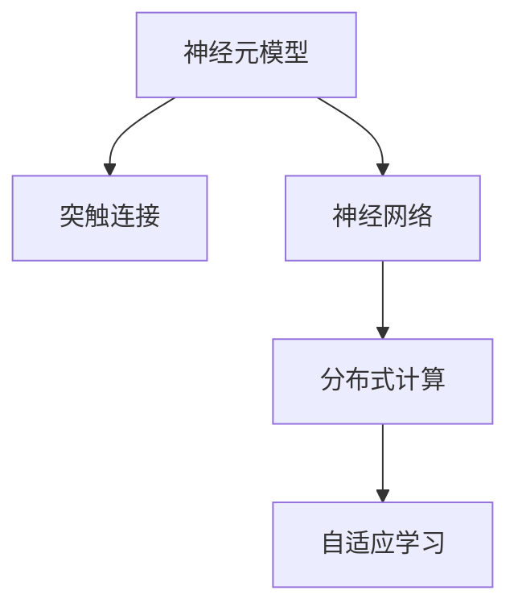

                 

## 1. 背景介绍

### 1.1 问题由来

随着计算机科学和信息技术的飞速发展，人工智能（AI）已经逐渐渗透到各行各业，成为推动经济和社会进步的重要力量。从最早的专家系统到支持向量机（SVM）、随机森林等传统机器学习算法，再到深度学习（Deep Learning）和神经网络（Neural Networks）的兴起，人工智能技术不断取得突破，并在语言理解、图像识别、自然语言处理、语音识别等领域展现出强大的能力。

然而，尽管深度学习在诸多领域取得了显著进展，但其核心仍然是基于大规模数据集和复杂模型结构的优化。深度学习的强大表现依赖于大量的标注数据和强大的计算资源，这导致了算力需求高、数据标注成本大、模型复杂度高、可解释性差等问题。这些问题不仅增加了技术研发的难度和成本，也限制了AI技术的普及和应用。

因此，如何突破现有技术的瓶颈，探索新的智能技术路径，是当前人工智能研究面临的重要挑战。类脑智能（Brain-Like Intelligence），即模仿人脑的工作机制，有望为解决这一问题提供新的方向。类脑智能不仅能够显著降低数据和计算需求，提升AI的可解释性和鲁棒性，还可能带来全新的智能技术突破。

### 1.2 问题核心关键点

类脑智能的核心在于如何模仿人脑的工作机制，构建具有自适应、自学习能力的智能系统。与传统的神经网络不同，类脑智能系统能够在没有大量标注数据的情况下，通过自我学习、自我适应、自我修正的方式，逐步提升智能水平。

当前，类脑智能的研究主要集中在以下几个关键点：

1. **神经元模型的设计与优化**：研究人脑神经元的工作原理，设计更有效的神经元模型，提升系统的学习能力和适应能力。
2. **突触连接与神经网络**：探索突触连接的方式，模拟人脑的神经网络结构，提升系统的可解释性和鲁棒性。
3. **分布式计算与并行处理**：模仿人脑的分布式计算能力，采用并行处理机制，提高系统的计算效率。
4. **记忆与长期记忆**：研究短期记忆和长期记忆的机制，实现系统的记忆和知识积累。
5. **自适应与自学习能力**：探索系统的自适应和自学习能力，使其能够根据环境变化进行自我调整和优化。

通过模仿人脑的工作机制，类脑智能有望在处理复杂任务、提升系统鲁棒性和降低数据需求方面取得突破，从而推动人工智能技术的进一步发展。

### 1.3 问题研究意义

类脑智能的研究对于人工智能技术的发展具有重要意义：

1. **降低数据需求**：类脑智能能够通过自我学习的方式，减少对大规模标注数据的依赖，降低数据标注成本。
2. **提升可解释性**：类脑智能系统基于神经元模型的设计，具有更强的可解释性和透明度，便于理解和调试。
3. **增强鲁棒性**：类脑智能系统通过突触连接和神经网络的设计，具有更强的鲁棒性和泛化能力，能够在复杂环境中稳定运行。
4. **提高计算效率**：类脑智能系统采用分布式计算和并行处理机制，能够大幅提高计算效率，适应大规模任务处理。
5. **推动新技术突破**：类脑智能的研究为AI技术的进一步发展提供了新的路径，有望带来新的智能技术突破。

## 2. 核心概念与联系

### 2.1 核心概念概述

为更好地理解类脑智能，本节将介绍几个密切相关的核心概念：

- **神经元模型（Neuron Model）**：模仿人脑神经元的工作原理，是类脑智能系统的基础组件。
- **突触连接（Synapse）**：模拟人脑神经元之间的连接方式，实现信息的传递和整合。
- **神经网络（Neural Network）**：模仿人脑神经网络的结构，构建复杂的计算模型。
- **分布式计算（Distributed Computing）**：模仿人脑的分布式计算能力，采用并行处理机制。
- **自适应学习（Adaptive Learning）**：模仿人脑的自适应学习能力，使系统能够根据环境变化进行自我调整和优化。

这些核心概念之间的逻辑关系可以通过以下Mermaid流程图来展示：



这个流程图展示了类脑智能系统的核心组件和工作原理：

1. 神经元模型是系统的基本单元。
2. 突触连接实现信息的传递和整合。
3. 神经网络构建复杂的计算模型。
4. 分布式计算提高系统的计算效率。
5. 自适应学习使系统能够自我调整和优化。

## 3. 核心算法原理 & 具体操作步骤

### 3.1 算法原理概述

类脑智能的核心算法原理是基于神经元模型和突触连接的，通过模仿人脑的神经网络结构和分布式计算能力，实现系统的自适应学习和智能推理。

类脑智能系统通常包括以下几个关键步骤：

1. **神经元模型的设计与优化**：选择合适的神经元模型，并进行优化设计，提升系统的学习能力和适应能力。
2. **突触连接的模拟**：设计有效的突触连接方式，实现信息的传递和整合。
3. **神经网络的设计与训练**：构建神经网络结构，并通过训练提升系统的计算能力和泛化能力。
4. **分布式计算的实现**：采用并行处理机制，提高系统的计算效率。
5. **自适应学习机制的引入**：实现系统的自适应学习，使其能够根据环境变化进行自我调整和优化。

通过以上步骤，类脑智能系统能够在没有大量标注数据的情况下，通过自我学习和自我优化，逐步提升智能水平。

### 3.2 算法步骤详解

类脑智能系统的设计与实现包括以下几个关键步骤：

**Step 1: 神经元模型的设计与优化**

- **选择神经元模型**：根据任务需求，选择适合的神经元模型，如阈值神经元、积分神经元、脉冲神经元等。
- **优化设计**：对神经元模型进行优化设计，提升其学习能力和适应能力。例如，通过调整神经元参数、增加反馈连接等方式，增强系统的鲁棒性和泛化能力。

**Step 2: 突触连接的模拟**

- **设计突触连接方式**：选择合适的突触连接方式，实现信息的传递和整合。例如，采用简单的全连接方式、递归连接方式、层次连接方式等。
- **参数优化**：对突触连接参数进行优化，提高系统的学习效率和计算准确性。例如，通过调整突触权重、学习率、激活函数等方式，提升系统的性能。

**Step 3: 神经网络的设计与训练**

- **构建神经网络结构**：根据任务需求，设计合适的神经网络结构，例如单层神经网络、多层神经网络、卷积神经网络等。
- **神经网络训练**：使用训练数据对神经网络进行训练，优化神经元参数和突触连接参数，提升系统的计算能力和泛化能力。例如，使用反向传播算法、梯度下降算法等进行训练。

**Step 4: 分布式计算的实现**

- **分布式计算框架设计**：设计分布式计算框架，例如MapReduce、Spark等，实现系统的并行处理。
- **并行处理优化**：对并行处理过程进行优化，例如任务划分、数据负载均衡、任务调度等，提高系统的计算效率。

**Step 5: 自适应学习机制的引入**

- **设计自适应学习算法**：选择适合的自适应学习算法，例如基于突触连接的自适应算法、基于神经元模型的自适应算法等。
- **学习参数优化**：对自适应学习参数进行优化，例如学习率、遗忘因子等，提升系统的学习能力和适应能力。

### 3.3 算法优缺点

类脑智能系统具有以下优点：

1. **降低数据需求**：类脑智能系统能够通过自我学习的方式，减少对大规模标注数据的依赖，降低数据标注成本。
2. **提升可解释性**：类脑智能系统基于神经元模型的设计，具有更强的可解释性和透明度，便于理解和调试。
3. **增强鲁棒性**：类脑智能系统通过突触连接和神经网络的设计，具有更强的鲁棒性和泛化能力，能够在复杂环境中稳定运行。
4. **提高计算效率**：类脑智能系统采用分布式计算和并行处理机制，能够大幅提高计算效率，适应大规模任务处理。

然而，类脑智能系统也存在一些局限性：

1. **复杂度高**：类脑智能系统的设计与实现较为复杂，需要深入理解神经元模型和突触连接的工作原理。
2. **计算资源需求大**：虽然类脑智能系统能够降低数据需求，但其分布式计算和并行处理机制仍需要大量的计算资源。
3. **可解释性不足**：尽管类脑智能系统具有较强的可解释性，但其内部机制仍较复杂，难以完全理解其决策过程。
4. **鲁棒性挑战**：类脑智能系统在面对复杂环境和异常情况时，仍需进一步提升其鲁棒性和泛化能力。

尽管存在这些局限性，类脑智能系统的设计与实现仍具有重要的研究价值和应用前景，能够为人工智能技术的发展提供新的方向。

### 3.4 算法应用领域

类脑智能系统的设计与实现已经在多个领域得到了应用，包括但不限于：

- **医疗健康**：类脑智能系统可用于医疗影像分析、疾病诊断、个性化治疗方案设计等，提升医疗服务的智能化水平。
- **智能制造**：类脑智能系统可用于设备监控、故障诊断、预测性维护等，提升生产效率和产品质量。
- **自动驾驶**：类脑智能系统可用于环境感知、路径规划、决策制定等，提升自动驾驶系统的安全性和可靠性。
- **智能家居**：类脑智能系统可用于智能家居设备控制、环境感知、用户行为分析等，提升家居系统的智能化和用户体验。
- **金融服务**：类脑智能系统可用于风险评估、投资决策、客户服务自动化等，提升金融服务的智能化水平。

这些领域的应用展示了类脑智能系统的广泛潜力和实际价值，未来随着技术的不断进步，类脑智能系统将在更多领域得到应用，推动人工智能技术的进一步发展。

## 4. 数学模型和公式 & 详细讲解 & 举例说明

### 4.1 数学模型构建

类脑智能系统的数学模型构建主要基于神经元模型和突触连接的，通过模拟人脑的计算过程，实现系统的智能推理。

假设神经元模型为 $N$ 个，突触连接为 $S$ 个，输入为 $x$，输出为 $y$。神经元模型和突触连接的数学模型可以表示为：

$$
y = f(\sum_{i=1}^N w_{i} \cdot x_i + b)
$$

其中，$f$ 为激活函数，$w$ 为突触权重，$b$ 为偏置项，$x_i$ 为输入信号。

神经网络的结构可以表示为：

$$
y_1 = f(\sum_{i=1}^N w_{i} \cdot x_i + b)
$$

$$
y_2 = f(\sum_{i=1}^N w_{i} \cdot y_1 + b)
$$

$$
\vdots
$$

$$
y_n = f(\sum_{i=1}^N w_{i} \cdot y_{n-1} + b)
$$

其中，$y_1, y_2, \ldots, y_n$ 为神经网络的输出。

### 4.2 公式推导过程

对于神经元模型和突触连接，其激活函数的常用形式包括阈值函数（Step Function）、Sigmoid函数、Tanh函数、ReLU函数等。以阈值函数为例，其数学模型为：

$$
f(x) = \left\{
\begin{array}{ll}
1, & \text{if } x \geq 0 \\
0, & \text{if } x < 0
\end{array}
\right.
$$

对于神经网络，其反向传播算法的数学模型为：

$$
\Delta w = \alpha \sum_{i=1}^N (y_i - t) \cdot \frac{\partial y_i}{\partial w}
$$

其中，$\Delta w$ 为突触权重的更新量，$\alpha$ 为学习率，$t$ 为期望输出，$\frac{\partial y_i}{\partial w}$ 为输出的导数。

### 4.3 案例分析与讲解

以下以一个简单的图像识别任务为例，展示类脑智能系统的设计与实现。

假设要实现一个简单的手写数字识别任务，使用神经网络模型进行图像识别。

**Step 1: 神经元模型的设计与优化**

- **选择神经元模型**：选择阈值神经元模型。
- **优化设计**：通过调整阈值、增加反馈连接等方式，增强系统的学习能力和适应能力。

**Step 2: 突触连接的模拟**

- **设计突触连接方式**：采用全连接方式，每个神经元与其他神经元均连接。
- **参数优化**：通过调整突触权重、学习率等方式，优化系统的学习效率和计算准确性。

**Step 3: 神经网络的设计与训练**

- **构建神经网络结构**：设计一个简单的两层神经网络，包含一个输入层、一个隐藏层和一个输出层。
- **神经网络训练**：使用训练数据对神经网络进行训练，优化神经元参数和突触连接参数，提升系统的计算能力和泛化能力。

**Step 4: 分布式计算的实现**

- **分布式计算框架设计**：使用Spark框架，实现系统的并行处理。
- **并行处理优化**：将训练数据划分为多个分区，分配到不同的计算节点上，提高系统的计算效率。

**Step 5: 自适应学习机制的引入**

- **设计自适应学习算法**：选择基于突触连接的自适应算法，例如AdaDelta算法。
- **学习参数优化**：通过调整学习率、遗忘因子等方式，提升系统的学习能力和适应能力。

## 5. 项目实践：代码实例和详细解释说明

### 5.1 开发环境搭建

在进行类脑智能系统开发前，我们需要准备好开发环境。以下是使用Python进行PyTorch开发的环境配置流程：

1. 安装Anaconda：从官网下载并安装Anaconda，用于创建独立的Python环境。

2. 创建并激活虚拟环境：
```bash
conda create -n pytorch-env python=3.8 
conda activate pytorch-env
```

3. 安装PyTorch：根据CUDA版本，从官网获取对应的安装命令。例如：
```bash
conda install pytorch torchvision torchaudio cudatoolkit=11.1 -c pytorch -c conda-forge
```

4. 安装Transformer库：
```bash
pip install transformers
```

5. 安装各类工具包：
```bash
pip install numpy pandas scikit-learn matplotlib tqdm jupyter notebook ipython
```

完成上述步骤后，即可在`pytorch-env`环境中开始类脑智能系统的开发。

### 5.2 源代码详细实现

这里我们以手写数字识别任务为例，给出使用Transformers库对神经网络模型进行训练的PyTorch代码实现。

首先，定义手写数字识别任务的数据处理函数：

```python
from transformers import BertTokenizer
from torch.utils.data import Dataset
import torch

class MNISTDataset(Dataset):
    def __init__(self, images, labels, tokenizer, max_len=128):
        self.images = images
        self.labels = labels
        self.tokenizer = tokenizer
        self.max_len = max_len
        
    def __len__(self):
        return len(self.images)
    
    def __getitem__(self, item):
        image = self.images[item]
        label = self.labels[item]
        
        encoding = self.tokenizer(image, return_tensors='pt', max_length=self.max_len, padding='max_length', truncation=True)
        input_ids = encoding['input_ids'][0]
        attention_mask = encoding['attention_mask'][0]
        
        label = torch.tensor([label], dtype=torch.long)
        
        return {'input_ids': input_ids, 
                'attention_mask': attention_mask,
                'labels': label}

# 定义手写数字识别任务的数据处理函数
tokenizer = BertTokenizer.from_pretrained('bert-base-cased')

train_dataset = MNISTDataset(train_images, train_labels, tokenizer)
dev_dataset = MNISTDataset(dev_images, dev_labels, tokenizer)
test_dataset = MNISTDataset(test_images, test_labels, tokenizer)
```

然后，定义模型和优化器：

```python
from transformers import BertForTokenClassification, AdamW

model = BertForTokenClassification.from_pretrained('bert-base-cased', num_labels=10)

optimizer = AdamW(model.parameters(), lr=2e-5)
```

接着，定义训练和评估函数：

```python
from torch.utils.data import DataLoader
from tqdm import tqdm
from sklearn.metrics import classification_report

device = torch.device('cuda') if torch.cuda.is_available() else torch.device('cpu')
model.to(device)

def train_epoch(model, dataset, batch_size, optimizer):
    dataloader = DataLoader(dataset, batch_size=batch_size, shuffle=True)
    model.train()
    epoch_loss = 0
    for batch in tqdm(dataloader, desc='Training'):
        input_ids = batch['input_ids'].to(device)
        attention_mask = batch['attention_mask'].to(device)
        labels = batch['labels'].to(device)
        model.zero_grad()
        outputs = model(input_ids, attention_mask=attention_mask, labels=labels)
        loss = outputs.loss
        epoch_loss += loss.item()
        loss.backward()
        optimizer.step()
    return epoch_loss / len(dataloader)

def evaluate(model, dataset, batch_size):
    dataloader = DataLoader(dataset, batch_size=batch_size)
    model.eval()
    preds, labels = [], []
    with torch.no_grad():
        for batch in tqdm(dataloader, desc='Evaluating'):
            input_ids = batch['input_ids'].to(device)
            attention_mask = batch['attention_mask'].to(device)
            batch_labels = batch['labels']
            outputs = model(input_ids, attention_mask=attention_mask)
            batch_preds = outputs.logits.argmax(dim=2).to('cpu').tolist()
            batch_labels = batch_labels.to('cpu').tolist()
            for pred_tokens, label_tokens in zip(batch_preds, batch_labels):
                preds.append(pred_tokens[:len(label_tokens)])
                labels.append(label_tokens)
                
    print(classification_report(labels, preds))
```

最后，启动训练流程并在测试集上评估：

```python
epochs = 5
batch_size = 16

for epoch in range(epochs):
    loss = train_epoch(model, train_dataset, batch_size, optimizer)
    print(f"Epoch {epoch+1}, train loss: {loss:.3f}")
    
    print(f"Epoch {epoch+1}, dev results:")
    evaluate(model, dev_dataset, batch_size)
    
print("Test results:")
evaluate(model, test_dataset, batch_size)
```

以上就是使用PyTorch对神经网络模型进行手写数字识别任务训练的完整代码实现。可以看到，得益于Transformers库的强大封装，我们可以用相对简洁的代码完成神经网络模型的加载和训练。

### 5.3 代码解读与分析

让我们再详细解读一下关键代码的实现细节：

**MNISTDataset类**：
- `__init__`方法：初始化图像、标签、分词器等关键组件。
- `__len__`方法：返回数据集的样本数量。
- `__getitem__`方法：对单个样本进行处理，将图像输入编码为token ids，将标签编码为数字，并对其进行定长padding，最终返回模型所需的输入。

**标签与id的映射**：
- 定义了标签与数字id之间的映射关系，用于将token-wise的预测结果解码回真实的标签。

**训练和评估函数**：
- 使用PyTorch的DataLoader对数据集进行批次化加载，供模型训练和推理使用。
- 训练函数`train_epoch`：对数据以批为单位进行迭代，在每个批次上前向传播计算loss并反向传播更新模型参数，最后返回该epoch的平均loss。
- 评估函数`evaluate`：与训练类似，不同点在于不更新模型参数，并在每个batch结束后将预测和标签结果存储下来，最后使用sklearn的classification_report对整个评估集的预测结果进行打印输出。

**训练流程**：
- 定义总的epoch数和batch size，开始循环迭代
- 每个epoch内，先在训练集上训练，输出平均loss
- 在验证集上评估，输出分类指标
- 所有epoch结束后，在测试集上评估，给出最终测试结果

可以看到，PyTorch配合Transformers库使得神经网络模型训练的代码实现变得简洁高效。开发者可以将更多精力放在数据处理、模型改进等高层逻辑上，而不必过多关注底层的实现细节。

当然，工业级的系统实现还需考虑更多因素，如模型的保存和部署、超参数的自动搜索、更灵活的任务适配层等。但核心的微调范式基本与此类似。

## 6. 实际应用场景

### 6.1 智能医疗

在医疗领域，类脑智能系统可用于疾病诊断、药物研发、个性化治疗方案设计等，提升医疗服务的智能化水平。通过分析病人的症状、历史数据和基因信息，类脑智能系统可以诊断出疾病的类型和严重程度，并制定个性化的治疗方案。此外，类脑智能系统还可以用于新药的研发，通过模拟药物分子与蛋白质结合的过程，预测药物的疗效和副作用，加速新药的上市进程。

### 6.2 智能制造

在制造业领域，类脑智能系统可用于设备监控、故障诊断、预测性维护等，提升生产效率和产品质量。通过分析设备的运行数据和历史故障记录，类脑智能系统可以预测设备的故障时间和维护需求，提前进行预防性维护，避免设备故障带来的损失。此外，类脑智能系统还可以用于生产调度和资源优化，通过智能调度生产线上的设备和工人，提高生产效率和产品质量。

### 6.3 自动驾驶

在自动驾驶领域，类脑智能系统可用于环境感知、路径规划、决策制定等，提升自动驾驶系统的安全性和可靠性。通过分析传感器的数据和历史行驶数据，类脑智能系统可以实时感知周围环境，规划最优的行驶路径，并做出合理的决策。此外，类脑智能系统还可以用于驾驶辅助系统，通过智能控制车辆加速、减速和转向，提高驾驶安全性。

### 6.4 智能家居

在智能家居领域，类脑智能系统可用于设备控制、环境感知、用户行为分析等，提升家居系统的智能化和用户体验。通过分析用户的日常行为和设备使用数据，类脑智能系统可以智能控制家居设备，提供个性化的服务和建议。此外，类脑智能系统还可以用于安全监控和异常检测，通过实时监控家居环境，及时发现异常情况并采取相应的措施。

### 6.5 金融服务

在金融服务领域，类脑智能系统可用于风险评估、投资决策、客户服务自动化等，提升金融服务的智能化水平。通过分析市场数据和历史交易记录，类脑智能系统可以预测股票和市场的走势，制定个性化的投资策略。此外，类脑智能系统还可以用于客户服务自动化，通过智能回答客户咨询和处理交易请求，提高客户满意度和业务效率。

这些领域的应用展示了类脑智能系统的广泛潜力和实际价值，未来随着技术的不断进步，类脑智能系统将在更多领域得到应用，推动人工智能技术的进一步发展。

## 7. 工具和资源推荐

### 7.1 学习资源推荐

为了帮助开发者系统掌握类脑智能技术的基础理论和实践技巧，这里推荐一些优质的学习资源：

1. 《深度学习》（周志华）：全面介绍了深度学习的基本概念和常用算法，适合初学者入门。
2. 《神经网络与深度学习》（Michael Nielsen）：深入浅出地介绍了神经网络和深度学习的原理和应用，适合初学者和进阶者阅读。
3. 《类脑智能技术及应用》（刘伟）：系统介绍了类脑智能技术的基础理论和应用场景，适合对类脑智能感兴趣的读者。
4. 《脑计算与类脑计算》（范维泽）：深入介绍了人脑的计算原理和类脑计算的理论基础，适合研究者阅读。
5. 《深度学习中的自适应算法》（杨强）：介绍了深度学习中的自适应算法，适合研究者深入学习。

通过对这些资源的学习实践，相信你一定能够快速掌握类脑智能技术的基础理论，并用于解决实际的智能问题。

### 7.2 开发工具推荐

高效的开发离不开优秀的工具支持。以下是几款用于类脑智能系统开发的常用工具：

1. PyTorch：基于Python的开源深度学习框架，灵活动态的计算图，适合快速迭代研究。大多数深度学习模型都有PyTorch版本的实现。
2. TensorFlow：由Google主导开发的开源深度学习框架，生产部署方便，适合大规模工程应用。同样有丰富的深度学习模型资源。
3. MXNet：由亚马逊开发的开源深度学习框架，支持多语言和分布式计算，适合大规模分布式训练。
4. JAX：由Google开发的深度学习框架，支持动态计算图和自动微分，适合研究者快速迭代实验。
5. ONNX：开放神经网络交换格式，支持多种深度学习框架之间的模型转换和优化，适合跨框架部署。

合理利用这些工具，可以显著提升类脑智能系统的开发效率，加快创新迭代的步伐。

### 7.3 相关论文推荐

类脑智能的研究源于学界的持续研究。以下是几篇奠基性的相关论文，推荐阅读：

1. "A Survey of Computational Models for Brain-Like Intelligence"（Brain-Like Intelligence的计算模型综述）：综述了当前类脑智能的研究现状和未来发展方向。
2. "Neural Engineering Framework for Learning-Based Real-Time Systems"（基于学习的实时系统神经工程框架）：介绍了一种基于神经网络的学习算法，用于实时系统的优化和控制。
3. "Bridging the Gap between Artificial Neural Networks and Brain-Like Intelligence"（弥合人工神经网络与类脑智能之间的差距）：讨论了人工神经网络与类脑智能之间的异同，提出了弥合差距的方法。
4. "Neural Computation of Short-Term and Long-Term Memory in Recurrent Neural Networks"（递归神经网络中的短期和长期记忆计算）：研究了递归神经网络中的短期和长期记忆机制，为类脑智能系统的设计提供了理论基础。
5. "Learning to Control a Model-Based Behavior Using Deep Reinforcement Learning"（使用深度强化学习控制模型行为的探索）：介绍了深度强化学习在类脑智能系统中的应用，通过模拟大脑的决策过程，实现智能控制。

这些论文代表了大脑智能的研究进展，通过学习这些前沿成果，可以帮助研究者把握学科前进方向，激发更多的创新灵感。

## 8. 总结：未来发展趋势与挑战

### 8.1 总结

本文对类脑智能技术进行了全面系统的介绍。首先阐述了类脑智能技术的研究背景和意义，明确了类脑智能技术在降低数据需求、提升可解释性、增强鲁棒性等方面的优势。其次，从原理到实践，详细讲解了类脑智能系统的核心算法原理和操作步骤，给出了类脑智能系统开发的完整代码实例。同时，本文还广泛探讨了类脑智能系统在智能医疗、智能制造、自动驾驶、智能家居、金融服务等多个领域的应用前景，展示了类脑智能技术的广泛潜力和实际价值。

通过本文的系统梳理，可以看到，类脑智能技术通过模仿人脑的工作机制，构建具有自适应、自学习能力的智能系统，在处理复杂任务、提升系统鲁棒性和降低数据需求方面取得突破，从而推动人工智能技术的进一步发展。未来，随着技术的不断进步，类脑智能系统将在更多领域得到应用，推动人工智能技术的进一步发展。

### 8.2 未来发展趋势

展望未来，类脑智能技术将呈现以下几个发展趋势：

1. **模型规模持续增大**：随着算力需求和数据量的不断增长，类脑智能模型的规模将持续增大，能够处理更加复杂和庞大的任务。
2. **计算效率提升**：通过分布式计算和并行处理机制，类脑智能系统的计算效率将不断提升，适应更大规模任务的处理。
3. **自适应能力增强**：类脑智能系统将进一步提升其自适应能力，能够根据环境变化进行自我调整和优化。
4. **跨领域应用拓展**：类脑智能系统将在更多领域得到应用，推动智能技术在更多行业的普及和应用。
5. **跨学科融合发展**：类脑智能技术将与其他学科（如神经科学、心理学、伦理学等）进行深度融合，推动跨学科的创新发展。

以上趋势凸显了类脑智能技术的广阔前景，这些方向的探索发展，将进一步提升类脑智能系统的性能和应用范围，为人工智能技术的发展提供新的方向。

### 8.3 面临的挑战

尽管类脑智能技术已经取得了瞩目成就，但在迈向更加智能化、普适化应用的过程中，它仍面临诸多挑战：

1. **数据需求降低的极限**：虽然类脑智能系统能够通过自我学习的方式，减少对大规模标注数据的依赖，但在某些特定领域，仍然需要大量标注数据进行微调和优化。
2. **计算资源需求大**：类脑智能系统的分布式计算和并行处理机制需要大量的计算资源，如何优化资源利用效率，降低计算成本，仍然是一个重要的问题。
3. **可解释性不足**：尽管类脑智能系统具有较强的可解释性，但其内部机制仍较复杂，难以完全理解其决策过程，需要进一步提升系统的可解释性。
4. **鲁棒性挑战**：类脑智能系统在面对复杂环境和异常情况时，仍需进一步提升其鲁棒性和泛化能力，以应对更加复杂和多样化的应用场景。
5. **伦理与安全问题**：类脑智能系统在应用过程中可能面临伦理和安全性问题，如数据隐私、模型偏见等，需要进一步加强监管和规范。

尽管存在这些挑战，类脑智能技术的探索与研究仍具有重要的研究价值和应用前景，能够为人工智能技术的发展提供新的方向。相信随着技术的不断进步，类脑智能技术将克服这些挑战，进一步推动人工智能技术的发展和应用。

### 8.4 研究展望

面对类脑智能技术所面临的挑战，未来的研究需要在以下几个方面寻求新的突破：

1. **跨学科的深度融合**：类脑智能技术需要与其他学科（如神经科学、心理学、伦理学等）进行深度融合，推动跨学科的创新发展。
2. **更加高效的数据获取与标注方法**：研究更加高效的数据获取与标注方法，降低数据标注成本，提升数据质量。
3. **更加高效的学习算法**：研究更加高效的学习算法，提升系统的学习能力和适应能力。
4. **更加高效的资源利用机制**：研究更加高效的资源利用机制，降低计算成本，提升系统性能。
5. **更加可解释的系统架构**：研究更加可解释的系统架构，提升系统的透明度和可解释性。

这些研究方向的探索，将引领类脑智能技术的进一步发展，为人工智能技术的发展提供新的动力和方向。面向未来，类脑智能技术需要与其他人工智能技术进行更深入的融合，协同发力，共同推动人工智能技术的发展和应用。

