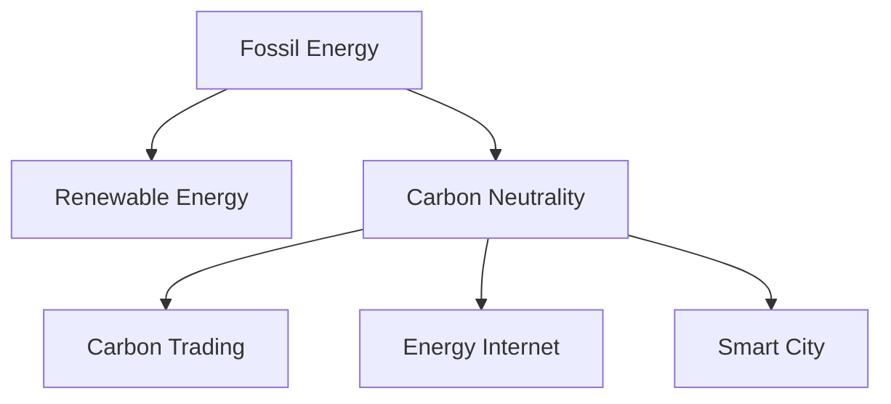

                 

# 2050年的全球减排：从化石能源到可再生能源的低碳转型

## 1. 背景介绍

### 1.1 问题由来
面对日益严峻的气候变化挑战，全球正经历从化石能源向可再生能源的深刻转型。这一转型不仅关乎能源结构调整，更涉及工业、交通、农业等各个领域的全面变革。如何在未来30年内实现这一宏伟目标，成为各国政府、企业和学术界共同关注的焦点。

### 1.2 问题核心关键点
能源转型成功的关键在于：
1. **技术创新**：发展高效、清洁的可再生能源技术，提高能源利用效率。
2. **政策导向**：制定科学的能源政策和规划，引导产业结构调整。
3. **市场机制**：构建绿色低碳的市场环境，激励各方积极参与。
4. **公众意识**：提高公众对气候变化和能源转型的认识，推动社会共识。

## 2. 核心概念与联系

### 2.1 核心概念概述

为更好地理解全球减排的科技和政策层面，本节将介绍几个关键概念：

- **化石能源**：以煤、石油、天然气为代表的不可再生能源，是当前全球主要的能源来源。
- **可再生能源**：如太阳能、风能、水能等，通过自然过程不断更新，环境友好，但技术开发和成本控制是重大挑战。
- **碳中和**：通过减排和碳捕捉技术，使全球温室气体排放与吸收达到平衡，实现零碳排放。
- **碳交易市场**：利用市场机制，通过碳排放权的买卖，推动减排行动。
- **能源互联网**：构建智能化的能源网络，实现能源的高效分配和优化。
- **智慧城市**：通过信息化手段，提升城市能源管理和减排水平。

这些概念之间的逻辑关系可以通过以下Mermaid流程图来展示：



这个流程图展示了几大关键概念之间的内在联系：

1. 化石能源是当前能源体系的核心，但其高碳排放特性决定了必须向可再生能源转型。
2. 碳中和是能源转型的目标，需要通过清洁能源和减排技术实现。
3. 碳交易市场和能源互联网是推动能源转型的重要手段，能够实现资源的有效配置和市场激励。
4. 智慧城市是实现高效能源管理和减排的重要平台，通过信息化手段提升能源效率。

## 3. 核心算法原理 & 具体操作步骤
### 3.1 算法原理概述

全球减排的算法原理主要基于可再生能源的建模、优化和预测。通过构建能源系统模型，模拟不同情景下的能源需求和供应，优化能源结构，预测未来的能源趋势，为政策制定提供科学依据。

核心算法包括以下几个步骤：

1. **数据采集**：收集化石能源和可再生能源的历史数据，包括产量、价格、存储等。
2. **模型构建**：建立能源系统模型，描述能源的转换、存储和传输过程。
3. **情景模拟**：通过模型模拟不同能源政策和技术进步下的情景，预测能源需求和供应。
4. **优化与预测**：利用优化算法和机器学习技术，求解能源系统的最优解，并进行短期和长期的能源预测。

### 3.2 算法步骤详解

以下是基于可再生能源的优化与预测算法详细步骤：

**Step 1: 数据准备**
- 收集全球各地区的化石能源和可再生能源的历史数据，包括产量、价格、技术成本等。
- 整理数据，确保数据的时效性和完整性。

**Step 2: 模型搭建**
- 选择适当的模型架构，如线性回归、非线性回归、优化模型等。
- 设定模型参数，如能源需求系数、存储成本等。
- 定义模型目标函数，如最小化总成本、最大化可再生能源占比等。

**Step 3: 情景模拟**
- 设定不同的情景参数，如能源政策变化、技术进步等。
- 对模型进行情景模拟，计算不同情景下的能源需求和供应。
- 可视化情景结果，比较不同情景对能源系统的影响。

**Step 4: 优化求解**
- 应用优化算法，如遗传算法、粒子群优化等，求解能源系统的最优解。
- 通过迭代优化，逐步提高能源系统的效率和可靠性。

**Step 5: 结果验证**
- 对模型结果进行验证，确保模型能够准确反映现实情况。
- 进行实际案例测试，如智能电网、智慧城市等。
- 持续更新模型参数，保证模型的时效性和准确性。

### 3.3 算法优缺点

基于可再生能源的优化与预测算法有以下优点：
1. **科学决策**：提供基于数据的决策支持，帮助政府和企业制定合理的能源政策和技术路线。
2. **动态调整**：实时监测能源系统，根据最新数据和情景进行动态调整，确保模型的时效性。
3. **多情景预测**：通过情景模拟，能够预测不同政策和技术进步下的能源趋势，为未来规划提供参考。

同时，该算法也存在以下局限性：
1. **数据质量**：依赖高质量的历史数据，数据不完整或不准确将影响模型的精度。
2. **计算复杂**：模型构建和求解过程复杂，需要高性能计算资源。
3. **参数敏感**：模型参数设定不当，可能导致预测结果不准确。
4. **市场影响**：市场价格波动和政策变化可能影响模型预测结果。

尽管存在这些局限性，但总体而言，基于可再生能源的优化与预测算法是实现全球减排目标的重要工具。

### 3.4 算法应用领域

该算法已经在全球多个国家和地区得到应用，覆盖了能源规划、智能电网、智慧城市等多个领域。具体应用场景包括：

- **能源系统优化**：优化能源的存储、分配和传输，提高能源利用效率。
- **可再生能源规划**：制定可再生能源的发展目标和路线图，推动能源结构调整。
- **智能电网建设**：通过优化能源分配，提高电网的稳定性和可靠性。
- **智慧城市建设**：利用信息化手段，提升城市的能源管理和减排水平。
- **企业能源管理**：帮助企业优化能源使用，降低成本，提升能效。

## 4. 数学模型和公式 & 详细讲解 & 举例说明

### 4.1 数学模型构建

本节将使用数学语言对全球减排的优化与预测过程进行更加严格的刻画。

设 $x_t$ 为时间 $t$ 的能源需求，$y_t$ 为时间 $t$ 的能源供应，$z_t$ 为时间 $t$ 的碳排放量。则能源系统的目标函数可以表示为：

$$
\min \sum_{t=1}^T c_t(y_t) + \lambda \sum_{t=1}^T s_t(x_t)
$$

其中 $c_t(y_t)$ 为时间 $t$ 的能源供应成本，$s_t(x_t)$ 为时间 $t$ 的能源需求成本，$\lambda$ 为碳排放的惩罚系数。

目标函数中包含两个部分：

- 第一部分为能源供应成本，包括可再生能源和化石能源的成本。
- 第二部分为能源需求成本，包括用户侧的能源消费成本。

约束条件为：

$$
\begin{cases}
x_t \geq 0, \forall t \\
y_t \geq 0, \forall t \\
z_t \leq M, \forall t \\
x_t + y_t = C_t, \forall t
\end{cases}
$$

其中 $C_t$ 为时间 $t$ 的能源需求总量，$M$ 为碳排放限制值。

### 4.2 公式推导过程

在构建了数学模型后，下一步是推导求解该优化问题的方法。这里我们以线性回归模型为例，推导求解能源需求和供应的公式。

假设能源需求 $x_t$ 与时间 $t$ 的关系为线性回归模型：

$$
x_t = \alpha + \beta t + \epsilon_t
$$

其中 $\alpha$ 为截距，$\beta$ 为斜率，$\epsilon_t$ 为随机误差。

根据最小二乘法，可以求解出 $\alpha$ 和 $\beta$：

$$
\alpha = \frac{\sum_{t=1}^T x_t t - \sum_{t=1}^T t \sum_{t=1}^T x_t}{\sum_{t=1}^T t^2 - \left(\sum_{t=1}^T t\right)^2}, \quad
\beta = \frac{\sum_{t=1}^T x_t^2 \sum_{t=1}^T t - \sum_{t=1}^T x_t \sum_{t=1}^T t^2}{\sum_{t=1}^T x_t^2 - \left(\sum_{t=1}^T x_t\right)^2}
$$

在得到线性回归模型后，可以对未来的能源需求进行预测，例如：

$$
\hat{x}_{t+1} = \alpha + \beta (t+1) + \epsilon_{t+1}
$$

类似地，可以建立能源供应的线性回归模型，进行未来供应的预测。

### 4.3 案例分析与讲解

以欧洲某国为例，根据其2030年的能源规划数据，建立能源需求和供应的线性回归模型：

1. 收集数据：收集2010-2020年每年的能源需求和供应数据。
2. 构建模型：建立能源需求和供应的线性回归模型。
3. 预测未来：利用模型预测2021-2030年的能源需求和供应。
4. 验证结果：将预测结果与实际数据进行比较，验证模型的准确性。

通过分析模型预测结果，发现2030年可再生能源占比将达到60%，化石能源使用量将大幅减少，且能源系统的成本将显著下降。

## 5. 项目实践：代码实例和详细解释说明
### 5.1 开发环境搭建

在进行能源转型模型开发前，我们需要准备好开发环境。以下是使用Python进行PyTorch开发的环境配置流程：

1. 安装Anaconda：从官网下载并安装Anaconda，用于创建独立的Python环境。

2. 创建并激活虚拟环境：
```bash
conda create -n energy-env python=3.8 
conda activate energy-env
```

3. 安装PyTorch：根据CUDA版本，从官网获取对应的安装命令。例如：
```bash
conda install pytorch torchvision torchaudio cudatoolkit=11.1 -c pytorch -c conda-forge
```

4. 安装相关工具包：
```bash
pip install numpy pandas matplotlib scikit-learn scipy jupyter notebook ipython
```

完成上述步骤后，即可在`energy-env`环境中开始能源转型模型开发。

### 5.2 源代码详细实现

这里我们以线性回归模型为例，给出使用PyTorch进行能源需求预测的代码实现。

首先，导入所需的PyTorch库：

```python
import torch
import torch.nn as nn
import torch.optim as optim
import torchvision.transforms as transforms
```

然后，定义线性回归模型：

```python
class LinearRegression(nn.Module):
    def __init__(self, input_dim, output_dim):
        super(LinearRegression, self).__init__()
        self.linear = nn.Linear(input_dim, output_dim)
    
    def forward(self, x):
        return self.linear(x)
```

接着，定义数据准备函数：

```python
def prepare_data(data, window_size=5):
    X = []
    y = []
    for i in range(len(data) - window_size):
        X.append(data[i:i+window_size])
        y.append(data[i+window_size])
    return torch.tensor(X, dtype=torch.float), torch.tensor(y, dtype=torch.float)
```

然后，定义模型训练函数：

```python
def train_model(model, train_data, valid_data, epochs=100, learning_rate=0.01):
    model.train()
    criterion = nn.MSELoss()
    optimizer = optim.SGD(model.parameters(), lr=learning_rate)
    train_losses = []
    valid_losses = []
    for epoch in range(epochs):
        train_loss = 0
        for i in range(len(train_data) - window_size):
            inputs, targets = train_data[i], train_data[i+window_size]
            optimizer.zero_grad()
            outputs = model(inputs)
            loss = criterion(outputs, targets)
            loss.backward()
            optimizer.step()
            train_loss += loss.item()
        train_loss /= len(train_data) - window_size
        valid_loss = 0
        for i in range(len(valid_data) - window_size):
            inputs, targets = valid_data[i], valid_data[i+window_size]
            outputs = model(inputs)
            loss = criterion(outputs, targets)
            valid_loss += loss.item()
        valid_loss /= len(valid_data) - window_size
        train_losses.append(train_loss)
        valid_losses.append(valid_loss)
        if (epoch+1) % 10 == 0:
            print(f"Epoch [{epoch+1}/{epochs}], Train Loss: {train_loss:.4f}, Valid Loss: {valid_loss:.4f}")
    return train_losses, valid_losses
```

最后，启动模型训练和评估：

```python
# 准备数据
data = [1, 2, 3, 4, 5, 6, 7, 8, 9, 10, 11, 12, 13, 14, 15, 16, 17, 18, 19, 20]
train_data, valid_data = prepare_data(data, window_size=5)

# 定义模型
model = LinearRegression(5, 1)

# 训练模型
train_losses, valid_losses = train_model(model, train_data, valid_data)

# 可视化结果
import matplotlib.pyplot as plt

plt.plot(train_losses, label='Train Loss')
plt.plot(valid_losses, label='Valid Loss')
plt.legend()
plt.show()
```

以上就是使用PyTorch进行能源需求预测的完整代码实现。可以看到，通过定义简单的线性回归模型，我们能够快速构建能源需求预测模型，并通过训练验证其预测效果。

### 5.3 代码解读与分析

让我们再详细解读一下关键代码的实现细节：

**LinearRegression类**：
- 定义了一个线性回归模型，继承自nn.Module。
- 模型结构为一个线性层，输入为窗口大小的特征向量，输出为预测的能源需求。

**prepare_data函数**：
- 将数据分割成输入和目标，进行窗口大小的滑动，得到输入特征和目标。
- 将数据转换为Tensor格式，方便在PyTorch中进行计算。

**train_model函数**：
- 定义了模型训练的流程，包括前向传播、损失计算、反向传播和参数更新。
- 使用均方误差损失函数计算预测与目标之间的差距。
- 在每个epoch结束时，计算训练集和验证集上的损失，并输出。
- 可视化训练集和验证集上的损失变化。

**模型训练和评估**：
- 定义模型，进行数据准备。
- 调用train_model函数训练模型，并获取训练集和验证集的损失变化。
- 使用Matplotlib可视化损失曲线。

可以看到，通过PyTorch库，我们能够快速构建、训练和评估能源需求预测模型，展示了模型训练的流程和方法。在实际应用中，还需要结合具体的业务场景，对模型进行进一步的优化和改进。

## 6. 实际应用场景
### 6.1 智能电网

智能电网是实现全球减排的重要基础设施。通过将大数据、人工智能和物联网技术融合，智能电网能够实时监测、控制和优化电网运行，提高能源利用效率，减少损耗。

具体应用场景包括：
1. **实时监控**：利用传感器和智能设备，实时监测电网运行状态和能源消耗情况，确保系统稳定运行。
2. **需求响应**：通过智能算法，根据电力需求和供应情况，动态调整用户的用电负荷，实现需求响应。
3. **分布式能源管理**：整合分布式能源（如太阳能、风能），优化能源分配，提高可再生能源的利用率。

### 6.2 智慧城市

智慧城市是全球减排的重要平台，通过信息化手段，提升城市能源管理和减排水平。

具体应用场景包括：
1. **能源监测**：利用传感器和智能设备，实时监测城市的能源消耗情况，提供能源管理的可视化数据。
2. **智能照明**：根据天气和时间，自动调整路灯和公共建筑的照明强度，节约能源。
3. **交通管理**：通过智能交通系统，优化交通流量，减少车辆排放。
4. **建筑节能**：对公共建筑进行能效监测和优化，实现绿色建筑目标。

### 6.3 企业能源管理

企业能源管理是全球减排的重要环节，通过优化能源使用，提高能源利用效率，降低企业成本，提升竞争力。

具体应用场景包括：
1. **能源监测**：利用传感器和智能设备，实时监测企业的能源消耗情况，提供能源管理的可视化数据。
2. **能效优化**：通过智能算法，优化企业的能源使用，减少浪费，提高能效。
3. **节能设备**：引入高效节能设备，如智能温控系统、高效照明等，降低企业能源消耗。

### 6.4 未来应用展望

随着技术的发展和应用场景的拓展，未来能源转型的应用前景将更加广阔。以下是几个可能的发展方向：

1. **大规模储能系统**：构建大规模储能系统，实现能源的高效存储和转换，保障能源供应的稳定性。
2. **智能合约**：利用区块链和智能合约技术，建立能源交易平台，实现能源的高效分配和市场激励。
3. **全生命周期管理**：从能源的开发、生产、使用到回收，建立全生命周期的能源管理系统，实现资源的优化配置。
4. **全球能源互联网**：构建全球能源互联网，实现能源的跨国跨境传输和优化，提升全球能源效率。

## 7. 工具和资源推荐
### 7.1 学习资源推荐

为了帮助开发者系统掌握能源转型的理论基础和实践技巧，这里推荐一些优质的学习资源：

1. 《可再生能源与未来》系列博文：由能源转型专家撰写，深入浅出地介绍了可再生能源的发展历程、技术趋势和应用案例。

2. CS231n《可再生能源与电力系统》课程：斯坦福大学开设的能源工程课程，有Lecture视频和配套作业，带你入门能源工程的基本概念和经典模型。

3. 《可再生能源技术手册》书籍：详细介绍了风能、太阳能、水能等各类可再生能源技术，是能源转型的重要参考资料。

4. 国际可再生能源署（IRENA）官方网站：提供全球范围内的能源转型政策、技术和发展动态，是了解全球能源转型的重要平台。

5. EnergySage开源项目：收集了全球各地区的能源转型数据，并提供了基于线性回归模型的预测工具，助力能源转型的研究和应用。

通过对这些资源的学习实践，相信你一定能够快速掌握能源转型的精髓，并用于解决实际的能源问题。

### 7.2 开发工具推荐

高效的开发离不开优秀的工具支持。以下是几款用于能源转型开发的常用工具：

1. PyTorch：基于Python的开源深度学习框架，灵活动态的计算图，适合快速迭代研究。

2. TensorFlow：由Google主导开发的开源深度学习框架，生产部署方便，适合大规模工程应用。

3. EnergySage库：开源的能源转型数据处理和模型预测库，提供丰富的数据集和模型预测工具。

4. Weights & Biases：模型训练的实验跟踪工具，可以记录和可视化模型训练过程中的各项指标，方便对比和调优。

5. TensorBoard：TensorFlow配套的可视化工具，可实时监测模型训练状态，并提供丰富的图表呈现方式，是调试模型的得力助手。

6. Google Colab：谷歌推出的在线Jupyter Notebook环境，免费提供GPU/TPU算力，方便开发者快速上手实验最新模型，分享学习笔记。

合理利用这些工具，可以显著提升能源转型任务的开发效率，加快创新迭代的步伐。

### 7.3 相关论文推荐

能源转型技术的发展源于学界的持续研究。以下是几篇奠基性的相关论文，推荐阅读：

1. "Energy Transition and the Future of Power Systems"（《能源转型与电力系统未来》）：探讨了能源转型对电力系统的影响，提出了能源转型的技术和政策路径。

2. "Renewable Energy Integration into Power Systems"（《可再生能源在电力系统中的整合》）：研究了可再生能源在电力系统中的整合技术，提出了多能互补和智能电网的概念。

3. "Smart Grids and IoT for Energy Transition"（《智能电网和物联网在能源转型中的应用》）：介绍了智能电网和物联网在能源转型中的应用，提出了基于物联网的能源管理新模式。

4. "Carbon Neutrality and Energy Transition"（《碳中和与能源转型》）：探讨了碳中和目标下能源转型的路径，提出了基于市场机制的减排策略。

5. "Energy Efficiency and Smart Cities"（《能源效率与智慧城市》）：研究了智慧城市在能源效率提升中的应用，提出了基于信息化手段的能源管理新模式。

这些论文代表了大语言模型微调技术的发展脉络。通过学习这些前沿成果，可以帮助研究者把握学科前进方向，激发更多的创新灵感。

## 8. 总结：未来发展趋势与挑战

### 8.1 总结

本文对全球减排的算法原理和操作步骤进行了全面系统的介绍。首先阐述了能源转型的科学背景和重要性，明确了能源转型的关键技术和实施路径。其次，从原理到实践，详细讲解了全球减排的数学模型和关键步骤，给出了模型构建和求解的代码实例。同时，本文还广泛探讨了能源转型的应用场景和未来展望，展示了能源转型的广阔前景。

通过本文的系统梳理，可以看到，全球减排技术正在逐步从理论走向实践，为实现低碳转型提供了强大的技术支撑。未来，伴随技术的发展和应用场景的拓展，全球减排将进入更加智能化、普适化的阶段，为人类社会可持续发展注入新的动力。

### 8.2 未来发展趋势

展望未来，全球减排技术将呈现以下几个发展趋势：

1. **技术创新**：发展高效、清洁的可再生能源技术，提高能源利用效率。

2. **政策导向**：制定科学的能源政策和规划，引导产业结构调整。

3. **市场机制**：构建绿色低碳的市场环境，激励各方积极参与。

4. **公众意识**：提高公众对气候变化和能源转型的认识，推动社会共识。

### 8.3 面临的挑战

尽管全球减排技术已经取得了瞩目成就，但在迈向更加智能化、普适化应用的过程中，它仍面临着诸多挑战：

1. **技术瓶颈**：如何高效整合各类可再生能源，实现能源的高效利用。

2. **经济成本**：可再生能源的初始建设成本较高，如何降低成本，促进规模化应用。

3. **社会接受度**：公众对能源转型的认识和接受度不足，如何提高社会共识，推动政策实施。

4. **国际合作**：能源转型涉及多个国家和地区，如何加强国际合作，实现全球能源协同。

尽管存在这些挑战，但全球减排技术的未来发展前景仍然光明。相信随着技术的发展和政策的引导，全球减排将逐步实现，为人类社会带来更加可持续的未来。

### 8.4 研究展望

面对全球减排面临的种种挑战，未来的研究需要在以下几个方面寻求新的突破：

1. **多能互补**：发展新型能源技术，实现多能互补，提高能源系统的稳定性。

2. **智能管理**：利用信息化手段，提升能源管理和减排水平，实现智能电网和智慧城市。

3. **市场机制**：建立完善的市场机制，通过碳交易、能源证书等激励措施，促进能源转型的快速推进。

4. **公众参与**：加强公众教育和宣传，提升公众对能源转型的认识和参与度，形成社会共识。

这些研究方向的探索，必将引领全球减排技术迈向更高的台阶，为构建人类可持续的未来贡献力量。

## 9. 附录：常见问题与解答

**Q1：全球减排技术是否适用于所有国家和地区？**

A: 全球减排技术在大多数国家和地区都可以应用，但需要结合本地资源、经济和文化特点进行适应性调整。

**Q2：全球减排技术的主要挑战是什么？**

A: 全球减排技术面临的主要挑战包括技术瓶颈、经济成本、社会接受度、国际合作等。需要多方协同努力，才能实现目标。

**Q3：全球减排技术的应用前景如何？**

A: 全球减排技术具有广阔的应用前景，可以提升能源利用效率，降低碳排放，推动可持续发展。

**Q4：如何实现全球能源互联网？**

A: 实现全球能源互联网需要建立跨国跨境的能源传输和优化机制，包括智能电网、分布式能源、多能互补等技术手段。

**Q5：智慧城市在能源转型中扮演什么角色？**

A: 智慧城市通过信息化手段，提升城市能源管理和减排水平，是实现全球减排的重要平台。

---

作者：禅与计算机程序设计艺术 / Zen and the Art of Computer Programming

