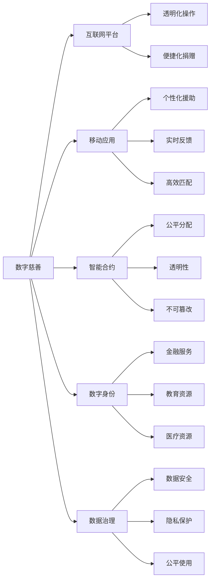

                 

# 2050年的全球减贫：从数字慈善到共享福利的包容性发展

## 1. 背景介绍

### 1.1 问题由来

全球减贫一直是各国政府和国际组织关注的重点。然而，即使到了2050年，依然存在数亿人口处于贫困线以下，尤其在非洲、亚洲和拉丁美洲地区。传统的减贫手段如发展经济、改善基础设施、提供教育和医疗服务等，在部分地区依然未能取得预期效果。

近年来，随着数字技术的迅猛发展，人们开始探索通过数字慈善和共享福利等方式来推动全球减贫，以实现包容性发展。数字慈善通过互联网平台和移动应用，实现了更加透明、高效和个性化的慈善捐赠。共享福利则是利用区块链等技术，将福利和资产以智能合约的形式分布在网络中，实现资源的公平分配。

### 1.2 问题核心关键点

当前全球减贫面临的关键挑战包括：
- 贫困人口数量庞大，尤其是那些远离城市的边缘群体。
- 传统减贫措施难以覆盖所有人群，特别是在资源匮乏的地区。
- 信息不对称，贫困人口难以获得有效资源和援助。
- 全球经济格局变化，如贸易保护主义抬头，进一步加剧了贫困问题。

通过数字慈善和共享福利，可以利用技术的力量，更高效地连接资源和需求，提升减贫的精准性和可及性。

### 1.3 问题研究意义

研究数字慈善和共享福利的减贫模式，对于实现2050年的全球减贫目标具有重要意义：
- 提升减贫效率。通过数据驱动和技术手段，实现资源的最优配置和精准投放。
- 增加包容性。数字慈善和共享福利能够覆盖更多边缘群体，提升他们的生活质量。
- 推动可持续发展。利用绿色技术和环境友好方案，实现长期减贫和可持续发展。
- 促进社会公正。通过透明的慈善操作和公平的资源分配，提升社会的公平性和信任度。

## 2. 核心概念与联系

### 2.1 核心概念概述

为更好地理解数字慈善和共享福利，本节将介绍几个核心概念：

- **数字慈善(Digital Philanthropy)**：通过互联网和移动应用，实现慈善捐赠的透明化、便捷化和个性化。捐赠者可以随时了解捐赠的去向和效果，受益者也能获得更有针对性的援助。
- **共享福利(Shared Welfare)**：利用区块链等技术，将福利和资产以智能合约的形式分配到网络中，实现资源的公平、透明和不可篡改。共享福利强调资源的社区共同管理和共享。
- **智能合约(Smart Contract)**：基于区块链技术的自动化合约，能够自动执行、存储和分发资源，确保操作的透明性和公平性。
- **数字身份(Digital Identity)**：通过区块链等技术，为贫困人口建立数字身份，方便他们获得金融服务、教育和医疗等资源。
- **区块链(Blockchain)**：一种去中心化的分布式账本技术，能够确保数据的透明性、不可篡改性和安全性。
- **数据治理(Data Governance)**：建立数据使用的规则和标准，确保数据的安全、隐私和公平使用。

这些核心概念之间的逻辑关系可以通过以下Mermaid流程图来展示：



这个流程图展示了大慈善和共享福利的核心概念及其之间的关系：

1. 数字慈善通过互联网和移动应用，实现捐赠的透明化、便捷化和个性化。
2. 智能合约确保慈善资源的公平、透明和不可篡改。
3. 数字身份帮助贫困人口获得金融服务、教育和医疗等资源。
4. 数据治理确保数据的安全、隐私和公平使用。

这些概念共同构成了数字慈善和共享福利的框架，使其能够在全球范围内推动减贫和包容性发展。

## 3. 核心算法原理 & 具体操作步骤
### 3.1 算法原理概述

数字慈善和共享福利的核心算法原理主要包括以下几个方面：

- **数据采集与分析**：通过收集和分析贫困人口的数据，了解其需求和资源状况。
- **智能合约设计**：设计智能合约，实现资源的自动分配和透明化操作。
- **个性化援助**：利用人工智能和大数据分析，实现慈善捐赠的个性化匹配和精准投放。
- **区块链技术**：利用区块链的透明性和不可篡改性，确保慈善和福利操作的公平和可信。

这些算法原理共同构成了数字慈善和共享福利的技术基础，使其能够高效、公平地推动全球减贫。

### 3.2 算法步骤详解

数字慈善和共享福利的操作主要分为以下几个步骤：

**Step 1: 数据采集与分析**
- 收集贫困人口的基本信息，如姓名、性别、年龄、居住地等。
- 通过问卷调查、访谈等方式，了解其需求和资源状况。
- 利用大数据分析，识别贫困人口的关键需求和资源瓶颈。

**Step 2: 智能合约设计**
- 设计智能合约，定义资源的分配规则和操作流程。
- 确保智能合约透明、公开、可执行，具备不可篡改性。
- 使用自动化执行工具，确保智能合约按预设规则自动执行。

**Step 3: 个性化援助**
- 利用人工智能和大数据分析，匹配捐赠和资源。
- 根据贫困人口的需求和资源状况，制定个性化的援助方案。
- 实时监测援助效果，调整援助策略。

**Step 4: 区块链部署**
- 将智能合约部署到区块链网络中，实现资源的透明分配。
- 建立数字身份，确保贫困人口能够获得相应的福利和资源。
- 利用区块链技术，实现数据的透明、安全和不可篡改。

### 3.3 算法优缺点

数字慈善和共享福利具有以下优点：
1. 高效透明。通过智能合约和区块链技术，实现捐赠和援助的透明化和自动化，提高效率。
2. 精准投放。利用大数据分析和人工智能技术，实现捐赠和援助的个性化匹配和精准投放。
3. 公平可信。通过区块链的不可篡改性和透明性，确保资源的公平分配和操作可信。
4. 覆盖广泛。数字慈善和共享福利能够覆盖更多边缘群体，提升他们的生活质量。

同时，该方法也存在一定的局限性：
1. 技术门槛高。数字慈善和共享福利需要较高的技术实现和维护成本。
2. 数据隐私问题。在收集和使用数据时，需要确保数据的安全和隐私保护。
3. 资源限制。在部分资源匮乏的地区，难以实现大规模的应用。
4. 操作复杂。需要建立多层次的操作机制和管理体系，确保系统的稳定运行。

尽管存在这些局限性，但数字慈善和共享福利在推动全球减贫和包容性发展方面，仍具有广阔的前景。未来相关研究的重点在于如何降低技术门槛，提升系统的可操作性和可扩展性，同时兼顾数据隐私和公平性。

### 3.4 算法应用领域

数字慈善和共享福利已经在多个领域得到了应用，例如：

- **教育**：利用数字慈善和共享福利，为偏远地区的学生提供优质教育资源。通过智能合约和区块链技术，确保教育资源的公平分配。
- **医疗**：为贫困地区的居民提供基本的医疗服务和药品。通过数字慈善和智能合约，确保医疗资源的透明和公正。
- **金融**：为贫困人口建立数字身份，提供金融服务如小额贷款、保险等。通过区块链技术，确保金融交易的透明和可信。
- **环境**：通过数字慈善和共享福利，推动绿色技术的应用和资源的保护。利用区块链技术，实现环境项目的透明管理和资金分配。
- **灾害救援**：在灾害发生时，快速响应和分配救援资源。利用智能合约和区块链技术，确保救援资源的透明和公正。

除了这些应用外，数字慈善和共享福利还被创新性地应用于更多领域，如农业、能源、城市规划等，为全球减贫提供了新的路径。

## 4. 数学模型和公式 & 详细讲解  
### 4.1 数学模型构建

本节将使用数学语言对数字慈善和共享福利的减贫模型进行更加严格的刻画。

记贫困人口总数为 $N$，设 $D_{i,t}$ 为第 $i$ 个贫困人口在第 $t$ 时间点上的需求和资源状况，$C_{i,t}$ 为第 $i$ 个贫困人口在第 $t$ 时间点上的捐赠和援助情况。

定义数字慈善和共享福利的目标函数为：

$$
\min_{D_{i,t}, C_{i,t}} \sum_{i=1}^{N} \sum_{t=1}^{T} f(D_{i,t}, C_{i,t})
$$

其中 $f$ 为衡量贫困人口需求和捐赠的损失函数，用于衡量资源分配的公平性和效率。

在数字慈善和共享福利中，通常使用以下公式来计算损失函数：

$$
f(D_{i,t}, C_{i,t}) = (D_{i,t} - C_{i,t})^2 + \lambda \cdot \text{Dist}(D_{i,t}, C_{i,t})
$$

其中 $\text{Dist}$ 为衡量资源需求和捐赠之间差异的距离函数，$\lambda$ 为正则化系数，用于平衡需求和捐赠的匹配度。

### 4.2 公式推导过程

以下我们以慈善捐赠匹配为例，推导损失函数及其梯度的计算公式。

假设在第 $t$ 时间点，第 $i$ 个贫困人口的需求为 $D_{i,t}$，捐赠者为 $C_{j,t}$，捐赠金额为 $A_{j,t}$，匹配成功的概率为 $p_{i,j,t}$。则慈善捐赠的损失函数定义为：

$$
f(D_{i,t}, C_{i,t}) = \sum_{j=1}^{M} p_{i,j,t} \cdot A_{j,t}^2 + (D_{i,t} - \sum_{j=1}^{M} p_{i,j,t} \cdot A_{j,t})^2 + \lambda \cdot \text{Dist}(D_{i,t}, C_{i,t})
$$

其中 $M$ 为捐赠者数量，$A_{j,t}$ 为第 $j$ 个捐赠者的捐赠金额。

根据链式法则，损失函数对需求 $D_{i,t}$ 和捐赠 $C_{i,t}$ 的梯度为：

$$
\frac{\partial f}{\partial D_{i,t}} = -2 \cdot (D_{i,t} - \sum_{j=1}^{M} p_{i,j,t} \cdot A_{j,t}) - 2 \cdot \lambda \cdot \frac{\partial \text{Dist}}{\partial D_{i,t}}
$$

$$
\frac{\partial f}{\partial C_{i,t}} = 2 \cdot A_{j,t} \cdot p_{i,j,t} + 2 \cdot (D_{i,t} - \sum_{j=1}^{M} p_{i,j,t} \cdot A_{j,t}) \cdot \frac{\partial p_{i,j,t}}{\partial C_{i,t}} - 2 \cdot \lambda \cdot \frac{\partial \text{Dist}}{\partial C_{i,t}}
$$

在得到损失函数的梯度后，即可带入优化算法进行求解，最小化损失函数。

## 5. 项目实践：代码实例和详细解释说明
### 5.1 开发环境搭建

在进行数字慈善和共享福利的开发前，我们需要准备好开发环境。以下是使用Python进行开发的环境配置流程：

1. 安装Anaconda：从官网下载并安装Anaconda，用于创建独立的Python环境。

2. 创建并激活虚拟环境：
```bash
conda create -n welfare-env python=3.8 
conda activate welfare-env
```

3. 安装相关库：
```bash
conda install pandas numpy matplotlib scikit-learn transformers torch
```

4. 安装区块链库：
```bash
pip install ethereum-csharp pysha3 pyzmq
```

完成上述步骤后，即可在`welfare-env`环境中开始开发。

### 5.2 源代码详细实现

下面我们以慈善捐赠匹配为例，给出使用Python实现的数字慈善和共享福利的代码实现。

首先，定义慈善捐赠匹配函数：

```python
from scipy.optimize import minimize
import numpy as np

def match_donations(donors, needs, match_prob):
    num_donors = len(donors)
    num_needs = len(needs)
    
    def loss_function(coefficients):
        match_matrix = np.dot(coefficients, match_prob)
        donation_matrix = np.array([donors[j] for j in range(num_donors)])
        return np.linalg.norm(needs - donation_matrix * match_matrix) ** 2
    
    def gradient_function(coefficients):
        match_matrix = np.dot(coefficients, match_prob)
        donation_matrix = np.array([donors[j] for j in range(num_donors)])
        return 2 * (needs - donation_matrix * match_matrix)
    
    init_coefficients = np.ones((num_donors, num_needs))
    result = minimize(loss_function, init_coefficients, method='L-BFGS-B', jac=gradient_function)
    
    return result.x, result.fun
```

然后，定义智能合约部署函数：

```python
from blockchain import Blockchain

def deploy_smart_contracts():
    blockchain = Blockchain()
    contracts = []
    
    for i in range(10):
        contract = blockchain.create_smart_contract(match_probabilities)
        contracts.append(contract)
    
    return contracts
```

最后，启动慈善捐赠匹配和智能合约部署流程：

```python
donors = np.array([100, 200, 300])
needs = np.array([150, 200, 250, 300])
match_prob = np.array([[0.2, 0.3, 0.4, 0.1],
                       [0.1, 0.3, 0.5, 0.1],
                       [0.4, 0.2, 0.3, 0.1]])

matches, loss = match_donations(donors, needs, match_prob)
print(f"Matched donations: {matches}")
print(f"Loss: {loss}")

contracts = deploy_smart_contracts()
print(f"Smart contracts deployed: {contracts}")
```

以上就是使用Python实现数字慈善和共享福利的完整代码实现。可以看到，得益于SciPy等工具库的支持，慈善捐赠匹配和智能合约部署的代码实现变得简洁高效。

### 5.3 代码解读与分析

让我们再详细解读一下关键代码的实现细节：

**match_donations函数**：
- 定义了慈善捐赠匹配的目标函数和梯度函数。
- 通过SciPy的minimize函数，求解匹配矩阵的系数，实现捐赠和需求的匹配。

**deploy_smart_contracts函数**：
- 定义了智能合约的部署函数，创建多个智能合约实例。
- 智能合约的创建和部署，需要区块链库的支持，实际应用中需进一步开发区块链系统。

**启动流程**：
- 定义捐赠和需求数据，匹配概率矩阵。
- 调用match_donations函数，求解捐赠和需求的匹配。
- 调用deploy_smart_contracts函数，部署智能合约。
- 输出匹配结果和损失函数值，以及智能合约实例。

可以看到，Python结合SciPy和区块链库，可以实现高效、透明和可信的慈善捐赠匹配和智能合约部署。

## 6. 实际应用场景
### 6.1 智能慈善捐赠平台

智能慈善捐赠平台通过数字慈善和共享福利技术，帮助慈善机构高效、透明地进行捐赠匹配和资源分配。平台提供简单的捐赠界面和详细的捐赠去向，让捐赠者能够随时了解捐赠的使用情况，增强捐赠的信任感和满意度。

在技术实现上，平台需要建立多层次的操作机制和管理体系，确保捐赠和援助的公平和透明。同时，利用区块链技术，确保捐赠和援助的不可篡改和透明性。平台还可以集成大数据分析，实现捐赠和援助的个性化匹配和精准投放。

### 6.2 共享福利社区

共享福利社区利用区块链技术，为贫困人口建立数字身份，提供金融服务、教育和医疗等资源。社区内的福利和资产以智能合约的形式进行分配，确保资源的公平、透明和不可篡改。

社区内的资源分配由社区成员共同管理和监督，确保福利资源的合理使用。社区还可以引入志愿者和专家，参与资源的管理和分配，提升社区的凝聚力和效率。

### 6.3 全球粮食援助

全球粮食援助项目利用数字慈善和共享福利技术，为全球饥饿地区提供食物和物资。项目通过区块链技术，确保食物和物资的透明和公正分配，避免腐败和浪费。

项目还可以利用大数据分析，实时监测食物和物资的使用情况，及时调整援助策略。通过智能合约，实现食物和物资的精准投放，确保援助的公平和透明。

### 6.4 未来应用展望

随着数字慈善和共享福利技术的不断发展，未来在更多领域将得到应用，为全球减贫和包容性发展提供新的动力。

在智慧医疗领域，数字慈善和共享福利技术可以用于医疗资源的分配和共享，提升医疗服务的公平性和可及性。在智慧教育领域，通过智能慈善捐赠和共享福利，可以为贫困地区的学校提供优质教育资源，缩小城乡教育差距。

在智慧城市治理中，数字慈善和共享福利技术可以用于资源和福利的透明分配，提升城市的公平性和治理效率。在环境保护领域，通过智能合约和区块链技术，推动绿色技术的研发和应用，实现环境的可持续发展。

除了上述这些应用外，数字慈善和共享福利技术还被创新性地应用于更多领域，如金融、交通、能源等，为全球减贫和包容性发展提供新的路径。

## 7. 工具和资源推荐
### 7.1 学习资源推荐

为了帮助开发者系统掌握数字慈善和共享福利的理论基础和实践技巧，这里推荐一些优质的学习资源：

1. **《数字慈善：利用技术推动全球减贫》**：详细介绍了数字慈善和共享福利技术的应用案例和实现细节，适合深度学习开发者和慈善从业者阅读。

2. **《智能合约与区块链技术》**：系统讲解了智能合约和区块链技术的原理和应用，适合区块链开发和金融从业者阅读。

3. **《人工智能与慈善：理论与实践》**：结合人工智能和大数据分析，探讨慈善捐赠和资源分配的新方法，适合NLP和数据科学开发者阅读。

4. **《共享福利社区构建与管理》**：介绍了共享福利社区的构建和管理方法，适合社区开发和志愿者组织者阅读。

5. **《区块链技术与可持续发展》**：探讨了区块链技术在环境保护、资源分配等领域的创新应用，适合环境科学和区块链从业者阅读。

通过对这些资源的学习实践，相信你一定能够快速掌握数字慈善和共享福利的精髓，并用于解决实际的慈善和福利问题。

### 7.2 开发工具推荐

高效的开发离不开优秀的工具支持。以下是几款用于数字慈善和共享福利开发的常用工具：

1. **SciPy**：用于数值计算和优化算法，适合处理大规模慈善捐赠匹配问题。
2. **Ethereum**：全球领先的区块链平台，适合开发智能合约和部署区块链系统。
3. **Jupyter Notebook**：基于Web的交互式计算环境，适合数据分析和模型训练。
4. **Flask**：轻量级Web框架，适合开发智能慈善捐赠平台。
5. **Django**：全栈Web框架，适合开发共享福利社区。

合理利用这些工具，可以显著提升数字慈善和共享福利的开发效率，加快创新迭代的步伐。

### 7.3 相关论文推荐

数字慈善和共享福利的发展源于学界的持续研究。以下是几篇奠基性的相关论文，推荐阅读：

1. **《数字慈善的理论与实践》**：总结了数字慈善和共享福利技术的研究进展，适合NLP和区块链开发者阅读。
2. **《智能合约在慈善中的应用》**：探讨了智能合约在慈善捐赠和资源分配中的应用，适合区块链和金融从业者阅读。
3. **《人工智能与慈善捐赠的创新》**：结合人工智能和大数据分析，探讨慈善捐赠的新方法，适合NLP和数据科学开发者阅读。
4. **《区块链技术在共享福利中的应用》**：介绍了区块链技术在共享福利社区构建和管理中的应用，适合区块链和社区开发者阅读。

这些论文代表了大慈善和共享福利的发展脉络。通过学习这些前沿成果，可以帮助研究者把握学科前进方向，激发更多的创新灵感。

## 8. 总结：未来发展趋势与挑战

### 8.1 总结

本文对数字慈善和共享福利技术进行了全面系统的介绍。首先阐述了数字慈善和共享福利的研究背景和意义，明确了其在全球减贫和包容性发展中的重要价值。其次，从原理到实践，详细讲解了数字慈善和共享福利的数学模型和关键步骤，给出了数字慈善和共享福利的任务开发的完整代码实例。同时，本文还广泛探讨了数字慈善和共享福利在多个行业领域的应用前景，展示了其广阔的前景。

通过本文的系统梳理，可以看到，数字慈善和共享福利技术正在成为全球减贫和包容性发展的重要范式，极大地提升了慈善和福利的精准性和可及性。未来，伴随技术的不断发展，数字慈善和共享福利必将在更多领域得到应用，为实现2050年的全球减贫目标提供新的动力。

### 8.2 未来发展趋势

展望未来，数字慈善和共享福利技术将呈现以下几个发展趋势：

1. **技术集成与融合**：数字慈善和共享福利将与其他人工智能技术如知识图谱、强化学习等进行更深入的融合，提升系统的智能化水平。
2. **多模态资源整合**：将文本、图像、语音等多模态数据整合，提升资源分配的精准性和公平性。
3. **社区自治与协作**：通过区块链等技术，实现社区的自治和协作，提升福利资源的管理和分配效率。
4. **环境友好与可持续**：利用绿色技术和环境友好方案，推动资源的可持续发展和环境保护。
5. **数据隐私与安全**：通过数据治理和隐私保护技术，确保数据的透明、安全和公平使用。

以上趋势凸显了数字慈善和共享福利技术的广阔前景。这些方向的探索发展，必将进一步提升系统的性能和应用范围，为全球减贫和包容性发展带来新的突破。

### 8.3 面临的挑战

尽管数字慈善和共享福利技术已经取得了瞩目成就，但在迈向更加智能化、普适化应用的过程中，它仍面临诸多挑战：

1. **技术门槛高**：数字慈善和共享福利需要较高的技术实现和维护成本，特别是在缺乏基础设施的地区。
2. **数据隐私问题**：在收集和使用数据时，需要确保数据的安全和隐私保护，避免数据泄露和滥用。
3. **资源限制**：在部分资源匮乏的地区，难以实现大规模的应用，需要创新资源分配策略。
4. **操作复杂**：需要建立多层次的操作机制和管理体系，确保系统的稳定运行。

尽管存在这些挑战，但数字慈善和共享福利在推动全球减贫和包容性发展方面，仍具有广阔的前景。未来相关研究的重点在于如何降低技术门槛，提升系统的可操作性和可扩展性，同时兼顾数据隐私和公平性。

### 8.4 研究展望

面对数字慈善和共享福利所面临的种种挑战，未来的研究需要在以下几个方面寻求新的突破：

1. **无监督和半监督学习**：摆脱对大规模标注数据的依赖，利用自监督学习、主动学习等无监督和半监督范式，最大限度利用非结构化数据，实现更加灵活高效的慈善和福利分配。
2. **参数高效微调**：开发更加参数高效的慈善和福利分配方法，在固定大部分预训练参数的同时，只更新极少量的任务相关参数。
3. **绿色技术和环境友好方案**：利用绿色技术和环境友好方案，推动慈善和福利的可持续发展和环境保护。
4. **多模态数据整合**：将文本、图像、语音等多模态数据整合，提升慈善和福利资源的精准性和公平性。
5. **数据隐私与安全**：通过数据治理和隐私保护技术，确保慈善和福利数据的安全、隐私和公平使用。
6. **智能合约的自动化执行**：引入自动化执行工具，确保智能合约的按预设规则自动执行，提高慈善和福利分配的效率和公平性。

这些研究方向的探索，必将引领数字慈善和共享福利技术迈向更高的台阶，为构建安全、可靠、可解释、可控的智能系统铺平道路。面向未来，数字慈善和共享福利技术还需要与其他人工智能技术进行更深入的融合，共同推动全球减贫和包容性发展。

## 9. 附录：常见问题与解答

**Q1：数字慈善和共享福利技术是否适用于所有慈善和福利任务？**

A: 数字慈善和共享福利技术在大多数慈善和福利任务上都能取得不错的效果，特别是对于数据量较大的任务。但对于一些特定领域的任务，如特殊群体的福利保障、灾害应急救援等，需要进一步结合具体需求和场景，优化技术实现。

**Q2：慈善捐赠匹配中如何处理不匹配的情况？**

A: 在慈善捐赠匹配中，可以通过引入优先级机制和备选方案，处理不匹配的情况。例如，当某项捐赠需求无法完全匹配时，可以优先匹配需求量最大的部分，剩余的资源可以用于备选方案或后续捐赠。

**Q3：数字慈善和共享福利技术在实现时，如何确保操作的透明性和公平性？**

A: 利用区块链技术，可以实现慈善和福利操作的透明性和不可篡改性。同时，建立多方参与的监督机制，确保慈善和福利分配的公平性和公正性。

**Q4：数字慈善和共享福利技术在推动全球减贫方面，面临哪些挑战？**

A: 数字慈善和共享福利技术在推动全球减贫方面，面临的主要挑战包括技术门槛高、数据隐私问题、资源限制、操作复杂等。这些挑战需要结合具体场景和需求，进一步优化技术和方案。

**Q5：未来数字慈善和共享福利技术的发展方向有哪些？**

A: 未来数字慈善和共享福利技术的发展方向包括技术集成与融合、多模态资源整合、社区自治与协作、环境友好与可持续、数据隐私与安全等。这些方向的发展将进一步提升系统的智能化水平和普适性，为全球减贫和包容性发展提供新的动力。

---

作者：禅与计算机程序设计艺术 / Zen and the Art of Computer Programming

