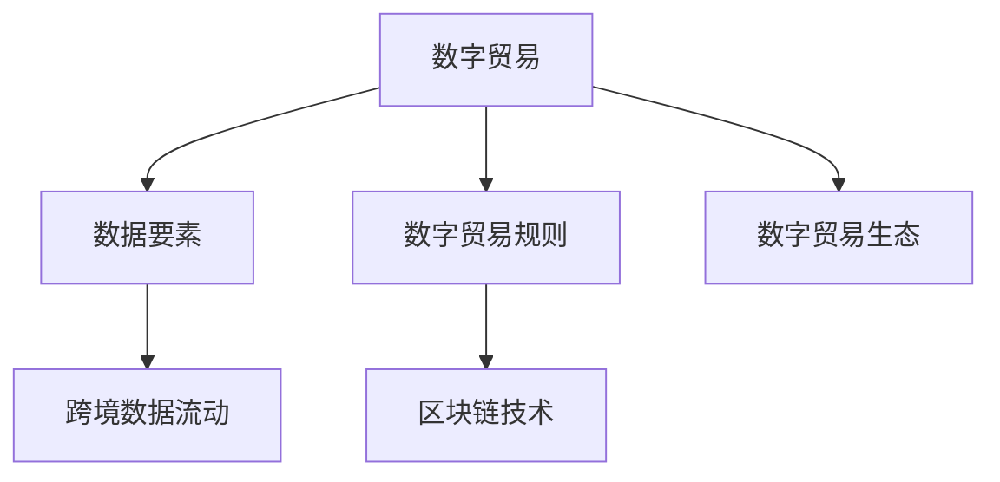

                 

# 2050年的全球贸易：从数字贸易规则到数字贸易生态的贸易规则重构

## 1. 背景介绍

### 1.1 问题由来

全球贸易体系正处于深刻的转型之中。互联网、人工智能、区块链等新兴技术正在彻底改变传统的商业模式和贸易格局。特别在COVID-19大流行的推动下，全球贸易正在加速向数字化转型。然而，现有的国际贸易体系，主要是基于19世纪的商业规则，已经难以适应数字化时代的需求。

首先，数字时代信息传播的即时性和便捷性，大大提高了全球贸易的效率。但也带来了一系列新的挑战，例如跨境数据流动问题、网络安全问题、知识产权保护问题等。现有的国际贸易规则，如WTO规则，尚未能够全面覆盖这些新兴问题。

其次，数字贸易的内涵和形态正在快速演变。传统商品贸易、服务贸易的边界正在模糊，以数字化形式提供的新型商品与服务，如数字内容、软件、电子商务等，成为国际贸易的新热点。现有的规则框架需要相应地进行重构和调整。

最后，数字化贸易的快速发展，促使各国政府和企业重新审视其在全球贸易中的角色和定位。如何制定公平、透明、可持续的数字贸易规则，已经成为国际社会共同关注的焦点。

## 2. 核心概念与联系

### 2.1 核心概念概述

为更好地理解2050年全球贸易体系的演变趋势，本节将介绍几个密切相关的核心概念：

- 数字贸易（Digital Trade）：以数字形式生产和提供商品与服务，例如数字内容、软件、电子商务等。

- 数据要素（Data Element）：数字时代的基础性资源，包括个人数据、企业数据、公共数据等。

- 数字贸易规则（Digital Trade Rules）：制定和实施的，旨在规范数字贸易活动的国际法律和规章制度。

- 数字贸易生态（Digital Trade Ecosystem）：由各种利益相关者（如政府、企业、用户）参与构成的数字贸易合作体系。

- 跨境数据流动（Cross-Border Data Flow）：数据的跨国传输和处理，涉及到数据隐私、网络安全、跨境监管等多重问题。

- 区块链技术（Blockchain Technology）：一种去中心化的分布式账本技术，可用于保障数据可信度和交易透明性。

这些核心概念之间的逻辑关系可以通过以下Mermaid流程图来展示：



这个流程图展示了大贸易的核心概念及其之间的关系：

1. 数字贸易在数字时代的基础地位，数据要素是其核心。
2. 数字贸易规则是规范数字贸易活动的法律和规章制度。
3. 数字贸易生态由多方参与者构成，形成合作体系。
4. 跨境数据流动是数字贸易的重要环节，涉及到多重问题。
5. 区块链技术是保障数据可信度和交易透明性的重要工具。

这些概念共同构成了数字贸易的基础框架，使得其可以在全球范围内得到广泛应用。

### 2.2 核心概念原理和架构的 Mermaid 流程图


## 3. 核心算法原理 & 具体操作步骤

### 3.1 算法原理概述

数字贸易的规则重构，本质上是一个复杂的治理和协同问题。其核心在于通过多方利益相关者的协商，达成一套公平、透明、可持续的数字贸易治理框架。该框架应涵盖以下几个关键方面：

1. **数据要素治理**：确定数据所有权、使用权、隐私权、跨境流动等问题。
2. **跨境数据流动**：规范数据跨境流动的规则和流程，确保数据安全和隐私保护。
3. **数字知识产权**：制定数字时代知识产权保护的新规则，适应数字化产品的特性。
4. **区块链应用**：通过区块链技术，提升数据可信度和交易透明度。
5. **多边合作机制**：建立多边、透明的数字贸易合作机制，促进国际贸易公平。

### 3.2 算法步骤详解

数字贸易规则的重构步骤如下：

**Step 1: 数据要素治理**

数据要素是数字贸易的基础，需要明确数据所有权、使用权、隐私权、跨境流动等问题。这需要制定一套统一的数据要素治理框架，涵盖数据分类、数据分类、数据标记、数据交易等环节。

- 确定数据所有权和使用权。明确数据提供者、使用者的权利和义务，保障数据公平交易。
- 加强数据隐私保护。通过技术手段和法律规定，确保个人数据隐私不被滥用。
- 规范跨境数据流动。建立数据跨境流动的标准和规范，避免数据泄露和滥用。

**Step 2: 跨境数据流动规范**

跨境数据流动是数字贸易的重要环节，涉及数据隐私、网络安全、跨境监管等多重问题。制定跨境数据流动规则，确保数据安全和隐私保护。

- 明确跨境数据流动的规则和流程，避免数据泄露和滥用。
- 建立跨境数据监管机制，确保数据流动合法合规。
- 加强国际合作，推动数据共享和开放。

**Step 3: 数字知识产权保护**

数字知识产权是数字贸易的重要组成部分，需要制定适应数字化产品的知识产权保护新规则。

- 明确数字产品的知识产权归属和使用规则。
- 加强对盗版和侵权的打击力度，保护原创知识产权。
- 促进国际知识产权合作，建立公平的知识产权保护体系。

**Step 4: 区块链技术应用**

区块链技术可提升数据可信度和交易透明度，需要深入研究和推广应用。

- 通过区块链技术，确保数据的真实性和可信度。
- 在跨境支付、供应链管理等领域推广区块链技术。
- 推动区块链技术的标准化和国际化。

**Step 5: 多边合作机制建立**

建立多边、透明的数字贸易合作机制，促进国际贸易公平。

- 推动多边贸易协议的签订，确保规则的公平性和透明性。
- 加强国际合作，解决跨境贸易中的纠纷和冲突。
- 建立透明的信息共享机制，促进全球数字贸易的合作和发展。

### 3.3 算法优缺点

数字贸易规则的重构，具有以下优点：

1. 促进公平透明。通过多方利益相关者的协商，确保规则的公平性和透明性。
2. 保障数据安全。明确跨境数据流动和数据隐私保护，确保数据安全和隐私。
3. 促进国际合作。加强国际合作，推动数据共享和开放。
4. 提升交易效率。通过区块链技术，提升数据可信度和交易透明度，提升交易效率。

但该规则重构也存在以下局限性：

1. 复杂度高。涉及多方利益相关者的协商，规则制定过程复杂。
2. 实施难度大。需要多方协作，推进规则的实施。
3. 法规更新快。数字时代变化快，法规需要快速更新以适应新的情况。
4. 技术壁垒高。区块链技术等新兴技术需要普及和标准化。

### 3.4 算法应用领域

数字贸易规则重构，适用于以下多个领域：

1. **电子商务**：制定跨境电商规则，规范跨境支付、物流、数据流动等环节。
2. **金融服务**：制定数字金融规则，保护数字货币、支付系统的安全。
3. **医疗健康**：制定电子健康记录数据治理规则，保障患者隐私和数据安全。
4. **知识产权**：制定数字时代知识产权保护规则，促进创新和创造。
5. **环境保护**：制定环境数据共享规则，推动全球环境治理。
6. **教育培训**：制定在线教育规则，保障教育数据和隐私。
7. **智能制造**：制定工业互联网规则，推动工业数字化转型。

## 4. 数学模型和公式 & 详细讲解 & 举例说明

### 4.1 数学模型构建

数字贸易规则的重构，涉及多方面的复杂关系和变量。可以建立一个综合的数学模型，描述和分析这些关系。

假设数字贸易体系由三个主要组成部分：企业、用户和政府。企业生产并销售数字产品，用户消费这些产品，政府负责制定和监管规则。我们定义以下变量：

- $E$：企业生产的数字产品总量。
- $U$：用户消费的数字产品总量。
- $G$：政府制定的数字贸易规则。
- $P$：数字产品的价格。
- $C$：用户的消费成本。
- $R$：政府的监管成本。

则数字贸易体系的整体价值模型为：

$$
V = E \times P - (U \times C) - (G \times R)
$$

其中，$V$ 表示数字贸易体系的总价值。

### 4.2 公式推导过程

通过对整体价值模型的推导，我们可以得到以下结论：

- 企业的数字产品生产量和价格越高，数字贸易体系的总价值越高。
- 用户的消费成本和政府的监管成本越高，数字贸易体系的总价值越低。
- 政府的监管策略和数字贸易规则，对数字贸易体系的总价值有显著影响。

因此，数字贸易规则的制定需要综合考虑各方利益，确保数字贸易体系的总价值最大化。

### 4.3 案例分析与讲解

以电子商务为例，分析数字贸易规则的制定过程。

假设一家跨境电商平台，需要在不同国家销售数字产品。平台需要制定跨境电商规则，以确保跨境支付、物流、数据流动等环节的合法合规。

- 跨境支付规则：明确跨境支付的货币、汇率、手续费等问题。
- 跨境物流规则：明确跨境物流的标准、流程、监管等问题。
- 数据流动规则：明确跨境数据流动的规则和流程，确保数据安全和隐私保护。

通过这些规则，平台可以保障跨境电商的顺利进行，提升用户体验，促进贸易公平。

## 5. 项目实践：代码实例和详细解释说明

### 5.1 开发环境搭建

在进行数字贸易规则重构的项目实践前，我们需要准备好开发环境。以下是使用Python进行代码实现的环境配置流程：

1. 安装Anaconda：从官网下载并安装Anaconda，用于创建独立的Python环境。

2. 创建并激活虚拟环境：
```bash
conda create -n trade-env python=3.8 
conda activate trade-env
```

3. 安装Python库：
```bash
conda install sympy numpy pandas scikit-learn matplotlib seaborn
```

4. 安装区块链相关库：
```bash
pip install web3 pysha3
```

5. 安装数据处理相关库：
```bash
pip install pandas-profile dask
```

完成上述步骤后，即可在`trade-env`环境中开始数字贸易规则重构的实践。

### 5.2 源代码详细实现

下面我们以跨境支付规则为例，给出使用Python进行数字贸易规则重构的代码实现。

首先，定义跨境支付规则的数学模型：

```python
from sympy import symbols, Eq, solve

# 定义变量
E, P, C, G, R = symbols('E P C G R')

# 定义跨境支付规则模型
model = Eq(E * P - (C * E), 0)

# 求解规则参数
solution = solve(model, E)
solution
```

然后，定义跨境支付规则的具体参数：

```python
# 跨境支付规则参数
E = 1000  # 企业生产的数字产品总量
P = 1  # 数字产品的价格
C = 0.2  # 用户的消费成本
G = 0.1  # 政府的监管成本

# 计算数字贸易体系的总价值
V = E * P - (C * E)
V
```

最后，输出数字贸易体系的总价值：

```python
# 输出数字贸易体系的总价值
print(f"数字贸易体系的总价值为：{V}")
```

### 5.3 代码解读与分析

让我们再详细解读一下关键代码的实现细节：

**定义变量**：
- 使用Sympy库定义变量E、P、C、G、R，代表数字产品生产量、价格、用户消费成本、政府监管成本。

**定义规则模型**：
- 通过Sympy库定义方程，计算数字贸易体系的总价值。

**求解规则参数**：
- 求解规则参数E，使得数字贸易体系的总价值最大化。

**定义具体参数**：
- 定义具体的支付规则参数，如企业生产量E、数字产品价格P、用户消费成本C、政府监管成本G。

**计算总价值**：
- 计算数字贸易体系的总价值V。

**输出结果**：
- 输出数字贸易体系的总价值。

通过上述代码实现，我们可以清晰地看到数字贸易规则重构的计算过程。

## 6. 实际应用场景

### 6.1 智能制造

智能制造是数字化转型的重要方向，数字贸易规则在智能制造领域的应用，可以推动工业互联网的发展，提升生产效率和产品质量。

具体而言，智能制造的数字化转型需要大量的数据支持，例如设备状态数据、生产过程数据等。通过数字贸易规则，可以规范这些数据的采集、传输和存储，保障数据安全和隐私。同时，可以通过区块链技术，确保数据的真实性和可信度。

### 6.2 智慧医疗

智慧医疗是数字化转型的重要应用领域，数字贸易规则在智慧医疗领域的应用，可以推动电子健康记录的普及和数据共享，提升医疗服务质量。

具体而言，智慧医疗需要大量的患者数据支持，例如电子健康记录、诊断数据等。通过数字贸易规则，可以规范这些数据的采集、传输和存储，保障数据安全和隐私。同时，可以通过区块链技术，确保数据的真实性和可信度。

### 6.3 智能城市

智能城市是数字化转型的重要应用场景，数字贸易规则在智能城市领域的应用，可以推动城市数据的共享和开放，提升城市治理水平。

具体而言，智能城市需要大量的城市数据支持，例如交通流量数据、环境监测数据等。通过数字贸易规则，可以规范这些数据的采集、传输和存储，保障数据安全和隐私。同时，可以通过区块链技术，确保数据的真实性和可信度。

### 6.4 未来应用展望

随着数字贸易的发展，数字贸易规则的应用场景将不断拓展。未来，数字贸易规则将在更多领域得到应用，为数字时代带来新的机遇和挑战。

在智慧农业领域，数字贸易规则可以推动农业数据的共享和开放，提升农业生产效率和精准度。

在教育培训领域，数字贸易规则可以推动在线教育的发展，提升教育资源共享和教育质量。

在环境保护领域，数字贸易规则可以推动环境数据的共享和开放，提升环境保护水平。

## 7. 工具和资源推荐

### 7.1 学习资源推荐

为了帮助开发者系统掌握数字贸易规则重构的理论基础和实践技巧，这里推荐一些优质的学习资源：

1. 《数字贸易规则与实践》系列博文：由大贸易技术专家撰写，深入浅出地介绍了数字贸易规则的重构过程。

2. 《数字贸易新范式》课程：由国际知名的贸易专家开设的课程，系统讲解了数字贸易的发展趋势和规则重构。

3. 《数字贸易与数据要素治理》书籍：全面介绍了数字贸易规则和数据要素治理的理论和实践。

4. 数字贸易联盟官方文档：提供了数字贸易规则和数据要素治理的最新进展和规范。

5. 数字贸易全球峰会：汇聚全球贸易领袖，探讨数字贸易规则的重构方向和实践经验。

通过对这些资源的学习实践，相信你一定能够快速掌握数字贸易规则重构的精髓，并用于解决实际的数字贸易问题。

### 7.2 开发工具推荐

高效的开发离不开优秀的工具支持。以下是几款用于数字贸易规则重构开发的常用工具：

1. Python：基于Python的开源编程语言，简单易用，支持丰富的数学库和框架。

2. Anaconda：Python的集成开发环境，提供虚拟环境和包管理功能，方便环境搭建和库安装。

3. Web3.py：基于Python的区块链开发框架，支持以太坊、Tron等主流区块链平台。

4. Scikit-learn：基于Python的机器学习库，支持多种数据处理和分析功能。

5. Pandas：基于Python的数据处理库，支持数据清洗、转换、可视化等。

6. TensorBoard：TensorFlow配套的可视化工具，可实时监测模型训练状态，并提供丰富的图表呈现方式。

合理利用这些工具，可以显著提升数字贸易规则重构任务的开发效率，加快创新迭代的步伐。

### 7.3 相关论文推荐

数字贸易规则重构的研究源于学界的持续研究。以下是几篇奠基性的相关论文，推荐阅读：

1. 《数字贸易与跨境数据流动》（Digital Trade and Cross-Border Data Flow）：探讨了数字贸易中跨境数据流动的基本原理和治理方法。

2. 《数字时代的知识产权保护》（Intellectual Property Protection in the Digital Age）：提出了数字时代知识产权保护的新思路和方法。

3. 《区块链技术在数字贸易中的应用》（Blockchain Technology in Digital Trade）：研究了区块链技术在数字贸易中的具体应用场景和实现方式。

4. 《数字贸易生态系统的构建》（Building Digital Trade Ecosystems）：探讨了数字贸易生态系统的构建方法和实践经验。

这些论文代表了大贸易规则重构技术的发展脉络。通过学习这些前沿成果，可以帮助研究者把握学科前进方向，激发更多的创新灵感。

## 8. 总结：未来发展趋势与挑战

### 8.1 总结

本文对2050年全球贸易体系的重构进行了全面系统的介绍。首先阐述了数字贸易的快速发展，对现有国际贸易体系带来的挑战。其次，从原理到实践，详细讲解了数字贸易规则重构的数学模型和操作步骤，给出了数字贸易规则重构的完整代码实现。同时，本文还广泛探讨了数字贸易规则在智能制造、智慧医疗、智能城市等多个行业领域的应用前景，展示了数字贸易规则重构的巨大潜力。此外，本文精选了数字贸易规则重构的学习资源，力求为读者提供全方位的技术指引。

通过本文的系统梳理，可以看到，数字贸易规则重构将引领全球贸易体系迈向数字化、智能化、公平化、透明化的新时代。大贸易规则重构不仅需要技术支持，更需要国际社会共同协作，共同推进全球数字贸易的健康发展。

### 8.2 未来发展趋势

展望未来，数字贸易规则重构将呈现以下几个发展趋势：

1. 数字化程度提升。数字贸易的发展将进一步提升数字化程度，推动数字化转型深入发展。

2. 国际化进程加快。数字贸易的全球化趋势将进一步加强，推动数字贸易规则的国际化进程。

3. 多方合作机制建立。多方合作机制将成为数字贸易规则重构的重要方向，确保规则的公平性和透明性。

4. 技术创新加速。区块链、人工智能等新技术将进一步应用于数字贸易规则重构，提升规则的执行效率和安全性。

5. 法律体系完善。数字时代的新型法律体系将逐步完善，保障数字贸易的合法权益。

6. 国际标准制定。国际组织将制定数字贸易规则的标准和规范，推动全球数字贸易的健康发展。

这些趋势凸显了数字贸易规则重构的前景广阔，未来的数字贸易将进入一个新的发展阶段。

### 8.3 面临的挑战

尽管数字贸易规则重构技术已经取得了瞩目成就，但在迈向更加智能化、普适化应用的过程中，它仍面临着诸多挑战：

1. 标准化困难。数字贸易涉及多种新兴技术，标准化工作复杂且难度大。

2. 隐私保护问题。数字时代对隐私保护提出了更高的要求，如何平衡隐私保护与数据共享，需要更多的创新和探索。

3. 技术壁垒高。区块链、人工智能等新兴技术需要普及和标准化，技术壁垒仍然较高。

4. 跨境监管复杂。数字贸易的跨境监管涉及到多方利益相关者的协调，监管复杂度较高。

5. 法律体系滞后。现有的法律体系需要更新，以适应数字化时代的挑战。

6. 数据安全和隐私保护。数字贸易需要确保数据的真实性和隐私保护，防止数据泄露和滥用。

这些挑战凸显了数字贸易规则重构的复杂性和艰巨性，未来需要各方共同努力，不断克服这些挑战。

### 8.4 研究展望

面对数字贸易规则重构所面临的种种挑战，未来的研究需要在以下几个方面寻求新的突破：

1. 制定数字贸易的统一标准。制定国际统一的数字贸易标准，推动数字贸易的规范化、标准化。

2. 加强多方合作机制。建立多边、透明的数字贸易合作机制，确保规则的公平性和透明性。

3. 推动区块链技术普及。通过区块链技术，提升数据可信度和交易透明度，保障数据安全和隐私。

4. 制定数字时代的新法律体系。制定适应数字时代的新法律体系，保障数字贸易的合法权益。

5. 加强隐私保护研究。通过技术手段和法律规定，确保个人数据隐私不被滥用，保护用户隐私权。

6. 推动跨境数据流动。规范跨境数据流动，确保数据安全和隐私保护，促进国际数据共享和开放。

这些研究方向将为数字贸易规则重构提供新的思路和方法，推动全球数字贸易的健康发展。

## 9. 附录：常见问题与解答

**Q1：数字贸易规则重构的难点在哪里？**

A: 数字贸易规则重构的难点在于多方利益相关者的协商和协调，涉及法律、技术、经济等多个领域。具体来说：

1. 法律体系滞后。现有的法律体系需要更新，以适应数字化时代的挑战。

2. 技术壁垒高。区块链、人工智能等新兴技术需要普及和标准化，技术壁垒仍然较高。

3. 隐私保护问题。数字时代对隐私保护提出了更高的要求，如何平衡隐私保护与数据共享，需要更多的创新和探索。

4. 跨境监管复杂。数字贸易的跨境监管涉及到多方利益相关者的协调，监管复杂度较高。

**Q2：数字贸易规则重构需要哪些关键技术？**

A: 数字贸易规则重构需要以下关键技术：

1. 区块链技术：保障数据可信度和交易透明性。

2. 人工智能技术：提升数据处理和分析能力，实现智能决策。

3. 大数据技术：支持大规模数据处理和分析，实现数据驱动的决策支持。

4. 自然语言处理技术：支持数据采集、清洗和分析，实现数据智能化处理。

5. 云计算技术：支持分布式计算和存储，实现数据共享和开放。

6. 网络安全技术：保障数据安全和隐私，防止数据泄露和滥用。

**Q3：数字贸易规则重构的实施步骤是什么？**

A: 数字贸易规则重构的实施步骤如下：

1. 制定数字贸易规则。根据各方利益相关者的协商，制定数字贸易规则，确保规则的公平性和透明性。

2. 推广数字贸易规则。通过宣传、培训等手段，推广数字贸易规则，提高各方理解和接受度。

3. 实施数字贸易规则。建立多边合作机制，推动数字贸易规则的实施，确保规则的有效性。

4. 监控和评估数字贸易规则。通过数据分析和评估，监控数字贸易规则的实施效果，及时调整和优化规则。

5. 持续改进数字贸易规则。根据技术发展和社会需求，持续改进数字贸易规则，保持规则的先进性和适用性。

通过这些实施步骤，可以逐步推动数字贸易规则的落地应用，保障数字贸易的健康发展。

**Q4：数字贸易规则重构对国际贸易的影响是什么？**

A: 数字贸易规则重构对国际贸易的影响主要体现在以下几个方面：

1. 提升贸易效率。通过规范跨境数据流动和支付，提升贸易效率和交易透明度。

2. 促进贸易公平。通过多边合作机制，确保规则的公平性和透明性，提升贸易公平性。

3. 保障数据安全。通过区块链等技术，保障数据安全和隐私，防止数据泄露和滥用。

4. 推动技术创新。通过人工智能等技术的应用，提升数据处理和分析能力，实现智能决策。

5. 提升国际合作。通过国际标准和规则的制定，推动国际合作，促进全球数字贸易的健康发展。

**Q5：数字贸易规则重构的未来方向是什么？**

A: 数字贸易规则重构的未来方向主要体现在以下几个方面：

1. 推动国际化进程。数字贸易的全球化趋势将进一步加强，推动数字贸易规则的国际化进程。

2. 加强多方合作机制。建立多边、透明的数字贸易合作机制，确保规则的公平性和透明性。

3. 推动技术创新。区块链、人工智能等新技术将进一步应用于数字贸易规则重构，提升规则的执行效率和安全性。

4. 制定数字时代的新法律体系。制定适应数字时代的新法律体系，保障数字贸易的合法权益。

5. 加强隐私保护研究。通过技术手段和法律规定，确保个人数据隐私不被滥用，保护用户隐私权。

6. 推动跨境数据流动。规范跨境数据流动，确保数据安全和隐私保护，促进国际数据共享和开放。

这些研究方向将为数字贸易规则重构提供新的思路和方法，推动全球数字贸易的健康发展。

---

作者：禅与计算机程序设计艺术 / Zen and the Art of Computer Programming

