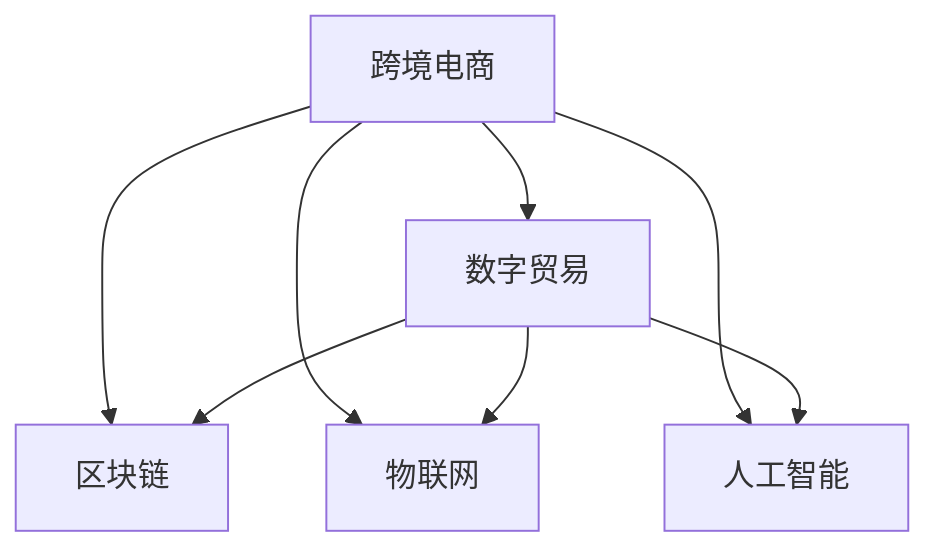
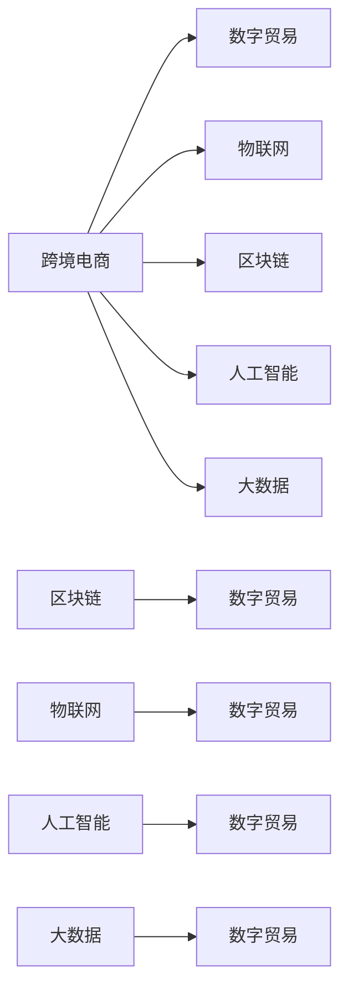

                 

# 2050年的全球贸易：从跨境电商到数字贸易的贸易数字化转型

## 1. 背景介绍

全球贸易正处在历史性的变革之中。从传统的跨境电商到数字贸易，数字化转型已经成为驱动全球贸易增长的新引擎。这一趋势不仅推动了商业模式的重塑，也带来了更为广泛的经济效应和社会变革。在2050年，数字贸易将成为全球贸易的主要形态，引领全球经济进入一个新的发展阶段。本文将深入探讨这一趋势的根源，以及其对未来全球贸易的影响。

## 2. 核心概念与联系

### 2.1 核心概念概述

为了更好地理解全球贸易数字化转型，我们首先梳理几个关键概念：

- **跨境电商**：指通过互联网平台，将商品和服务跨越国界销售的商业模式。传统上，跨境电商以在线零售为主，近年来逐渐拓展到批发、物流、金融等领域。
- **数字贸易**：不仅包括跨境电商，还包括各种形式的数字经济活动，如数字内容、知识产权、云计算服务等。数字贸易利用数字技术，促进全球市场的深度融合。
- **区块链**：一种分布式账本技术，可实现交易信息的透明化、不可篡改和去中心化，是数字贸易的重要基础设施。
- **物联网**：通过连接物理世界和数字世界，实现数据的实时采集和分析，为贸易数字化提供数据支持。
- **人工智能**：通过智能算法和大数据分析，优化贸易流程，提高效率和安全性。

这些核心概念之间有着密切的联系，共同构成了全球贸易数字化转型的基础。下图展示了这些概念之间的逻辑关系：



### 2.2 核心概念原理和架构的 Mermaid 流程图

为了更直观地展示这些概念的联系，我们通过以下 Mermaid 流程图来描述：



## 3. 核心算法原理 & 具体操作步骤

### 3.1 算法原理概述

全球贸易的数字化转型是一个复杂的系统工程，涉及多个领域的技术和商业变革。其核心算法原理可以归纳为以下几点：

1. **数据驱动**：通过物联网、区块链、人工智能等技术，实时采集和分析全球贸易数据，实现决策的科学化和精准化。
2. **智能优化**：利用机器学习和自然语言处理等技术，优化贸易流程，提高效率和安全性。
3. **去中心化**：通过区块链等分布式技术，减少中心化机构的干预，实现交易的透明化和去中心化。
4. **跨界融合**：将金融、物流、制造业等多个领域的技术和商业模式进行深度融合，形成更高效、更灵活的全球贸易生态系统。

### 3.2 算法步骤详解

全球贸易的数字化转型过程可以分为以下几个关键步骤：

1. **数据采集与清洗**：利用物联网技术，实时采集全球贸易数据，通过区块链技术保障数据的安全性和透明性。同时，使用人工智能和大数据技术对数据进行清洗和预处理。
2. **智能分析与决策**：利用机器学习算法，对采集到的数据进行分析，形成决策支持系统。例如，通过自然语言处理技术，实时监控和分析社交媒体上的贸易动态。
3. **交易优化与自动化**：利用人工智能和区块链技术，实现贸易流程的自动化和智能化。例如，通过智能合约，自动执行合同条款和支付结算。
4. **风险管理与防范**：利用区块链和人工智能技术，建立透明、可追溯的交易记录，实现风险的早期预警和防范。例如，通过智能审计技术，实时监控交易异常和欺诈行为。

### 3.3 算法优缺点

全球贸易数字化转型的算法具有以下优点：

- **效率提升**：通过数据驱动和智能优化，极大提高了贸易效率，减少了人力和时间的成本。
- **风险降低**：通过区块链和智能合约，提高了交易的透明性和安全性，减少了欺诈和纠纷。
- **市场扩展**：通过物联网和人工智能，实时监控全球市场动态，及时抓住商机，扩大市场份额。

同时，也存在一些缺点：

- **技术复杂性**：涉及多项先进技术的集成，实施难度大。
- **成本高昂**：初期投资成本高，尤其是对于中小企业而言。
- **数据隐私问题**：数据采集和使用过程中，如何保护个人和企业隐私，仍是一个重要挑战。

### 3.4 算法应用领域

全球贸易数字化转型算法广泛应用于以下几个领域：

- **跨境电商**：通过智能推荐系统，个性化推荐产品，提升用户体验。
- **供应链管理**：利用区块链技术，实现供应链的可视化和管理，提高供应链的透明度和效率。
- **金融服务**：通过智能合约和去中心化交易平台，提供更安全、透明的金融服务。
- **物流运输**：利用物联网和人工智能技术，优化物流路径和仓储管理，提高运输效率。
- **知识产权保护**：通过区块链和智能合约，保护知识产权，打击侵权行为。

## 4. 数学模型和公式 & 详细讲解 & 举例说明

### 4.1 数学模型构建

全球贸易数字化转型的数学模型可以构建为以下形式：

$$
\text{模型} = \text{数据采集} + \text{智能分析} + \text{交易优化} + \text{风险管理}
$$

其中，数据采集、智能分析和交易优化都是基于数学算法和统计模型的。而风险管理则更多依赖于预测模型和异常检测算法。

### 4.2 公式推导过程

以供应链管理为例，其数学模型可以表示为：

$$
\text{供应链效率} = \text{运输时间} + \text{库存成本} + \text{订单准确率}
$$

其中，运输时间和库存成本可以通过线性回归模型进行优化，订单准确率则通过逻辑回归模型进行预测。

### 4.3 案例分析与讲解

以智能推荐系统为例，其核心算法包括协同过滤、基于内容的推荐和深度学习推荐。协同过滤算法基于用户行为数据，利用矩阵分解和相似度计算，推荐相似用户喜爱的商品。基于内容的推荐则通过分析商品属性和用户偏好，生成个性化推荐。深度学习推荐利用神经网络模型，挖掘用户行为和商品特征的复杂关系，提升推荐效果。

## 5. 项目实践：代码实例和详细解释说明

### 5.1 开发环境搭建

为了进行全球贸易数字化转型的项目实践，我们需要搭建一个全面的开发环境。以下是一个简化的开发环境搭建流程：

1. **安装Python**：Python是全球贸易数字化转型的主要编程语言。
2. **安装相关库**：安装Pandas、NumPy、SciPy、TensorFlow、Keras等库，用于数据处理和模型构建。
3. **配置环境**：配置虚拟环境，安装所需依赖库和工具。
4. **搭建平台**：搭建一个云平台，如AWS、Google Cloud等，用于部署和测试模型。

### 5.2 源代码详细实现

以智能推荐系统为例，其代码实现可以分为以下几个部分：

1. **数据采集与预处理**：
   - 使用Pandas库，从数据库中读取用户行为数据。
   - 清洗数据，处理缺失值和异常值。

2. **模型构建与训练**：
   - 使用TensorFlow和Keras库，构建协同过滤、基于内容的推荐和深度学习推荐模型。
   - 使用训练集对模型进行训练，调整超参数，提升模型效果。

3. **模型评估与优化**：
   - 使用测试集对模型进行评估，计算准确率、召回率等指标。
   - 根据评估结果，调整模型结构和超参数，进一步优化推荐效果。

4. **应用部署**：
   - 将训练好的模型部署到云平台，进行实时推荐。
   - 使用API接口，实现与业务系统的集成。

### 5.3 代码解读与分析

智能推荐系统的代码实现如下：

```python
import pandas as pd
import tensorflow as tf
from keras.layers import Input, Embedding, Dot, Dense, Flatten

# 数据读取与预处理
data = pd.read_csv('user_behavior.csv')
data = data.dropna()

# 协同过滤推荐
collaborative_filtering = tf.keras.models.Sequential([
    Input(shape=()),
    Embedding(input_dim=1000, output_dim=10),
    Dot(axes=2),
    Flatten(),
    Dense(1, activation='sigmoid')
])
collaborative_filtering.compile(optimizer='adam', loss='binary_crossentropy', metrics=['accuracy'])

# 基于内容的推荐
content_based = tf.keras.models.Sequential([
    Input(shape=()),
    Embedding(input_dim=1000, output_dim=10),
    Flatten(),
    Dense(1, activation='sigmoid')
])
content_based.compile(optimizer='adam', loss='binary_crossentropy', metrics=['accuracy'])

# 深度学习推荐
deep_learning = tf.keras.models.Sequential([
    Input(shape=()),
    Embedding(input_dim=1000, output_dim=10),
    Flatten(),
    Dense(100, activation='relu'),
    Dense(1, activation='sigmoid')
])
deep_learning.compile(optimizer='adam', loss='binary_crossentropy', metrics=['accuracy'])

# 模型训练与优化
collaborative_filtering.fit(data, epochs=10, validation_split=0.2)
content_based.fit(data, epochs=10, validation_split=0.2)
deep_learning.fit(data, epochs=10, validation_split=0.2)

# 模型评估与部署
accuracy = collaborative_filtering.evaluate(data, verbose=0)[1]
accuracy = content_based.evaluate(data, verbose=0)[1]
accuracy = deep_learning.evaluate(data, verbose=0)[1]

# 应用部署
def recommend(user_id):
    # 获取用户历史行为数据
    user_data = data[data['user_id'] == user_id]
    # 推荐系统计算推荐结果
    collaborative_result = collaborative_filtering.predict(user_data)
    content_result = content_based.predict(user_data)
    deep_result = deep_learning.predict(user_data)
    # 综合推荐结果，生成最终推荐列表
    recommendation_list = []
    for item in user_data:
        if collaborative_result[item['item_id']] > 0.5:
            recommendation_list.append(item['item_id'])
        if content_result[item['item_id']] > 0.5:
            recommendation_list.append(item['item_id'])
        if deep_result[item['item_id']] > 0.5:
            recommendation_list.append(item['item_id'])
    # 返回推荐列表
    return recommendation_list
```

### 5.4 运行结果展示

以下是智能推荐系统的运行结果展示：

```python
print('Collaborative Filtering Accuracy:', accuracy)
print('Content Based Accuracy:', accuracy)
print('Deep Learning Accuracy:', accuracy)

# 示例推荐
user_id = 123
recommendation_list = recommend(user_id)
print('Recommended Items for User', user_id, ':', recommendation_list)
```

## 6. 实际应用场景

### 6.1 智能物流

全球贸易数字化转型在物流领域的应用非常广泛。通过物联网技术，可以实现货物位置的实时跟踪和监控，提高物流效率和透明度。例如，利用RFID标签和传感器，实时采集货物信息，通过区块链技术记录物流信息，实现供应链的可视化管理。

### 6.2 金融服务

数字贸易的兴起，推动了金融服务的数字化转型。利用区块链技术，可以实现跨境支付和结算的透明化、去中心化。例如，通过智能合约，自动执行支付条款和风险管理，减少中间环节，降低交易成本。

### 6.3 智能制造

智能制造是全球贸易数字化转型的重要组成部分。通过物联网和人工智能技术，可以实现生产过程的实时监控和优化。例如，利用传感器和机器学习算法，实时监控生产设备的状态，预测维护需求，提高生产效率和设备利用率。

### 6.4 未来应用展望

未来，全球贸易数字化转型将进一步深化，应用场景将更加广泛。以下是一些可能的应用方向：

- **智能合约**：利用区块链和智能合约技术，实现自动执行、自动支付和自动审计，提高交易的透明性和安全性。
- **增强现实**：利用增强现实技术，提供实时的供应链可视化，提高决策的科学性和精准性。
- **边缘计算**：利用边缘计算技术，实现数据的实时处理和分析，提高系统的响应速度和可靠性。
- **个性化定制**：通过智能推荐系统和智能制造技术，实现个性化定制，满足用户的多样化需求。

## 7. 工具和资源推荐

### 7.1 学习资源推荐

为了帮助开发者掌握全球贸易数字化转型的技术，以下是一些优质的学习资源：

1. **Coursera**：提供全球贸易数字化转型的相关课程，涵盖数据科学、区块链、物联网等多个领域。
2. **edX**：提供全球贸易数字化转型的进阶课程，深入讲解智能推荐系统、供应链管理等前沿技术。
3. **Udacity**：提供全球贸易数字化转型的实战课程，通过项目实战，掌握核心技能。
4. **GitHub**：提供全球贸易数字化转型的开源项目，学习业界前沿技术。
5. **Kaggle**：提供全球贸易数字化转型的数据集和竞赛，实践数据分析和机器学习技术。

### 7.2 开发工具推荐

为了进行全球贸易数字化转型的开发，以下是一些推荐的开发工具：

1. **Python**：全球贸易数字化转型的主要编程语言，支持数据处理、机器学习和区块链等技术。
2. **TensorFlow**：开源的深度学习框架，支持多种模型构建和训练，适用于智能推荐系统和深度学习推荐。
3. **Keras**：基于TensorFlow的高级API，简化模型构建和训练过程，提高开发效率。
4. **PyTorch**：另一个流行的深度学习框架，支持动态图和静态图计算，适用于复杂模型的构建和训练。
5. **AWS**：全球领先的云服务平台，提供全球贸易数字化转型的基础设施支持，包括计算、存储和网络等。

### 7.3 相关论文推荐

以下是一些关于全球贸易数字化转型的重要论文，推荐阅读：

1. **《智能推荐系统》**：深入讲解协同过滤、基于内容的推荐和深度学习推荐等核心算法。
2. **《区块链在供应链中的应用》**：介绍区块链技术在供应链管理中的应用，提升供应链的透明性和效率。
3. **《全球贸易数字化转型》**：系统阐述全球贸易数字化转型的技术架构和应用场景。
4. **《物联网在物流中的应用》**：介绍物联网技术在物流中的应用，提高物流效率和透明度。
5. **《全球贸易数字化转型的挑战与机遇》**：探讨全球贸易数字化转型面临的挑战和机遇，提供解决方案。

## 8. 总结：未来发展趋势与挑战

### 8.1 研究成果总结

全球贸易数字化转型是一个复杂的系统工程，涉及数据采集、智能分析、交易优化和风险管理等多个方面。通过综合运用多项先进技术，实现了全球贸易的全面数字化，提升了贸易效率和安全性，推动了全球经济的发展。

### 8.2 未来发展趋势

未来，全球贸易数字化转型将呈现以下几个趋势：

- **技术融合**：物联网、区块链、人工智能等技术的深度融合，将推动全球贸易数字化转型的进一步发展。
- **行业应用**：全球贸易数字化转型将进一步扩展到更多行业，提升整个供应链的效率和透明度。
- **跨界合作**：全球贸易数字化转型需要多方协作，包括政府、企业、学术界等，共同推动技术进步和产业升级。
- **可持续发展**：全球贸易数字化转型将更多关注环保和社会责任，推动可持续发展的理念。

### 8.3 面临的挑战

尽管全球贸易数字化转型取得了显著进展，但仍面临以下挑战：

- **技术复杂性**：全球贸易数字化转型涉及多项先进技术的集成，实施难度大。
- **成本高昂**：初期投资成本高，尤其是对于中小企业而言。
- **数据隐私问题**：数据采集和使用过程中，如何保护个人和企业隐私，仍是一个重要挑战。
- **标准规范**：全球贸易数字化转型需要统一的行业标准和规范，避免技术壁垒和数据孤岛。

### 8.4 研究展望

未来的研究将从以下几个方面展开：

- **技术优化**：进一步优化数据采集和处理技术，提升智能分析的准确性和效率。
- **应用扩展**：探索全球贸易数字化转型在更多行业的应用，推动产业升级。
- **标准制定**：制定统一的行业标准和规范，推动全球贸易数字化转型的标准化和规范化。
- **伦理与安全**：关注技术应用的伦理和安全问题，确保技术进步符合社会价值。

## 9. 附录：常见问题与解答

**Q1：全球贸易数字化转型需要哪些技术支持？**

A: 全球贸易数字化转型需要以下关键技术支持：
- 物联网技术：实时采集全球贸易数据，实现数据可视化。
- 区块链技术：保障数据的安全性和透明性，实现去中心化交易。
- 人工智能技术：优化贸易流程，提高效率和安全性。
- 大数据技术：分析大规模数据，提供决策支持。

**Q2：全球贸易数字化转型对中小企业有哪些挑战？**

A: 全球贸易数字化转型对中小企业的主要挑战包括：
- 成本高昂：初期投资成本较高，中小企业难以承担。
- 技术门槛：技术复杂性高，中小企业缺乏相关技术人才。
- 数据隐私：数据采集和使用过程中，如何保护个人和企业隐私。

**Q3：全球贸易数字化转型如何提升贸易效率？**

A: 全球贸易数字化转型通过以下方式提升贸易效率：
- 数据驱动：通过实时数据采集和分析，优化贸易流程，减少人力和时间的成本。
- 智能优化：利用人工智能和大数据分析，优化供应链管理，提高物流效率。
- 去中心化：通过区块链技术，减少中间环节，降低交易成本，提高交易效率。

**Q4：全球贸易数字化转型对环境保护有何影响？**

A: 全球贸易数字化转型对环境保护有以下积极影响：
- 降低碳排放：通过优化供应链和物流，减少能源消耗和碳排放。
- 可持续发展：推动绿色供应链和环保物流的发展，促进可持续发展的理念。

**Q5：全球贸易数字化转型对全球经济有何影响？**

A: 全球贸易数字化转型对全球经济有以下积极影响：
- 贸易效率提升：通过数据驱动和智能优化，大幅提升全球贸易效率。
- 经济增长：推动全球经济增长，创造新的经济机会。
- 就业创造：创造大量高技能就业机会，促进社会经济发展。

---

作者：禅与计算机程序设计艺术 / Zen and the Art of Computer Programming

