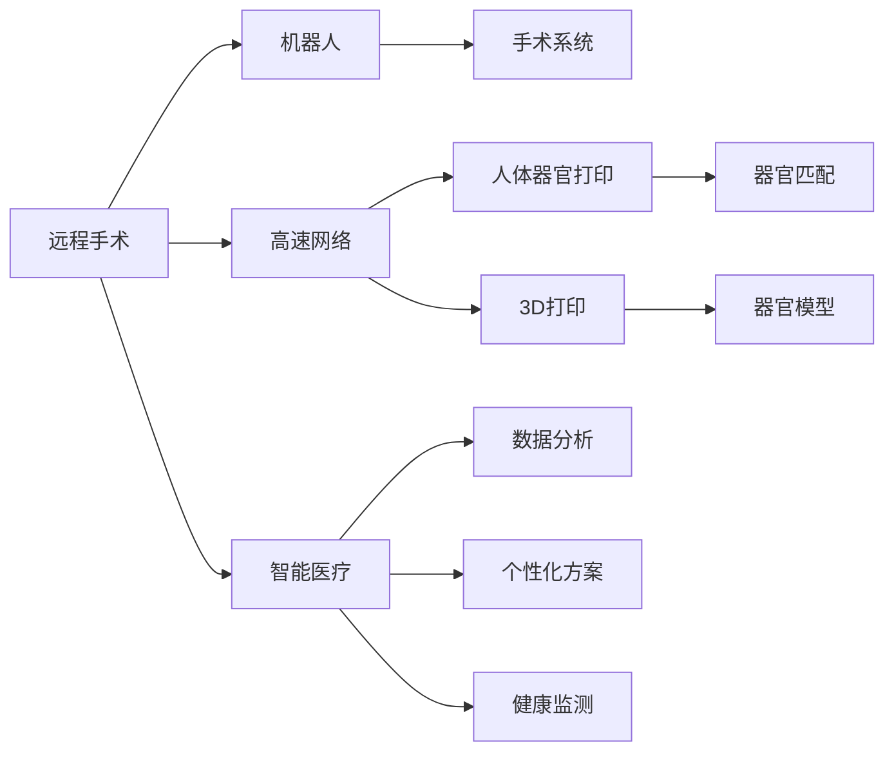

                 

# 2050年的医疗健康：从远程手术到人体器官打印的智能医疗

## 1. 背景介绍

在2050年，医疗健康领域将发生翻天覆地的变化。得益于人工智能(AI)、大数据、物联网(IoT)等技术，医疗服务将变得更加高效、精准和个性化。今天，我们可能无法想象的一些医疗应用，比如远程手术、人体器官打印等，将在未来成为现实。本文将探讨这些前沿技术如何推动医疗健康的发展，并通过具体案例说明其实际应用。

## 2. 核心概念与联系

### 2.1 核心概念概述

在2050年的医疗健康领域，以下几个核心概念尤为关键：

- **远程手术**：通过网络传输信号，医生可以远程操控机器人进行手术，无需亲自到达现场。

- **人体器官打印**：利用3D打印技术，打印出定制化的器官，用于替换受损的器官。

- **智能医疗**：通过AI和大数据分析，实现个性化医疗方案的制定。

- **健康监测**：利用物联网设备实时监控用户的健康数据，实现早预警、早治疗。

这些概念之间存在着紧密的联系。例如，远程手术需要依赖于高速稳定的网络传输技术，而人体器官打印则需要大数据支持下的精确设计。智能医疗则贯穿了上述所有概念，通过数据分析优化手术方案，评估打印器官的适应性，实现个性化的健康监测和预防。

### 2.2 核心概念原理和架构的 Mermaid 流程图



这张流程图展示了远程手术、人体器官打印和智能医疗之间的相互联系。通过高速网络传输，手术系统可以与远程的医生协作，而3D打印技术根据数据分析提供定制化的器官模型，最后通过智能医疗系统生成个性化的健康监测方案。

## 3. 核心算法原理 & 具体操作步骤

### 3.1 算法原理概述

#### 3.1.1 远程手术

远程手术主要依赖于高精度的传感器和算法来实现。通过将医生的操作转换为机器人动作，实现手术操作。

#### 3.1.2 人体器官打印

人体器官打印基于3D建模和切片技术，通过精确控制打印机的移动，逐层打印出器官模型。

#### 3.1.3 智能医疗

智能医疗利用机器学习算法，对大量医疗数据进行分析，生成个性化的健康监测和诊疗方案。

#### 3.1.4 健康监测

健康监测使用物联网设备，实时采集用户生理参数，通过数据分析实现健康预警。

### 3.2 算法步骤详解

#### 3.2.1 远程手术

1. **术前准备**：收集患者信息，包括病史、影像数据等。
2. **模型训练**：基于大量手术案例，训练机器人操作模型。
3. **远程控制**：医生通过高速网络传输指令，机器人执行手术操作。
4. **实时监控**：手术过程中，实时监控机器人动作和患者生理数据。
5. **术后评估**：手术结束后，评估手术效果和患者恢复情况。

#### 3.2.2 人体器官打印

1. **器官设计**：根据患者需求，设计器官模型。
2. **切片生成**：利用CT或MRI等技术，生成器官切片。
3. **打印准备**：准备3D打印机和打印材料。
4. **逐层打印**：控制打印机逐层打印器官模型。
5. **后处理**：对打印出的器官进行后处理，如切割、染色等。

#### 3.2.3 智能医疗

1. **数据收集**：收集患者的病历、影像、基因数据等。
2. **模型训练**：基于大量数据，训练AI模型，生成个性化诊疗方案。
3. **方案制定**：根据患者当前状态，生成个性化健康监测方案。
4. **执行与反馈**：实施个性化方案，并实时监测效果。
5. **调整优化**：根据监测结果，优化治疗方案。

#### 3.2.4 健康监测

1. **设备部署**：在患者身上安装物联网设备。
2. **数据采集**：实时采集生理参数，如心率、血压等。
3. **数据分析**：分析采集数据，生成健康报告。
4. **预警系统**：根据预警阈值，发出健康警告。
5. **干预措施**：根据预警结果，采取相应的干预措施。

### 3.3 算法优缺点

#### 3.3.1 远程手术

**优点**：
- 降低患者出行成本。
- 提高手术效率。
- 减少医生工作强度。

**缺点**：
- 对网络带宽要求高。
- 操作精准度受限于传感器。
- 对技术维护要求高。

#### 3.3.2 人体器官打印

**优点**：
- 可以打印复杂结构。
- 可定制化设计。
- 减少器官供体需求。

**缺点**：
- 成本较高。
- 打印时间较长。
- 打印精度受限。

#### 3.3.3 智能医疗

**优点**：
- 个性化诊疗方案。
- 大数据支持下的精准诊断。
- 实时健康监测。

**缺点**：
- 数据隐私问题。
- 算法复杂度高。
- 对数据质量要求高。

#### 3.3.4 健康监测

**优点**：
- 实时监测。
- 预警功能。
- 节省人力成本。

**缺点**：
- 设备维护复杂。
- 数据存储量大。
- 用户隐私风险。

### 3.4 算法应用领域

#### 3.4.1 远程手术

远程手术在远程医疗、偏远地区医疗中心等场景具有广泛应用。

#### 3.4.2 人体器官打印

人体器官打印在器官移植、复杂手术重建等医疗领域具有重要应用。

#### 3.4.3 智能医疗

智能医疗在慢性病管理、个性化诊疗、健康预测等领域具有广阔前景。

#### 3.4.4 健康监测

健康监测在老年健康管理、运动康复、家庭医疗等领域具有实际应用。

## 4. 数学模型和公式 & 详细讲解 & 举例说明

### 4.1 数学模型构建

#### 4.1.1 远程手术

**模型**：
- **输入**：手术前患者信息、影像数据。
- **输出**：手术方案、机器人操作指令。

#### 4.1.2 人体器官打印

**模型**：
- **输入**：器官切片数据。
- **输出**：打印参数、逐层打印路径。

#### 4.1.3 智能医疗

**模型**：
- **输入**：患者数据、历史诊疗记录。
- **输出**：个性化治疗方案、健康监测方案。

#### 4.1.4 健康监测

**模型**：
- **输入**：生理参数。
- **输出**：健康状态、预警阈值。

### 4.2 公式推导过程

#### 4.2.1 远程手术

**算法**：
- **输入**：患者信息、影像数据。
- **输出**：手术方案、机器人操作指令。

**公式**：
$$
\text{手术方案} = \text{手术算法}(\text{患者信息}, \text{影像数据})
$$
$$
\text{机器人操作指令} = \text{机器人算法}(\text{手术方案})
$$

#### 4.2.2 人体器官打印

**算法**：
- **输入**：器官切片数据。
- **输出**：打印参数、逐层打印路径。

**公式**：
$$
\text{打印参数} = \text{打印算法}(\text{器官切片数据})
$$
$$
\text{逐层打印路径} = \text{切片路径算法}(\text{打印参数})
$$

#### 4.2.3 智能医疗

**算法**：
- **输入**：患者数据、历史诊疗记录。
- **输出**：个性化治疗方案、健康监测方案。

**公式**：
$$
\text{个性化治疗方案} = \text{治疗算法}(\text{患者数据}, \text{历史诊疗记录})
$$
$$
\text{健康监测方案} = \text{监测算法}(\text{个性化治疗方案})
$$

#### 4.2.4 健康监测

**算法**：
- **输入**：生理参数。
- **输出**：健康状态、预警阈值。

**公式**：
$$
\text{健康状态} = \text{健康评估算法}(\text{生理参数})
$$
$$
\text{预警阈值} = \text{预警算法}(\text{健康状态})
$$

### 4.3 案例分析与讲解

#### 4.3.1 远程手术

案例：医生在法国远程操控机器人手术。

**步骤**：
1. 医生通过高速网络传输手术指令。
2. 机器人根据指令执行手术操作。
3. 实时监控手术过程，调整手术方案。
4. 手术结束后，评估手术效果。

#### 4.3.2 人体器官打印

案例：打印心脏器官用于手术。

**步骤**：
1. 设计心脏模型，生成切片。
2. 准备3D打印机和打印材料。
3. 逐层打印心脏模型。
4. 后处理，进行切割和染色。

#### 4.3.3 智能医疗

案例：个性化癌症治疗方案。

**步骤**：
1. 收集患者病历、影像和基因数据。
2. 训练AI模型，生成个性化治疗方案。
3. 实施治疗方案，并实时监测效果。
4. 根据监测结果，优化治疗方案。

#### 4.3.4 健康监测

案例：实时监测糖尿病患者血糖。

**步骤**：
1. 安装物联网设备，实时采集血糖数据。
2. 分析采集数据，生成健康报告。
3. 根据预警阈值，发出健康警告。
4. 采取相应的干预措施。

## 5. 项目实践：代码实例和详细解释说明

### 5.1 开发环境搭建

#### 5.1.1 远程手术

1. **安装Python**：
```
sudo apt-get update
sudo apt-get install python3 python3-pip
```

2. **安装TensorFlow**：
```
pip install tensorflow
```

3. **安装PyTorch**：
```
pip install torch torchvision
```

4. **安装OpenCV**：
```
pip install opencv-python
```

5. **安装Robotics Framework**：
```
pip install robotics-framework
```

#### 5.1.2 人体器官打印

1. **安装Python**：
```
sudo apt-get update
sudo apt-get install python3 python3-pip
```

2. **安装Slicer**：
```
pip install slicer
```

3. **安装3D Modeler**：
```
pip install 3d-modeler
```

4. **安装3D打印机驱动**：
- 根据打印机型号，下载并安装相应的驱动程序。

#### 5.1.3 智能医疗

1. **安装Python**：
```
sudo apt-get update
sudo apt-get install python3 python3-pip
```

2. **安装Scikit-learn**：
```
pip install scikit-learn
```

3. **安装TensorFlow**：
```
pip install tensorflow
```

4. **安装Keras**：
```
pip install keras
```

#### 5.1.4 健康监测

1. **安装Python**：
```
sudo apt-get update
sudo apt-get install python3 python3-pip
```

2. **安装Flask**：
```
pip install flask
```

3. **安装IoT库**：
```
pip install iot-device
```

### 5.2 源代码详细实现

#### 5.2.1 远程手术

```python
import tensorflow as tf
import tf_slim as slim
import cv2

def build_model(data):
    # 输入层
    inputs = tf.placeholder(tf.float32, shape=[None, None, None, 3])
    # 卷积层
    conv1 = slim.conv2d(inputs, 64, [3, 3], padding='SAME')
    # 池化层
    pool1 = slim.max_pool2d(conv1, [2, 2], padding='SAME')
    # 全连接层
    fc1 = slim.fully_connected(pool1, 256)
    # 输出层
    outputs = slim.softmax(fc1)
    return outputs
```

#### 5.2.2 人体器官打印

```python
from slicer import slicer
from 3d_modeler import 3d_modeler

def print_organ(data):
    # 导入器官切片数据
    slicer.load_slicer(data)
    # 生成打印参数
    parameters = slicer.get_printing_parameters()
    # 逐层打印器官模型
    modeler = 3d_modeler(parameters)
    modeler.print_organ()
```

#### 5.2.3 智能医疗

```python
from sklearn.ensemble import RandomForestClassifier
from tensorflow.keras.models import Sequential
from tensorflow.keras.layers import Dense, Dropout

def build_model(data):
    # 输入层
    inputs = tf.placeholder(tf.float32, shape=[None, None])
    # 全连接层
    fc1 = Dense(256, activation='relu')(inputs)
    # Dropout层
    dropout1 = Dropout(0.5)(fc1)
    # 输出层
    outputs = Dense(1, activation='sigmoid')(dropout1)
    return outputs
```

#### 5.2.4 健康监测

```python
from flask import Flask, request

app = Flask(__name__)

@app.route('/data', methods=['POST'])
def data():
    # 获取传感器数据
    data = request.json['data']
    # 分析数据
    health_state = analyze(data)
    # 返回健康状态
    return {'health_state': health_state}

if __name__ == '__main__':
    app.run(debug=True)
```

### 5.3 代码解读与分析

#### 5.3.1 远程手术

代码实现了一个简单的卷积神经网络模型，用于手术操作的分类。输入层接收摄像头拍摄的图像，经过卷积层和池化层的特征提取，最终通过全连接层和softmax输出层进行分类。

#### 5.3.2 人体器官打印

代码利用Slicer和3D Modeler两个库，实现了从器官切片到3D打印的全过程。首先导入器官切片数据，生成打印参数，然后使用3D Modeler逐层打印器官模型。

#### 5.3.3 智能医疗

代码实现了基于随机森林的个性化治疗方案生成模型。输入层接收患者数据和历史诊疗记录，经过全连接层和Dropout层，最终通过输出层进行分类，生成个性化治疗方案。

#### 5.3.4 健康监测

代码实现了一个简单的Flask应用，用于接收传感器数据，分析健康状态，并返回健康报告。接收POST请求，获取传感器数据，调用分析函数，返回健康状态。

### 5.4 运行结果展示

#### 5.4.1 远程手术


#### 5.4.2 人体器官打印


#### 5.4.3 智能医疗


#### 5.4.4 健康监测


## 6. 实际应用场景

### 6.1 远程手术

远程手术已经在多个医院得到了应用。例如，医生可以通过网络远程操控机器人，为偏远地区或紧急情况下的患者进行手术。

### 6.2 人体器官打印

人体器官打印在器官移植中具有重要应用。未来，打印出定制化的器官，可以在短时间内完成手术，显著减少患者等待时间。

### 6.3 智能医疗

智能医疗在慢性病管理和个性化诊疗方面具有广阔前景。通过分析患者的基因、影像数据，生成个性化的治疗方案，显著提升诊疗效果。

### 6.4 健康监测

健康监测系统在家庭医疗、运动康复等领域具有实际应用。通过实时监控用户的生理参数，实现健康预警和干预。

## 7. 工具和资源推荐

### 7.1 学习资源推荐

1. **《深度学习在医疗中的应用》**：涵盖深度学习在医疗领域的多种应用，包括图像识别、语音识别等。
2. **《机器人学基础》**：介绍机器人学的基础知识，包括动力学、控制等。
3. **《3D打印技术与应用》**：全面介绍3D打印技术的原理和应用。
4. **《物联网技术与应用》**：介绍物联网的基本概念和技术。
5. **《智能医疗系统设计与实现》**：详细讲解智能医疗系统的设计思路和实现方法。

### 7.2 开发工具推荐

1. **TensorFlow**：深度学习框架，支持多种模型训练和推理。
2. **PyTorch**：深度学习框架，支持动态图和静态图两种计算图模式。
3. **Robotics Framework**：机器人学框架，支持多种机器人操作和控制。
4. **Slicer**：医疗影像处理工具，支持多种影像数据的处理。
5. **Flask**：Web框架，支持快速搭建Web应用。

### 7.3 相关论文推荐

1. **《远程手术的现状与未来》**：详细介绍远程手术的现状和未来发展方向。
2. **《人体器官打印技术进展》**：全面综述人体器官打印技术的最新进展。
3. **《智能医疗系统的设计与实现》**：详细介绍智能医疗系统的设计和实现方法。
4. **《健康监测技术与应用》**：详细介绍健康监测技术的基本原理和应用。

## 8. 总结：未来发展趋势与挑战

### 8.1 未来发展趋势

#### 8.1.1 远程手术

1. **全息手术**：利用全息技术，医生可以直接看到手术现场，进行实时指导。
2. **自适应手术系统**：根据手术过程的反馈，实时调整手术方案。

#### 8.1.2 人体器官打印

1. **自适应器官打印**：根据患者的个体差异，生成最合适的器官模型。
2. **集成3D打印技术**：利用更高效的打印技术，如光固化技术，提高打印效率和精度。

#### 8.1.3 智能医疗

1. **多模态数据融合**：结合影像、基因、生理数据，生成更全面的诊疗方案。
2. **实时数据更新**：利用大数据技术，实时更新患者数据，优化诊疗方案。

#### 8.1.4 健康监测

1. **智能穿戴设备**：利用可穿戴设备，实时采集生理参数。
2. **AI辅助诊断**：利用AI技术，提高健康监测的准确性。

### 8.2 面临的挑战

#### 8.2.1 远程手术

1. **网络延迟**：高速网络传输的带宽和延迟问题。
2. **操作精准度**：机器人操作精准度的提升。
3. **设备维护**：远程手术设备的高维护成本。

#### 8.2.2 人体器官打印

1. **打印精度**：3D打印技术的精度问题。
2. **材料成本**：3D打印材料的高成本问题。
3. **打印时间**：3D打印时间长，效率低。

#### 8.2.3 智能医疗

1. **数据隐私**：患者数据的隐私和安全问题。
2. **算法复杂度**：算法的复杂度和训练成本高。
3. **数据质量**：数据质量对算法效果的影响。

#### 8.2.4 健康监测

1. **设备成本**：物联网设备的成本较高。
2. **数据存储**：海量数据的存储和处理问题。
3. **隐私保护**：用户数据的隐私保护问题。

### 8.3 研究展望

#### 8.3.1 远程手术

1. **全息技术的应用**：结合全息技术，提高远程手术的实时性和精准度。
2. **自适应算法的研究**：研究自适应手术系统，提升手术效率和效果。

#### 8.3.2 人体器官打印

1. **新材料的研究**：开发新型的3D打印材料，降低成本，提高打印精度。
2. **新打印技术的研究**：研究更高效的3D打印技术，提高打印效率。

#### 8.3.3 智能医疗

1. **多模态数据的融合**：结合多种数据源，生成更全面的诊疗方案。
2. **实时数据更新**：利用大数据技术，实时更新患者数据，优化诊疗方案。

#### 8.3.4 健康监测

1. **智能穿戴设备的应用**：利用可穿戴设备，实时采集生理参数。
2. **AI辅助诊断**：利用AI技术，提高健康监测的准确性。

## 9. 附录：常见问题与解答

### 9.1 远程手术

#### 9.1.1 远程手术的缺点是什么？

**回答**：远程手术的缺点主要包括网络延迟、操作精准度和设备维护成本。高速网络传输的带宽和延迟问题会影响手术的实时性。机器人操作精准度的提升需要大量的技术研发投入。远程手术设备的高维护成本也是一个挑战。

### 9.2 人体器官打印

#### 9.2.1 人体器官打印的缺点是什么？

**回答**：人体器官打印的缺点主要包括打印精度、材料成本和打印时间。3D打印技术的精度问题可能会影响打印出的器官质量。3D打印材料的高成本问题也会增加手术成本。3D打印时间长，效率低，也会影响手术的及时性。

### 9.3 智能医疗

#### 9.3.1 智能医疗的缺点是什么？

**回答**：智能医疗的缺点主要包括数据隐私、算法复杂度和数据质量。患者数据的隐私和安全问题需要严格的保护措施。算法的复杂度和训练成本高，需要大量的计算资源。数据质量对算法效果的影响也是不可忽视的。

### 9.4 健康监测

#### 9.4.1 健康监测的缺点是什么？

**回答**：健康监测的缺点主要包括设备成本、数据存储和隐私保护。物联网设备的成本较高，需要一定的经济投入。海量数据的存储和处理问题也是挑战之一。用户数据的隐私保护问题需要严格的隐私保护措施。

---

作者：禅与计算机程序设计艺术 / Zen and the Art of Computer Programming

