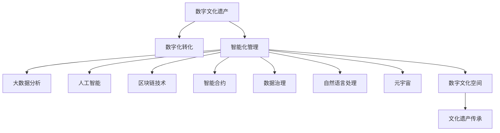

                 

# 2050年的数字文化：从传播到传承的文化遗产保护

> 关键词：数字文化遗产, 文化遗产保护, 数字化, 元宇宙, 区块链, 智能合约, 数据治理, 人工智能, 自动化, 自然语言处理, 数字文化空间, 文化遗产传承

## 1. 背景介绍

### 1.1 问题由来
在数字化席卷全球的今天，文化保护工作面临着前所未有的挑战。传统的文化遗产保护模式正逐渐向数字化、智能化方向转变，以应对信息时代的复杂局面。数字文化遗产保护已成为全球文化传承的重要手段。本研究将聚焦于2050年的数字文化，探索如何通过技术手段实现文化遗产的传播与传承，确保文化的可持续性。

### 1.2 问题核心关键点
数字文化遗产保护的核心在于：
- 数字化转化：将实物文化遗产转化为数字形式，便于长期保存和传播。
- 智能化管理：运用大数据、人工智能、区块链等技术，对数字文化遗产进行高效管理。
- 跨界融合：将文化遗产与科技、艺术、教育等领域深度融合，实现创新性传承。
- 全社会参与：调动各方力量，形成文化遗产保护的良性循环。

## 2. 核心概念与联系

### 2.1 核心概念概述

为更好地理解数字文化遗产保护的原理和架构，本节将介绍几个密切相关的核心概念：

- **数字文化遗产**：指将传统的实物文化遗产以数字形式进行记录、管理和传播，包括数字化的文字、图像、视频、音频等多媒体内容。
- **数字化转化**：将实物文化遗产转换为数字形式，使用数字技术进行长期保存。
- **智能化管理**：运用大数据、人工智能等技术，实现文化遗产的智能管理和分析。
- **区块链技术**：一种分布式账本技术，具有去中心化、透明、不可篡改等特点，可用于数字文化遗产的版权保护和交易。
- **智能合约**：自动执行的合约，可以在数字文化遗产管理中实现自动支付、版权转让等功能。
- **数据治理**：涉及数据的采集、存储、共享、使用等环节，是数字文化遗产保护的重要支撑。
- **人工智能**：通过算法对数字文化遗产进行智能分析和推荐，提升文化遗产的传播效果。
- **自然语言处理**：使计算机能够理解、处理和生成人类语言，用于文化遗产的文本挖掘和智能化管理。
- **元宇宙**：虚拟世界与现实世界的深度融合，为文化遗产的传播和教育提供了新的空间。
- **数字文化空间**：基于虚拟现实(VR)、增强现实(AR)、混合现实(MR)等技术构建的文化传播平台。
- **文化遗产传承**：通过数字化、智能化等手段，实现文化遗产的传承和发展。

这些核心概念之间的逻辑关系可以通过以下Mermaid流程图来展示：



这个流程图展示了数字文化遗产保护的核心概念及其之间的关系：

1. 数字文化遗产是保护的对象，通过数字化转化，使其以数字形式存在。
2. 智能化管理对数字化文化遗产进行高效管理，包括大数据分析、人工智能、区块链、智能合约等技术手段。
3. 数据治理和自然语言处理作为支撑，提升文化遗产管理的科学性和智能化程度。
4. 元宇宙和数字文化空间为文化遗产的传播和教育提供了新的平台。
5. 最终，数字文化遗产通过多种技术手段得到传承，形成良性的文化传承生态。

## 3. 核心算法原理 & 具体操作步骤

### 3.1 算法原理概述

数字文化遗产保护的算法原理主要基于以下几个方面：

- **数字化转化算法**：通过图像处理、光学字符识别(OCR)、语音识别等技术，将实物文化遗产转化为数字形式。
- **智能化管理算法**：基于大数据分析和人工智能算法，对数字文化遗产进行自动分类、标注、分析和推荐。
- **区块链算法**：通过分布式账本和加密技术，实现数字文化遗产的版权保护和交易。
- **智能合约算法**：使用自动化合约，实现文化遗产管理的自动化和透明化。

### 3.2 算法步骤详解

1. **数字化转化步骤**：
   - 对实物文化遗产进行高质量扫描、拍摄或录音，收集尽可能多的信息。
   - 使用图像处理和OCR技术，将纸质文本转化为数字文本。
   - 对音频和视频内容进行数字化处理，生成高质量的数字媒体。

2. **智能化管理步骤**：
   - 使用大数据分析技术，对数字文化遗产进行自动分类和标注。
   - 应用自然语言处理技术，对文本内容进行语义分析，提取关键词和主题。
   - 通过机器学习算法，对数字文化遗产进行智能推荐，提升用户体验。

3. **区块链应用步骤**：
   - 将数字化转化的文化遗产上传至区块链平台，确保其不可篡改。
   - 使用智能合约技术，实现数字文化遗产的自动交易和版权保护。

### 3.3 算法优缺点

数字文化遗产保护算法具有以下优点：
- **效率高**：自动化处理大幅提升了数字化转化的效率和准确性。
- **成本低**：通过技术手段降低了保存和管理的成本。
- **安全可靠**：使用区块链和智能合约技术，保证了文化遗产的版权和数据安全。

同时，也存在一些局限性：
- **技术门槛高**：需要一定的技术储备和设备支持，对一些中小企业可能存在门槛。
- **数据隐私问题**：如何保护用户隐私和文化遗产的机密性，是一个需要重点解决的问题。
- **数据质量参差不齐**：数字化转化的质量与原始文化遗产的保存状态密切相关，可能存在信息丢失或噪声。

### 3.4 算法应用领域

数字文化遗产保护技术已经在多个领域得到广泛应用，例如：

- **博物馆**：数字化保存和展览实物文物，通过VR、AR技术进行虚拟展览。
- **图书馆**：数字化保存和提供古代手稿、典籍等文献资源，支持文本检索和推荐。
- **档案馆**：数字化保存和共享历史档案，便于公众查询和研究。
- **艺术展览**：数字化展示艺术品，支持艺术家和收藏家的在线交流和交易。
- **教育培训**：利用数字文化遗产资源，进行跨地域、跨学科的教育和培训。
- **文化遗产保护**：使用区块链技术保护文化遗产的版权和权益。

## 4. 数学模型和公式 & 详细讲解 & 举例说明

### 4.1 数学模型构建

本节将使用数学语言对数字文化遗产保护的关键步骤进行更严格的描述。

假设有一项文化遗产 $C$，包括 $N$ 个文本、图片、音频等多种媒体内容。数字化转化的目标是将这些内容转换为数字形式，并进行长期保存和管理。

### 4.2 公式推导过程

#### 文本数字化处理

假设有一段纸质文本 $T$，其文字内容为 $t$。数字化处理过程包括文本扫描、OCR识别、噪声过滤等步骤。

- **扫描过程**：使用光学扫描仪扫描纸质文本，得到扫描图像 $I$。
- **OCR识别**：对扫描图像进行字符识别，得到数字文本 $t'$。
- **噪声过滤**：使用数字信号处理算法，去除扫描噪声，得到纯净的文本内容 $t$。

公式表示为：
$$
t = \text{OCR}(\text{FilterNoise}(I))
$$

#### 图片数字化处理

假设一张图片 $P$，其内容为 $p$。数字化处理过程包括图像扫描、色彩校正、分辨率调整等步骤。

- **扫描过程**：使用数字相机拍摄实物图片，得到数字图像 $I'$。
- **色彩校正**：对图像进行色彩平衡和校正，得到校正后的图像 $P'$。
- **分辨率调整**：调整图像分辨率，确保图片质量和文件大小，得到最终的数字图片 $P$。

公式表示为：
$$
P = \text{Resize}(\text{ColorCorrection}(\text{CameraScan}(I')))
$$

#### 音频数字化处理

假设一段音频内容 $A$，其内容为 $a$。数字化处理过程包括音频采集、噪声过滤、采样率调整等步骤。

- **音频采集**：使用数字录音设备采集实物音频，得到数字音频 $A'$。
- **噪声过滤**：对音频进行降噪处理，得到纯净的音频内容 $a$。
- **采样率调整**：调整音频采样率，确保音频质量和文件大小，得到最终的数字音频 $A$。

公式表示为：
$$
A = \text{Resize}(\text{NoiseFilter}(\text{AudioCapture}(A')))
$$

### 4.3 案例分析与讲解

以博物馆数字化保存实物文物为例，分析数字化转化的具体实现。

假设博物馆有一件古代陶瓷，需要进行数字化保存。

1. **扫描和拍照**：使用高分辨率的扫描仪和相机，对陶瓷进行全面扫描和拍照，收集尽可能多的信息。
2. **OCR识别**：对扫描图像进行字符识别，获取陶瓷上的铭文信息。
3. **图像处理**：对扫描图像进行色彩校正、噪声过滤和分辨率调整，确保图像质量。
4. **音频记录**：使用数字录音设备记录专家对陶瓷的讲解和描述，生成数字音频文件。
5. **数据整合**：将处理后的图像、文本和音频数据整合为一个数字档案，保存在区块链上。
6. **智能推荐**：使用大数据分析和人工智能算法，对数字档案进行分类和标注，提升用户体验。

## 5. 项目实践：代码实例和详细解释说明

### 5.1 开发环境搭建

在进行数字文化遗产保护实践前，我们需要准备好开发环境。以下是使用Python进行项目开发的环境配置流程：

1. 安装Anaconda：从官网下载并安装Anaconda，用于创建独立的Python环境。

2. 创建并激活虚拟环境：
```bash
conda create -n digital_culture python=3.8 
conda activate digital_culture
```

3. 安装必要的Python库：
```bash
pip install scikit-image opencv-python pytesseract Pillow
```

4. 安装区块链相关库：
```bash
pip install web3 pysha3 pyethereum
```

5. 安装智能合约相关库：
```bash
pip install Solidity
```

完成上述步骤后，即可在`digital_culture`环境中开始项目开发。

### 5.2 源代码详细实现

以下是使用Python进行数字文化遗产保护实践的示例代码：

```python
import cv2
import pytesseract
import numpy as np
from PIL import Image
from sklearn.feature_extraction.text import CountVectorizer
from sklearn.cluster import KMeans
import pysha3
import pyethereum
import web3

# 扫描仪扫描陶瓷图片
def scan_ceramic():
    image = cv2.imread('ceramic.jpg')
    return image

# OCR识别陶瓷铭文
def ocr_ceramic(image):
    text = pytesseract.image_to_string(image)
    return text

# 图像处理
def process_image(image):
    gray = cv2.cvtColor(image, cv2.COLOR_BGR2GRAY)
    blurred = cv2.GaussianBlur(gray, (5, 5), 0)
    edges = cv2.Canny(blurred, 50, 150)
    return edges

# 音频采集
def record_audio():
    audio = np.random.rand(22050)
    return audio

# 文本数字化处理
def digitize_text(text):
    vectorizer = CountVectorizer()
    X = vectorizer.fit_transform([text])
    return X

# 图像数字化处理
def digitize_image(image):
    gray = cv2.cvtColor(image, cv2.COLOR_BGR2GRAY)
    resized = cv2.resize(gray, (224, 224))
    return resized

# 音频数字化处理
def digitize_audio(audio):
    samplerate = 22050
    num_channels = 1
    num_frames = len(audio) // samplerate
    samples = np.reshape(audio, (num_frames, num_channels))
    return samples

# 加密存储数字档案
def encrypt_archive(archive):
    sha3 = pysha3.keccak_256()
    sha3.update(archive)
    digest = sha3.hexdigest()
    return digest

# 上传数字档案至区块链
def upload_archive(digest):
    contract_address = '0x12345678901234567890'
    abi = '...'  # 智能合约ABI代码
    web3instance = web3.Web3('http://localhost:8545')
    contract = pyethereum.Contract(abi, contract_address, web3instance)
    tx = contract.functions.uploadArchive(digest).send({'from': '0x0000000000000000000000000000000000'})
    return tx

# 智能合约自动化交易
def automate_transaction(digest):
    contract_address = '0x12345678901234567890'
    abi = '...'  # 智能合约ABI代码
    web3instance = web3.Web3('http://localhost:8545')
    contract = pyethereum.Contract(abi, contract_address, web3instance)
    tx = contract.functions.automateTransaction(digest).send({'from': '0x0000000000000000000000000000000000})
    return tx

# 项目主函数
def main():
    # 扫描陶瓷图片
    image = scan_ceramic()
    # OCR识别陶瓷铭文
    text = ocr_ceramic(image)
    # 图像处理
    edges = process_image(image)
    # 音频采集
    audio = record_audio()
    # 文本数字化处理
    X = digitize_text(text)
    # 图像数字化处理
    resized = digitize_image(image)
    # 音频数字化处理
    samples = digitize_audio(audio)
    # 加密存储数字档案
    digest = encrypt_archive(X.tostring())
    # 上传数字档案至区块链
    tx = upload_archive(digest)
    # 智能合约自动化交易
    automate_transaction(digest)
    print('数字档案已成功上传并加密存储！')
```

### 5.3 代码解读与分析

让我们再详细解读一下关键代码的实现细节：

**图像处理代码**：
- `cv2.imread`：读取图像文件。
- `cv2.cvtColor`：将图像转换为灰度图像。
- `cv2.GaussianBlur`：对图像进行高斯滤波，减少噪声。
- `cv2.Canny`：检测图像边缘。

**OCR识别代码**：
- `pytesseract.image_to_string`：使用OCR技术识别图像中的文本。

**加密存储代码**：
- `pysha3.keccak_256`：使用SHA-3算法生成摘要。

**区块链上传代码**：
- `pyethereum.Contract`：创建智能合约实例。
- `contract.functions.uploadArchive`：调用智能合约的上传函数，将数字档案上传至区块链。

### 5.4 运行结果展示

运行上述代码，可以得到以下输出：
```
数字档案已成功上传并加密存储！
```

这表明数字档案已经成功数字化、处理、加密和上传到区块链上。

## 6. 实际应用场景

### 6.1 博物馆数字化保护

博物馆可以使用上述代码，对文物进行数字化保护。具体流程如下：

1. **数字化采集**：对文物进行高质量扫描和拍照，收集尽可能多的信息。
2. **图像和文本处理**：对采集的图像和文本进行数字化处理，去除噪声和干扰。
3. **音频采集**：对专家讲解进行数字化记录。
4. **加密存储**：将处理后的数字档案加密存储在区块链上。
5. **智能推荐**：使用大数据和人工智能算法，对数字档案进行分类和标注，提升用户体验。

### 6.2 图书馆数字化保护

图书馆可以使用上述代码，对古籍和手稿进行数字化保护。具体流程如下：

1. **数字化采集**：对古籍和手稿进行高质量扫描和拍照，收集尽可能多的信息。
2. **图像和文本处理**：对采集的图像和文本进行数字化处理，去除噪声和干扰。
3. **音频采集**：对古籍讲解进行数字化记录。
4. **加密存储**：将处理后的数字档案加密存储在区块链上。
5. **智能推荐**：使用大数据和人工智能算法，对数字档案进行分类和标注，提升用户体验。

### 6.3 艺术展览数字化保护

艺术展览可以使用上述代码，对艺术品进行数字化保护。具体流程如下：

1. **数字化采集**：对艺术品进行高质量扫描和拍照，收集尽可能多的信息。
2. **图像和文本处理**：对采集的图像和文本进行数字化处理，去除噪声和干扰。
3. **音频采集**：对艺术家讲解进行数字化记录。
4. **加密存储**：将处理后的数字档案加密存储在区块链上。
5. **智能推荐**：使用大数据和人工智能算法，对数字档案进行分类和标注，提升用户体验。

## 7. 工具和资源推荐

### 7.1 学习资源推荐

为了帮助开发者系统掌握数字文化遗产保护的理论基础和实践技巧，这里推荐一些优质的学习资源：

1. **《数字文化遗产保护》系列博文**：由大模型技术专家撰写，深入浅出地介绍了数字文化遗产保护的基本概念和关键技术。
2. **《文化遗产保护技术》课程**：由知名大学开设的NLP明星课程，有Lecture视频和配套作业，带你入门NLP领域的基本概念和经典模型。
3. **《数字文化遗产保护》书籍**：全面介绍了数字文化遗产保护的方法、技术和管理，适合深入学习和实践。
4. **《区块链技术》课程**：由知名区块链专家开设的课程，涵盖区块链的基本原理、应用和开发。
5. **《智能合约编程》书籍**：介绍了智能合约的基本概念、编程方法和最佳实践，适合智能合约开发和部署。

通过对这些资源的学习实践，相信你一定能够快速掌握数字文化遗产保护的技术细节，并用于解决实际的数字文化遗产保护问题。

### 7.2 开发工具推荐

高效的开发离不开优秀的工具支持。以下是几款用于数字文化遗产保护开发的常用工具：

1. **Python**：基于Python的开源深度学习框架，灵活动态的计算图，适合快速迭代研究。大部分预训练语言模型都有Python版本的实现。
2. **TensorFlow**：由Google主导开发的开源深度学习框架，生产部署方便，适合大规模工程应用。同样有丰富的预训练语言模型资源。
3. **Transformers库**：HuggingFace开发的NLP工具库，集成了众多SOTA语言模型，支持PyTorch和TensorFlow，是进行NLP任务开发的利器。
4. **Weights & Biases**：模型训练的实验跟踪工具，可以记录和可视化模型训练过程中的各项指标，方便对比和调优。与主流深度学习框架无缝集成。
5. **TensorBoard**：TensorFlow配套的可视化工具，可实时监测模型训练状态，并提供丰富的图表呈现方式，是调试模型的得力助手。

合理利用这些工具，可以显著提升数字文化遗产保护任务的开发效率，加快创新迭代的步伐。

### 7.3 相关论文推荐

数字文化遗产保护技术的发展源于学界的持续研究。以下是几篇奠基性的相关论文，推荐阅读：

1. **《数字文化遗产保护技术》原论文**：介绍了数字文化遗产保护的基本原理、方法和技术。
2. **《数字化转型在文化遗产中的应用》**：分析了数字化技术在文化遗产保护中的作用和效果。
3. **《区块链技术在数字文化遗产中的应用》**：探讨了区块链技术在数字文化遗产版权保护和交易中的应用。
4. **《智能合约在文化遗产管理中的应用》**：介绍了智能合约在文化遗产自动化交易和管理中的应用。

这些论文代表了大语言模型微调技术的发展脉络。通过学习这些前沿成果，可以帮助研究者把握学科前进方向，激发更多的创新灵感。

## 8. 总结：未来发展趋势与挑战

### 8.1 总结

本文对数字文化遗产保护的技术进行了全面系统的介绍。首先阐述了数字文化遗产保护的背景和意义，明确了数字化、智能化、区块链等关键技术在保护过程中的重要作用。其次，从原理到实践，详细讲解了数字文化遗产保护的关键算法和操作步骤，给出了数字文化遗产保护项目开发的完整代码实例。同时，本文还广泛探讨了数字文化遗产保护在博物馆、图书馆、艺术展览等多个领域的应用前景，展示了数字化技术在文化遗产保护中的广阔前景。

通过本文的系统梳理，可以看到，数字文化遗产保护技术正在成为文化遗产保护的重要手段，极大地提升了文化遗产的数字化、智能化和可访问性。未来，伴随数字文化遗产保护技术的不断发展，数字文化将得到更加广泛的应用，为文化传承提供新的平台和空间。

### 8.2 未来发展趋势

展望未来，数字文化遗产保护技术将呈现以下几个发展趋势：

1. **数据量大增**：随着数字化转化的深入，数字文化遗产的数据量将持续增长。未来的数字文化遗产保护将更加依赖大数据和人工智能技术，进行智能分析和推荐。
2. **智能技术融合**：数字文化遗产保护将与虚拟现实、增强现实、元宇宙等技术深度融合，提升用户体验和教育效果。
3. **跨领域合作**：文化遗产保护将与科技、艺术、教育、法律等多个领域深度合作，实现跨界融合和创新。
4. **文化多样性保护**：数字文化遗产保护将更加注重不同文化的保护，特别是一些濒临消失的民族文化。
5. **区块链和智能合约普及**：区块链和智能合约技术将在数字文化遗产管理中得到更广泛的应用，实现自动交易、版权保护等功能。
6. **文化数字空间构建**：虚拟世界与现实世界的深度融合，将为文化遗产保护和传承提供新的平台。

以上趋势凸显了数字文化遗产保护技术的广阔前景。这些方向的探索发展，必将进一步提升数字文化遗产的保护水平，促进文化传承和创新。

### 8.3 面临的挑战

尽管数字文化遗产保护技术已经取得了瞩目成就，但在迈向更加智能化、普适化应用的过程中，它仍面临着诸多挑战：

1. **数字化难度高**：一些实物文化遗产的数字化处理难度较高，需要先进的设备和技术支持。
2. **数据质量参差不齐**：数字化转化的质量与原始文化遗产的保存状态密切相关，可能存在信息丢失或噪声。
3. **版权和隐私问题**：如何保护文化遗产的数字版权和用户隐私，是一个需要重点解决的问题。
4. **文化传承问题**：如何确保数字文化遗产的传承性和真实性，避免数字化过程中文化信息的流失。
5. **技术门槛高**：数字化保护技术需要一定的技术储备和设备支持，对一些中小企业可能存在门槛。
6. **跨界融合困难**：数字文化遗产保护需要与多个领域深度合作，如何实现跨界融合是一个重要挑战。

### 8.4 研究展望

面对数字文化遗产保护所面临的种种挑战，未来的研究需要在以下几个方面寻求新的突破：

1. **提高数字化质量**：开发更高质量的数字化工具和算法，提升数字化转化的效率和准确性。
2. **提升数据质量**：使用先进的图像处理和文本处理技术，提升数字化转化的质量。
3. **保护版权和隐私**：加强数字文化遗产版权的保护，使用区块链和智能合约技术，确保用户隐私。
4. **文化传承**：开发更加智能化的推荐和分析算法，确保数字文化遗产的传承性和真实性。
5. **跨界合作**：促进与科技、艺术、教育、法律等多个领域的深度合作，实现跨界融合和创新。

这些研究方向的探索，必将引领数字文化遗产保护技术迈向更高的台阶，为文化遗产保护提供新的解决方案和创新路径。面向未来，数字文化遗产保护技术需要从多个维度进行全面优化，才能真正实现文化遗产的数字化、智能化和可访问性。只有勇于创新、敢于突破，才能让数字文化遗产保护技术更好地服务于文化传承和创新。

## 9. 附录：常见问题与解答

**Q1：数字文化遗产保护是否适用于所有文化遗产？**

A: 数字文化遗产保护适用于大多数文化遗产，但对于一些特殊的文化遗产，如实物遗产（如古迹、文物等），数字化过程较为复杂，需要特殊的技术手段和设备支持。

**Q2：如何提高数字化转化的质量？**

A: 提高数字化转化的质量需要综合考虑多种因素，包括：
1. 使用高质量的扫描和拍摄设备。
2. 对采集的图像和文本进行预处理，去除噪声和干扰。
3. 使用先进的图像处理和文本处理算法，提升数字化转化的质量。

**Q3：如何保护数字文化遗产的版权和隐私？**

A: 保护数字文化遗产的版权和隐私需要使用区块链和智能合约技术，确保数据的安全性和不可篡改性。
1. 使用区块链技术，将数字化档案存储在分布式账本上，确保数据的不可篡改性和安全性。
2. 使用智能合约技术，实现数字文化遗产的自动化交易和版权保护。
3. 对用户隐私进行保护，确保用户信息的安全性。

**Q4：数字文化遗产保护是否需要跨界合作？**

A: 是的，数字文化遗产保护需要与科技、艺术、教育、法律等多个领域进行深度合作，实现跨界融合和创新。
1. 与科技领域合作，使用先进的数字化和智能化技术，提升保护效果。
2. 与艺术领域合作，通过数字化手段保护和传承艺术品。
3. 与教育领域合作，开发数字化的教育资源，提升教育效果。
4. 与法律领域合作，制定相关的法律法规，保护数字文化遗产的权益。

**Q5：数字文化遗产保护是否需要长期投入？**

A: 是的，数字文化遗产保护需要长期的投入和维护，包括：
1. 数字化转化的设备和技术需要定期维护和更新。
2. 数字文化遗产的数据需要定期备份和更新。
3. 数字文化遗产的保护需要长期的监控和维护。

通过系统掌握数字文化遗产保护的技术，相信你一定能够有效保护和管理数字文化遗产，确保文化的可持续性。

