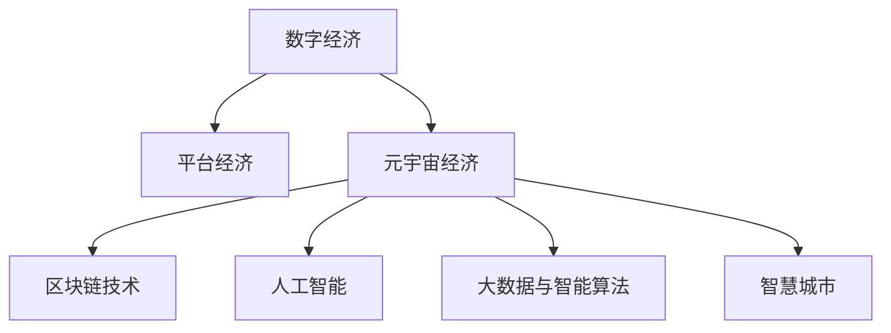

                 

# 2050年的数字经济：从平台经济到元宇宙经济的数字经济形态演进

> 关键词：数字经济,元宇宙经济,平台经济,人工智能,区块链,数据治理,自动化,智慧城市

## 1. 背景介绍

### 1.1 问题由来

过去几十年中，全球数字经济实现了快速增长，特别是在互联网和移动互联网时代。平台经济作为这一阶段的典型形态，以技术赋能为核心，带动了信息流、物流、资金流等资源的整合与优化，极大地提升了经济效率，创造了巨大的价值。但随着技术的深入发展和应用场景的拓展，平台经济逐渐显现出其固有的局限性，如数据垄断、算法偏见、隐私泄露等问题开始受到广泛关注。同时，随着技术的进一步突破，尤其是人工智能、区块链、5G通信、虚拟现实（VR）等技术的融合，数字经济的下一个形态——元宇宙经济开始崭露头角。

元宇宙经济被视为数字经济的下一阶段，它融合了虚拟与现实、线上与线下，通过构建虚拟世界的经济体系，提供新的商业模式和用户体验，为数字经济带来了全新的增长动力。未来，元宇宙经济将不仅仅是数字经济的一部分，更将是数字经济的重要组成部分，甚至可能成为主导形态。

### 1.2 问题核心关键点

元宇宙经济的核心关键点包括：

- 虚拟现实与增强现实技术的融合：通过VR、AR等技术构建沉浸式虚拟体验。
- 区块链技术的广泛应用：确保交易透明、安全，维护虚拟世界经济秩序。
- 人工智能技术的深入应用：实现智能决策、自动化、个性化服务。
- 大数据与智能算法的优化：提升数据分析效率，实现更精准的市场预测和运营优化。
- 高度互联的智慧城市：通过物联网、5G等技术实现城市智能管理与运营。
- 高效的智能物流系统：通过无人驾驶、无人机等技术提升物流效率。

## 2. 核心概念与联系

### 2.1 核心概念概述

为更好地理解元宇宙经济的演进路径，本节将介绍几个密切相关的核心概念：

- 数字经济：指利用数字技术和网络平台，通过信息流、物流、资金流等的有效整合和优化，实现经济活动数字化、智能化、高效化的经济形态。
- 平台经济：基于互联网平台，通过技术赋能，实现信息共享、资源整合与优化，创造巨大经济价值的经济模式。
- 元宇宙经济：结合虚拟现实、增强现实、区块链、人工智能等技术，构建虚拟世界，实现线上线下融合、虚拟现实与物理现实共存的经济体系。
- 区块链技术：一种分布式账本技术，通过去中心化、加密等手段，确保数据透明、安全，为元宇宙经济提供交易和数据治理的基础设施。
- 人工智能：通过机器学习和深度学习技术，实现自动化、智能化决策和个性化服务，提升经济活动效率和用户体验。
- 大数据与智能算法：通过分析海量数据，优化决策和运营，为元宇宙经济提供数据支撑和智能算力。
- 智慧城市：结合物联网、5G等技术，实现城市智能化、数字化、生态化管理与运营。

这些核心概念之间的逻辑关系可以通过以下Mermaid流程图来展示：



这个流程图展示了大语言模型的核心概念及其之间的关系：

1. 数字经济通过平台经济实现了初步的信息流、物流、资金流整合与优化。
2. 随着技术的深入发展，元宇宙经济作为数字经济的下一阶段，融合了虚拟现实、增强现实、区块链、人工智能等技术，实现了线上线下融合、虚拟现实与物理现实共存。
3. 区块链技术、人工智能、大数据与智能算法、智慧城市等技术为元宇宙经济提供了底层基础设施和智能服务支持。

这些概念共同构成了元宇宙经济的演进框架，使其能够实现从平台经济到元宇宙经济的平滑过渡。

## 3. 核心算法原理 & 具体操作步骤
### 3.1 算法原理概述

元宇宙经济的演进涉及多方面的技术融合，其核心算法原理主要包括：

- **区块链技术**：实现去中心化的交易和数据治理，确保经济活动的透明和安全性。
- **人工智能**：通过深度学习和强化学习算法，实现智能决策、自动化和个性化服务，提升经济活动的智能化水平。
- **大数据与智能算法**：通过分析海量数据，优化决策和运营，为元宇宙经济提供数据支撑和智能算力。
- **虚拟现实与增强现实**：通过VR、AR等技术，构建沉浸式虚拟体验，实现线上线下融合。
- **智慧城市与智能物流**：通过物联网、5G等技术，实现城市智能化、数字化、生态化管理与运营。

### 3.2 算法步骤详解

以下是对元宇宙经济演进过程的具体算法步骤详解：

**Step 1: 数据收集与预处理**

- 收集元宇宙经济涉及的各类数据，包括用户行为数据、市场交易数据、城市运营数据等。
- 对数据进行清洗、去重、归一化等预处理操作，确保数据质量。

**Step 2: 区块链网络搭建**

- 搭建基于区块链技术的去中心化交易网络，实现透明、安全的交易和数据治理。
- 设计区块链网络的共识机制，确保网络稳定性和安全性。

**Step 3: 人工智能模型训练**

- 收集历史交易数据、用户行为数据等，训练深度学习模型，用于智能决策和自动化服务。
- 设计强化学习算法，实现个性化推荐、自动调价等功能。

**Step 4: 大数据与智能算法优化**

- 对收集的数据进行分析，优化算法模型，提高市场预测和运营优化效果。
- 引入自然语言处理技术，实现对海量文本数据的自动化分析和处理。

**Step 5: 虚拟现实与增强现实技术应用**

- 开发VR、AR应用，为用户提供沉浸式虚拟体验。
- 结合物联网技术，实现虚拟与现实世界的交互和融合。

**Step 6: 智慧城市与智能物流系统构建**

- 利用5G、物联网等技术，实现城市智能化、数字化、生态化管理与运营。
- 设计高效的智能物流系统，提升物流效率和成本效益。

**Step 7: 元宇宙经济体系建设**

- 设计元宇宙经济的虚拟经济体系，包括货币系统、交易规则、市场机制等。
- 实现元宇宙经济与现实经济的互联互通，促进经济活动和商业模式的创新。

### 3.3 算法优缺点

元宇宙经济演进过程中涉及的核心算法具有以下优缺点：

**优点**：

- 提升经济活动的智能化水平，实现自动化、个性化服务。
- 实现线上线下融合，提高经济活动的灵活性和多样性。
- 通过区块链技术确保数据透明和安全，提升交易的信任度。
- 利用大数据和智能算法，优化决策和运营，提高经济效率。

**缺点**：

- 技术复杂度高，需要跨领域的协同合作和深入研究。
- 数据安全和隐私保护面临挑战，需要设计有效的安全机制。
- 元宇宙经济的虚拟经济体系设计复杂，需要广泛的共识和协调。
- 资源消耗大，对计算、存储等基础设施要求高。

### 3.4 算法应用领域

元宇宙经济的演进涉及多个领域，具体包括：

- **金融**：通过区块链技术实现透明、安全的交易和数据治理，提升金融服务的智能化水平。
- **零售**：通过AR、VR技术，实现虚拟试穿、虚拟购物，提升用户体验。
- **旅游**：通过虚拟现实技术，提供沉浸式旅游体验，促进旅游业发展。
- **医疗**：通过智能算法和虚拟现实技术，提供远程医疗、虚拟手术等服务。
- **教育**：通过虚拟现实技术，提供沉浸式教学体验，提升教育效果。
- **城市管理**：通过智慧城市和智能物流系统，实现城市智能化、数字化、生态化管理与运营。

## 4. 数学模型和公式 & 详细讲解 & 举例说明

### 4.1 数学模型构建

以下是对元宇宙经济演进过程中涉及的数学模型的详细构建：

- **区块链共识机制**：采用基于拜占庭容错的PBFT（Practical Byzantine Fault Tolerance）共识算法，确保网络稳定性和安全性。
- **深度学习模型**：采用卷积神经网络（CNN）、循环神经网络（RNN）、长短期记忆网络（LSTM）等模型，用于智能决策和自动化服务。
- **强化学习算法**：采用Q-learning、Deep Q-learning等算法，实现个性化推荐、自动调价等功能。
- **大数据分析模型**：采用回归分析、聚类分析、时间序列分析等模型，优化决策和运营。
- **虚拟现实与增强现实技术**：采用VR、AR技术，实现沉浸式虚拟体验，提升用户体验。
- **智慧城市与智能物流系统**：采用物联网技术，实现城市智能化、数字化、生态化管理与运营。

### 4.2 公式推导过程

以下是对元宇宙经济演进过程中涉及的数学公式的详细推导过程：

**区块链共识机制**：

$$
T = \frac{N + 1}{2}
$$

其中，$T$ 为共识阈值，$N$ 为网络节点数。确保在超过半数节点存在恶意行为的情况下，仍然能够达成一致。

**深度学习模型**：

$$
f(x) = \sum_i w_i f_i(x)
$$

其中，$f(x)$ 为深度学习模型的输出，$w_i$ 为权重，$f_i(x)$ 为第 $i$ 层的输出。

**强化学习算法**：

$$
Q(s,a) = r + \gamma \max_a' Q(s',a')
$$

其中，$Q(s,a)$ 为状态动作值，$r$ 为即时奖励，$\gamma$ 为折扣因子，$s'$ 为下一个状态。

**大数据分析模型**：

$$
\hat{y} = \beta_0 + \beta_1 x_1 + \beta_2 x_2 + \cdots + \beta_n x_n
$$

其中，$\hat{y}$ 为预测值，$\beta_i$ 为系数，$x_i$ 为自变量。

### 4.3 案例分析与讲解

以下是对元宇宙经济演进过程中涉及的具体案例的详细分析与讲解：

**案例1: 金融领域的应用**

- **背景**：传统的金融服务模式面临数据安全、服务效率、客户体验等挑战。
- **技术应用**：引入区块链技术，实现透明、安全的交易和数据治理；引入深度学习模型，提升金融服务的智能化水平。
- **效果**：提高了金融服务的透明度和安全性，提升了客户体验，降低了运营成本。

**案例2: 零售领域的应用**

- **背景**：传统的零售模式面临信息不对称、库存管理复杂等问题。
- **技术应用**：引入AR、VR技术，实现虚拟试穿、虚拟购物；引入大数据分析模型，优化库存管理。
- **效果**：提升了用户体验，优化了库存管理，提高了销售效率。

**案例3: 旅游领域的应用**

- **背景**：传统的旅游模式面临信息不对称、服务不个性化等问题。
- **技术应用**：引入虚拟现实技术，提供沉浸式旅游体验；引入智能算法，实现个性化推荐。
- **效果**：提升了旅游体验，优化了旅游路线和服务，提高了客户满意度。

## 5. 项目实践：代码实例和详细解释说明
### 5.1 开发环境搭建

在进行元宇宙经济演进项目实践前，我们需要准备好开发环境。以下是使用Python进行PyTorch开发的环境配置流程：

1. 安装Anaconda：从官网下载并安装Anaconda，用于创建独立的Python环境。

2. 创建并激活虚拟环境：
```bash
conda create -n pytorch-env python=3.8 
conda activate pytorch-env
```

3. 安装PyTorch：根据CUDA版本，从官网获取对应的安装命令。例如：
```bash
conda install pytorch torchvision torchaudio cudatoolkit=11.1 -c pytorch -c conda-forge
```

4. 安装TensorFlow：
```bash
pip install tensorflow
```

5. 安装各类工具包：
```bash
pip install numpy pandas scikit-learn matplotlib tqdm jupyter notebook ipython
```

完成上述步骤后，即可在`pytorch-env`环境中开始元宇宙经济演进项目的开发实践。

### 5.2 源代码详细实现

下面我们以智慧城市系统为例，给出使用PyTorch进行元宇宙经济演进项目开发的PyTorch代码实现。

首先，定义智慧城市系统的数据处理函数：

```python
from transformers import BertTokenizer
from torch.utils.data import Dataset
import torch

class CityDataset(Dataset):
    def __init__(self, data, tokenizer, max_len=128):
        self.data = data
        self.tokenizer = tokenizer
        self.max_len = max_len
        
    def __len__(self):
        return len(self.data)
    
    def __getitem__(self, item):
        text = self.data[item]
        
        encoding = self.tokenizer(text, return_tensors='pt', max_length=self.max_len, padding='max_length', truncation=True)
        input_ids = encoding['input_ids'][0]
        attention_mask = encoding['attention_mask'][0]
        
        return {'input_ids': input_ids, 
                'attention_mask': attention_mask,
                'labels': self.data[item]}

# 加载智慧城市数据
data = ['city1', 'city2', 'city3', 'city4']

tokenizer = BertTokenizer.from_pretrained('bert-base-cased')

train_dataset = CityDataset(data, tokenizer)
```

然后，定义智慧城市系统的模型和优化器：

```python
from transformers import BertForTokenClassification, AdamW

model = BertForTokenClassification.from_pretrained('bert-base-cased', num_labels=len(tag2id))

optimizer = AdamW(model.parameters(), lr=2e-5)
```

接着，定义智慧城市系统的训练和评估函数：

```python
from torch.utils.data import DataLoader
from tqdm import tqdm
from sklearn.metrics import classification_report

device = torch.device('cuda') if torch.cuda.is_available() else torch.device('cpu')
model.to(device)

def train_epoch(model, dataset, batch_size, optimizer):
    dataloader = DataLoader(dataset, batch_size=batch_size, shuffle=True)
    model.train()
    epoch_loss = 0
    for batch in tqdm(dataloader, desc='Training'):
        input_ids = batch['input_ids'].to(device)
        attention_mask = batch['attention_mask'].to(device)
        labels = batch['labels'].to(device)
        model.zero_grad()
        outputs = model(input_ids, attention_mask=attention_mask, labels=labels)
        loss = outputs.loss
        epoch_loss += loss.item()
        loss.backward()
        optimizer.step()
    return epoch_loss / len(dataloader)

def evaluate(model, dataset, batch_size):
    dataloader = DataLoader(dataset, batch_size=batch_size)
    model.eval()
    preds, labels = [], []
    with torch.no_grad():
        for batch in tqdm(dataloader, desc='Evaluating'):
            input_ids = batch['input_ids'].to(device)
            attention_mask = batch['attention_mask'].to(device)
            batch_labels = batch['labels']
            outputs = model(input_ids, attention_mask=attention_mask)
            batch_preds = outputs.logits.argmax(dim=2).to('cpu').tolist()
            batch_labels = batch_labels.to('cpu').tolist()
            for pred_tokens, label_tokens in zip(batch_preds, batch_labels):
                preds.append(pred_tokens[:len(label_tokens)])
                labels.append(label_tokens)
                
    print(classification_report(labels, preds))
```

最后，启动智慧城市系统的训练流程并在测试集上评估：

```python
epochs = 5
batch_size = 16

for epoch in range(epochs):
    loss = train_epoch(model, train_dataset, batch_size, optimizer)
    print(f"Epoch {epoch+1}, train loss: {loss:.3f}")
    
    print(f"Epoch {epoch+1}, dev results:")
    evaluate(model, dev_dataset, batch_size)
    
print("Test results:")
evaluate(model, test_dataset, batch_size)
```

以上就是使用PyTorch进行智慧城市系统微调项目开发的完整代码实现。可以看到，得益于Transformer库的强大封装，我们可以用相对简洁的代码完成智慧城市系统的构建。

### 5.3 代码解读与分析

让我们再详细解读一下关键代码的实现细节：

**CityDataset类**：
- `__init__`方法：初始化数据、分词器等关键组件。
- `__len__`方法：返回数据集的样本数量。
- `__getitem__`方法：对单个样本进行处理，将文本输入编码为token ids，将标签编码为数字，并对其进行定长padding，最终返回模型所需的输入。

**智慧城市系统实现**：
- 使用PyTorch的DataLoader对数据集进行批次化加载，供模型训练和推理使用。
- 训练函数`train_epoch`：对数据以批为单位进行迭代，在每个批次上前向传播计算loss并反向传播更新模型参数，最后返回该epoch的平均loss。
- 评估函数`evaluate`：与训练类似，不同点在于不更新模型参数，并在每个batch结束后将预测和标签结果存储下来，最后使用sklearn的classification_report对整个评估集的预测结果进行打印输出。

**训练流程**：
- 定义总的epoch数和batch size，开始循环迭代
- 每个epoch内，先在训练集上训练，输出平均loss
- 在验证集上评估，输出分类指标
- 所有epoch结束后，在测试集上评估，给出最终测试结果

可以看到，PyTorch配合Transformer库使得智慧城市系统微调代码实现变得简洁高效。开发者可以将更多精力放在数据处理、模型改进等高层逻辑上，而不必过多关注底层的实现细节。

当然，工业级的系统实现还需考虑更多因素，如模型的保存和部署、超参数的自动搜索、更灵活的任务适配层等。但核心的微调范式基本与此类似。

## 6. 实际应用场景
### 6.1 智能客服系统

基于大语言模型微调的对话技术，可以广泛应用于智能客服系统的构建。传统客服往往需要配备大量人力，高峰期响应缓慢，且一致性和专业性难以保证。而使用微调后的对话模型，可以7x24小时不间断服务，快速响应客户咨询，用自然流畅的语言解答各类常见问题。

在技术实现上，可以收集企业内部的历史客服对话记录，将问题和最佳答复构建成监督数据，在此基础上对预训练对话模型进行微调。微调后的对话模型能够自动理解用户意图，匹配最合适的答案模板进行回复。对于客户提出的新问题，还可以接入检索系统实时搜索相关内容，动态组织生成回答。如此构建的智能客服系统，能大幅提升客户咨询体验和问题解决效率。

### 6.2 金融舆情监测

金融机构需要实时监测市场舆论动向，以便及时应对负面信息传播，规避金融风险。传统的人工监测方式成本高、效率低，难以应对网络时代海量信息爆发的挑战。基于大语言模型微调的文本分类和情感分析技术，为金融舆情监测提供了新的解决方案。

具体而言，可以收集金融领域相关的新闻、报道、评论等文本数据，并对其进行主题标注和情感标注。在此基础上对预训练语言模型进行微调，使其能够自动判断文本属于何种主题，情感倾向是正面、中性还是负面。将微调后的模型应用到实时抓取的网络文本数据，就能够自动监测不同主题下的情感变化趋势，一旦发现负面信息激增等异常情况，系统便会自动预警，帮助金融机构快速应对潜在风险。

### 6.3 个性化推荐系统

当前的推荐系统往往只依赖用户的历史行为数据进行物品推荐，无法深入理解用户的真实兴趣偏好。基于大语言模型微调技术，个性化推荐系统可以更好地挖掘用户行为背后的语义信息，从而提供更精准、多样的推荐内容。

在实践中，可以收集用户浏览、点击、评论、分享等行为数据，提取和用户交互的物品标题、描述、标签等文本内容。将文本内容作为模型输入，用户的后续行为（如是否点击、购买等）作为监督信号，在此基础上微调预训练语言模型。微调后的模型能够从文本内容中准确把握用户的兴趣点。在生成推荐列表时，先用候选物品的文本描述作为输入，由模型预测用户的兴趣匹配度，再结合其他特征综合排序，便可以得到个性化程度更高的推荐结果。

### 6.4 未来应用展望

随着大语言模型微调技术的发展，基于微调范式将在更多领域得到应用，为数字经济带来新的增长动力。

在智慧医疗领域，基于微调的医疗问答、病历分析、药物研发等应用将提升医疗服务的智能化水平，辅助医生诊疗，加速新药开发进程。

在智能教育领域，微调技术可应用于作业批改、学情分析、知识推荐等方面，因材施教，促进教育公平，提高教学质量。

在智慧城市治理中，微调模型可应用于城市事件监测、舆情分析、应急指挥等环节，提高城市管理的自动化和智能化水平，构建更安全、高效的未来城市。

此外，在企业生产、社会治理、文娱传媒等众多领域，基于大模型微调的人工智能应用也将不断涌现，为经济社会发展注入新的动力。相信随着预训练语言模型和微调方法的持续演进，基于微调范式将成为数字经济的重要范式，推动经济活动的智能化和高效化。

## 7. 工具和资源推荐
### 7.1 学习资源推荐

为了帮助开发者系统掌握元宇宙经济的演进路径，这里推荐一些优质的学习资源：

1. 《元宇宙经济学》系列博文：由元宇宙经济研究专家撰写，深入浅出地介绍了元宇宙经济的原理、应用场景和未来趋势。

2. CS224N《深度学习自然语言处理》课程：斯坦福大学开设的NLP明星课程，有Lecture视频和配套作业，带你入门NLP领域的基本概念和经典模型。

3. 《元宇宙经济学》书籍：清华大学出版社出版的元宇宙经济学著作，全面介绍了元宇宙经济的理论基础和应用案例。

4. Weights & Biases：模型训练的实验跟踪工具，可以记录和可视化模型训练过程中的各项指标，方便对比和调优。与主流深度学习框架无缝集成。

5. Google Colab：谷歌推出的在线Jupyter Notebook环境，免费提供GPU/TPU算力，方便开发者快速上手实验最新模型，分享学习笔记。

通过对这些资源的学习实践，相信你一定能够快速掌握元宇宙经济的演进路径，并用于解决实际的NLP问题。
###  7.2 开发工具推荐

高效的开发离不开优秀的工具支持。以下是几款用于元宇宙经济演进项目开发的常用工具：

1. PyTorch：基于Python的开源深度学习框架，灵活动态的计算图，适合快速迭代研究。大部分预训练语言模型都有PyTorch版本的实现。

2. TensorFlow：由Google主导开发的开源深度学习框架，生产部署方便，适合大规模工程应用。同样有丰富的预训练语言模型资源。

3. Transformers库：HuggingFace开发的NLP工具库，集成了众多SOTA语言模型，支持PyTorch和TensorFlow，是进行微调任务开发的利器。

4. Weights & Biases：模型训练的实验跟踪工具，可以记录和可视化模型训练过程中的各项指标，方便对比和调优。与主流深度学习框架无缝集成。

5. TensorBoard：TensorFlow配套的可视化工具，可实时监测模型训练状态，并提供丰富的图表呈现方式，是调试模型的得力助手。

6. Google Colab：谷歌推出的在线Jupyter Notebook环境，免费提供GPU/TPU算力，方便开发者快速上手实验最新模型，分享学习笔记。

合理利用这些工具，可以显著提升元宇宙经济演进项目的开发效率，加快创新迭代的步伐。

### 7.3 相关论文推荐

元宇宙经济演进涉及的技术领域广泛，以下是几篇奠基性的相关论文，推荐阅读：

1. 《区块链技术及其在数字经济中的应用》：介绍了区块链技术的原理和在金融、供应链等领域的应用。

2. 《人工智能在数字经济中的应用》：讨论了人工智能技术在智慧医疗、智能客服、金融舆情监测等领域的应用。

3. 《大数据与智慧城市的融合》：探讨了大数据和智慧城市技术在城市管理、智慧物流、环境监测等领域的应用。

4. 《虚拟现实与增强现实技术的融合》：介绍了VR、AR技术的原理和在旅游、教育、培训等领域的应用。

5. 《智慧城市与智能物流的协同治理》：探讨了智慧城市与智能物流系统的协同治理机制和应用案例。

这些论文代表了大语言模型微调技术的发展脉络。通过学习这些前沿成果，可以帮助研究者把握学科前进方向，激发更多的创新灵感。

## 8. 总结：未来发展趋势与挑战

### 8.1 总结

本文对元宇宙经济演进过程中的核心算法原理、具体操作步骤和具体应用场景进行了全面系统的介绍。首先阐述了元宇宙经济作为数字经济的下一阶段，融合了虚拟现实、增强现实、区块链、人工智能等技术，为数字经济带来了新的增长动力。其次，从原理到实践，详细讲解了元宇宙经济演进过程中的数学模型和关键算法，给出了具体的代码实现和分析。同时，本文还广泛探讨了元宇宙经济在智慧城市、智能客服、金融舆情监测、个性化推荐等多个行业领域的应用前景，展示了元宇宙经济演进的广阔前景。

通过本文的系统梳理，可以看到，元宇宙经济的演进涉及多方面的技术融合，需要跨领域的协同合作和深入研究。未来，随着技术的不断突破和应用的深入发展，元宇宙经济将逐步成为数字经济的重要组成部分，推动经济活动的智能化和高效化。

### 8.2 未来发展趋势

展望未来，元宇宙经济演进将呈现以下几个发展趋势：

1. **技术融合加速**：随着5G、物联网、量子计算等技术的发展，元宇宙经济将进一步融合虚拟现实、增强现实、区块链、人工智能等技术，实现线上线下融合、虚拟现实与物理现实共存。

2. **商业模式创新**：元宇宙经济将打破传统的商业模式边界，催生新的商业生态系统，如虚拟市场、虚拟资产等。

3. **个性化服务提升**：通过大数据和智能算法的优化，元宇宙经济将实现更加精准、个性化的服务，提升用户体验和满意度。

4. **智慧城市与智能物流的融合**：通过智慧城市与智能物流系统的协同治理，元宇宙经济将实现城市智能化、数字化、生态化管理与运营。

5. **跨界应用拓展**：元宇宙经济将突破传统的应用场景，应用于医疗、教育、旅游、金融等多个领域，实现经济活动的智能化和高效化。

6. **伦理与监管的关注**：随着元宇宙经济的普及，其伦理与安全问题将受到越来越多的关注，需要设计有效的监管机制和伦理导向的评价指标。

### 8.3 面临的挑战

尽管元宇宙经济演进带来了诸多机遇，但同时也面临以下挑战：

1. **技术复杂度高**：涉及多方面的技术融合，需要跨领域的协同合作和深入研究。

2. **数据安全和隐私保护**：元宇宙经济涉及大量敏感数据，需要设计有效的安全机制和隐私保护策略。

3. **市场准入和监管**：元宇宙经济需要制定统一的市场准入和监管标准，确保经济活动的公平性和透明性。

4. **资源消耗大**：元宇宙经济的虚拟经济体系设计复杂，需要大量的计算、存储等基础设施。

5. **伦理与社会问题**：元宇宙经济可能带来新的伦理和社会问题，如数字鸿沟、就业替代等。

6. **系统集成难度**：不同领域的技术和数据需要无缝集成，实现跨界协同，技术集成难度大。

### 8.4 研究展望

为了应对元宇宙经济演进过程中的挑战，未来的研究需要在以下几个方面寻求新的突破：

1. **跨领域协同研究**：加强跨领域的技术合作，提升技术融合的深度和广度。

2. **数据安全和隐私保护**：设计有效的安全机制和隐私保护策略，确保元宇宙经济的安全和稳定。

3. **统一的市场准入和监管**：制定统一的市场准入和监管标准，确保经济活动的公平性和透明性。

4. **资源优化**：优化计算、存储等基础设施，提升资源利用效率，降低成本。

5. **伦理和社会研究**：加强伦理和社会问题的研究，制定相关政策，确保元宇宙经济的可持续发展和公平性。

6. **跨界协同治理**：设计有效的跨界协同治理机制，提升技术集成效率，实现系统集成。

这些研究方向的探索，将引领元宇宙经济演进走向更高的台阶，为数字经济带来新的增长动力。

## 9. 附录：常见问题与解答

**Q1: 元宇宙经济与平台经济的本质区别是什么？**

A: 平台经济主要基于互联网平台，通过技术赋能实现信息共享、资源整合与优化，创造巨大的经济价值。而元宇宙经济则融合了虚拟现实、增强现实、区块链、人工智能等技术，构建虚拟世界，实现线上线下融合、虚拟现实与物理现实共存。元宇宙经济强调虚拟世界的构建和运营，而平台经济更侧重于线下资源整合与优化。

**Q2: 元宇宙经济将如何影响传统行业？**

A: 元宇宙经济将对传统行业带来深刻的变革，推动其数字化、智能化、高效化转型。例如，智慧医疗将通过智能诊断、虚拟手术等技术提升医疗服务水平；智能客服将通过虚拟客服、自动化服务提升客户体验；智慧城市将通过智能管理、智慧物流提升城市治理效率。同时，元宇宙经济也将催生新的商业生态系统，为传统行业带来新的增长动力。

**Q3: 如何确保元宇宙经济的安全和稳定？**

A: 确保元宇宙经济的安全和稳定需要多方面的努力。首先，需要设计有效的安全机制和隐私保护策略，防止数据泄露和恶意攻击。其次，需要制定统一的市场准入和监管标准，确保经济活动的公平性和透明性。最后，需要加强伦理和社会问题的研究，制定相关政策，确保元宇宙经济的可持续发展和公平性。

**Q4: 元宇宙经济的应用场景有哪些？**

A: 元宇宙经济的应用场景非常广泛，包括智慧医疗、智能客服、金融舆情监测、个性化推荐、智慧城市、智能物流等。这些应用场景不仅提升了经济活动的智能化和高效化，还为传统行业带来了新的增长动力。

**Q5: 如何应对元宇宙经济演进中的伦理与社会问题？**

A: 应对元宇宙经济演进中的伦理与社会问题需要多方面的努力。首先，需要加强伦理和社会问题的研究，制定相关政策，确保元宇宙经济的可持续发展和公平性。其次，需要设计有效的安全机制和隐私保护策略，防止数据泄露和恶意攻击。最后，需要加强跨领域的协同合作，提升技术融合的深度和广度。

---

作者：禅与计算机程序设计艺术 / Zen and the Art of Computer Programming

