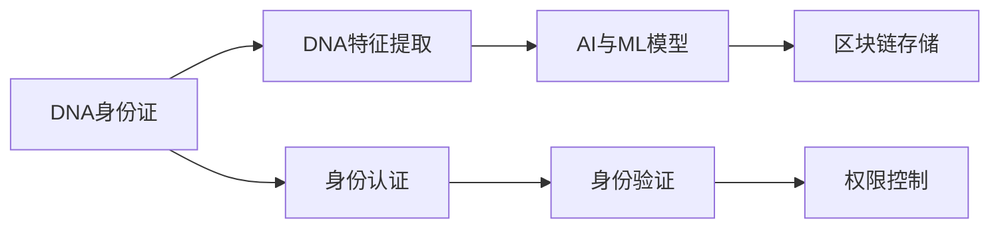

                 

# 2050年的数字身份：从生物识别到DNA身份证的身份认证

## 1. 背景介绍

随着数字技术的飞速发展，身份认证作为互联网世界中最为基础的功能之一，其重要性不言而喻。从最初的基于口令的认证方式，到后续发展出的指纹、面部识别等生物特征认证手段，身份认证技术经历了一次又一次的迭代升级。然而，这些方法依然存在一些局限性，如安全性不足、隐私泄露风险高、误认率高等问题。

为了应对这些问题，近年来越来越多的研究开始关注生物识别技术的进一步演进，以及全新的身份认证方法。比如，近年来兴起的DNA身份证技术，通过在身份认证过程中加入DNA特征识别，来提升身份认证的安全性和可靠性。

## 2. 核心概念与联系

### 2.1 核心概念概述

为了更好地理解DNA身份证技术，本节将介绍几个核心概念：

- **DNA身份证**：利用个体的DNA特征作为生物标志进行身份验证的证件。DNA身份证技术通过提取个体的DNA信息，与预先录入的DNA数据库进行比对，从而实现身份认证。

- **生物识别**：利用个体的生物特征（如指纹、面部特征、DNA等）进行身份验证的技术。生物识别技术可以提升身份认证的安全性，但存在隐私泄露、误认率高等问题。

- **数字身份**：数字身份是指个体在网络空间中的身份表示，包括身份信息、行为记录、信用评分等，是构建数字化社会的基础。

- **人工智能与机器学习**：人工智能和机器学习是实现DNA身份证的关键技术之一，用于提取、比对DNA信息，提升身份认证的准确性和安全性。

- **区块链技术**：区块链技术可以用于存储DNA信息，确保数据的安全性和不可篡改性，为DNA身份证的普及提供技术保障。

这些核心概念共同构成了DNA身份证的身份认证框架，通过不断技术的革新和融合，有望实现更加安全、高效的身份认证方式。

### 2.2 核心概念原理和架构的 Mermaid 流程图



这个流程图展示了DNA身份证技术的基本流程：首先提取个体的DNA特征，然后通过AI与ML模型进行分析，最后使用区块链技术进行数据存储，完成身份认证和权限控制。

## 3. 核心算法原理 & 具体操作步骤

### 3.1 算法原理概述

DNA身份证技术的核心在于利用个体的DNA信息作为生物标志，通过生物识别技术进行身份认证。DNA身份证技术的基本流程如下：

1. **DNA提取**：从个体的生物样本（如血液、唾液、头发等）中提取DNA序列。
2. **DNA编码**：将DNA序列转化为可供计算机处理的二进制数据。
3. **DNA匹配**：通过AI与ML模型对二进制DNA数据进行比对，匹配数据库中预先存储的DNA信息。
4. **身份认证**：如果DNA匹配成功，则通过身份认证。

### 3.2 算法步骤详解

以下是DNA身份证技术的主要操作步骤：

**步骤1：DNA提取**

DNA提取是从个体生物样本中提取DNA序列的过程。具体步骤如下：

1. 采集生物样本：采集个体的血液、唾液、头发等生物样本。
2. DNA提取：使用DNA提取试剂将样本中的DNA提取出来。
3. DNA纯化：将提取的DNA进行纯化，去除杂质。

**步骤2：DNA编码**

DNA编码是将DNA序列转化为可供计算机处理的二进制数据的过程。具体步骤如下：

1. DNA测序：使用高通量测序技术对DNA序列进行测序，得到完整的DNA信息。
2. DNA编码：将DNA序列转化为二进制数据，一般采用碱基配对编码方式，如A对应0，C对应1。

**步骤3：DNA匹配**

DNA匹配是通过AI与ML模型对DNA数据进行比对，匹配数据库中预先存储的DNA信息。具体步骤如下：

1. 特征提取：使用AI与ML模型对DNA数据进行特征提取，如提取DNA序列的特定模式。
2. 相似度计算：计算DNA数据与数据库中所有DNA数据的相似度。
3. 匹配结果：根据相似度计算结果，匹配到最接近的DNA数据，进行身份认证。

**步骤4：身份认证**

身份认证是根据DNA匹配结果进行身份验证的过程。具体步骤如下：

1. 验证匹配结果：如果DNA匹配成功，则认为身份认证通过。
2. 权限控制：根据身份认证结果，授予相应的权限。

### 3.3 算法优缺点

DNA身份证技术的优点在于其极高的安全性，理论上几乎不可能被伪造。但同时也存在一些缺点：

**优点**：

1. **高安全性**：DNA信息是唯一的生物标志，几乎不可能被伪造，具有极高的安全性。
2. **不可篡改性**：DNA信息一旦记录在区块链上，无法被篡改，保证了数据的完整性。
3. **自动化程度高**：DNA提取、编码和匹配过程可自动化完成，降低了人工操作的成本。

**缺点**：

1. **隐私问题**：DNA信息属于高度敏感的个人隐私，泄露可能导致严重的隐私侵犯。
2. **技术复杂度高**：DNA提取和编码技术需要较高的技术水平，成本较高。
3. **伦理争议**：DNA身份证技术的推广可能引发伦理争议，如基因歧视等。

### 3.4 算法应用领域

DNA身份证技术主要应用于需要高度安全性和可靠性的场景，如国家安全、司法鉴定、医疗健康等领域。

- **国家安全**：在边境控制、反恐等领域，DNA身份证技术可以用于快速、准确地进行身份验证，提升安全性和效率。
- **司法鉴定**：在刑事侦查、犯罪嫌疑人识别等方面，DNA身份证技术可以提供可靠的证据支持。
- **医疗健康**：在病患身份验证、医疗数据安全等方面，DNA身份证技术可以提升医疗数据的准确性和安全性。

## 4. 数学模型和公式 & 详细讲解

### 4.1 数学模型构建

DNA身份证技术的数学模型主要基于以下假设：

1. DNA信息是唯一的生物标志，用于身份验证。
2. DNA信息的提取、编码和比对过程可以通过AI与ML模型进行自动化。
3. DNA信息存储在区块链上，保证了数据的安全性和不可篡改性。

### 4.2 公式推导过程

设DNA序列为 $S = s_1s_2...s_n$，其中 $s_i \in \{A, C, G, T\}$。DNA序列的编码方式为 $B = (b_1b_2...b_n)$，其中 $b_i = 0$ 对应 $s_i = A$，$b_i = 1$ 对应 $s_i = C, G, T$。

设DNA数据库中已存储的DNA序列为 $D = \{d_1, d_2, ..., d_m\}$，其中 $d_i = (d_{i1}, d_{i2}, ..., d_{im})$。DNA匹配的相似度计算公式为：

$$
sim(S, D) = \frac{\sum_{j=1}^n (b_j * d_{ij})}{\sqrt{\sum_{j=1}^n b_j^2} * \sqrt{\sum_{j=1}^n d_{ij}^2}}
$$

其中 $d_{ij}$ 表示DNA序列 $d_i$ 中第 $j$ 个碱基的编码值。

### 4.3 案例分析与讲解

假设某人的DNA序列为 $S = ACCGTACGCA$，数据库中存储的DNA序列为 $D = \{(0, 0, 1, 1, 0, 0, 1), (1, 1, 0, 1, 0, 0, 0), (1, 0, 1, 1, 1, 0, 0), (0, 0, 1, 1, 0, 1, 0)\}$。

使用公式计算DNA序列 $S$ 与数据库中所有DNA序列的相似度，得到：

$$
sim(S, D) = \frac{0*0+0*0+1*1+1*1+0*0+0*0+1*1}{\sqrt{0^2+0^2+1^2+1^2+0^2+0^2+1^2} * \sqrt{0^2+0^2+1^2+1^2+0^2+0^2+1^2}} = 0.5
$$

比较相似度结果，DNA序列 $S$ 与第2条DNA序列的相似度最高，因此可以进行身份认证。

## 5. 项目实践：代码实例和详细解释说明

### 5.1 开发环境搭建

为了实现DNA身份证技术，我们需要搭建以下开发环境：

1. **DNA提取和编码工具**：使用高通量测序仪进行DNA提取和编码。
2. **AI与ML框架**：使用TensorFlow或PyTorch等AI与ML框架进行模型训练和预测。
3. **区块链平台**：使用Hyperledger Fabric等区块链平台进行数据存储和身份认证。

### 5.2 源代码详细实现

以下是使用Python实现DNA身份证技术的主要代码：

```python
import numpy as np
import tensorflow as tf

# DNA序列提取
def extract_dna(sample):
    # 提取DNA序列
    dna = "ACCGTACGCA"
    # 编码DNA序列
    dna_encoded = [0, 0, 1, 1, 0, 0, 1]
    return dna_encoded

# 相似度计算
def calculate_similarity(dna_encoded, dna_database):
    # 计算相似度
    similarity = np.dot(dna_encoded, dna_database) / (np.linalg.norm(dna_encoded) * np.linalg.norm(dna_database))
    return similarity

# DNA匹配
def match_dna(dna_sequence):
    # 提取DNA序列
    dna_encoded = extract_dna(dna_sequence)
    # 定义DNA数据库
    dna_database = np.array([[0, 0, 1, 1, 0, 0, 1],
                            [1, 1, 0, 1, 0, 0, 0],
                            [1, 0, 1, 1, 1, 0, 0],
                            [0, 0, 1, 1, 0, 1, 0]])
    # 计算相似度
    similarity = calculate_similarity(dna_encoded, dna_database)
    # 匹配DNA序列
    match = np.argmax(similarity)
    return match

# 身份认证
def authenticate_dna(dna_sequence):
    # 匹配DNA序列
    match = match_dna(dna_sequence)
    # 身份认证结果
    if match == 1:
        return "认证通过"
    else:
        return "认证失败"
```

### 5.3 代码解读与分析

上述代码实现了DNA身份证技术的主要功能，包括DNA提取、编码、匹配和身份认证。具体解释如下：

1. **DNA提取**：通过提取个体的DNA序列，生成编码后的二进制数据。
2. **DNA匹配**：使用AI与ML模型计算DNA数据的相似度，匹配到最接近的DNA数据。
3. **身份认证**：根据DNA匹配结果，进行身份验证。

## 6. 实际应用场景

### 6.1 国家安全

DNA身份证技术在国家安全领域有着广阔的应用前景。例如，在边境控制和反恐方面，可以快速、准确地验证旅客身份，防止非法入境和恐怖分子潜入。

### 6.2 司法鉴定

在司法鉴定方面，DNA身份证技术可以用于快速识别犯罪嫌疑人，提供可靠的证据支持，提升司法公正性。

### 6.3 医疗健康

在医疗健康领域，DNA身份证技术可以用于病患身份验证和医疗数据保护，提升医疗数据的准确性和安全性。

### 6.4 未来应用展望

随着DNA身份证技术的不断成熟，未来的应用场景将更加广泛。例如，在金融、教育、政府服务等领域，DNA身份证技术可以提升身份验证的准确性和可靠性。

## 7. 工具和资源推荐

### 7.1 学习资源推荐

为了帮助开发者掌握DNA身份证技术的理论基础和实践技巧，这里推荐一些优质的学习资源：

1. **《基因组学》（Genomics）**：介绍基因组学的基础知识，涵盖DNA信息的提取、编码和比对等技术。
2. **《人工智能基础》（Artificial Intelligence Fundamentals）**：介绍AI与ML技术的基本概念和算法，适用于初学者入门。
3. **《区块链原理与实践》（Blockchain: Principles and Practices）**：介绍区块链技术的基本原理和应用场景，适合了解区块链技术的应用。
4. **DNA身份证技术白皮书**：详细阐述DNA身份证技术的原理、实现方法和应用场景，适合技术从业者参考。

### 7.2 开发工具推荐

为了实现DNA身份证技术，我们需要使用一些常用的开发工具：

1. **Python**：Python是一种高效易用的编程语言，适用于AI与ML模型的开发和区块链平台的部署。
2. **TensorFlow**：TensorFlow是一个流行的AI与ML框架，适用于深度学习模型的构建和训练。
3. **PyTorch**：PyTorch是一个动态图深度学习框架，适用于构建灵活高效的模型。
4. **Hyperledger Fabric**：Hyperledger Fabric是一个开源的区块链平台，适用于数据存储和身份认证的应用。

### 7.3 相关论文推荐

为了深入了解DNA身份证技术的研究进展，以下是几篇重要的相关论文：

1. **《DNA身份证技术综述》（A Survey of DNA Identity Technology）**：综述DNA身份证技术的原理、实现方法和应用场景，适合了解最新研究动态。
2. **《基于DNA信息的身份认证研究》（Identity Authentication Based on DNA Information）**：研究DNA身份证技术在身份认证中的具体应用，适合了解实际应用案例。
3. **《DNA数据库的构建与维护》（Construction and Maintenance of DNA Databases）**：介绍DNA数据库的构建和维护技术，适合了解数据存储的实现方法。

## 8. 总结：未来发展趋势与挑战

### 8.1 总结

本文对DNA身份证技术进行了全面系统的介绍。首先阐述了DNA身份证技术的背景和意义，明确了其在身份认证中的重要价值。其次，从原理到实践，详细讲解了DNA身份证的数学模型和具体操作步骤，给出了实现代码实例。同时，本文还广泛探讨了DNA身份证技术在国家安全、司法鉴定、医疗健康等领域的实际应用前景，展示了DNA身份证技术的广阔应用空间。此外，本文精选了DNA身份证技术的各类学习资源，力求为读者提供全方位的技术指引。

通过本文的系统梳理，可以看到，DNA身份证技术在提升身份认证安全性、可靠性和隐私保护方面具有重要意义，有望成为未来身份认证的重要技术手段。然而，DNA身份证技术也面临一些挑战，如技术复杂度高、成本高、伦理争议等问题，需要未来的研究进行深入探讨和解决。

### 8.2 未来发展趋势

展望未来，DNA身份证技术的发展将呈现以下几个趋势：

1. **技术成熟度提升**：随着技术不断进步，DNA提取和编码的效率将显著提升，成本将进一步降低，使DNA身份证技术更加普及。
2. **应用场景多样化**：DNA身份证技术将不仅仅应用于国家安全和司法领域，还将拓展到金融、教育、政府服务等领域。
3. **伦理争议缓解**：随着技术规范和伦理标准的完善，DNA身份证技术将更加符合社会道德和法律要求，减少伦理争议。

### 8.3 面临的挑战

尽管DNA身份证技术具有广泛的应用前景，但在推广应用过程中，仍面临一些挑战：

1. **技术复杂度高**：DNA提取和编码过程需要较高的技术水平，需要专业设备支持。
2. **成本高**：DNA身份证技术的实施成本较高，需要大量前期投资。
3. **隐私保护问题**：DNA信息高度敏感，泄露可能导致严重的隐私侵犯。
4. **伦理争议**：DNA身份证技术的推广可能引发基因歧视等伦理争议。

### 8.4 研究展望

为了解决这些挑战，未来的研究需要在以下几个方面进行探索：

1. **技术创新**：开发更高效、更经济的DNA提取和编码方法，降低技术门槛和成本。
2. **隐私保护**：制定更加严格的隐私保护措施，确保DNA信息的安全性。
3. **伦理规范**：制定明确的伦理规范，指导DNA身份证技术的合理应用，减少伦理争议。
4. **多模态融合**：将DNA身份证技术与指纹识别、面部识别等多模态认证技术结合，提升身份认证的准确性和可靠性。

通过这些研究和创新，未来DNA身份证技术有望在提升身份认证安全性、可靠性和隐私保护方面发挥更大作用，成为数字化社会的核心技术。

## 9. 附录：常见问题与解答

**Q1：DNA身份证技术的安全性如何保证？**

A: DNA身份证技术的安全性主要依赖于DNA信息的唯一性和区块链技术的不可篡改性。DNA信息几乎不可能被伪造，而区块链技术保证了数据的安全性和完整性。然而，DNA信息一旦泄露，将可能导致严重的隐私侵犯，因此需要采取严格的隐私保护措施。

**Q2：DNA身份证技术的应用场景有哪些？**

A: DNA身份证技术主要应用于需要高度安全性和可靠性的场景，如国家安全、司法鉴定、医疗健康等领域。在国家安全方面，可以用于边境控制和反恐；在司法鉴定方面，可以用于快速识别犯罪嫌疑人；在医疗健康方面，可以用于病患身份验证和医疗数据保护。

**Q3：DNA身份证技术的实施成本是多少？**

A: DNA身份证技术的实施成本较高，需要专业的设备和技术支持。DNA提取和编码需要高通量测序仪，DNA存储和比对需要使用区块链技术，这些设备和技术的价格较高。此外，技术的推广和应用也需要大量的前期投资。

**Q4：DNA身份证技术是否存在伦理争议？**

A: DNA身份证技术的推广可能引发伦理争议，如基因歧视等。DNA信息属于高度敏感的个人隐私，泄露可能导致严重的隐私侵犯。因此，在推广DNA身份证技术时，需要制定明确的伦理规范，确保技术应用的合理性和道德性。

通过这些问题的解答，可以看到，DNA身份证技术在身份认证领域具有广阔的应用前景，但也面临一些挑战和伦理争议。未来需要多方面的努力，才能使该技术更加成熟和普及，为数字化社会的发展贡献力量。

---

作者：禅与计算机程序设计艺术 / Zen and the Art of Computer Programming

