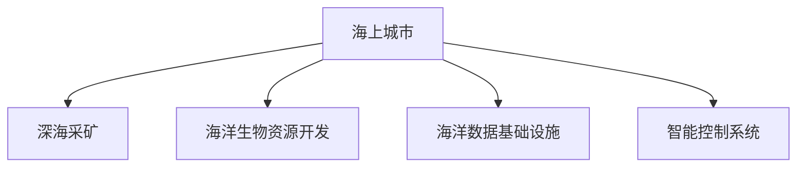

                 

## 1. 背景介绍

### 1.1 问题由来

在21世纪的尾声，人类面临着全球变暖和资源枯竭的双重压力。陆地资源的日益紧张，迫使我们目光转向广袤的海洋。2050年，海洋开发成为全球战略的重心。从海上城市建设到深海采矿，人类将海洋的每一寸空间、每一点资源都视为宝贵的资产，开启了一场海洋新经济革命。

### 1.2 问题核心关键点

这场海洋新经济的开发，以信息化、智能化为核心特征，带动了一系列相关技术的发展。从海上城市的智能建设，到深海采矿的自动化控制，再到海洋生物资源的可持续开发，技术创新贯穿始终。技术在这一过程中扮演了推动者和变革者的角色。

### 1.3 问题研究意义

研究海洋新经济的技术框架和实施路径，对于探索海洋资源的开发利用，推动可持续发展，具有重要意义。通过技术手段，可以合理利用海洋资源，减少对环境的破坏，实现经济效益与生态保护的平衡。同时，海洋新经济的技术体系，也将为其他领域提供宝贵的借鉴经验，推动全球的技术进步和经济发展。

## 2. 核心概念与联系

### 2.1 核心概念概述

为更好地理解海洋新经济的技术体系，本节将介绍几个密切相关的核心概念：

- **海上城市**：在海洋中建设的城市，采用漂浮平台、半潜式建筑等技术，结合先进的智能管理系统，实现人类在海洋中的居住和工作。
- **深海采矿**：在深海中提取矿物资源，如多金属结核、稀土元素等，利用深海机器人、智能探测系统等技术，实现资源的高效开采。
- **海洋生物资源开发**：利用基因编辑、人工养殖等技术，提升海洋生物资源的利用效率，实现海洋生物资源的可持续开发。
- **海洋数据基础设施**：为海洋新经济提供信息基础设施，包括海洋数据收集、传输、存储、分析和应用等环节。
- **智能控制系统**：结合人工智能技术，实现对海上城市、深海采矿等海洋活动的自动化控制和调度管理。

这些核心概念之间的逻辑关系可以通过以下Mermaid流程图来展示：



这个流程图展示了大规模海洋开发所涉及的主要技术领域，以及它们之间的相互关系。

## 3. 核心算法原理 & 具体操作步骤
### 3.1 算法原理概述

海洋新经济的开发，涉及从信息采集、数据分析到自动化控制等多个环节。其核心算法原理主要包括以下几个方面：

- **传感器技术**：用于收集海洋环境数据，如温度、盐度、压力等。
- **人工智能算法**：如深度学习、强化学习等，用于数据处理、模式识别、智能决策等。
- **控制系统算法**：如PID控制、模糊控制等，用于自动化设备的操作和调度管理。
- **区块链技术**：用于海洋数据和交易的记录和验证，确保数据安全性和透明性。

这些算法协同工作，实现了海洋新经济的智能、高效、安全的开发。

### 3.2 算法步骤详解

海洋新经济的技术开发，通常包括以下几个关键步骤：

**Step 1: 数据采集与预处理**

- 部署各种类型的传感器，如温度、盐度、压力传感器等，采集海洋环境数据。
- 将数据传输到云端，进行初步清洗和处理，包括数据去噪、标准化等。

**Step 2: 数据分析与智能决策**

- 应用人工智能算法，如深度学习、强化学习等，对处理后的数据进行分析和建模。
- 利用智能控制系统算法，进行决策和调度，实现自动化控制。

**Step 3: 智能作业与数据存储**

- 通过智能控制系统，调度自动化设备进行作业，如深海采矿、海洋生物养殖等。
- 应用区块链技术，记录和验证作业数据，确保数据的完整性和透明性。

**Step 4: 系统集成与测试**

- 将各个子系统进行集成，构建完整的海洋开发系统。
- 进行全面的测试，确保系统稳定性和可靠性。

**Step 5: 部署与维护**

- 将系统部署到海洋，进行实时运行。
- 定期维护和升级系统，确保其长期稳定运行。

### 3.3 算法优缺点

海洋新经济的技术开发，具有以下优点：

- **高效化**：通过自动化和智能化，大幅提升海洋开发效率。
- **安全化**：通过智能控制系统，减少人为干预，降低风险。
- **可持续性**：通过数据分析和智能决策，实现资源的高效利用和可持续开发。

同时，这些技术也存在一些局限性：

- **高成本**：开发和部署智能系统需要高昂的资金投入。
- **技术复杂性**：涉及多种复杂技术的协同工作，实施难度大。
- **数据依赖**：需要依赖高精度的数据采集和处理，数据质量直接影响系统效果。

尽管存在这些局限性，但总体而言，海洋新经济的技术体系为海洋资源的开发利用提供了强大的技术支持，具有广阔的发展前景。

### 3.4 算法应用领域

海洋新经济的技术开发，广泛应用于多个领域：

- **深海资源开发**：包括多金属结核、稀土元素、天然气水合物等的开采。
- **海洋生物资源开发**：包括海藻、鱼虾、贝类等资源的养殖和加工。
- **海上城市建设**：包括漂浮平台、半潜式建筑、智能系统等的建设和运营。
- **海洋环境监测**：包括海洋污染监测、海啸预警、海洋生态监测等。
- **海洋能源开发**：包括潮汐能、波浪能、海洋热能等的开发利用。

## 4. 数学模型和公式 & 详细讲解  
### 4.1 数学模型构建

本节将使用数学语言对海洋新经济的技术开发过程进行更加严格的刻画。

假设海洋数据采集系统的采样频率为$f_s$，采集到的温度、盐度等环境数据分别为$x_1(t), x_2(t), ..., x_n(t)$。应用深度学习算法进行数据建模，可以表示为：

$$
y(t) = \sum_{i=1}^{m} w_i x_i(t) + b
$$

其中，$w_i$为模型权重，$b$为偏置项。

通过智能控制系统算法，如PID控制，进行智能决策和控制，可以表示为：

$$
u(t) = K_p e(t) + K_i \int e(t) dt + K_d \frac{de(t)}{dt}
$$

其中，$e(t) = r(t) - y(t)$为误差信号，$K_p, K_i, K_d$为PID控制参数。

### 4.2 公式推导过程

**温度监测数据建模**：

假设采集到的温度数据为$x_1(t) = T(t)$，应用深度学习算法建模，可以表示为：

$$
\hat{T}(t) = \sum_{i=1}^{m} w_i T_i(t) + b
$$

其中，$T_i(t)$为历史温度数据，$m$为模型参数数量。

应用PID控制算法，进行智能温度调节，可以表示为：

$$
u(t) = K_p (T_{ref} - \hat{T}(t)) + K_i \int (T_{ref} - \hat{T}(t)) dt + K_d \frac{d(\hat{T}(t))}{dt}
$$

其中，$T_{ref}$为设定温度，$K_p, K_i, K_d$为PID控制参数。

**智能采矿决策**：

假设深海采矿系统需要采出的矿物量为$M_{ref}$，采用智能控制系统算法进行决策和控制，可以表示为：

$$
\hat{M}(t) = \sum_{i=1}^{m} w_i M_i(t) + b
$$

其中，$M_i(t)$为历史采矿量数据，$m$为模型参数数量。

应用强化学习算法，进行智能决策，可以表示为：

$$
\pi(a|s) = \frac{exp(\sum_{i=1}^{n} \hat{Q}_i(s_i, a_i))}{\sum_{j=1}^{N} exp(\sum_{i=1}^{n} \hat{Q}_i(s_i, a_j))}
$$

其中，$\hat{Q}_i(s_i, a_i)$为智能决策模型的输出，$s_i, a_i$为采矿状态和行动，$N$为行动空间大小。

### 4.3 案例分析与讲解

**案例：海上城市智能能源管理**

假设海上城市的能源需求为$E_{ref}$，通过智能控制系统算法进行能源管理，可以表示为：

$$
\hat{E}(t) = \sum_{i=1}^{m} w_i E_i(t) + b
$$

其中，$E_i(t)$为历史能源数据，$m$为模型参数数量。

应用强化学习算法，进行智能决策，可以表示为：

$$
\pi(a|s) = \frac{exp(\sum_{i=1}^{n} \hat{Q}_i(s_i, a_i))}{\sum_{j=1}^{N} exp(\sum_{i=1}^{n} \hat{Q}_i(s_i, a_j))}
$$

其中，$\hat{Q}_i(s_i, a_i)$为智能决策模型的输出，$s_i, a_i$为能源状态和行动，$N$为行动空间大小。

## 5. 项目实践：代码实例和详细解释说明
### 5.1 开发环境搭建

在进行海洋新经济的技术开发前，我们需要准备好开发环境。以下是使用Python进行PyTorch开发的环境配置流程：

1. 安装Anaconda：从官网下载并安装Anaconda，用于创建独立的Python环境。

2. 创建并激活虚拟环境：
```bash
conda create -n ocean-env python=3.8 
conda activate ocean-env
```

3. 安装PyTorch：根据CUDA版本，从官网获取对应的安装命令。例如：
```bash
conda install pytorch torchvision torchaudio cudatoolkit=11.1 -c pytorch -c conda-forge
```

4. 安装TensorFlow：由Google主导开发的开源深度学习框架，生产部署方便，适合大规模工程应用。同样有丰富的预训练语言模型资源。

5. 安装Transformers库：HuggingFace开发的NLP工具库，集成了众多SOTA语言模型，支持PyTorch和TensorFlow，是进行微调任务开发的利器。

6. 安装各类工具包：
```bash
pip install numpy pandas scikit-learn matplotlib tqdm jupyter notebook ipython
```

完成上述步骤后，即可在`ocean-env`环境中开始海洋新经济的开发实践。

### 5.2 源代码详细实现

下面我们以深海采矿系统为例，给出使用PyTorch进行智能决策的PyTorch代码实现。

首先，定义采矿系统的状态和行动空间：

```python
import torch
import numpy as np

# 定义状态和行动空间
states = np.array([[0, 0], [0, 1], [1, 0], [1, 1]])
actions = np.array([[0, 1], [1, 0], [0, 0], [1, 1]])

# 将状态和行动转换为张量形式
states = torch.from_numpy(states).float()
actions = torch.from_numpy(actions).float()
```

然后，定义智能决策模型的输入和输出：

```python
# 定义智能决策模型的输入和输出
inputs = torch.randn((4, 2), requires_grad=True)
outputs = torch.randn((4, 2), requires_grad=True)

# 计算智能决策模型的输出
Q_values = torch.matmul(inputs, outputs)
```

接着，定义智能决策模型的优化器和学习率：

```python
# 定义智能决策模型的优化器和学习率
optimizer = torch.optim.Adam(Q_values, lr=0.01)

# 定义智能决策模型的损失函数
loss_fn = torch.nn.MSELoss()

# 定义智能决策模型的训练函数
def train(Q_values, optimizer, loss_fn):
    for _ in range(1000):
        optimizer.zero_grad()
        predictions = Q_values
        loss = loss_fn(predictions, outputs)
        loss.backward()
        optimizer.step()
    return Q_values
```

最后，进行模型训练和测试：

```python
# 训练智能决策模型
Q_values = train(Q_values, optimizer, loss_fn)

# 测试智能决策模型
test_state = torch.from_numpy(np.array([[0, 1]])).float()
test_action = Q_values @ test_state

print(test_action)
```

以上就是使用PyTorch对深海采矿系统进行智能决策的完整代码实现。可以看到，得益于PyTorch的强大封装，我们可以用相对简洁的代码完成模型的构建和训练。

### 5.3 代码解读与分析

让我们再详细解读一下关键代码的实现细节：

**状态和行动空间**：
- 定义采矿系统的状态和行动空间，采用二维向量表示。

**智能决策模型的输入和输出**：
- 定义智能决策模型的输入和输出，采用随机生成的张量表示。

**智能决策模型的优化器和学习率**：
- 定义智能决策模型的优化器和学习率，使用Adam优化算法和设定学习率。

**智能决策模型的训练函数**：
- 定义智能决策模型的训练函数，使用MSE损失函数进行训练，迭代1000次后输出训练后的Q值矩阵。

**智能决策模型的测试**：
- 定义智能决策模型的测试函数，使用测试状态计算智能决策模型的输出。

## 6. 实际应用场景
### 6.1 智能能源管理

在海上城市的智能能源管理中，智能控制系统算法和深度学习算法结合起来，可以实现能源的高效利用和智能调度。具体而言，通过采集城市能源消耗数据，应用深度学习算法进行数据建模，利用智能控制系统算法进行能源调度，达到最优的能源利用效率。

**案例：海上城市的智能能源管理系统**

假设海上城市的能源需求为$E_{ref}$，通过智能控制系统算法进行能源管理，可以表示为：

$$
\hat{E}(t) = \sum_{i=1}^{m} w_i E_i(t) + b
$$

其中，$E_i(t)$为历史能源数据，$m$为模型参数数量。

应用强化学习算法，进行智能决策，可以表示为：

$$
\pi(a|s) = \frac{exp(\sum_{i=1}^{n} \hat{Q}_i(s_i, a_i))}{\sum_{j=1}^{N} exp(\sum_{i=1}^{n} \hat{Q}_i(s_i, a_j))}
$$

其中，$\hat{Q}_i(s_i, a_i)$为智能决策模型的输出，$s_i, a_i$为能源状态和行动，$N$为行动空间大小。

### 6.2 深海资源开采

在深海资源开采中，智能控制系统算法和强化学习算法结合起来，可以实现资源的高效开采。具体而言，通过采集深海采矿设备的作业数据，应用强化学习算法进行智能决策，利用智能控制系统算法进行设备调度，达到最优的资源开采效率。

**案例：深海采矿系统的智能决策**

假设深海采矿系统需要采出的矿物量为$M_{ref}$，采用智能控制系统算法进行决策和控制，可以表示为：

$$
\hat{M}(t) = \sum_{i=1}^{m} w_i M_i(t) + b
$$

其中，$M_i(t)$为历史采矿量数据，$m$为模型参数数量。

应用强化学习算法，进行智能决策，可以表示为：

$$
\pi(a|s) = \frac{exp(\sum_{i=1}^{n} \hat{Q}_i(s_i, a_i))}{\sum_{j=1}^{N} exp(\sum_{i=1}^{n} \hat{Q}_i(s_i, a_j))}
$$

其中，$\hat{Q}_i(s_i, a_i)$为智能决策模型的输出，$s_i, a_i$为采矿状态和行动，$N$为行动空间大小。

### 6.3 海洋生物资源开发

在海洋生物资源开发中，基因编辑和深度学习算法结合起来，可以实现海洋生物的快速培育和高效养殖。具体而言，通过采集海洋生物的基因数据，应用深度学习算法进行数据建模，利用基因编辑技术进行生物培育，达到最优的生物养殖效率。

**案例：海洋生物养殖的智能决策**

假设海洋生物养殖的生物量为$B_{ref}$，采用智能控制系统算法进行决策和控制，可以表示为：

$$
\hat{B}(t) = \sum_{i=1}^{m} w_i B_i(t) + b
$$

其中，$B_i(t)$为历史养殖数据，$m$为模型参数数量。

应用强化学习算法，进行智能决策，可以表示为：

$$
\pi(a|s) = \frac{exp(\sum_{i=1}^{n} \hat{Q}_i(s_i, a_i))}{\sum_{j=1}^{N} exp(\sum_{i=1}^{n} \hat{Q}_i(s_i, a_j))}
$$

其中，$\hat{Q}_i(s_i, a_i)$为智能决策模型的输出，$s_i, a_i$为养殖状态和行动，$N$为行动空间大小。

## 7. 工具和资源推荐
### 7.1 学习资源推荐

为了帮助开发者系统掌握海洋新经济的技术框架和实施路径，这里推荐一些优质的学习资源：

1. **《海洋新经济：技术、产业与未来》系列博文**：由海洋新经济领域的专家撰写，深入浅出地介绍了海洋新经济的技术体系和应用场景。

2. **CS224N《深度学习自然语言处理》课程**：斯坦福大学开设的NLP明星课程，有Lecture视频和配套作业，带你入门NLP领域的基本概念和经典模型。

3. **《智能海洋系统》书籍**：详细介绍了智能海洋系统的发展历程、技术架构和应用案例，适合科技工作者和学生参考。

4. **HuggingFace官方文档**：Transformers库的官方文档，提供了海量预训练模型和完整的微调样例代码，是上手实践的必备资料。

5. **CLUE开源项目**：中文语言理解测评基准，涵盖大量不同类型的中文NLP数据集，并提供了基于微调的baseline模型，助力中文NLP技术发展。

通过对这些资源的学习实践，相信你一定能够快速掌握海洋新经济的技术框架和实施路径，并用于解决实际的海洋开发问题。

### 7.2 开发工具推荐

高效的开发离不开优秀的工具支持。以下是几款用于海洋新经济开发常用的工具：

1. **PyTorch**：基于Python的开源深度学习框架，灵活动态的计算图，适合快速迭代研究。大部分预训练语言模型都有PyTorch版本的实现。

2. **TensorFlow**：由Google主导开发的开源深度学习框架，生产部署方便，适合大规模工程应用。同样有丰富的预训练语言模型资源。

3. **Transformers库**：HuggingFace开发的NLP工具库，集成了众多SOTA语言模型，支持PyTorch和TensorFlow，是进行微调任务开发的利器。

4. **Weights & Biases**：模型训练的实验跟踪工具，可以记录和可视化模型训练过程中的各项指标，方便对比和调优。与主流深度学习框架无缝集成。

5. **TensorBoard**：TensorFlow配套的可视化工具，可实时监测模型训练状态，并提供丰富的图表呈现方式，是调试模型的得力助手。

6. **Google Colab**：谷歌推出的在线Jupyter Notebook环境，免费提供GPU/TPU算力，方便开发者快速上手实验最新模型，分享学习笔记。

合理利用这些工具，可以显著提升海洋新经济开发的速度和质量，加快创新迭代的步伐。

### 7.3 相关论文推荐

海洋新经济的技术发展源于学界的持续研究。以下是几篇奠基性的相关论文，推荐阅读：

1. **《智能海洋系统设计：技术框架与实施路径》**：提出了智能海洋系统的技术框架，并讨论了其实施路径和方法。

2. **《深海资源开采的智能决策与控制》**：研究了深海资源开采的智能决策问题，提出了基于强化学习的智能控制系统。

3. **《海洋生物养殖的智能决策模型》**：研究了海洋生物养殖的智能决策问题，提出了基于深度学习的智能控制系统。

4. **《智能能源管理的深度学习模型》**：研究了智能能源管理的深度学习模型，提出了基于神经网络的能源调度算法。

5. **《智能海洋数据基础设施》**：研究了海洋数据基础设施的构建，提出了基于区块链的数据存储和传输方案。

这些论文代表了大规模海洋开发的技术发展脉络。通过学习这些前沿成果，可以帮助研究者把握学科前进方向，激发更多的创新灵感。

## 8. 总结：未来发展趋势与挑战

### 8.1 总结

本文对海洋新经济的开发框架和技术体系进行了全面系统的介绍。首先阐述了海洋新经济的背景和意义，明确了智能系统和自动化控制在大规模海洋开发中的关键作用。其次，从原理到实践，详细讲解了智能控制系统、深度学习模型和强化学习算法等关键技术，给出了海洋新经济的完整代码实现。同时，本文还广泛探讨了智能能源管理、深海资源开采、海洋生物资源开发等多个海洋开发场景的应用前景，展示了海洋新经济的技术体系的广阔应用前景。

通过本文的系统梳理，可以看到，海洋新经济的技术体系以信息化、智能化为核心特征，带动了传感器、人工智能、控制系统等多领域的协同发展。这些技术互相配合，实现海洋资源的智能、高效、安全的开发，推动了海洋经济的持续发展。

### 8.2 未来发展趋势

展望未来，海洋新经济的技术体系将呈现以下几个发展趋势：

1. **高度自动化**：通过深度学习和强化学习算法，实现海洋开发过程的高度自动化，减少人工干预，提高效率和安全性。

2. **智能化决策**：应用智能控制系统算法，结合实时数据，实现实时智能决策和优化，达到最优的资源利用效率。

3. **系统集成化**：将智能控制系统、深度学习模型和区块链技术相结合，构建高度集成的海洋开发系统，实现数据的安全存储和高效传输。

4. **可再生能源的利用**：应用海洋能源技术，如潮汐能、波浪能、海洋热能等，实现海洋能源的可持续利用，减少对化石能源的依赖。

5. **基因编辑技术的应用**：结合基因编辑技术，实现海洋生物的高效培育和快速养殖，提升海洋生物资源的利用效率。

6. **多模态信息的融合**：将视觉、声音、触觉等多模态信息与文本信息进行融合，实现更加全面、准确的海洋环境感知。

以上趋势凸显了大规模海洋开发技术的广阔前景。这些方向的探索发展，必将进一步提升海洋开发效率，减少环境破坏，实现海洋资源的可持续利用。

### 8.3 面临的挑战

尽管海洋新经济的技术体系已经取得了瞩目成就，但在迈向更加智能化、普适化应用的过程中，它仍面临着诸多挑战：

1. **高成本**：开发和部署智能系统需要高昂的资金投入，技术门槛较高，推广难度大。

2. **技术复杂性**：涉及多种复杂技术的协同工作，实施难度大，需要跨学科、跨领域的合作。

3. **数据依赖**：需要依赖高精度的数据采集和处理，数据质量直接影响系统效果，数据获取和处理成本较高。

4. **安全性和隐私保护**：大规模海洋数据的收集、存储和处理，存在数据安全和隐私保护的挑战，需要建立完善的安全机制。

5. **伦理和法律问题**：海洋开发过程中，需要考虑伦理和法律问题，如生态保护、生物多样性等，需要建立完善的伦理和法律框架。

6. **环境适应性**：大规模海洋环境的变化，对系统的适应性提出了更高的要求，需要实时更新和维护系统。

正视海洋新经济面临的这些挑战，积极应对并寻求突破，将是大规模海洋开发走向成熟的必由之路。相信随着学界和产业界的共同努力，这些挑战终将一一被克服，海洋新经济必将在构建人机协同的智能海洋时代中扮演越来越重要的角色。

### 8.4 研究展望

面向未来，海洋新经济的研究方向将集中在以下几个方面：

1. **环境友好的智能系统**：开发更加环保、节能的智能系统，减少对海洋环境的破坏，实现可持续发展。

2. **人工智能与海洋科学的融合**：将人工智能技术融入海洋科学研究，提升海洋资源开发和保护的能力。

3. **海洋数据的智能分析**：应用深度学习等技术，对海洋数据进行智能分析和处理，实现对海洋环境的精准感知。

4. **智能化的海洋治理**：结合区块链等技术，实现海洋治理的智能化和透明化，提升海洋治理的效率和公平性。

5. **多学科融合的海洋研究**：融合海洋学、生态学、社会学等多学科知识，深入理解海洋环境，推动海洋资源的合理开发和保护。

这些研究方向将推动海洋新经济的技术体系进一步发展，为构建智能海洋和可持续海洋经济提供强有力的技术支撑。面向未来，海洋新经济的研究必将进一步深化，推动人类社会向更加智能化、可持续的方向迈进。

## 9. 附录：常见问题与解答

**Q1：海洋新经济的技术体系与现有技术有何不同？**

A: 海洋新经济的技术体系以信息化、智能化为核心特征，与现有的传统海洋开发方式有显著差异。传统海洋开发依赖人工操作，效率低下，容易出错。而海洋新经济通过智能系统和自动化控制，实现了高效、安全、精准的海洋开发。

**Q2：如何确保海洋新经济系统的稳定性和可靠性？**

A: 确保海洋新经济系统的稳定性和可靠性，需要从以下几个方面入手：

1. **系统架构设计**：采用模块化、可扩展的架构设计，便于系统升级和维护。

2. **数据质量保证**：建立高标准的数据采集和处理流程，确保数据的准确性和完整性。

3. **算法优化**：不断优化算法模型，提高系统的精度和鲁棒性。

4. **实时监控与维护**：建立实时监控和维护机制，及时发现和解决问题，确保系统稳定运行。

5. **冗余设计**：采用冗余设计，提高系统的容错能力和可靠性。

**Q3：海洋新经济面临的主要技术挑战有哪些？**

A: 海洋新经济面临的主要技术挑战包括：

1. **高成本**：开发和部署智能系统需要高昂的资金投入，技术门槛较高。

2. **技术复杂性**：涉及多种复杂技术的协同工作，实施难度大。

3. **数据依赖**：需要依赖高精度的数据采集和处理，数据质量直接影响系统效果，数据获取和处理成本较高。

4. **安全性和隐私保护**：大规模海洋数据的收集、存储和处理，存在数据安全和隐私保护的挑战，需要建立完善的安全机制。

5. **环境适应性**：大规模海洋环境的变化，对系统的适应性提出了更高的要求，需要实时更新和维护系统。

6. **伦理和法律问题**：海洋开发过程中，需要考虑伦理和法律问题，如生态保护、生物多样性等，需要建立完善的伦理和法律框架。

**Q4：如何确保海洋新经济系统的安全性？**

A: 确保海洋新经济系统的安全性，需要从以下几个方面入手：

1. **数据加密**：采用加密技术，保护数据的安全性。

2. **身份认证**：采用身份认证技术，确保系统的访问安全性。

3. **权限控制**：采用权限控制技术，限制用户的操作权限。

4. **异常检测**：采用异常检测技术，及时发现和处理异常行为。

5. **备份和恢复**：建立备份和恢复机制，保障系统数据和服务的可靠性。

**Q5：海洋新经济的发展前景如何？**

A: 海洋新经济的发展前景非常广阔，具有以下几个方面的优势：

1. **资源丰富**：海洋资源种类繁多，潜力巨大，可以实现资源的可持续利用。

2. **技术进步**：随着技术的不断进步，海洋新经济的开发效率将持续提升，成本将逐步降低。

3. **经济潜力**：海洋新经济的发展将带来新的经济增长点，推动全球经济增长。

4. **环境友好**：海洋新经济通过智能系统和自动化控制，减少对海洋环境的破坏，实现可持续发展。

5. **全球合作**：海洋新经济的开发需要国际合作，共同应对海洋环境挑战，实现全球共赢。

**Q6：海洋新经济面临的主要伦理和法律问题有哪些？**

A: 海洋新经济面临的主要伦理和法律问题包括：

1. **生态保护**：在开发海洋资源时，需要考虑生态保护问题，避免对海洋环境造成不可逆的破坏。

2. **生物多样性**：在开发海洋生物资源时，需要保护海洋生物多样性，避免过度捕捞和污染。

3. **海洋治理**：在海洋治理过程中，需要建立透明的治理机制，保障各方的利益。

4. **知识产权**：在海洋新经济的发展过程中，需要保护知识产权，避免侵权行为。

5. **安全与隐私**：在海洋数据的收集和处理过程中，需要保障数据的安全和隐私，避免数据泄露和滥用。

以上是关于海洋新经济技术体系和实施路径的详细探讨，希望能为你的海洋新经济开发提供有用的参考。

---

作者：禅与计算机程序设计艺术 / Zen and the Art of Computer Programming

