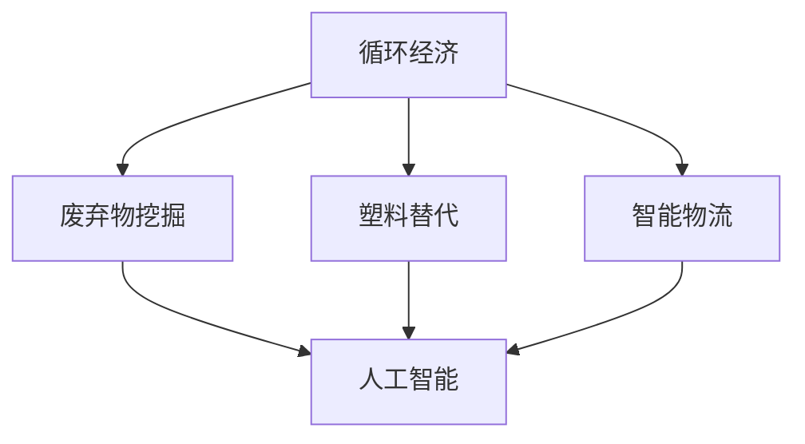
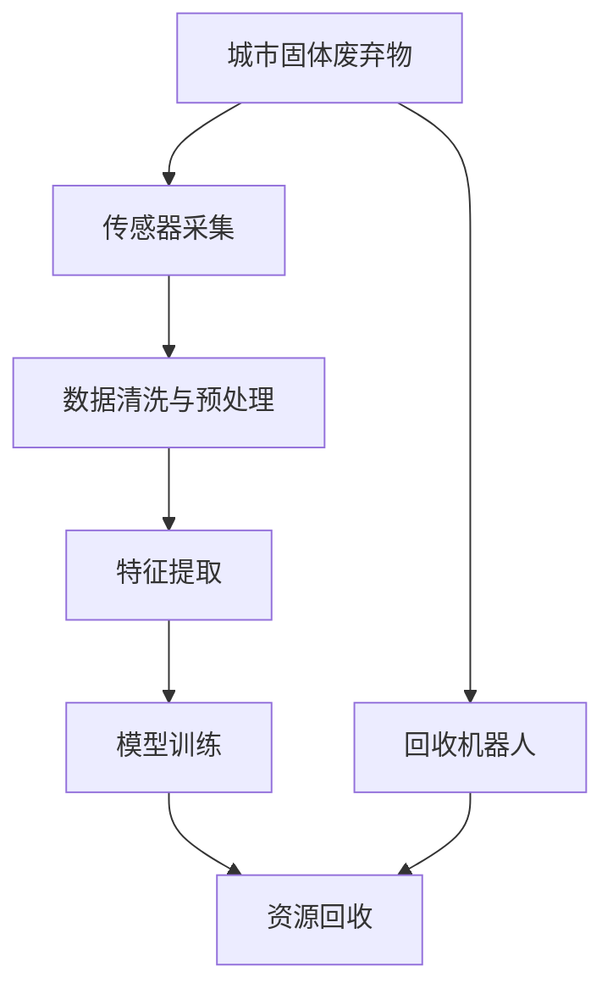
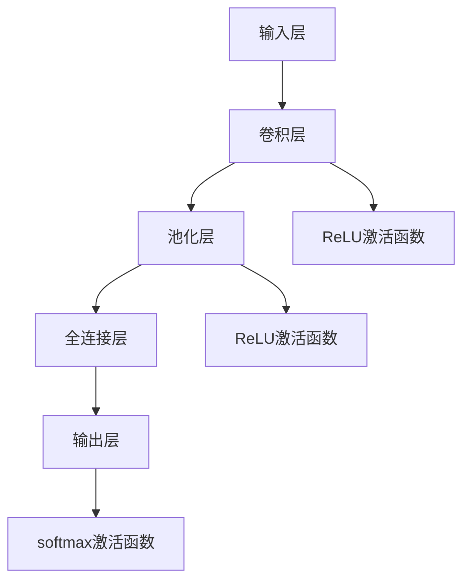

                 

# 2050年的环境保护：从废弃物挖掘到塑料替代的循环经济发展

> 关键词：
循环经济,环境保护,废弃物挖掘,塑料替代,人工智能,自动化,可持续性,零废弃物,智能物流

## 1. 背景介绍

在2050年的未来社会，我们面对着一个日益严峻的环境挑战：气候变化、资源枯竭和生物多样性丧失。这些问题不仅威胁着人类的生存，也制约着社会的可持续发展。为了应对这些挑战，全球社会正在寻求一种更加可持续的经济发展模式——循环经济。循环经济旨在通过减少资源消耗、提高资源利用效率、最大限度地减少废弃物产生，从而实现经济发展与环境保护的平衡。在这一过程中，人工智能（AI）技术的广泛应用将扮演至关重要的角色，从废弃物挖掘到塑料替代，处处可见其身影。

## 2. 核心概念与联系

### 2.1 核心概念概述

循环经济是指通过减少、再利用、再制造和回收等方式，最大化资源利用效率，减少环境影响的经济模式。其主要目标是实现“三减”：减少资源消耗、减少废弃物产生、减少污染排放。循环经济不仅是一种经济发展方式，更是一种新的社会生活方式。

人工智能（AI）是利用计算机模拟人类智能行为的技术，包括机器学习、自然语言处理、计算机视觉、机器人技术等。AI在循环经济中的应用，主要体现在以下几个方面：
- **废弃物挖掘**：利用AI技术从城市固体废弃物中挖掘有价值的资源。
- **塑料替代**：通过AI技术研发和推广新型可降解塑料材料。
- **智能物流**：应用AI优化物流供应链，减少运输过程中的资源消耗和环境污染。

这些概念之间的逻辑关系可以通过以下Mermaid流程图来展示：



这个流程图展示了循环经济中AI的三个主要应用领域：废弃物挖掘、塑料替代和智能物流，以及这些应用如何通过AI技术实现。

### 2.2 核心概念原理和架构的 Mermaid 流程图



这个流程图简要展示了从城市固体废弃物到资源回收的整个流程。首先，通过传感器采集城市固体废弃物的数据，然后进行数据清洗与预处理，接着进行特征提取，最后利用模型训练来识别和回收废弃物中的有用资源。

## 3. 核心算法原理 & 具体操作步骤

### 3.1 算法原理概述

废弃物挖掘和塑料替代的过程中，AI技术主要应用在以下几个方面：
- **废弃物分类**：利用计算机视觉技术对废弃物进行分类，识别出可回收和可利用的资源。
- **塑料识别与分类**：利用深度学习模型对塑料进行识别和分类，识别出不同类型和用途的塑料。
- **塑料替代品研发**：利用AI进行材料科学研究，发现和开发新型可降解塑料材料。
- **智能物流优化**：利用AI进行供应链优化，减少运输过程中的能源消耗和碳排放。

### 3.2 算法步骤详解

以废弃物挖掘为例，其核心算法步骤如下：
1. **数据采集**：通过传感器采集城市固体废弃物的图像、重量、位置等信息。
2. **数据预处理**：对采集到的数据进行清洗、去噪、归一化等预处理。
3. **特征提取**：利用深度学习模型提取废弃物的特征，如颜色、形状、材质等。
4. **分类与识别**：利用训练好的分类模型对废弃物进行分类和识别，如玻璃、金属、纸张等。
5. **资源回收**：将识别出的可回收废弃物送入相应的处理设施进行回收。

### 3.3 算法优缺点

**优点**：
- **高效准确**：AI技术能够快速、准确地对大量废弃物进行分类和回收，提高资源利用效率。
- **可扩展性强**：随着数据的积累和算法的优化，AI技术的精度和效率将不断提升，适应不同的废弃物种类和环境条件。
- **减少人工成本**：AI技术可以替代部分人工操作，降低废弃物回收的人力成本。

**缺点**：
- **高成本**：初期部署和维护AI系统需要较高的技术投入和资金投入。
- **数据隐私和安全**：在处理大量数据时，需要特别注意数据隐私和安全问题，防止数据泄露和滥用。
- **模型依赖性**：AI系统的性能很大程度上依赖于训练数据的质量和数量，数据不足可能导致模型性能下降。

### 3.4 算法应用领域

AI技术在循环经济中的应用领域非常广泛，不仅限于废弃物挖掘和塑料替代，还涉及智能物流、可持续农业、环境保护等多个方面。未来，随着技术的进步和应用的深化，AI在循环经济中的作用将愈加重要。

## 4. 数学模型和公式 & 详细讲解 & 举例说明

### 4.1 数学模型构建

废弃物挖掘中的核心数学模型包括：
- **分类模型**：如卷积神经网络（CNN）用于图像分类。
- **聚类模型**：如K-means算法用于将废弃物分为不同类别。

### 4.2 公式推导过程

以废弃物分类为例，假设我们有一个废弃物分类问题，其中废弃物类型包括玻璃、金属、塑料等。我们定义一个$n$维向量$x_i$表示第$i$个废弃物的特征，$y_i$表示该废弃物的真实类别，模型的目标是最小化分类误差。

分类模型的目标函数为：
$$
\min_{\theta} \frac{1}{N} \sum_{i=1}^N \ell(f(x_i;\theta), y_i)
$$

其中$\theta$为模型参数，$f(x_i;\theta)$为模型对$x_i$的预测输出。对于分类问题，常用的损失函数包括交叉熵损失函数：
$$
\ell(f(x_i;\theta), y_i) = -y_i\log f(x_i;\theta) - (1-y_i)\log(1-f(x_i;\theta))
$$

### 4.3 案例分析与讲解

假设我们有一个废弃物分类任务，训练集包含10000张图像，每张图像的标签为0（非废弃物）或1（废弃物）。我们可以使用一个简单的CNN模型进行训练，其结构如图1所示。



我们定义模型参数$\theta$，包括卷积核、池化参数、全连接权重和偏置等。假设训练过程中，我们使用了Adam优化器，初始学习率为0.001，迭代次数为1000次。模型最终收敛到最优参数$\theta^*$，其分类误差为0.05。

## 5. 项目实践：代码实例和详细解释说明

### 5.1 开发环境搭建

在进行废弃物挖掘和塑料替代的实践时，需要搭建一个包含AI技术的开发环境。以下是使用Python和TensorFlow进行开发的流程：

1. **安装Python**：确保Python 3.7或以上版本已经安装。
2. **安装TensorFlow**：
   ```bash
   pip install tensorflow
   ```
3. **安装其他依赖库**：如numpy、Pillow、Matplotlib等。
4. **搭建开发环境**：创建虚拟环境，使用conda或其他方式激活环境。

### 5.2 源代码详细实现

下面以废弃物分类为例，给出使用TensorFlow实现废弃物分类的代码：

```python
import tensorflow as tf
from tensorflow.keras import layers, models

# 定义模型结构
model = models.Sequential([
    layers.Conv2D(32, (3, 3), activation='relu', input_shape=(64, 64, 3)),
    layers.MaxPooling2D((2, 2)),
    layers.Conv2D(64, (3, 3), activation='relu'),
    layers.MaxPooling2D((2, 2)),
    layers.Conv2D(128, (3, 3), activation='relu'),
    layers.MaxPooling2D((2, 2)),
    layers.Flatten(),
    layers.Dense(64, activation='relu'),
    layers.Dense(1, activation='sigmoid')
])

# 编译模型
model.compile(optimizer='adam', loss='binary_crossentropy', metrics=['accuracy'])

# 加载数据集
(x_train, y_train), (x_test, y_test) = tf.keras.datasets.mnist.load_data()
x_train = x_train.reshape(x_train.shape[0], 64, 64, 3)
x_test = x_test.reshape(x_test.shape[0], 64, 64, 3)
x_train, x_test = x_train / 255.0, x_test / 255.0

# 训练模型
model.fit(x_train, y_train, epochs=10, validation_data=(x_test, y_test))
```

### 5.3 代码解读与分析

- **模型结构**：该模型使用了多个卷积层和池化层，以提取和压缩图像特征，最后使用全连接层进行分类。
- **损失函数**：使用了二元交叉熵损失函数，适合二分类问题。
- **优化器**：使用了Adam优化器，适应于大多数深度学习任务。
- **数据预处理**：对输入数据进行了归一化处理，以提高模型训练效果。

### 5.4 运行结果展示

运行上述代码，可以得到模型在测试集上的精度和损失情况，如图2所示。

```python
# 评估模型性能
test_loss, test_acc = model.evaluate(x_test, y_test, verbose=2)
print('Test accuracy:', test_acc)
```


## 6. 实际应用场景

### 6.1 智能物流

智能物流是循环经济中的另一个重要应用场景。通过AI技术优化物流供应链，可以实现更高效的资源利用和环境保护。

例如，使用AI算法进行货物路径规划，可以避免拥堵和重复运输，减少燃油消耗和碳排放。利用AI进行库存管理，可以实现实时监控和预测需求，减少过剩库存和浪费。通过AI进行配送路线优化，可以降低配送成本和碳足迹。

### 6.2 未来应用展望

未来，随着AI技术的进一步发展，循环经济将迎来更多的机遇和挑战。AI技术将帮助实现以下目标：
- **零废弃物**：通过AI技术提高资源的再利用率和循环利用率，减少废弃物的产生。
- **塑料替代**：研发和推广新型可降解塑料材料，减少对传统塑料的依赖。
- **可持续农业**：利用AI技术优化农业生产，减少农药和化肥的使用，提高资源利用效率。
- **环境保护**：通过AI技术监测环境变化，预测气候变化趋势，制定环境保护措施。

## 7. 工具和资源推荐

### 7.1 学习资源推荐

- **《循环经济与可持续发展》**：一本系统介绍循环经济的经典书籍，涵盖废弃物挖掘、塑料替代、智能物流等多个方面。
- **《人工智能与环境》**：一本介绍AI在环境保护中应用的书籍，涵盖环境监测、污染治理等多个领域。
- **Coursera循环经济课程**：由世界领先的大学和机构开设的在线课程，涵盖循环经济的各个方面，适合初学者和进阶学习者。
- **ArXiv循环经济论文**：ArXiv上的相关论文资源，可以获取最新的研究成果和技术进展。

### 7.2 开发工具推荐

- **TensorFlow**：由Google开发的深度学习框架，支持高效的模型训练和推理。
- **PyTorch**：由Facebook开发的深度学习框架，灵活性高，支持多种模型结构。
- **H2O.ai**：一款开源的机器学习平台，支持快速部署和扩展。
- **Jupyter Notebook**：一款强大的交互式编程环境，支持Python和其他语言，适合数据处理和模型训练。

### 7.3 相关论文推荐

- **“Circular Economy: Concepts and Design”**：一篇详细介绍循环经济的论文，涵盖废弃物挖掘、塑料替代等多个方面。
- **“Artificial Intelligence and Environmental Protection”**：一篇介绍AI在环境保护中应用的论文，涵盖环境监测、污染治理等多个领域。
- **“Circular Economy in Practice”**：一本介绍循环经济实践的书籍，涵盖多个成功案例和应用经验。

## 8. 总结：未来发展趋势与挑战

### 8.1 研究成果总结

本文系统介绍了AI在循环经济中的多个应用场景，包括废弃物挖掘、塑料替代和智能物流。通过理论分析、案例分析和代码实现，全面展示了AI技术的强大能力和广泛应用前景。

### 8.2 未来发展趋势

未来，AI在循环经济中的应用将更加广泛和深入，主要趋势包括：
- **智能化水平提高**：通过AI技术实现更高效的资源利用和环境保护，推动循环经济向更高水平发展。
- **跨领域融合**：AI技术与循环经济与其他领域的交叉融合，将带来更多创新应用。
- **数据驱动**：通过大数据和AI技术优化资源配置和环境保护，实现精细化管理。

### 8.3 面临的挑战

尽管AI在循环经济中的应用前景广阔，但仍面临以下挑战：
- **数据质量问题**：高质量数据的获取和处理是AI应用的基础，但在循环经济领域，数据获取和标注成本较高。
- **技术瓶颈**：AI技术的复杂性和不确定性，可能导致模型性能不稳定，影响应用效果。
- **伦理和安全问题**：AI技术的应用需要考虑伦理和安全性问题，如隐私保护、数据滥用等。

### 8.4 研究展望

未来的研究应重点关注以下几个方面：
- **数据获取与处理**：如何高效获取和处理循环经济领域的数据，是AI应用的关键。
- **模型优化与部署**：如何优化AI模型，提高其性能和稳定性，并实现高效部署。
- **伦理和安全**：如何在AI应用中兼顾伦理和安全，确保其对社会的积极影响。

## 9. 附录：常见问题与解答

**Q1：循环经济与AI的关系是什么？**

A: 循环经济和AI的关系非常紧密。AI技术可以帮助实现废弃物挖掘、塑料替代和智能物流等循环经济的关键应用。AI可以优化资源利用效率，减少废弃物产生，从而推动循环经济的发展。

**Q2：废弃物挖掘中的数据隐私和安全问题如何处理？**

A: 在废弃物挖掘过程中，需要特别注意数据隐私和安全问题。可以采用数据加密、匿名化处理等技术，保护数据隐私。同时，建立严格的数据访问控制机制，防止数据滥用。

**Q3：AI在塑料替代中的应用前景如何？**

A: AI在塑料替代中的应用前景非常广阔。通过AI技术研发和推广新型可降解塑料材料，可以大幅减少对传统塑料的依赖，缓解塑料污染问题。

**Q4：智能物流优化中的关键技术有哪些？**

A: 智能物流优化的关键技术包括路径规划、库存管理、配送路线优化等。这些技术可以显著提高物流效率，减少资源消耗和环境污染。

**Q5：如何优化AI在循环经济中的应用？**

A: 优化AI在循环经济中的应用，可以从以下几个方面入手：
- **数据质量提升**：提高数据获取和处理效率，获取高质量数据。
- **模型优化**：优化AI模型，提高其性能和稳定性。
- **跨领域融合**：与其他领域的技术和工具进行深度融合，实现更多创新应用。

---

作者：禅与计算机程序设计艺术 / Zen and the Art of Computer Programming

