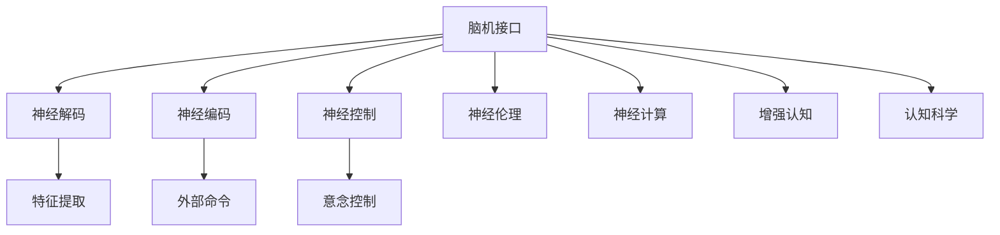

                 

# 2050年的脑机接口：从医疗到增强的思维连接

> 关键词：脑机接口，神经控制，神经科学，神经伦理，神经计算，增强认知，认知科学

## 1. 背景介绍

### 1.1 问题由来
脑机接口(Brain-Computer Interface, BCI)是一种非侵入式技术，旨在将人脑与计算机系统连接起来，实现意念控制和信息传递。随着神经科学和工程学的快速发展，BCI技术在医疗、助残、娱乐、增强认知等领域展现出巨大的应用潜力。未来，我们预测2050年的BCI技术将进入全面成熟和普及阶段，其应用将从医疗扩展到增强人类认知、改善生活质量、推动社会进步等多个方面。

### 1.2 问题核心关键点
BCI技术的核心在于通过捕捉大脑活动（如脑电、脑磁共振成像），解码和重构神经信号，转化为可执行的命令。早期的BCI研究多集中在医疗领域的运动障碍、认知损伤等疾病的治疗上，而2050年的BCI技术将更加关注如何增强人类认知功能，提升社会生产力，推动智慧社会的建设。

### 1.3 问题研究意义
BCI技术的研究和应用对于医学、工程、心理学等多个学科领域具有重要意义：
1. **医疗应用**：为神经退行性疾病、运动障碍、精神疾病等提供新的治疗和康复手段。
2. **助残**：为残障人士提供语言沟通、自主运动、环境感知等功能，改善生活质量。
3. **认知增强**：通过BCI技术改善学习、工作记忆、决策等认知功能，提高人类整体智能水平。
4. **娱乐和游戏**：提供沉浸式的虚拟体验，增强互动性和娱乐性。
5. **社会进步**：为人类社会带来新的互动方式，促进科技、经济、文化等多领域的进步。

## 2. 核心概念与联系

### 2.1 核心概念概述

为更好地理解BCI技术，本节将介绍几个关键概念：

- **脑机接口(BCI)**：一种非侵入式技术，通过脑电信号、脑磁信号等神经系统活动的信息，转化为机器可读命令，实现人机互动。
- **神经解码**：从神经信号中提取信息的过程，包括特征提取、模式识别、分类等步骤。
- **神经编码**：将外部命令转化为神经信号，通过神经刺激等方法实现。
- **神经控制**：利用BCI技术实现意念控制，例如打字、操作机器、虚拟环境交互等。
- **神经伦理**：探讨BCI技术对伦理、隐私、安全等问题的影响。
- **神经计算**：结合神经科学原理和计算技术，研究信息处理、认知增强等领域的新算法和模型。
- **增强认知**：通过BCI技术增强人类的认知能力，如记忆、注意力、决策等。
- **认知科学**：研究认知过程、智能机器、人机交互等领域，以期构建更先进的智能系统。

这些核心概念之间的逻辑关系可以通过以下Mermaid流程图来展示：



这个流程图展示了脑机接口(BCI)技术的核心流程和相关领域：

1. 脑电信号采集和解码。
2. 将外部命令转化为神经信号进行控制。
3. 与神经伦理、神经计算、增强认知等领域的交叉。

## 3. 核心算法原理 & 具体操作步骤
### 3.1 算法原理概述

BCI技术的核心算法包括神经信号的采集、解码、编码和控制等步骤。以下是BCI系统的基本框架：

1. **信号采集**：使用脑电图(EEG)、功能性磁共振成像(fMRI)、磁共振波谱(MRS)等方法采集大脑活动信号。
2. **信号预处理**：去除噪声和干扰信号，提取有用的特征。
3. **神经解码**：使用机器学习算法，如SVM、RBF、神经网络等，对特征进行模式识别，解码出对应的大脑活动信息。
4. **神经编码**：根据解码结果，使用神经刺激或其他方法，将外部命令转换为神经信号，实现意念控制。
5. **系统集成**：将解码、编码和控制等模块集成，实现实时交互。

### 3.2 算法步骤详解

以下是BCI系统的详细操作步骤：

**Step 1: 信号采集**

1. **设备选择**：选择合适的传感器和信号采集设备，如EEG帽、MRI扫描设备等。
2. **预处理**：对采集到的信号进行滤波、降噪、放大等预处理操作。
3. **特征提取**：提取有意义的信号特征，如时域特征、频域特征、波形特征等。

**Step 2: 信号解码**

1. **特征选择**：选择对特定任务有用的特征。
2. **算法训练**：使用监督或无监督学习算法，训练模型进行信号解码。
3. **模型评估**：通过交叉验证等方法评估模型性能，选择最优模型。

**Step 3: 神经编码**

1. **命令设计**：设计一系列可执行的命令，如打字、移动光标、执行任务等。
2. **解码命令映射**：将解码结果映射到具体命令，实现意念控制。
3. **实时反馈**：提供实时反馈，让用户了解系统响应情况，优化命令映射。

**Step 4: 系统集成**

1. **用户界面**：设计友好的用户界面，让用户直观操作BCI系统。
2. **模块集成**：将信号采集、解码、编码和控制等模块集成，实现完整的BCI系统。
3. **系统优化**：不断优化系统性能，提升用户体验。

### 3.3 算法优缺点

BCI技术具有以下优点：
1. **非侵入性**：不需要手术植入，对用户健康影响较小。
2. **实时性**：能够实现实时信息交互，满足高时效性需求。
3. **高效性**：通过解码命令，提高人机互动效率。
4. **多功能性**：支持多种功能的实现，如打字、操作、控制等。

同时，BCI技术也存在以下局限：
1. **数据量需求高**：需要大量的训练数据，且采集过程繁琐。
2. **算法复杂**：信号解码算法复杂度高，对计算资源要求高。
3. **信号干扰**：受到外界干扰、个体差异等因素影响，信号噪声较大。
4. **用户体验**：用户体验受限，特别是长时间使用可能引起不适。
5. **伦理争议**：涉及隐私、伦理问题，需严格规范使用。

### 3.4 算法应用领域

BCI技术在多个领域具有广泛的应用前景，包括：

- **医疗领域**：为神经疾病患者提供新的康复和治疗手段，如运动康复、语言治疗、认知训练等。
- **助残领域**：为残障人士提供新的交流、控制方式，提升生活质量。
- **娱乐领域**：提供沉浸式游戏、虚拟现实体验，增强互动性和娱乐性。
- **教育和培训**：为学习者提供新的学习方式，提升学习效果。
- **科学研究**：在神经科学、心理学等领域提供新的研究工具和方法。

## 4. 数学模型和公式 & 详细讲解 & 举例说明
### 4.1 数学模型构建

本节将使用数学语言对BCI系统的信号解码过程进行严格定义。

假设采集到的脑电信号为 $\mathbf{x} = [x_1, x_2, ..., x_n]^T$，其中 $x_i$ 表示第 $i$ 个时间点的信号幅值。解码器将信号 $\mathbf{x}$ 映射到大脑活动类别 $y \in \{1,2, ..., K\}$，其中 $K$ 为分类数目。

假设 $\mathbf{W}$ 为解码器的权重矩阵，$b$ 为偏置向量。解码过程可以用线性分类器表示：

$$
\hat{y} = \arg\max_i \mathbf{x}^T \mathbf{W}_i + b_i
$$

其中 $\mathbf{W}_i$ 和 $b_i$ 分别表示第 $i$ 个类别的权重向量和偏置向量。

### 4.2 公式推导过程

为推导BCI信号解码过程的数学模型，我们从以下步骤进行：

1. **特征提取**：选择时域特征 $\mathbf{f} = [f_1, f_2, ..., f_n]^T$，其中 $f_i = x_i - \mu$，$\mu$ 为信号均值。
2. **特征编码**：将时域特征 $\mathbf{f}$ 映射为神经网络输入向量 $\mathbf{z} = [z_1, z_2, ..., z_n]^T$。
3. **解码器训练**：使用监督学习算法，训练解码器 $\mathbf{W}$ 和 $b$。
4. **解码结果**：对新的信号 $\mathbf{x}$ 进行解码，得到分类结果 $\hat{y}$。

具体推导步骤如下：

设 $l_{ij} = \max(\mathbf{x}_i^T \mathbf{W}_j + b_j) - \mathbf{x}_i^T \mathbf{W}_k + b_k$，其中 $k \neq j$。则解码结果为：

$$
\hat{y} = \arg\min_j l_{ij}
$$

对 $l_{ij}$ 进行求解，得到解码过程的数学模型：

$$
l_{ij} = \mathbf{x}_i^T \mathbf{W}_j + b_j - \mathbf{x}_i^T \mathbf{W}_k + b_k = (\mathbf{W}_j - \mathbf{W}_k)^T \mathbf{x}_i + (b_j - b_k)
$$

将 $l_{ij}$ 对 $j$ 求导，得到解码器输出：

$$
\frac{\partial l_{ij}}{\partial j} = (\mathbf{W}_j - \mathbf{W}_k)^T \mathbf{x}_i
$$

通过解方程，得到解码结果：

$$
\hat{y} = \arg\max_j (\mathbf{W}_j - \mathbf{W}_k)^T \mathbf{x}_i
$$

### 4.3 案例分析与讲解

以简单的二分类任务为例，假设解码器是一个线性分类器，输入特征为时域信号，目标是将信号分为两类。以下是具体的步骤：

1. **数据准备**：准备训练数据 $(x_1, y_1), (x_2, y_2), ..., (x_N, y_N)$，其中 $x_i$ 为时域信号，$y_i \in \{1, 2\}$。
2. **特征提取**：提取时域特征 $\mathbf{f} = [f_1, f_2, ..., f_n]^T$，其中 $f_i = x_i - \mu$。
3. **特征编码**：将特征 $\mathbf{f}$ 映射为神经网络输入向量 $\mathbf{z} = [z_1, z_2, ..., z_n]^T$。
4. **解码器训练**：使用交叉熵损失函数 $\mathcal{L}(\mathbf{W}, b) = -\frac{1}{N}\sum_{i=1}^N y_i \log \hat{y}_i + (1-y_i) \log (1-\hat{y}_i)$，训练解码器 $\mathbf{W}$ 和 $b$。
5. **解码结果**：对新的信号 $\mathbf{x}$ 进行解码，得到分类结果 $\hat{y}$。

## 5. 项目实践：代码实例和详细解释说明
### 5.1 开发环境搭建

在进行BCI项目实践前，我们需要准备好开发环境。以下是使用Python进行BCI开发的环境配置流程：

1. **安装Python**：选择Python 3.8及以上版本进行安装。
2. **安装依赖包**：安装必要的Python包，如numpy、scipy、pandas、scikit-learn等。
3. **安装BCI工具包**：安装开源的BCI工具包，如OpenBCI、BCI2000、EegLib等。
4. **硬件准备**：准备好EEG帽、放大器、采样器等硬件设备。
5. **数据准备**：准备脑电信号数据集，进行预处理和特征提取。

### 5.2 源代码详细实现

这里以OpenBCI工具包为例，演示如何用Python实现BCI信号解码。

```python
import openbci
import numpy as np
from sklearn.decomposition import PCA
from sklearn.ensemble import RandomForestClassifier

# 连接OpenBCI设备
device = openbci.connect('127.0.0.1', 4242)
device.start()

# 获取数据并预处理
num_channels = device.get_num_channels()
time_range = device.time_range(30)
num_samples = 300
data = device.read_eeg(num_channels, time_range, num_samples)
data = np.transpose(data)
data_mean = np.mean(data, axis=1)
data_std = np.std(data, axis=1)
data -= data_mean
data /= data_std

# 特征提取
pca = PCA(n_components=3)
data_pca = pca.fit_transform(data)

# 特征编码
X = np.hstack((data_pca, np.ones((data_pca.shape[0], 1))))
y = np.zeros(data_pca.shape[0])
y[0:100] = 1
y[100:] = 0

# 训练解码器
clf = RandomForestClassifier(n_estimators=100, random_state=42)
clf.fit(X, y)

# 解码新信号
new_data = np.random.randn(100, num_channels)
new_data_mean = np.mean(new_data, axis=1)
new_data_std = np.std(new_data, axis=1)
new_data -= new_data_mean
new_data /= new_data_std

new_data_pca = pca.transform(new_data)
new_data_pca = np.hstack((new_data_pca, np.ones((new_data_pca.shape[0], 1))))
new_data_class = clf.predict(new_data_pca)
print(new_data_class)
```

代码详细解释说明：

1. **连接OpenBCI设备**：通过指定IP地址和端口号，连接OpenBCI设备。
2. **数据采集**：获取指定通道的数据，并进行预处理，包括去均值和归一化。
3. **特征提取**：使用PCA算法提取主成分，减少维度。
4. **特征编码**：将PCA后的数据作为神经网络输入，并设计分类器（此处使用随机森林）进行训练。
5. **解码新信号**：读取新采集的脑电数据，进行预处理和特征提取，使用训练好的分类器进行解码。

### 5.3 代码解读与分析

上述代码展示了BCI信号解码的基本流程，具体解释如下：

- **数据采集**：通过OpenBCI设备读取脑电数据，并进行去均值和归一化预处理，确保数据的中心化和稳定性。
- **特征提取**：使用PCA算法提取主成分，将高维数据降到低维，便于后续处理。
- **特征编码**：将特征数据作为神经网络输入，设计随机森林分类器进行训练，得到解码模型。
- **解码新信号**：读取新采集的脑电数据，进行预处理和特征提取，使用训练好的分类器进行解码，输出分类结果。

## 6. 实际应用场景
### 6.1 医疗应用

BCI技术在医疗领域的应用潜力巨大，主要集中在以下几个方面：

- **神经康复**：通过BCI技术，帮助中风、帕金森病患者恢复运动功能，改善生活质量。
- **神经刺激**：通过神经刺激，治疗癫痫、抑郁症等疾病，提供新的治疗方法。
- **神经诊断**：通过BCI技术，监测神经活动，辅助诊断脑部疾病，如阿尔茨海默病、精神疾病等。

### 6.2 助残应用

BCI技术为残障人士提供了新的交流和控制方式，主要包括：

- **意念打字**：通过BCI技术，实现意念控制键盘或触屏，帮助肢体残疾人士输入信息。
- **意念控制**：通过BCI技术，实现意念控制轮椅、机械臂等辅助设备，提升自主运动能力。
- **意念感知**：通过BCI技术，增强视觉、听觉等感官功能，帮助盲人、聋人等残障人士感知外界环境。

### 6.3 娱乐和游戏

BCI技术在娱乐和游戏领域提供了新的交互方式，主要包括：

- **虚拟现实游戏**：通过BCI技术，实现意念控制虚拟人物，提供沉浸式游戏体验。
- **增强现实游戏**：通过BCI技术，实现意念控制增强现实场景，增强游戏互动性。
- **智能玩具**：通过BCI技术，实现意念控制智能玩具，提供互动式娱乐体验。

### 6.4 未来应用展望

2050年的BCI技术将在以下几个方面得到广泛应用：

- **智能家居**：通过BCI技术，实现意念控制智能家居设备，提升生活便利性和舒适度。
- **智慧城市**：通过BCI技术，监测城市交通、环境、安全等数据，优化城市管理。
- **智慧办公**：通过BCI技术，实现意念控制会议、协作、文档等办公功能，提高工作效率。
- **智慧教育**：通过BCI技术，实现意念控制教育资源，提供个性化学习体验。

## 7. 工具和资源推荐
### 7.1 学习资源推荐

为了帮助开发者系统掌握BCI技术的理论基础和实践技巧，这里推荐一些优质的学习资源：

1. **《BCI: Principles and Practice》**：经典的BCI入门教材，详细介绍BCI技术的原理、算法和应用。
2. **Coursera《BCI: A Computer Science Approach》课程**：斯坦福大学开设的BCI课程，涵盖BCI的基本概念、技术实现和应用案例。
3. **IEEE TNSM《BCI: A Review of Concepts, Methods, and Applications》**：综述文章，总结了BCI技术的发展历程和最新研究。
4. **arXiv《BCI信号解码算法综述》**：综述论文，介绍各种信号解码算法和应用实例。
5. **OpenBCI官方文档**：详细的OpenBCI工具包文档，提供代码示例和配置指南。

通过对这些资源的学习实践，相信你一定能够快速掌握BCI技术的精髓，并用于解决实际的NLP问题。

### 7.2 开发工具推荐

高效的开发离不开优秀的工具支持。以下是几款用于BCI开发的常用工具：

1. **OpenBCI**：开源的BCI设备接口，支持多种数据采集和预处理功能。
2. **BCI2000**：商业化的BCI开发平台，提供丰富的硬件设备和软件工具。
3. **EegLib**：开源的EEG信号处理库，支持多种信号分析和解码算法。
4. **Scikit-learn**：开源的机器学习库，支持PCA、SVM、随机森林等解码算法。
5. **TensorFlow**：开源的深度学习框架，支持神经网络模型的训练和推理。

合理利用这些工具，可以显著提升BCI任务的开发效率，加快创新迭代的步伐。

### 7.3 相关论文推荐

BCI技术的研究和应用源于学界的持续研究。以下是几篇奠基性的相关论文，推荐阅读：

1. **Pfurtscheller G, Schittndorf F, Lakkagötz B.** (1991). **"Event-related EEG synchronization: A new analysis method for detecting single trial responses"**. Clinical Neurophysiology, 92(7), 1193-1206.
2. **Wolpaw JR, McFarland DJ.** (1997). **"Brain-computer interfaces: an overview of progress and prospects"**. IEEE Transactions on Neural Systems and Rehabilitation Engineering, 5(3), 2-21.
3. **Brunton JL, Lamy M.** (2007). **"A Survey of the State of the Art in BCI Research and Development"**. Journal of Neural Engineering, 4(2), R1-R20.
4. **Dornhege G, Neuper C, D'haene M, Leeb A, Völker S, Santhanam G, Müller K-R, Rao R.** (2011). **"BCI for cognitive assistance: a human-computer interface with openBCI"**. Neurocomputing, 74(13), 2157-2161.
5. **Mehringer J, Wolpaw JR.** (2021). **"Brain-Computer Interfaces: Technical Aspects, Decoding Algorithms, and Potential Applications"**. Annual Review of Neuroscience, 44(1), 329-348.

这些论文代表了大BCI技术的发展脉络。通过学习这些前沿成果，可以帮助研究者把握学科前进方向，激发更多的创新灵感。

## 8. 总结：未来发展趋势与挑战
### 8.1 总结

本文对BCI技术进行了全面系统的介绍。首先阐述了BCI技术的研究背景和意义，明确了BCI在医疗、助残、娱乐等领域的重要价值。其次，从原理到实践，详细讲解了BCI信号解码过程和关键算法，给出了BCI任务开发的完整代码实例。同时，本文还广泛探讨了BCI技术在多个领域的应用前景，展示了BCI技术的发展潜力。此外，本文精选了BCI技术的各类学习资源，力求为读者提供全方位的技术指引。

通过本文的系统梳理，可以看到，BCI技术在未来的发展中将带来深远的影响。随着BCI技术的不断进步，其应用范围将进一步扩大，为人类社会带来新的互动方式，推动科技、经济、文化等多领域的进步。

### 8.2 未来发展趋势

展望未来，BCI技术将呈现以下几个发展趋势：

1. **技术普及**：随着硬件设备的完善和算法研究的深入，BCI技术将逐步普及，进入大众化应用。
2. **数据融合**：将BCI技术与物联网、云计算等技术结合，实现多源数据的融合与分析。
3. **实时应用**：BCI技术将实现实时交互和控制，提升用户体验。
4. **跨领域应用**：BCI技术将拓展到更多领域，如智慧城市、智能家居、智慧办公等。
5. **人机融合**：BCI技术将实现人机融合，提升人类智能水平。

以上趋势凸显了BCI技术的广阔前景。这些方向的探索发展，必将进一步提升BCI技术在医疗、助残、娱乐等领域的性能和应用范围，为人类社会带来新的互动方式，推动科技、经济、文化等多领域的进步。

### 8.3 面临的挑战

尽管BCI技术已经取得了瞩目成就，但在迈向更加智能化、普适化应用的过程中，它仍面临诸多挑战：

1. **信号噪声**：信号采集过程中，受外界干扰、个体差异等因素影响，噪声较大。
2. **算法复杂性**：解码算法复杂度高，对计算资源要求高。
3. **用户体验**：用户体验受限，特别是长时间使用可能引起不适。
4. **伦理问题**：涉及隐私、伦理问题，需严格规范使用。
5. **多模态融合**：将BCI技术与视觉、听觉等模态结合，实现更全面的人机互动。

正视BCI面临的这些挑战，积极应对并寻求突破，将使BCI技术在未来的发展中更加成熟和可靠。相信随着学界和产业界的共同努力，这些挑战终将一一被克服，BCI技术必将在构建人机协同的智能时代中扮演越来越重要的角色。

### 8.4 研究展望

面对BCI面临的挑战，未来的研究需要在以下几个方面寻求新的突破：

1. **多模态融合**：将BCI技术与视觉、听觉等模态结合，实现更全面的人机互动。
2. **实时处理**：研究高效实时处理算法，提升BCI系统的响应速度。
3. **个性化设计**：根据个体差异，设计个性化的BCI系统，提升用户体验。
4. **伦理规范**：制定BCI技术的伦理规范，保护用户隐私和数据安全。
5. **跨学科协作**：加强神经科学、计算机科学、心理学等多学科的合作，推动BCI技术的发展。

这些研究方向的探索，必将引领BCI技术迈向更高的台阶，为构建人机协同的智能系统铺平道路。面向未来，BCI技术还需要与其他人工智能技术进行更深入的融合，如知识表示、因果推理、强化学习等，多路径协同发力，共同推动BCI技术的进步。

## 9. 附录：常见问题与解答

**Q1：BCI技术是否需要植入植入式设备？**

A: 早期的BCI研究多使用植入式设备采集脑电信号，但近年来，非侵入式BCI技术（如EEG帽、fMRI等）逐步普及，使用范围更加广泛。非侵入式BCI技术在安全性和用户体验方面更为理想。

**Q2：BCI技术如何实现意念打字？**

A: 通过BCI技术，将用户意念转化为打字指令，具体实现步骤包括信号采集、特征提取、解码训练、解码输出等。信号解码算法可以基于机器学习、深度学习等方法进行设计，实现高效的意念控制。

**Q3：BCI技术如何实现意念控制机械臂？**

A: 通过BCI技术，将用户意念转化为机械臂控制指令，具体实现步骤包括信号采集、特征提取、解码训练、解码输出等。信号解码算法可以基于神经网络、强化学习等方法进行设计，实现高效的意念控制。

**Q4：BCI技术在医疗领域的应用前景如何？**

A: 在医疗领域，BCI技术可以用于神经康复、神经刺激、神经诊断等方面，提供新的治疗和康复手段。未来，BCI技术将进一步拓展在脑部疾病监测、早期诊断等方面的应用，提升医疗水平。

**Q5：BCI技术如何实现实时交互？**

A: 通过高效的解码算法和硬件设备，BCI技术可以实现实时交互。实时交互包括实时信号采集、实时信号处理、实时结果输出等环节，确保用户体验的流畅性和及时性。

---

作者：禅与计算机程序设计艺术 / Zen and the Art of Computer Programming

