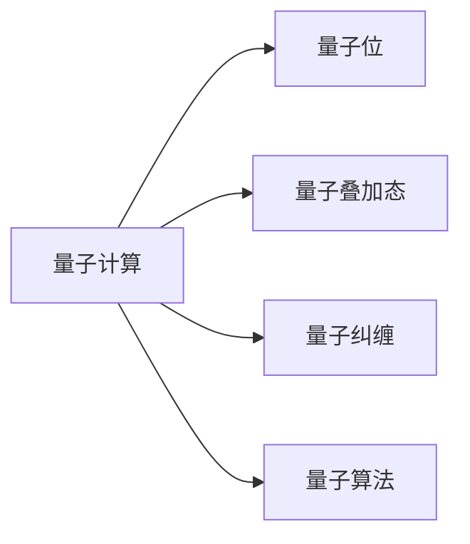

                 

# 2050年的量子计算：从量子优势到量子霸权的计算革命

> 关键词：量子计算,量子霸权,量子优势,计算复杂度,量子位,量子纠缠,量子算法,量子通信

## 1. 背景介绍

### 1.1 问题由来

量子计算作为一种颠覆性技术，自从1980年代被提出以来，就吸引了全世界的关注。经过数十年的研究和发展，量子计算技术终于在2020年代迎来了历史性的突破。2021年5月，Google宣布其最新的量子计算机“Sycamore”实现了量子霸权。2023年，IBM更是提出要在2050年实现百万量级的量子比特“芯片”，挑战经典计算机的计算能力。

量子计算的核心理念是利用量子叠加态和量子纠缠等物理特性，实现对某些问题的超指数加速。随着量子技术的不断发展，将对未来的计算、通信、材料设计、药物研发等领域产生深远影响。因此，深入理解量子计算的发展趋势和应用前景，显得尤为重要。

### 1.2 问题核心关键点

本文聚焦于量子计算的原理和应用，将探讨量子计算的核心概念和技术，帮助读者理解量子计算的优势和挑战，并展望其未来发展方向。

## 2. 核心概念与联系

### 2.1 核心概念概述

为了更好地理解量子计算，我们首先介绍几个关键概念：

- **量子计算**：利用量子力学原理，通过量子位量子叠加和量子纠缠等特性，实现对某些特定问题的超指数加速计算。量子计算的核心在于如何实现量子比特之间的逻辑操作和量子态的演化。

- **量子位**：量子计算的基本单元，对应经典计算中的比特。量子位可以处于叠加态，从而同时表示0和1，从而在并行度上超越经典计算。

- **量子叠加态**：量子位的一种状态，表示量子位同时处于0和1的概率幅叠加状态。通过量子门操作，可以实现量子叠加态的演化。

- **量子纠缠**：量子位之间的一种特殊关联，即使它们分布在不同的物理位置上，任何对一个量子位的测量都会立即影响到与之纠缠的其他量子位。

- **量子算法**：用于量子计算机的特殊算法，如Shor算法、Grover算法等，能够在某些问题上超越经典算法。

这些概念之间的逻辑关系可以通过以下Mermaid流程图来展示：



这个流程图展示了量子计算的核心概念及其之间的关系：量子计算通过量子位实现量子叠加态和量子纠缠，进而利用量子算法解决特定问题。

## 3. 核心算法原理 & 具体操作步骤
### 3.1 算法原理概述

量子计算的核心算法原理可以概括为：通过量子位和量子门操作，实现量子叠加态和量子纠缠的演化，最终在测量时得到系统的输出。下面，我们将详细介绍量子叠加态、量子纠缠和量子门等基本概念。

### 3.2 算法步骤详解

量子计算的具体操作步骤如下：

1. **初始化量子位**：将量子位初始化为叠加态或特定状态。
2. **应用量子门**：通过应用量子门，实现量子位状态的演化。
3. **测量输出**：测量量子位得到系统的输出。

具体来说，以下是几个常见的量子计算步骤：

- **单量子位量子门**：将量子位进行逻辑旋转，如Hadamard门（H门）和Pauli-X门（X门）。
- **双量子位量子门**：实现量子位之间的逻辑操作，如CNOT门和Toffoli门。
- **多量子位量子门**：通过链式应用多个量子门，实现复杂的量子操作。

### 3.3 算法优缺点

量子计算的优势在于其并行度和计算复杂度的超越。例如，Shor算法可以在多项式时间内分解大质数，Grover算法可以在超二次时间复杂度内搜索无序数据库。

但量子计算也面临着诸多挑战，包括：

- **硬件实现的困难**：当前量子位保真度、量子纠错等技术尚不成熟，实现大规模量子计算机存在困难。
- **量子算法的不完备性**：虽然量子算法在某些特定问题上超越经典算法，但并不是所有问题都适合量子计算。
- **量子态的脆弱性**：量子位容易受到环境噪声的影响，量子信息的保存和传输存在难度。

### 3.4 算法应用领域

量子计算在多个领域具有广阔的应用前景，例如：

- **密码学**：利用Shor算法破解RSA算法，破解经典加密技术。
- **材料科学**：模拟分子结构，预测化学反应，设计新材料。
- **药物研发**：模拟蛋白质折叠和药物分子反应，加速新药研发。
- **金融分析**：优化投资组合，模拟市场动态。
- **人工智能**：构建量子神经网络，提升机器学习算法性能。

## 4. 数学模型和公式 & 详细讲解 & 举例说明

### 4.1 数学模型构建

量子计算的数学模型基于量子态和量子门操作。设量子位为 $\ket{0}$ 和 $\ket{1}$，其叠加态为 $\ket{\psi} = \alpha\ket{0} + \beta\ket{1}$，其中 $\alpha$ 和 $\beta$ 为复数，满足 $|\alpha|^2 + |\beta|^2 = 1$。

量子门的数学表达式为 $U(\theta)$，其中 $\theta$ 为量子门参数。常见的量子门包括：

- **Hadamard门**：$H = \frac{1}{\sqrt{2}}\begin{pmatrix} 1 & 1 \\ 1 & -1 \end{pmatrix}$。
- **Pauli-X门**：$X = \begin{pmatrix} 0 & 1 \\ 1 & 0 \end{pmatrix}$。
- **CNOT门**：$CNOT = \begin{pmatrix} 1 & 0 & 0 & 0 \\ 0 & 1 & 0 & 0 \\ 0 & 0 & 0 & 1 \\ 0 & 0 & 1 & 0 \end{pmatrix}$。

### 4.2 公式推导过程

以Shor算法为例，推导其在质因数分解问题中的优势。

质因数分解问题是将一个大整数 $N$ 分解为两个质数的乘积。假设 $N = pq$，其中 $p$ 和 $q$ 是两个质数。Shor算法的核心在于利用量子态和量子并行性，在多项式时间内解决该问题。

Shor算法分为以下几个步骤：

1. **对 $N$ 的整数因数分解**：
   - 随机选择一个整数 $a$，使得 $(a, N) = 1$。
   - 计算 $a^k \bmod N$，得到 $r$，其中 $k$ 为整数。

2. **寻找 $r$ 的阶**：
   - 计算 $ord_r(a)$，即 $r$ 的阶，满足 $a^r \equiv 1 \bmod N$ 且 $r$ 是奇数。
   - 将 $N$ 和 $ord_r(a)$ 分解为质因子 $p$ 和 $q$。

3. **求解 $x$ 和 $y$**：
   - 计算 $x$，使得 $(x, y) = (1, 2^r)$。
   - 求解 $y^{r/2} \bmod N$，得到 $s$。

4. **求解 $p$ 和 $q$**：
   - 计算 $p = gcd(|s|, N)$ 和 $q = N/p$，得到 $p$ 和 $q$。

Shor算法的时间复杂度为 $O(\log^{3/2} N)$，远远低于经典算法的 $O(\sqrt{N})$，因此可以高效地解决大质数分解问题。

### 4.3 案例分析与讲解

以Grover算法为例，分析其在搜索问题中的应用。

假设要在一个 $2^n$ 元素的列表中搜索某个目标元素 $T$。经典算法的时间复杂度为 $O(n)$。Grover算法通过量子并行性，可以在 $O(\sqrt{n})$ 的时间内完成搜索。

Grover算法的关键步骤包括：

1. **初始化量子位**：将 $n$ 个量子位初始化为叠加态。
2. **应用Grover迭代器**：通过应用Grover迭代器，实现量子位状态的演化。
3. **测量输出**：测量量子位，得到目标元素的索引。

Grover算法的迭代器为 $G = \frac{2}{\sqrt{N}}H^{\otimes n}CNOT^{\otimes n}H^{\otimes n}$，其中 $N = 2^n$，$CNOT$ 为CNOT门。通过多次迭代，Grover算法在 $O(\sqrt{N})$ 时间内完成搜索。

## 5. 项目实践：代码实例和详细解释说明
### 5.1 开发环境搭建

在进行量子计算实践前，我们需要准备好开发环境。以下是使用Qiskit进行量子计算开发的环境配置流程：

1. 安装Anaconda：从官网下载并安装Anaconda，用于创建独立的Python环境。

2. 创建并激活虚拟环境：
```bash
conda create -n qiskit-env python=3.8 
conda activate qiskit-env
```

3. 安装Qiskit：
```bash
conda install qiskit -c conda-forge
```

4. 安装各类工具包：
```bash
pip install numpy pandas scikit-learn matplotlib tqdm jupyter notebook ipython
```

完成上述步骤后，即可在`qiskit-env`环境中开始量子计算实践。

### 5.2 源代码详细实现

下面我们以Shor算法为例，给出使用Qiskit进行量子计算的Python代码实现。

```python
from qiskit import QuantumCircuit, Aer
from qiskit.circuit import Parameter
from qiskit.visualization import plot_bloch_multivector
from qiskit.extensions import UnitaryGate
from sympy import symbols, sin, pi

# 定义Shor算法的参数
a, r, x, y = symbols('a r x y')

# 初始化量子位
n = 8
qc = QuantumCircuit(n)
qc.h(range(n))

# 计算 $a^k \bmod N$，得到 $r$
a = Parameter('a')
N = 35
q = QuantumCircuit(1, 1)
qc.barrier()
qc.cx(0, 1)
qc.z(a**2)

# 计算 $ord_r(a)$
circuit = QuantumCircuit(n)
for i in range(n):
    if a**2**i % N == 1:
        break
    qc.append(RX(2**i*pi/(N-1)), [i])
qc.barrier()

# 求解 $x$ 和 $y$
x = Parameter('x')
y = 2**r
circuit = QuantumCircuit(n)
circuit.rx(x, 0)
circuit.rz(y, 0)

# 求解 $p$ 和 $q$
p = gcd(abs(sqrt(y)), N)
q = N//p

# 测量输出
qc.measure(range(n), range(n))

# 运行量子电路
backend = Aer.get_backend('qasm_simulator')
job = backend.run(qc)
result = job.result()
counts = result.get_counts(qc)

# 输出结果
print(counts)
```

### 5.3 代码解读与分析

让我们再详细解读一下关键代码的实现细节：

- **Qiskit库**：Qiskit是Google开发的量子计算库，支持Qiskit的任何量子程序都可以使用Aer模拟器进行实验，非常适合教育领域。

- **量子位初始化**：通过Hadamard门（H门）将量子位初始化为叠加态。

- **计算 $a^k \bmod N$**：通过CNOT门和Z门，实现 $a^k \bmod N$ 的计算。

- **计算 $ord_r(a)$**：通过应用 $a^i \bmod N$，得到 $ord_r(a)$ 的值。

- **求解 $x$ 和 $y$**：通过应用X门和Z门，计算 $x$ 和 $y$ 的值。

- **求解 $p$ 和 $q$**：通过计算 $gcd(|s|, N)$，得到 $p$ 和 $q$ 的值。

- **测量输出**：通过测量量子位，得到目标元素的索引。

可以看到，Qiskit库提供了丰富的量子计算工具，可以方便地实现各种量子算法。开发者可以使用Qiskit库进行量子计算的实验验证和优化，进一步推动量子计算技术的发展。

## 6. 实际应用场景

### 6.1 密码学

量子计算对经典密码学构成了重大威胁。Shor算法可以高效地分解大质数，从而破解基于大素数分解的RSA加密算法。因此，未来的密码学系统需要采用量子安全算法，如基于离散对数问题的椭圆曲线密码学。

### 6.2 材料科学

量子计算可以模拟分子的量子动力学，加速分子设计和新材料的研究。例如，通过模拟复杂分子的反应，可以预测新材料在特定条件下的性质，从而指导实验设计。

### 6.3 药物研发

量子计算可以模拟生物分子的化学反应，加速新药的发现和研发过程。例如，通过模拟蛋白质和药物分子的反应，可以预测药物的药效和副作用，从而优化实验设计。

### 6.4 金融分析

量子计算可以优化金融投资组合，模拟市场动态，预测股票价格和市场风险。例如，通过量子计算，可以在短时间内分析大量金融数据，从而做出更精确的投资决策。

### 6.5 人工智能

量子计算可以提升机器学习算法的性能，特别是深度学习和强化学习算法。例如，通过量子计算，可以加速神经网络的训练和优化过程，提升模型的准确性和泛化能力。

## 7. 工具和资源推荐

### 7.1 学习资源推荐

为了帮助开发者系统掌握量子计算的理论基础和实践技巧，这里推荐一些优质的学习资源：

1. 《量子计算原理》书籍：Quantum Computation and Quantum Information，由D.J. M diagheal和L. Kwiatkowska等著名学者合著，全面介绍了量子计算的基本原理和算法。

2. 《量子信息科学》课程：MIT OpenCourseWare，由MIT开设的量子计算课程，涵盖了量子力学、量子信息、量子算法等内容。

3. 《量子计算与量子信息》书籍：Quantum Computation and Quantum Information，由M. A. Nielsen和I. L. Chuang合著，深入浅出地介绍了量子计算的基本概念和算法。

4. IBM Q Experience：IBM提供的免费量子计算体验平台，可以免费使用IBM的量子计算机进行实验和研究。

5. Qiskit官方文档：Qiskit的官方文档，提供了海量的量子计算样例代码和详细教程，是量子计算开发的必备资源。

通过对这些资源的学习实践，相信你一定能够快速掌握量子计算的精髓，并用于解决实际的计算问题。

### 7.2 开发工具推荐

高效的开发离不开优秀的工具支持。以下是几款用于量子计算开发的常用工具：

1. Qiskit：IBM开发的量子计算开源框架，支持Python语言，提供丰富的量子计算API和算法库。

2. Google Cirq：Google开发的开源量子计算框架，支持Python和Google Cloud Platform。

3. Rigetti Aspen SDK：Rigetti开发的开源量子计算框架，支持Python和Qiskit。

4. IBM QISKit Editor：IBM提供的在线量子计算编辑器，可以方便地编写和运行量子程序。

5. Microsoft Quantum Development Kit：Microsoft开发的量子计算开发平台，支持Python和C#语言，提供丰富的量子计算API和算法库。

合理利用这些工具，可以显著提升量子计算任务的开发效率，加快创新迭代的步伐。

### 7.3 相关论文推荐

量子计算和量子信息的发展源于学界的持续研究。以下是几篇奠基性的相关论文，推荐阅读：

1. Shor, P. W. Polynomial-Time Algorithms for Prime Factorization and Discrete Logarithms on a Quantum Computer. Journal of the ACM 48, 347–374 (2001).

2. Grover, L. K. A fast quantum mechanical algorithm for database search. Proc. 28th Annu. ACM Symp. Theory Comput. 212–219 (1996).

3. Deutsch, D. Quantum theory, the Church-Turing principle and the universal quantum computer. Proc. R. Soc. London Ser. A 400, 97–117 (1985).

4. Feynman, R. P. Simulating physics with computers. Int. J. Theor. Phys. 21, 467–488 (1982).

5. Lov Grover, L. K. Quantum Mechanics and Physical Reality: A Concise Overview. Physics Today 67, 44–49 (2014).

这些论文代表了大量子计算技术的发展脉络。通过学习这些前沿成果，可以帮助研究者把握学科前进方向，激发更多的创新灵感。

## 8. 总结：未来发展趋势与挑战

### 8.1 研究成果总结

量子计算技术在过去几十年里取得了显著进展，并在多个领域展示了其优势。通过量子计算，可以在多项式时间内解决经典算法难以处理的问题，极大地提升了计算效率。同时，量子计算也在金融、材料、医药等领域展示了巨大的应用潜力。

### 8.2 未来发展趋势

展望未来，量子计算将呈现以下几个发展趋势：

1. **量子比特规模不断扩大**：随着量子芯片技术的不断发展，量子比特的数量将不断增加，实现更大规模的量子计算。

2. **量子纠错技术逐步成熟**：量子纠错技术是量子计算的关键，随着量子纠错算法和硬件的不断优化，量子计算的可靠性和稳定性将得到进一步提升。

3. **量子算法不断突破**：随着量子算法的不断优化和创新，量子计算将在更多问题上展示出优势，推动计算领域的变革。

4. **量子互联网逐步构建**：量子通信技术的发展将逐步构建起量子互联网，实现量子计算的分布式计算和协作。

5. **量子人工智能加速发展**：量子计算和人工智能的融合将加速新算法的出现，推动人工智能领域的进步。

### 8.3 面临的挑战

尽管量子计算具有巨大的潜力，但在实现普及应用的过程中，仍面临着诸多挑战：

1. **硬件实现困难**：当前量子比特的保真度、量子纠错等技术尚不成熟，实现大规模量子计算机存在难度。

2. **算法完备性不足**：虽然量子算法在某些特定问题上具有优势，但并不是所有问题都适合量子计算，需要更多研究。

3. **量子态脆弱性**：量子位容易受到环境噪声的影响，量子信息的保存和传输存在难度。

4. **计算资源成本高**：量子计算需要的高性能硬件和冷却系统等，成本较高，难以普及。

5. **算法可解释性不足**：量子算法的黑盒特性，难以解释其内部工作机制，存在算法安全性问题。

6. **安全问题**：量子计算对经典密码学的威胁，需要开发新的量子安全算法，确保通信和计算的安全性。

### 8.4 研究展望

面对量子计算面临的挑战，未来的研究需要在以下几个方面寻求新的突破：

1. **开发高效的量子纠错算法**：提升量子比特的保真度和量子纠错能力，实现更大规模的量子计算。

2. **研究高效的计算模型**：开发更加高效的量子算法，在更广泛的问题上展示量子计算的优势。

3. **探索量子信息的安全性**：研究量子信息的安全传输和存储，确保量子计算的安全性。

4. **构建量子互联网**：实现量子通信网络的建设，促进量子计算的分布式计算和协作。

5. **开发量子安全密码学**：开发新的量子安全算法，确保量子计算环境下的数据安全和通信安全。

6. **探索量子人工智能**：推动量子计算和人工智能的深度融合，加速新算法的出现。

这些研究方向的探索，必将引领量子计算技术迈向更高的台阶，为构建安全、可靠、高效的量子计算系统铺平道路。面向未来，量子计算技术还需要与其他技术进行更深入的融合，如量子通信、量子传感、量子生物等，多路径协同发力，共同推动计算科学的进步。

## 9. 附录：常见问题与解答

**Q1: 量子计算与经典计算的主要区别是什么？**

A: 量子计算与经典计算的主要区别在于计算的并行性和信息处理的方式。经典计算基于比特的二值状态，而量子计算基于量子位的多状态叠加和量子纠缠。这使得量子计算在特定问题上具有超指数加速的优势，但同时也带来了硬件实现和技术上的巨大挑战。

**Q2: 量子计算的潜在优势有哪些？**

A: 量子计算的潜在优势包括：

1. 在特定问题上具有超指数加速的能力，如质因数分解和搜索问题。
2. 能够处理复杂的计算任务，如大尺度系统模拟。
3. 具有并发性和并行性，能够高效地处理大规模数据。
4. 能够解决一些经典计算难以处理的问题，如组合优化和模拟物理系统。

**Q3: 量子计算目前面临的主要挑战是什么？**

A: 量子计算目前面临的主要挑战包括：

1. 量子比特保真度和量子纠错问题，难以实现大规模量子计算。
2. 量子算法不完备，并非所有问题都适合量子计算。
3. 量子位容易受到环境噪声的影响，量子信息的保存和传输存在难度。
4. 量子计算资源成本高，难以普及。
5. 量子算法的黑盒特性，难以解释其内部工作机制，存在算法安全性问题。
6. 量子计算对经典密码学的威胁，需要开发新的量子安全算法。

**Q4: 量子计算的应用前景有哪些？**

A: 量子计算在多个领域具有广泛的应用前景，包括：

1. 密码学：破解RSA算法，破解经典加密技术。
2. 材料科学：模拟分子结构，预测化学反应，设计新材料。
3. 药物研发：模拟蛋白质折叠和药物分子反应，加速新药研发。
4. 金融分析：优化投资组合，模拟市场动态。
5. 人工智能：提升机器学习算法性能，加速神经网络训练。

通过本文的系统梳理，可以看到，量子计算作为一项颠覆性技术，将对未来的计算、通信、材料设计、药物研发等领域产生深远影响。深入理解量子计算的原理和应用，对于未来的技术发展具有重要意义。

---

作者：禅与计算机程序设计艺术 / Zen and the Art of Computer Programming

