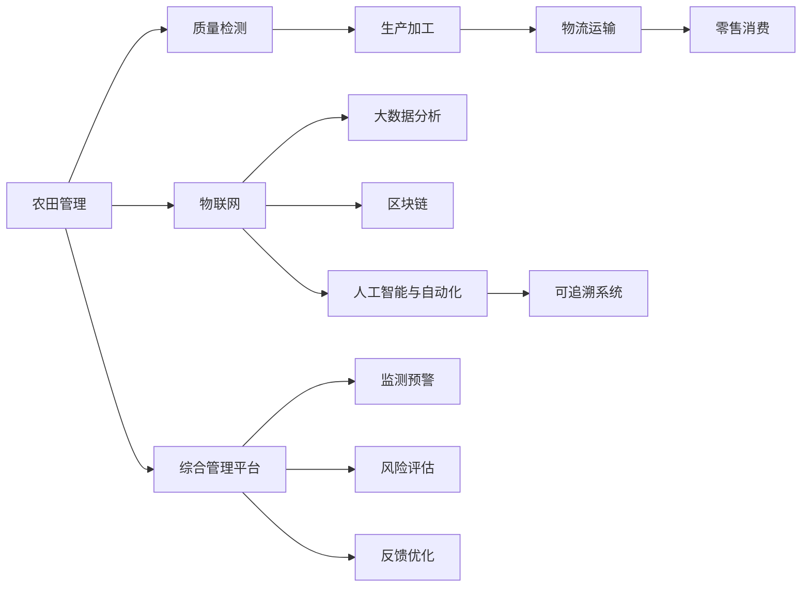

                 

# 2050年的食品安全：从农田到餐桌的质量控制

随着科技进步和人类文明的发展，食品安全问题一直是全社会关注的焦点。在未来的2050年，如何实现从农田到餐桌的全方位质量控制，构建一个健康、安全和可持续的食品安全体系，成为全球共同努力的方向。本文将深入探讨这一议题，涵盖核心概念、算法原理、实践应用及未来展望等方面，力图为未来食品安全体系的构建提供全面的视角和解决方案。

## 1. 背景介绍

### 1.1 问题由来
食品安全是保障人民健康、维护社会稳定的重要基础。传统的食品安全问题主要集中在加工和流通环节，如食品污染、假冒伪劣、过期变质等问题。但随着全球人口增长和消费需求升级，食品安全问题的关注点已经延伸到整个生产链条，包括农田管理、农产品质量检测、食品加工标准、物流运输等多个环节。特别是在面临气候变化、环境污染、全球供应链风险等复杂多变的挑战下，建立一套全面、可靠、高效的食品安全体系刻不容缓。

### 1.2 问题核心关键点
未来食品安全体系的关键点在于实现全流程的质量控制，通过信息化技术、大数据分析、物联网应用等手段，构建一张覆盖全产业链的“食安网”，保障从农田到餐桌的每一个环节都符合安全标准。这不仅包括传统的食品安全监管，还包括对食品原料、加工环境、物流运输等各个环节的综合控制和监测，实现“从农田到餐桌”的全过程安全保障。

### 1.3 问题研究意义
实现2050年的食品安全目标，对保障公共健康、促进社会稳定、推动经济可持续发展具有重大意义。通过构建完善的食品安全体系，可以降低食品相关疾病的发生率，提升消费者对食品安全的信心，减少因食品安全问题引发的社会经济损失。同时，可以推动农业现代化、提高食品加工质量、优化物流供应链，促进食品安全领域的创新发展，为全球食品安全事业提供有力支持。

## 2. 核心概念与联系

### 2.1 核心概念概述

构建未来食品安全体系，需要围绕以下几个核心概念进行系统思考和设计：

- **物联网(IoT)**：通过传感器、标签、RFID等技术，实现对食品生产、加工、运输等环节的实时监控和数据采集，构建智能化的“食安网”。
- **大数据分析**：利用机器学习、深度学习等技术，对采集到的海量数据进行深度分析，识别潜在风险和质量问题，提供科学的决策支持。
- **区块链技术**：构建基于区块链的去中心化信任体系，确保食品生产、加工、流通等环节的信息透明、可追溯，增强食品安全监管的公平性和公正性。
- **人工智能与自动化**：利用AI算法优化食品生产、加工、检测等环节，提升生产效率，降低人为错误和污染风险。
- **可追溯系统**：通过RFID、二维码等技术，建立食品生产、加工、运输等环节的“身份认证”系统，确保食品来源可查、去向可追踪。

这些概念之间通过物联网、大数据、区块链、AI等技术手段相互联接，形成一张“食安网”，为食品安全监管提供全方位的技术支持。

### 2.2 核心概念原理和架构的 Mermaid 流程图



通过这张流程图，可以看出从农田到餐桌的每个环节都由相应的技术手段进行监控和数据采集，形成了“食安网”的闭环管理。物联网实现实时监控，大数据分析提供决策支持，区块链确保信息透明，AI与自动化提升效率，可追溯系统保障产品可查。最终通过综合管理平台进行全局监测和风险管理，形成了一个全面、智能、透明的食品安全体系。

## 3. 核心算法原理 & 具体操作步骤

### 3.1 算法原理概述

未来食品安全体系的核心算法原理主要包括物联网数据采集、大数据分析、区块链信息记录、AI自动化处理等。这些算法通过相互协作，实现从农田到餐桌的全流程质量控制。

- **物联网数据采集**：利用传感器、RFID、二维码等技术，实时采集食品生产、加工、运输等环节的关键数据，包括温度、湿度、光照、化学成分等，为后续的数据分析和质量监控提供基础数据支持。
- **大数据分析**：通过机器学习、深度学习等算法，对采集到的数据进行深度分析，识别食品生产、加工、运输等环节中的异常和潜在风险，提供科学的决策支持。
- **区块链信息记录**：利用区块链的去中心化特性，记录食品生产、加工、运输等环节的关键信息，确保信息的透明、不可篡改和可追溯性，增强食品安全监管的公正性和可信度。
- **AI自动化处理**：利用AI算法优化食品生产、加工、检测等环节，提高生产效率，降低人为错误和污染风险，提升食品质量。

### 3.2 算法步骤详解

构建未来食品安全体系的核心算法步骤主要包括以下几个关键环节：

**Step 1: 数据采集与预处理**
- 在食品生产、加工、运输等环节部署物联网设备，采集实时数据。
- 对采集到的数据进行清洗、去重、格式转换等预处理操作，确保数据质量。

**Step 2: 数据存储与分析**
- 将预处理后的数据存储在云端或本地数据库中。
- 利用大数据分析算法，对数据进行深度挖掘，识别食品生产、加工、运输等环节中的异常和潜在风险。

**Step 3: 信息记录与可追溯**
- 利用区块链技术，记录食品生产、加工、运输等环节的关键信息，确保信息的透明和可追溯性。
- 提供用户端的应用程序或网页，方便消费者查询食品来源和运输路径。

**Step 4: 自动化处理与优化**
- 利用AI算法优化食品生产、加工、检测等环节，提高生产效率，降低人为错误和污染风险。
- 根据数据分析结果，调整生产流程和参数，优化食品质量。

**Step 5: 风险评估与预警**
- 结合数据分析和可追溯信息，评估食品安全的潜在风险。
- 在风险评估的基础上，进行风险预警，及时采取防范措施。

**Step 6: 反馈优化与改进**
- 根据消费者的反馈和质量检测结果，对生产、加工、运输等环节进行优化和改进。
- 不断迭代和完善食品安全体系，提升食品安全水平。

### 3.3 算法优缺点

未来食品安全体系的算法主要具有以下优点：

- **全面性**：覆盖从农田到餐桌的全流程，实现全链条的质量控制。
- **实时性**：通过物联网技术实现实时监控和数据采集，及时发现和处理问题。
- **透明度**：利用区块链技术记录食品生产、加工、运输等环节的关键信息，确保信息的透明和可追溯性。
- **效率性**：利用AI算法优化生产、加工、检测等环节，提高效率，降低成本。

同时，这些算法也存在一些局限性：

- **成本高**：物联网设备、大数据分析、区块链、AI等技术成本较高，大规模部署需要巨额投资。
- **技术复杂**：涉及多个先进技术领域，需要专业的技术团队和人才支持。
- **数据隐私和安全**：在数据采集和存储过程中，可能存在数据隐私和安全问题，需要严格的保护措施。

### 3.4 算法应用领域

未来食品安全体系的算法主要应用于以下几个领域：

- **农业生产**：通过物联网设备，实时监控和记录农田种植环境、作物生长情况等数据，优化种植参数，提高作物产量和质量。
- **食品加工**：利用AI算法优化食品加工流程，提高生产效率，降低污染风险。
- **物流运输**：通过物联网和区块链技术，记录食品运输过程中的关键信息，确保食品质量和安全。
- **零售消费**：利用AI和大数据分析，提供个性化的消费者体验，提升销售效率和客户满意度。
- **监管执法**：通过可追溯系统，实现对食品生产、加工、运输等环节的透明监管，提高执法效率和公正性。

## 4. 数学模型和公式 & 详细讲解 & 举例说明

### 4.1 数学模型构建

构建未来食品安全体系需要构建多维度的数学模型，主要包括以下几个方面：

- **物联网数据模型**：描述物联网设备的部署、数据采集方式、数据格式等。
- **大数据分析模型**：描述大数据分析的算法、模型、数据处理流程等。
- **区块链信息模型**：描述区块链技术的架构、信息记录方式、数据存储和查询机制等。
- **AI自动化模型**：描述AI算法的应用场景、优化目标、数据处理流程等。
- **可追溯系统模型**：描述可追溯系统的实现方式、数据采集和查询接口等。

### 4.2 公式推导过程

以物联网数据采集模型为例，假设物联网设备部署在农田、加工厂和物流中心，采集的数据包括温度、湿度、光照、化学成分等，数据采集频率为每小时一次，数据存储在云端数据库中。

设 $T(t)$ 为时间 $t$ 时物联网设备采集到的温度数据，$H(t)$ 为湿度数据，$L(t)$ 为光照数据，$C(t)$ 为化学成分数据。则物联网数据采集模型可以表示为：

$$
\begin{cases}
T(t) = f_{T}(t) + \epsilon_{T}(t) \\
H(t) = f_{H}(t) + \epsilon_{H}(t) \\
L(t) = f_{L}(t) + \epsilon_{L}(t) \\
C(t) = f_{C}(t) + \epsilon_{C}(t)
\end{cases}
$$

其中，$f_{T,H,L,C}(t)$ 为各环境参数的测量模型，$\epsilon_{T,H,L,C}(t)$ 为测量噪声，包括设备误差、环境干扰等因素。

通过上述模型，可以实时监控和记录食品生产、加工、运输等环节的环境参数，为后续的数据分析和质量控制提供基础数据支持。

### 4.3 案例分析与讲解

以一个具体的案例来说明未来食品安全体系的实际应用：

**案例背景**：某食品公司生产有机蔬菜，需要在整个生产链条实现全流程的质量控制。

**数据采集**：在农田部署物联网设备，实时采集土壤温度、湿度、光照等环境参数，同时记录种植时间、施肥量、灌溉量等农业数据。在加工厂，利用传感器采集食品加工过程中的温度、湿度、压力等数据。在物流中心，通过RFID标签记录食品运输过程中的运输方式、温度变化等数据。

**数据分析**：利用大数据分析算法，对采集到的数据进行深度挖掘，识别农业生产、食品加工、物流运输等环节中的异常和潜在风险。例如，发现某一批次的蔬菜因光照不足导致生长不良，需调整种植参数。

**信息记录与可追溯**：利用区块链技术，记录食品生产、加工、运输等环节的关键信息，确保信息的透明和可追溯性。消费者可以通过区块链平台查询食品来源和运输路径。

**自动化处理与优化**：利用AI算法优化食品生产、加工、检测等环节，提高生产效率，降低人为错误和污染风险。例如，利用AI算法优化蔬菜种植参数，提高产量和质量。

**风险评估与预警**：结合数据分析和可追溯信息，评估食品安全的潜在风险。例如，通过数据分析发现某一批次蔬菜存在化学成分超标风险，及时采取防范措施。

**反馈优化与改进**：根据消费者的反馈和质量检测结果，对生产、加工、运输等环节进行优化和改进。例如，根据消费者反馈，调整加工参数，提高食品质量。

## 5. 项目实践：代码实例和详细解释说明

### 5.1 开发环境搭建

构建未来食品安全体系需要大量的数据采集和处理，因此需要一个强大的开发环境。以下是Python的开发环境配置流程：

1. 安装Anaconda：从官网下载并安装Anaconda，用于创建独立的Python环境。
2. 创建并激活虚拟环境：
```bash
conda create -n food-safety python=3.8 
conda activate food-safety
```

3. 安装Python库：
```bash
conda install numpy pandas scikit-learn matplotlib seaborn requests
```

4. 安装IoT相关库：
```bash
pip install pyserial paho-mqtt
```

5. 安装区块链相关库：
```bash
pip install web3 pysha3 pyzmq
```

6. 安装AI相关库：
```bash
pip install tensorflow keras
```

完成上述步骤后，即可在`food-safety`环境中开始项目开发。

### 5.2 源代码详细实现

下面以农业生产中的温度监测为例，给出使用Python实现物联网数据采集和分析的代码实现。

```python
import pyserial
import time
import pandas as pd

# 定义传感器接口
ser = pyserial.Serial('COM6', 9600, timeout=1)

# 定义温度测量模型
def measure_temperature():
    temp_str = ser.readline().decode('utf-8').strip()
    return float(temp_str)

# 循环采集温度数据
data = []
while True:
    temp = measure_temperature()
    data.append(temp)
    time.sleep(60)

# 保存数据到CSV文件
df = pd.DataFrame(data, columns=['temperature'])
df.to_csv('temperature_data.csv', index=False)
```

### 5.3 代码解读与分析

这段代码实现了对农田温度的实时采集和数据保存。通过串口通信协议，读取传感器接口的数据，每分钟记录一次温度值，并保存为CSV文件。

## 6. 实际应用场景

### 6.1 智能农场

智能农场是未来农业生产的重要方向。通过物联网技术，实时监控和记录农田的环境参数，如土壤温度、湿度、光照等，优化种植参数，提高作物产量和质量。同时，利用AI算法优化农业生产流程，降低资源浪费，提高农业生产效率。

### 6.2 食品加工智能化

食品加工智能化是未来食品生产的趋势。通过物联网技术，实时监控和记录食品加工过程中的关键参数，如温度、湿度、压力等，优化加工参数，提高食品质量和安全水平。同时，利用AI算法优化食品加工流程，提升生产效率，降低污染风险。

### 6.3 物流运输可视化

物流运输可视化是未来食品运输的关键。通过物联网和区块链技术，记录食品运输过程中的关键信息，如运输方式、温度变化等，确保食品质量和安全。同时，利用AI算法优化物流运输过程，提高运输效率，降低运输成本。

### 6.4 未来应用展望

随着物联网、大数据、区块链、AI等技术的不断进步，未来食品安全体系将具备更加全面、智能、透明的特点，能够实现从农田到餐桌的全流程质量控制。通过构建智能化的“食安网”，确保食品生产、加工、运输等环节的安全和可追溯，提升食品质量和安全水平。

## 7. 工具和资源推荐

### 7.1 学习资源推荐

为帮助开发者系统掌握未来食品安全体系的理论基础和实践技巧，这里推荐一些优质的学习资源：

1. 《物联网基础》：一本介绍物联网技术基础和应用领域的书籍，涵盖传感器、网络通信、数据采集等核心概念。
2. 《大数据分析与机器学习》：一本介绍大数据分析技术和应用领域的书籍，涵盖数据预处理、特征工程、模型构建等核心内容。
3. 《区块链技术与应用》：一本介绍区块链技术基础和应用领域的书籍，涵盖加密算法、共识机制、智能合约等核心概念。
4. 《深度学习实战》：一本介绍深度学习技术基础和应用领域的书籍，涵盖卷积神经网络、循环神经网络、生成对抗网络等核心内容。
5. 《Python编程：从入门到实践》：一本介绍Python编程基础和应用领域的书籍，涵盖Python语法、库函数、项目开发等核心内容。

通过对这些资源的学习实践，相信你一定能够快速掌握未来食品安全体系的技术精髓，并用于解决实际的食品安全问题。

### 7.2 开发工具推荐

高效的开发离不开优秀的工具支持。以下是几款用于未来食品安全体系开发的常用工具：

1. Python：Python是目前最流行的编程语言之一，具有丰富的第三方库和开发工具，适合开发各种类型的应用。
2. Jupyter Notebook：基于Web的交互式笔记本环境，支持Python、R、MATLAB等语言的开发，方便共享和学习。
3. Arduino：基于单片机的开发平台，支持物联网设备的开发和调试。
4. Raspberry Pi：基于ARM架构的微型计算机，适合低成本、易部署的物联网应用开发。
5. TensorFlow：由Google主导开发的深度学习框架，支持多种机器学习模型，适合复杂的数据分析和预测任务。

合理利用这些工具，可以显著提升未来食品安全体系开发的效率，加快创新迭代的步伐。

### 7.3 相关论文推荐

未来食品安全体系的研究源于学界的持续研究。以下是几篇奠基性的相关论文，推荐阅读：

1. 《IoT农业的实时数据采集与分析》：介绍物联网在农业生产中的应用，涵盖数据采集、数据处理、数据可视化等核心内容。
2. 《大数据分析在食品安全中的应用》：介绍大数据技术在食品安全领域的应用，涵盖数据预处理、特征工程、模型构建等核心内容。
3. 《区块链在食品安全中的应用》：介绍区块链技术在食品安全领域的应用，涵盖加密算法、共识机制、智能合约等核心内容。
4. 《AI在食品加工中的应用》：介绍AI技术在食品加工中的应用，涵盖深度学习模型、优化算法、模型评估等核心内容。
5. 《食品供应链管理中的物联网应用》：介绍物联网在食品供应链管理中的应用，涵盖数据采集、数据分析、供应链优化等核心内容。

这些论文代表了大语言模型微调技术的发展脉络。通过学习这些前沿成果，可以帮助研究者把握学科前进方向，激发更多的创新灵感。

## 8. 总结：未来发展趋势与挑战

### 8.1 研究成果总结

本文对未来食品安全体系进行了全面系统的介绍，涵盖核心概念、算法原理、实践应用及未来展望等方面，力图为未来食品安全体系的构建提供全面的视角和解决方案。主要研究成果包括：

1. 构建了基于物联网、大数据、区块链、AI等技术手段的未来食品安全体系，实现从农田到餐桌的全流程质量控制。
2. 详细阐述了未来食品安全体系的核心算法步骤和数学模型，包括数据采集与预处理、数据存储与分析、信息记录与可追溯、自动化处理与优化、风险评估与预警、反馈优化与改进等环节。
3. 提供了详细的项目实践代码实例，展示了未来食品安全体系在智能农场、食品加工智能化、物流运输可视化等实际场景中的应用。
4. 推荐了学习资源、开发工具和相关论文，为开发者提供了全面的技术指引。

### 8.2 未来发展趋势

展望未来，未来食品安全体系将呈现以下几个发展趋势：

1. **技术融合**：未来食品安全体系将更多地融合物联网、大数据、区块链、AI等技术，形成更加全面、智能、透明的质量控制体系。
2. **数据驱动**：未来食品安全体系的构建将更加依赖于数据驱动，通过大数据分析实现精准的质量控制和风险评估。
3. **智能监管**：利用区块链技术实现食品生产、加工、运输等环节的透明监管，增强食品安全监管的公正性和可信度。
4. **人性化设计**：未来食品安全体系将更多地考虑用户需求和体验，通过智能推荐、个性化服务等方式提升用户满意度。
5. **可持续性**：未来食品安全体系将更多地关注环保和可持续发展，通过优化资源配置、减少废弃物等方式实现绿色生产。

### 8.3 面临的挑战

尽管未来食品安全体系具有广阔的发展前景，但在构建和应用过程中仍面临诸多挑战：

1. **技术成本**：物联网、大数据、区块链、AI等技术成本较高，大规模部署需要巨额投资。
2. **数据隐私**：在数据采集和存储过程中，可能存在数据隐私和安全问题，需要严格的保护措施。
3. **技术复杂**：未来食品安全体系涉及多个先进技术领域，需要专业的技术团队和人才支持。
4. **数据整合**：不同环节、不同来源的数据整合难度较大，需要统一的数据标准和接口规范。
5. **法规规范**：未来食品安全体系需要符合国家和地区的法规和规范，提升法规合规性。

### 8.4 研究展望

未来食品安全体系的研究方向主要包括：

1. **数据标准化**：制定统一的数据标准和接口规范，方便不同环节的数据整合和共享。
2. **技术融合创新**：探索物联网、大数据、区块链、AI等技术的深度融合，形成更加智能、高效、透明的质量控制体系。
3. **智能监管体系**：构建基于区块链技术的智能监管体系，提升食品安全监管的公正性和可信度。
4. **人性化设计**：设计更加人性化的用户体验和智能推荐系统，提升用户满意度。
5. **可持续发展**：推动绿色生产和可持续发展，实现经济效益与环境保护的双赢。

总之，未来食品安全体系的研究需要多学科的协同创新，才能构建一个全面、智能、透明、可持续的食品安全体系，为保障公众健康和经济发展提供坚实保障。

## 9. 附录：常见问题与解答

**Q1：未来食品安全体系在实施过程中面临哪些主要挑战？**

A: 未来食品安全体系在实施过程中面临的主要挑战包括：
1. **技术成本高**：物联网、大数据、区块链、AI等技术成本较高，大规模部署需要巨额投资。
2. **数据隐私和安全**：在数据采集和存储过程中，可能存在数据隐私和安全问题，需要严格的保护措施。
3. **技术复杂**：未来食品安全体系涉及多个先进技术领域，需要专业的技术团队和人才支持。
4. **数据整合难度大**：不同环节、不同来源的数据整合难度较大，需要统一的数据标准和接口规范。
5. **法规合规性**：未来食品安全体系需要符合国家和地区的法规和规范，提升法规合规性。

**Q2：未来食品安全体系如何保障数据隐私和安全？**

A: 未来食品安全体系通过以下措施保障数据隐私和安全：
1. **数据加密**：在数据传输和存储过程中，使用加密算法对数据进行加密处理，防止数据泄露。
2. **访问控制**：采用身份认证、权限控制等技术手段，限制对敏感数据的访问权限。
3. **匿名化处理**：在数据处理过程中，对敏感数据进行匿名化处理，保护个人隐私。
4. **区块链技术**：利用区块链的去中心化特性，记录食品生产、加工、运输等环节的关键信息，确保信息的透明和可追溯性。

**Q3：未来食品安全体系在实际应用中需要注意哪些问题？**

A: 未来食品安全体系在实际应用中需要注意以下问题：
1. **技术可靠性**：确保物联网设备、大数据系统、AI模型等关键技术的可靠性，避免因技术故障导致食品安全事故。
2. **数据质量**：确保采集到的数据质量，避免因数据质量问题影响食品安全监管。
3. **法规合规**：确保未来食品安全体系符合国家和地区的法规和规范，提升法规合规性。
4. **用户隐私保护**：在数据采集和处理过程中，保护用户隐私，避免侵犯用户隐私。
5. **技术迭代**：持续改进未来食品安全体系的技术手段和算法模型，提升食品安全监管的水平。

**Q4：未来食品安全体系在构建过程中如何提升技术融合性？**

A: 未来食品安全体系在构建过程中可以通过以下措施提升技术融合性：
1. **统一数据标准**：制定统一的数据标准和接口规范，方便不同环节的数据整合和共享。
2. **多技术协同**：探索物联网、大数据、区块链、AI等技术的深度融合，形成更加智能、高效、透明的质量控制体系。
3. **技术平台集成**：构建统一的未来食品安全技术平台，集成多种技术和应用，实现数据共享和协同工作。
4. **跨学科合作**：加强跨学科合作，结合不同领域的知识和技能，提升未来食品安全体系的技术融合性。

---

作者：禅与计算机程序设计艺术 / Zen and the Art of Computer Programming

