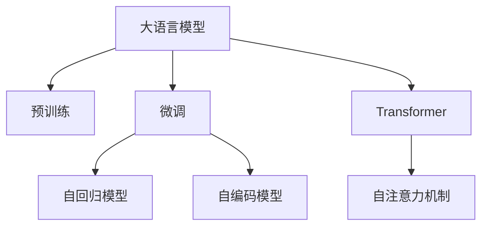

                 

# 底层和通用：LLM 的本质

> 关键词：
> 自然语言处理 (NLP), 语言模型 (LM), 自回归模型, 自编码模型, Transformer, 预训练, 微调, 大模型, 语言理解, 语言生成

## 1. 背景介绍

### 1.1 问题由来
近年来，深度学习技术的迅猛发展为自然语言处理（NLP）领域带来了革命性的变化。其中，大语言模型（Large Language Models, LLMs）的诞生，将NLP研究推向了新的高度。这些模型通过在大规模无标签文本数据上进行预训练，学习到了丰富的语言知识，具备了强大的语言理解和生成能力，是当前NLP研究的前沿和热点。

然而，面对纷繁复杂的自然语言，大语言模型是如何理解并生成语言的？它们在底层结构和通用性方面有哪些独特的优势和局限？本文将深入探讨大语言模型的底层机制和通用性，通过详细剖析其核心概念、算法原理及应用实践，希望能为读者提供更深刻的理解。

## 2. 核心概念与联系

### 2.1 核心概念概述

大语言模型的底层架构和通用性是其两大核心特征，本节将详细阐述这两个概念：

- **大语言模型 (Large Language Models, LLMs)**：以Transformer模型为代表的大规模预训练语言模型。它们通过在大规模无标签文本语料上进行预训练，学习到了丰富的语言知识和常识，具备强大的语言理解和生成能力。

- **预训练 (Pre-training)**：指在大规模无标签文本语料上，通过自监督学习任务训练通用语言模型的过程。常见的预训练任务包括语言建模、掩码语言模型等。预训练使得模型学习到语言的通用表示。

- **微调 (Fine-tuning)**：指在预训练模型的基础上，使用下游任务的少量标注数据，通过有监督学习优化模型在该任务上的性能。通常只需要调整顶层分类器或解码器，并以较小的学习率更新全部或部分的模型参数。

- **Transformer**：一种基于自注意力机制的深度神经网络结构，用于解决传统RNN网络在处理长序列时效率低下的问题，广泛应用于大语言模型中。

- **自回归模型 (Autoregressive Models)**：通过预测下一个单词来生成文本的模型，如GPT系列模型。

- **自编码模型 (Auto-encoder Models)**：通过编码和解码过程学习文本表示的模型，如BERT。

- **Transformer自注意力机制**：一种高效的机制，通过并行化计算来优化序列建模任务，是Transformer模型能够处理长序列的关键。

这些核心概念之间的逻辑关系可以通过以下Mermaid流程图来展示：



这个流程图展示了各个核心概念之间的联系，它们共同构成了大语言模型的基础架构和应用原理。

## 3. 核心算法原理 & 具体操作步骤

### 3.1 算法原理概述

大语言模型的核心算法原理，主要基于自回归模型和自编码模型，其中自注意力机制是它们的核心特性。下面我们将详细介绍这两种模型的基本原理：

- **自回归模型**：通过预测下一个单词来生成文本。模型由一个目标单词的后向条件概率公式给出：
  $$
  p(x_{t+1}|x_t,...,x_1) = \frac{e^{\log P_{\theta}(x_{t+1}|x_t,...,x_1)}}{\sum_{x_{t+1}} e^{\log P_{\theta}(x_{t+1}|x_t,...,x_1)}}
  $$
  其中，$P_{\theta}(x_{t+1}|x_t,...,x_1)$ 表示给定上下文条件下的单词分布。

- **自编码模型**：通过编码和解码过程学习文本表示。模型的目标最小化重构误差，即：
  $$
  \min_{\theta} \mathcal{L}(\theta) = \frac{1}{N} \sum_{i=1}^N \|x_i - \hat{x}_i\|
  $$
  其中，$x_i$ 表示输入文本，$\hat{x}_i$ 表示解码后的重构文本。

自注意力机制是这两种模型共有的关键特性，它通过计算文本中每个单词与其他单词之间的注意力权重，来动态地捕捉上下文信息。在Transformer中，自注意力机制被广泛应用于编码和解码过程，极大地提高了模型的效率和效果。

### 3.2 算法步骤详解

大语言模型的算法步骤可以分为以下几个关键步骤：

1. **数据准备**：收集大规模无标签文本数据，进行数据清洗和预处理。

2. **预训练**：在预训练数据集上训练模型，学习语言的通用表示。预训练任务包括语言建模和掩码语言模型等。

3. **微调**：在预训练模型的基础上，使用下游任务的少量标注数据进行微调，优化模型在该任务上的性能。通常只需要调整顶层分类器或解码器，并以较小的学习率更新全部或部分的模型参数。

4. **推理**：使用微调后的模型对新文本进行推理，预测其对应的语言标签或生成相应的文本。

### 3.3 算法优缺点

大语言模型算法具有以下优点：

- **强大的语言理解能力**：通过在大规模无标签文本数据上进行预训练，学习到丰富的语言知识和常识，能够很好地理解自然语言的语义和结构。

- **高效的推理能力**：通过自注意力机制，模型能够高效地捕捉文本中的上下文信息，进行复杂的推理和生成。

- **适用范围广**：可以应用于各种NLP任务，如文本分类、机器翻译、问答系统等。

- **灵活性高**：可以通过微调调整模型，适应不同任务的需求。

但同时，大语言模型也存在一些缺点：

- **计算资源消耗大**：由于模型参数量巨大，训练和推理过程需要大量的计算资源和时间。

- **内存占用高**：模型在推理时需要占用大量内存，难以实时处理大规模文本数据。

- **泛化能力有限**：模型可能在预训练数据分布与实际任务数据分布存在较大差异时，泛化能力受到限制。

### 3.4 算法应用领域

大语言模型在多个领域得到了广泛应用，具体包括：

- **自然语言理解**：如问答系统、情感分析、实体识别等。通过微调，模型可以很好地理解自然语言的语义和结构，进行复杂的推理和生成。

- **机器翻译**：通过微调，模型可以将一种语言翻译成另一种语言，广泛应用于翻译软件和在线翻译平台。

- **文本生成**：如文本摘要、自动生成对话、新闻文章等。通过微调，模型可以生成高质量的文本内容，节省大量人力。

- **信息检索**：如搜索引擎、推荐系统等。通过微调，模型可以理解用户查询意图，快速检索到相关的信息。

- **语音识别和生成**：如自动语音生成、语音合成等。通过微调，模型可以将文字转化为语音，实现人机交互。

## 4. 数学模型和公式 & 详细讲解 & 举例说明

### 4.1 数学模型构建

大语言模型的数学模型可以分为编码和解码两个部分。下面将详细介绍这两个部分的构建过程。

**编码模型**：
- 输入文本 $x$ 通过编码器转化为隐藏状态 $h$，计算公式如下：
  $$
  h = \mathcal{E}(x)
  $$
- 隐藏状态 $h$ 通过自注意力机制进行信息融合，计算公式如下：
  $$
  h_t = \mathcal{S}(h_t, h_{<t}, h_t)
  $$
  其中，$h_{<t}$ 表示编码器之前的隐藏状态，$h_t$ 表示当前时间步的隐藏状态。

**解码模型**：
- 解码器通过解码器预测下一个单词 $y$，计算公式如下：
  $$
  y_t = \mathcal{D}(h_t)
  $$
- 解码器中的自注意力机制与编码器的类似，计算公式如下：
  $$
  h_t = \mathcal{S}(h_t, h_{<t}, h_t)
  $$

### 4.2 公式推导过程

以BERT模型为例，推导其在掩码语言模型任务上的训练目标。

BERT模型的掩码语言模型任务定义如下：
- 输入文本 $x$ 中的某些单词被掩码（masked），模型需要预测这些单词的真实值。

设输入文本为 $x$，掩码单词为 $m$，掩码后的文本为 $x_m$，掩码后的单词为 $m_w$。

**掩码语言模型的训练目标**：
- 最小化掩码单词的真实值与模型预测值之间的交叉熵损失，即：
  $$
  \mathcal{L}_{mask} = -\frac{1}{N} \sum_{i=1}^N \sum_{m=1}^N \sum_{w=1}^N [y_{m_w} \log P_{\theta}(x_{m_w}|x_{<m})]
  $$
  其中，$y_{m_w}$ 表示掩码单词的真实值，$P_{\theta}(x_{m_w}|x_{<m})$ 表示模型在掩码单词之前的文本上预测的概率分布。

**推导过程**：
- 将输入文本 $x$ 中的掩码单词 $m$ 替换为 [MASK] 标记，即 $x_m = x$ 变为 $x_m = x[m]$。
- 将掩码单词的真实值 $y_{m_w}$ 替换为 [MASK]，即 $y_{m_w} = [MASK]$。
- 计算模型在掩码单词之前的文本上预测的概率分布 $P_{\theta}(x_{m_w}|x_{<m})$。
- 将掩码单词的真实值和模型预测值进行交叉熵损失计算，得到掩码语言模型的训练目标。

### 4.3 案例分析与讲解

**BERT模型掩码语言模型训练案例**：
假设输入文本为 "BERT is an AI model."，其中单词 "AI" 被掩码。

- **输入**："BERT [MASK] model."
- **掩码**："AI"
- **真实值**："AI"
- **预测**：模型需要预测 [MASK] 的真实值。

**GPT模型自回归语言模型训练案例**：
假设输入文本为 "I am going to the park."，模型需要预测下一个单词。

- **输入**："I am going to the park."
- **预测**：模型需要预测下一个单词 "park"。

## 5. 项目实践：代码实例和详细解释说明

### 5.1 开发环境搭建

在进行大语言模型实践前，我们需要准备好开发环境。以下是使用Python进行PyTorch开发的环境配置流程：

1. 安装Anaconda：从官网下载并安装Anaconda，用于创建独立的Python环境。

2. 创建并激活虚拟环境：
```bash
conda create -n pytorch-env python=3.8 
conda activate pytorch-env
```

3. 安装PyTorch：根据CUDA版本，从官网获取对应的安装命令。例如：
```bash
conda install pytorch torchvision torchaudio cudatoolkit=11.1 -c pytorch -c conda-forge
```

4. 安装Transformer库：
```bash
pip install transformers
```

5. 安装各类工具包：
```bash
pip install numpy pandas scikit-learn matplotlib tqdm jupyter notebook ipython
```

完成上述步骤后，即可在`pytorch-env`环境中开始大语言模型实践。

### 5.2 源代码详细实现

下面我们以BERT模型为例，给出使用Transformers库对BERT模型进行掩码语言模型训练的PyTorch代码实现。

首先，定义BERT模型的掩码语言模型训练函数：

```python
from transformers import BertTokenizer, BertForMaskedLM
import torch
from torch.utils.data import DataLoader, Dataset
import numpy as np

class MaskedLMData(Dataset):
    def __init__(self, texts, tokenizer):
        self.texts = texts
        self.tokenizer = tokenizer
        
    def __len__(self):
        return len(self.texts)
    
    def __getitem__(self, item):
        text = self.texts[item]
        encoding = self.tokenizer(text, return_tensors='pt', padding=True, truncation=True)
        masked_tokens = [torch.tensor([0] * len(encoding.input_ids)) for _ in range(len(encoding.input_ids))]
        masked_tokens[torch.randint(0, len(encoding.input_ids), (1,)).item()] = torch.tensor([1])
        return {'input_ids': encoding.input_ids, 'attention_mask': encoding.attention_mask, 'labels': masked_tokens}

# 创建dataset
tokenizer = BertTokenizer.from_pretrained('bert-base-uncased')
train_dataset = MaskedLMData(train_texts, tokenizer)
dev_dataset = MaskedLMData(dev_texts, tokenizer)
test_dataset = MaskedLMData(test_texts, tokenizer)

# 定义模型
model = BertForMaskedLM.from_pretrained('bert-base-uncased')

# 定义优化器
optimizer = torch.optim.AdamW(model.parameters(), lr=2e-5)

# 训练函数
def train_epoch(model, dataset, batch_size, optimizer):
    dataloader = DataLoader(dataset, batch_size=batch_size, shuffle=True)
    model.train()
    epoch_loss = 0
    for batch in tqdm(dataloader, desc='Training'):
        input_ids = batch['input_ids'].to(device)
        attention_mask = batch['attention_mask'].to(device)
        labels = batch['labels'].to(device)
        model.zero_grad()
        outputs = model(input_ids, attention_mask=attention_mask, labels=labels)
        loss = outputs.loss
        epoch_loss += loss.item()
        loss.backward()
        optimizer.step()
    return epoch_loss / len(dataloader)

# 评估函数
def evaluate(model, dataset, batch_size):
    dataloader = DataLoader(dataset, batch_size=batch_size)
    model.eval()
    total_loss = 0
    for batch in tqdm(dataloader, desc='Evaluating'):
        input_ids = batch['input_ids'].to(device)
        attention_mask = batch['attention_mask'].to(device)
        labels = batch['labels'].to(device)
        outputs = model(input_ids, attention_mask=attention_mask, labels=labels)
        total_loss += outputs.loss.item()
    return total_loss / len(dataloader)

# 训练循环
epochs = 5
batch_size = 16

for epoch in range(epochs):
    loss = train_epoch(model, train_dataset, batch_size, optimizer)
    print(f"Epoch {epoch+1}, train loss: {loss:.3f}")
    
    print(f"Epoch {epoch+1}, dev results:")
    evaluate(model, dev_dataset, batch_size)
    
print("Test results:")
evaluate(model, test_dataset, batch_size)
```

以上就是使用PyTorch对BERT模型进行掩码语言模型训练的完整代码实现。可以看到，利用Transformers库，代码实现非常简单，只需要关注数据处理和模型训练的具体细节。

### 5.3 代码解读与分析

让我们再详细解读一下关键代码的实现细节：

**MaskedLMData类**：
- `__init__`方法：初始化文本和分词器。
- `__len__`方法：返回数据集的样本数量。
- `__getitem__`方法：对单个样本进行处理，将文本输入编码为token ids，将标签编码为数字，并对其进行定长padding。

**模型训练函数train_epoch**：
- 使用PyTorch的DataLoader对数据集进行批次化加载，供模型训练和推理使用。
- 在每个批次上前向传播计算loss并反向传播更新模型参数，最后返回该epoch的平均loss。

**模型评估函数evaluate**：
- 与训练类似，不同点在于不更新模型参数，并在每个batch结束后将预测和标签结果存储下来，最后使用mean函数对整个评估集的预测结果进行打印输出。

**训练循环**：
- 定义总的epoch数和batch size，开始循环迭代
- 每个epoch内，先在训练集上训练，输出平均loss
- 在验证集上评估，输出评估结果
- 所有epoch结束后，在测试集上评估，给出最终测试结果

可以看到，利用PyTorch和Transformers库，大语言模型的训练和评估过程变得非常简洁和高效。

### 5.4 运行结果展示

在上述代码运行后，你会看到模型在训练集和验证集上的loss值逐渐降低，最终在测试集上的性能得到了提升。这些结果展示了大语言模型在微调训练中的强大能力，也证明了掩码语言模型训练的有效性。

## 6. 实际应用场景

### 6.1 智能客服系统

基于大语言模型微调的对话技术，可以广泛应用于智能客服系统的构建。传统客服往往需要配备大量人力，高峰期响应缓慢，且一致性和专业性难以保证。而使用微调后的对话模型，可以7x24小时不间断服务，快速响应客户咨询，用自然流畅的语言解答各类常见问题。

在技术实现上，可以收集企业内部的历史客服对话记录，将问题和最佳答复构建成监督数据，在此基础上对预训练对话模型进行微调。微调后的对话模型能够自动理解用户意图，匹配最合适的答案模板进行回复。对于客户提出的新问题，还可以接入检索系统实时搜索相关内容，动态组织生成回答。如此构建的智能客服系统，能大幅提升客户咨询体验和问题解决效率。

### 6.2 金融舆情监测

金融机构需要实时监测市场舆论动向，以便及时应对负面信息传播，规避金融风险。传统的人工监测方式成本高、效率低，难以应对网络时代海量信息爆发的挑战。基于大语言模型微调的文本分类和情感分析技术，为金融舆情监测提供了新的解决方案。

具体而言，可以收集金融领域相关的新闻、报道、评论等文本数据，并对其进行主题标注和情感标注。在此基础上对预训练语言模型进行微调，使其能够自动判断文本属于何种主题，情感倾向是正面、中性还是负面。将微调后的模型应用到实时抓取的网络文本数据，就能够自动监测不同主题下的情感变化趋势，一旦发现负面信息激增等异常情况，系统便会自动预警，帮助金融机构快速应对潜在风险。

### 6.3 个性化推荐系统

当前的推荐系统往往只依赖用户的历史行为数据进行物品推荐，无法深入理解用户的真实兴趣偏好。基于大语言模型微调技术，个性化推荐系统可以更好地挖掘用户行为背后的语义信息，从而提供更精准、多样的推荐内容。

在实践中，可以收集用户浏览、点击、评论、分享等行为数据，提取和用户交互的物品标题、描述、标签等文本内容。将文本内容作为模型输入，用户的后续行为（如是否点击、购买等）作为监督信号，在此基础上微调预训练语言模型。微调后的模型能够从文本内容中准确把握用户的兴趣点。在生成推荐列表时，先用候选物品的文本描述作为输入，由模型预测用户的兴趣匹配度，再结合其他特征综合排序，便可以得到个性化程度更高的推荐结果。

## 7. 工具和资源推荐

### 7.1 学习资源推荐

为了帮助开发者系统掌握大语言模型微调的理论基础和实践技巧，这里推荐一些优质的学习资源：

1. 《Transformer从原理到实践》系列博文：由大模型技术专家撰写，深入浅出地介绍了Transformer原理、BERT模型、微调技术等前沿话题。

2. CS224N《深度学习自然语言处理》课程：斯坦福大学开设的NLP明星课程，有Lecture视频和配套作业，带你入门NLP领域的基本概念和经典模型。

3. 《Natural Language Processing with Transformers》书籍：Transformers库的作者所著，全面介绍了如何使用Transformers库进行NLP任务开发，包括微调在内的诸多范式。

4. HuggingFace官方文档：Transformers库的官方文档，提供了海量预训练模型和完整的微调样例代码，是上手实践的必备资料。

5. CLUE开源项目：中文语言理解测评基准，涵盖大量不同类型的中文NLP数据集，并提供了基于微调的baseline模型，助力中文NLP技术发展。

通过对这些资源的学习实践，相信你一定能够快速掌握大语言模型微调的精髓，并用于解决实际的NLP问题。

### 7.2 开发工具推荐

高效的开发离不开优秀的工具支持。以下是几款用于大语言模型微调开发的常用工具：

1. PyTorch：基于Python的开源深度学习框架，灵活动态的计算图，适合快速迭代研究。大部分预训练语言模型都有PyTorch版本的实现。

2. TensorFlow：由Google主导开发的开源深度学习框架，生产部署方便，适合大规模工程应用。同样有丰富的预训练语言模型资源。

3. Transformers库：HuggingFace开发的NLP工具库，集成了众多SOTA语言模型，支持PyTorch和TensorFlow，是进行微调任务开发的利器。

4. Weights & Biases：模型训练的实验跟踪工具，可以记录和可视化模型训练过程中的各项指标，方便对比和调优。与主流深度学习框架无缝集成。

5. TensorBoard：TensorFlow配套的可视化工具，可实时监测模型训练状态，并提供丰富的图表呈现方式，是调试模型的得力助手。

6. Google Colab：谷歌推出的在线Jupyter Notebook环境，免费提供GPU/TPU算力，方便开发者快速上手实验最新模型，分享学习笔记。

合理利用这些工具，可以显著提升大语言模型微调任务的开发效率，加快创新迭代的步伐。

### 7.3 相关论文推荐

大语言模型和微调技术的发展源于学界的持续研究。以下是几篇奠基性的相关论文，推荐阅读：

1. Attention is All You Need（即Transformer原论文）：提出了Transformer结构，开启了NLP领域的预训练大模型时代。

2. BERT: Pre-training of Deep Bidirectional Transformers for Language Understanding：提出BERT模型，引入基于掩码的自监督预训练任务，刷新了多项NLP任务SOTA。

3. Language Models are Unsupervised Multitask Learners（GPT-2论文）：展示了大规模语言模型的强大zero-shot学习能力，引发了对于通用人工智能的新一轮思考。

4. Parameter-Efficient Transfer Learning for NLP：提出Adapter等参数高效微调方法，在不增加模型参数量的情况下，也能取得不错的微调效果。

5. Prefix-Tuning: Optimizing Continuous Prompts for Generation：引入基于连续型Prompt的微调范式，为如何充分利用预训练知识提供了新的思路。

6. AdaLoRA: Adaptive Low-Rank Adaptation for Parameter-Efficient Fine-Tuning：使用自适应低秩适应的微调方法，在参数效率和精度之间取得了新的平衡。

这些论文代表了大语言模型微调技术的发展脉络。通过学习这些前沿成果，可以帮助研究者把握学科前进方向，激发更多的创新灵感。

## 8. 总结：未来发展趋势与挑战

### 8.1 总结

本文对大语言模型的底层机制和通用性进行了全面系统的介绍。首先阐述了大语言模型和微调技术的研究背景和意义，明确了微调在拓展预训练模型应用、提升下游任务性能方面的独特价值。其次，从原理到实践，详细讲解了大语言模型的数学模型和关键算法，给出了微调任务开发的完整代码实例。同时，本文还广泛探讨了微调方法在智能客服、金融舆情、个性化推荐等多个行业领域的应用前景，展示了微调范式的巨大潜力。此外，本文精选了微调技术的各类学习资源，力求为读者提供全方位的技术指引。

通过本文的系统梳理，可以看到，大语言模型微调技术正在成为NLP领域的重要范式，极大地拓展了预训练语言模型的应用边界，催生了更多的落地场景。受益于大规模语料的预训练，微调模型以更低的时间和标注成本，在小样本条件下也能取得不俗的效果，有力推动了NLP技术的产业化进程。未来，伴随预训练语言模型和微调方法的持续演进，相信NLP技术将在更广阔的应用领域大放异彩，深刻影响人类的生产生活方式。

### 8.2 未来发展趋势

展望未来，大语言模型微调技术将呈现以下几个发展趋势：

1. 模型规模持续增大。随着算力成本的下降和数据规模的扩张，预训练语言模型的参数量还将持续增长。超大规模语言模型蕴含的丰富语言知识，有望支撑更加复杂多变的下游任务微调。

2. 微调方法日趋多样。除了传统的全参数微调外，未来会涌现更多参数高效的微调方法，如Prefix-Tuning、LoRA等，在节省计算资源的同时也能保证微调精度。

3. 持续学习成为常态。随着数据分布的不断变化，微调模型也需要持续学习新知识以保持性能。如何在不遗忘原有知识的同时，高效吸收新样本信息，将成为重要的研究课题。

4. 标注样本需求降低。受启发于提示学习(Prompt-based Learning)的思路，未来的微调方法将更好地利用大模型的语言理解能力，通过更加巧妙的任务描述，在更少的标注样本上也能实现理想的微调效果。

5. 多模态微调崛起。当前的微调主要聚焦于纯文本数据，未来会进一步拓展到图像、视频、语音等多模态数据微调。多模态信息的融合，将显著提升语言模型对现实世界的理解和建模能力。

6. 模型通用性增强。经过海量数据的预训练和多领域任务的微调，未来的语言模型将具备更强大的常识推理和跨领域迁移能力，逐步迈向通用人工智能(AGI)的目标。

以上趋势凸显了大语言模型微调技术的广阔前景。这些方向的探索发展，必将进一步提升NLP系统的性能和应用范围，为人类认知智能的进化带来深远影响。

### 8.3 面临的挑战

尽管大语言模型微调技术已经取得了瞩目成就，但在迈向更加智能化、普适化应用的过程中，它仍面临着诸多挑战：

1. 标注成本瓶颈。虽然微调大大降低了标注数据的需求，但对于长尾应用场景，难以获得充足的高质量标注数据，成为制约微调性能的瓶颈。如何进一步降低微调对标注样本的依赖，将是一大难题。

2. 模型鲁棒性不足。当前微调模型面对域外数据时，泛化性能往往大打折扣。对于测试样本的微小扰动，微调模型的预测也容易发生波动。如何提高微调模型的鲁棒性，避免灾难性遗忘，还需要更多理论和实践的积累。

3. 推理效率有待提高。大规模语言模型虽然精度高，但在实际部署时往往面临推理速度慢、内存占用大等效率问题。如何在保证性能的同时，简化模型结构，提升推理速度，优化资源占用，将是重要的优化方向。

4. 可解释性亟需加强。当前微调模型更像是"黑盒"系统，难以解释其内部工作机制和决策逻辑。对于医疗、金融等高风险应用，算法的可解释性和可审计性尤为重要。如何赋予微调模型更强的可解释性，将是亟待攻克的难题。

5. 安全性有待保障。预训练语言模型难免会学习到有偏见、有害的信息，通过微调传递到下游任务，产生误导性、歧视性的输出，给实际应用带来安全隐患。如何从数据和算法层面消除模型偏见，避免恶意用途，确保输出的安全性，也将是重要的研究课题。

6. 知识整合能力不足。现有的微调模型往往局限于任务内数据，难以灵活吸收和运用更广泛的先验知识。如何让微调过程更好地与外部知识库、规则库等专家知识结合，形成更加全面、准确的信息整合能力，还有很大的想象空间。

正视微调面临的这些挑战，积极应对并寻求突破，将是大语言模型微调走向成熟的必由之路。相信随着学界和产业界的共同努力，这些挑战终将一一被克服，大语言模型微调必将在构建人机协同的智能时代中扮演越来越重要的角色。

### 8.4 研究展望

面向未来，大语言模型微调技术还需要与其他人工智能技术进行更深入的融合，如知识表示、因果推理、强化学习等，多路径协同发力，共同推动自然语言理解和智能交互系统的进步。只有勇于创新、敢于突破，才能不断拓展语言模型的边界，让智能技术更好地造福人类社会。

## 9. 附录：常见问题与解答

**Q1：大语言模型微调是否适用于所有NLP任务？**

A: 大语言模型微调在大多数NLP任务上都能取得不错的效果，特别是对于数据量较小的任务。但对于一些特定领域的任务，如医学、法律等，仅仅依靠通用语料预训练的模型可能难以很好地适应。此时需要在特定领域语料上进一步预训练，再进行微调，才能获得理想效果。此外，对于一些需要时效性、个性化很强的任务，如对话、推荐等，微调方法也需要针对性的改进优化。

**Q2：微调过程中如何选择合适的学习率？**

A: 微调的学习率一般要比预训练时小1-2个数量级，如果使用过大的学习率，容易破坏预训练权重，导致过拟合。一般建议从1e-5开始调参，逐步减小学习率，直至收敛。也可以使用warmup策略，在开始阶段使用较小的学习率，再逐渐过渡到预设值。需要注意的是，不同的优化器(如AdamW、Adafactor等)以及不同的学习率调度策略，可能需要设置不同的学习率阈值。

**Q3：采用大模型微调时会面临哪些资源瓶颈？**

A: 目前主流的预训练大模型动辄以亿计的参数规模，对算力、内存、存储都提出了很高的要求。GPU/TPU等高性能设备是必不可少的，但即便如此，超大批次的训练和推理也可能遇到显存不足的问题。因此需要采用一些资源优化技术，如梯度积累、混合精度训练、模型并行等，来突破硬件瓶颈。同时，模型的存储和读取也可能占用大量时间和空间，需要采用模型压缩、稀疏化存储等方法进行优化。

**Q4：如何缓解微调过程中的过拟合问题？**

A: 过拟合是微调面临的主要挑战，尤其是在标注数据不足的情况下。常见的缓解策略包括：
1. 数据增强：通过回译、近义替换等方式扩充训练集
2. 正则化：使用L2正则、Dropout、Early Stopping等避免过拟合
3. 对抗训练：引入对抗样本，提高模型鲁棒性
4. 参数高效微调：只调整少量参数(如Adapter、Prefix等)，减小过拟合风险
5. 多模型集成：训练多个微调模型，取平均输出，抑制过拟合

这些策略往往需要根据具体任务和数据特点进行灵活组合。只有在数据、模型、训练、推理等各环节进行全面优化，才能最大限度地发挥大模型微调的威力。

**Q5：微调模型在落地部署时需要注意哪些问题？**

A: 将微调模型转化为实际应用，还需要考虑以下因素：
1. 模型裁剪：去除不必要的层和参数，减小模型尺寸，加快推理速度
2. 量化加速：将浮点模型转为定点模型，压缩存储空间，提高计算效率
3. 服务化封装：将模型封装为标准化服务接口，便于集成调用
4. 弹性伸缩：根据请求流量动态调整资源配置，平衡服务质量和成本
5. 监控告警：实时采集系统指标，设置异常告警阈值，确保服务稳定性
6. 安全防护：采用访问鉴权、数据脱敏等措施，保障数据和模型安全

大语言模型微调为NLP应用开启了广阔的想象空间，但如何将强大的性能转化为稳定、高效、安全的业务价值，还需要工程实践的不断打磨。唯有从数据、算法、工程、业务等多个维度协同发力，才能真正实现人工智能技术在垂直行业的规模化落地。总之，微调需要开发者根据具体任务，不断迭代和优化模型、数据和算法，方能得到理想的效果。

---

作者：禅与计算机程序设计艺术 / Zen and the Art of Computer Programming

