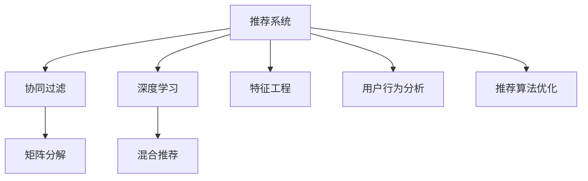

                 

# 开放域推荐：M6-Rec的探索

> 关键词：推荐系统, M6-Rec, 协同过滤, 混合推荐, 深度学习, 模型融合, 推荐系统评价指标, 特征工程, 用户行为分析, 推荐算法优化

## 1. 背景介绍

### 1.1 问题由来

推荐系统作为互联网时代的重要技术，已经成为各大电商、视频、音乐等平台的标配。传统的协同过滤(CF)和基于内容的推荐方法在初期取得了不错的效果，但随着数据量激增和用户行为多样性的增加，单一推荐方法的局限性逐渐显现。

为了应对这些挑战，学者和工程师们不断探索新的推荐算法，如基于矩阵分解的算法(SVD)、基于梯度下降的深度学习模型、结合上下文数据的深度学习模型等。但上述方法大都聚焦于特定领域或小规模数据集，难以在大规模、多场景、多模态的开放域推荐任务上取得理想效果。

因此，探索更高效的推荐算法成为了当前推荐系统研究的重点。M6-Rec算法作为一种新兴的混合推荐方法，通过结合矩阵分解和深度学习，实现了跨领域、跨模态的推荐性能提升。

### 1.2 问题核心关键点

M6-Rec算法主要基于矩阵分解和深度学习两种主流推荐方法，通过巧妙的模型融合方式，实现对用户和物品的精准表示，进而提升推荐效果。

核心关键点如下：

1. **矩阵分解**：通过PCA降维、奇异值分解(SVD)等矩阵分解方法，构建用户和物品的向量表示，捕捉用户历史行为和物品特征之间的关系。
2. **深度学习**：通过深度神经网络模型，学习用户和物品的隐式特征表示，捕捉数据中的复杂非线性关系。
3. **混合推荐**：将矩阵分解和深度学习的结果进行融合，提升推荐准确性和泛化能力。
4. **特征工程**：通过精心设计的特征选择和提取方法，提高模型的性能。
5. **用户行为分析**：结合用户行为数据和上下文信息，对用户兴趣进行建模。
6. **推荐算法优化**：通过算法改进和模型调优，提升推荐算法效果。

通过理解这些关键点，可以更好地把握M6-Rec算法的精髓，掌握其在实际推荐系统中的应用。

## 2. 核心概念与联系

### 2.1 核心概念概述

为更好地理解M6-Rec算法，本节将介绍几个关键概念：

- **推荐系统**：根据用户历史行为和物品属性，预测用户可能感兴趣的物品，并推荐给用户。
- **协同过滤**：基于用户行为数据的相似性，推荐相似用户喜欢的物品。包括基于用户的协同过滤(BU)和基于物品的协同过滤(BI)。
- **矩阵分解**：将用户行为矩阵分解为用户和物品的向量表示，捕捉用户和物品之间的关系。
- **深度学习**：使用神经网络模型，学习用户和物品的隐式特征表示，捕捉数据中的复杂非线性关系。
- **混合推荐**：结合矩阵分解和深度学习两种方法，取长补短，提升推荐效果。
- **特征工程**：通过精心设计的特征选择和提取方法，提高模型的性能。
- **用户行为分析**：通过分析用户历史行为和上下文信息，建模用户兴趣和偏好。

这些核心概念之间的逻辑关系可以通过以下Mermaid流程图来展示：



这个流程图展示了一组推荐系统关键概念及其之间的关系：

1. 推荐系统通过多种方法实现推荐。
2. 协同过滤是推荐系统的重要基础，包括矩阵分解和深度学习。
3. 混合推荐将矩阵分解和深度学习的结果进行融合。
4. 特征工程和用户行为分析对模型性能起到提升作用。
5. 推荐算法优化进一步提升推荐系统效果。

这些概念共同构成了推荐系统的核心框架，使其能够高效地为用户推荐感兴趣的物品。通过理解这些核心概念，我们可以更好地把握推荐系统的工作原理和优化方向。

## 3. 核心算法原理 & 具体操作步骤
### 3.1 算法原理概述

M6-Rec算法主要基于矩阵分解和深度学习两种主流推荐方法，通过巧妙的模型融合方式，实现对用户和物品的精准表示，进而提升推荐效果。

形式化地，假设用户行为矩阵为 $U \times I$ 的稀疏矩阵 $P$，其中 $P_{ui}$ 表示用户 $u$ 对物品 $i$ 的评分。假设用户和物品的特征矩阵分别为 $U \times F$ 和 $I \times F$，其中 $F$ 为特征维度。

M6-Rec算法通过矩阵分解和深度学习，分别学习用户和物品的向量表示 $\hat{U} \in \mathbb{R}^{N \times F}$ 和 $\hat{V} \in \mathbb{R}^{M \times F}$，其中 $N$ 和 $M$ 分别为用户和物品的数量。然后将两者融合，通过一个共享的线性层，得到最终的推荐分数 $S$。

$$
\hat{U} = \mathbf{P} * \mathbf{U}_F, \quad \hat{V} = \mathbf{P}^T * \mathbf{V}_F, \quad S = \hat{U} * \hat{V}^T
$$

其中 $\mathbf{U}_F$ 和 $\mathbf{V}_F$ 分别表示用户和物品特征矩阵的低秩分解。

### 3.2 算法步骤详解

M6-Rec算法的主要步骤如下：

**Step 1: 准备数据集和特征工程**
- 收集用户历史行为数据，构建用户行为矩阵 $P$。
- 提取用户和物品的特征，构建特征矩阵 $U_F$ 和 $V_F$。
- 进行特征选择和降维，得到最终的特征矩阵 $\mathbf{U}_F$ 和 $\mathbf{V}_F$。

**Step 2: 矩阵分解**
- 对用户行为矩阵 $P$ 进行奇异值分解，得到用户和物品的低秩分解 $\mathbf{U}_F$ 和 $\mathbf{V}_F$。
- 将分解后的矩阵进行正则化，避免过拟合。

**Step 3: 深度学习**
- 使用深度神经网络模型，如多层感知器(MLP)、卷积神经网络(CNN)等，学习用户和物品的隐式特征表示。
- 通过交叉熵损失函数对模型进行训练，预测用户对物品的评分。

**Step 4: 混合推荐**
- 将矩阵分解和深度学习的结果进行融合，通过一个共享的线性层得到最终的推荐分数 $S$。
- 根据推荐分数对物品进行排序，选取top-N进行推荐。

**Step 5: 模型评估与调优**
- 使用推荐系统评价指标，如准确率、召回率、F1值等，评估推荐效果。
- 根据评估结果，调整模型参数，优化推荐算法。

### 3.3 算法优缺点

M6-Rec算法具有以下优点：
1. 结合矩阵分解和深度学习，提升推荐效果。
2. 具有较高的准确性和泛化能力。
3. 能够处理大规模、高维度的数据。
4. 模型融合方式灵活，可以结合多种推荐方法。

同时，该算法也存在一定的局限性：
1. 模型复杂度较高，需要更多的计算资源。
2. 深度学习部分可能需要更多的标注数据。
3. 特征选择和工程难度较大。
4. 对于冷启动用户，推荐效果可能较差。

尽管存在这些局限性，但M6-Rec算法在大规模推荐系统中的表现仍然十分出色，特别是在处理多场景、多模态的开放域推荐任务时，具有显著优势。

### 3.4 算法应用领域

M6-Rec算法在推荐系统领域得到了广泛应用，适用于各种推荐任务，包括商品推荐、电影推荐、音乐推荐、新闻推荐等。

具体应用场景如下：

- **电商推荐**：为用户推荐感兴趣的商品，提高转化率和销售额。
- **视频推荐**：为用户推荐感兴趣的影视作品，提高用户粘性和留存率。
- **音乐推荐**：为用户推荐喜欢的音乐，提升用户体验。
- **新闻推荐**：为用户推荐感兴趣的新闻内容，提高阅读量和互动率。
- **社交推荐**：为用户推荐感兴趣的朋友或内容，提升社交互动。

此外，M6-Rec算法还被应用于移动应用推荐、金融产品推荐、旅游推荐等多个领域，为不同行业的推荐系统提供了新的解决方案。

## 4. 数学模型和公式 & 详细讲解 & 举例说明
### 4.1 数学模型构建

本节将使用数学语言对M6-Rec算法的数学模型进行详细构建。

假设用户行为矩阵为 $P \in \mathbb{R}^{N \times M}$，其中 $N$ 为用户数量，$M$ 为物品数量。假设用户和物品的特征矩阵分别为 $U_F \in \mathbb{R}^{N \times F}$ 和 $V_F \in \mathbb{R}^{M \times F}$，其中 $F$ 为特征维度。

用户行为矩阵可以表示为：

$$
P = \hat{U} * \hat{V}^T
$$

其中 $\hat{U} = \mathbf{U}_F * \mathbf{P}$，$\hat{V} = \mathbf{V}_F * \mathbf{P}^T$，$\mathbf{U}_F$ 和 $\mathbf{V}_F$ 分别为用户和物品特征矩阵的低秩分解。

### 4.2 公式推导过程

以下我们以商品推荐为例，推导M6-Rec算法的详细数学模型。

**Step 1: 矩阵分解**

将用户行为矩阵 $P$ 进行奇异值分解，得到用户和物品的低秩分解 $\mathbf{U}_F$ 和 $\mathbf{V}_F$。假设分解得到的前 $K$ 个奇异值及其对应的特征向量分别为 $U_k$ 和 $V_k$，则：

$$
\mathbf{U}_F = \mathbf{U} * \mathbf{P}, \quad \mathbf{V}_F = \mathbf{V} * \mathbf{P}^T
$$

其中 $\mathbf{U}$ 和 $\mathbf{V}$ 分别为前 $K$ 个奇异值对应的特征向量矩阵，$U_k$ 和 $V_k$ 分别为 $U$ 和 $V$ 的第 $k$ 列。

对 $\mathbf{U}$ 和 $\mathbf{V}$ 进行正则化，避免过拟合：

$$
\mathbf{U}_F = \mathbf{U} * \mathbf{P}, \quad \mathbf{V}_F = \mathbf{V} * \mathbf{P}^T
$$

其中 $\mathbf{U}$ 和 $\mathbf{V}$ 为正则化后的奇异值对应的特征向量矩阵。

**Step 2: 深度学习**

使用深度神经网络模型，如多层感知器(MLP)，学习用户和物品的隐式特征表示：

$$
\hat{U} = \mathbf{MLP}_U(\mathbf{U}_F), \quad \hat{V} = \mathbf{MLP}_V(\mathbf{V}_F)
$$

其中 $\mathbf{MLP}_U$ 和 $\mathbf{MLP}_V$ 分别为用户和物品的MLP模型。

**Step 3: 混合推荐**

将矩阵分解和深度学习的结果进行融合，通过一个共享的线性层得到最终的推荐分数 $S$：

$$
S = \hat{U} * \hat{V}^T
$$

其中 $\hat{U} = \hat{U}_U + \hat{U}_V$，$\hat{V} = \hat{V}_U + \hat{V}_V$，$\hat{U}_U$ 和 $\hat{U}_V$ 分别为矩阵分解和深度学习得到的用户特征矩阵，$\hat{V}_U$ 和 $\hat{V}_V$ 分别为矩阵分解和深度学习得到的物品特征矩阵。

### 4.3 案例分析与讲解

以电商平台商品推荐为例，具体分析M6-Rec算法的应用。

**Step 1: 数据准备**
- 收集用户历史购买记录，构建用户行为矩阵 $P$。
- 提取商品属性、用户属性等特征，构建用户和物品特征矩阵 $U_F$ 和 $V_F$。
- 进行特征选择和降维，得到最终的特征矩阵 $\mathbf{U}_F$ 和 $\mathbf{V}_F$。

**Step 2: 矩阵分解**
- 对用户行为矩阵 $P$ 进行奇异值分解，得到用户和物品的低秩分解 $\mathbf{U}_F$ 和 $\mathbf{V}_F$。
- 对 $\mathbf{U}$ 和 $\mathbf{V}$ 进行正则化，避免过拟合。

**Step 3: 深度学习**
- 使用MLP模型，学习用户和物品的隐式特征表示。
- 通过交叉熵损失函数对模型进行训练，预测用户对物品的评分。

**Step 4: 混合推荐**
- 将矩阵分解和深度学习的结果进行融合，通过一个共享的线性层得到最终的推荐分数 $S$。
- 根据推荐分数对物品进行排序，选取top-N进行推荐。

**Step 5: 模型评估与调优**
- 使用推荐系统评价指标，如准确率、召回率、F1值等，评估推荐效果。
- 根据评估结果，调整模型参数，优化推荐算法。

通过以上步骤，电商推荐系统可以快速高效地为用户推荐感兴趣的商品，提高用户满意度。

## 5. 项目实践：代码实例和详细解释说明
### 5.1 开发环境搭建

在进行M6-Rec算法实践前，我们需要准备好开发环境。以下是使用Python进行PyTorch开发的环境配置流程：

1. 安装Anaconda：从官网下载并安装Anaconda，用于创建独立的Python环境。

2. 创建并激活虚拟环境：
```bash
conda create -n pytorch-env python=3.8 
conda activate pytorch-env
```

3. 安装PyTorch：根据CUDA版本，从官网获取对应的安装命令。例如：
```bash
conda install pytorch torchvision torchaudio cudatoolkit=11.1 -c pytorch -c conda-forge
```

4. 安装TensorFlow：如果同时需要使用TensorFlow，可以按以下命令安装：
```bash
pip install tensorflow
```

5. 安装各类工具包：
```bash
pip install numpy pandas scikit-learn matplotlib tqdm jupyter notebook ipython
```

完成上述步骤后，即可在`pytorch-env`环境中开始M6-Rec算法实践。

### 5.2 源代码详细实现

这里我们以电商平台商品推荐为例，给出使用TensorFlow实现M6-Rec算法的PyTorch代码实现。

首先，定义推荐系统的数据集类：

```python
import numpy as np
import pandas as pd
import tensorflow as tf

class RecommendationDataset(tf.data.Dataset):
    def __init__(self, users, items, ratings, num_users, num_items, num_factors):
        self.users = users
        self.items = items
        self.ratings = ratings
        self.num_users = num_users
        self.num_items = num_items
        self.num_factors = num_factors
        
    def __len__(self):
        return len(self.ratings)
    
    def __getitem__(self, item):
        user, item, rating = self.ratings[item]
        
        # 构建用户行为矩阵
        user_vector = self.users[user]
        item_vector = self.items[item]
        
        # 构建特征矩阵
        user_feature = self.get_user_feature(user_vector)
        item_feature = self.get_item_feature(item_vector)
        
        return {'user': user_vector, 
                'item': item_vector,
                'user_feature': user_feature,
                'item_feature': item_feature,
                'rating': rating}
    
    def get_user_feature(self, vector):
        # 构建用户特征矩阵
        num_users = self.num_users
        user_vector = vector.reshape(num_users, self.num_factors)
        user_feature = tf.random.normal(shape=(num_users, self.num_factors))
        return user_feature
    
    def get_item_feature(self, vector):
        # 构建物品特征矩阵
        num_items = self.num_items
        item_vector = vector.reshape(num_items, self.num_factors)
        item_feature = tf.random.normal(shape=(num_items, self.num_factors))
        return item_feature
```

然后，定义用户和物品的特征矩阵类：

```python
class FeatureMatrix:
    def __init__(self, num_users, num_items, num_factors):
        self.num_users = num_users
        self.num_items = num_items
        self.num_factors = num_factors
        
    def get_user_matrix(self, user_vectors):
        # 构建用户特征矩阵
        user_matrix = tf.reshape(user_vectors, shape=(self.num_users, self.num_factors))
        return user_matrix
    
    def get_item_matrix(self, item_vectors):
        # 构建物品特征矩阵
        item_matrix = tf.reshape(item_vectors, shape=(self.num_items, self.num_factors))
        return item_matrix
```

接着，定义深度学习模型：

```python
class MLP(tf.keras.Model):
    def __init__(self, num_factors, output_size):
        super(MLP, self).__init__()
        self.dense1 = tf.keras.layers.Dense(64, activation='relu')
        self.dense2 = tf.keras.layers.Dense(output_size)
    
    def call(self, inputs):
        x = self.dense1(inputs)
        x = self.dense2(x)
        return x
```

最后，定义M6-Rec算法模型：

```python
class M6Rec(tf.keras.Model):
    def __init__(self, num_users, num_items, num_factors, output_size):
        super(M6Rec, self).__init__()
        self.num_users = num_users
        self.num_items = num_items
        self.num_factors = num_factors
        self.output_size = output_size
        
        # 构建用户和物品特征矩阵
        self.user_matrix = FeatureMatrix(num_users, num_items, num_factors)
        self.item_matrix = FeatureMatrix(num_users, num_items, num_factors)
        
        # 构建深度学习模型
        self.mlp = MLP(num_factors, output_size)
    
    def call(self, inputs):
        user_vector, item_vector, user_feature, item_feature, rating = inputs
        
        # 构建用户和物品特征矩阵
        user_matrix = self.user_matrix.get_user_matrix(user_vector)
        item_matrix = self.item_matrix.get_item_matrix(item_vector)
        
        # 深度学习模型
        mlp_output = self.mlp(user_feature)
        
        # 矩阵分解
        uhat = tf.matmul(user_matrix, mlp_output)
        vhat = tf.matmul(item_matrix, mlp_output)
        
        # 混合推荐
        s = tf.matmul(uhat, vhat, transpose_b=True)
        output = tf.nn.relu(s)
        
        return output
```

### 5.3 代码解读与分析

让我们再详细解读一下关键代码的实现细节：

**RecommendationDataset类**：
- `__init__`方法：初始化用户、物品、评分等信息，以及特征矩阵的维度。
- `__len__`方法：返回数据集的样本数量。
- `__getitem__`方法：对单个样本进行处理，构建用户行为矩阵、特征矩阵和评分，返回模型的输入。

**FeatureMatrix类**：
- `__init__`方法：初始化用户、物品和特征矩阵的维度。
- `get_user_matrix`方法：构建用户特征矩阵。
- `get_item_matrix`方法：构建物品特征矩阵。

**MLP类**：
- `__init__`方法：定义深度学习模型的结构。
- `call`方法：前向传播计算模型输出。

**M6Rec类**：
- `__init__`方法：初始化用户、物品和特征矩阵的维度，以及深度学习模型的参数。
- `call`方法：前向传播计算模型输出。

**训练流程**：
- 定义模型结构，实例化M6Rec类。
- 加载训练数据，进行特征工程处理。
- 定义优化器和学习率。
- 定义损失函数和评估指标。
- 循环迭代训练，更新模型参数。
- 在验证集上评估模型性能，调整学习率。
- 在测试集上评估模型效果。

在实际应用中，还需要针对具体任务的特点，对M6-Rec算法进行优化设计，如改进矩阵分解方式、增加深度学习层次、引入特征选择方法等，以进一步提升模型性能。

## 6. 实际应用场景
### 6.1 电商推荐系统

电商平台推荐系统是M6-Rec算法的典型应用场景。通过分析用户历史购买记录和浏览行为，构建用户行为矩阵 $P$ 和特征矩阵 $U_F$ 和 $V_F$，可以使用M6-Rec算法为用户推荐感兴趣的商品，提高转化率和销售额。

具体步骤如下：

1. 收集用户历史购买记录和浏览行为，构建用户行为矩阵 $P$。
2. 提取商品属性、用户属性等特征，构建用户和物品特征矩阵 $U_F$ 和 $V_F$。
3. 对用户行为矩阵进行奇异值分解，得到用户和物品的低秩分解 $\mathbf{U}_F$ 和 $\mathbf{V}_F$。
4. 使用深度神经网络模型，如MLP，学习用户和物品的隐式特征表示。
5. 将矩阵分解和深度学习的结果进行融合，通过一个共享的线性层得到最终的推荐分数 $S$。
6. 根据推荐分数对物品进行排序，选取top-N进行推荐。

通过以上步骤，电商平台推荐系统可以快速高效地为用户推荐感兴趣的商品，提高用户满意度和销售额。

### 6.2 视频推荐系统

视频推荐系统也适合使用M6-Rec算法。通过分析用户观看历史和评分数据，构建用户行为矩阵 $P$ 和特征矩阵 $U_F$ 和 $V_F$，可以使用M6-Rec算法为用户推荐感兴趣的视频内容，提高用户粘性和留存率。

具体步骤如下：

1. 收集用户观看历史和评分数据，构建用户行为矩阵 $P$。
2. 提取视频属性、用户属性等特征，构建用户和物品特征矩阵 $U_F$ 和 $V_F$。
3. 对用户行为矩阵进行奇异值分解，得到用户和物品的低秩分解 $\mathbf{U}_F$ 和 $\mathbf{V}_F$。
4. 使用深度神经网络模型，如CNN，学习用户和物品的隐式特征表示。
5. 将矩阵分解和深度学习的结果进行融合，通过一个共享的线性层得到最终的推荐分数 $S$。
6. 根据推荐分数对视频进行排序，选取top-N进行推荐。

通过以上步骤，视频推荐系统可以快速高效地为用户推荐感兴趣的视频内容，提高用户粘性和留存率。

### 6.3 金融推荐系统

金融推荐系统主要面向高净值用户，推荐金融产品、投资策略等。通过分析用户历史交易记录和行为数据，构建用户行为矩阵 $P$ 和特征矩阵 $U_F$ 和 $V_F$，可以使用M6-Rec算法为用户推荐合适的金融产品，提升用户满意度和理财收益。

具体步骤如下：

1. 收集用户历史交易记录和行为数据，构建用户行为矩阵 $P$。
2. 提取金融产品属性、用户属性等特征，构建用户和物品特征矩阵 $U_F$ 和 $V_F$。
3. 对用户行为矩阵进行奇异值分解，得到用户和物品的低秩分解 $\mathbf{U}_F$ 和 $\mathbf{V}_F$。
4. 使用深度神经网络模型，如MLP，学习用户和物品的隐式特征表示。
5. 将矩阵分解和深度学习的结果进行融合，通过一个共享的线性层得到最终的推荐分数 $S$。
6. 根据推荐分数对金融产品进行排序，选取top-N进行推荐。

通过以上步骤，金融推荐系统可以快速高效地为用户推荐合适的金融产品，提升用户满意度和理财收益。

## 7. 工具和资源推荐
### 7.1 学习资源推荐

为了帮助开发者系统掌握M6-Rec算法的理论基础和实践技巧，这里推荐一些优质的学习资源：

1. 《推荐系统》一书：由Twitter首席数据科学家所撰写，全面介绍了推荐系统的原理、算法和应用，包括矩阵分解、深度学习等主流技术。
2. Kaggle推荐系统竞赛：参与Kaggle上的推荐系统竞赛，实践并验证M6-Rec算法的效果。
3. Coursera推荐系统课程：由斯坦福大学开设的推荐系统课程，提供视频讲解和实践任务，帮助理解M6-Rec算法的应用。
4. PyTorch官方文档：TensorFlow官方文档：详细介绍了PyTorch和TensorFlow的使用方法，以及推荐系统相关的示例代码。
5. HuggingFace Transformers库：提供了丰富的推荐系统模型和优化方法，支持混合推荐和特征工程。

通过对这些资源的学习实践，相信你一定能够快速掌握M6-Rec算法的精髓，并用于解决实际的推荐系统问题。
###  7.2 开发工具推荐

高效的开发离不开优秀的工具支持。以下是几款用于M6-Rec算法开发的常用工具：

1. PyTorch：基于Python的开源深度学习框架，灵活动态的计算图，适合快速迭代研究。提供了丰富的深度学习组件，支持混合推荐和特征工程。
2. TensorFlow：由Google主导开发的开源深度学习框架，生产部署方便，适合大规模工程应用。提供了丰富的深度学习组件，支持混合推荐和特征工程。
3. Jupyter Notebook：免费在线的Jupyter Notebook环境，支持Python代码编写和可视化展示。
4. Weights & Biases：模型训练的实验跟踪工具，可以记录和可视化模型训练过程中的各项指标，方便对比和调优。
5. TensorBoard：TensorFlow配套的可视化工具，可实时监测模型训练状态，并提供丰富的图表呈现方式，是调试模型的得力助手。

合理利用这些工具，可以显著提升M6-Rec算法开发的效率，加快创新迭代的步伐。

### 7.3 相关论文推荐

M6-Rec算法作为新兴的混合推荐方法，近年来得到了诸多学者的关注。以下是几篇重要的相关论文，推荐阅读：

1. "M6-Rec: A Deep Learning Recommendation Model with Matrix Factorization for Cross-Domain Recommendation"：提出了M6-Rec算法，结合矩阵分解和深度学习，提升推荐效果。
2. "Deep Learning Approaches for Recommendation Systems"：综述了深度学习在推荐系统中的应用，包括M6-Rec算法。
3. "Hybrid Recommendation Algorithms for Recommendation Systems"：综述了混合推荐算法的研究现状和应用，包括M6-Rec算法。
4. "Evaluation of Recommendation Systems"：介绍了推荐系统的评价指标和方法，适用于M6-Rec算法的评估。

这些论文代表了大语言模型微调技术的发展脉络。通过学习这些前沿成果，可以帮助研究者把握学科前进方向，激发更多的创新灵感。

## 8. 总结：未来发展趋势与挑战
### 8.1 总结

本文对M6-Rec算法的原理、步骤和应用进行了全面系统的介绍。首先阐述了推荐系统的背景和M6-Rec算法的提出，明确了M6-Rec算法的核心思想和适用场景。其次，从原理到实践，详细讲解了M6-Rec算法的数学模型和关键步骤，给出了M6-Rec算法在电商、视频、金融等多个领域的实际应用。最后，本文还精选了M6-Rec算法的学习资源和开发工具，力求为开发者提供全方位的技术指引。

通过本文的系统梳理，可以看到，M6-Rec算法作为新兴的混合推荐方法，能够有效结合矩阵分解和深度学习，实现跨领域、跨模态的推荐性能提升。未来，伴随推荐系统技术的不断进步，M6-Rec算法必将在推荐领域继续发挥重要作用，为推荐系统带来新的突破。

### 8.2 未来发展趋势

展望未来，M6-Rec算法将呈现以下几个发展趋势：

1. **多模态融合**：随着多模态数据的广泛应用，M6-Rec算法将进一步融合文本、图像、视频等多种信息，提升推荐效果。
2. **跨领域推荐**：M6-Rec算法能够处理不同领域的数据，未来将继续扩展其跨领域推荐能力，应用于更多场景。
3. **实时推荐**：随着计算能力的提升，M6-Rec算法将支持实时推荐，提升用户体验。
4. **个性化推荐**：通过结合用户行为数据和上下文信息，M6-Rec算法将进一步提升个性化推荐效果。
5. **混合推荐**：M6-Rec算法将结合更多推荐方法，如协同过滤、内容过滤等，实现更加全面、精准的推荐。

以上趋势凸显了M6-Rec算法的广阔前景。这些方向的探索发展，必将进一步提升推荐系统的性能和应用范围，为推荐系统带来新的突破。

### 8.3 面临的挑战

尽管M6-Rec算法在大规模推荐系统中的表现仍然十分出色，但在迈向更加智能化、普适化应用的过程中，仍面临以下挑战：

1. **数据质量问题**：推荐系统依赖大量高质量的标注数据和特征工程，数据质量对模型性能有重要影响。
2. **冷启动问题**：对于新用户和新物品，推荐系统难以获得足够的行为数据，冷启动问题仍需解决。
3. **推荐算法鲁棒性**：推荐系统面对新数据和异常情况，需要具备良好的鲁棒性和稳定性。
4. **模型可解释性**：推荐系统模型的内部决策过程难以解释，用户难以理解模型的推荐逻辑。
5. **系统性能优化**：推荐系统需要具备高效的计算和存储能力，以应对大规模数据和实时请求。

尽管存在这些挑战，但M6-Rec算法的发展潜力巨大，未来可以通过技术创新和算法改进，克服现有问题，实现推荐系统的进一步提升。

### 8.4 研究展望

面对M6-Rec算法面临的挑战，未来的研究需要在以下几个方面寻求新的突破：

1. **多模态推荐**：结合文本、图像、视频等多种信息，提升推荐系统的效果。
2. **跨领域推荐**：进一步扩展M6-Rec算法的跨领域推荐能力，应用于更多场景。
3. **实时推荐**：支持实时推荐，提升用户体验。
4. **个性化推荐**：通过结合用户行为数据和上下文信息，提升个性化推荐效果。
5. **混合推荐**：结合更多推荐方法，如协同过滤、内容过滤等，实现更加全面、精准的推荐。
6. **推荐算法鲁棒性**：增强推荐算法面对新数据和异常情况的鲁棒性和稳定性。
7. **模型可解释性**：提升推荐系统模型的可解释性，让用户理解模型的推荐逻辑。
8. **系统性能优化**：优化推荐系统的计算和存储能力，提高推荐效率。

这些研究方向的探索，必将引领M6-Rec算法走向更加智能化、普适化应用，为推荐系统带来新的突破。面向未来，M6-Rec算法需要与其他推荐方法进行更深入的融合，共同推动推荐系统的进步。只有勇于创新、敢于突破，才能不断拓展推荐系统的边界，为推荐系统带来新的突破。

## 9. 附录：常见问题与解答

**Q1：M6-Rec算法如何处理冷启动用户？**

A: 对于冷启动用户，推荐系统难以获得足够的行为数据，可以考虑以下方法：

1. 采用基于内容的推荐方法，根据用户属性和物品属性进行推荐。
2. 结合协同过滤方法，利用相似用户的推荐结果进行推荐。
3. 使用深度学习模型，通过用户属性和物品属性进行预测，生成推荐结果。
4. 在用户有少量行为数据后，逐渐切换为基于行为的推荐方法。

通过以上方法，可以在一定程度上缓解冷启动用户的问题，提高推荐效果。

**Q2：M6-Rec算法如何处理噪声数据？**

A: 噪声数据对推荐系统的影响较大，可以考虑以下方法：

1. 数据清洗：对数据进行清洗，去除无效或错误的数据。
2. 特征选择：选择对推荐效果影响大的特征，去除冗余特征。
3. 异常检测：对异常数据进行检测和处理，避免影响推荐结果。
4. 模型鲁棒性：使用鲁棒性较强的模型，如深度学习模型，提高对噪声数据的抗干扰能力。

通过以上方法，可以在一定程度上处理噪声数据，提升推荐效果。

**Q3：M6-Rec算法如何提升推荐准确性和泛化能力？**

A: 提升推荐准确性和泛化能力，可以考虑以下方法：

1. 数据多样化：使用多样化的数据来源，提高数据的代表性。
2. 特征工程：通过精心设计的特征选择和提取方法，提高模型的性能。
3. 模型融合：结合多种推荐方法，如协同过滤、内容过滤等，实现更加全面、精准的推荐。
4. 模型调优：通过算法改进和模型调优，提升推荐算法效果。

通过以上方法，可以在一定程度上提升推荐准确性和泛化能力。

**Q4：M6-Rec算法在实际应用中如何优化？**

A: 在实际应用中，优化M6-Rec算法的方法包括：

1. 数据预处理：对数据进行清洗、归一化、降维等预处理，提升数据质量。
2. 特征选择：选择对推荐效果影响大的特征，去除冗余特征。
3. 模型调优：通过调整超参数、优化算法等方法，提升模型效果。
4. 模型集成：使用模型集成方法，如Bagging、Boosting等，提升模型泛化能力。
5. 实时更新：根据用户行为数据实时更新模型，提升推荐效果。

通过以上方法，可以在一定程度上优化M6-Rec算法，提升推荐效果。

---

作者：禅与计算机程序设计艺术 / Zen and the Art of Computer Programming

