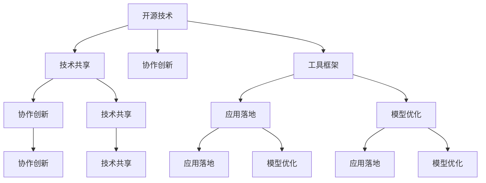

                 

# 开源技术如何推动AI的进步

> 关键词：开源技术,人工智能,协作创新,技术共享,工具框架,应用落地,模型优化,社区贡献

## 1. 背景介绍

### 1.1 问题由来

近年来，人工智能（AI）技术在诸多领域取得了重大突破，从图像识别、自然语言处理到自动驾驶、智能制造等，AI正逐步成为推动社会进步和产业升级的关键力量。然而，尽管AI取得了显著成果，但其核心技术仍掌握在少数企业或研究机构手中，这不仅增加了技术和应用的成本，也限制了AI技术的普惠性和可持续性。

开源技术的出现，为打破这种技术垄断格局提供了新的解决路径。通过开放源代码，共享知识和工具，开源社区汇聚了全球最顶尖的AI技术力量，推动了AI技术的快速迭代和广泛应用。在开源的推动下，AI技术从学术研究转向实际应用，从少数专家掌握变为大众共享，极大地加速了AI技术的商业化进程。

### 1.2 问题核心关键点

开源技术在AI领域的应用，主要体现在以下几个关键点：

1. **技术共享与协作创新**：开源社区汇聚了大量技术人才，通过共享代码、数据、工具等，促进了跨机构、跨领域的协作创新，加速了AI技术的研发和落地。
2. **工具框架的标准化**：开源工具框架（如TensorFlow、PyTorch等）提供了强大的编程和训练能力，降低了AI开发的门槛，使得更多开发者能够快速上手。
3. **模型的优化与改进**：开源社区的持续贡献，使得各种预训练模型、迁移学习模型等持续优化，提升了AI模型的精度和效率。
4. **应用的广泛化**：开源技术降低了AI应用的经济成本，推动了AI在各行各业的落地，提升了社会整体的技术水平和竞争力。
5. **社区与生态系统的构建**：开源技术构建了强大的AI社区和生态系统，促进了知识交流、技术传播，推动了AI技术的持续进步。

## 2. 核心概念与联系

### 2.1 核心概念概述

为了更好地理解开源技术在AI领域的应用，本节将介绍几个密切相关的核心概念：

- **开源技术（Open Source Technology）**：指软件源代码及其相关文档可以被任何用户自由地查看、使用、修改和分发，而无需担心版权限制的技术。
- **人工智能（Artificial Intelligence）**：指通过计算机程序实现的人类智能行为，包括感知、学习、推理等能力。
- **协作创新（Collaborative Innovation）**：指多个主体共同参与的创新过程，通过共享知识和资源，实现技术快速迭代和突破。
- **技术共享（Technology Sharing）**：指将技术知识、工具、代码等公开分享，以促进更多人参与和改进，加速技术进步。
- **工具框架（Tool Framework）**：指为AI模型开发提供支持的平台、库和工具，如TensorFlow、PyTorch、MXNet等。
- **应用落地（Application Deployment）**：指将AI技术实际应用于具体场景和业务中，实现技术价值。
- **模型优化（Model Optimization）**：指对AI模型进行参数调整、结构改进、算法优化等，以提升模型性能和效率。
- **社区贡献（Community Contribution）**：指开发者在开源社区中提交代码、文档、问题解答等，促进社区知识共享和技术传播。

这些核心概念之间的逻辑关系可以通过以下Mermaid流程图来展示：



这个流程图展示开源技术及其相关概念的相互联系：

1. 开源技术通过技术共享促进协作创新，汇聚全球AI技术力量。
2. 开源工具框架提供了开发和训练的基础设施，降低了AI开发的门槛。
3. 开源社区的持续贡献推动了模型优化和应用落地，提升了AI技术的实用性和可操作性。
4. 技术共享和协作创新进一步加强了开源社区的凝聚力，促进了AI技术的持续进步。

## 3. 核心算法原理 & 具体操作步骤
### 3.1 算法原理概述

开源技术在AI中的应用，本质上是一种基于开放和共享的协作创新模式。其核心思想是通过技术共享和协作创新，推动AI技术的快速迭代和广泛应用。

形式化地，假设开源社区中有n个机构，每个机构有m项AI技术贡献。社区成员通过共享和协作，将这些技术贡献整合并优化，形成一套新的技术体系T。社区成员通过对T的使用、改进和传播，进一步推动AI技术的发展。

这种协作创新的过程可以用数学公式表示为：

$$
T = \bigcup_{i=1}^{n} \bigcap_{j=1}^{m} T_{ij}
$$

其中，$T_{ij}$ 表示机构i贡献的第j项技术，$\bigcap$ 表示将这些技术进行整合优化，$\bigcup$ 表示将优化后的技术汇总形成新的技术体系。

### 3.2 算法步骤详解

开源技术在AI中的应用，一般包括以下几个关键步骤：

**Step 1: 技术贡献与共享**
- 社区成员将各自的AI技术贡献（如算法、代码、数据集等）以开放源代码的形式发布到开源平台上。
- 其他社区成员可以自由访问、使用、修改和分发这些技术贡献，形成新的技术融合点。

**Step 2: 协作创新与优化**
- 社区成员通过讨论、实验、测试等方式，对共享的技术进行整合优化，形成更高效、更实用的技术体系。
- 通过持续的迭代和改进，不断提升AI技术的性能和应用范围。

**Step 3: 工具框架与模型优化**
- 社区成员使用开源工具框架进行AI模型开发和训练，提升模型的精度和效率。
- 持续更新和优化模型，保持技术的前沿性和实用性。

**Step 4: 应用落地与推广**
- 将优化后的AI模型应用于具体场景和业务中，实现技术价值。
- 通过开源社区和公共平台，推广技术成果，促进更多机构和企业使用。

### 3.3 算法优缺点

开源技术在AI中的应用，具有以下优点：
1. 促进协作创新：通过共享和协作，快速迭代和改进AI技术，加速技术进步。
2. 降低开发门槛：开源工具框架降低了AI开发的技术门槛，使更多人能够参与和贡献。
3. 提升模型精度：开源社区的持续优化，使得AI模型精度和效率持续提升。
4. 降低应用成本：开源技术降低了技术和应用的成本，促进了AI技术的普惠性。
5. 构建强大生态：开源社区汇聚了大量技术人才和机构，构建了强大的AI生态系统。

同时，开源技术也存在一些局限性：
1. 质量参差不齐：开源社区中的技术贡献质量参差不齐，需要社区成员共同审核和筛选。
2. 协同效率低：跨机构协作中，沟通和协调成本较高，可能影响协作效率。
3. 风险与漏洞：开源技术共享可能带来技术泄露和安全隐患，需要严格管理和保护。
4. 缺乏集中管理：开源社区缺少集中管理和统一标准，可能导致技术标准不一。

尽管存在这些局限性，但总体而言，开源技术在AI中的应用已经取得了显著成效，推动了AI技术的快速发展和广泛应用。未来需要进一步优化协作机制，提高社区管理水平，确保技术共享的安全性和高效性。

### 3.4 算法应用领域

开源技术在AI的应用，已经覆盖了多个领域，包括但不限于：

- **计算机视觉**：通过开源技术如TensorFlow、PyTorch等，推动了图像识别、目标检测、人脸识别等技术的发展。
- **自然语言处理**：开源社区的贡献使得语言模型、情感分析、机器翻译等技术得到了广泛应用。
- **语音识别**：开源技术促进了语音合成、语音识别、语音交互等技术的进步。
- **自动驾驶**：开源平台和工具为自动驾驶的感知、决策、控制等技术提供了有力支持。
- **医疗健康**：开源技术推动了医疗影像分析、疾病预测、个性化治疗等技术的应用。
- **智能制造**：开源技术促进了工业机器视觉、智能运维、供应链优化等技术的发展。
- **金融科技**：开源技术在金融风险评估、投资决策、客户服务等方面得到了应用。

除了这些领域，开源技术还在农业、教育、政府管理等多个行业中得到了应用，显著提升了各行业的智能化水平。

## 4. 数学模型和公式 & 详细讲解 & 举例说明
### 4.1 数学模型构建

本节将使用数学语言对开源技术在AI中的协作创新过程进行更严格的刻画。

假设社区中有n个机构，每个机构贡献了m项技术。设第i项技术 $T_{ij}$ 由 $X_{ij}$ 个元素组成，表示该技术的具体内容和实现细节。社区成员通过共享和协作，将这些技术贡献整合成新的技术体系T。

定义社区成员i对技术 $T_{ij}$ 的贡献度为 $c_{ij}$，表示该技术对新体系的贡献程度。社区成员通过评估和筛选，对所有贡献度进行加权求和，得到技术体系T的贡献度 $C_i$。

$$
C_i = \sum_{j=1}^{m} c_{ij} w_{ij}
$$

其中，$w_{ij}$ 为贡献度权重，由社区成员根据技术的重要性、实用性等因素综合评定。

社区成员i对新体系T的贡献度 $C_i$ 越高，其对开源社区的贡献越大。通过这种方式，开源社区能够高效地整合和优化技术贡献，形成强大的技术体系。

### 4.2 公式推导过程

以下我们以深度学习框架TensorFlow为例，推导其对AI发展的贡献和优化过程。

TensorFlow是Google开源的深度学习框架，通过共享其代码和文档，吸引了大量开发者和研究者的参与和贡献。TensorFlow的贡献度可以通过以下方式计算：

1. **代码贡献度**：衡量开发者提交的代码行数、修改次数等。假设社区中有k个开发者，每个开发者i贡献了g个代码，则总代码贡献度为：

$$
G = \sum_{i=1}^{k} g_i
$$

2. **文档贡献度**：衡量开发者编写的文档数量和质量。假设每个开发者i编写了d个文档，则总文档贡献度为：

$$
D = \sum_{i=1}^{k} d_i
$$

3. **社区互动度**：衡量开发者在社区中的活跃程度。假设每个开发者i在社区中发表了p个问题，解答了q个问题，则总社区互动度为：

$$
PQ = \sum_{i=1}^{k} (p_i + q_i)
$$

通过加权求和，得到TensorFlow的总贡献度C：

$$
C = \alpha G + \beta D + \gamma PQ
$$

其中，$\alpha$、$\beta$、$\gamma$ 为权重系数，根据社区成员的评价和需求进行设定。

通过这种基于贡献度的计算方式，开源社区能够公平、透明地评估和认可每个成员的贡献，激励更多开发者参与开源项目，推动技术进步。

### 4.3 案例分析与讲解

**案例：TensorFlow社区的协作创新**

TensorFlow社区汇聚了全球顶级的AI技术专家和开发者，通过共享代码、文档和工具，推动了深度学习技术的快速迭代和广泛应用。以下是TensorFlow社区协作创新的典型案例：

1. **代码贡献与优化**：
   - 社区成员通过提交和修改代码，不断优化TensorFlow的性能和功能。
   - 例如，TensorFlow的C++实现部分由社区成员Google Research的Dave Murray-Smith等贡献。

2. **文档与教程**：
   - 社区成员编写了大量文档和教程，帮助新开发者快速上手。
   - TensorFlow官方文档和教程由社区成员如Julian Salazar、Parker Previous等编写和维护。

3. **问题解答与互动**：
   - 社区成员在TensorFlow官方论坛和GitHub issues中积极互动，解决技术问题。
   - TensorFlow社区活跃度极高，每天都有大量开发者提交问题和解答，形成了强大的技术交流生态。

通过这些协作创新活动，TensorFlow社区不断提升深度学习框架的性能和实用性，推动了全球AI技术的发展。

## 5. 项目实践：代码实例和详细解释说明
### 5.1 开发环境搭建

在进行开源技术应用实践前，我们需要准备好开发环境。以下是使用Python进行TensorFlow开发的环境配置流程：

1. 安装Anaconda：从官网下载并安装Anaconda，用于创建独立的Python环境。

2. 创建并激活虚拟环境：
```bash
conda create -n tf-env python=3.8 
conda activate tf-env
```

3. 安装TensorFlow：根据系统配置，从官网获取对应的安装命令。例如：
```bash
pip install tensorflow
```

4. 安装各类工具包：
```bash
pip install numpy pandas scikit-learn matplotlib tqdm jupyter notebook ipython
```

完成上述步骤后，即可在`tf-env`环境中开始TensorFlow项目实践。

### 5.2 源代码详细实现

这里我们以TensorFlow 2.0的深度学习模型训练为例，给出使用TensorFlow进行图像分类任务的代码实现。

首先，定义模型和损失函数：

```python
import tensorflow as tf
from tensorflow import keras

model = keras.Sequential([
    keras.layers.Conv2D(32, (3, 3), activation='relu', input_shape=(28, 28, 1)),
    keras.layers.MaxPooling2D((2, 2)),
    keras.layers.Flatten(),
    keras.layers.Dense(10, activation='softmax')
])

loss = keras.losses.SparseCategoricalCrossentropy(from_logits=True)

```

然后，准备数据集并进行模型训练：

```python
(x_train, y_train), (x_test, y_test) = keras.datasets.mnist.load_data()
x_train, x_test = x_train / 255.0, x_test / 255.0

batch_size = 32
epochs = 10

model.compile(optimizer='adam', loss=loss, metrics=['accuracy'])

model.fit(x_train, y_train, batch_size=batch_size, epochs=epochs, validation_split=0.1)
```

最后，在测试集上评估模型：

```python
test_loss, test_acc = model.evaluate(x_test,  y_test, verbose=2)
print('\nTest accuracy:', test_acc)
```

以上代码展示了使用TensorFlow进行图像分类任务的基本流程。通过TensorFlow的高级API，开发者可以轻松搭建和训练深度学习模型，进行数据处理和模型评估。

### 5.3 代码解读与分析

让我们再详细解读一下关键代码的实现细节：

**Sequential模型定义**：
- 通过`keras.Sequential`定义了一个包含卷积、池化、全连接层的顺序模型。
- 卷积层使用32个3x3大小的卷积核，激活函数为ReLU。
- 池化层使用2x2大小的池化窗口。
- 全连接层使用10个神经元，输出softmax激活函数。

**损失函数定义**：
- 使用`keras.losses.SparseCategoricalCrossentropy`定义了交叉熵损失函数，设置`from_logits=True`表示模型的输出没有经过softmax函数激活。

**数据预处理**：
- 将训练集和测试集的数据归一化到0-1范围内，以便模型更好地学习。

**模型训练**：
- 使用`model.compile`方法定义优化器和损失函数，设置batch_size和epochs。
- 使用`model.fit`方法进行模型训练，在训练集上进行fitting，并在验证集上进行验证。

**模型评估**：
- 使用`model.evaluate`方法在测试集上评估模型性能，输出损失和精度。

可以看到，TensorFlow提供了简单易用的API，使得开发者能够快速搭建和训练深度学习模型，进行数据预处理和模型评估。

当然，工业级的系统实现还需考虑更多因素，如模型的保存和部署、超参数的自动搜索、更灵活的任务适配层等。但核心的开发流程基本与此类似。

## 6. 实际应用场景
### 6.1 智慧城市管理

开源技术在智慧城市管理中的应用，主要体现在以下几个方面：

1. **交通管理**：通过开源技术实现智能交通信号灯、车辆监控、路况分析等，提升城市交通的流畅性和安全性。
2. **环境监测**：利用开源工具和模型进行空气质量、水质监测、噪音监测等，及时反馈环境变化，优化城市管理。
3. **公共安全**：通过开源技术进行视频监控、人脸识别、行为分析等，提升公共安全水平。
4. **智能建筑**：开源技术推动了智能建筑系统的开发，包括能源管理、安防监控、设备维护等，提升城市建筑的智能化水平。

开源技术通过协同创新，为智慧城市提供了强大的技术支持，推动了城市管理的智能化和数字化转型。

### 6.2 智能制造

开源技术在智能制造中的应用，主要体现在以下几个方面：

1. **工业互联网**：开源技术推动了工业互联网的发展，通过网络、平台、系统等基础设施，实现设备互联、数据集成和应用创新。
2. **智能运维**：开源技术支持了设备的智能运维和故障预测，提升了生产效率和设备利用率。
3. **供应链优化**：开源技术促进了供应链的数字化转型，提高了物流、库存、生产等环节的协同效率。
4. **质量控制**：开源技术支持了基于机器视觉和AI的质量检测和控制，提升了产品的一致性和质量。

开源技术通过协作创新，推动了智能制造的快速发展，为制造业的数字化转型提供了重要支撑。

### 6.3 金融科技

开源技术在金融科技中的应用，主要体现在以下几个方面：

1. **风险管理**：开源技术支持了金融风险的识别和评估，提升了金融机构的决策效率和准确性。
2. **智能投研**：开源技术推动了智能投研系统的开发，通过自然语言处理、机器学习等技术，分析市场趋势和投资机会。
3. **客户服务**：开源技术支持了智能客服系统的开发，通过自然语言理解和生成技术，提升了客户服务体验和满意度。
4. **资产管理**：开源技术支持了资产的智能配置和管理，提高了投资组合的优化和风险控制能力。

开源技术通过协同创新，推动了金融科技的快速发展，为金融行业的智能化升级提供了重要保障。

### 6.4 未来应用展望

随着开源技术的发展，其在AI领域的应用前景将更加广阔，未来可能会在以下几个方面取得突破：

1. **跨领域融合**：开源技术将更多地与其他技术（如区块链、物联网、边缘计算等）融合，推动跨领域的AI应用。
2. **边缘计算**：开源技术推动了边缘计算的发展，使得AI模型可以在本地设备上进行实时推理，提升计算效率和数据安全。
3. **自适应学习**：开源技术将推动自适应学习技术的发展，使得模型能够根据环境和数据的变化进行自我优化和调整。
4. **多模态融合**：开源技术将推动多模态融合技术的发展，实现视觉、语音、文本等多模态数据的协同建模。
5. **联邦学习**：开源技术将推动联邦学习的发展，使得模型能够在分布式环境下进行协同训练，提升数据隐私和安全。

这些趋势展示了开源技术在AI领域的广阔前景，预示着未来AI技术的更多创新和突破。

## 7. 工具和资源推荐
### 7.1 学习资源推荐

为了帮助开发者系统掌握开源技术在AI中的应用，这里推荐一些优质的学习资源：

1. **TensorFlow官方文档**：包含详细的API文档和教程，是学习TensorFlow的必备资源。
2. **PyTorch官方文档**：提供了丰富的深度学习资源和实践示例，适合学习深度学习模型开发。
3. **MXNet官方文档**：详细介绍了MXNet框架的使用和API，适合学习分布式深度学习技术。
4. **深度学习入门与实践**（CSDN专栏）：由CSDN特约作者撰写，涵盖深度学习的基础知识和实践案例。
5. **开源社区论坛**：如GitHub、Stack Overflow等，可以获取最新的开源技术和项目信息，与开发者交流。

通过这些资源的学习实践，相信你一定能够快速掌握开源技术在AI中的应用，并用于解决实际的AI问题。

### 7.2 开发工具推荐

高效的开发离不开优秀的工具支持。以下是几款用于开源技术开发的工具：

1. **Anaconda**：用于创建和管理Python环境的工具，支持Python、R等语言，适合科学研究和技术开发。
2. **Jupyter Notebook**：交互式编程工具，适合数据科学和机器学习领域的开发和研究。
3. **GitHub**：代码托管平台，支持版本控制、代码审查、项目管理等功能，是开源社区的重要平台。
4. **TensorBoard**：TensorFlow的可视化工具，支持模型训练、参数调试、性能分析等功能。
5. **Visual Studio Code**：轻量级代码编辑器，支持多种编程语言和扩展，是开发和调试的好帮手。

合理利用这些工具，可以显著提升开源技术开发和研究的效率，加快技术创新的步伐。

### 7.3 相关论文推荐

开源技术在AI领域的发展离不开学界的持续研究。以下是几篇奠基性的相关论文，推荐阅读：

1. **TensorFlow: A System for Large-Scale Machine Learning**：谷歌论文，介绍了TensorFlow的架构和应用，奠定了深度学习框架的基础。
2. **PyTorch: Tensors and Dynamic neural networks in Python with strong GPU acceleration**：Facebook论文，介绍了PyTorch的架构和特点，推动了深度学习模型的研究进展。
3. **MXNet: A Gluon-Friendly Distributed Deep Learning Framework**：Amazon论文，介绍了MXNet的分布式训练和优化技术，适合大规模分布式深度学习应用。
4. **The General Architecture of Tensorflow**：谷歌论文，深入分析了TensorFlow的架构和设计原则，提供了深度学习模型开发的经验。
5. **DeepLearning-From Pipelines to Scaling and Future Directions**：特斯拉论文，介绍了深度学习管道的构建和应用，推动了深度学习技术的实际落地。

这些论文代表了开源技术在AI领域的最新进展，通过学习这些前沿成果，可以帮助研究者把握学科前进方向，激发更多的创新灵感。

## 8. 总结：未来发展趋势与挑战
### 8.1 总结

本文对开源技术在AI中的应用进行了全面系统的介绍。首先阐述了开源技术推动AI发展的背景和意义，明确了开源技术在协作创新、工具框架、模型优化、应用落地等方面的独特价值。其次，从原理到实践，详细讲解了开源技术在AI中的协作创新过程，给出了具体的代码实现和案例分析。同时，本文还广泛探讨了开源技术在智慧城市管理、智能制造、金融科技等领域的实际应用场景，展示了开源技术在推动AI技术广泛应用中的巨大潜力。

通过本文的系统梳理，可以看到，开源技术在AI中的应用已经取得了显著成效，推动了AI技术的快速发展和广泛应用。未来，伴随开源技术的持续演进，AI技术的社会价值和产业应用将更加广泛，成为推动社会进步的重要力量。

### 8.2 未来发展趋势

展望未来，开源技术在AI领域的应用将呈现以下几个发展趋势：

1. **技术共享与协作创新**：开源技术将继续推动协作创新，汇聚全球AI技术力量，加速技术进步。
2. **工具框架的标准化**：开源工具框架将不断完善和优化，降低AI开发的门槛，促进更多开发者参与。
3. **模型的优化与改进**：开源社区将持续贡献和优化AI模型，提升模型的精度和效率。
4. **应用的广泛化**：开源技术将推动AI在更多行业和场景中的应用，提升社会整体的智能化水平。
5. **社区与生态系统的构建**：开源社区将不断壮大，构建更加强大和活跃的AI生态系统。

以上趋势展示了开源技术在AI领域的广阔前景，预示着未来AI技术的更多创新和突破。

### 8.3 面临的挑战

尽管开源技术在AI领域的应用已经取得了显著成效，但在迈向更加智能化、普适化应用的过程中，仍面临诸多挑战：

1. **技术标准不一**：开源社区中各工具框架的实现方式和接口标准不一，可能导致技术兼容性问题。
2. **安全与隐私**：开源技术的广泛应用可能带来数据隐私和安全隐患，需要严格管理和保护。
3. **协同效率低**：跨机构协作中，沟通和协调成本较高，可能影响协作效率。
4. **资源消耗大**：大规模深度学习模型的训练和推理需要大量的计算资源，可能面临硬件瓶颈。
5. **知识积累不足**：开源社区的知识积累和传播机制有待加强，可能导致技术进步的缓慢。

尽管存在这些挑战，但总体而言，开源技术在AI中的应用已经取得了显著成效，推动了AI技术的快速发展和广泛应用。未来需要进一步优化协作机制，提高社区管理水平，确保技术共享的安全性和高效性。

### 8.4 研究展望

面对开源技术在AI应用中面临的挑战，未来的研究需要在以下几个方面寻求新的突破：

1. **技术标准统一**：推动各工具框架的标准化和互操作性，解决技术兼容性问题。
2. **安全与隐私保护**：加强数据隐私和安全管理，确保开源技术的应用安全。
3. **协同效率提升**：优化跨机构协作机制，提高沟通和协调效率。
4. **资源优化**：通过模型压缩、分布式训练等技术，优化计算资源的使用。
5. **知识共享机制**：建立更加完善的知识共享和传播机制，推动技术进步。

这些研究方向的探索，必将引领开源技术在AI领域迈向更高的台阶，为构建安全、可靠、可解释、可控的智能系统铺平道路。面向未来，开源技术需要与其他人工智能技术进行更深入的融合，如知识表示、因果推理、强化学习等，多路径协同发力，共同推动自然语言理解和智能交互系统的进步。只有勇于创新、敢于突破，才能不断拓展语言模型的边界，让智能技术更好地造福人类社会。

## 9. 附录：常见问题与解答

**Q1：开源技术如何确保其安全性和隐私保护？**

A: 开源技术的安全性和隐私保护主要依赖以下几个方面：

1. **严格的审核机制**：开源社区通过严格的代码审核机制，确保代码质量和安全性。
2. **分布式存储与传输**：采用分布式存储和传输技术，降低数据泄露的风险。
3. **加密与匿名化**：对敏感数据进行加密和匿名化处理，防止数据被滥用。
4. **权限控制与审计**：对开源项目进行权限控制和审计，防止恶意攻击和滥用。

通过这些措施，开源技术可以有效地保护数据安全和隐私，确保技术应用的可靠性和可信性。

**Q2：开源技术在AI领域的应用成本如何？**

A: 开源技术的应用成本主要体现在以下几个方面：

1. **技术门槛低**：开源技术的开放性降低了AI开发的门槛，使得更多人能够参与和贡献，减少了技术引进和培训成本。
2. **社区资源丰富**：开源社区提供了丰富的工具、文档、示例等资源，减少了研发成本和时间。
3. **共享与协作**：开源技术促进了跨机构、跨领域的协作创新，加速了技术进步，降低了研发和推广成本。

总体而言，开源技术的应用成本相对较低，特别是在中小型企业和技术创新机构中，开源技术的成本优势更加显著。

**Q3：开源技术在AI中的应用效果如何？**

A: 开源技术在AI中的应用效果主要体现在以下几个方面：

1. **模型精度高**：开源社区的持续优化，使得AI模型的精度和效率持续提升。
2. **应用广泛**：开源技术推动了AI在各行各业中的应用，提升了社会整体的智能化水平。
3. **协同创新**：开源社区汇聚了大量技术人才和机构，构建了强大的AI生态系统，推动了技术的持续进步。

开源技术在AI中的应用效果显著，已经成为推动AI技术快速发展和广泛应用的重要力量。

**Q4：开源技术在实际应用中可能面临哪些挑战？**

A: 开源技术在实际应用中可能面临以下挑战：

1. **技术标准不一**：各工具框架的实现方式和接口标准不一，可能导致技术兼容性问题。
2. **安全与隐私**：开源技术的广泛应用可能带来数据隐私和安全隐患，需要严格管理和保护。
3. **协同效率低**：跨机构协作中，沟通和协调成本较高，可能影响协作效率。
4. **资源消耗大**：大规模深度学习模型的训练和推理需要大量的计算资源，可能面临硬件瓶颈。
5. **知识积累不足**：开源社区的知识积累和传播机制有待加强，可能导致技术进步的缓慢。

尽管存在这些挑战，但总体而言，开源技术在AI中的应用已经取得了显著成效，推动了AI技术的快速发展和广泛应用。未来需要进一步优化协作机制，提高社区管理水平，确保技术共享的安全性和高效性。

---

作者：禅与计算机程序设计艺术 / Zen and the Art of Computer Programming

