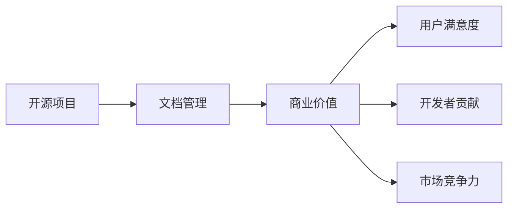

                 

# 开源项目文档的商业价值：策略与实施

> 关键词：开源项目、商业价值、文档管理、策略实施、项目协作

## 1. 背景介绍

在当今数字化时代，开源项目已成为驱动技术进步、加速创新落地的重要力量。从操作系统、编程语言到数据库、云计算，几乎每一个技术领域都有知名开源项目作为基础支撑。开源项目不仅贡献了大量的代码和工具，更构建了庞大的开发者生态，促进了全球技术协同发展。

然而，开源项目并非一帆风顺。尽管它们提供了代码，但如何有效管理、利用这些代码，仍然是一个挑战。文档就是其中的一个关键环节。文档不仅有助于开发者理解代码，更决定了项目的易用性和可维护性。良好的文档管理不仅能提升项目质量和用户满意度，还能直接转化成商业价值。

本文将探讨如何通过科学策略和有效实施，最大化开源项目文档的商业价值。从文档的编写、发布、维护到推广，我们将逐一剖析每个环节的策略和最佳实践。

## 2. 核心概念与联系

### 2.1 核心概念概述

要理解开源项目文档的商业价值，我们需要先明确几个关键概念：

- **开源项目**：指采用开源许可证授权，代码、文档等资源公开共享的软件项目。
- **文档管理**：指对开源项目文档进行收集、整理、发布、维护等过程的管理活动。
- **商业价值**：指通过开源项目文档获取的经济、社会、技术等多方面的利益和效益。

这些概念间的关系可以通过以下Mermaid流程图来展示：



从图中可以看出，良好的文档管理是开源项目取得商业价值的桥梁。通过高质量的文档，用户能更快地上手使用项目，开发者能更高效地贡献代码，市场则能提升项目的整体竞争力和用户满意度。

## 3. 核心算法原理 & 具体操作步骤
### 3.1 算法原理概述

开源项目文档管理的核心算法原理可以概括为：通过系统化的文档策略和高效的工具，实现文档的全面覆盖、及时更新和有效利用。具体来说，包括以下几个步骤：

1. **文档收集**：从项目源代码和代码审查中自动提取文档，如API文档、代码注释等。
2. **文档整理**：将收集到的文档分类、归档，形成结构化的文档体系。
3. **文档发布**：通过官网、文档仓库等渠道，将文档发布到用户可访问的位置。
4. **文档维护**：定期更新文档，确保其与最新代码和需求一致。
5. **文档推广**：通过社区活动、技术博客、官方邮件等方式，推广和利用文档。

这些步骤不仅涉及技术手段，还需要制定科学的管理策略，确保文档管理的连贯性和有效性。

### 3.2 算法步骤详解

下面详细介绍开源项目文档管理的每个步骤：

#### 3.2.1 文档收集

文档收集是文档管理的第一步。良好的文档收集策略不仅能节省人力，还能保证文档的全面性和准确性。以下是几个关键策略：

1. **自动化提取**：利用工具如ReadTheDocs、Sphinx等，自动从代码中提取文档。这些工具可以读取代码注释、函数文档等，生成API文档和代码文档。
2. **社区贡献**：鼓励社区成员提交文档，特别是那些对项目有深入理解的成员。例如，在GitHub上，社区成员可以直接提交PR来更新文档。
3. **文档模板**：提供统一的文档模板，指导开发者按照规范编写文档。例如，使用Markdown格式编写文档，可以方便地进行版本控制和编辑。

#### 3.2.2 文档整理

文档整理是将收集到的文档进行分类和归档的过程。以下是几个关键策略：

1. **文档分类**：将文档按照功能、模块、版本等维度进行分类，形成清晰的主题目录。
2. **文档层次化**：将文档分为多个层次，如基础文档、高级文档、教程等，便于用户快速定位所需信息。
3. **文档链接**：在文档中添加交叉引用和链接，方便用户查看相关文档。例如，在代码注释中添加函数文档链接。

#### 3.2.3 文档发布

文档发布是将文档公开到用户可访问位置的过程。以下是几个关键策略：

1. **官网托管**：将文档托管到项目官网，方便用户直接访问。例如，在GitHub Pages上托管文档，可以通过CI/CD流程自动发布。
2. **文档仓库**：在代码仓库中建立专门的文档分支，记录所有文档的历史变更。例如，在GitHub上，可以使用"gh-pages"扩展自动发布文档。
3. **文档索引**：提供一个文档索引页面，列出所有文档的链接和目录，方便用户查找。例如，使用Django等框架搭建文档网站，实现高效搜索和索引功能。

#### 3.2.4 文档维护

文档维护是确保文档与最新代码和需求一致的过程。以下是几个关键策略：

1. **定期更新**：制定文档更新周期，定期检查和更新文档内容。例如，每季度进行一次全面审查和更新。
2. **版本管理**：对文档进行版本管理，记录每次变更的历史。例如，在GitHub上，可以使用"gh-pages"扩展自动发布文档。
3. **社区参与**：鼓励社区成员参与文档的维护，特别是那些有深入理解的项目维护者。例如，在GitHub上，可以设置代码审查权限，让有经验的社区成员负责文档审核。

#### 3.2.5 文档推广

文档推广是将文档有效地传达给用户的过程。以下是几个关键策略：

1. **社区活动**：通过社区会议、技术博客、邮件列表等方式，推广文档的使用。例如，在Slack上创建文档频道，定期分享最新文档和教程。
2. **技术支持**：提供技术支持和文档解释，帮助用户解决使用中的问题。例如，在社区论坛上设立专门的文档支持组，解答用户疑问。
3. **用户反馈**：收集用户对文档的反馈，持续改进文档质量。例如，在社区调查中收集用户意见，优化文档内容。

### 3.3 算法优缺点

开源项目文档管理的优点包括：

1. **节省成本**：自动化提取和维护文档，减少了人工编写和维护的工作量。
2. **提高效率**：通过科学管理策略，确保文档的全面覆盖和及时更新。
3. **增强可维护性**：文档和代码分离，提高了项目的可维护性。

缺点主要包括：

1. **文档质量不一**：社区成员贡献的文档质量参差不齐，需要人工审核和维护。
2. **更新成本高**：特别是对于大型项目，文档的定期更新需要大量人力和资源。
3. **文档版本管理复杂**：特别是在多个版本并存的情况下，文档版本管理变得复杂。

### 3.4 算法应用领域

开源项目文档管理的应用领域非常广泛，包括但不限于：

1. **编程语言项目**：如Python、JavaScript、Java等，通过文档管理提升代码质量和用户体验。
2. **操作系统项目**：如Linux、Windows、macOS等，通过文档管理提供用户指南和安装教程。
3. **云服务平台**：如AWS、Google Cloud、Azure等，通过文档管理提升平台易用性和用户满意度。
4. **数据处理项目**：如Hadoop、Spark、TensorFlow等，通过文档管理提供数据处理和使用指南。
5. **桌面软件项目**：如GIMP、Blender、VLC等，通过文档管理提供功能介绍和使用教程。

## 4. 数学模型和公式 & 详细讲解 & 举例说明

在开源项目文档管理中，虽然涉及大量文本和文档，但本质上仍然是一个信息管理问题。我们可以通过数学模型来分析和优化文档管理的效率和效果。

### 4.1 数学模型构建

假设有一个开源项目，有$N$篇文档，每篇文档有$M$个关键字，每个关键字的权重为$w_k$，文档中每个关键字的平均权重为$W$。

设用户查询的关键词为$q$，文档与查询的匹配度为$R$。根据TF-IDF模型，匹配度$R$可以表示为：

$$
R = \sum_{k=1}^{M} w_k \times \frac{\text{TF}_k}{\text{IDF}_k} \times \frac{\text{TF}_k^{(q)}}{\text{IDF}_k}
$$

其中，$\text{TF}_k$为文档中关键词$k$的词频，$\text{IDF}_k$为逆文档频率，$\text{TF}_k^{(q)}$为用户查询$q$在文档中出现的词频。

### 4.2 公式推导过程

推导上述匹配度$R$的公式，需要使用以下几个基础知识：

1. **词频**：文档中出现某个关键词的频次，用$\text{TF}_k$表示。
2. **逆文档频率**：所有文档中包含某个关键词的文档数，用$\text{IDF}_k$表示。
3. **文档长度归一化**：所有文档中关键词$k$的词频之和，用$L_k$表示，归一化后的词频用$\text{TF}_k^{(q)}$表示。
4. **查询长度归一化**：用户查询中所有关键词的词频之和，用$L_q$表示，归一化后的词频用$\text{TF}_q^{(q)}$表示。

根据上述定义，可以得到匹配度$R$的计算公式为：

$$
R = \frac{L_k}{L_q} \times \frac{\text{TF}_k}{\text{IDF}_k} \times \frac{\text{TF}_k^{(q)}}{\text{IDF}_k}
$$

### 4.3 案例分析与讲解

以GitHub的Python文档管理为例，分析如何应用上述公式进行文档匹配：

1. **文档收集**：通过API自动提取Python库的代码注释和函数文档，生成API文档。
2. **文档整理**：将API文档按照模块和功能分类，形成清晰的主题目录。
3. **文档发布**：将API文档托管到GitHub Pages，提供官方链接。
4. **文档维护**：每季度进行一次全面审查和更新，确保文档与最新代码一致。
5. **文档推广**：通过GitHub Issues、Python社区论坛、技术博客等方式推广文档，并提供技术支持。

## 5. 项目实践：代码实例和详细解释说明

### 5.1 开发环境搭建

要在项目中实现文档管理，首先需要搭建开发环境。以下是详细的步骤：

1. **安装依赖**：安装Python和相关依赖包，如Jinja2、Pygments等。
```bash
pip install jinja2 pygments
```

2. **配置项目**：在项目中创建`templates`目录，存放文档模板和渲染函数。

3. **文档生成**：使用Sphinx等工具，自动生成API文档和代码文档。
```bash
sphinx-apidoc -o docs/ python/ yourproject.py
```

### 5.2 源代码详细实现

以下是使用Jinja2和Sphinx实现文档管理的一个示例：

```python
from jinja2 import Environment, FileSystemLoader
import os

# 创建Jinja环境
env = Environment(loader=FileSystemLoader('templates'))

# 读取文档模板
template = env.get_template('document.html')

# 渲染文档
def render_document(doc_path):
    with open(doc_path, 'r') as f:
        content = f.read()
    rendered = template.render(content=content)
    return rendered

# 处理文档文件
for root, dirs, files in os.walk('python'):
    for file in files:
        if file.endswith('.py'):
            doc_path = os.path.join(root, file)
            rendered = render_document(doc_path)
            # 将渲染后的文档保存到指定位置
            with open(os.path.join('docs', file + '.html'), 'w') as f:
                f.write(rendered)
```

### 5.3 代码解读与分析

上述代码中，我们使用了Jinja2进行文档渲染，将代码文件转换为HTML格式。具体步骤如下：

1. **创建Jinja环境**：通过`FileSystemLoader`加载模板文件，形成Jinja环境。
2. **读取文档模板**：从模板文件中读取HTML模板，并将其渲染为HTML字符串。
3. **渲染文档**：遍历所有代码文件，读取代码内容，使用Jinja模板渲染为HTML格式，并保存到指定目录。

### 5.4 运行结果展示

运行上述代码后，会生成项目所有Python代码文件的HTML文档，存储在`docs`目录下。用户可以通过访问这些HTML文档，查看代码和API文档。

## 6. 实际应用场景

### 6.1 开源社区的文档管理

开源社区的文档管理是开源项目文档管理的典型应用场景。例如，GitHub的官方文档项目`docs.github.com`，就采用了上述文档管理的策略和工具。

GitHub通过Sphinx自动生成API文档，使用Jinja2进行文档模板渲染，并提供官方链接和搜索功能。此外，GitHub还通过社区贡献、版本控制等方式，确保文档的全面性和及时更新。

### 6.2 商业软件的文档管理

商业软件的文档管理是开源项目文档管理的另一个重要应用场景。例如，Salesforce的官方文档项目`documentation.salesforce.com`，就采用了类似的文档管理策略。

Salesforce通过自动生成和版本控制，确保文档的准确性和完整性。同时，Salesforce还通过官方博客、技术支持等方式，广泛推广文档的使用，提升用户满意度和销售转化率。

### 6.3 企业内部的文档管理

企业内部的文档管理也是开源项目文档管理的重要应用场景。例如，Google的内部文档管理项目，就采用了上述文档管理的策略和工具。

Google通过自动生成和版本控制，确保文档的准确性和完整性。同时，Google还通过企业内部邮件、文档管理系统等方式，广泛推广文档的使用，提升工作效率和员工满意度。

## 7. 工具和资源推荐

### 7.1 学习资源推荐

要掌握开源项目文档管理的知识和技能，需要学习以下几个关键资源：

1. **Sphinx官方文档**：详细介绍了Sphinx的使用和配置，是文档生成的基础工具。
2. **Jinja2官方文档**：详细介绍了Jinja2的使用和模板语法，是文档渲染的基础工具。
3. **GitHub Pages官方文档**：详细介绍了GitHub Pages的使用和配置，是文档托管的基础工具。
4. **Django官方文档**：详细介绍了Django的使用和文档管理功能，是文档网站构建的基础工具。

### 7.2 开发工具推荐

要高效实现开源项目文档管理，需要以下工具支持：

1. **Sphinx**：自动生成API文档和代码文档，支持多语言和多种输出格式。
2. **Jinja2**：模板渲染工具，支持动态生成HTML文档。
3. **Markdown**：轻量级标记语言，支持文本格式化和版本控制。
4. **GitHub Pages**：托管文档的免费服务，支持静态网站生成和CI/CD流程。
5. **Django**：Web框架，支持动态网站和文档网站的构建。

### 7.3 相关论文推荐

开源项目文档管理是一个不断发展的领域，以下是几个相关的经典论文：

1. **Software Documentation: The Case of Python**：探讨Python文档管理的策略和工具，是开源项目文档管理的经典案例。
2. **Improving Open Source Software Documentation Through Machine Learning**：利用机器学习改进开源项目文档的质量，是文档管理的新趋势。
3. **Documentation Management in Large Scale Open Source Software Projects**：分析大型开源项目文档管理的实践经验，提供有价值的参考。

## 8. 总结：未来发展趋势与挑战

### 8.1 研究成果总结

开源项目文档管理已经取得了显著的成果，主要体现在以下几个方面：

1. **自动化生成**：通过自动生成工具，大大提高了文档生成的效率和质量。
2. **版本控制**：通过版本控制工具，确保文档与代码的同步更新。
3. **社区贡献**：通过社区贡献，形成丰富的文档资源和高质量的文档。
4. **文档推广**：通过多种渠道推广文档，提升用户满意度和项目活跃度。

### 8.2 未来发展趋势

开源项目文档管理未来的发展趋势包括：

1. **多语言支持**：支持多语言文档生成和翻译，扩大文档的覆盖范围。
2. **机器学习应用**：利用机器学习改进文档生成和优化文档质量。
3. **文档版本管理**：通过区块链等技术，实现文档的版本管理和安全存储。
4. **知识图谱融合**：将文档与外部知识图谱结合，提升文档的语义理解和智能推荐。
5. **社区协作机制**：建立更加完善的社区协作机制，提高文档质量和更新效率。

### 8.3 面临的挑战

开源项目文档管理面临的挑战包括：

1. **文档质量不一**：社区成员贡献的文档质量参差不齐，需要人工审核和维护。
2. **更新成本高**：特别是对于大型项目，文档的定期更新需要大量人力和资源。
3. **文档版本管理复杂**：特别是在多个版本并存的情况下，文档版本管理变得复杂。
4. **文档版本管理复杂**：特别是在多个版本并存的情况下，文档版本管理变得复杂。

### 8.4 研究展望

开源项目文档管理的未来研究展望包括：

1. **文档智能生成**：利用自然语言处理和机器学习，实现文档的自动生成和优化。
2. **文档知识图谱**：将文档与外部知识图谱结合，提升文档的语义理解和智能推荐。
3. **文档版本控制**：利用区块链等技术，实现文档的版本管理和安全存储。
4. **文档协作机制**：建立更加完善的社区协作机制，提高文档质量和更新效率。

## 9. 附录：常见问题与解答

**Q1：如何确保开源项目文档的质量？**

A: 确保开源项目文档的质量需要多方面的努力，包括：

1. **自动化生成**：使用Sphinx等工具自动生成文档，减少人工编写和维护的工作量。
2. **社区贡献**：鼓励社区成员提交文档，特别是那些有深入理解的项目维护者。
3. **文档模板**：提供统一的文档模板，指导开发者按照规范编写文档。
4. **文档审核**：设立专门的文档审核团队，定期检查和审核文档质量。

**Q2：开源项目文档维护的周期是怎样的？**

A: 开源项目文档的维护周期需要根据项目规模和活跃度来定。一般来说，建议每季度进行一次全面审查和更新。对于大型项目，可以根据实际情况增加维护频率。

**Q3：开源项目文档推广的方式有哪些？**

A: 开源项目文档推广的方式包括：

1. **社区活动**：通过社区会议、技术博客、邮件列表等方式，推广文档的使用。
2. **技术支持**：提供技术支持和文档解释，帮助用户解决使用中的问题。
3. **用户反馈**：收集用户对文档的反馈，持续改进文档质量。

**Q4：如何处理文档的版本管理？**

A: 处理文档的版本管理需要以下步骤：

1. **版本控制**：使用Git等版本控制工具，记录每次文档的变更历史。
2. **版本合并**：在合并新文档时，确保新文档与旧文档的内容一致，避免冲突。
3. **版本发布**：通过官网、文档仓库等渠道，发布最新文档版本。

---

作者：禅与计算机程序设计艺术 / Zen and the Art of Computer Programming

