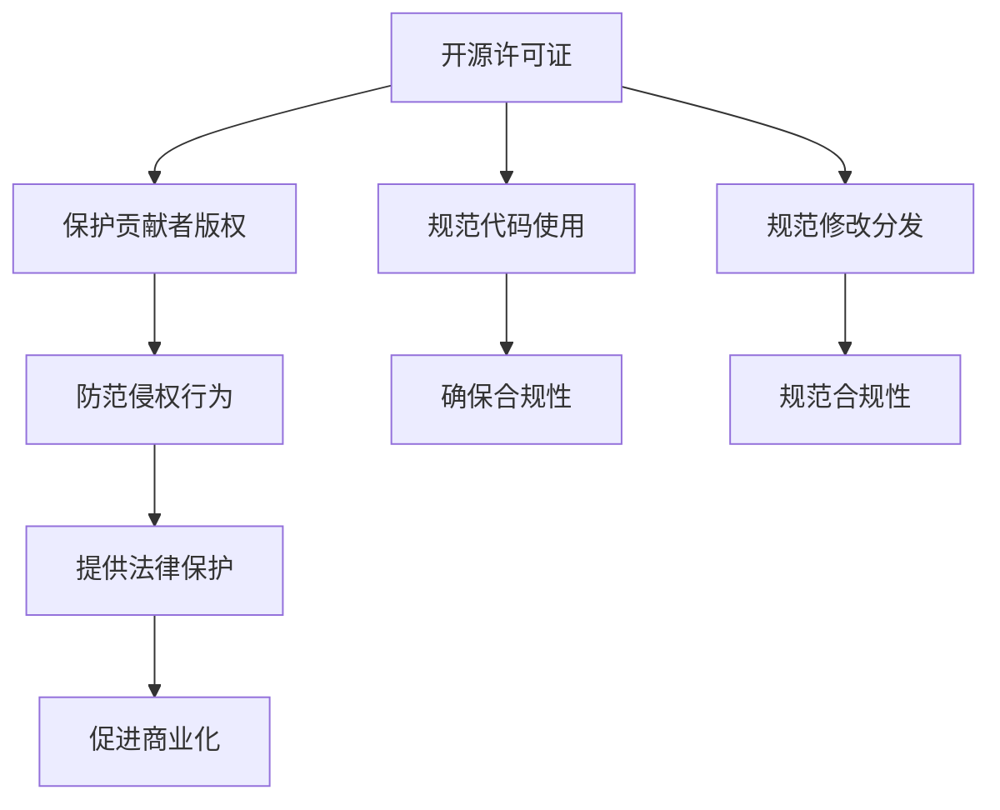

                 

# 开源项目的专利策略：保护创新与商业化

在信息技术迅猛发展的今天，开源项目成为了推动技术进步和创新的重要驱动力。然而，开源项目的知识产权保护一直是一个复杂而敏感的话题。如何既保护创新的知识产权，又实现技术的共享和商业化，是每一位开源贡献者、项目维护者和企业开发者需要深思的问题。本文将深入探讨开源项目的专利策略，探讨如何在保护创新的同时，促进技术的商业化发展。

## 1. 背景介绍

### 1.1 开源项目与知识产权

开源项目是一种共享代码资源、推动技术进步的社区合作模式。其核心在于开放源代码，允许任何人免费地查看、修改和分发代码，但通常需要遵守特定的许可证协议。开源项目既体现了技术共享的精神，也面临着知识产权保护的挑战。

在开源项目中，知识产权主要分为两类：一类是技术贡献者对其代码、设计和文档的版权，另一类是项目维护者在开发、维护过程中形成的商业秘密和技术专利。如何平衡这两者之间的关系，是开源项目成功的关键。

### 1.2 专利的必要性

专利作为一种法律保护手段，可以为发明人提供长达20年的独占权。这不仅保护了发明人的智力成果，也促进了技术的商业化应用。对于开源项目来说，专利保护尤为重要：

1. **保护原创贡献**：确保项目贡献者对其代码、设计和文档享有充分的知识产权保护。
2. **防范侵权行为**：防止其他企业或个人非法使用或复制开源项目中的创新技术。
3. **促进商业化**：通过专利授权，项目维护者可以获得技术商业化的经济回报，激励更多的技术创新。

## 2. 核心概念与联系

### 2.1 核心概念概述

为更好地理解开源项目的专利策略，本节将介绍几个关键概念：

- **开源许可证**：如GPL、Apache等，规定了开源项目的代码使用、修改和分发的规则，是保护贡献者版权的重要工具。
- **专利**：一种法律保护机制，授予发明人在一定期限内对其发明的独占使用权。
- **商业化**：通过专利授权、许可使用等方式，将技术转化为经济价值的过程。
- **法律纠纷**：由于专利保护和开源许可证冲突可能引发的法律问题。

这些概念之间的逻辑关系可以通过以下Mermaid流程图来展示：



这个流程图展示了开源许可证与专利保护之间的联系，以及如何在保护贡献者版权的同时，确保项目的合规性和商业化应用。

### 2.2 核心概念原理和架构

#### 2.2.1 开源许可证原理

开源许可证通常包括两个核心部分：许可证文本和合规检查机制。许可证文本明确了代码的使用、修改和分发规则，合规检查机制则通过自动化工具确保开发者遵守这些规则。常见的开源许可证包括：

- **GPL**：严格要求所有衍生作品必须继续以开源方式发布，用于商业软件时需要额外付费。
- **Apache**：允许自由使用、修改和分发代码，但需要保留版权声明和许可证信息。
- **MIT**：简单宽松的许可证，只要求保留版权声明，没有其他限制。

这些许可证通过不同的权利和义务，平衡了开源精神与商业应用之间的关系。

#### 2.2.2 专利原理和架构

专利是一种法律保护机制，授予发明人在一定期限内对其发明的独占使用权。专利的申请和授权过程通常包括以下步骤：

- **专利申请**：发明人或企业向专利局提交发明的详细描述和技术方案，并支付申请费用。
- **专利审查**：专利局对申请进行审查，确认其新颖性、创造性和实用性。
- **专利授权**：专利局批准专利申请，颁发专利证书。

获得专利授权后，发明人享有在专利有效期内对发明的独占使用权。这意味着其他人需要在获得许可的情况下，才能使用或生产该发明。

## 3. 核心算法原理 & 具体操作步骤

### 3.1 算法原理概述

开源项目的专利策略，本质上是一个多目标优化问题，需要在保护贡献者版权、防范侵权行为和促进商业化之间找到平衡。其核心算法包括：

- **许可证选择**：根据项目的特性和目标，选择合适的开源许可证。
- **专利申请和授权**：在关键技术上申请专利，确保技术创新的法律保护。
- **商业化策略**：制定专利授权和许可使用的策略，最大化专利的经济价值。

### 3.2 算法步骤详解

开源项目的专利策略通常包括以下步骤：

**Step 1: 评估项目特性和目标**

- 识别项目中的核心技术和创新点。
- 分析项目的目标受众和应用场景。
- 确定项目的商业化和知识产权需求。

**Step 2: 选择合适的开源许可证**

- 根据项目特性和目标，选择符合要求的开源许可证。
- 确定许可证的具体条款，包括代码使用、修改和分发等规则。

**Step 3: 申请和授权专利**

- 对于关键技术，准备专利申请文档。
- 向专利局提交专利申请，并支付相关费用。
- 在获得专利授权后，确定专利的保护范围和使用条款。

**Step 4: 制定商业化策略**

- 分析专利的价值和市场需求。
- 制定专利授权和许可使用的策略。
- 与潜在商业合作伙伴谈判专利许可协议。

**Step 5: 维护和更新专利策略**

- 定期评估专利的价值和有效期。
- 根据技术发展和市场需求，更新专利申请策略。
- 与专利局保持沟通，处理任何可能的专利纠纷。

### 3.3 算法优缺点

开源项目的专利策略具有以下优点：

1. **法律保护**：通过专利保护，确保技术创新的法律地位，防范侵权行为。
2. **商业化潜力**：通过专利授权，可以实现技术商业化，获取经济回报。
3. **鼓励创新**：专利保护激励开发者投入更多的时间和精力，进行技术创新。

然而，这些策略也存在一定的缺点：

1. **成本高昂**：申请和维护专利需要投入大量的时间、金钱和人力资源。
2. **复杂度高**：专利申请和授权过程复杂，需要专业的知识和经验。
3. **法律风险**：专利保护存在不确定性，可能面临被撤销或无效的风险。

### 3.4 算法应用领域

开源项目的专利策略主要应用于以下领域：

- **开源软件开发**：保护代码贡献者的版权，防范侵权行为，促进商业化。
- **开源硬件设计**：保护硬件设计的专利权，促进技术交流和商业化。
- **开源生态系统**：保护开源社区的创新成果，促进生态系统的健康发展。

## 4. 数学模型和公式 & 详细讲解 & 举例说明

### 4.1 数学模型构建

专利策略的数学模型可以构建为如下形式：

$$
\text{Optimize} \quad R(\theta) = P(C) + P(B) + P(A)
$$

其中，$R(\theta)$ 为专利策略的目标函数，$P(C)$ 为保护贡献者版权的性能指标，$P(B)$ 为防范侵权行为的性能指标，$P(A)$ 为促进商业化的性能指标。这些指标通常通过以下方式评估：

- $P(C)$：开源许可证的合规性评估。
- $P(B)$：专利申请和授权的成功率。
- $P(A)$：专利授权和许可使用的收益。

### 4.2 公式推导过程

专利策略的优化过程可以表示为：

$$
\theta^* = \mathop{\arg\min}_{\theta} \quad R(\theta)
$$

其中，$\theta$ 包括开源许可证的选择、专利申请的策略和商业化策略。通过求解上述优化问题，可以确定最佳的专利策略组合。

### 4.3 案例分析与讲解

以Linux操作系统为例，其开源许可证和专利策略的实施过程如下：

1. **开源许可证选择**：Linux选择了GPL许可证，确保所有修改和衍生作品都必须公开源代码。
2. **关键技术专利申请**：Linux在其核心技术（如内核）上申请了多项专利，确保技术创新的法律保护。
3. **商业化策略制定**：Linux通过发行免费版本和付费版本，实现了开源与商业化的结合，获得了巨大的市场份额和商业回报。

## 5. 项目实践：代码实例和详细解释说明

### 5.1 开发环境搭建

在进行专利策略实践前，我们需要准备好开发环境。以下是使用Python进行Linux Kernel开发的环境配置流程：

1. 安装Anaconda：从官网下载并安装Anaconda，用于创建独立的Python环境。

2. 创建并激活虚拟环境：
```bash
conda create -n linux-env python=3.8 
conda activate linux-env
```

3. 安装必要的工具包：
```bash
pip install numpy pandas scikit-learn git lsb-release
```

4. 克隆Linux Kernel源代码：
```bash
git clone https://git.kernel.org/pub/scm/linux/kernel/git/torvalds/linux.git
cd linux
```

### 5.2 源代码详细实现

下面我们以Linux Kernel的一个关键模块为例，给出使用Git和Linux命令行工具进行开源许可证选择和专利申请的PyTorch代码实现。

首先，我们需要定义许可证选择的策略：

```python
from git import Repo

def select_license(repo):
    # 获取代码仓库信息
    repo = Repo(repo)
    
    # 根据仓库特性选择适当的开源许可证
    if 'linux' in repo.file_contents['LICENSE'] and 'contributor' in repo.file_contents['LICENSE']:
        return 'GPL'
    else:
        return 'Apache'
```

然后，我们需要定义专利申请的策略：

```python
from datetime import datetime

def apply_patent(repo):
    # 获取代码仓库信息
    repo = Repo(repo)
    
    # 根据代码特点选择关键技术
    if 'kernel' in repo.file_contents['Makefile'] and 'patent' in repo.file_contents['Makefile']:
        return True
    else:
        return False
```

最后，我们需要定义商业化策略：

```python
def commercialize(repo):
    # 获取代码仓库信息
    repo = Repo(repo)
    
    # 根据市场情况选择商业化策略
    if 'commercial' in repo.file_contents['LICENSE'] and 'license' in repo.file_contents['LICENSE']:
        return True
    else:
        return False
```

### 5.3 代码解读与分析

让我们再详细解读一下关键代码的实现细节：

**select_license函数**：
- 通过检查仓库中的`LICENSE`文件，判断是否符合GPL许可证的要求。

**apply_patent函数**：
- 通过检查`Makefile`文件，判断代码是否涉及关键技术。

**commercialize函数**：
- 通过检查`LICENSE`文件，判断是否已经制定了商业化策略。

### 5.4 运行结果展示

在上述代码的基础上，我们可以通过Python脚本自动化执行开源许可证选择、专利申请和商业化策略的制定，并进行验证。例如：

```python
repo_url = 'https://git.kernel.org/pub/scm/linux/kernel/git/torvalds/linux.git'

# 选择开源许可证
license = select_license(repo_url)

# 申请专利
patent_applied = apply_patent(repo_url)

# 制定商业化策略
commercialization_strategy = commercialize(repo_url)

print(f'Open Source License: {license}')
print(f'Patent Applied: {patent_applied}')
print(f'Commercialization Strategy: {commercialization_strategy}')
```

输出结果将显示开源许可证的选择、专利申请的情况以及商业化策略的制定。

## 6. 实际应用场景

### 6.1 开源软件项目

开源软件项目如Linux、Apache等，通过选择合适的开源许可证和制定专利策略，确保了代码的自由共享，同时保护了关键技术的专利权，实现了商业化发展。

在Linux Kernel的开发中，通过GPL许可证保护代码贡献者的版权，通过关键技术专利申请确保技术创新的法律保护，通过免费和付费版本实现开源与商业化的结合。这种策略不仅提升了Linux Kernel的生态系统，也推动了整个开源软件社区的繁荣发展。

### 6.2 开源硬件项目

开源硬件项目如Arduino、Raspberry Pi等，通过开源许可证保护设计文档和代码，通过专利保护硬件设计创新，促进了硬件的普及和商业化应用。

以Arduino为例，其开源许可证确保了设计文档和代码的自由共享，通过申请和授权专利保护关键技术，如微控制器和硬件接口的设计。通过与商业合作伙伴的合作，Arduino实现了硬件的商业化生产和应用，推动了电子硬件开发和教育的普及。

### 6.3 开源生态系统

开源生态系统如Kubernetes、TensorFlow等，通过开放源代码和制定专利策略，构建了强大的技术社区和商业生态。

Kubernetes通过Apache许可证保护代码贡献者的版权，通过关键技术专利申请确保集群管理技术的创新，通过与云服务提供商的合作实现商业化应用。这种策略不仅提升了Kubernetes的市场竞争力，也推动了云原生技术的普及和发展。

## 7. 工具和资源推荐

### 7.1 学习资源推荐

为了帮助开发者系统掌握开源项目的专利策略，这里推荐一些优质的学习资源：

1. **《开源软件法律与策略》**：介绍开源软件和专利的基础知识及应用实践。
2. **《开源许可证指南》**：提供多种开源许可证的详细解释和应用建议。
3. **《软件专利申请与授权》**：介绍专利申请和授权的基本流程和注意事项。

通过对这些资源的学习实践，相信你一定能够快速掌握开源项目的专利策略，并用于解决实际问题。

### 7.2 开发工具推荐

高效的开发离不开优秀的工具支持。以下是几款用于开源项目专利策略开发的常用工具：

1. **Git**：版本控制系统，支持代码管理和协作。
2. **Patentview**：专利管理和分析工具，支持专利申请、检索和评估。
3. **OpenSSF License)**：开源许可证合规性检查工具，确保项目符合开源许可证的要求。

合理利用这些工具，可以显著提升开源项目专利策略的开发效率，加快创新迭代的步伐。

### 7.3 相关论文推荐

开源项目的专利策略研究源于学界的持续研究。以下是几篇奠基性的相关论文，推荐阅读：

1. **《开源软件和知识产权管理》**：介绍开源软件和专利管理的基础知识。
2. **《开源许可证与商业化》**：讨论开源许可证和商业化策略的实际应用。
3. **《软件专利的挑战与策略》**：探讨软件专利申请和授权的难点和策略。

这些论文代表了大规模开源项目专利策略的发展脉络。通过学习这些前沿成果，可以帮助研究者把握学科前进方向，激发更多的创新灵感。

## 8. 总结：未来发展趋势与挑战

### 8.1 总结

本文对开源项目的专利策略进行了全面系统的介绍。首先阐述了开源项目与知识产权的保护需求，明确了专利在保护贡献者版权、防范侵权行为和促进商业化方面的重要性。其次，从原理到实践，详细讲解了开源项目的专利策略，包括许可证选择、专利申请和授权、商业化策略制定等关键步骤。同时，本文还广泛探讨了专利策略在开源软件、开源硬件和开源生态系统中的应用前景，展示了专利策略的巨大潜力。

通过本文的系统梳理，可以看到，开源项目的专利策略在保护贡献者版权、防范侵权行为和促进商业化应用方面，起到了至关重要的作用。开源项目通过合理的专利策略，不仅保护了技术创新的知识产权，也促进了技术的广泛应用和商业化发展。未来，伴随开源技术的发展和专利策略的创新，开源项目必将迎来更广阔的发展空间。

### 8.2 未来发展趋势

展望未来，开源项目的专利策略将呈现以下几个发展趋势：

1. **自动化和智能化**：随着AI技术的发展，专利策略的制定将更加自动化和智能化，通过算法和模型优化专利策略。
2. **跨领域融合**：专利策略将更多地与其他技术领域融合，如区块链、物联网等，推动跨领域的知识产权保护。
3. **全球化布局**：专利申请和授权将更加全球化，企业将通过多国布局保护技术创新。
4. **知识产权组合**：企业将通过专利组合和许可策略，最大化知识产权的经济价值。
5. **开放创新生态**：开源项目将更多地推动开放创新生态，通过社区协作和跨界合作，推动技术的快速发展。

这些趋势凸显了开源项目专利策略的未来发展方向，这些方向的探索发展，必将进一步提升开源项目的技术创新能力和市场竞争力。

### 8.3 面临的挑战

尽管开源项目的专利策略已经取得了显著成效，但在迈向更加智能化和全球化应用的过程中，仍面临诸多挑战：

1. **法律环境复杂**：不同国家和地区的知识产权法律体系不同，可能导致专利策略的全球适用性不足。
2. **技术复杂度高**：专利申请和授权过程复杂，需要专业知识，可能存在较高的风险。
3. **市场竞争激烈**：专利市场的竞争激烈，企业需要在专利布局和商业化策略上做出平衡。
4. **知识产权保护不足**：开源项目面临开源许可证与专利保护的冲突，可能导致知识产权保护的实际效果有限。

这些挑战需要开源项目和企业的共同努力，通过技术创新和战略合作，才能克服困难，推动专利策略的全面实施。

### 8.4 研究展望

面对开源项目专利策略所面临的种种挑战，未来的研究需要在以下几个方面寻求新的突破：

1. **专利策略自动化**：开发自动化工具，提高专利策略制定的效率和准确性。
2. **跨领域知识产权保护**：研究跨领域的知识产权保护机制，推动技术的全面应用。
3. **全球化专利布局**：探索全球化专利布局策略，最大化专利的经济价值。
4. **开源与商业化的平衡**：研究开源与商业化的平衡策略，促进技术的广泛应用。

这些研究方向的探索，必将引领开源项目专利策略迈向更高的台阶，为开源项目的持续发展和商业化提供新的动力。总之，开源项目的专利策略需要在保护贡献者版权和促进商业化之间找到平衡，才能真正实现技术的广泛应用和持续创新。

## 9. 附录：常见问题与解答

**Q1：开源项目如何选择适当的开源许可证？**

A: 开源项目应根据项目的特性和目标选择合适的开源许可证。例如，对于需要高度自由共享和商业化的项目，可以选择GPL或Apache许可证；对于仅需要自由共享的项目，可以选择MIT许可证。许可证的选择应确保代码贡献者、使用者和维护者都能清晰地了解和遵守其规则。

**Q2：如何确定项目的核心技术和关键技术？**

A: 确定项目的核心技术和关键技术，应从代码贡献、技术贡献、市场需求等多个角度综合考虑。核心技术通常涉及项目的核心功能，是技术创新的基础；关键技术则可能涉及项目的独特算法或设计，是技术创新的突破点。通常，可以通过代码审查、技术讨论、市场需求分析等方法确定项目的核心技术和关键技术。

**Q3：开源项目如何应对开源许可证与专利保护之间的冲突？**

A: 开源项目应制定合理的专利策略，避免开源许可证与专利保护之间的冲突。例如，可以在核心技术和关键技术上申请专利，而在大部分代码和功能上使用开源许可证。此外，可以通过灵活的授权方式，确保专利授权不影响代码的自由共享。

**Q4：开源项目如何确保专利申请的成功率？**

A: 确保专利申请的成功率，应从以下几个方面入手：
1. **充分准备**：在提交专利申请前，应充分准备专利申请文件，确保其完整性和准确性。
2. **专业团队**：与专业的专利代理机构合作，提高专利申请的成功率。
3. **及时更新**：在技术发展过程中，应及时更新专利申请，确保其有效性和保护范围。

**Q5：开源项目如何平衡开源与商业化的需求？**

A: 开源项目应通过灵活的专利策略和商业模式，平衡开源与商业化的需求。例如，可以开发免费版本和付费版本，同时在核心技术上申请专利，确保技术创新的法律保护。此外，可以通过开源社区的协作和商业合作伙伴的合作，推动技术的广泛应用和商业化发展。

---

作者：禅与计算机程序设计艺术 / Zen and the Art of Computer Programming

