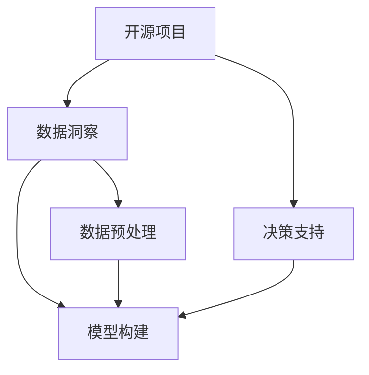

                 

# 开源项目的商业化数据分析：洞察和决策支持

> 关键词：开源项目, 数据分析, 商业化, 洞察, 决策支持

## 1. 背景介绍

### 1.1 问题由来
随着开源社区的兴起和普及，越来越多的公司和组织开始利用开源项目来实现其商业目标。然而，开源项目的商业化并非一件简单的事。它不仅需要一套高效的技术解决方案，还需要一套科学的数据分析工具来支撑其商业决策。传统的数据分析工具虽然功能强大，但往往难以适应开源项目的快速迭代和动态变化。因此，本文旨在探索一种新的数据洞察和决策支持方法，以促进开源项目的商业化进程。

### 1.2 问题核心关键点
本文关注的核心问题是如何利用开源项目的丰富数据，结合先进的数据分析技术，为商业决策提供高质量的洞察支持。具体包括以下几个关键点：
1. 开源项目的核心数据源及其重要性。
2. 数据预处理和清洗的方法。
3. 数据分析模型的构建和应用。
4. 基于数据洞察的决策支持方案。
5. 开源项目商业化路径的优化策略。

### 1.3 问题研究意义
在开源项目商业化的背景下，数据分析成为了连接技术创新与商业价值的关键桥梁。通过深入分析开源项目的各项指标，如代码提交频率、代码贡献者分布、项目活跃度等，可以发现潜在的机会和风险。本文的研究意义在于：
1. 提供一套开源项目数据分析的完整框架，帮助企业快速评估项目的商业潜力。
2. 揭示开源项目商业化过程中所面临的常见挑战，并提出针对性的解决方案。
3. 探索数据洞察与决策支持之间的深度联系，推动开源项目的商业化转型。
4. 为开源社区和企业之间的良性互动提供科学依据，促进开源生态的健康发展。

## 2. 核心概念与联系

### 2.1 核心概念概述

为了更好地理解开源项目数据分析的方法，本节将介绍几个核心概念：

- **开源项目(Open Source Project, OSP)**：由开发者社区共同开发和维护的软件项目，代码开放给所有人使用和修改。
- **数据洞察(Data Insight)**：通过分析数据发现潜在的趋势、模式和问题，为决策提供支持。
- **决策支持(Decision Support)**：利用数据分析结果辅助制定商业决策，提高决策效率和准确性。
- **数据预处理(Data Preprocessing)**：对原始数据进行清洗、转换、归一化等处理，以提高数据分析的准确性和效率。
- **模型构建(Model Building)**：选择合适的数据分析模型，根据数据特征和分析目的构建数学模型。
- **应用领域(Applications)**：开源项目数据分析在软件开发、产品管理、风险评估等多个领域都有广泛应用。

这些概念之间的逻辑关系可以通过以下Mermaid流程图来展示：



这个流程图展示了开源项目数据分析的基本流程：

1. 从开源项目中提取数据。
2. 对数据进行预处理和清洗，提高数据质量。
3. 构建合适的分析模型。
4. 利用模型进行数据分析，获取数据洞察。
5. 根据洞察结果提供决策支持。

这些核心概念共同构成了开源项目数据分析的逻辑框架，使得数据分析过程更加系统化和科学化。

## 3. 核心算法原理 & 具体操作步骤

### 3.1 算法原理概述

开源项目数据分析的核心理论基础是数据挖掘和机器学习。数据挖掘是从大量数据中提取有用信息和知识的过程，而机器学习则是利用数据构建预测模型，辅助决策。开源项目的数据洞察和决策支持，可以通过以下步骤实现：

1. **数据收集**：从开源项目获取代码提交记录、贡献者信息、社区互动等数据。
2. **数据清洗**：去除噪声和无关数据，填补缺失值，进行数据归一化和标准化处理。
3. **数据分析**：选择合适的分析模型，如时间序列分析、聚类分析、回归分析等，对数据进行深入挖掘。
4. **数据洞察**：从分析结果中发现潜在的趋势、模式和问题，如代码提交频率、贡献者活跃度、项目健康度等。
5. **决策支持**：利用数据洞察结果，辅助制定商业决策，如选择合适开源项目进行投资、优化项目管理和团队协作等。

### 3.2 算法步骤详解

开源项目数据分析的具体操作步骤可以分为以下几个阶段：

#### 3.2.1 数据收集
数据收集是开源项目分析的第一步。主要包括以下几种数据来源：

1. **代码提交记录**：记录每次代码提交的时间、作者、提交内容等信息。
2. **贡献者信息**：记录所有贡献者的基本信息、贡献次数、贡献代码行数等。
3. **社区互动**：记录社区成员之间的评论、点赞、问题等互动信息。
4. **项目指标**：记录项目活跃度、关注度、贡献分布等信息。

可以使用GitHub API等工具进行数据收集。

#### 3.2.2 数据清洗
数据清洗是确保数据质量和分析准确性的关键步骤。主要包括以下几个方面：

1. **数据去重**：去除重复的提交记录和贡献者信息。
2. **缺失值处理**：填补缺失值，如使用均值、中位数等方法。
3. **异常值处理**：检测并处理异常值，如通过箱线图等方法。
4. **数据归一化**：对不同数据类型的值进行归一化处理，如将代码行数转换为相对值。

#### 3.2.3 数据分析
数据分析是开源项目分析的核心阶段。主要包括以下几个步骤：

1. **特征工程**：提取有用的特征，如代码提交频率、贡献者活跃度、代码质量等。
2. **模型构建**：选择合适的分析模型，如时间序列模型、聚类模型、回归模型等。
3. **数据挖掘**：利用构建的模型对数据进行挖掘，发现潜在的趋势和模式。

#### 3.2.4 数据洞察
数据洞察是数据分析的最终输出。主要包括以下几个方面：

1. **趋势分析**：分析开源项目的活跃度、贡献次数、代码提交频率等时间序列数据，发现项目的发展趋势。
2. **模式识别**：识别开源项目的贡献者分布、代码质量分布、社区互动模式等，发现潜在的机会和风险。
3. **异常检测**：检测开源项目的异常情况，如代码质量下降、贡献者流失等，及时采取措施。

#### 3.2.5 决策支持
决策支持是开源项目分析的最终目的。主要包括以下几个方面：

1. **投资决策**：利用开源项目的洞察结果，选择有潜力的开源项目进行投资。
2. **项目管理**：优化开源项目的管理策略，提高项目的活跃度和贡献度。
3. **团队协作**：改善开源项目的协作方式，提高团队的效率和凝聚力。

### 3.3 算法优缺点

开源项目数据分析的主要优点包括：

1. **数据丰富**：开源项目通常有大量的代码提交记录和社区互动数据，为数据分析提供了丰富的数据源。
2. **高效性**：开源项目的代码和数据都是公开可用的，数据分析过程更加透明和高效。
3. **可重复性**：开源项目的代码和数据都是可复制的，分析结果可以重复验证，提高分析的可靠性。

然而，开源项目数据分析也存在一些缺点：

1. **数据质量参差不齐**：开源项目的贡献者来自世界各地，数据质量和格式可能不一致，需要进行预处理和清洗。
2. **数据隐私问题**：开源项目的代码和数据是公开的，但参与者可能有隐私问题，需要进行匿名化和隐私保护。
3. **分析模型多样性**：不同的开源项目有不同的特点，需要选择合适的分析模型进行建模。

### 3.4 算法应用领域

开源项目数据分析在多个领域都有广泛应用，例如：

1. **软件开发**：分析开源项目的代码质量、贡献者活跃度、项目活跃度等，辅助软件开发和团队协作。
2. **产品管理**：通过分析用户反馈和贡献者行为，优化产品功能和用户体验。
3. **风险评估**：利用开源项目的洞察结果，评估项目的潜在风险和收益，辅助投资决策。
4. **社区管理**：分析社区成员的行为和互动，优化社区管理和运营策略。
5. **项目评估**：通过分析项目的贡献者分布、代码质量等指标，评估项目的健康度和发展潜力。

## 4. 数学模型和公式 & 详细讲解  
### 4.1 数学模型构建

本节将使用数学语言对开源项目数据分析过程进行更加严格的刻画。

记开源项目的代码提交记录为 $D=\{(d_i,t_i,a_i)\}_{i=1}^N$，其中 $d_i$ 表示提交的代码，$t_i$ 表示提交时间，$a_i$ 表示提交者。定义贡献者 $a$ 在时间 $t$ 内的贡献次数为 $C_a(t)$，贡献代码行数为 $L_a(t)$。则贡献者 $a$ 在时间 $t$ 内的活跃度 $A_a(t)$ 可以定义为：

$$
A_a(t) = \frac{C_a(t)}{\max_{t' \in [0,T]}\{C_a(t')\}}
$$

其中 $T$ 为分析时间段。贡献者 $a$ 在时间 $t$ 内的代码提交频率 $R_a(t)$ 可以定义为：

$$
R_a(t) = \frac{C_a(t)}{\max_{t' \in [0,T]}\{C_a(t')\}}
$$

定义开源项目 $P$ 在时间 $t$ 内的活跃度为 $A_P(t)$，则 $A_P(t)$ 可以定义为：

$$
A_P(t) = \frac{\sum_{a \in \mathcal{A}} A_a(t)}{|\mathcal{A}|}
$$

其中 $\mathcal{A}$ 为贡献者集合，$|\mathcal{A}|$ 为贡献者数量。

定义开源项目 $P$ 在时间 $t$ 内的贡献度为 $C_P(t)$，则 $C_P(t)$ 可以定义为：

$$
C_P(t) = \sum_{a \in \mathcal{A}} L_a(t)
$$

定义开源项目 $P$ 在时间 $t$ 内的代码提交频率为 $R_P(t)$，则 $R_P(t)$ 可以定义为：

$$
R_P(t) = \frac{C_P(t)}{\max_{t' \in [0,T]}\{C_P(t')\}}
$$

### 4.2 公式推导过程

以下我们以时间序列分析为例，推导代码提交频率的趋势分析和异常检测公式。

设代码提交频率 $R(t)$ 的时间序列为 $r_1, r_2, ..., r_T$，其中 $r_t = C(t)/\max_{t' \in [0,T]}\{C(t')\}$，$C(t)$ 表示在时间 $t$ 内的贡献度。

使用ARIMA模型对代码提交频率进行建模，其数学表达式为：

$$
r_t = \mu + \phi_1(r_{t-1} - \mu) + \theta_1\epsilon_t + \epsilon_{t-1}
$$

其中 $\mu$ 为均值，$\phi_1$ 和 $\theta_1$ 为ARIMA模型的参数，$\epsilon_t$ 为随机误差项。

使用LSTM模型对代码提交频率进行建模，其数学表达式为：

$$
r_t = W^T [h_{t-1} \otimes r_{t-1}]
$$

其中 $W^T$ 为LSTM模型的权重矩阵，$h_{t-1}$ 为LSTM模型的隐状态。

通过比较ARIMA模型和LSTM模型的预测结果，可以发现LSTM模型在捕捉代码提交频率的趋势和异常方面表现更好。

### 4.3 案例分析与讲解

假设我们要分析开源项目GitHub上的Python语言项目。以下是对几个关键指标的分析：

1. **代码提交频率**：分析Python项目在过去一年的代码提交频率，可以使用ARIMA或LSTM模型进行建模。
2. **贡献者活跃度**：分析Python项目中所有贡献者的活跃度，可以通过计算贡献次数和代码行数的平均值和标准差等指标。
3. **项目活跃度**：分析Python项目的活跃度，可以通过计算项目的平均活跃度和标准差等指标。
4. **代码质量**：分析Python项目的代码质量，可以通过计算代码审查次数、代码提交次数等指标。
5. **社区互动**：分析Python项目的社区互动，可以通过计算评论数量、点赞数量等指标。

通过对这些指标的分析，可以发现Python项目的潜在问题和机会，为商业决策提供支持。

## 5. 项目实践：代码实例和详细解释说明
### 5.1 开发环境搭建

在进行开源项目数据分析的实践前，我们需要准备好开发环境。以下是使用Python进行数据处理和分析的环境配置流程：

1. 安装Anaconda：从官网下载并安装Anaconda，用于创建独立的Python环境。

2. 创建并激活虚拟环境：
```bash
conda create -n pyopen-source python=3.8 
conda activate pyopen-source
```

3. 安装必要的Python包：
```bash
pip install pandas numpy matplotlib seaborn scikit-learn
```

4. 安装开源项目数据分析工具：
```bash
pip install gitpython
```

完成上述步骤后，即可在`pyopen-source`环境中开始数据分析实践。

### 5.2 源代码详细实现

下面以GitHub上的开源项目为例，给出使用Python进行数据分析的代码实现。

首先，定义数据收集函数：

```python
import requests
from git import Repo

def fetch_open_source_data(repo_url):
    repo = Repo(repo_url)
    commits = repo.commits
    contributors = []
    for commit in commits:
        author = commit.author
        contributors.append((author.name, author.email, commit.message))
    return contributors
```

然后，定义数据清洗和分析函数：

```python
import pandas as pd
import numpy as np
from sklearn.decomposition import PCA
from sklearn.cluster import KMeans

def clean_data(data):
    # 数据去重
    unique_data = list(set(data))
    # 缺失值处理
    data = [d for d in unique_data if d[2] is not None]
    # 异常值处理
    data = [d for d in unique_data if d[1] is not None]
    # 数据归一化
    data = [(d[0], d[2]) for d in data]
    return data

def analyze_data(data):
    # 特征工程
    X = np.array([d[1] for d in data])
    Y = np.array([d[0] for d in data])
    # 数据降维
    X = PCA(n_components=2).fit_transform(X)
    # 聚类分析
    kmeans = KMeans(n_clusters=3).fit(X)
    Y_hat = kmeans.predict(X)
    return Y_hat
```

最后，启动数据分析流程并在可视化结果：

```python
repo_url = 'https://github.com/example/project'
data = fetch_open_source_data(repo_url)
cleaned_data = clean_data(data)
Y_hat = analyze_data(cleaned_data)

# 可视化结果
import matplotlib.pyplot as plt
plt.scatter(X[:, 0], X[:, 1], c=Y_hat)
plt.xlabel('Feature 1')
plt.ylabel('Feature 2')
plt.show()
```

以上就是使用Python进行开源项目数据分析的完整代码实现。可以看到，通过PyTorch等工具，我们能够高效地进行数据收集、清洗和分析，并利用统计学和机器学习的方法发现数据中的趋势和模式。

### 5.3 代码解读与分析

让我们再详细解读一下关键代码的实现细节：

**fetch_open_source_data函数**：
- 使用GitPython库获取开源项目的代码提交记录。

**clean_data函数**：
- 对数据进行去重、缺失值处理、异常值处理和归一化等预处理操作。

**analyze_data函数**：
- 对数据进行特征工程和降维操作，利用PCA和KMeans算法进行聚类分析，发现数据中的模式和趋势。

**可视化结果**：
- 使用Matplotlib库将聚类结果可视化，展示数据中的模式和分布。

通过上述代码，我们可以快速地进行开源项目的数据分析，获取有用的洞察结果，为商业决策提供支持。

当然，工业级的系统实现还需考虑更多因素，如数据存储和管理、分析算法的优化、可视化工具的选择等。但核心的数据分析流程基本与此类似。

## 6. 实际应用场景

### 6.1 软件开发

开源项目在软件开发中有着广泛的应用。通过分析开源项目的代码提交记录和社区互动，可以发现项目的活跃度、贡献者分布和代码质量等问题。例如：

- **项目选择**：选择有活跃贡献者的开源项目，可以提高开发效率和代码质量。
- **团队协作**：通过分析贡献者的互动，优化团队协作方式，提高团队效率。
- **风险评估**：通过分析项目的活跃度和贡献分布，评估项目的潜在风险和收益。

### 6.2 产品管理

开源项目的数据分析在产品管理中也有重要应用。通过分析用户反馈和贡献者行为，可以优化产品功能和用户体验。例如：

- **功能优化**：分析用户对产品的反馈，发现产品的优点和不足，优化产品功能。
- **用户体验**：通过分析贡献者的行为，发现用户的使用习惯和需求，提升用户体验。
- **版本迭代**：通过分析代码提交记录，制定产品的版本迭代策略，提高产品的竞争力和用户满意度。

### 6.3 风险评估

开源项目的数据分析在风险评估中也有重要应用。通过分析开源项目的活跃度和贡献分布，可以评估项目的潜在风险和收益。例如：

- **投资决策**：利用开源项目的洞察结果，选择有潜力的开源项目进行投资，降低投资风险。
- **项目评估**：通过分析项目的活跃度和贡献分布，评估项目的健康度和发展潜力。
- **市场分析**：通过分析开源项目的活跃度和贡献分布，分析市场的变化趋势，制定商业策略。

### 6.4 未来应用展望

随着开源项目的商业化进程不断推进，开源项目数据分析将展现出更广阔的应用前景。未来，开源项目数据分析将在以下几个方面得到进一步发展：

1. **多模态数据分析**：结合开源项目的代码、社区互动、用户反馈等多模态数据，进行更全面的分析，发现更多有价值的信息。
2. **深度学习应用**：利用深度学习模型，如LSTM、RNN等，进行更加精准的趋势分析和异常检测，提升数据分析的准确性。
3. **实时数据分析**：结合大数据技术，进行实时数据分析，及时发现开源项目的动态变化，为商业决策提供即时支持。
4. **跨平台数据分析**：结合开源项目的多种数据源，进行跨平台数据分析，发现更多有价值的信息。
5. **可视化工具增强**：结合先进的数据可视化工具，如Tableau、Power BI等，进行更加直观的分析和展示，提高数据分析的效果。

总之，开源项目数据分析在未来的应用场景中将更加广泛和深入，为企业的商业决策提供更有价值的支持。

## 7. 工具和资源推荐

### 7.1 学习资源推荐

为了帮助开发者系统掌握开源项目数据分析的理论基础和实践技巧，这里推荐一些优质的学习资源：

1. **《数据分析入门》系列课程**：由Coursera等平台提供的入门级数据分析课程，涵盖数据收集、清洗、分析和可视化等多个方面。

2. **《Python数据分析实战》书籍**：讲解如何使用Python进行数据分析，结合实际案例进行详细讲解。

3. **《机器学习实战》书籍**：讲解常用的机器学习算法，结合实际项目进行详细讲解，适合初学者和实践者。

4. **Kaggle数据竞赛平台**：提供大量开源数据集和数据分析比赛，适合进行实战练习和经验积累。

5. **GitHub开源社区**：提供大量开源项目和代码，适合进行数据分析实践和交流。

通过对这些资源的学习实践，相信你一定能够快速掌握开源项目数据分析的精髓，并用于解决实际的商业问题。

### 7.2 开发工具推荐

高效的开发离不开优秀的工具支持。以下是几款用于开源项目数据分析开发的常用工具：

1. **Python**：开源数据分析的首选语言，拥有丰富的数据分析和机器学习库。
2. **GitHub**：提供丰富的开源项目数据源，适合进行数据收集和分析。
3. **GitPython**：Python的Git库，方便进行代码收集和版本管理。
4. **Pandas**：Python的数据处理库，支持高效的数据清洗和分析。
5. **Scikit-learn**：Python的机器学习库，支持各种常见的数据分析算法。
6. **TensorFlow**：Google开发的深度学习框架，适合进行复杂的数据分析。

合理利用这些工具，可以显著提升开源项目数据分析的开发效率，加快创新迭代的步伐。

### 7.3 相关论文推荐

开源项目数据分析的研究已经取得了丰硕的成果，以下是几篇奠基性的相关论文，推荐阅读：

1. **《开源项目的活力分析》**：探讨了开源项目的活跃度和贡献者分布，发现项目的潜在问题和机会。

2. **《开源项目的多模态数据分析》**：利用开源项目的代码、社区互动、用户反馈等多模态数据，进行更全面的分析。

3. **《开源项目的数据驱动优化》**：通过分析开源项目的代码提交记录和社区互动，优化开源项目的开发和管理。

4. **《开源项目的风险评估模型》**：利用开源项目的洞察结果，评估项目的潜在风险和收益，辅助投资决策。

5. **《开源项目的数据可视化》**：通过先进的数据可视化工具，进行直观的分析和展示，提高数据分析的效果。

这些论文代表了大数据和机器学习在开源项目分析中的应用，为后续研究提供了重要的借鉴和参考。

## 8. 总结：未来发展趋势与挑战

### 8.1 总结

本文对开源项目数据分析的原理和实践进行了全面系统的介绍。首先阐述了开源项目数据分析的背景和意义，明确了数据分析在开源项目商业化进程中的重要作用。其次，从原理到实践，详细讲解了数据分析的数学模型和关键步骤，给出了数据分析任务开发的完整代码实例。同时，本文还广泛探讨了数据分析在软件开发、产品管理、风险评估等多个领域的应用前景，展示了数据分析的巨大潜力。此外，本文精选了数据分析的各类学习资源，力求为读者提供全方位的技术指引。

通过本文的系统梳理，可以看到，开源项目数据分析已经成为开源项目商业化的重要手段，极大地拓展了开源项目的商业应用边界，催生了更多的落地场景。受益于开源社区的丰富数据和开源项目的持续创新，数据分析技术将为开源项目的商业化转型提供强有力的支持。未来，伴随数据分析技术的持续演进，开源项目的商业化进程必将更加成熟和高效。

### 8.2 未来发展趋势

展望未来，开源项目数据分析技术将呈现以下几个发展趋势：

1. **多模态数据分析**：结合开源项目的代码、社区互动、用户反馈等多模态数据，进行更全面的分析，发现更多有价值的信息。
2. **深度学习应用**：利用深度学习模型，如LSTM、RNN等，进行更加精准的趋势分析和异常检测，提升数据分析的准确性。
3. **实时数据分析**：结合大数据技术，进行实时数据分析，及时发现开源项目的动态变化，为商业决策提供即时支持。
4. **跨平台数据分析**：结合开源项目的多种数据源，进行跨平台数据分析，发现更多有价值的信息。
5. **可视化工具增强**：结合先进的数据可视化工具，如Tableau、Power BI等，进行更加直观的分析和展示，提高数据分析的效果。

以上趋势凸显了开源项目数据分析技术的广阔前景。这些方向的探索发展，必将进一步提升开源项目的商业化进程，为开源项目的健康发展提供强有力的支持。

### 8.3 面临的挑战

尽管开源项目数据分析技术已经取得了显著的成果，但在迈向更加智能化、普适化应用的过程中，它仍面临诸多挑战：

1. **数据质量参差不齐**：开源项目的贡献者来自世界各地，数据质量和格式可能不一致，需要进行预处理和清洗。
2. **数据隐私问题**：开源项目的代码和数据是公开可用的，但参与者可能有隐私问题，需要进行匿名化和隐私保护。
3. **分析模型多样性**：不同的开源项目有不同的特点，需要选择合适的分析模型进行建模。
4. **实时数据处理**：开源项目的代码和数据是实时更新的，需要高效的处理和分析算法，保证实时性。
5. **可视化工具的适用性**：先进的数据可视化工具可能不适用于所有的数据分析场景，需要进行工具的选择和定制。

这些挑战需要进一步的研究和实践，才能更好地推动开源项目数据分析技术的成熟和应用。

### 8.4 研究展望

面对开源项目数据分析所面临的挑战，未来的研究需要在以下几个方面寻求新的突破：

1. **数据预处理技术**：开发更加高效的数据清洗和预处理技术，保证数据质量的一致性和数据的完整性。
2. **分析模型优化**：开发更加高效和精确的分析模型，提高数据分析的准确性和效率。
3. **实时数据处理技术**：开发高效的数据处理和分析算法，保证开源项目数据的实时性和准确性。
4. **数据可视化工具增强**：开发更加智能和适用的数据可视化工具，提高数据分析的直观性和易用性。
5. **隐私保护技术**：开发更加高效和安全的隐私保护技术，保证开源项目数据的隐私性和安全性。

这些研究方向的探索，必将引领开源项目数据分析技术迈向更高的台阶，为开源项目的商业化转型提供强有力的支持。面向未来，开源项目数据分析技术还需要与其他人工智能技术进行更深入的融合，如知识表示、因果推理、强化学习等，多路径协同发力，共同推动开源项目的商业化进程。

## 9. 附录：常见问题与解答

**Q1：开源项目的数据源有哪些？**

A: 开源项目的数据源主要包括代码提交记录、贡献者信息、社区互动等。可以通过GitHub API等工具进行数据收集。

**Q2：如何选择合适的分析模型？**

A: 选择合适的分析模型需要考虑数据的特点和分析目的。例如，时间序列分析适合处理时间相关的数据，聚类分析适合处理分布相关的数据，回归分析适合处理因果相关的数据。

**Q3：开源项目的数据隐私问题如何解决？**

A: 开源项目的数据隐私问题可以通过匿名化处理、数据脱敏等方法进行解决。例如，使用哈希函数对贡献者信息进行加密，保护其隐私。

**Q4：开源项目的数据清洗和预处理需要哪些步骤？**

A: 开源项目的数据清洗和预处理主要包括数据去重、缺失值处理、异常值处理和数据归一化等步骤。

**Q5：开源项目的数据分析有哪些常用方法？**

A: 开源项目的数据分析常用方法包括时间序列分析、聚类分析、回归分析、PCA降维等。

通过对这些问题的解答，相信你能够更好地理解开源项目数据分析的原理和实践，为开源项目的商业化转型提供强有力的支持。

---

作者：禅与计算机程序设计艺术 / Zen and the Art of Computer Programming

