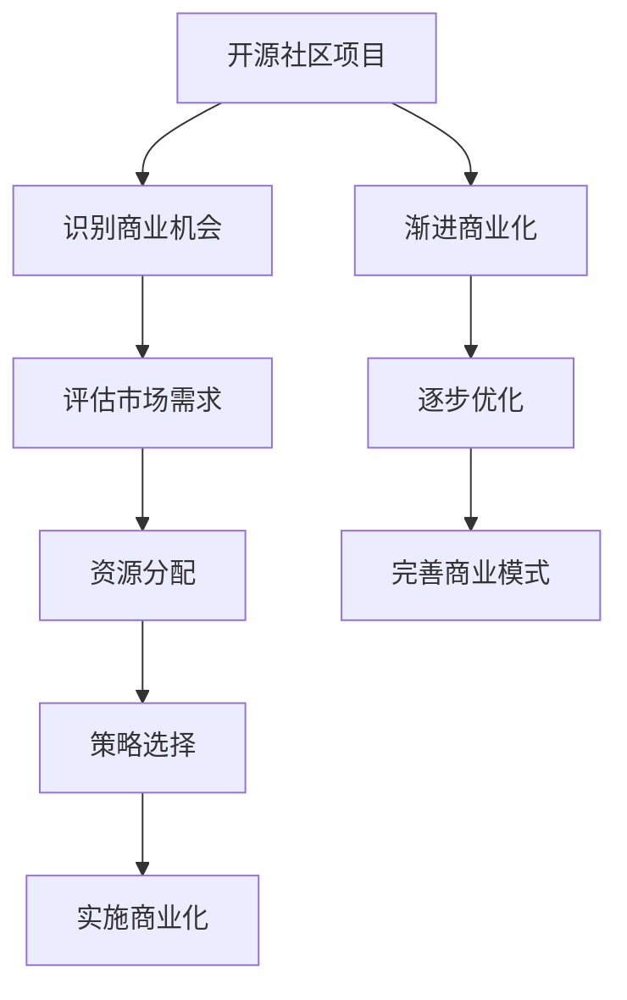

                 

# 开源项目的商业化时机：何时以及如何开始

> 关键词：开源项目, 商业化, 商业模式, 资源, 时机, 开源社区, 商业化策略

## 1. 背景介绍

### 1.1 问题由来

开源项目（Open Source Project）指的是一组源代码的集合，这些代码以公开许可证的形式发布，任何人都可以自由地使用、修改和分享。开源项目是现代软件开发的重要组成部分，为技术创新提供了广泛的平台和多样化的解决方案。然而，尽管开源项目极大地推动了技术的发展，但它们并非天生商业化的。大多数开源项目始于解决开发者个人的兴趣问题或解决特定问题，并未直接考虑商业化路径。随着开源项目的规模和影响力日益扩大，越来越多的开发者和公司开始考虑如何将这些项目转化为商业化的产品或服务。

### 1.2 问题核心关键点

商业化是开源项目发展的重要里程碑之一，但何时开始、如何商业化是许多开源项目开发者面临的主要问题。这个问题的关键点在于：

1. **时间节点**：商业化过程应始于何时？过早可能资源不足，过晚可能错失市场机遇。
2. **资源分配**：商业化过程中需要哪些资源，如何合理分配？
3. **策略选择**：根据开源项目的特点和市场需求，应采取何种商业化策略？

## 2. 核心概念与联系

### 2.1 核心概念概述

开源项目通常分为两种类型：

- **社区驱动**：由志愿者或社区成员贡献代码，项目主要依赖志愿者或企业赞助商的资金支持。
- **公司驱动**：由企业主导，有明确的商业目标和商业模式。

两种类型的项目在开发流程、资源配置、市场策略上都有显著区别。本文将重点关注从开源社区项目向商业化转型的关键步骤和策略。

### 2.2 核心概念原理和架构的 Mermaid 流程图

这个流程图展示了开源项目商业化的关键步骤：

1. **识别商业机会**：评估项目中的商业元素和潜在市场需求。
2. **评估市场需求**：分析目标市场和用户需求。
3. **资源分配**：合理分配人力、财力、物力等资源。
4. **策略选择**：确定商业化的具体策略，如直接商业化、SaaS、订阅服务等。
5. **实施商业化**：执行具体的商业化步骤，如创建产品、建立营销策略等。
6. **渐进商业化**：逐步商业化，先验证商业模式，再逐步扩展。
7. **逐步优化**：根据反馈不断优化商业模式和产品。

## 3. 核心算法原理 & 具体操作步骤

### 3.1 算法原理概述

开源项目的商业化过程可以视为一个多阶段、多目标优化问题。目标是在最小化成本和风险的同时，最大化商业价值和用户满意度。核心算法原理包括以下几个方面：

1. **市场需求分析**：分析目标市场和用户需求，评估潜在用户规模和消费能力。
2. **资源评估**：评估项目现有资源和能力，包括技术、团队、资金等。
3. **商业化策略设计**：设计符合市场需求的商业化策略，如定价策略、营销策略等。
4. **商业化路径选择**：选择合适的商业化路径，如直接销售、订阅服务、SaaS等。
5. **实施和优化**：根据市场反馈，不断优化商业化策略和产品，提升用户满意度和市场竞争力。

### 3.2 算法步骤详解

以下详细介绍开源项目商业化的具体操作步骤：

**Step 1: 识别商业机会**

识别商业机会是商业化过程的第一步。这需要评估项目中潜在的商业元素，如独特的功能、技术优势、市场潜力等。通常可以从以下几个方面入手：

1. **核心功能**：评估项目中哪些功能或技术具有商业价值。
2. **用户反馈**：分析用户反馈和需求，识别未被满足的市场需求。
3. **竞争分析**：评估项目在市场上的竞争地位，寻找潜在的机会和威胁。

**Step 2: 评估市场需求**

评估市场需求是商业化的关键步骤，需要充分了解目标市场和用户需求，以制定合适的商业策略。具体步骤包括：

1. **市场调研**：通过市场调研了解目标市场的规模、增长率和用户需求。
2. **用户画像**：分析典型用户的特征和需求，建立用户画像。
3. **市场细分**：根据用户需求和行为，进行市场细分，识别不同的用户群体。

**Step 3: 资源评估**

资源评估是商业化过程中不可或缺的一环，需要全面评估项目的现有资源和能力，确保商业化过程顺利进行。主要包括以下方面：

1. **技术评估**：评估项目的技术成熟度和可靠性，识别技术瓶颈。
2. **团队评估**：评估团队的专业能力和经验，确定商业化所需的关键角色。
3. **资金评估**：评估项目现有的资金状况，制定资金使用计划。

**Step 4: 策略选择**

策略选择是商业化过程的核心，需要根据项目的特点和市场需求，选择合适的商业化策略。常见的商业化策略包括：

1. **直接销售**：针对企业用户，通过销售许可证或订阅模式进行商业化。
2. **SaaS（Software as a Service）**：将项目作为云服务提供，按需计费。
3. **开源许可**：以开源许可证的形式，收取资金支持或赞助。
4. **合作伙伴**：与第三方合作伙伴建立合作关系，扩大市场覆盖和用户群。

**Step 5: 实施商业化**

实施商业化是将商业化策略付诸实践的过程，需要制定详细的计划和执行步骤，确保商业化过程顺利进行。具体步骤如下：

1. **产品开发**：根据商业化策略，开发相应的产品或服务。
2. **市场推广**：通过营销策略，提高项目和产品的知名度和吸引力。
3. **客户服务**：建立客户支持体系，提高用户满意度和忠诚度。

**Step 6: 渐进商业化**

渐进商业化是一种逐步验证和优化商业化策略的方法，可以降低商业化过程中的风险。具体步骤如下：

1. **最小可行产品（MVP）**：开发最小可行产品，进行市场测试和验证。
2. **用户反馈**：收集用户反馈，不断优化产品和服务。
3. **持续改进**：根据用户需求和市场变化，持续改进商业化策略和产品。

**Step 7: 逐步优化**

逐步优化是商业化过程的持续改进阶段，需要根据市场反馈不断优化商业模式和产品，确保商业化过程的可持续性。主要包括以下方面：

1. **用户反馈收集**：定期收集用户反馈，了解用户需求和体验。
2. **产品优化**：根据用户反馈，不断优化产品功能和性能。
3. **市场调整**：根据市场变化，调整商业化策略和市场推广方案。

### 3.3 算法优缺点

开源项目商业化过程的优点包括：

1. **资源共享**：利用开源社区的资源和能力，减少商业化过程中的资源压力。
2. **用户参与**：吸引社区成员参与商业化过程，提高项目的用户基础和市场影响力。
3. **灵活调整**：根据市场反馈和用户需求，灵活调整商业化策略和产品。

缺点主要包括：

1. **时间节点不确定**：商业化时间节点和市场需求评估需要大量的时间和资源。
2. **风险较高**：商业化过程中可能遇到技术、市场、财务等风险。
3. **利益分配复杂**：涉及开源社区、企业、用户等多方利益，利益分配复杂。

### 3.4 算法应用领域

开源项目商业化方法广泛适用于各种类型的项目，特别是在技术创新领域，如云服务、大数据、人工智能等。具体应用领域包括：

1. **云服务**：将开源项目转化为SaaS服务，提供按需计费的服务模式。
2. **大数据**：通过开源大数据平台，提供数据分析和处理服务。
3. **人工智能**：将开源AI项目转化为商业AI产品或服务，提供智能分析、预测和决策支持。

## 4. 数学模型和公式 & 详细讲解

### 4.1 数学模型构建

假设开源项目的功能价值为 $F$，市场需求为 $D$，技术成熟度为 $T$，用户反馈为 $U$，商业化成本为 $C$，用户满意率为 $S$，商业化策略为 $S$，则商业化过程可以表示为以下数学模型：

$$
\text{商业价值} = F \times D \times T \times U \times S
$$

其中 $F$、$D$、$T$、$U$、$S$ 为关键指标，$C$ 为商业化成本，$S$ 为用户满意率。

### 4.2 公式推导过程

为了最大化商业价值，需要对以上模型进行优化。假设商业化成本和用户满意率一定，则商业价值最大化问题可以表示为：

$$
\max_{F, D, T, U, S} \{ F \times D \times T \times U \times S \}
$$

优化目标为最大化商业价值，约束条件为商业化成本和用户满意率。

### 4.3 案例分析与讲解

以 OpenAI 的 GPT 模型为例，分析其商业化过程：

1. **核心功能**：GPT 模型具备强大的自然语言处理能力，具有商业价值。
2. **市场需求**：自然语言处理技术广泛应用于智能客服、智能搜索、内容生成等领域，市场需求巨大。
3. **技术成熟度**：GPT 模型在技术上已成熟，具备商业化条件。
4. **用户反馈**：社区和用户反馈积极，表明模型具备良好的用户体验和商业潜力。
5. **商业化策略**：OpenAI 选择将 GPT 模型作为 SaaS 服务提供，按需计费。

## 5. 项目实践：代码实例和详细解释说明

### 5.1 开发环境搭建

**Step 1: 安装开发工具**

1. **安装 Python**：下载并安装 Python 3.9+，确保 Python 环境配置正确。
2. **安装 Git**：下载并安装 Git，用于版本控制和代码管理。
3. **安装 IDE**：安装 PyCharm 或 VS Code 等开发工具，提供开发环境。

**Step 2: 创建项目仓库**

1. **创建 Git 仓库**：在 Git 上创建新的仓库，用于存放开源项目代码。
2. **初始化仓库**：在本地安装 Git，并初始化仓库，配置远程仓库。

**Step 3: 配置开发环境**

1. **配置虚拟环境**：使用 Python 的虚拟环境工具，如 virtualenv，创建虚拟环境。
2. **安装依赖包**：在虚拟环境中安装项目所需依赖包，如 Flask、Django、TensorFlow 等。

### 5.2 源代码详细实现

**Step 1: 实现最小可行产品（MVP）**

1. **开发基本功能**：根据商业化策略，开发项目的基本功能。
2. **实现界面设计**：设计用户界面，确保用户体验友好。
3. **测试和验证**：进行单元测试和集成测试，确保功能正常。

**Step 2: 收集用户反馈**

1. **建立反馈渠道**：通过邮件、社交媒体等渠道收集用户反馈。
2. **分析反馈数据**：对反馈数据进行分类和分析，识别用户需求和痛点。
3. **优化产品功能**：根据反馈数据，不断优化产品功能和性能。

**Step 3: 实施商业化策略**

1. **制定定价策略**：根据市场需求和成本，制定合理的定价策略。
2. **建立销售渠道**：通过销售渠道销售产品或服务，如官网、第三方市场等。
3. **提供客户服务**：建立客户支持体系，提高用户满意度和忠诚度。

### 5.3 代码解读与分析

**Step 1: 代码实现**

1. **Flask 应用开发**：使用 Flask 开发 Web 应用，提供基本功能和服务。
2. **SQLAlchemy 数据库**：使用 SQLAlchemy 连接数据库，实现数据存储和查询。
3. **Django 管理后台**：使用 Django 管理后台，提供用户管理和系统配置。

**Step 2: 用户反馈收集**

1. **用户反馈表单**：设计用户反馈表单，收集用户意见和建议。
2. **数据清洗和分析**：使用 Pandas 和 NumPy 进行数据清洗和分析，识别用户需求和痛点。
3. **需求优先级排序**：根据需求重要性和实现难度，制定需求优先级排序。

**Step 3: 商业化策略实施**

1. **定价策略制定**：根据市场需求和成本，制定合理的定价策略。
2. **销售渠道选择**：选择适合的销售渠道，如官网、第三方市场等。
3. **客户支持体系建立**：建立客户支持体系，提供技术支持和用户服务。

### 5.4 运行结果展示

**Step 1: MVP 上线**

1. **测试和验证**：在本地环境进行测试，确保 MVP 功能正常。
2. **部署到生产环境**：将 MVP 部署到生产环境，提供初步服务。

**Step 2: 用户反馈收集**

1. **收集用户反馈**：通过邮件、社交媒体等渠道收集用户反馈。
2. **数据清洗和分析**：使用 Pandas 和 NumPy 进行数据清洗和分析，识别用户需求和痛点。

**Step 3: 产品优化和商业化**

1. **优化产品功能**：根据反馈数据，不断优化产品功能和性能。
2. **实施商业化策略**：根据市场需求和成本，制定合理的定价策略，建立销售渠道，提供客户支持。

## 6. 实际应用场景

### 6.1 智能客服系统

智能客服系统是开源项目商业化的典型应用场景之一。智能客服系统可以广泛应用于电商、金融、保险等领域的客户服务。通过将开源项目转化为商业化产品，提供智能客服服务，可以有效提高客户服务效率和质量。

**实际应用**：某电商平台通过开源项目开发智能客服系统，根据用户需求和历史数据，自动生成智能回复。通过商业化，提供按需计费服务，帮助企业提高客户服务效率和满意度。

### 6.2 医疗数据分析

医疗数据分析是另一个开源项目商业化的重要应用场景。通过开源数据分析工具和算法，医疗机构可以高效地处理和分析医疗数据，提高医疗决策的科学性和准确性。

**实际应用**：某医院通过开源数据分析项目，开发医疗数据分析服务。通过商业化，提供按需计费服务，帮助医疗机构提升数据分析能力和医疗决策质量。

### 6.3 内容生成平台

内容生成平台是开源项目的另一个典型应用场景。内容生成平台通过开源技术，提供文本、图片、视频等内容的自动生成和处理服务，广泛应用于广告、媒体、电商等领域。

**实际应用**：某内容生成平台通过开源技术，提供文本自动生成和处理服务。通过商业化，提供按需计费服务，帮助企业提升内容创作效率和质量。

## 7. 工具和资源推荐

### 7.1 学习资源推荐

1. **GitHub**：提供开源项目的托管和协作平台，帮助开发者共享和协作。
2. **Stack Overflow**：提供技术问答社区，帮助开发者解决技术问题。
3. **Medium**：提供技术博客平台，分享开源项目和商业化的经验和教训。

### 7.2 开发工具推荐

1. **PyCharm**：提供开发环境，支持 Python 和 Flask 等技术栈。
2. **VS Code**：提供开发环境，支持 Python 和 TensorFlow 等技术栈。
3. **JIRA**：提供项目管理工具，帮助团队协调和管理项目。

### 7.3 相关论文推荐

1. **Open Source Software: The Wave of the Future**：探讨开源项目的优势和商业化策略。
2. **The Business Model of Open Source Software**：分析开源项目的商业化路径和策略。
3. **Open Source Software: Fact or Fiction?**：评估开源项目的商业价值和市场前景。

## 8. 总结：未来发展趋势与挑战

### 8.1 研究成果总结

开源项目商业化是软件开发的重要环节，可以最大化项目的商业价值和用户满意度。商业化过程包括识别商业机会、评估市场需求、资源评估、策略选择、实施商业化、渐进商业化和逐步优化等关键步骤。

### 8.2 未来发展趋势

1. **自动化商业化**：未来商业化过程将更多依赖自动化工具和算法，提高商业化效率和准确性。
2. **跨平台商业化**：开源项目将更多地跨平台商业化，利用云服务、SaaS 等多种方式提供服务。
3. **社区和企业的协同**：开源项目将更多地依赖社区和企业的协同合作，共同推进商业化进程。
4. **用户参与的增强**：开源项目将更多地利用用户反馈和参与，推动商业化策略的优化。

### 8.3 面临的挑战

1. **市场竞争加剧**：开源项目商业化过程中，面临来自其他企业和开源项目的激烈竞争。
2. **技术复杂性增加**：开源项目商业化需要处理的技术问题更加复杂，需要更高的技术能力。
3. **用户需求多变**：用户需求不断变化，开源项目需要灵活调整商业化策略和产品。

### 8.4 研究展望

未来开源项目商业化研究将更多地关注以下几个方面：

1. **自动化商业化算法**：开发自动化商业化算法，提高商业化效率和准确性。
2. **跨平台商业化技术**：开发跨平台商业化技术，利用云服务、SaaS 等多种方式提供服务。
3. **用户参与机制**：建立用户参与机制，利用用户反馈和参与，推动商业化策略的优化。

## 9. 附录：常见问题与解答

**Q1：开源项目商业化过程的关键步骤有哪些？**

A: 开源项目商业化过程的关键步骤包括识别商业机会、评估市场需求、资源评估、策略选择、实施商业化、渐进商业化和逐步优化。

**Q2：如何选择合适的商业化策略？**

A: 选择合适的商业化策略需要评估项目的特点和市场需求，可以选择直接销售、SaaS、开源许可等策略。

**Q3：开源项目商业化过程中需要注意哪些风险？**

A: 开源项目商业化过程中需要注意市场风险、技术风险和财务风险，提前制定风险应对措施。

**Q4：如何提高开源项目商业化的成功率？**

A: 提高开源项目商业化的成功率需要全面评估市场需求和资源，选择适合的市场策略，灵活调整商业化路径和产品，持续优化商业化策略和产品。

**Q5：开源项目商业化过程中如何利用用户反馈？**

A: 开源项目商业化过程中可以通过用户反馈收集需求，不断优化产品功能和性能，提高用户满意度和忠诚度。

---

作者：禅与计算机程序设计艺术 / Zen and the Art of Computer Programming

