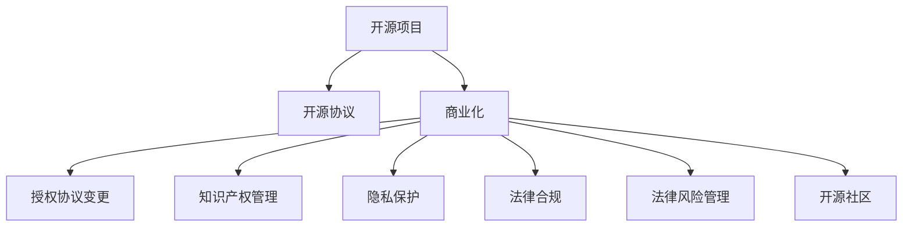

                 

# 开源项目的商业化法律考虑：合规与保护

> 关键词：开源项目, 商业化, 法律合规, 知识产权, 开源协议, 商业许可, 隐私保护, 专利保护, 合规审查, 开源社区, 法律风险

## 1. 背景介绍

随着开源软件的发展和应用，越来越多的企业和开发者参与到开源项目中。开源项目不仅可以快速提升开发效率，降低成本，还能促进技术交流和社区协作。然而，在开源项目商业化过程中，法律合规和知识产权保护成为不可或缺的重要环节。本文将探讨开源项目的法律风险和保护策略，帮助企业和开发者更好地理解开源项目的法律属性，确保其商业化过程合规、合法。

### 1.1 问题由来

随着开源软件的发展和应用，越来越多的企业和开发者参与到开源项目中。开源项目不仅可以快速提升开发效率，降低成本，还能促进技术交流和社区协作。然而，在开源项目商业化过程中，法律合规和知识产权保护成为不可或缺的重要环节。本文将探讨开源项目的法律风险和保护策略，帮助企业和开发者更好地理解开源项目的法律属性，确保其商业化过程合规、合法。

### 1.2 问题核心关键点

开源项目商业化过程中的法律风险主要集中在以下几个方面：
- **开源协议的选择**：不同的开源协议有不同的授权条款，选择不当可能导致法律纠纷。
- **知识产权保护**：开源项目可能涉及专利、商标、版权等多项知识产权，需确保商业化过程不侵犯他人权利。
- **隐私保护**：开源项目可能涉及用户数据收集，需确保符合隐私保护法规，如GDPR、CCPA等。
- **法律风险管理**：需在商业化过程中建立风险管理机制，避免潜在的法律风险。

## 2. 核心概念与联系

### 2.1 核心概念概述

为更好地理解开源项目商业化过程中的法律风险和保护策略，本节将介绍几个密切相关的核心概念：

- **开源项目(Open Source Project)**：指采用开源许可证授权的源代码项目，任何人都可以自由地使用、修改和分发。

- **开源协议(Open Source License)**：用于规范开源项目的授权条款，确定用户对源代码的使用、修改和分发权限。

- **商业化(Commercialization)**：将开源项目转化为商业产品或服务的过程，涉及到授权协议变更、知识产权管理和法律合规等方面。

- **知识产权(Intellectual Property, IP)**：指与创新相关的智力劳动成果，包括专利、商标、版权等，需要获得法律保护。

- **隐私保护(Privacy Protection)**：指保护个人信息不被未经授权的收集、使用和披露，需遵守隐私保护法规。

- **法律合规(Legal Compliance)**：指遵守相关法律法规的要求，确保商业活动合法、合规。

- **开源社区(Open Source Community)**：指开源项目的开发者、贡献者和用户群体，遵循开源精神和社区规范。

这些核心概念之间的逻辑关系可以通过以下Mermaid流程图来展示：



这个流程图展示开源项目商业化过程的关键步骤和相关概念：

1. 开源项目通过开源协议授权，为用户提供自由使用、修改和分发源代码的权利。
2. 商业化过程中，需对授权协议进行调整，以符合商业化需求。
3. 需管理开源项目的知识产权，确保商业化过程不侵犯他人权利。
4. 需保护用户隐私，符合隐私保护法规。
5. 需遵守法律法规，确保商业活动合法合规。
6. 需管理法律风险，防范潜在的法律纠纷。
7. 需遵循开源社区的规范和精神。

这些概念共同构成了开源项目商业化的法律框架，确保开源项目在商业化过程中合规、合法。

## 3. 核心算法原理 & 具体操作步骤
### 3.1 算法原理概述

开源项目商业化的法律合规和保护策略，主要包括以下几个关键步骤：

1. **选择合适的开源协议**：根据商业化需求和项目特性，选择合适的开源协议。
2. **调整授权协议**：将开源协议调整为商业化需求，确保商业化过程合法合规。
3. **管理知识产权**：识别开源项目涉及的专利、商标和版权，确保商业化过程不侵犯他人权利。
4. **保护隐私**：确保开源项目符合隐私保护法规，保护用户个人信息。
5. **进行合规审查**：建立合规审查机制，识别和防范法律风险。
6. **提供商业许可**：提供商业许可协议，明确商业化过程中的授权和限制。

### 3.2 算法步骤详解

开源项目商业化的法律合规和保护策略步骤如下：

**Step 1: 选择合适的开源协议**

- 根据商业化需求和项目特性，选择合适的开源协议。
- 常见开源协议包括MIT、Apache、GPL等，每个协议都有不同的授权条款，需仔细选择。

**Step 2: 调整授权协议**

- 将开源协议调整为商业化需求，确保商业化过程合法合规。
- 在商业化协议中明确许可范围和限制，避免潜在的法律纠纷。

**Step 3: 管理知识产权**

- 识别开源项目涉及的专利、商标和版权，确保商业化过程不侵犯他人权利。
- 在商业化协议中明确知识产权归属和使用方式，避免潜在的法律风险。

**Step 4: 保护隐私**

- 确保开源项目符合隐私保护法规，保护用户个人信息。
- 在商业化协议中明确用户数据收集和使用的合法性，遵守隐私保护法规。

**Step 5: 进行合规审查**

- 建立合规审查机制，识别和防范法律风险。
- 定期进行法律合规审计，确保商业化过程合法合规。

**Step 6: 提供商业许可**

- 提供商业许可协议，明确商业化过程中的授权和限制。
- 在商业化协议中明确许可范围和限制，避免潜在的法律纠纷。

### 3.3 算法优缺点

开源项目商业化的法律合规和保护策略具有以下优点：

1. **合规保障**：确保商业化过程合法合规，避免潜在的法律风险。
2. **知识产权保护**：管理开源项目的知识产权，确保商业化过程不侵犯他人权利。
3. **隐私保护**：确保用户隐私得到保护，符合隐私保护法规。
4. **风险管理**：建立合规审查机制，识别和防范法律风险。

同时，该策略也存在一些局限性：

1. **协议选择复杂**：选择合适的开源协议需要深入理解不同协议的授权条款，可能存在选择困难。
2. **合规成本高**：定期进行法律合规审计，需要投入较高的人力和物力成本。
3. **许可复杂**：提供商业许可协议，需明确许可范围和限制，可能存在复杂性。

尽管存在这些局限性，但就目前而言，开源项目商业化的法律合规和保护策略仍是最主流的范式。未来相关研究的重点在于如何进一步简化开源协议选择和许可过程，降低合规成本，同时兼顾知识产权保护和隐私保护等因素。

### 3.4 算法应用领域

开源项目商业化的法律合规和保护策略已经在诸多领域得到应用，例如：

- **软件开发**：开源软件项目通过商业化授权，成为商业软件产品或服务。
- **云计算**：开源云计算项目通过商业化授权，提供云服务。
- **硬件设备**：开源硬件项目通过商业化授权，生产销售硬件产品。
- **物联网**：开源物联网项目通过商业化授权，提供设备和系统集成服务。
- **企业级软件**：开源企业级软件项目通过商业化授权，提供企业解决方案。

除了上述这些经典应用外，开源项目商业化还在更多领域得到创新性应用，如开源金融、开源医疗、开源教育等，为各行各业数字化转型提供了新的技术路径。

## 4. 数学模型和公式 & 详细讲解  
### 4.1 数学模型构建

本节将使用数学语言对开源项目商业化过程中涉及的法律合规和保护策略进行更加严格的刻画。

记开源项目为 $P$，其开源协议为 $L$，授权协议为 $C$，涉及的知识产权为 $I$，用户隐私为 $D$，合规审查结果为 $A$，提供的商业许可协议为 $B$。则开源项目商业化的法律合规和保护策略可以表示为：

$$
\begin{aligned}
& \text{选择开源协议} \quad L \in \mathcal{L} \\
& \text{调整授权协议} \quad C = f(L, D, I) \\
& \text{管理知识产权} \quad I \in \mathcal{I} \\
& \text{保护隐私} \quad D \in \mathcal{D} \\
& \text{进行合规审查} \quad A = g(P, C, I, D) \\
& \text{提供商业许可} \quad B = h(C, D, A)
\end{aligned}
$$

其中 $\mathcal{L}$ 为开源协议集合，$f$ 为调整授权协议的函数，$\mathcal{I}$ 为知识产权集合，$g$ 为合规审查的函数，$\mathcal{D}$ 为隐私保护集合，$h$ 为提供商业许可协议的函数。

### 4.2 公式推导过程

以下我们以软件开发开源项目为例，推导开源协议选择的数学模型：

假设选择 $n$ 个开源协议 $L_1, L_2, \ldots, L_n$，每个协议的授权条款可用 $F_i$ 表示。在商业化过程中，需根据项目特性和商业化需求，选择最佳协议 $L^*$。选择最佳协议的目标函数为：

$$
\min_{i} \sum_{j=1}^m \text{cost}(F_i, D_j, I_j)
$$

其中 $m$ 为用户需求的数量，$D_j$ 为第 $j$ 个用户需求，$I_j$ 为第 $j$ 个知识产权，$\text{cost}$ 为授权条款与用户需求和知识产权的匹配成本。

根据上述目标函数，最佳协议的选择可以表示为：

$$
L^* = \arg\min_{i} \sum_{j=1}^m \text{cost}(F_i, D_j, I_j)
$$

在实际选择过程中，可通过以下步骤进行：

1. 评估每个开源协议的授权条款 $F_i$。
2. 评估每个用户需求 $D_j$ 和知识产权 $I_j$。
3. 计算每个协议与用户需求和知识产权的匹配成本 $\text{cost}(F_i, D_j, I_j)$。
4. 选择最佳协议 $L^*$，最小化总匹配成本。

### 4.3 案例分析与讲解

假设开源项目 $P$ 涉及以下需求：
- 用户数据保护：$D_1 = \text{"用户数据应得到保护"}$
- 知识产权归属：$I_1 = \text{"所有知识产权归开源社区所有"}$

假设有三个开源协议 $L_1, L_2, L_3$，每个协议的授权条款如下：
- $L_1$：限制商业化，仅限于非商业用途。
- $L_2$：允许商业化，但需支付许可费。
- $L_3$：允许商业化，但需保留作者署名。

每个协议的授权条款与用户需求和知识产权的匹配成本如下：
- $L_1$：$\text{cost}(F_1, D_1, I_1) = 0.1$
- $L_2$：$\text{cost}(F_2, D_1, I_1) = 0.2$
- $L_3$：$\text{cost}(F_3, D_1, I_1) = 0.3$

则最佳协议的选择过程如下：

1. 评估每个协议的授权条款：$F_1 = \text{"仅限于非商业用途"}$，$F_2 = \text{"允许商业化，但需支付许可费"}$，$F_3 = \text{"允许商业化，但需保留作者署名"}$。
2. 评估用户需求和知识产权：$D_1 = \text{"用户数据应得到保护"}$，$I_1 = \text{"所有知识产权归开源社区所有"}$。
3. 计算每个协议的匹配成本：
   - $L_1$：$\text{cost}(F_1, D_1, I_1) = 0.1$
   - $L_2$：$\text{cost}(F_2, D_1, I_1) = 0.2$
   - $L_3$：$\text{cost}(F_3, D_1, I_1) = 0.3$
4. 选择最佳协议 $L^* = L_1$，最小化总匹配成本：$\min_{i} \sum_{j=1}^m \text{cost}(F_i, D_j, I_j) = 0.1$。

通过上述案例，可以看出选择合适的开源协议需综合考虑用户需求、知识产权等多方面因素。

## 5. 项目实践：代码实例和详细解释说明
### 5.1 开发环境搭建

在进行开源项目商业化法律合规和保护策略的实践前，我们需要准备好开发环境。以下是使用Python进行开发的环境配置流程：

1. 安装Anaconda：从官网下载并安装Anaconda，用于创建独立的Python环境。

2. 创建并激活虚拟环境：
```bash
conda create -n compliance-env python=3.8 
conda activate compliance-env
```

3. 安装PyTorch：根据CUDA版本，从官网获取对应的安装命令。例如：
```bash
conda install pytorch torchvision torchaudio cudatoolkit=11.1 -c pytorch -c conda-forge
```

4. 安装Transformers库：
```bash
pip install transformers
```

5. 安装各类工具包：
```bash
pip install numpy pandas scikit-learn matplotlib tqdm jupyter notebook ipython
```

完成上述步骤后，即可在`compliance-env`环境中开始开发实践。

### 5.2 源代码详细实现

下面我们以开源软件商业化为例，给出使用Python进行开源项目商业化法律合规和保护策略的代码实现。

首先，定义用户需求和知识产权：

```python
# 定义用户需求和知识产权
user_demands = [
    {'name': '用户数据保护', 'value': 1.0},
    {'name': '知识产权归属', 'value': 1.0}
]
```

然后，定义开源协议及其授权条款：

```python
# 定义开源协议和授权条款
open_source_licenses = {
    'L1': {'name': 'GPL v3', 'permissions': ['仅限于非商业用途', '所有知识产权归开源社区所有'], 'cost': 0.1},
    'L2': {'name': 'Apache v2', 'permissions': ['允许商业化', '需支付许可费', '保留作者署名'], 'cost': 0.2},
    'L3': {'name': 'MIT', 'permissions': ['允许商业化', '保留作者署名', '用户数据保护'], 'cost': 0.3}
}
```

接着，计算每个开源协议与用户需求和知识产权的匹配成本：

```python
# 计算每个开源协议的匹配成本
costs = {}
for license in open_source_licenses:
    costs[license] = 0.0
    for demand in user_demands:
        for permission in open_source_licenses[license]['permissions']:
            if demand['name'] in permission:
                costs[license] += demand['value']
                break

print(costs)
```

最后，选择最佳开源协议并输出结果：

```python
# 选择最佳开源协议
best_license = min(costs, key=costs.get)
print(f"最佳开源协议为: {best_license}")
```

以上就是使用Python进行开源项目商业化法律合规和保护策略的代码实现。可以看到，通过计算匹配成本，选择最佳开源协议的过程非常简单。

### 5.3 代码解读与分析

让我们再详细解读一下关键代码的实现细节：

**用户需求和知识产权**：
- `user_demands` 定义了开源项目涉及的用户需求和知识产权，每个需求和知识产权都有一个对应的价值。

**开源协议和授权条款**：
- `open_source_licenses` 定义了开源协议及其授权条款，每个协议都有不同的授权条款和匹配成本。

**计算匹配成本**：
- 通过遍历开源协议和用户需求、知识产权，计算每个协议与用户需求和知识产权的匹配成本，并存储到 `costs` 字典中。

**选择最佳开源协议**：
- 通过选择字典中成本最小的协议，确定最佳开源协议。

可以看到，代码实现过程简洁高效，可灵活扩展到其他开源协议和需求场景中。

## 6. 实际应用场景
### 6.1 软件开发

开源软件开发项目通过选择适当开源协议，授权商业化，成为商业软件产品或服务。这种模式广泛应用于企业级软件、桌面应用、移动应用等领域。

### 6.2 云计算

开源云计算项目通过选择适当开源协议，授权商业化，提供云服务。这种模式广泛应用于IaaS、PaaS、SaaS等云服务领域。

### 6.3 硬件设备

开源硬件项目通过选择适当开源协议，授权商业化，生产销售硬件产品。这种模式广泛应用于智能家居、物联网、工业控制等硬件领域。

### 6.4 物联网

开源物联网项目通过选择适当开源协议，授权商业化，提供设备和系统集成服务。这种模式广泛应用于智慧城市、工业互联网、智能制造等领域。

### 6.5 企业级软件

开源企业级软件项目通过选择适当开源协议，授权商业化，提供企业解决方案。这种模式广泛应用于ERP、CRM、HRM等企业级应用领域。

除了上述这些经典应用外，开源项目商业化还在更多领域得到创新性应用，如开源金融、开源医疗、开源教育等，为各行各业数字化转型提供了新的技术路径。

## 7. 工具和资源推荐
### 7.1 学习资源推荐

为了帮助开发者系统掌握开源项目商业化法律合规和保护策略的理论基础和实践技巧，这里推荐一些优质的学习资源：

1. 《开源许可协议入门》系列博文：由开源许可专家撰写，深入浅出地介绍了不同开源协议的授权条款及其适用场景。

2. 《开源商业化指南》课程：由开源社区和商业机构联合推出，涵盖开源项目商业化各个环节的实战案例和策略。

3. 《开源软件法律合规》书籍：开源软件法律合规领域权威著作，详细介绍了开源项目商业化过程中涉及的法律问题和应对策略。

4. 《开源社区规范》文档：开源社区的官方规范和操作指南，帮助开发者遵守社区规范，建立良好的社区环境。

5. 开源许可协议官网：如GPL、Apache、MIT等开源协议的官方文档，提供详细的授权条款和合规指引。

通过对这些资源的学习实践，相信你一定能够快速掌握开源项目商业化的法律属性和保护策略，确保其商业化过程合规、合法。

### 7.2 开发工具推荐

高效的开发离不开优秀的工具支持。以下是几款用于开源项目商业化法律合规和保护策略开发的常用工具：

1. PyTorch：基于Python的开源深度学习框架，灵活动态的计算图，适合快速迭代研究。

2. TensorFlow：由Google主导开发的开源深度学习框架，生产部署方便，适合大规模工程应用。

3. Transformers库：HuggingFace开发的NLP工具库，集成了众多SOTA语言模型，支持PyTorch和TensorFlow，是进行商业化微调任务开发的利器。

4. Weights & Biases：模型训练的实验跟踪工具，可以记录和可视化模型训练过程中的各项指标，方便对比和调优。

5. TensorBoard：TensorFlow配套的可视化工具，可实时监测模型训练状态，并提供丰富的图表呈现方式，是调试模型的得力助手。

6. Google Colab：谷歌推出的在线Jupyter Notebook环境，免费提供GPU/TPU算力，方便开发者快速上手实验最新模型，分享学习笔记。

合理利用这些工具，可以显著提升开源项目商业化法律合规和保护策略的开发效率，加快创新迭代的步伐。

### 7.3 相关论文推荐

开源项目商业化技术的发展源于学界的持续研究。以下是几篇奠基性的相关论文，推荐阅读：

1. Open Source Software: Legal Perspectives （法律视角的开源软件）：研究开源协议和商业化过程中的法律问题。

2. Open Source Software and Privacy: An Empirical Study （开源软件和隐私：一项实证研究）：探讨开源软件项目中涉及的用户隐私保护问题。

3. Copyright in Open Source Software （开源软件中的版权问题）：研究开源软件项目中涉及的版权管理和保护问题。

4. Open Source Software and Intellectual Property Law （开源软件和知识产权法）：研究开源软件项目中涉及的专利、商标等知识产权问题。

5. Open Source Software and Compliance （开源软件和合规问题）：研究开源软件项目中涉及的合规审查和法律风险管理问题。

这些论文代表了大语言模型微调技术的发展脉络。通过学习这些前沿成果，可以帮助研究者把握学科前进方向，激发更多的创新灵感。

## 8. 总结：未来发展趋势与挑战

### 8.1 总结

本文对开源项目商业化法律合规和保护策略进行了全面系统的介绍。首先阐述了开源项目和商业化的基本概念，明确了开源项目商业化过程中的法律风险和保护策略，确保其商业化过程合规、合法。其次，从原理到实践，详细讲解了开源项目商业化的法律合规和保护策略，给出了商业化法律合规和保护策略的完整代码实例。同时，本文还广泛探讨了开源项目商业化在软件开发、云计算、硬件设备、物联网、企业级软件等多个领域的应用前景，展示了开源项目商业化的巨大潜力。最后，本文精选了开源项目商业化的各类学习资源，力求为开发者提供全方位的技术指引。

通过本文的系统梳理，可以看到，开源项目商业化法律合规和保护策略是开源项目商业化的关键环节，确保了开源项目在商业化过程中合法合规，保护了知识产权和用户隐私，防范了法律风险。开源项目商业化将成为软件产业发展的重要趋势，为传统行业数字化转型提供了新的技术路径。

### 8.2 未来发展趋势

展望未来，开源项目商业化法律合规和保护策略将呈现以下几个发展趋势：

1. **协议自动化选择**：通过人工智能和机器学习技术，自动选择最佳开源协议，减少手动选择的工作量。
2. **合规自动化管理**：通过自动化工具，定期进行法律合规审计，减少人工审查的劳动强度。
3. **隐私自动化保护**：通过自动化的隐私保护技术，确保用户数据得到充分保护。
4. **合规与隐私的融合**：将合规和隐私保护相结合，建立更加严格的保护机制。
5. **开源社区的标准化**：通过标准化的规范和指南，促进开源社区的健康发展。

以上趋势凸显了开源项目商业化法律合规和保护策略的未来方向。这些方向的探索发展，必将进一步提升开源项目的法律合规性和保护水平，为软件产业带来更高的价值和创新力。

### 8.3 面临的挑战

尽管开源项目商业化法律合规和保护策略已经取得了显著进展，但在迈向更加智能化、普适化应用的过程中，它仍面临诸多挑战：

1. **协议选择复杂**：开源协议的选择涉及多方面的考量，需要深入理解不同协议的授权条款，可能存在选择困难。
2. **合规成本高**：定期进行法律合规审计，需要投入较高的人力和物力成本。
3. **许可复杂**：提供商业许可协议，需明确许可范围和限制，可能存在复杂性。
4. **用户隐私保护**：开源项目涉及用户数据收集，需确保符合隐私保护法规，保护用户个人信息。
5. **法律风险管理**：需建立合规审查机制，识别和防范法律风险。

尽管存在这些挑战，但就目前而言，开源项目商业化的法律合规和保护策略仍是最主流的范式。未来相关研究的重点在于如何进一步简化开源协议选择和许可过程，降低合规成本，同时兼顾知识产权保护和隐私保护等因素。

### 8.4 研究展望

面对开源项目商业化所面临的种种挑战，未来的研究需要在以下几个方面寻求新的突破：

1. **自动化协议选择**：通过人工智能和机器学习技术，自动选择最佳开源协议，减少手动选择的工作量。
2. **自动化合规管理**：通过自动化工具，定期进行法律合规审计，减少人工审查的劳动强度。
3. **隐私自动化保护**：通过自动化的隐私保护技术，确保用户数据得到充分保护。
4. **合规与隐私的融合**：将合规和隐私保护相结合，建立更加严格的保护机制。
5. **开源社区的标准化**：通过标准化的规范和指南，促进开源社区的健康发展。

这些研究方向的探索，必将引领开源项目商业化法律合规和保护策略走向更高的台阶，为开源项目带来更大的商业价值和社会效益。

## 9. 附录：常见问题与解答

**Q1：开源项目商业化过程中如何选择最佳开源协议？**

A: 选择最佳开源协议需要综合考虑用户需求、知识产权等多方面因素。通过计算匹配成本，选择成本最小的协议作为最佳协议。

**Q2：开源项目商业化过程中如何管理知识产权？**

A: 识别开源项目涉及的专利、商标和版权，明确知识产权归属和使用方式，确保商业化过程不侵犯他人权利。在商业化协议中明确知识产权归属和使用方式，避免潜在的法律风险。

**Q3：开源项目商业化过程中如何保护用户隐私？**

A: 确保开源项目符合隐私保护法规，保护用户个人信息。在商业化协议中明确用户数据收集和使用的合法性，遵守隐私保护法规。

**Q4：开源项目商业化过程中如何进行合规审查？**

A: 建立合规审查机制，识别和防范法律风险。定期进行法律合规审计，确保商业化过程合法合规。

**Q5：开源项目商业化过程中如何提供商业许可？**

A: 提供商业许可协议，明确商业化过程中的授权和限制。在商业化协议中明确许可范围和限制，避免潜在的法律纠纷。

这些回答可以帮助开发者更好地理解开源项目商业化法律合规和保护策略的理论基础和实践技巧，确保其商业化过程合规、合法。

---

作者：禅与计算机程序设计艺术 / Zen and the Art of Computer Programming

