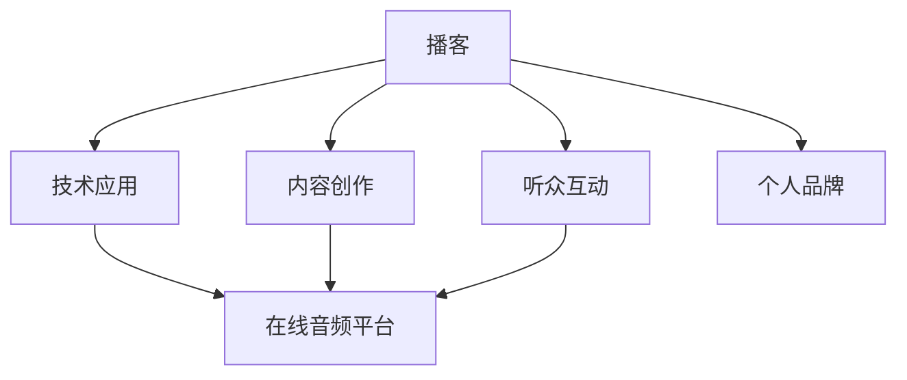

                 

# 开设播客节目：用声音传播你的思想

> 关键词：播客, 声音, 内容创作, 技术应用, 在线音频平台, 听众互动, 个人品牌

## 1. 背景介绍

在数字化时代，内容创作的方式多种多样，视频、图文、直播、播客等形式层出不穷。播客作为一种在线音频节目，因其独特的沉浸式体验和易于创作的特点，成为内容创作者展示思想、分享知识的重要平台。播客的普及不仅丰富了受众的信息获取渠道，还为内容创作者提供了全新的表达方式。

本文旨在探讨如何通过开设播客节目，利用声音这一古老而独特的媒介，传播作者的独到思想和专业知识。通过分析播客的核心概念和技术原理，提供详细的实践操作指南，展望未来发展趋势，并推荐相关的学习资源和工具，帮助广大内容创作者迈出播客制作之旅的第一步。

## 2. 核心概念与联系

### 2.1 核心概念概述

为更好地理解播客节目的开设与运营，本节将介绍几个核心概念：

- **播客(Podcast)**：一种以声音为主要载体的数字媒体，通常通过互联网发布，听众可以在任何时间、任何地点，通过播放设备收听。播客内容形式多样，包括访谈、讲座、新闻、故事等。

- **内容创作(Content Creation)**：指根据特定主题和受众需求，创作有价值、有深度的播客节目内容，包括选题、采访、录音、编辑等环节。内容创作是播客成功的关键。

- **技术应用(Technology Application)**：播客制作和发布过程中涉及多种技术，如音频编辑软件、在线音频平台、听众互动工具等。这些技术的应用，大大提高了播客制作和运营的效率和质量。

- **在线音频平台(Online Audio Platform)**：播客发布和分发的平台，如Spotify、Apple Podcasts、SoundCloud等。平台提供了播客的订阅、搜索、评分、评论等功能，吸引更多听众。

- **听众互动(Audience Engagement)**：播客制作者通过互动环节，如收听反馈、问答环节、社交媒体互动等，提升听众的参与感和黏性。

- **个人品牌(Personal Branding)**：播客节目是内容创作者个人品牌的展现，通过播客节目，创作者可以建立自己在特定领域的权威和影响力，吸引更多关注和支持。

这些概念之间的逻辑关系可以通过以下Mermaid流程图来展示：



这个流程图展示了一些播客节目的核心概念及其之间的关系：播客节目的开设和运营，涉及内容创作、技术应用、平台选择、听众互动和个人品牌建设等多个方面。

## 3. 核心算法原理 & 具体操作步骤
### 3.1 算法原理概述

开设播客节目，本质上是一个涉及内容创作、技术应用和市场运营的多维度任务。其核心思想是通过声音这一独特的媒介，结合创作和技术的力量，向目标受众传递有价值的信息和思想。

播客节目的开设可以分为以下几个关键步骤：

1. **选题和规划**：确定播客的主题、目标受众、发布频率和内容形式。
2. **内容创作**：根据选题，设计播客结构和内容框架，进行内容录制和后期编辑。
3. **技术实现**：选择合适的音频编辑软件和在线平台，完成播客的录制、编辑、发布和传播。
4. **市场推广**：通过社交媒体、邮件列表、合作推广等方式，吸引更多听众。

### 3.2 算法步骤详解

以下将详细介绍播客节目开设的详细步骤：

**Step 1: 选题和规划**
- 确定播客的主题和目标受众。选题应符合受众需求，具有实际价值和市场潜力。
- 规划播客的发布频率和内容形式。常见的播客形式包括访谈类、讲座类、新闻类、故事类等。
- 设计播客的结构和内容框架，确定每一集的主题和亮点。

**Step 2: 内容创作**
- 准备选题相关背景资料，进行深度调研和思考。
- 邀请嘉宾进行访谈或自行录制解说，确保内容有深度、有质量。
- 使用音频编辑软件进行录制、剪辑和后期处理，确保音质清晰、节奏紧凑。

**Step 3: 技术实现**
- 选择合适的音频编辑软件，如Audacity、Adobe Audition、GarageBand等，进行录制和编辑。
- 上传至在线音频平台，如Spotify、Apple Podcasts、SoundCloud等，选择合适的发布策略。
- 利用社交媒体、邮件列表、合作推广等方式，吸引更多听众。

**Step 4: 市场推广**
- 在各大社交平台（如Twitter、Facebook、Instagram等）宣传播客，吸引新听众。
- 利用邮件列表，定期发送播客更新信息，保持听众的关注和参与。
- 与其他播客、嘉宾和听众互动，建立良好的社区氛围。

### 3.3 算法优缺点

开设播客节目的优点：
- 形式灵活：播客不受时间、地点的限制，听众可以随时收听。
- 制作成本低：相比于视频、直播，播客的制作和编辑成本较低。
- 适合深度内容：播客内容可以深入探讨某个话题，不受画面和形式的限制。

播客节目的缺点：
- 互动性较差：相比于视频、直播，播客互动性较低。
- 声音易疲劳：长时间聆听同一内容，可能会感到听觉疲劳。
- 传播效果受限：播客的传播范围和影响力，相比视频、直播等形式，可能有限。

### 3.4 算法应用领域

播客节目作为一种独特的媒介形式，已经广泛应用于各个领域，包括但不限于：

- **教育和培训**：播客节目在教育领域有广泛应用，如英语学习、编程入门、职业培训等。
- **个人发展**：播客是个人品牌建设的重要工具，许多知名专家和意见领袖通过播客分享见解和知识。
- **创业和商业**：播客节目有助于创业者和企业家分享经验、讨论趋势，吸引更多的关注和合作。
- **文化娱乐**：播客节目丰富了文化娱乐形式，如电影评论、音乐鉴赏、文学赏析等。
- **社会公益**：播客节目在社会公益领域也有重要应用，如环境保护、心理健康等。

播客节目的应用范围广泛，几乎涵盖所有可以借助声音进行信息传递和知识分享的领域。

## 4. 数学模型和公式 & 详细讲解 & 举例说明

### 4.1 数学模型构建

播客节目的开设和运营，不涉及复杂的数学模型，但可以通过一些指标来评估和优化播客的表现。

**订阅率(Subscription Rate)**：衡量播客吸引听众的能力，可以通过平台提供的订阅人数来计算。

**播放量(Playback Count)**：衡量播客内容的影响力，可以通过平台提供的播放次数来计算。

**互动率(Engagement Rate)**：衡量听众对播客的参与度，可以通过评论、点赞、分享等互动数据来计算。

### 4.2 公式推导过程

**订阅率**：
设播客总订阅人数为$S$，总发布集数为$N$，则订阅率为：
$$
R = \frac{S}{N}
$$

**播放量**：
设播客总播放次数为$P$，总发布集数为$N$，则播放量为：
$$
W = \frac{P}{N}
$$

**互动率**：
设播客总互动次数为$I$，总发布集数为$N$，则互动率为：
$$
E = \frac{I}{N}
$$

### 4.3 案例分析与讲解

以一个访谈类播客节目为例，分析如何通过这些指标来评估和优化播客的表现。

假设一个访谈类播客节目，总发布集数为100集，其中60集有嘉宾访谈，40集为独立解说。通过分析以下数据：

- 总订阅人数为2000人。
- 总播放次数为100000次。
- 总互动次数为5000次。

可以计算得出：
- 订阅率$R = \frac{2000}{100} = 20$%
- 播放量$W = \frac{100000}{100} = 1000$次/集
- 互动率$E = \frac{5000}{100} = 50$次/集

根据这些指标，可以对播客的表现进行评估，并进行相应的优化调整，如改进选题、提升内容质量、增加互动环节等。

## 5. 项目实践：代码实例和详细解释说明
### 5.1 开发环境搭建

在进行播客节目开设和运营之前，需要先搭建好开发环境。以下是使用Python进行音频编辑和播客发布的环境配置流程：

1. 安装Python：从官网下载并安装Python，确保版本在3.7及以上，以支持音频处理库。
2. 安装音频编辑库：安装Audacity、Adobe Audition等音频编辑软件，或使用Python的音频处理库如Librosa、Pydub等。
3. 安装在线音频平台API：安装各大在线音频平台的API库，如Spotify API、Apple Podcasts API等，用于发布和获取播客数据。
4. 安装社交媒体库：安装Twitter、Facebook等社交媒体的API库，用于宣传和互动。

完成上述步骤后，即可在开发环境中进行播客的制作和发布。

### 5.2 源代码详细实现

以下是一个简单的Python脚本，用于录制、编辑和发布播客：

```python
import pydub
import soundfile as sf
import tweepy

# 录制音频
audio = pydub.AudioSegment.from_mic(min_duration=60)
audio.export('output.mp3', format='mp3')

# 编辑音频
new_audio = pydub.AudioSegment.from_wav('output.wav')
new_audio = new_audio.set_volume(0.8)
new_audio.export('output.wav', format='wav')

# 发布播客
auth = tweepy.OAuth1UserHandler(...)
client = tweepy.Client(auth)
client.share_media('output.wav', title='My Podcast Episode', description='This is my podcast episode.')
```

这个脚本首先使用Pydub库从麦克风录制一段音频，然后对其进行了音量调整，最后使用Tweepy库将音频发布到Twitter上。

### 5.3 代码解读与分析

让我们再详细解读一下关键代码的实现细节：

**录制音频**：
- 使用Pydub库从麦克风录制一段至少60秒的音频，保存为WAV格式。

**编辑音频**：
- 使用Pydub库加载录制的WAV文件，设置音量为0.8，然后保存为WAV格式。

**发布播客**：
- 使用Tweepy库进行Twitter API认证，然后调用分享媒体接口，将编辑后的音频上传并发布到Twitter。

**社交媒体库**：
- 使用Tweepy库进行Twitter API认证，调用分享媒体接口，发布音频文件。

这些代码展示了从录制到发布的基本流程，完整的播客制作需要更复杂的音频编辑和发布策略，但核心思想是一致的。

## 6. 实际应用场景
### 6.1 教育培训

播客节目在教育培训领域有广泛的应用，如英语学习、编程入门、职业培训等。通过播客节目，教师和专家可以深入浅出地讲解课程内容，传授知识和技能，帮助学习者更好地理解和学习。

在技术实现上，可以邀请知名教师、专家和行业从业者，录制相关主题的课程讲授或经验分享，并通过平台发布。听众可以通过订阅、收听、互动等方式，与讲师进行互动，提出问题，获取反馈。

### 6.2 个人发展

播客是个人品牌建设的重要工具，许多知名专家和意见领袖通过播客分享见解和知识，吸引更多的关注和支持。播客节目可以帮助个人建立自己在特定领域的权威和影响力，扩大自己的专业影响力。

在技术实现上，可以设计自己的播客节目，定期发布相关主题的内容，并通过社交媒体宣传和互动，吸引更多听众。通过播客节目，个人可以展示自己的专业知识和思想，建立长期的个人品牌影响力。

### 6.3 创业和商业

播客节目在创业和商业领域也有重要应用，如分享创业经验、讨论市场趋势、介绍新产品等。播客节目有助于创业者和企业家分享经验、讨论趋势，吸引更多的关注和合作。

在技术实现上，可以邀请创业者、投资者、行业专家等录制相关主题的内容，并通过平台发布。听众可以通过订阅、收听、互动等方式，获取行业动态和商业信息，建立良好的商业网络。

### 6.4 文化娱乐

播客节目丰富了文化娱乐形式，如电影评论、音乐鉴赏、文学赏析等。播客节目通过声音传达情感和美感，为文化娱乐提供新的视角和体验。

在技术实现上，可以邀请相关领域的专家和爱好者，录制相关主题的内容，并通过平台发布。听众可以通过订阅、收听、互动等方式，获取丰富的文化娱乐内容，增强自身的文化素养和审美水平。

### 6.5 社会公益

播客节目在社会公益领域也有重要应用，如环境保护、心理健康等。播客节目通过声音传递社会公益信息，呼吁公众关注和参与。

在技术实现上，可以邀请相关领域的专家和志愿者，录制相关主题的内容，并通过平台发布。听众可以通过订阅、收听、互动等方式，了解社会公益信息，参与相关活动，提升社会责任感。

## 7. 工具和资源推荐
### 7.1 学习资源推荐

为了帮助开发者系统掌握播客节目的开设与运营，这里推荐一些优质的学习资源：

1. **播客制作教程**：
   - Udemy平台上的播客制作教程，涵盖了播客的制作、编辑、发布和推广的各个环节。
   - Coursera平台上的播客制作课程，提供了系统的播客制作知识和技能。

2. **播客音频编辑软件**：
   - Audacity：免费的开源音频编辑软件，支持多轨编辑、效果处理等。
   - Adobe Audition：专业的音频编辑软件，支持高级音频处理和混合。

3. **播客发布平台API**：
   - Spotify API：Spotify官方提供的API，支持播客的发布、检索、订阅等功能。
   - Apple Podcasts API：Apple Podcasts官方提供的API，支持播客的发布、检索、订阅等功能。

4. **社交媒体工具**：
   - Twitter API：Twitter官方提供的API，支持社交媒体的发布、互动等功能。
   - Facebook API：Facebook官方提供的API，支持社交媒体的发布、互动等功能。

5. **播客内容创作工具**：
   - BuzzSumo：分析热门播客内容，了解受众需求和趋势。
   - Google Trends：跟踪关键词的搜索趋势，了解受众兴趣。

通过对这些资源的学习实践，相信你一定能够快速掌握播客节目的开设和运营的精髓，并用于解决实际的播客问题。

### 7.2 开发工具推荐

高效的播客制作离不开优秀的工具支持。以下是几款用于播客制作和运营的常用工具：

1. **音频编辑软件**：
   - Audacity：免费的开源音频编辑软件，支持多轨编辑、效果处理等。
   - Adobe Audition：专业的音频编辑软件，支持高级音频处理和混合。

2. **在线音频平台**：
   - Spotify：全球领先的在线音乐平台，支持播客的发布、订阅等功能。
   - Apple Podcasts：苹果公司提供的播客平台，支持播客的发布、订阅等功能。

3. **社交媒体工具**：
   - Twitter：全球领先的社交媒体平台，支持播客的宣传和互动。
   - Facebook：全球领先的社交媒体平台，支持播客的宣传和互动。

4. **播客内容创作工具**：
   - BuzzSumo：分析热门播客内容，了解受众需求和趋势。
   - Google Trends：跟踪关键词的搜索趋势，了解受众兴趣。

合理利用这些工具，可以显著提升播客制作的效率和效果，加快创新迭代的步伐。

### 7.3 相关论文推荐

播客节目的开设和运营涉及多个学科领域，以下几篇论文代表了这个领域的研究方向：

1. **播客内容分析**：
   - 《Podcast Content Analysis: A Systematic Review》：综述播客内容分析方法，提出未来研究方向。

2. **播客受众行为研究**：
   - 《Understanding Podcast Listeners: A Cross-Platform Analysis》：分析播客受众的行为模式和偏好。

3. **播客内容推荐系统**：
   - 《Personalized Podcast Recommendation Based on Multi-Dimensional Features》：提出基于多维度特征的播客推荐算法。

4. **播客音频质量评估**：
   - 《An Audio Quality Assessment System for Podcasts》：提出基于深度学习的播客音频质量评估方法。

这些论文代表了播客节目的开设和运营的研究方向，阅读这些论文可以更好地理解播客节目的技术原理和应用前景。

## 8. 总结：未来发展趋势与挑战

### 8.1 研究成果总结

本文对播客节目的开设和运营进行了全面系统的介绍。首先阐述了播客节目的背景和意义，明确了播客在内容创作、技术应用和市场运营等方面的核心概念。其次，从原理到实践，详细讲解了播客节目的开设和运营的关键步骤，提供了详细的实践操作指南。同时，本文还广泛探讨了播客节目在教育培训、个人发展、创业商业、文化娱乐和社会公益等多个领域的应用前景，展示了播客节目的广泛应用价值。最后，本文精选了播客节目的学习资源和工具，力求为开发者提供全方位的技术指引。

通过本文的系统梳理，可以看到，播客节目作为一种独特的媒介形式，已经广泛应用于各个领域，为内容创作者提供了全新的表达方式和传播渠道。随着技术的不断进步和受众需求的多样化，播客节目将在更多领域大放异彩，成为信息传播和知识共享的重要手段。

### 8.2 未来发展趋势

展望未来，播客节目的发展趋势主要体现在以下几个方面：

1. **技术创新**：播客制作和发布技术的不断进步，将提升播客节目的质量、效率和互动性。例如，人工智能在音频生成、内容推荐、互动分析等方面的应用，将进一步增强播客节目的吸引力。

2. **内容多样化**：播客节目将涵盖更多元、更深入的内容领域，如科技、医学、艺术等。播客内容的丰富化和细分化，将满足更多受众的需求和兴趣。

3. **全球化传播**：播客节目将打破地域限制，实现全球范围内的传播和互动。播客平台的多样化和国际化的推广，将吸引更多国际受众。

4. **用户个性化**：播客节目将更加注重用户个性化推荐和互动体验。通过分析用户行为和偏好，提供个性化的播客内容，增强用户黏性和满意度。

5. **社交媒体融合**：播客节目将更加注重社交媒体的融合和互动。通过社交媒体平台宣传和推广，吸引更多听众，建立良好的社区氛围。

6. **商业化运营**：播客节目将探索更多商业化的运营模式，如会员订阅、付费内容、广告投放等，实现播客内容的商业价值最大化。

这些趋势凸显了播客节目的广阔前景，未来将有更多创新性的应用和技术探索，推动播客节目的进一步发展。

### 8.3 面临的挑战

尽管播客节目在各个领域取得了一定的成果，但仍面临一些挑战：

1. **内容同质化**：播客节目的内容同质化问题，导致部分听众选择疲劳，需要更多高质量、有深度的原创内容。

2. **互动性不足**：相比于视频、直播，播客节目的互动性较低，难以满足听众的多样化需求。

3. **音频质量参差不齐**：部分播客节目的音频质量存在问题，影响听众的收听体验。

4. **版权和法律风险**：播客节目中涉及大量原创和第三方内容，版权和法律问题需得到充分重视。

5. **市场竞争激烈**：播客市场的竞争日益激烈，内容创作者需不断创新和优化，才能在市场中脱颖而出。

6. **商业化难度大**：播客节目在商业化过程中面临诸多挑战，如何平衡内容和商业，实现良性循环，仍需深入探索。

### 8.4 研究展望

面对播客节目面临的挑战，未来的研究需要在以下几个方面寻求新的突破：

1. **内容创新**：探索更多元、更深入的内容形式和题材，满足受众多样化的需求。

2. **技术提升**：通过人工智能技术提升播客节目的质量、效率和互动性。

3. **版权保护**：建立完善的版权保护机制，确保播客节目的合法性和安全性。

4. **市场开拓**：探索新的市场模式和运营策略，实现播客节目的商业化发展。

5. **社交媒体融合**：加强社交媒体的融合和互动，提升播客节目的用户黏性和社区氛围。

6. **国际化推广**：加强播客节目的国际化和全球化推广，吸引更多国际受众。

这些研究方向将引领播客节目迈向更高的台阶，为内容创作者提供更多的创新灵感和应用场景，推动播客节目在更多领域的发展和应用。

## 9. 附录：常见问题与解答

**Q1: 播客节目如何吸引听众？**

A: 播客节目吸引听众的关键在于提供有价值、有深度的内容。可以采取以下措施：

1. **选题策划**：选择受众感兴趣的主题，进行深入探讨。
2. **嘉宾邀请**：邀请知名专家、行业从业者等录制内容，增强节目的权威性和吸引力。
3. **互动环节**：通过提问、评论、社交媒体互动等方式，增加听众的参与感和黏性。
4. **定期更新**：保持播客内容的持续更新，满足听众的期待和需求。

**Q2: 播客制作中需要注意哪些技术问题？**

A: 播客制作中需要注意以下技术问题：

1. **音频质量**：确保录制的音频质量清晰、无杂音。
2. **剪辑和混音**：进行合理的剪辑和混音，保证音频的流畅性和可听性。
3. **版权问题**：避免使用未授权的音乐和声音素材，确保内容的合法性。
4. **平台适配**：确保播客在各大平台上的适配性和兼容性。

**Q3: 播客节目的商业化策略有哪些？**

A: 播客节目的商业化策略包括：

1. **会员订阅**：通过付费会员制度，获取稳定的收入来源。
2. **广告投放**：与品牌商合作，在播客节目中插入广告。
3. **赞助和合作**：通过赞助和合作，获取更多的资源支持。
4. **付费内容**：提供专属的付费内容，增强用户黏性和满意度。

**Q4: 如何衡量播客节目的效果？**

A: 播客节目的效果可以通过以下指标衡量：

1. **订阅率**：衡量播客吸引听众的能力。
2. **播放量**：衡量播客内容的影响力。
3. **互动率**：衡量听众对播客的参与度。
4. **用户留存率**：衡量播客受众的忠诚度和持久性。

通过这些指标的分析和优化，可以不断提升播客节目的质量和用户满意度。

---

作者：禅与计算机程序设计艺术 / Zen and the Art of Computer Programming

