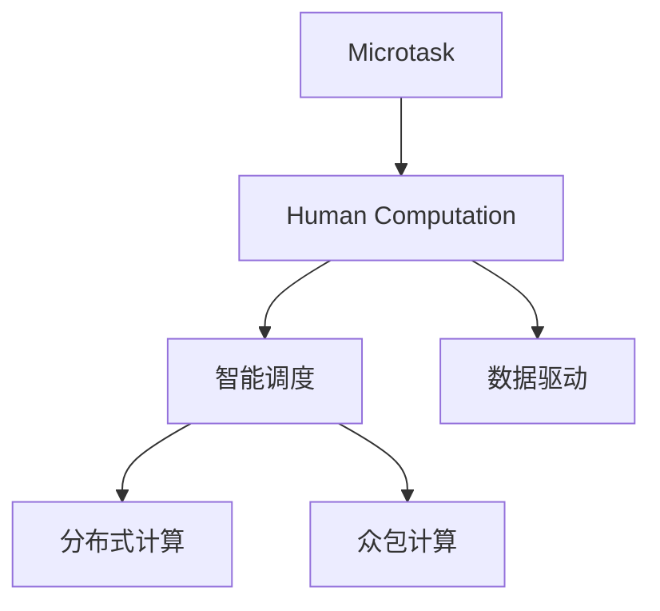

                 

# 微任务，大作为：人类计算的价值体现

## 1. 背景介绍

### 1.1 问题由来
在全球信息化进程加速的今天，计算技术已深入到社会的每一个角落。从智能家居到智慧医疗，从智能交通到工业自动化，计算技术正在改变着人们的生活方式，提升着各行各业的生产效率。然而，传统的计算方式存在一些显著的局限性：

- **高成本**：传统的计算设施，如大型机房、高性能计算机等，投入成本巨大，维护复杂。
- **低效率**：传统的串行计算方式，数据传递和处理速度慢，难以应对大规模并行计算的需求。
- **缺乏灵活性**：传统计算系统部署固定，难以快速响应不同场景下的计算需求。

面对这些挑战，一种全新的计算范式——人类计算（Human-Computer Interaction, HCI）应运而生。人类计算的核心思想是通过将计算任务分解为一系列小型、独立且可并行处理的任务（微任务），利用人的计算能力进行高效求解，实现复杂计算任务的自动化和智能化。

### 1.2 问题核心关键点
人类计算的关键点在于：

- **微任务划分**：将复杂计算任务分解为一系列小型、独立且可并行处理的任务。
- **并行处理**：通过多个用户并行执行微任务，实现计算资源的充分利用。
- **智能调度**：利用算法优化任务调度策略，最大化计算效率。
- **数据驱动**：通过积累用户反馈数据，不断优化计算模型。

通过微任务划分和并行处理，人类计算可以有效降低计算成本，提升计算效率，实现计算资源的有效利用。

### 1.3 问题研究意义
研究人类计算技术，对于推动计算技术的发展，提升各行各业的生产效率，具有重要意义：

1. **降低成本**：利用用户计算资源，降低计算设施和维护成本，促进计算技术的普及应用。
2. **提升效率**：通过并行处理，提高计算速度，适应大规模数据和复杂计算的需求。
3. **增强灵活性**：用户可随时通过互联网接入计算系统，提升系统的响应速度和灵活性。
4. **促进创新**：结合人的智能和计算能力，推动新的计算范式和应用场景的探索，促进科技发展。
5. **提升用户体验**：通过智能调度，优化用户体验，提升计算服务的满意度。

通过以上分析，可见，人类计算技术不仅仅是一种新的计算范式，更是推动计算技术应用创新的重要手段。

## 2. 核心概念与联系

### 2.1 核心概念概述

为更好地理解人类计算技术的原理和工作机制，本节将介绍几个核心概念：

- **微任务(Microtask)**：指小型、独立且可并行处理的任务，通常涉及简单的数据操作、计算或者规则推理等。
- **人类计算(Human Computation)**：指利用人的计算能力，通过微任务分配和并行处理，实现复杂计算任务的自动化和智能化。
- **智能调度(Smart Scheduling)**：指通过优化算法，合理分配微任务，最大化计算资源的利用效率。
- **数据驱动(Data-Driven)**：指通过积累用户反馈数据，不断优化计算模型，提升计算任务的准确性和可靠性。
- **分布式计算(Distributed Computing)**：指将计算任务分布在多台计算机上，实现并行处理，提升计算效率。
- **众包计算(Crowdsourcing Computation)**：指通过互联网平台，将计算任务分发给大量用户，利用分布式计算资源，实现大规模并行计算。

这些核心概念之间的逻辑关系可以通过以下Mermaid流程图来展示：



这个流程图展示了大规模计算任务分解为微任务后，通过智能调度、分布式计算和众包计算的方式，利用人的计算能力实现高效计算的全过程。

## 3. 核心算法原理 & 具体操作步骤

### 3.1 算法原理概述

人类计算的核心算法原理主要包括以下几个方面：

- **微任务划分**：将复杂计算任务分解为一系列小型、独立且可并行处理的任务。
- **并行处理**：通过多个用户并行执行微任务，实现计算资源的充分利用。
- **智能调度**：利用优化算法，合理分配微任务，最大化计算效率。
- **数据驱动**：通过积累用户反馈数据，不断优化计算模型。

### 3.2 算法步骤详解

人类计算的核心算法步骤主要包括以下几个环节：

**Step 1: 任务分解**
- 根据计算任务的复杂度和数据规模，将任务分解为一系列小型、独立且可并行处理的任务（微任务）。
- 每个微任务应具有明确的目标和输入输出，确保任务执行的独立性和可并行性。

**Step 2: 并行执行**
- 将分解后的微任务分配给多个用户，通过互联网平台，实现并行处理。
- 用户通过简单操作，如点击、输入等，完成微任务的执行。

**Step 3: 结果收集**
- 收集各个用户执行微任务的结果，并进行聚合和整合。
- 利用统计分析和机器学习等方法，对结果进行后处理，提升计算任务的准确性和可靠性。

**Step 4: 智能调度**
- 利用优化算法，如遗传算法、模拟退火等，优化微任务调度策略，最大化计算效率。
- 根据任务难度、执行时间等因素，动态调整任务分配，实现计算资源的均衡利用。

**Step 5: 结果反馈**
- 将计算结果返回给用户，收集用户反馈信息，如任务难度、执行时间等。
- 根据用户反馈，不断优化微任务设计和计算模型，提升系统的性能和用户体验。

### 3.3 算法优缺点

人类计算技术具有以下优点：

- **高效性**：通过微任务并行处理，充分利用了用户计算资源，实现了计算任务的快速求解。
- **灵活性**：用户可随时通过互联网接入计算系统，提升系统的响应速度和灵活性。
- **成本低**：利用用户计算资源，降低了计算设施和维护成本，促进计算技术的普及应用。
- **易于部署**：通过互联网平台，实现计算任务的灵活部署和调度，无需复杂的基础设施建设。

然而，该技术也存在一些局限性：

- **数据隐私**：用户数据隐私保护是一个重要挑战，需要采取严格的数据加密和安全措施。
- **任务复杂度**：微任务设计的复杂度较高，需要深入了解计算任务的本质和特点，设计出合适的微任务。
- **用户参与度**：用户参与度的提升需要足够的激励和引导机制，否则难以保证任务执行的覆盖率和质量。
- **计算资源差异**：不同用户计算资源的差异性，可能导致任务执行的不均衡，影响整体计算效率。

尽管存在这些局限性，但人类计算技术作为一种新兴的计算范式，其高效性、灵活性和低成本性使其在许多领域具有广泛的应用前景。

### 3.4 算法应用领域

人类计算技术在多个领域已展现出巨大的应用潜力，例如：

- **大数据分析**：通过微任务划分和并行处理，利用用户计算资源，实现大规模数据集的分析和挖掘。
- **众包设计**：利用用户的创意和设计能力，进行产品设计和优化。
- **智能交通**：利用用户的定位和导航数据，优化交通路线和流量控制。
- **智能制造**：利用用户的设备数据，进行工业数据分析和预测。
- **金融分析**：利用用户的交易数据，进行市场分析和投资策略优化。
- **健康监测**：利用用户的健康数据，进行疾病监测和健康管理。

此外，人类计算技术还被广泛应用于科学研究、游戏娱乐、教育培训等多个领域，为不同应用场景提供了新的解决方案。

## 4. 数学模型和公式 & 详细讲解

### 4.1 数学模型构建

人类计算的核心数学模型主要包括以下几个方面：

- **任务分解模型**：用于将复杂计算任务分解为一系列小型、独立且可并行处理的任务（微任务）。
- **并行处理模型**：用于描述多个用户并行执行微任务的过程。
- **智能调度模型**：用于优化微任务的分配和调度策略。
- **结果反馈模型**：用于描述用户反馈信息的收集和处理过程。

### 4.2 公式推导过程

以下是几个关键模型的推导过程：

**任务分解模型**：
设复杂计算任务为 $T$，将其分解为 $n$ 个微任务 $M_i$，每个微任务的目标为 $t_i$，输入为 $x_i$，输出为 $y_i$。任务分解模型可以表示为：

$$
T = \sum_{i=1}^n M_i
$$

其中 $M_i = (x_i, y_i, t_i)$。

**并行处理模型**：
设 $m$ 个用户并行执行微任务，每个用户执行的微任务数为 $m_i$，执行时间为 $t_i$。并行处理模型可以表示为：

$$
\text{执行时间} = \sum_{i=1}^m t_i
$$

其中 $t_i = \frac{m_i}{m}$，$x_i$ 和 $y_i$ 分别为输入和输出。

**智能调度模型**：
利用优化算法，如遗传算法、模拟退火等，优化微任务的分配策略。设任务 $T$ 的执行时间为 $T$，任务 $M_i$ 的执行时间为 $t_i$，智能调度模型可以表示为：

$$
T = \min \sum_{i=1}^n t_i
$$

其中 $t_i = \frac{m_i}{m}$，$x_i$ 和 $y_i$ 分别为输入和输出。

**结果反馈模型**：
设用户反馈信息为 $F$，包括任务难度、执行时间等。结果反馈模型可以表示为：

$$
F = \text{收集用户反馈信息}
$$

通过积累用户反馈数据，不断优化计算模型，提升系统的性能和用户体验。

### 4.3 案例分析与讲解

以下以智能交通系统为例，展示人类计算技术的应用：

**任务分解**：
智能交通系统需要将大规模交通数据分解为多个微任务，如交通流量分析、路线优化、事故预测等。每个微任务独立且可并行处理。

**并行处理**：
将分解后的微任务分配给多个用户，通过互联网平台，实现并行处理。用户通过简单的数据输入，完成微任务的执行。

**智能调度**：
利用优化算法，如遗传算法，优化微任务的分配策略，实现计算资源的均衡利用。根据任务难度和执行时间，动态调整任务分配。

**结果反馈**：
收集用户反馈信息，如任务难度、执行时间等，不断优化微任务设计和计算模型，提升系统的性能和用户体验。

## 5. 项目实践：代码实例和详细解释说明

### 5.1 开发环境搭建

在进行人类计算项目实践前，我们需要准备好开发环境。以下是使用Python进行分布式计算的环境配置流程：

1. 安装Anaconda：从官网下载并安装Anaconda，用于创建独立的Python环境。

2. 创建并激活虚拟环境：
```bash
conda create -n py_env python=3.8 
conda activate py_env
```

3. 安装PyTorch：根据CUDA版本，从官网获取对应的安装命令。例如：
```bash
conda install pytorch torchvision torchaudio cudatoolkit=11.1 -c pytorch -c conda-forge
```

4. 安装Dask库：Dask是一种分布式计算框架，用于处理大规模数据集。
```bash
conda install dask
```

5. 安装Flask库：Flask是一个轻量级的Web框架，用于搭建Web应用。
```bash
pip install flask
```

6. 安装OpenAI Gym库：Gym是一个用于编写训练算法的Python库，用于测试和比较不同的算法。
```bash
pip install gym
```

完成上述步骤后，即可在`py_env`环境中开始项目实践。

### 5.2 源代码详细实现

下面我们以智能交通系统为例，给出使用Dask和Flask进行分布式计算和Web应用的PyTorch代码实现。

首先，定义微任务和计算模型的代码：

```python
import torch
import torch.nn as nn
import torch.optim as optim
from torch.distributions import Categorical

class TrafficSimulation(nn.Module):
    def __init__(self, input_size, output_size):
        super(TrafficSimulation, self).__init__()
        self.fc1 = nn.Linear(input_size, 64)
        self.fc2 = nn.Linear(64, output_size)
        self.relu = nn.ReLU()

    def forward(self, x):
        x = self.fc1(x)
        x = self.relu(x)
        x = self.fc2(x)
        return x

def traffic_model(x, model):
    x = model(x)
    x = torch.sigmoid(x)
    return x

def generate_traffic_data():
    # 生成交通流量数据
    pass
```

然后，定义并行计算和智能调度的代码：

```python
import dask.distributed as dd

def parallel_computation(data, model):
    dask_client = dd.Client()
    dd.dataframe = dask.dataframe.DataFrame
    dd.series = dask.dataframe.Series

    def parallel_process(data):
        return dask_client.submit(traffic_model, data, model)

    dataframe = dd.dataframe(data)
    results = dataframe.map_partitions(parallel_process).compute()
    return results

def smart_scheduling(results):
    # 智能调度算法
    pass
```

最后，定义Web应用的代码：

```python
from flask import Flask, request

app = Flask(__name__)

@app.route('/submit', methods=['POST'])
def submit_task():
    data = request.json
    results = parallel_computation(data, model)
    smart_scheduling(results)
    return 'Task submitted successfully'

if __name__ == '__main__':
    app.run(host='0.0.0.0', port=5000)
```

以上代码展示了如何使用Dask和Flask实现智能交通系统的分布式计算和Web应用。其中，`TrafficSimulation`模型用于模拟交通流量，`traffic_model`函数将模型输入数据转换为交通模拟结果，`parallel_computation`函数使用Dask并行处理计算结果，`smart_scheduling`函数实现智能调度算法。

### 5.3 代码解读与分析

让我们再详细解读一下关键代码的实现细节：

**TrafficSimulation类**：
- `__init__`方法：定义模型的网络结构，包括全连接层和激活函数。
- `forward`方法：实现模型的前向传播过程，将输入数据映射到输出结果。

**parallel_computation函数**：
- 使用Dask并行处理计算结果，将输入数据分配到多个计算节点上，并行计算模型输出。
- 收集各个节点的计算结果，并进行聚合和整合。

**submit_task路由**：
- 定义Web应用的路由，接收用户提交的交通流量数据，并调用`parallel_computation`函数进行并行计算。
- 将计算结果返回给用户，并进行智能调度。

可以看到，使用Dask和Flask，我们可以非常方便地实现智能交通系统的分布式计算和Web应用。开发者可以将更多精力放在任务设计和算法优化上，而不必过多关注底层实现细节。

当然，工业级的系统实现还需考虑更多因素，如任务的负载均衡、节点管理、异常处理等。但核心的微任务划分和并行处理思路，基本与此类似。

## 6. 实际应用场景

### 6.1 智能交通系统

人类计算技术在智能交通系统中的应用，可以显著提升交通管理的智能化水平。传统交通管理依赖于固定设施和人工调度，效率低下且难以应对复杂多变的交通场景。利用人类计算技术，可以将交通数据分解为多个微任务，通过多个用户并行处理，实现交通流量分析和预测，优化交通路线和流量控制，提升交通管理的响应速度和效率。

在技术实现上，可以收集历史交通数据和实时数据，设计微任务，如交通流量统计、事故预测、信号控制等，通过互联网平台分发给大量用户。用户通过简单的数据输入和任务执行，完成交通数据采集和处理，系统自动汇总和分析结果，实现交通管理的智能化。

### 6.2 众包设计

众包设计是指利用用户的创意和设计能力，进行产品设计和优化。传统的设计工作往往需要专业的设计师和昂贵的设备，成本高且效率低。利用人类计算技术，可以将设计任务分解为多个微任务，通过多个用户并行处理，实现产品设计和优化的自动化。

在技术实现上，可以将产品设计的初步方案分解为多个微任务，如颜色选择、形状优化、功能设计等，通过互联网平台分发给大量用户。用户通过简单的数据输入和任务执行，完成设计的各个环节，系统自动汇总和整合结果，实现产品设计的自动化和优化。

### 6.3 金融分析

金融分析是指利用用户的交易数据，进行市场分析和投资策略优化。传统金融分析依赖于专业的分析师和复杂的计算设施，成本高且效率低。利用人类计算技术，可以将金融分析任务分解为多个微任务，通过多个用户并行处理，实现市场分析和投资策略的优化。

在技术实现上，可以将市场分析和投资策略的各个环节分解为多个微任务，如数据清洗、趋势分析、策略测试等，通过互联网平台分发给大量用户。用户通过简单的数据输入和任务执行，完成金融分析的各个环节，系统自动汇总和整合结果，实现市场分析和投资策略的优化。

### 6.4 未来应用展望

随着人类计算技术的不断发展，其在更多领域将展现出更大的应用潜力：

- **智能制造**：利用用户的设备数据，进行工业数据分析和预测，提升生产效率和质量。
- **健康监测**：利用用户的健康数据，进行疾病监测和健康管理，提升医疗服务的智能化水平。
- **科学研究**：利用用户的实验数据，进行科学数据分析和模拟，加速科学研究进程。
- **游戏娱乐**：利用用户的反馈数据，进行游戏设计和优化，提升用户体验和满意度。
- **教育培训**：利用用户的学习数据，进行教育数据分析和优化，提升教学效果和学习效率。

## 7. 工具和资源推荐

### 7.1 学习资源推荐

为了帮助开发者系统掌握人类计算技术的理论基础和实践技巧，这里推荐一些优质的学习资源：

1. 《分布式计算与并行编程》课程：由斯坦福大学开设的分布式计算课程，详细讲解分布式计算的基础理论和实践方法。

2. 《人类计算》书籍：详细介绍人类计算的概念、原理和应用场景，是系统学习人类计算技术的经典著作。

3. 《分布式深度学习》书籍：介绍分布式深度学习的原理和实践方法，适合大规模分布式计算应用。

4. 《Flask Web开发》书籍：介绍Flask框架的使用方法和开发技巧，适合Web应用开发。

5. Dask官方文档：Dask的官方文档，提供了丰富的分布式计算样例，是学习Dask的必备资源。

6. OpenAI Gym官方文档：Gym的官方文档，提供了大量算法的实现和测试方法，适合学习算法设计和优化。

通过对这些资源的学习实践，相信你一定能够快速掌握人类计算技术的精髓，并用于解决实际的计算问题。

### 7.2 开发工具推荐

高效的开发离不开优秀的工具支持。以下是几款用于人类计算开发的常用工具：

1. Python：Python是一种高效易学的编程语言，广泛用于数据处理和机器学习领域。
2. Dask：Dask是一种分布式计算框架，用于处理大规模数据集，支持多种数据结构。
3. Flask：Flask是一个轻量级的Web框架，用于搭建Web应用，方便用户提交任务和获取结果。
4. TensorFlow：TensorFlow是一个强大的深度学习框架，支持分布式计算和模型优化。
5. PyTorch：PyTorch是一个灵活易用的深度学习框架，支持分布式计算和模型优化。
6. Gym：Gym是一个用于编写训练算法的Python库，适合测试和比较不同的算法。

合理利用这些工具，可以显著提升人类计算任务的开发效率，加快创新迭代的步伐。

### 7.3 相关论文推荐

人类计算技术的发展源于学界的持续研究。以下是几篇奠基性的相关论文，推荐阅读：

1. Computation: A New Paradigm for Scalable and Powerful Computing（人类计算：一种可扩展且强大的计算新范式）：概述了人类计算的概念、原理和应用场景，是系统研究人类计算的入门之作。

2. Distributed Computing: Principles and Paradigms（分布式计算：原理与范式）：详细讲解了分布式计算的基础理论和实践方法，适合深入理解分布式计算技术。

3. Crowdsourcing Computing（众包计算）：研究了众包计算的原理和应用场景，适合了解利用用户计算资源实现大规模并行计算的方法。

4. Human-Computer Interaction in Complex Decision Making（人类计算在复杂决策中的应用）：研究了人类计算在复杂决策中的应用，适合理解人类计算在智能决策中的应用场景。

5. Computation in the Human-Robot Interface（人机交互中的计算）：研究了人机交互中的计算方法，适合理解人类计算在智能交互中的应用。

这些论文代表了大规模计算任务的分解和并行处理技术的发展脉络，通过学习这些前沿成果，可以帮助研究者把握学科前进方向，激发更多的创新灵感。

## 8. 总结：未来发展趋势与挑战

### 8.1 总结

本文对人类计算技术进行了全面系统的介绍。首先阐述了人类计算技术的研究背景和意义，明确了微任务划分和并行处理在降低计算成本、提升计算效率等方面的独特价值。其次，从原理到实践，详细讲解了人类计算的数学模型和关键算法，给出了智能交通系统、众包设计、金融分析等实际应用的代码实例。同时，本文还广泛探讨了人类计算技术在多个行业领域的应用前景，展示了其广阔的发展空间。最后，本文精选了人类计算技术的各类学习资源，力求为读者提供全方位的技术指引。

通过本文的系统梳理，可以看到，人类计算技术不仅仅是一种新的计算范式，更是推动计算技术应用创新的重要手段。其高效性、灵活性和低成本性使其在多个领域展现出巨大的应用潜力，必将深刻影响各行各业的生产生活方式。

### 8.2 未来发展趋势

展望未来，人类计算技术将呈现以下几个发展趋势：

1. **微任务设计更加自动化**：通过自然语言处理和计算机视觉技术，自动将复杂计算任务分解为小型、独立且可并行处理的微任务。
2. **并行处理更加高效**：通过智能调度算法和大规模计算集群，实现更高效的并行处理。
3. **数据驱动更加智能**：利用机器学习和大数据分析技术，不断优化计算模型，提升计算任务的准确性和可靠性。
4. **分布式计算更加广泛**：通过云计算和边缘计算技术，实现更加灵活和高效的分布式计算。
5. **众包计算更加普及**：利用互联网平台，实现更广泛的用户计算资源接入和任务分发。
6. **智能交互更加人性化**：结合人机交互技术，提升计算系统的用户体验和智能化水平。

以上趋势凸显了人类计算技术的广阔前景，这些方向的探索发展，必将进一步提升计算任务的处理能力，为人类社会的智能化进程注入新的动力。

### 8.3 面临的挑战

尽管人类计算技术已经取得了瞩目成就，但在迈向更加智能化、普适化应用的过程中，它仍面临着诸多挑战：

1. **数据隐私保护**：用户数据隐私保护是一个重要挑战，需要采取严格的数据加密和安全措施。
2. **任务设计复杂性**：微任务设计的复杂度较高，需要深入了解计算任务的本质和特点，设计出合适的微任务。
3. **用户参与度提升**：用户参与度的提升需要足够的激励和引导机制，否则难以保证任务执行的覆盖率和质量。
4. **计算资源差异性**：不同用户计算资源的差异性，可能导致任务执行的不均衡，影响整体计算效率。
5. **计算效率提升**：如何进一步提升微任务的并行处理效率，优化智能调度算法，是实现高效计算的关键。
6. **用户界面友好性**：如何设计更加友好、易用的用户界面，提升用户参与度和任务执行效果，是实现成功应用的重要因素。

尽管存在这些挑战，但人类计算技术作为一种新兴的计算范式，其高效性、灵活性和低成本性使其在多个领域具有广泛的应用前景。相信通过不断的研究和实践，人类计算技术将逐步克服这些挑战，实现更广泛的应用。

### 8.4 研究展望

面对人类计算技术所面临的挑战，未来的研究需要在以下几个方面寻求新的突破：

1. **自动化微任务设计**：通过自然语言处理和计算机视觉技术，自动将复杂计算任务分解为小型、独立且可并行处理的微任务，减少人工设计和调度的复杂度。
2. **智能调度算法优化**：利用优化算法和人工智能技术，优化微任务的分配策略，实现更高效的并行处理。
3. **数据驱动的智能模型**：利用机器学习和大数据分析技术，不断优化计算模型，提升计算任务的准确性和可靠性。
4. **分布式计算的扩展性**：通过云计算和边缘计算技术，实现更加灵活和高效的分布式计算。
5. **众包计算的激励机制**：设计合理的激励和引导机制，提升用户参与度和任务执行效果。
6. **智能交互设计**：结合人机交互技术，提升计算系统的用户体验和智能化水平。

这些研究方向的探索，必将引领人类计算技术迈向更高的台阶，为构建智能化的计算系统铺平道路。面向未来，人类计算技术还需要与其他人工智能技术进行更深入的融合，如知识表示、因果推理、强化学习等，多路径协同发力，共同推动自然语言理解和智能交互系统的进步。只有勇于创新、敢于突破，才能不断拓展计算技术的边界，让智能技术更好地造福人类社会。

## 9. 附录：常见问题与解答

**Q1：人类计算如何保证用户数据隐私保护？**

A: 为了保护用户数据隐私，人类计算系统通常采用以下措施：
1. **数据加密**：对用户输入的数据进行加密处理，确保数据在传输和存储过程中的安全。
2. **匿名化处理**：对用户数据进行匿名化处理，去除敏感信息，确保用户隐私保护。
3. **访问控制**：采用严格的访问控制措施，确保只有授权用户才能访问和操作数据。
4. **区块链技术**：利用区块链技术，记录和验证数据处理过程，确保数据完整性和不可篡改性。

**Q2：人类计算如何提升微任务设计效率？**

A: 提升微任务设计效率，可以从以下几个方面入手：
1. **任务自动化**：通过自然语言处理技术，自动将复杂计算任务分解为小型、独立且可并行处理的微任务，减少人工设计和调度的复杂度。
2. **任务标准化**：设计标准化的微任务模板，方便用户快速上手任务执行。
3. **任务互动**：通过用户反馈和任务日志，不断优化微任务设计和算法，提升任务执行效果。
4. **任务激励**：设计合理的激励机制，鼓励用户积极参与任务执行，提升任务执行的覆盖率和质量。

**Q3：人类计算如何优化智能调度算法？**

A: 优化智能调度算法，可以从以下几个方面入手：
1. **算法优化**：通过遗传算法、模拟退火等优化算法，优化微任务的分配策略，实现更高效的并行处理。
2. **任务动态调整**：根据任务难度、执行时间等因素，动态调整任务分配，实现计算资源的均衡利用。
3. **任务负载均衡**：通过负载均衡算法，确保不同计算节点上的任务负载均衡，提升计算效率。
4. **任务调度优化**：通过任务优先级和调度优先级优化，提高任务调度的灵活性和效率。

**Q4：人类计算如何提升并行处理效率？**

A: 提升并行处理效率，可以从以下几个方面入手：
1. **数据并行**：通过数据并行处理，利用多个计算节点处理不同数据，提升数据处理效率。
2. **任务并行**：通过任务并行处理，利用多个计算节点处理不同任务，提升任务执行效率。
3. **并行优化**：通过并行优化算法，提高并行处理效率，减少数据传输和计算延迟。
4. **并行调度**：通过并行调度算法，优化并行任务分配，实现计算资源的均衡利用。

**Q5：人类计算如何提升用户体验？**

A: 提升用户体验，可以从以下几个方面入手：
1. **界面友好**：设计友好的用户界面，方便用户快速上手任务执行。
2. **任务反馈**：及时反馈任务执行进度和结果，提升用户满意度。
3. **任务激励**：设计合理的激励机制，鼓励用户积极参与任务执行，提升用户参与度。
4. **任务优化**：通过用户反馈和任务日志，不断优化微任务设计和算法，提升任务执行效果。

通过以上分析，可以看到，人类计算技术作为一种新兴的计算范式，其高效性、灵活性和低成本性使其在多个领域具有广泛的应用潜力，必将深刻影响各行各业的生产生活方式。面对未来，人类计算技术还需要在数据隐私保护、任务设计复杂性、用户参与度提升等方面不断改进，才能实现更广泛的应用。

---

作者：禅与计算机程序设计艺术 / Zen and the Art of Computer Programming

