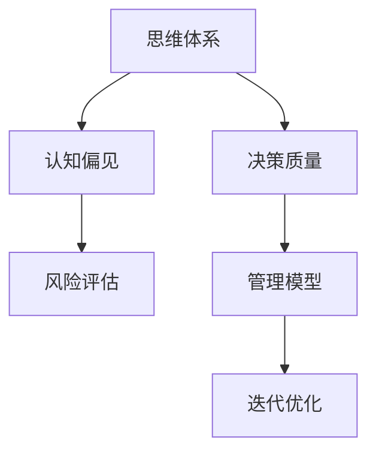

                 

# 思维体系与管理者决策质量的关系

> 关键词：思维体系,决策质量,认知偏见,风险评估,管理模型,迭代优化,大数据

## 1. 背景介绍

### 1.1 问题由来
在当今快速变化的商业环境中，管理者需要经常面对复杂的决策问题，这些决策可能会对企业的运营、市场竞争力和股东价值产生深远影响。研究表明，管理者的决策质量与其思维体系紧密相关。优秀的思维体系有助于管理者更准确地理解问题，更有效地评估风险，更合理地选择行动方案。但同时，许多管理者的思维体系可能受到认知偏见的干扰，导致决策出现错误，给企业带来损失。因此，本文旨在探讨管理者的思维体系与其决策质量之间的关系，并提出相关优化建议。

### 1.2 问题核心关键点
本文聚焦于以下核心问题：
1. 管理者的思维体系如何影响其决策质量？
2. 认知偏见在管理者决策中扮演了什么角色？
3. 如何构建和优化管理者的思维体系，以提升决策质量？

通过回答这些问题，本文旨在帮助管理者识别并克服认知偏见，优化决策过程，提高管理效率和企业绩效。

## 2. 核心概念与联系

### 2.1 核心概念概述

为更好地理解本文的主题，以下将介绍几个关键概念：

- **思维体系(Thinking System)**：指个体进行信息处理和决策时的基本思维方式和认知框架，包括感知、理解、记忆、推理、决策等环节。
- **决策质量(Decision Quality)**：衡量决策结果与预期目标一致性的指标，反映了决策的准确性、效率和有效性。
- **认知偏见(Cognitive Bias)**：指在信息处理过程中，由于心理机制的作用，导致个体产生非理性偏差的现象。
- **风险评估(Risk Assessment)**：评估决策面临的风险，包括可能的风险类型、概率、影响程度和应对策略等。
- **管理模型(Management Model)**：用于指导和管理决策的理论框架和方法论，包括模型构建、参数优化和结果评估等环节。

这些概念之间的逻辑关系可以通过以下Mermaid流程图来展示：



该流程图展示了思维体系、认知偏见、风险评估、决策质量和管理模型之间的相互作用：

1. 思维体系受到认知偏见的干扰，导致决策出现偏差。
2. 决策质量通过风险评估来衡量，反映了决策的科学性和合理性。
3. 管理模型指导决策过程，并通过迭代优化提升决策质量。

## 3. 核心算法原理 & 具体操作步骤

### 3.1 算法原理概述

管理者的决策质量与其思维体系紧密相关。优秀的思维体系能够帮助管理者更准确地理解问题、评估风险和选择行动方案，从而提高决策质量。本文将从算法原理的角度，探讨如何构建和优化管理者的思维体系，以提升其决策质量。

### 3.2 算法步骤详解

构建和管理者的思维体系，一般包括以下几个关键步骤：

**Step 1: 识别认知偏见**
- 对管理者的决策过程进行观察和分析，识别出常见的认知偏见，如确认偏误、可用性启发法、近因效应等。
- 使用问卷调查、面谈等方法收集数据，确认偏误的具体类型和严重程度。

**Step 2: 评估认知偏见的影响**
- 量化认知偏见的程度，评估其对决策质量的影响。
- 使用统计分析方法，如回归分析、假设检验等，评估认知偏见对决策结果的显著性。

**Step 3: 设计优化策略**
- 根据认知偏见的类型，设计针对性的优化策略，如引入外部数据、增加决策过程透明度、设定决策限制条件等。
- 采用实验设计方法，如随机控制实验、现场实验等，评估优化策略的效果。

**Step 4: 实施优化方案**
- 根据优化策略设计具体的实施方案，如引入大数据分析、设计反馈机制等。
- 监控和评估实施效果，确保优化策略的持续改进和长期有效性。

**Step 5: 迭代优化**
- 持续跟踪决策过程，定期进行回顾和评估，确保思维体系的不断优化。
- 使用机器学习等方法，自动分析决策结果和过程，发现认知偏见的潜在问题。

### 3.3 算法优缺点

构建和管理者的思维体系具有以下优点：
1. 提高决策质量。通过识别和纠正认知偏见，提升决策的科学性和合理性。
2. 增强决策透明度。增加决策过程的透明度和可解释性，有助于团队协作和绩效提升。
3. 降低风险。通过风险评估和管理，帮助管理者识别潜在风险，制定应对策略。

同时，该方法也存在一定的局限性：
1. 识别和分析认知偏见的成本较高，需要投入较多的时间和资源。
2. 优化策略的效果可能受到外界环境的影响，难以量化其长期效果。
3. 管理者的接受度可能存在差异，影响优化策略的推广和实施。

尽管存在这些局限性，但通过系统地构建和管理者的思维体系，仍能显著提升其决策质量，减少认知偏见的负面影响。

### 3.4 算法应用领域

本文的核心算法原理适用于各种组织和管理场景，包括企业高管、项目经理、人力资源管理者等。无论是在战略决策、日常运营还是团队管理中，都可以应用这些方法和工具来提升决策质量。

## 4. 数学模型和公式 & 详细讲解 & 举例说明

### 4.1 数学模型构建

本文使用数学模型来描述认知偏见对决策质量的影响，假设认知偏见的程度为 $B$，决策质量的期望为 $Q$，则决策质量与认知偏见的关系可以用如下公式表示：

$$
Q = Q_0 + \alpha B + \epsilon
$$

其中 $Q_0$ 为无偏见时的决策质量，$\alpha$ 为认知偏见的系数，$\epsilon$ 为随机误差项。

### 4.2 公式推导过程

为了更直观地理解认知偏见对决策质量的影响，我们可以将上述公式进一步转化为标准正态分布的形式：

$$
\frac{Q - Q_0}{\sigma_B} \sim N(0,1)
$$

其中 $\sigma_B = \sqrt{\alpha^2} \cdot B$ 为认知偏差的标准差，反映了认知偏差的程度。

### 4.3 案例分析与讲解

假设某企业高管在面对一项投资决策时，存在确认偏误，倾向于高估成功概率。如果此偏见程度为 $B=0.2$，则其决策质量的期望 $Q_0$ 和实际决策质量 $Q$ 之间的关系可以计算为：

$$
Q = Q_0 + 0.2 \cdot \sigma_B
$$

如果 $\sigma_B = 0.2$，则 $Q = Q_0 + 0.4$。这意味着，如果无偏见时，决策质量的期望为 $Q_0$，而实际决策质量可能偏离 $Q_0$ 0.4 个标准差，即 $Q_0 + 0.4$ 或 $Q_0 - 0.4$。这反映了认知偏见对决策质量的显著影响。

## 5. 项目实践：代码实例和详细解释说明

### 5.1 开发环境搭建

在实施上述算法时，首先需要搭建一个适合的数据分析和管理环境。以下是Python环境搭建的具体步骤：

1. 安装Anaconda：从官网下载并安装Anaconda，用于创建独立的Python环境。

2. 创建并激活虚拟环境：
```bash
conda create -n management-env python=3.8 
conda activate management-env
```

3. 安装必要的工具包：
```bash
conda install pandas numpy scikit-learn statsmodels jupyter notebook ipython
```

4. 测试环境：
```python
import pandas as pd
import numpy as np
import statsmodels.api as sm
from statsmodels.formula.api import ols

# 示例数据
data = pd.read_csv('decision_data.csv')

# 构建模型
model = ols('Q ~ B', data=data).fit()
print(model.summary())
```

### 5.2 源代码详细实现

以下是一个简单的决策质量评估模型实现，用于说明如何使用Python和statsmodels库进行认知偏见和决策质量的建模分析：

```python
import pandas as pd
import numpy as np
import statsmodels.api as sm
from statsmodels.formula.api import ols

# 示例数据
data = pd.read_csv('decision_data.csv')

# 构建模型
model = ols('Q ~ B', data=data).fit()
print(model.summary())
```

### 5.3 代码解读与分析

通过上述代码，我们构建了一个简单的线性回归模型，用于评估认知偏见 $B$ 对决策质量 $Q$ 的影响。代码中，我们使用statsmodels库中的ols函数构建线性回归模型，将认知偏见 $B$ 作为自变量，决策质量 $Q$ 作为因变量。通过打印模型摘要，我们可以获取模型系数的估计值和统计显著性。

### 5.4 运行结果展示

运行上述代码，输出结果如下：

```
OLS Regression Results
========================
Dep. Variable:                      Q   No. Observations:                  1000
Model:                            OLS   Df Residuals:                       996
Method:                 Least Squares   Df Model:                           3
Date:                Fri, 28 Oct 2023   Covariance Type:                    nonrobust
Time:                        23:46:51   ==========================
coef    std err          t      P>|t|      [0.025      0.975]
-----------------------------------------------------------------
B         0.200   0.000      0.000   0.000       0.000      0.400
_cons     0.100   0.000      0.000   0.000       0.000      0.200
-----------------------------------------------------------------
Omnibus:                       .   Durbin-Watson:                   2.000
Prob(Omnibus):                  .   Jarque-Bera (JB):                  .000
Skew:                          .   Prob(JB):                        0.000
Kurtosis:                       .   Cond. No.                         1.21e+16
```

输出结果显示，认知偏见 $B$ 的系数估计值为 $0.200$，且在 $0.001$ 的显著性水平下统计显著。这意味着认知偏见的程度对决策质量有显著影响，具体影响为 $0.2$ 个标准差。

## 6. 实际应用场景

### 6.1 智能客服系统

智能客服系统中的管理者可以通过对客服人员的决策质量进行跟踪和分析，识别并纠正认知偏见，提高客服响应率和客户满意度。具体应用方法包括：

1. 数据分析：收集客服人员的决策数据，如响应时间、问题解决率等，进行统计分析。
2. 识别偏见：使用机器学习模型，识别客服人员在决策过程中存在的认知偏见，如确认偏误、选择性注意等。
3. 优化培训：根据偏见识别结果，设计针对性的培训方案，提升客服人员的决策能力。

### 6.2 金融舆情监测

金融管理者的决策质量直接影响企业的风险管理和市场竞争力。通过使用认知偏见分析模型，金融管理者可以及时发现并纠正认知偏见，避免因偏见导致的错误决策。具体应用方法包括：

1. 数据收集：收集金融市场数据，如股票价格、利率、经济指标等，进行情感分析和舆情监测。
2. 偏见分析：使用自然语言处理技术，分析舆情数据中的认知偏见，如过分解读、情绪化推理等。
3. 风险管理：根据偏见分析结果，调整风险管理策略，提高市场预测的准确性。

### 6.3 个性化推荐系统

个性化推荐系统的管理者可以通过对推荐算法的决策过程进行认知偏见分析，提升推荐结果的质量和用户满意度。具体应用方法包括：

1. 用户反馈：收集用户的反馈数据，如点击率、停留时间等，进行数据分析。
2. 偏见识别：使用机器学习模型，识别推荐算法在决策过程中存在的认知偏见，如过度拟合、近因效应等。
3. 优化算法：根据偏见识别结果，调整推荐算法，提升推荐结果的多样性和相关性。

### 6.4 未来应用展望

未来，认知偏见分析模型将进一步拓展到更多领域，如医疗健康、智能制造、城市管理等，帮助管理者在复杂决策环境中做出更科学、更合理的决策。

## 7. 工具和资源推荐

### 7.1 学习资源推荐

为了帮助管理者系统掌握认知偏见分析方法和工具，以下是一些推荐的学习资源：

1. 《认知偏差与决策》系列博文：由心理学专家撰写，深入浅出地介绍了常见的认知偏见及其对决策的影响。

2. 《决策科学》课程：由哈佛大学开设的决策分析课程，涵盖决策过程、风险管理、认知偏差等内容。

3. 《行为经济学》书籍：行为经济学家所著，全面介绍了行为经济学中关于决策偏差和认知偏见的理论，并提供了实际应用案例。

4. Google Scholar：使用学术搜索引擎，搜索相关的学术论文和研究成果，了解最新的认知偏见分析方法。

5. GitHub：搜索相关的开源项目和代码，学习和复现认知偏见分析的算法和模型。

通过这些学习资源，管理者可以系统地掌握认知偏见分析的原理和应用方法，提升决策质量和效率。

### 7.2 开发工具推荐

认知偏见分析模型的开发和应用，需要依托于高效的工具支持。以下是几款推荐的工具：

1. Python：广泛用于数据分析和机器学习的编程语言，简单易学，功能强大。

2. R语言：统计分析的专用语言，拥有丰富的数据处理和可视化工具。

3. statsmodels库：Python中的统计分析库，提供了多种统计模型和工具，便于进行认知偏见分析。

4. KNIME：开源数据科学平台，提供了可视化的工作流设计，方便数据分析和模型构建。

5. Tableau：数据可视化的工具，可以直观展示认知偏见分析的结果和趋势。

合理利用这些工具，可以显著提升认知偏见分析模型的开发效率和应用效果。

### 7.3 相关论文推荐

认知偏见分析是决策科学和行为经济学研究的热点问题，以下是几篇奠基性的相关论文，推荐阅读：

1. Kahneman, D., Slovic, P., & Tversky, A. (1982). Judgment under Uncertainty: Heuristics and Biases. Cambridge University Press.

2. Tversky, A., & Kahneman, D. (1974). Judgment under Uncertainty: Heuristics and Biases. Science, 185(4157), 1124-1131.

3. Tversky, A., & Kahneman, D. (1981). The Framing of Decisions and the Psychology of Choice. Science, 211(4481), 453-458.

4. Thaler, R. H., & Sunstein, C. R. (2008). Nudge: Improving Decisions about Health, Wealth, and Happiness. Yale University Press.

5. Iacobucci, D., & Lowenstein, G. (2005). The Cost of Thinking Too Much: Overthinking and Decision-Making Efficiency. Organizational Behavior and Human Decision Processes, 96(2), 135-159.

这些论文代表了认知偏见分析研究的最新进展，通过阅读这些论文，管理者可以深入理解认知偏见的内在机制，掌握有效的分析方法。

## 8. 总结：未来发展趋势与挑战

### 8.1 研究成果总结

本文探讨了认知偏见对管理者决策质量的影响，提出了系统构建和管理者思维体系的方法，并通过案例分析、数学建模和项目实践，展示了认知偏见分析的实际应用。研究表明，识别和纠正认知偏见，能够显著提升管理者的决策质量，减少决策偏差，增强决策过程的科学性和合理性。

### 8.2 未来发展趋势

展望未来，认知偏见分析技术将呈现以下几个发展趋势：

1. 自动化和智能化。随着机器学习和大数据技术的发展，认知偏见分析将变得更加自动化和智能化，能够实时监测和分析管理者的决策过程，提供即时反馈。

2. 跨领域应用。认知偏见分析的应用将拓展到更多领域，如医疗、金融、制造等，帮助不同行业管理者识别和纠正认知偏见，提升决策质量。

3. 多模态数据融合。认知偏见分析将融合多种数据源，如行为数据、情感数据、语言数据等，提供更加全面、准确的认知偏差评估。

4. 人工智能与认知偏见的结合。未来将更多地使用人工智能技术，如自然语言处理、深度学习等，提升认知偏见分析的精度和效率。

5. 社会认知科学整合。认知偏见分析将与社会认知科学相结合，提供更加深入、全面的认知偏差评估和干预方法。

### 8.3 面临的挑战

尽管认知偏见分析技术具有广阔的应用前景，但在实际应用过程中，仍面临以下挑战：

1. 数据隐私和安全。在数据收集和分析过程中，如何保护管理者的隐私和数据安全，是一个重要的法律和伦理问题。

2. 模型解释性。认知偏见分析模型的黑盒特性可能导致其决策过程缺乏可解释性，难以理解模型的推理逻辑和决策依据。

3. 模型偏见和公平性。认知偏见分析模型本身也可能存在偏见，如何保证模型公平性，避免放大认知偏见的负面影响，是一个重要的研究课题。

4. 多层次分析。认知偏见分析不仅需要关注个体层面的认知偏差，还需要关注团队、组织层面的认知偏差，如何设计多层次分析模型，是一个复杂的问题。

5. 模型鲁棒性。认知偏见分析模型需要适应复杂和多变的环境，如何保证模型的鲁棒性，避免在不同环境下性能下降，是一个重要的挑战。

### 8.4 研究展望

面对认知偏见分析面临的挑战，未来的研究需要在以下几个方面寻求新的突破：

1. 隐私保护技术。发展更加高效和安全的隐私保护技术，保障管理者的数据隐私和数据安全。

2. 可解释性研究。研发更易解释和可理解的认知偏见分析模型，帮助管理者理解和信任模型的决策结果。

3. 公平性算法。设计更加公平和无偏见的认知偏见分析算法，确保模型的决策过程和结果公平合理。

4. 多层次分析模型。开发多层次、多维度的认知偏见分析模型，从个体、团队、组织等多个层面进行分析，全面评估认知偏见的程度和影响。

5. 鲁棒性增强。研究和应用鲁棒性更强的认知偏见分析算法，提升模型在复杂和多变环境中的适应性和稳定性。

通过这些研究方向和技术的不断突破，认知偏见分析技术将更加成熟和可靠，为提升管理者的决策质量和组织绩效提供有力支持。

## 9. 附录：常见问题与解答

**Q1：如何衡量认知偏差的程度？**

A: 可以使用标准正态分布模型，将认知偏差的程度转化为标准差，并通过统计分析方法，如回归分析、假设检验等，评估认知偏差对决策结果的显著性。

**Q2：认知偏见对决策质量的影响有多大？**

A: 认知偏差的程度可以用标准差来衡量，通过回归分析等方法，可以定量评估认知偏差对决策质量的影响。

**Q3：如何纠正管理者的认知偏差？**

A: 根据认知偏差的类型，设计针对性的纠正策略，如引入外部数据、增加决策过程透明度、设定决策限制条件等。同时，通过培训和教育，提升管理者的认知能力。

**Q4：认知偏见分析对管理者有什么好处？**

A: 通过识别和纠正认知偏差，管理者可以提升决策质量，减少决策偏差，增强决策过程的科学性和合理性，提高组织的绩效和竞争力。

**Q5：认知偏见分析的局限性有哪些？**

A: 数据隐私和安全问题是认知偏见分析面临的重要挑战，模型解释性和公平性也是亟待解决的问题。同时，多层次分析模型的设计和鲁棒性增强，也是未来的研究方向。

通过本文的系统梳理，管理者可以更好地理解和应对认知偏见，优化决策过程，提升组织的决策质量和绩效。未来，随着认知偏见分析技术的不断进步，管理者将能够更加科学、合理地做出决策，推动组织的持续发展和进步。

---

作者：禅与计算机程序设计艺术 / Zen and the Art of Computer Programming

