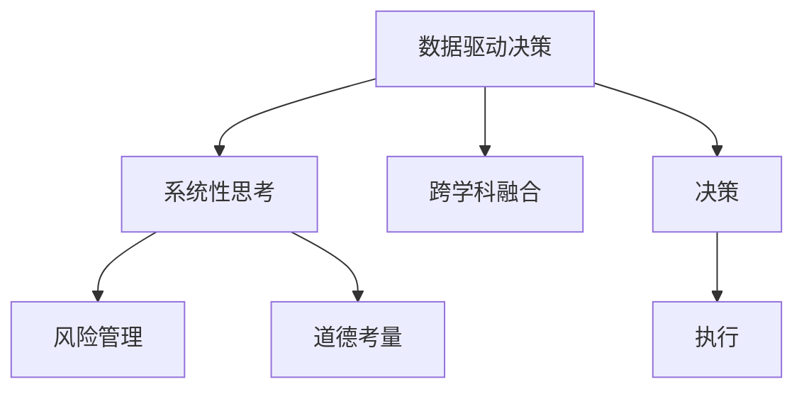

                 

# 思维体系对领导力的影响

> 关键词：思维体系, 领导力, 创新, 决策, 团队协作, 决策树, 数据驱动, 伦理

## 1. 背景介绍

### 1.1 问题由来
在当今信息爆炸的时代，领导力是任何组织成功的关键。然而，领导力的本质不仅仅是管理团队或下达命令，而是一种复杂而多元化的能力，包括决策制定、团队协作、创新、沟通和伦理等多个方面。随着科学和技术的发展，数据驱动和逻辑分析成为了领导力的重要工具，但真正能够推动组织进步的，是那些能够将这些工具运用到位的思维体系。

### 1.2 问题核心关键点
本文聚焦于如何构建一种能够促进创新、高效决策和团队协作的思维体系，以提高领导力。这种思维体系的核心在于：

1. 数据驱动决策：通过对大量数据的分析，从数据中发现规律，指导决策。
2. 系统性思考：通过将复杂问题分解为小部分，系统化地解决问题。
3. 跨学科融合：从多个学科领域中借鉴知识，创新性地解决问题。
4. 风险管理：识别潜在风险，制定应对策略，保障决策的稳健性。
5. 道德考量：在决策过程中，考虑伦理和社会影响，确保决策的公正性和可持续性。

### 1.3 问题研究意义
构建高效思维体系对提升领导力的意义重大：

1. 提高决策质量：通过数据驱动和系统性思考，能够更全面、准确地理解和解决问题。
2. 促进创新：跨学科融合有助于突破现有思维定式，激发新的创意。
3. 增强团队协作：系统性思维和跨学科知识使团队成员能够更好地理解彼此的观点和需求，提升协作效率。
4. 确保伦理决策：道德考量和风险管理确保决策不仅高效，而且公正和可持续。

## 2. 核心概念与联系

### 2.1 核心概念概述

为更好地理解思维体系对领导力的影响，本节将介绍几个核心概念：

- 数据驱动决策：利用数据和统计学方法进行决策的过程。
- 系统性思考：将复杂问题分解为可管理的子问题，逐步解决的过程。
- 跨学科融合：从不同学科领域借鉴知识，应用到当前问题解决的过程。
- 风险管理：识别潜在风险，制定应对策略的过程。
- 道德考量：在决策过程中考虑伦理和社会影响的过程。

这些概念之间的逻辑关系可以通过以下Mermaid流程图来展示：



这个流程图展示了几大思维体系核心概念及其之间的关系：

1. 数据驱动决策是基础，提供决策依据。
2. 系统性思考是工具，将复杂问题分解为可管理的子问题。
3. 跨学科融合是方法，借鉴不同学科知识，提升解决方案的创新性。
4. 风险管理是保障，识别潜在风险，制定应对策略。
5. 道德考量是指导，确保决策的公正性和可持续性。

## 3. 核心算法原理 & 具体操作步骤
### 3.1 算法原理概述

思维体系对领导力的提升，主要通过以下几个算法原理实现：

- 数据驱动决策算法：通过统计分析，识别数据中的模式和趋势，提供决策依据。
- 系统性思考算法：利用递归分解和层次化策略，将复杂问题逐步细化解决。
- 跨学科融合算法：结合不同学科的知识和方法，进行跨领域的知识整合和创新。
- 风险管理算法：使用模拟和优化技术，识别和规避潜在风险。
- 道德考量算法：结合伦理分析和社会影响评估，确保决策的公正性和可持续性。

### 3.2 算法步骤详解

具体来说，领导力提升的思维体系构建步骤如下：

**Step 1: 数据收集与预处理**
- 收集与问题相关的各类数据，包括内部运营数据、市场数据、用户反馈等。
- 对数据进行清洗和预处理，确保数据质量。

**Step 2: 数据驱动决策**
- 利用统计学方法和数据挖掘技术，从数据中提取关键特征和模式。
- 构建数据驱动的决策模型，如回归分析、聚类分析、时间序列分析等。

**Step 3: 系统性思考**
- 将复杂问题分解为可管理的子问题，利用流程图、决策树等工具进行可视化。
- 逐步解决各个子问题，最终整合为整体解决方案。

**Step 4: 跨学科融合**
- 识别问题涉及的多个学科领域，如经济学、心理学、计算机科学等。
- 借鉴不同学科的理论和方法，进行交叉验证和综合应用。

**Step 5: 风险管理**
- 识别决策中的潜在风险和不确定性因素。
- 制定风险应对策略，如风险规避、风险转移、风险缓解等。

**Step 6: 道德考量**
- 分析决策对社会、环境、伦理等方面的影响。
- 结合伦理分析结果，调整决策方案，确保其公正性和可持续性。

**Step 7: 实施与评估**
- 根据决策方案进行实施，并实时监测执行效果。
- 收集反馈，进行效果评估，持续改进思维体系。

### 3.3 算法优缺点

数据驱动决策的优势在于其客观性和科学性，但需要大量高质量数据。系统性思考的优势在于其系统性和全面性，但可能过度复杂化问题。跨学科融合的优势在于其创新性和灵活性，但需要多学科知识背景。风险管理有助于规避潜在风险，但可能导致决策过于保守。道德考量确保决策的公正性，但可能与商业利益发生冲突。

## 4. 数学模型和公式 & 详细讲解  
### 4.1 数学模型构建

基于上述算法原理，构建以下数学模型：

- 数据驱动决策模型：通过回归分析，建立变量与决策目标之间的关系。
- 系统性思考模型：利用递归树算法，将问题逐步分解并解决。
- 跨学科融合模型：通过联合分布学习，整合不同学科的知识。
- 风险管理模型：利用蒙特卡洛模拟，识别潜在风险并制定应对策略。
- 道德考量模型：结合社会影响评估，确保决策的公正性和可持续性。

### 4.2 公式推导过程

以下以数据驱动决策模型为例，推导回归分析的数学公式：

设 $X$ 为自变量向量，$Y$ 为因变量，$\beta$ 为回归系数向量，$\epsilon$ 为误差项，则线性回归模型的数学公式为：

$$
Y = X\beta + \epsilon
$$

其中，$\epsilon$ 服从均值为0，方差为 $\sigma^2$ 的高斯分布，即 $\epsilon \sim N(0, \sigma^2)$。

### 4.3 案例分析与讲解

通过以下案例，进一步讲解数据驱动决策在实际应用中的应用：

某电子商务公司需优化其物流配送线路。通过收集历史配送数据，包括出发时间、到达时间、路径距离等，构建回归模型，预测不同配送线路的平均配送时间。利用数据驱动决策，公司可以优化配送路线，降低配送成本。

## 5. 项目实践：代码实例和详细解释说明
### 5.1 开发环境搭建

在进行领导力提升的思维体系构建实践前，我们需要准备好开发环境。以下是使用Python进行SciPy开发的Python环境配置流程：

1. 安装Anaconda：从官网下载并安装Anaconda，用于创建独立的Python环境。

2. 创建并激活虚拟环境：
```bash
conda create -n pythond-env python=3.8 
conda activate pythond-env
```

3. 安装SciPy：
```bash
pip install scipy
```

4. 安装各类工具包：
```bash
pip install numpy pandas matplotlib sklearn ipython
```

完成上述步骤后，即可在`pythond-env`环境中开始项目实践。

### 5.2 源代码详细实现

以下以数据驱动决策模型为例，给出使用SciPy和Pandas库进行回归分析的代码实现。

首先，准备数据集：

```python
import pandas as pd

# 读取数据
data = pd.read_csv('delivery_data.csv')

# 定义自变量和因变量
X = data[['distance', 'time']] # 路径距离和配送时间
Y = data['duration'] # 配送时间
```

然后，进行数据预处理：

```python
# 处理缺失值
X = X.dropna()
Y = Y.dropna()

# 标准化数据
X_scaled = (X - X.mean()) / X.std()
```

接着，构建回归模型并进行训练：

```python
from scipy.stats import linregress

# 构建回归模型
slope, intercept, r_value, p_value, std_err = linregress(X_scaled['distance'], Y)

# 训练回归模型
model = linregress(X_scaled['distance'], Y)
```

最后，进行预测和评估：

```python
from sklearn.metrics import mean_squared_error

# 预测配送时间
predicted_durations = model.predict(X_scaled['distance'])

# 计算平均配送时间
mean_duration = predicted_durations.mean()

# 计算均方误差
mse = mean_squared_error(Y, predicted_durations)

# 输出结果
print('平均配送时间：', mean_duration)
print('均方误差：', mse)
```

以上就是使用SciPy和Pandas库进行数据驱动决策的代码实现。可以看到，通过简单的线性回归模型，能够有效预测配送时间，帮助公司优化物流配送路线。

### 5.3 代码解读与分析

让我们再详细解读一下关键代码的实现细节：

**数据读取与预处理**：
- 使用Pandas库读取数据集，并去除缺失值。
- 使用SciPy库进行数据标准化，以提升回归模型的稳定性。

**模型构建与训练**：
- 利用SciPy库中的`linregress`函数，构建线性回归模型。
- 将自变量和因变量输入模型，进行训练。

**预测与评估**：
- 利用训练好的模型进行预测，并计算均方误差。
- 输出平均配送时间和均方误差，评估模型效果。

可以看到，SciPy和Pandas库使得数据驱动决策的代码实现变得简洁高效。开发者可以将更多精力放在模型选择和优化等高层逻辑上，而不必过多关注底层的实现细节。

当然，工业级的系统实现还需考虑更多因素，如模型的保存和部署、超参数的自动搜索、更灵活的任务适配层等。但核心的数据驱动决策范式基本与此类似。

## 6. 实际应用场景
### 6.1 智能物流管理

基于数据驱动决策的思维体系，智能物流管理可以显著提升配送效率和成本控制。物流公司可以通过历史数据，分析配送线路、配送时间等关键指标，优化配送策略，减少路途延误和货物损毁。

### 6.2 产品定价策略

产品定价是企业管理的重要环节，数据驱动决策可以帮助企业更准确地制定定价策略。通过分析历史销售数据、市场价格、竞争对手策略等，企业可以构建价格预测模型，制定动态定价方案。

### 6.3 风险管理策略

风险管理是企业运营中的关键任务。数据驱动决策可以帮助企业识别潜在风险，制定应对策略。例如，金融企业可以利用历史交易数据，预测交易风险，实施风险控制措施。

### 6.4 未来应用展望

随着数据驱动决策技术的发展，其在各行各业中的应用前景广阔。未来，基于数据驱动的思维体系将更深入地渗透到企业管理的各个环节，提升决策效率和效果。

## 7. 工具和资源推荐
### 7.1 学习资源推荐

为了帮助开发者系统掌握数据驱动决策的理论基础和实践技巧，这里推荐一些优质的学习资源：

1. 《Python数据科学手册》：深入介绍Python在数据科学中的应用，适合初学者入门。
2. 《数据科学实战》：实战性强，涵盖数据预处理、模型训练、评估等环节，适合实践操作。
3. 《机器学习实战》：通过具体案例，讲解机器学习算法的应用，适合动手练习。
4. 《统计学习方法》：经典教材，系统讲解统计学习的基础理论和应用，适合深入研究。
5. 《Python科学计算》：介绍Python在科学计算中的应用，涵盖Numpy、SciPy等库的使用。

通过对这些资源的学习实践，相信你一定能够快速掌握数据驱动决策的精髓，并用于解决实际的管理问题。
###  7.2 开发工具推荐

高效的开发离不开优秀的工具支持。以下是几款用于数据驱动决策开发的常用工具：

1. Python：灵活易用，是数据科学和机器学习的首选语言。
2. R语言：擅长统计分析，广泛应用于学术和研究领域。
3. Scikit-learn：基于Python的机器学习库，提供丰富的模型和算法。
4. Matplotlib：绘图库，适合数据可视化。
5. Pandas：数据处理库，支持数据清洗、预处理等操作。
6. Jupyter Notebook：交互式编程环境，适合实验和探索。

合理利用这些工具，可以显著提升数据驱动决策的开发效率，加快创新迭代的步伐。

### 7.3 相关论文推荐

数据驱动决策的发展源于学界的持续研究。以下是几篇奠基性的相关论文，推荐阅读：

1. "An Introduction to Statistical Learning"：经典教材，介绍统计学习的基本概念和方法。
2. "Pattern Recognition and Machine Learning"：经典教材，涵盖机器学习的理论和算法。
3. "Predictive Analytics"：实战案例，介绍数据驱动决策在商业中的应用。
4. "The Elements of Statistical Learning"：经典教材，介绍统计学习的方法和应用。
5. "Data Mining: Concepts and Techniques"：经典教材，介绍数据挖掘的基本概念和方法。

这些论文代表了大数据驱动决策的发展脉络。通过学习这些前沿成果，可以帮助研究者把握学科前进方向，激发更多的创新灵感。

## 8. 总结：未来发展趋势与挑战
### 8.1 总结

本文对数据驱动决策对领导力的影响进行了全面系统的介绍。首先阐述了数据驱动决策的理论基础和应用场景，明确了其对提升领导力的独特价值。其次，从原理到实践，详细讲解了数据驱动决策的数学模型和算法步骤，给出了数据驱动决策任务开发的完整代码实例。同时，本文还广泛探讨了数据驱动决策在智能物流、产品定价、风险管理等多个行业领域的应用前景，展示了数据驱动决策范式的巨大潜力。此外，本文精选了数据驱动决策技术的各类学习资源，力求为读者提供全方位的技术指引。

通过本文的系统梳理，可以看到，数据驱动决策技术已经成为现代领导力的重要组成部分。得益于数据科学和机器学习的进步，数据驱动决策在多个领域展示了其高效、准确、自动化的优势，为管理决策提供了科学依据。未来，随着数据量和算力的持续增长，数据驱动决策将更加深入地渗透到各个管理环节，推动组织向智能化、高效化、数据化方向发展。

### 8.2 未来发展趋势

展望未来，数据驱动决策技术将呈现以下几个发展趋势：

1. 数据量的持续增长：随着物联网、大数据等技术的广泛应用，数据量将持续增长，为数据驱动决策提供更丰富的数据源。
2. 算法技术的不断进步：机器学习、深度学习等技术的进步，将推动数据驱动决策的算法精度和效率不断提升。
3. 实时决策的支持：云计算、边缘计算等技术的普及，将使得数据驱动决策能够实时响应，提升决策的及时性和有效性。
4. 跨领域的深度融合：数据驱动决策将与物联网、区块链等新兴技术深度融合，拓展其在各行业的应用范围。
5. 隐私保护和安全性的增强：数据隐私和安全问题将引起更多关注，如何在保护隐私的前提下，实现数据驱动决策，将是一大挑战。

以上趋势凸显了数据驱动决策技术的广阔前景。这些方向的探索发展，将进一步提升数据驱动决策的效率和效果，推动管理决策的科学化和智能化。

### 8.3 面临的挑战

尽管数据驱动决策技术已经取得了显著成就，但在实现全面应用的过程中，仍面临诸多挑战：

1. 数据质量问题：数据来源多样，数据质量参差不齐，可能导致模型结果偏差。
2. 数据隐私问题：在数据采集和使用过程中，需要保障数据隐私和用户权益。
3. 数据整合问题：不同来源、不同格式的数据需要整合处理，才能用于决策分析。
4. 模型可解释性问题：数据驱动决策模型往往是"黑盒"模型，缺乏可解释性。
5. 技术壁垒问题：需要具备数据科学、机器学习等领域的知识和技能，才能高效使用数据驱动决策技术。

这些挑战需要研究者不断探索和改进，才能使数据驱动决策技术更好地服务于实际管理决策。

### 8.4 研究展望

未来研究需要在以下几个方面寻求新的突破：

1. 提升数据质量：通过数据清洗、预处理等手段，提升数据质量和一致性。
2. 增强模型可解释性：结合人工智能技术和符号计算，提升模型的可解释性。
3. 优化算法效率：开发更高效的算法模型，提升数据驱动决策的速度和准确性。
4. 实现实时决策：利用云计算、边缘计算等技术，支持实时决策。
5. 保障数据隐私：采用隐私保护技术，确保数据安全和用户隐私。

这些研究方向的探索，将引领数据驱动决策技术迈向更高的台阶，为构建智能化、高效化的管理决策系统铺平道路。

## 9. 附录：常见问题与解答

**Q1：数据驱动决策是否适用于所有管理决策？**

A: 数据驱动决策在大多数管理决策中都能发挥重要作用，但并不适用于所有场景。例如，紧急情况下的决策往往需要依赖经验或直觉。

**Q2：数据驱动决策是否需要大量数据？**

A: 数据驱动决策通常需要大量数据支持，数据量越大，模型越准确。但在数据稀缺的情况下，也可以利用数据增强、迁移学习等方法，进行高效的数据驱动决策。

**Q3：数据驱动决策是否会造成过度依赖数据？**

A: 数据驱动决策的核心在于数据，但过度依赖数据可能导致模型过拟合，忽略其他重要因素。因此，结合经验和常识，进行全面决策，是数据驱动决策的重要补充。

**Q4：数据驱动决策是否会导致信息过载？**

A: 数据驱动决策可能导致信息过载，需要通过数据筛选、重要性评估等手段，筛选关键数据，避免决策过程中信息过载。

**Q5：数据驱动决策是否适用于企业内部管理？**

A: 数据驱动决策不仅适用于外部市场决策，也适用于企业内部管理，如运营优化、生产调度、成本控制等。通过数据驱动决策，企业可以更全面、准确地掌握运营状况，提升管理效率。

---

作者：禅与计算机程序设计艺术 / Zen and the Art of Computer Programming

