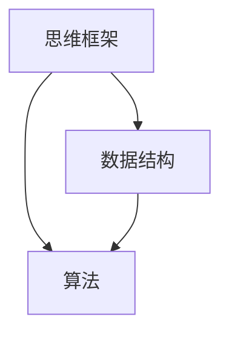

                 

# 思维框架：结构化思考的工具

> 关键词：结构化思维, 抽象思维, 系统思维, 算法, 数据结构, 逻辑推理

## 1. 背景介绍

### 1.1 问题由来

在现代信息爆炸的时代，我们每天都在面对海量信息。如何在浩如烟海的数据中提取有价值的信息，做出明智的决策，是每一个职场人士和技术人员必须面对的挑战。结构化思维作为处理复杂问题的一种系统性方法，已经被广泛应用于决策制定、项目管理、产品设计等多个领域。然而，如何将结构化思维转化为具体的操作方法，实现高效、系统的思考，是很多技术人员和商务人士的困惑所在。

### 1.2 问题核心关键点

结构化思维的本质，是一种将问题分解、抽象、综合的思考模式。它要求我们打破传统线性思维模式，通过系统的逻辑框架，快速、准确地解决问题。然而，结构化思维并不是一个抽象的概念，而是有一系列具体的工具和方法，可以指导我们在具体问题中应用。

本文将系统介绍结构化思维的核心工具，包括思维框架（例如：MindMap、SWOT分析、五力模型等）、数据结构（例如：数组、链表、树等）、算法（例如：排序、搜索、图算法等），帮助读者掌握结构化思维的本质，提高解决问题的能力。

## 2. 核心概念与联系

### 2.1 核心概念概述

结构化思维，顾名思义，是一种将复杂问题分解、抽象、综合的思考模式。它要求我们打破传统线性思维模式，通过系统的逻辑框架，快速、准确地解决问题。结构化思维的核心工具包括思维框架、数据结构和算法，这些工具相辅相成，共同构建了解决问题的系统化方法。

- **思维框架**：如MindMap、SWOT分析、五力模型等，用于将问题抽象、分解、综合，帮助我们找到问题的关键点和解决思路。
- **数据结构**：如数组、链表、树等，用于组织和管理数据，实现高效的数据处理和存储。
- **算法**：如排序、搜索、图算法等，用于解决问题，优化数据处理效率。

这些核心工具之间的逻辑关系可以通过以下Mermaid流程图来展示：



这个流程图展示了一系列核心工具之间的关系：

1. 思维框架帮助我们将问题抽象为可操作的形式。
2. 数据结构用于组织和管理数据，提供高效的数据处理和存储方案。
3. 算法基于数据结构，实现问题的求解和优化。

## 3. 核心算法原理 & 具体操作步骤
### 3.1 算法原理概述

结构化思维的核心算法原理，是问题分解、抽象和综合的数学模型。具体来说，就是将复杂问题分解为一系列子问题，通过抽象的方式建立问题模型，最终综合得出解决方案。这一过程可以抽象为以下几个步骤：

1. **分解**：将复杂问题分解为若干子问题。
2. **抽象**：将每个子问题抽象为数学模型，建立问题模型。
3. **综合**：通过求解每个子问题的解，综合得出问题的最终解。

这一过程可以通过数学公式和算法工具来实现，具体的数学模型和算法步骤如下文所述。

### 3.2 算法步骤详解

结构化思维的核心算法步骤，主要包括以下几个关键点：

**Step 1: 问题分解**：
将问题分解为若干个子问题，建立问题树，确定每个子问题的关键点和解决思路。

**Step 2: 问题抽象**：
对每个子问题进行抽象，建立数学模型或数据结构模型，用于表示问题的本质和特点。

**Step 3: 求解问题**：
通过数学工具或算法，求解每个子问题的解。

**Step 4: 问题综合**：
综合每个子问题的解，得出问题的最终解。

### 3.3 算法优缺点

结构化思维的算法优点在于，通过分解和抽象，将复杂问题简化为可操作的形式，便于求解和综合。然而，结构化思维的算法也有其局限性：

- **灵活性不足**：结构化思维的分解和抽象，要求对问题的本质有深刻的理解和抽象能力，不适用于所有问题。
- **复杂性高**：对于某些复杂问题，结构化思维的分解和抽象可能过于复杂，难以操作。

### 3.4 算法应用领域

结构化思维的算法主要应用于以下领域：

- **项目管理**：通过问题分解和抽象，实现项目管理的系统化管理。
- **产品设计**：通过问题分解和抽象，设计出高效、实用的产品。
- **数据分析**：通过问题分解和抽象，实现高效的数据分析和建模。
- **决策制定**：通过问题分解和抽象，辅助决策者做出科学、合理的决策。

## 4. 数学模型和公式 & 详细讲解 & 举例说明

### 4.1 数学模型构建

结构化思维的数学模型，主要包括线性规划、非线性规划、图算法等。这些模型基于优化理论，用于求解复杂问题。以下以线性规划为例，进行详细讲解。

线性规划问题可以抽象为以下形式：

$$\max \text{或}\min \quad c^T x$$
$$\text{Subject to:}\quad Ax \leq b$$
$$x \geq 0$$

其中，$x$ 为决策变量，$c$ 为系数向量，$A$ 为约束矩阵，$b$ 为约束向量。

### 4.2 公式推导过程

线性规划问题的求解过程主要包括以下几个步骤：

1. **构建问题模型**：将问题抽象为线性规划模型，确定决策变量、系数向量、约束矩阵和约束向量。
2. **求解问题**：通过求解线性规划模型的最优解，得到问题的最终解。

具体的求解过程可以使用单纯形法、内点法等算法实现。

### 4.3 案例分析与讲解

以线性规划问题为例，以下是一个简单的案例分析：

假设某公司生产两种产品A和B，单位利润分别为$10和$15，生产每种产品的单位成本分别为$5和$8，公司总共可以生产的单位数为100。问如何分配生产资源，以获得最大利润？

首先，将问题抽象为线性规划模型：

$$\max \quad 10x_1 + 15x_2$$
$$\text{Subject to:}\quad 5x_1 + 8x_2 \leq 100$$
$$x_1 \geq 0, x_2 \geq 0$$

然后，通过求解线性规划模型，得到最优解为$x_1=30,x_2=10$，即生产产品A 30个，产品B 10个，可获得最大利润$450。

## 5. 项目实践：代码实例和详细解释说明

### 5.1 开发环境搭建

在进行结构化思维的算法实践前，我们需要准备好开发环境。以下是使用Python进行Sympy开发的环境配置流程：

1. 安装Anaconda：从官网下载并安装Anaconda，用于创建独立的Python环境。

2. 创建并激活虚拟环境：
```bash
conda create -n sympy-env python=3.8 
conda activate sympy-env
```

3. 安装Sympy：
```bash
pip install sympy
```

4. 安装各类工具包：
```bash
pip install numpy pandas scikit-learn matplotlib tqdm jupyter notebook ipython
```

完成上述步骤后，即可在`sympy-env`环境中开始算法实践。

### 5.2 源代码详细实现

这里我们以线性规划问题为例，给出使用Sympy库进行求解的Python代码实现。

首先，定义线性规划问题的系数向量、约束矩阵和约束向量：

```python
from sympy import symbols, Eq, solve, Matrix

# 定义决策变量
x1, x2 = symbols('x1 x2')

# 定义系数向量
c = Matrix([10, 15])

# 定义约束矩阵
A = Matrix([[5, 8]])
b = Matrix([100])

# 定义约束条件
constraints = [Eq(A*x1 + b[0], b[1]), x1 >= 0, x2 >= 0]
```

然后，使用Sympy库求解线性规划问题：

```python
# 求解线性规划问题
result = solve(constraints, (x1, x2))
```

最后，输出求解结果：

```python
# 输出结果
print("x1:", result[x1], "x2:", result[x2])
```

以上就是使用Sympy对线性规划问题求解的完整代码实现。可以看到，通过Sympy库的封装，我们可以用相对简洁的代码完成线性规划问题的求解。

### 5.3 代码解读与分析

让我们再详细解读一下关键代码的实现细节：

**定义决策变量**：
- 使用Sympy库的`symbols`函数定义决策变量`x1`和`x2`。

**定义系数向量**：
- 使用Sympy库的`Matrix`函数定义系数向量`c`。

**定义约束矩阵和约束向量**：
- 使用Sympy库的`Matrix`函数定义约束矩阵`A`和约束向量`b`。

**定义约束条件**：
- 使用Sympy库的`Eq`函数定义等式约束条件，以及非负约束条件。

**求解线性规划问题**：
- 使用Sympy库的`solve`函数求解线性规划问题，返回结果。

**输出结果**：
- 直接输出决策变量`x1`和`x2`的值。

可以看到，Sympy库提供了强大的数学求解能力，可以方便地实现复杂问题的求解。通过合理使用这些工具，可以显著提升结构化思维的算法实践效率。

## 6. 实际应用场景

### 6.1 项目管理

结构化思维的算法在项目管理中有着广泛的应用。项目管理中，任务分解和优先级排序是常见的子问题。通过使用问题分解和抽象的方法，可以有效地管理项目进度和资源，确保项目按时完成。

例如，某项目有10个任务，分别为任务1-10，任务间依赖关系为：
- 任务1和任务2依赖，任务2和任务3依赖，以此类推。

首先，将项目任务抽象为线性规划模型：

$$\max \quad 1$$
$$\text{Subject to:}\quad 1 \leq x_i \leq 1, i \in [1,10]$$

然后，通过求解线性规划模型，得到每个任务的最优执行顺序。

### 6.2 产品设计

结构化思维的算法在产品设计中也有广泛的应用。产品设计中，功能优先级排序、市场分析等都是常见的子问题。通过使用问题分解和抽象的方法，可以设计出高效、实用的产品。

例如，某产品需要具备A、B、C三个功能，每个功能的重要性不同。首先，将功能优先级抽象为线性规划模型：

$$\max \quad \sum_{i=1}^3 a_i x_i$$
$$\text{Subject to:}\quad \sum_{i=1}^3 x_i \leq 1$$
$$x_i \geq 0, i \in [1,3]$$

其中，$a_i$ 为每个功能的重要性权重。

然后，通过求解线性规划模型，得到每个功能的最优分配比例。

### 6.3 数据分析

结构化思维的算法在数据分析中也有广泛的应用。数据分析中，数据清洗、特征选择等都是常见的子问题。通过使用问题分解和抽象的方法，可以实现高效的数据分析和建模。

例如，某数据集包含10个特征，每个特征的重要性不同。首先，将特征选择抽象为线性规划模型：

$$\max \quad \sum_{i=1}^{10} a_i x_i$$
$$\text{Subject to:}\quad \sum_{i=1}^{10} x_i = 1$$
$$x_i \geq 0, i \in [1,10]$$

其中，$a_i$ 为每个特征的重要性权重。

然后，通过求解线性规划模型，得到每个特征的最优分配比例。

### 6.4 未来应用展望

随着结构化思维的算法不断发展，未来将会有更多的应用场景涌现。

在智慧城市治理中，通过问题分解和抽象，可以实现城市事件监测、舆情分析、应急指挥等环节的系统化管理。

在金融市场分析中，通过问题分解和抽象，可以实现市场数据清洗、特征选择、模型建立等环节的高效处理。

在企业资源管理中，通过问题分解和抽象，可以实现资源配置、成本控制、绩效评估等环节的系统化管理。

随着结构化思维的算法不断演进，相信在更多领域将会有新的应用突破，为各行各业带来新的变革。

## 7. 工具和资源推荐
### 7.1 学习资源推荐

为了帮助开发者系统掌握结构化思维的算法基础和实践技巧，这里推荐一些优质的学习资源：

1. 《算法导论》系列书籍：深入讲解了算法的基本原理和设计方法，是理解算法设计的经典教材。

2. 《计算机程序设计艺术》系列书籍：详细介绍了数据结构和算法的应用实践，是理解算法应用的经典教材。

3. CS229《机器学习》课程：斯坦福大学开设的经典课程，讲解了机器学习的基本原理和应用方法，是理解算法设计的经典教材。

4. Kaggle竞赛平台：汇集了大量数据和算法竞赛题目，提供了丰富的实践机会，是练习算法的最佳平台。

5. LeetCode题库：汇集了大量编程题目，涵盖了算法和数据结构的各个方面，是练习算法的基本题库。

通过对这些资源的学习实践，相信你一定能够快速掌握结构化思维的算法精髓，并用于解决实际的工程问题。

### 7.2 开发工具推荐

高效的开发离不开优秀的工具支持。以下是几款用于结构化思维算法开发的常用工具：

1. Python：广泛使用的编程语言，语言简洁，生态丰富，是实现算法的基本工具。

2. Sympy库：Python的数学库，提供了强大的数学计算和符号计算能力，适合实现复杂数学模型。

3. NumPy库：Python的数值计算库，提供了高效的数组计算和线性代数计算能力，适合实现数据处理和线性规划问题。

4. SciPy库：Python的科学计算库，提供了丰富的数值计算和科学计算函数，适合实现复杂的数学建模和优化问题。

5. Matplotlib库：Python的绘图库，提供了丰富的绘图函数，适合绘制数学模型和算法结果的可视化图表。

合理利用这些工具，可以显著提升结构化思维算法的开发效率，加快创新迭代的步伐。

### 7.3 相关论文推荐

结构化思维的算法研究源于学界的持续研究。以下是几篇奠基性的相关论文，推荐阅读：

1. Knuth T.H.，"The Art of Computer Programming"系列书籍：详细介绍了数据结构和算法的经典算法和实现方法，是理解算法设计的经典教材。

2. Dijkstra E.W.，"A Note on Two Problems in connexion with Graphs"：提出了最短路径算法，是图算法研究的基础。

3. Bellman R.，"Dynamic Programming"：介绍了动态规划算法，是优化算法的基础。

4. Karmarkar N.，"A New Polynomial-Time Algorithm for Linear Programming"：提出了多项式时间线性规划算法，是线性规划算法研究的基础。

这些论文代表了大规模语言模型微调技术的发展脉络。通过学习这些前沿成果，可以帮助研究者把握学科前进方向，激发更多的创新灵感。

## 8. 总结：未来发展趋势与挑战

### 8.1 总结

本文对结构化思维的算法进行了全面系统的介绍。首先阐述了结构化思维的算法原理和核心步骤，详细讲解了线性规划问题的求解方法，并通过代码实例进行演示。其次，探讨了结构化思维算法在项目管理、产品设计、数据分析等实际应用场景中的应用。最后，本文推荐了学习资源、开发工具和相关论文，帮助读者系统掌握结构化思维的算法。

通过本文的系统梳理，可以看到，结构化思维的算法已经广泛应用于各种复杂问题的解决，极大地提升了问题求解的效率和精度。未来，伴随算法工具和技术的不断演进，结构化思维的算法必将带来更多创新和突破。

### 8.2 未来发展趋势

展望未来，结构化思维的算法将呈现以下几个发展趋势：

1. **算法工具的普及化**：结构化思维的算法工具将会不断丰富，逐渐普及到各个行业领域。更多的开发者和用户将会掌握结构化思维的算法，提升问题求解能力。

2. **算法的自动化**：随着AI技术的发展，结构化思维的算法将会逐渐实现自动化，即通过算法生成器生成自动化的算法代码。这将大幅提高算法开发和实现效率。

3. **算法的扩展化**：结构化思维的算法将会不断扩展到更多领域，如自然语言处理、计算机视觉、医疗健康等。这将带来更多的应用场景和创新机会。

4. **算法的融合化**：结构化思维的算法将会与其他算法和技术进行更深入的融合，如深度学习、强化学习、优化算法等。这将带来更多的算法创新和应用突破。

以上趋势凸显了结构化思维算法的广阔前景。这些方向的探索发展，必将进一步提升问题求解的效率和精度，推动各行业领域的数字化转型升级。

### 8.3 面临的挑战

尽管结构化思维的算法已经取得了瞩目成就，但在迈向更加智能化、普适化应用的过程中，它仍面临着诸多挑战：

1. **算法的复杂性**：结构化思维的算法通常较为复杂，难以理解和实现。特别是在处理大规模数据和复杂问题时，算法的可操作性需要进一步提升。

2. **数据的多样性**：结构化思维的算法通常依赖于数据质量，数据的多样性和噪声会影响算法的准确性和鲁棒性。如何在复杂数据环境中实现高效、准确的算法求解，还需要进一步研究。

3. **算法的可扩展性**：结构化思维的算法通常具有局限性，难以扩展到更多领域和更多复杂问题。如何设计和实现具有更广泛适用性的算法，还需要更多的研究和实践。

4. **算法的自动化和标准化**：结构化思维的算法需要更多的自动化和标准化工具，以提高算法的开发和实现效率。如何设计和实现高效、自动化的算法生成器，还需要进一步探索。

这些挑战需要更多研究者和开发者的共同努力，推动结构化思维算法的不断进步。

### 8.4 研究展望

面对结构化思维算法所面临的种种挑战，未来的研究需要在以下几个方面寻求新的突破：

1. **算法的自动化和标准化**：设计和实现高效、自动化的算法生成器，提高算法开发和实现效率。

2. **算法的扩展化**：设计和实现具有更广泛适用性的算法，扩展到更多领域和更多复杂问题。

3. **算法的融合化**：与深度学习、强化学习、优化算法等进行更深入的融合，带来更多的算法创新和应用突破。

4. **算法的鲁棒性和可扩展性**：提升算法在复杂数据环境中的鲁棒性和可扩展性，实现更高效、准确的问题求解。

这些研究方向的探索，必将引领结构化思维算法的不断进步，为各行各业带来新的变革和突破。只有勇于创新、敢于突破，才能不断拓展算法的应用边界，让结构化思维算法更好地造福人类社会。

## 9. 附录：常见问题与解答

**Q1：结构化思维的算法是否适用于所有问题？**

A: 结构化思维的算法虽然具有系统化的优势，但对于一些复杂度较高、数据多样性较强的场景，算法可能难以适用。此时需要结合其他算法和工具，进行综合性的问题求解。

**Q2：如何提高结构化思维算法的可操作性？**

A: 提高结构化思维算法的可操作性，可以从以下几个方面入手：
1. 简化问题模型，减少算法的复杂性。
2. 增强算法的鲁棒性，提高算法在复杂数据环境中的准确性和稳定性。
3. 开发自动化的算法生成器，提高算法的开发和实现效率。

**Q3：如何提高结构化思维算法的可扩展性？**

A: 提高结构化思维算法的可扩展性，可以从以下几个方面入手：
1. 设计和实现具有更广泛适用性的算法，扩展到更多领域和更多复杂问题。
2. 与深度学习、强化学习、优化算法等进行更深入的融合，带来更多的算法创新和应用突破。

**Q4：如何提高结构化思维算法的自动化和标准化？**

A: 提高结构化思维算法的自动化和标准化，可以从以下几个方面入手：
1. 设计和实现高效、自动化的算法生成器，提高算法的开发和实现效率。
2. 开发标准化的算法实现框架，提高算法的可移植性和可扩展性。

这些研究方向的探索，必将引领结构化思维算法的不断进步，为各行各业带来新的变革和突破。只有勇于创新、敢于突破，才能不断拓展算法的应用边界，让结构化思维算法更好地造福人类社会。

---

作者：禅与计算机程序设计艺术 / Zen and the Art of Computer Programming

