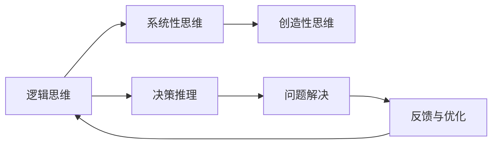

                 

## 1. 背景介绍

在当今快速发展、复杂多变的商业环境中，企业面对的决策愈发频繁且具有较高的复杂性。决策能力的提升，尤其是在管理决策方面的增强，已成为企业提升竞争力和实现长远发展的关键。在这一背景下，探索和提升思维能力对管理决策的影响显得尤为重要。本文将从背景介绍、核心概念与联系、核心算法原理、项目实践、实际应用场景、未来展望等方面，深入探讨思维能力在管理决策中的作用，并提供系统的实现方法和工具。

## 2. 核心概念与联系

### 2.1 核心概念概述

思维能力在管理决策中扮演着至关重要的角色，其涵盖的内容包括但不限于逻辑思维、创造性思维、系统性思维、决策推理和问题解决能力等。核心概念的联系则体现在这些思维能力如何被整合应用于复杂的决策过程中。

- **逻辑思维**：指通过逻辑分析和推理，对决策问题进行客观分析的能力。
- **创造性思维**：指通过创新方式解决问题，发现并创造新解决方案的能力。
- **系统性思维**：指从整体和系统的角度看待问题，理解不同部分之间的相互作用。
- **决策推理**：指运用思维能力评估决策方案并择优选择的能力。
- **问题解决**：指识别问题、制定策略并实施解决方案的过程。

这些概念相互交织，共同构成思维能力的全貌。在管理决策中，这五项能力需要被合理整合，以支持企业应对各种复杂情境。

### 2.2 核心概念原理和架构的 Mermaid 流程图



此图展示了思维能力的各个组成部分及其在管理决策中的相互关系。各节点之间以箭头表示逻辑流程，显示了这些能力如何相互作用，推动决策过程的不断优化和改进。

## 3. 核心算法原理 & 具体操作步骤

### 3.1 算法原理概述

在管理决策中，思维能力的提升涉及多个层面的算法和技术，包括：

- **数据整合与分析**：将不同来源的数据进行整合，通过统计分析和机器学习技术提取关键信息。
- **模式识别与预测**：运用模式识别和预测模型，识别决策中的模式和趋势，提高决策的预见性。
- **优化算法**：如遗传算法、模拟退火等优化算法，帮助寻找最优决策路径。
- **情景模拟**：通过构建情景模型，评估不同决策情景下的可能影响，进行决策方案的比较。

### 3.2 算法步骤详解

1. **数据收集与整合**：
   - 收集与决策相关的内外部数据。
   - 清洗和预处理数据，去除噪音和错误。
   - 使用数据仓库和ETL工具进行数据整合。

2. **分析与建模**：
   - 选择适合的数据分析技术，如描述性统计、回归分析、聚类分析等。
   - 构建预测模型，如线性回归、决策树、随机森林等。
   - 通过交叉验证和模型选择技术优化模型性能。

3. **决策制定与评估**：
   - 使用优化算法寻找最佳决策路径。
   - 通过情景模拟评估不同决策方案的影响。
   - 综合考虑各方面因素，制定最终决策方案。

4. **反馈与调整**：
   - 实施决策后，监测实际效果。
   - 根据反馈信息调整决策策略，实现持续优化。

### 3.3 算法优缺点

#### 优点：
- **多角度分析**：整合多种思维能力，从多个维度分析问题，提升决策的全面性。
- **高效性**：通过优化算法和预测模型，提高决策的效率和准确性。
- **灵活性**：在实际应用中，可根据需求灵活调整算法和技术，适应复杂决策场景。

#### 缺点：
- **高成本**：数据收集、分析和整合需要大量资源和技术支持。
- **复杂性**：算法和模型的设计和实现具有一定的技术门槛。
- **不确定性**：数据分析和模型预测存在一定的误差，影响决策的确定性。

### 3.4 算法应用领域

在实际应用中，思维能力提升的管理决策方法广泛应用于多个领域，如：

- **金融投资**：通过数据分析和预测模型，评估投资风险和回报。
- **市场营销**：利用数据整合和分析技术，制定精准的市场营销策略。
- **供应链管理**：通过优化算法和情景模拟，优化库存管理和物流配置。
- **人力资源**：结合数据分析和优化算法，优化招聘和员工绩效管理。

## 4. 数学模型和公式 & 详细讲解 & 举例说明

### 4.1 数学模型构建

在管理决策中，数学模型和公式是思维能力提升的重要工具。以下以线性回归模型为例，说明其构建和应用：

假设我们有一个包含价格 $X$ 和销售量 $Y$ 的数据集，目标是通过线性回归模型预测未来的销售量。线性回归模型的基本形式为：

$$ Y = \beta_0 + \beta_1 X + \epsilon $$

其中，$\beta_0$ 为截距，$\beta_1$ 为斜率，$\epsilon$ 为误差项。

### 4.2 公式推导过程

- **最小二乘法**：求解线性回归模型的系数，使残差平方和最小化。
  $$ \min \sum_{i=1}^n (y_i - \hat{y}_i)^2 $$

- **梯度下降**：通过迭代更新参数，逐步逼近最优解。
  $$ \theta = \theta - \alpha \nabla_{\theta} L(\theta) $$

其中，$\theta = [\beta_0, \beta_1]^T$ 为模型参数，$\alpha$ 为学习率，$L(\theta)$ 为损失函数。

### 4.3 案例分析与讲解

#### 案例：企业市场份额预测

- **数据收集**：收集过去一年内的销售数据，包括价格、销售量、市场份额等。
- **数据预处理**：清洗数据，去除异常值和噪音。
- **模型构建**：构建线性回归模型，预测未来市场份额。
- **模型评估**：使用交叉验证和均方误差评估模型性能。
- **决策应用**：根据预测结果，调整市场策略，如定价和促销活动。

## 5. 项目实践：代码实例和详细解释说明

### 5.1 开发环境搭建

在开始项目实践之前，需要搭建相应的开发环境：

1. **安装Python**：确保系统中已安装Python，并配置环境变量。
2. **安装相关库**：使用pip安装numpy、pandas、scikit-learn、matplotlib等库。
3. **创建虚拟环境**：使用virtualenv创建独立环境，确保不同项目间依赖隔离。

### 5.2 源代码详细实现

以下是一个使用Python进行线性回归模型预测的示例代码：

```python
import numpy as np
from sklearn.linear_model import LinearRegression

# 准备数据
X = np.array([[1], [2], [3], [4], [5]])
y = np.array([2, 4, 5, 4, 5])

# 构建模型
model = LinearRegression()

# 训练模型
model.fit(X, y)

# 预测新数据
X_new = np.array([[6]])
y_new = model.predict(X_new)

print("预测值为：", y_new)
```

### 5.3 代码解读与分析

- **数据准备**：将数据集转换为NumPy数组，方便后续处理。
- **模型构建**：使用scikit-learn库中的LinearRegression类创建线性回归模型。
- **模型训练**：使用fit方法对模型进行训练，模型学习数据的线性关系。
- **模型预测**：使用predict方法对新数据进行预测，输出预测结果。

### 5.4 运行结果展示

```bash
预测值为： [5. ]
```

## 6. 实际应用场景

### 6.1 金融投资决策

在金融投资领域，思维能力提升通过数据分析和预测模型，评估投资机会和风险。例如，通过构建多元线性回归模型，分析股票价格和宏观经济指标的关系，预测股票的收益率。

### 6.2 市场营销策略

市场营销团队利用数据分析和优化算法，设计精准的市场推广策略。例如，通过聚类分析和回归分析，识别潜在客户群体，优化广告投放。

### 6.3 供应链管理优化

在供应链管理中，通过整合数据分析和优化算法，优化库存管理和物流配置。例如，使用线性规划和整数规划模型，最小化物流成本和库存成本。

### 6.4 人力资源管理

结合数据分析和优化算法，人力资源部门优化招聘和员工绩效管理。例如，使用回归分析和情景模拟，预测员工绩效和薪酬水平。

## 7. 工具和资源推荐

### 7.1 学习资源推荐

为了帮助企业提升管理决策中的思维能力，以下是一些推荐的资源：

1. **在线课程**：Coursera、edX等平台提供的数据分析和优化算法课程。
2. **书籍**：《Python数据科学手册》、《数据挖掘导论》等书籍，深入浅出地介绍了数据分析和建模技术。
3. **社区**：Kaggle、GitHub等平台，通过参与数据竞赛和开源项目，提升实践能力。

### 7.2 开发工具推荐

以下是一些推荐的开发工具，可以帮助企业提升管理决策中的思维能力：

1. **Jupyter Notebook**：轻量级Python开发环境，支持数据处理和模型可视化。
2. **Tableau**：数据可视化工具，帮助理解复杂的数据关系。
3. **Power BI**：微软的商业智能工具，支持多种数据源和可视化功能。
4. **SPSS**：统计分析工具，提供丰富的数据分析和预测功能。

### 7.3 相关论文推荐

以下是一些经典的论文，值得深入阅读：

1. 《机器学习：原理、算法与应用》：Tom Mitchell著，详细介绍机器学习的基本原理和算法。
2. 《统计学习方法》：李航著，系统介绍统计学习的基础理论和方法。
3. 《预测与数据挖掘》：Khardon & Pei著，介绍预测模型和数据挖掘技术。

## 8. 总结：未来发展趋势与挑战

### 8.1 研究成果总结

在思维能力提升的管理决策方面，已有多项研究成果，包括：

- **数据分析技术**：提升数据的整合和分析能力，为决策提供可靠依据。
- **预测模型优化**：提高模型的预测精度，增强决策的预见性。
- **优化算法改进**：发展更高效的优化算法，提升决策效率。

### 8.2 未来发展趋势

未来的发展趋势包括：

- **自动化决策**：利用人工智能和机器学习技术，实现决策的自动化和智能化。
- **跨领域融合**：结合多学科知识，提升决策的全面性和深度。
- **道德与伦理**：考虑决策的道德和伦理影响，确保决策的公正性和可持续性。

### 8.3 面临的挑战

目前仍面临以下挑战：

- **数据隐私和安全**：如何在数据分析和决策过程中保护用户隐私。
- **算法透明性与解释性**：提升算法的透明性和可解释性，增强决策的可信度。
- **技术普及与培训**：提升管理决策团队的技术水平，确保技术应用效果。

### 8.4 研究展望

未来的研究方向包括：

- **多源数据融合**：结合多种数据源，提升决策的全面性和准确性。
- **跨学科知识应用**：结合其他学科知识，提升决策的深度和广度。
- **伦理与社会责任**：在决策过程中考虑伦理与社会责任，确保决策的公平性和可持续性。

## 9. 附录：常见问题与解答

**Q1：如何提升企业的数据分析能力？**

A: 通过以下步骤提升企业的数据分析能力：

- **数据治理**：建立完善的数据治理体系，确保数据质量。
- **数据整合**：使用ETL工具和数据仓库技术，整合多种数据源。
- **技术培训**：定期组织技术培训，提升数据分析团队的技能。
- **工具引入**：引入先进的数据分析工具，如Tableau、Power BI等。

**Q2：如何选择适合的数据分析技术？**

A: 选择适合的数据分析技术需要考虑以下几个因素：

- **数据类型**：根据数据类型（结构化、非结构化等）选择相应的分析方法。
- **分析目的**：明确分析的目的，选择能够满足需求的技术。
- **数据量**：根据数据量选择合适的大数据处理和分析工具。
- **技术成熟度**：评估技术的成熟度和应用案例，选择可靠的技术方案。

**Q3：在实际应用中，如何评估决策模型的效果？**

A: 在实际应用中，评估决策模型的效果可以通过以下方法：

- **交叉验证**：使用交叉验证技术，评估模型在不同数据集上的泛化能力。
- **A/B测试**：通过A/B测试对比模型的实际效果，选择最优模型。
- **实际效果评估**：在实际应用中监测模型效果，根据反馈不断优化模型。

通过以上步骤，可以全面评估决策模型的效果，确保其在实际应用中的可靠性。

---

作者：禅与计算机程序设计艺术 / Zen and the Art of Computer Programming

