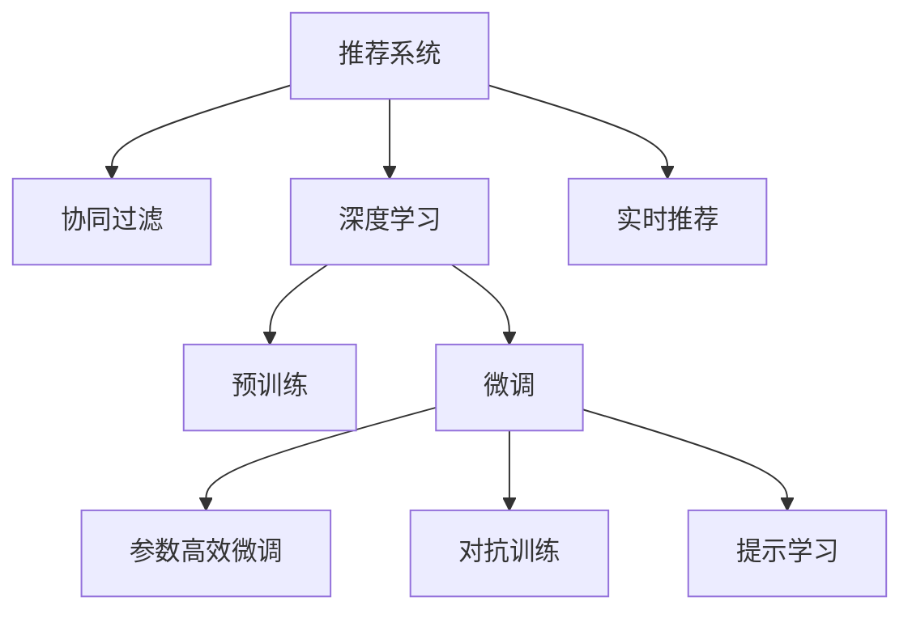

                 

# 总结与展望：大模型在推荐系统中的未来趋势

## 1. 背景介绍

### 1.1 问题由来

推荐系统是当前互联网应用中不可或缺的组成部分，广泛应用于电商、社交、新闻等众多领域。传统推荐系统主要依赖用户行为数据进行推荐，但随着数据量的急剧膨胀和推荐场景的日益丰富，传统的协同过滤等推荐方法已难以满足需求。近年来，基于深度学习的推荐技术逐渐兴起，通过大规模神经网络模型挖掘用户隐式兴趣，提高推荐效果和个性化水平。

在大模型盛行的背景下，基于预训练的深度学习推荐系统成为了新的研究热点。这些系统通过在大规模无标签数据上进行预训练，学习到通用的用户行为表示和物品特征表示，再在少量标注数据上进行微调，能够更加准确地捕捉用户兴趣，生成个性化推荐。

然而，大模型在推荐系统中的应用仍处于初级阶段。如何在大规模语料中提取有效信息，如何在微调过程中避免过拟合，如何高效优化模型，这些问题的解决仍需进一步探索。本文将系统总结大模型在推荐系统中的研究成果，并展望其未来的发展趋势。

### 1.2 问题核心关键点

当前大模型在推荐系统中的应用，主要集中在以下几个关键点：

1. 预训练和微调：通过大规模语料进行预训练，再利用少量标注数据进行微调，提取用户和物品的隐式特征。
2. 参数高效微调：为避免大模型的过拟合，只微调模型的一部分参数。
3. 对抗训练：通过加入对抗样本，增强推荐系统的鲁棒性和泛化能力。
4. 提示学习：使用精心设计的输入模板，引导大模型进行推理，提高推荐系统的泛化性和可解释性。
5. 实时推荐：在大规模数据集上进行预训练，再在在线环境中进行微调，提升实时推荐性能。

这些关键点构成了大模型在推荐系统中的核心框架，但如何高效、准确地应用这些技术，仍需结合具体问题进行深入研究。

## 2. 核心概念与联系

### 2.1 核心概念概述

为更好地理解大模型在推荐系统中的研究和应用，本节将介绍几个密切相关的核心概念：

- 推荐系统(Recommendation System)：通过用户行为数据，推荐用户可能感兴趣的商品、内容等物品的系统。
- 协同过滤(Collaborative Filtering)：利用用户-物品交互数据进行推荐，基于用户间的相似性或物品间的相似性，生成推荐。
- 深度学习(Deep Learning)：通过多层神经网络进行建模，学习数据中的复杂特征表示。
- 预训练(Pre-training)：在无标签数据上，通过自监督任务训练通用模型。
- 微调(Fine-tuning)：在预训练模型的基础上，通过有监督任务进行特定领域的优化。
- 参数高效微调(Parameter-Efficient Fine-tuning, PEFT)：只微调模型的一部分参数，避免过拟合。
- 对抗训练(Adversarial Training)：在训练过程中引入对抗样本，提高模型的鲁棒性。
- 提示学习(Prompt Learning)：通过输入模板引导模型进行推理，提升模型的泛化能力和可解释性。
- 实时推荐(Real-time Recommendation)：在在线环境中进行微调，提高推荐的实时性。

这些核心概念之间的逻辑关系可以通过以下Mermaid流程图来展示：



这个流程图展示了大模型在推荐系统中的核心概念及其之间的关系：

1. 推荐系统通过协同过滤等方法进行推荐，但深度学习逐渐成为新的趋势。
2. 深度学习推荐系统主要通过预训练-微调的方法提取用户和物品的隐式特征。
3. 微调可以通过参数高效、对抗训练、提示学习等方法提高模型的性能和泛化能力。
4. 实时推荐通过在在线环境中进行微调，提高推荐系统的实时性。

这些概念共同构成了大模型在推荐系统中的应用框架，使其能够更高效、准确地提取用户兴趣，生成个性化推荐。

## 3. 核心算法原理 & 具体操作步骤
### 3.1 算法原理概述

基于深度学习的大模型推荐系统，主要通过以下步骤进行：

1. 预训练：在大规模无标签数据上进行预训练，学习通用特征表示。
2. 微调：利用少量标注数据，进行特定领域的优化，提取用户和物品的隐式特征。
3. 参数高效微调：只微调模型的一部分参数，避免过拟合。
4. 对抗训练：在训练过程中引入对抗样本，提高模型的鲁棒性。
5. 提示学习：通过输入模板引导模型进行推理，提升模型的泛化能力和可解释性。
6. 实时推荐：在在线环境中进行微调，提高推荐的实时性。

以下将详细讲解这些步骤的具体操作和优缺点。

### 3.2 算法步骤详解

#### 3.2.1 预训练

预训练步骤主要包括以下几个步骤：

1. 数据准备：收集大规模无标签数据，如Web浏览记录、电商平台购买记录等。
2. 数据预处理：对数据进行清洗、归一化等处理，确保数据质量。
3. 模型选择：选择合适的预训练模型，如BERT、GPT等，初始化模型参数。
4. 预训练任务：选择合适的预训练任务，如语言模型、掩码预测等。
5. 模型训练：在大规模数据集上进行预训练，学习通用特征表示。

#### 3.2.2 微调

微调步骤主要包括以下几个步骤：

1. 数据准备：收集少量标注数据，如用户评分、浏览记录等。
2. 模型初始化：利用预训练模型作为初始化参数。
3. 模型适配：根据推荐任务，设计合适的任务适配层。
4. 优化器选择：选择合适的优化器，如Adam、SGD等。
5. 学习率设置：选择合适的学习率，一般比预训练时小1-2个数量级。
6. 正则化：使用L2正则、Dropout等正则化技术，避免过拟合。
7. 模型训练：在标注数据上，通过有监督学习优化模型。

#### 3.2.3 参数高效微调

参数高效微调主要包括以下几个步骤：

1. 参数选择：选择需要微调的参数，如顶层分类器、解码器等。
2. 冻结预训练参数：冻结预训练模型的底层参数，只微调顶层。
3. 微调训练：使用小学习率，更新需要微调的参数，避免破坏预训练权重。

#### 3.2.4 对抗训练

对抗训练主要包括以下几个步骤：

1. 数据生成：生成对抗样本，如将正常样本添加噪声。
2. 对抗样本训练：将对抗样本与正常样本混合，进行训练。
3. 对抗模型训练：在对抗样本训练的基础上，进行鲁棒性评估。
4. 鲁棒模型微调：在对抗模型上，进行特定领域的微调。

#### 3.2.5 提示学习

提示学习主要包括以下几个步骤：

1. 提示模板设计：设计精心设计的输入模板，如"请推荐一本好书"。
2. 模型推理：利用输入模板，引导大模型进行推理。
3. 提示模型微调：在提示模型上，进行特定领域的微调。

#### 3.2.6 实时推荐

实时推荐主要包括以下几个步骤：

1. 在线数据收集：实时收集用户行为数据。
2. 在线微调：在在线数据上，进行实时微调。
3. 实时推荐：根据实时微调后的模型，生成推荐结果。

### 3.3 算法优缺点

基于深度学习的大模型推荐系统具有以下优点：

1. 灵活高效：可以通过预训练-微调的方式，灵活提取用户和物品的隐式特征，适应各种推荐场景。
2. 泛化能力强：大模型学习到通用的特征表示，具有较强的泛化能力，可以处理复杂的推荐场景。
3. 可解释性高：通过输入模板和提示学习，提升模型的可解释性，帮助理解推荐逻辑。

同时，该方法也存在以下局限性：

1. 数据需求高：微调过程中需要大量的标注数据，对数据质量和数量的要求较高。
2. 模型复杂度高：大模型的复杂度高，需要高算力进行训练和推理。
3. 对抗性差：微调过程中，对抗样本的引入可能导致模型性能波动。
4. 实时性低：在线微调需要大量的计算资源，难以实现实时推荐。

尽管存在这些局限性，但就目前而言，基于深度学习的大模型推荐系统仍是大数据推荐的重要范式。未来相关研究的重点在于如何进一步降低数据需求，提高模型的实时性和鲁棒性，同时兼顾可解释性和工程可操作性等因素。

### 3.4 算法应用领域

基于大模型的推荐系统，已经在电商、社交、新闻等众多领域得到广泛应用，具体如下：

1. 电商推荐：利用大模型对用户行为和物品特征进行建模，生成个性化推荐。
2. 社交推荐：对用户社交关系和兴趣进行建模，生成个性化的社交内容推荐。
3. 新闻推荐：根据用户阅读行为和兴趣，生成个性化新闻内容推荐。
4. 视频推荐：对用户观看行为和视频特征进行建模，生成个性化视频推荐。
5. 音乐推荐：利用大模型对用户音乐品味进行建模，生成个性化音乐推荐。

除了以上领域，大模型推荐系统还可以拓展到更多场景，如智能家居、智慧医疗、智能交通等，为各个行业的智能化发展提供新思路。

## 4. 数学模型和公式 & 详细讲解 & 举例说明

### 4.1 数学模型构建

设推荐系统的输入为 $x$，输出为 $y$，则推荐模型的预测函数为 $M_{\theta}(x)$，其中 $\theta$ 为模型参数。推荐任务通常为回归或分类任务，对应的损失函数为 $L(y,M_{\theta}(x))$。

假设推荐系统在标注数据集 $D=\{(x_i,y_i)\}_{i=1}^N$ 上进行微调，其优化目标为最小化经验风险：

$$
\mathcal{L}(\theta) = \frac{1}{N} \sum_{i=1}^N L(y_i,M_{\theta}(x_i))
$$

优化目标可以通过梯度下降等方法进行求解：

$$
\theta \leftarrow \theta - \eta \nabla_{\theta}\mathcal{L}(\theta)
$$

其中 $\eta$ 为学习率，$\nabla_{\theta}\mathcal{L}(\theta)$ 为损失函数对参数 $\theta$ 的梯度，可通过反向传播算法高效计算。

### 4.2 公式推导过程

以回归任务为例，假设推荐模型 $M_{\theta}$ 在输入 $x$ 上的输出为 $\hat{y}=M_{\theta}(x)$，真实标签为 $y$。则回归任务的损失函数定义为均方误差：

$$
L(y,M_{\theta}(x)) = \frac{1}{2}(y - M_{\theta}(x))^2
$$

将其代入经验风险公式，得：

$$
\mathcal{L}(\theta) = \frac{1}{N} \sum_{i=1}^N \frac{1}{2}(y_i - M_{\theta}(x_i))^2
$$

根据链式法则，损失函数对参数 $\theta_k$ 的梯度为：

$$
\frac{\partial \mathcal{L}(\theta)}{\partial \theta_k} = \sum_{i=1}^N -(y_i - M_{\theta}(x_i))\frac{\partial M_{\theta}(x_i)}{\partial \theta_k}
$$

其中 $\frac{\partial M_{\theta}(x_i)}{\partial \theta_k}$ 可进一步递归展开，利用自动微分技术完成计算。

在得到损失函数的梯度后，即可带入参数更新公式，完成模型的迭代优化。重复上述过程直至收敛，最终得到适应推荐任务的最优模型参数 $\theta^*$。

## 5. 项目实践：代码实例和详细解释说明
### 5.1 开发环境搭建

在进行推荐系统开发前，我们需要准备好开发环境。以下是使用Python进行PyTorch开发的环境配置流程：

1. 安装Anaconda：从官网下载并安装Anaconda，用于创建独立的Python环境。

2. 创建并激活虚拟环境：
```bash
conda create -n recommendation-env python=3.8 
conda activate recommendation-env
```

3. 安装PyTorch：根据CUDA版本，从官网获取对应的安装命令。例如：
```bash
conda install pytorch torchvision torchaudio cudatoolkit=11.1 -c pytorch -c conda-forge
```

4. 安装Transformers库：
```bash
pip install transformers
```

5. 安装各类工具包：
```bash
pip install numpy pandas scikit-learn matplotlib tqdm jupyter notebook ipython
```

完成上述步骤后，即可在`recommendation-env`环境中开始推荐系统开发。

### 5.2 源代码详细实现

下面我们以电影推荐系统为例，给出使用Transformers库对BERT模型进行推荐系统开发的PyTorch代码实现。

首先，定义推荐系统的数据处理函数：

```python
from transformers import BertTokenizer
from torch.utils.data import Dataset
import torch

class MovieRecommendationDataset(Dataset):
    def __init__(self, texts, ratings, tokenizer, max_len=128):
        self.texts = texts
        self.ratings = ratings
        self.tokenizer = tokenizer
        self.max_len = max_len
        
    def __len__(self):
        return len(self.texts)
    
    def __getitem__(self, item):
        text = self.texts[item]
        rating = self.ratings[item]
        
        encoding = self.tokenizer(text, return_tensors='pt', max_length=self.max_len, padding='max_length', truncation=True)
        input_ids = encoding['input_ids'][0]
        attention_mask = encoding['attention_mask'][0]
        
        # 对token-wise的评分进行编码
        encoded_ratings = [rating for _ in range(self.max_len)]
        labels = torch.tensor(encoded_ratings, dtype=torch.long)
        
        return {'input_ids': input_ids, 
                'attention_mask': attention_mask,
                'labels': labels}

# 评分与id的映射
rating2id = {'1': 0, '2': 1, '3': 2, '4': 3, '5': 4}
id2rating = {v: k for k, v in rating2id.items()}

# 创建dataset
tokenizer = BertTokenizer.from_pretrained('bert-base-cased')

train_dataset = MovieRecommendationDataset(train_texts, train_ratings, tokenizer)
dev_dataset = MovieRecommendationDataset(dev_texts, dev_ratings, tokenizer)
test_dataset = MovieRecommendationDataset(test_texts, test_ratings, tokenizer)
```

然后，定义模型和优化器：

```python
from transformers import BertForRegression, AdamW

model = BertForRegression.from_pretrained('bert-base-cased')

optimizer = AdamW(model.parameters(), lr=2e-5)
```

接着，定义训练和评估函数：

```python
from torch.utils.data import DataLoader
from tqdm import tqdm
from sklearn.metrics import mean_squared_error

device = torch.device('cuda') if torch.cuda.is_available() else torch.device('cpu')
model.to(device)

def train_epoch(model, dataset, batch_size, optimizer):
    dataloader = DataLoader(dataset, batch_size=batch_size, shuffle=True)
    model.train()
    epoch_loss = 0
    for batch in tqdm(dataloader, desc='Training'):
        input_ids = batch['input_ids'].to(device)
        attention_mask = batch['attention_mask'].to(device)
        labels = batch['labels'].to(device)
        model.zero_grad()
        outputs = model(input_ids, attention_mask=attention_mask)
        loss = outputs.loss
        epoch_loss += loss.item()
        loss.backward()
        optimizer.step()
    return epoch_loss / len(dataloader)

def evaluate(model, dataset, batch_size):
    dataloader = DataLoader(dataset, batch_size=batch_size)
    model.eval()
    preds, labels = [], []
    with torch.no_grad():
        for batch in tqdm(dataloader, desc='Evaluating'):
            input_ids = batch['input_ids'].to(device)
            attention_mask = batch['attention_mask'].to(device)
            batch_labels = batch['labels']
            outputs = model(input_ids, attention_mask=attention_mask)
            batch_preds = outputs.logits.mean(dim=-1).to('cpu').tolist()
            batch_labels = batch_labels.to('cpu').tolist()
            for pred, label in zip(batch_preds, batch_labels):
                preds.append(pred)
                labels.append(label)
                
    print(mean_squared_error(labels, preds))
```

最后，启动训练流程并在测试集上评估：

```python
epochs = 5
batch_size = 16

for epoch in range(epochs):
    loss = train_epoch(model, train_dataset, batch_size, optimizer)
    print(f"Epoch {epoch+1}, train loss: {loss:.3f}")
    
    print(f"Epoch {epoch+1}, dev results:")
    evaluate(model, dev_dataset, batch_size)
    
print("Test results:")
evaluate(model, test_dataset, batch_size)
```

以上就是使用PyTorch对BERT进行电影推荐系统微调的完整代码实现。可以看到，得益于Transformers库的强大封装，我们可以用相对简洁的代码完成BERT模型的加载和微调。

### 5.3 代码解读与分析

让我们再详细解读一下关键代码的实现细节：

**MovieRecommendationDataset类**：
- `__init__`方法：初始化文本、评分、分词器等关键组件。
- `__len__`方法：返回数据集的样本数量。
- `__getitem__`方法：对单个样本进行处理，将文本输入编码为token ids，将评分编码为数字，并对其进行定长padding，最终返回模型所需的输入。

**rating2id和id2rating字典**：
- 定义了评分与数字id之间的映射关系，用于将token-wise的评分结果解码回真实的评分。

**训练和评估函数**：
- 使用PyTorch的DataLoader对数据集进行批次化加载，供模型训练和推理使用。
- 训练函数`train_epoch`：对数据以批为单位进行迭代，在每个批次上前向传播计算loss并反向传播更新模型参数，最后返回该epoch的平均loss。
- 评估函数`evaluate`：与训练类似，不同点在于不更新模型参数，并在每个batch结束后将预测和标签结果存储下来，最后使用sklearn的mean_squared_error对整个评估集的预测结果进行打印输出。

**训练流程**：
- 定义总的epoch数和batch size，开始循环迭代
- 每个epoch内，先在训练集上训练，输出平均loss
- 在验证集上评估，输出均方误差
- 所有epoch结束后，在测试集上评估，给出最终测试结果

可以看到，PyTorch配合Transformers库使得BERT微调的代码实现变得简洁高效。开发者可以将更多精力放在数据处理、模型改进等高层逻辑上，而不必过多关注底层的实现细节。

当然，工业级的系统实现还需考虑更多因素，如模型的保存和部署、超参数的自动搜索、更灵活的任务适配层等。但核心的微调范式基本与此类似。

## 6. 实际应用场景

### 6.1 电商推荐系统

基于大语言模型微调的推荐系统，可以广泛应用于电商推荐系统中。传统电商推荐系统主要依赖用户行为数据进行推荐，但随着数据量的急剧膨胀和推荐场景的日益丰富，传统的协同过滤等推荐方法已难以满足需求。通过大模型微调，可以更高效地提取用户和物品的隐式特征，生成个性化推荐。

在技术实现上，可以收集电商用户的历史浏览、购买行为数据，将物品描述作为输入，用户的后续行为作为监督信号，在此基础上对预训练语言模型进行微调。微调后的模型能够自动理解用户的兴趣点，生成更加个性化的推荐结果。此外，还可以引入对抗训练、提示学习等技术，提升推荐系统的鲁棒性和可解释性。

### 6.2 智能广告推荐系统

智能广告推荐系统需要根据用户的浏览行为和兴趣爱好，智能推荐相关广告，提升广告投放效果。通过大模型微调，可以更准确地捕捉用户兴趣，生成个性化的广告推荐。

在技术实现上，可以收集用户的历史浏览记录、兴趣标签等数据，将广告描述作为输入，用户的后续行为作为监督信号，在此基础上对预训练语言模型进行微调。微调后的模型能够自动理解用户的兴趣点，生成更加个性化的广告推荐。此外，还可以引入对抗训练、提示学习等技术，提升推荐系统的鲁棒性和可解释性。

### 6.3 内容推荐系统

内容推荐系统需要根据用户的阅读习惯和兴趣爱好，智能推荐相关内容，提升用户体验。通过大模型微调，可以更高效地提取用户和内容的隐式特征，生成个性化内容推荐。

在技术实现上，可以收集用户的历史阅读记录、兴趣标签等数据，将内容描述作为输入，用户的后续行为作为监督信号，在此基础上对预训练语言模型进行微调。微调后的模型能够自动理解用户的兴趣点，生成更加个性化的内容推荐。此外，还可以引入对抗训练、提示学习等技术，提升推荐系统的鲁棒性和可解释性。

### 6.4 未来应用展望

随着大语言模型微调技术的发展，其在推荐系统中的应用前景将更加广阔。未来，大模型推荐系统将在更多领域得到应用，为传统行业带来变革性影响：

1. 智慧医疗推荐系统：利用大模型对用户健康数据进行建模，推荐合适的健康产品或服务。
2. 金融推荐系统：根据用户投资行为和兴趣，推荐合适的金融产品或服务。
3. 教育推荐系统：根据学生学习行为和兴趣，推荐合适的教育资源或课程。
4. 旅游推荐系统：根据用户旅游行为和兴趣，推荐合适的旅游线路或目的地。
5. 娱乐推荐系统：根据用户娱乐行为和兴趣，推荐合适的电影、音乐、游戏等娱乐内容。

这些应用场景展示了大语言模型微调在推荐系统中的广阔前景，未来随着技术的不断进步，将会有更多创新性应用涌现。

## 7. 工具和资源推荐
### 7.1 学习资源推荐

为了帮助开发者系统掌握大模型在推荐系统中的应用，这里推荐一些优质的学习资源：

1. 《Deep Learning for Recommendation Systems》书籍：介绍深度学习在推荐系统中的应用，包括预训练-微调等方法。
2. CS225《Recommender Systems》课程：斯坦福大学开设的推荐系统课程，有Lecture视频和配套作业，带你系统学习推荐系统的基本概念和经典算法。
3. HuggingFace官方文档：提供丰富的预训练语言模型和微调样例代码，是学习大模型推荐系统的必备资料。
4. Kaggle推荐系统竞赛：通过参加竞赛，实战练习推荐系统开发的技巧和算法，积累经验。
5. Weights & Biases：用于模型训练的实验跟踪工具，可以记录和可视化模型训练过程中的各项指标，方便对比和调优。

通过对这些资源的学习实践，相信你一定能够快速掌握大模型在推荐系统中的应用技巧，并用于解决实际的推荐问题。

### 7.2 开发工具推荐

高效的开发离不开优秀的工具支持。以下是几款用于大模型推荐系统开发的常用工具：

1. PyTorch：基于Python的开源深度学习框架，灵活动态的计算图，适合快速迭代研究。大部分预训练语言模型都有PyTorch版本的实现。
2. TensorFlow：由Google主导开发的开源深度学习框架，生产部署方便，适合大规模工程应用。同样有丰富的预训练语言模型资源。
3. Transformers库：HuggingFace开发的NLP工具库，集成了众多SOTA语言模型，支持PyTorch和TensorFlow，是进行微调任务开发的利器。
4. Weights & Biases：模型训练的实验跟踪工具，可以记录和可视化模型训练过程中的各项指标，方便对比和调优。
5. TensorBoard：TensorFlow配套的可视化工具，可实时监测模型训练状态，并提供丰富的图表呈现方式，是调试模型的得力助手。
6. Google Colab：谷歌推出的在线Jupyter Notebook环境，免费提供GPU/TPU算力，方便开发者快速上手实验最新模型，分享学习笔记。

合理利用这些工具，可以显著提升大模型推荐系统的开发效率，加快创新迭代的步伐。

### 7.3 相关论文推荐

大语言模型和推荐系统的发展源于学界的持续研究。以下是几篇奠基性的相关论文，推荐阅读：

1. Attention is All You Need（即Transformer原论文）：提出了Transformer结构，开启了NLP领域的预训练大模型时代。
2. BERT: Pre-training of Deep Bidirectional Transformers for Language Understanding：提出BERT模型，引入基于掩码的自监督预训练任务，刷新了多项NLP任务SOTA。
3. Deep Neural Networks for Large-scale Recommendation：提出深度神经网络在推荐系统中的应用，刷新了协同过滤等经典方法的性能。
4. Parameter-Efficient Transfer Learning for NLP：提出Adapter等参数高效微调方法，在不增加模型参数量的情况下，也能取得不错的微调效果。
5. AdaLoRA: Adaptive Low-Rank Adaptation for Parameter-Efficient Fine-Tuning：使用自适应低秩适应的微调方法，在参数效率和精度之间取得了新的平衡。
6. Knowledge Distillation：提出知识蒸馏方法，通过老师模型与学生模型的结合，提升模型的泛化能力。

这些论文代表了大语言模型在推荐系统中的应用进展，通过学习这些前沿成果，可以帮助研究者把握学科前进方向，激发更多的创新灵感。

## 8. 总结：未来发展趋势与挑战

### 8.1 总结

本文对基于深度学习的大模型在推荐系统中的研究成果进行了全面系统的总结。首先系统回顾了推荐系统的基本概念和深度学习在推荐系统中的应用。其次，详细讲解了预训练-微调的大模型推荐系统流程，包括预训练、微调、参数高效微调、对抗训练、提示学习等关键步骤。最后，探讨了微调技术在电商、智能广告、内容推荐等领域的应用，展望了未来发展趋势和挑战。

通过本文的系统梳理，可以看到，基于深度学习的大模型在推荐系统中具有广阔的应用前景，能够更高效地提取用户兴趣和物品特征，生成个性化推荐。未来，随着大模型技术的不断进步，将会有更多创新性应用涌现，为各个行业带来变革性影响。

### 8.2 未来发展趋势

展望未来，大模型在推荐系统中的应用将呈现以下几个发展趋势：

1. 多模态融合：将视觉、语音、文本等多模态数据进行融合，提升推荐系统的泛化能力和个性化水平。
2. 动态实时推荐：在在线环境中进行动态实时微调，提升推荐系统的实时性。
3. 知识增强：将符号化的先验知识，如知识图谱、逻辑规则等，与神经网络模型进行融合，提升推荐系统的解释性和可信度。
4. 自适应推荐：根据用户行为和环境变化，动态调整推荐策略，提升推荐系统的灵活性和适应性。
5. 对抗性推荐：在推荐过程中引入对抗样本，提升推荐系统的鲁棒性和安全性。
6. 跨领域推荐：将推荐系统应用到不同领域，如医疗、金融、教育等，为不同行业带来智能化变革。

以上趋势凸显了大模型在推荐系统中的应用前景，未来随着技术的不断进步，将会有更多创新性应用涌现，为各个行业带来变革性影响。

### 8.3 面临的挑战

尽管大模型在推荐系统中的应用取得了初步成功，但在迈向更加智能化、普适化应用的过程中，仍面临诸多挑战：

1. 数据需求高：微调过程中需要大量的标注数据，对数据质量和数量的要求较高。
2. 模型复杂度高：大模型的复杂度高，需要高算力进行训练和推理。
3. 对抗性差：微调过程中，对抗样本的引入可能导致模型性能波动。
4. 实时性低：在线微调需要大量的计算资源，难以实现实时推荐。
5. 可解释性不足：大模型的决策过程缺乏可解释性，难以对其推理逻辑进行分析和调试。
6. 安全性有待保障：预训练模型可能学习到有害信息，通过微调传递到推荐系统，产生误导性输出，给实际应用带来安全隐患。

尽管存在这些挑战，但通过不断创新和优化，相信大模型推荐系统能够进一步提升性能和泛化能力，推动推荐技术的不断进步。

### 8.4 研究展望

未来，推荐系统的研究需要在以下几个方面进行探索：

1. 数据高效利用：如何降低微调对标注数据的依赖，从无监督、半监督等角度提升推荐系统的泛化能力。
2. 模型轻量化：如何设计轻量级的模型架构，提升推荐系统的实时性和可部署性。
3. 参数高效微调：如何设计参数高效微调方法，提升推荐系统的泛化能力和可解释性。
4. 对抗性推荐：如何设计具有鲁棒性的推荐系统，应对恶意样本的攻击。
5. 可解释性增强：如何设计可解释性强的推荐系统，提高用户对推荐结果的信任度。
6. 安全性保障：如何在推荐系统中融入伦理和安全约束，确保推荐内容的公正性和无害性。

这些研究方向需要多学科的交叉合作，共同推动推荐系统的进步。相信随着学界和产业界的共同努力，大模型推荐系统必将实现更加智能化、普适化的应用，带来深远的社会和经济价值。

## 9. 附录：常见问题与解答

**Q1：大模型微调是否适用于所有推荐任务？**

A: 大模型微调在大多数推荐任务上都能取得不错的效果，特别是对于数据量较小的任务。但对于一些特定领域的任务，如医学、法律等，仅仅依靠通用语料预训练的模型可能难以很好地适应。此时需要在特定领域语料上进一步预训练，再进行微调，才能获得理想效果。此外，对于一些需要时效性、个性化很强的任务，如对话、推荐等，微调方法也需要针对性的改进优化。

**Q2：微调过程中如何选择合适的学习率？**

A: 微调的学习率一般要比预训练时小1-2个数量级，如果使用过大的学习率，容易破坏预训练权重，导致过拟合。一般建议从1e-5开始调参，逐步减小学习率，直至收敛。也可以使用warmup策略，在开始阶段使用较小的学习率，再逐渐过渡到预设值。需要注意的是，不同的优化器(如AdamW、Adafactor等)以及不同的学习率调度策略，可能需要设置不同的学习率阈值。

**Q3：采用大模型微调时会面临哪些资源瓶颈？**

A: 目前主流的预训练大模型动辄以亿计的参数规模，对算力、内存、存储都提出了很高的要求。GPU/TPU等高性能设备是必不可少的，但即便如此，超大批次的训练和推理也可能遇到显存不足的问题。因此需要采用一些资源优化技术，如梯度积累、混合精度训练、模型并行等，来突破硬件瓶颈。同时，模型的存储和读取也可能占用大量时间和空间，需要采用模型压缩、稀疏化存储等方法进行优化。

**Q4：如何缓解微调过程中的过拟合问题？**

A: 过拟合是微调面临的主要挑战，尤其是在标注数据不足的情况下。常见的缓解策略包括：
1. 数据增强：通过回译、近义替换等方式扩充训练集
2. 正则化：使用L2正则、Dropout、Early Stopping等避免过拟合
3. 对抗训练：引入对抗样本，提高模型的鲁棒性
4. 参数高效微调：只微调模型的一部分参数
5. 多模型集成：训练多个微调模型，取平均输出

这些策略往往需要根据具体任务和数据特点进行灵活组合。只有在数据、模型、训练、推理等各环节进行全面优化，才能最大限度地发挥大模型微调的威力。

**Q5：微调模型在落地部署时需要注意哪些问题？**

A: 将微调模型转化为实际应用，还需要考虑以下因素：
1. 模型裁剪：去除不必要的层和参数，减小模型尺寸，加快推理速度
2. 量化加速：将浮点模型转为定点模型，压缩存储空间，提高计算效率
3. 服务化封装：将模型封装为标准化服务接口，便于集成调用
4. 弹性伸缩：根据请求流量动态调整资源配置，平衡服务质量和成本
5. 监控告警：实时采集系统指标，设置异常告警阈值，确保服务稳定性
6. 安全防护：采用访问鉴权、数据脱敏等措施，保障数据和模型安全

大模型微调为推荐系统提供了强大的技术支持，但如何将强大的性能转化为稳定、高效、安全的业务价值，还需要工程实践的不断打磨。唯有从数据、算法、工程、业务等多个维度协同发力，才能真正实现人工智能技术在推荐系统中的落地应用。

---

作者：禅与计算机程序设计艺术 / Zen and the Art of Computer Programming

