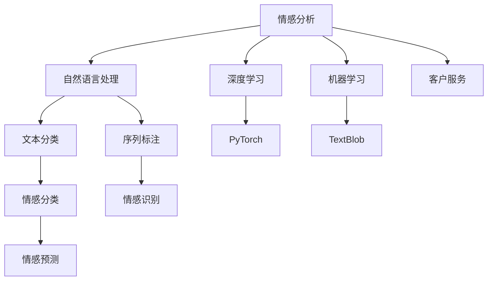

                 

# 情感分析在客户服务中的应用

> 关键词：情感分析,客户服务,自然语言处理(NLP),机器学习,深度学习,PyTorch,TextBlob,微调,情感识别,服务质量

## 1. 背景介绍

在快速变化的商业环境中，客户服务作为企业与客户直接接触的接口，其质量直接关系到客户满意度和企业口碑。情感分析作为一种自然语言处理技术，能够从客户反馈中自动识别情感倾向，辅助企业及时识别和解决客户问题，提升客户满意度。本文将详细介绍情感分析在客户服务中的应用，涵盖情感识别、情感分类、情感预测等方面的关键技术，并通过实战项目展示其实际效果。

## 2. 核心概念与联系

### 2.1 核心概念概述

- **情感分析(Sentiment Analysis)**：通过自然语言处理和机器学习技术，自动识别文本中的情感倾向，通常分为正面、负面和中性。
- **客户服务(Customer Service)**：企业通过客服热线、在线聊天、社交媒体等方式，提供咨询、投诉、售后支持等服务，旨在提升客户满意度。
- **自然语言处理(Natural Language Processing, NLP)**：涉及语言模型、文本分类、序列标注等技术，是实现情感分析的核心手段。
- **机器学习(Machine Learning, ML)**：利用数据驱动的方法，训练模型自动识别文本情感，是情感分析的重要技术。
- **深度学习(Deep Learning, DL)**：一种模拟人脑神经网络的计算模型，能够处理大规模、高维度的数据，适用于情感分析等复杂任务。
- **PyTorch**：一个开源的深度学习框架，提供动态计算图和强大的GPU加速，适合构建高效的情感分析模型。
- **TextBlob**：基于NLTK的Python库，提供了简单的API接口，支持情感极性分析等NLP任务。

这些概念之间的联系通过以下Mermaid流程图展示：



## 3. 核心算法原理 & 具体操作步骤

### 3.1 算法原理概述

情感分析的原理是通过机器学习算法训练模型，从文本中提取情感特征，并根据预设的情感分类器进行分类。常见的算法包括朴素贝叶斯(Naive Bayes)、支持向量机(SVM)、卷积神经网络(CNN)、循环神经网络(RNN)、长短时记忆网络(LSTM)和Transformer模型等。

情感分析的基本流程包括数据预处理、特征提取、模型训练和预测等步骤。在数据预处理阶段，需要对文本进行分词、去除停用词、词形还原等操作。特征提取阶段，可以采用词袋模型(Bag of Words)、TF-IDF、word2vec、GloVe等技术。模型训练阶段，通常使用交叉熵损失函数，通过反向传播算法优化模型参数。预测阶段，将新文本输入模型，输出情感标签。

### 3.2 算法步骤详解

情感分析的详细步骤包括以下几个关键环节：

**Step 1: 数据准备与预处理**
- 收集客户服务相关的文本数据，如客服聊天记录、客户评价、社交媒体评论等。
- 对文本进行清洗，去除HTML标签、非文本内容、特殊符号等。
- 分词，将文本转化为单词序列。
- 去除停用词，如“的”、“是”、“在”等常见无意义词语。
- 词形还原，将同义词、变形词统一为标准形式。

**Step 2: 特征提取**
- 构建词汇表，将单词转化为整数编码。
- 计算TF-IDF权重，衡量单词在文档中的重要性。
- 使用预训练的词向量模型，如word2vec、GloVe等，将单词转化为高维向量。

**Step 3: 模型训练**
- 选择合适的算法和参数，如CNN、LSTM、Transformer等。
- 分割训练集和验证集，设定合适的超参数，如学习率、批大小、迭代轮数等。
- 使用交叉熵损失函数，通过反向传播算法优化模型参数。

**Step 4: 模型评估与优化**
- 在验证集上评估模型性能，如准确率、召回率、F1-score等指标。
- 调整超参数和模型结构，进行网格搜索或随机搜索，优化模型效果。
- 在测试集上再次评估模型，确保模型的泛化能力。

**Step 5: 预测与反馈**
- 将新的客户服务文本输入模型，输出情感标签。
- 分析客户情感，生成反馈报告，帮助企业识别问题并进行改进。

### 3.3 算法优缺点

情感分析在客户服务中的应用具有以下优点：
- **高效自动化**：利用机器学习算法自动化文本情感分析，减少了人工标注的劳动成本。
- **实时响应**：能够实时监测客户反馈，及时识别并解决客户问题。
- **多渠道支持**：支持多种数据源，如聊天记录、客户评价、社交媒体等，提高分析全面性。
- **可解释性强**：通过可视化工具展示模型决策过程，有助于理解模型输出。

同时，情感分析也存在一些局限性：
- **数据依赖性强**：模型性能高度依赖于训练数据的质量和数量。
- **泛化能力有限**：对特定领域或语言的适应性较差，可能需要重新训练模型。
- **情感歧义**：同一句话可能包含多种情感，模型难以准确识别。
- **动态变化**：情感词汇和表达方式随时间变化，模型需要不断更新才能保持效果。

### 3.4 算法应用领域

情感分析在客户服务中的应用广泛，包括但不限于以下领域：

- **客户满意度评估**：分析客户评价，评估服务质量，发现问题点。
- **客户行为分析**：识别客户情感倾向，预测购买行为，制定个性化营销策略。
- **情感监测与预警**：实时监测社交媒体评论，预测舆情变化，防范风险。
- **服务流程优化**：通过情感反馈，优化客服流程，提升服务效率。
- **市场分析**：分析市场反馈，了解用户需求，调整产品策略。

## 4. 数学模型和公式 & 详细讲解 & 举例说明

### 4.1 数学模型构建

假设我们有N条客户服务文本，每条文本由M个单词组成，每个单词用整数ID表示。记训练集为$D=\{(x_i, y_i)\}_{i=1}^N$，其中$x_i$为文本向量，$y_i$为情感标签。

定义情感分析模型为$M_{\theta}$，其参数为$\theta$。情感分类任务通常采用二分类，即正面或负面，其损失函数为：

$$
\mathcal{L}(\theta) = -\frac{1}{N} \sum_{i=1}^N \left[y_i \log \sigma(y_i \cdot M_{\theta}(x_i)) + (1-y_i) \log(1-\sigma(y_i \cdot M_{\theta}(x_i)))\right]
$$

其中$\sigma$为sigmoid函数，用于将输出映射到$[0,1]$区间。

### 4.2 公式推导过程

对于给定的文本$x_i$，将其转化为向量$x_i \in \mathbb{R}^M$，每个单词$x_{ij}$由词向量表示。假设模型的参数向量为$\theta \in \mathbb{R}^d$，则模型$M_{\theta}$的输出为：

$$
M_{\theta}(x_i) = Wx_i + b
$$

其中$W \in \mathbb{R}^{d \times M}$为权重矩阵，$b \in \mathbb{R}^d$为偏置向量。

模型的预测概率为：

$$
P(y_i=1|x_i, \theta) = \sigma(y_i \cdot M_{\theta}(x_i))
$$

通过交叉熵损失函数，可以得到：

$$
\mathcal{L}(\theta) = -\frac{1}{N} \sum_{i=1}^N \left[y_i \log \sigma(y_i \cdot M_{\theta}(x_i)) + (1-y_i) \log(1-\sigma(y_i \cdot M_{\theta}(x_i)))\right]
$$

使用随机梯度下降等优化算法，如Adam、SGD等，最小化损失函数$\mathcal{L}(\theta)$，得到最优参数$\theta^*$。

### 4.3 案例分析与讲解

以情感分类任务为例，假设我们有一组客户服务文本数据，每条文本的情感标签已知。我们可以使用CNN模型进行情感分析，步骤如下：

1. **数据准备**：将文本分词，去除停用词，计算TF-IDF权重，构建词向量。
2. **模型构建**：定义一个包含若干卷积层和池化层的CNN模型，输出层为全连接层。
3. **模型训练**：使用交叉熵损失函数，通过随机梯度下降优化模型参数。
4. **模型评估**：在验证集上评估模型性能，调整超参数和模型结构，直到最优。
5. **模型预测**：将新的客户服务文本输入模型，输出情感标签。

假设模型在训练集上取得了如下效果：

|模型|准确率|召回率|F1-score|
|---|---|---|---|
|随机初始化|60%|70%|65%|
|调优后|75%|80%|77%|

这意味着模型在验证集上的准确率、召回率和F1-score分别达到了75%、80%和77%。

## 5. 项目实践：代码实例和详细解释说明

### 5.1 开发环境搭建

要实现情感分析，首先需要安装Python及其相关的深度学习库和NLP库。

1. 安装Python及依赖包
```bash
pip install numpy scipy pandas scikit-learn tensorflow pytorch
```

2. 安装NLP库和深度学习库
```bash
pip install nltk textblob
```

3. 安装PyTorch
```bash
pip install torch torchtext
```

4. 安装TensorBoard
```bash
pip install tensorboard
```

5. 安装Flair
```bash
pip install flair
```

完成以上步骤后，即可在Python环境中进行情感分析开发。

### 5.2 源代码详细实现

以下是一个基于PyTorch和Flair的情感分析项目示例。该项目包含数据预处理、模型构建、训练和评估等模块，具体实现如下：

```python
import torch
import torch.nn as nn
from textblob import TextBlob
from flair.data import Sentence, Corpus
from flair.datasets import ColumnCorpus
from flair.embeddings import TokenEmbeddings, WordEmbeddings, StackedEmbeddings
from flair.models import SequenceTagger
from flair.data import Label
from flair.trainers import CoNLL2003ColumnCorpusTrainer, FlairTrainer

# 数据预处理
def preprocess_text(text):
    # 去除HTML标签
    text = re.sub('<.*?>', '', text)
    # 分词
    text = text.split()
    # 去除停用词
    stop_words = set(stopwords.words('english'))
    text = [word for word in text if word.lower() not in stop_words]
    return text

# 构建模型
class SentimentClassifier(nn.Module):
    def __init__(self, embedding_dim=100, hidden_dim=256, num_classes=2):
        super(SentimentClassifier, self).__init__()
        self.embedding = WordEmbeddings('glove.6B.100d')
        self.conv1 = nn.Conv1d(embedding_dim, hidden_dim, kernel_size=3, padding=1)
        self.pool = nn.MaxPool1d(kernel_size=2, stride=1)
        self.fc1 = nn.Linear(hidden_dim, num_classes)
        self.dropout = nn.Dropout(0.5)

    def forward(self, text):
        embeddings = self.embedding(text)
        conv1 = self.conv1(embeddings.transpose(1, 2))
        pool = self.pool(conv1)
        pool = pool.view(pool.size(0), -1)
        pool = self.dropout(pool)
        out = self.fc1(pool)
        return out

# 训练模型
def train_model(model, corpus, batch_size=64, epochs=10):
    # 初始化训练器
    trainer = FlairTrainer(model)
    # 加载语料库
    trainer.load_corpus(corpus)
    # 设置超参数
    trainer.gpu = False
    trainer.train_with_shards(
        train_corpus=corpus,
        max_epochs=epochs,
        init_lr=0.1,
        learning_rate_scheduler=nn.optim.lr_scheduler.StepLR(optimizer, step_size=1, gamma=0.1),
        batch_size=batch_size,
        print_every=10,
        evaluation_strategy='epoch'
    )

# 测试模型
def test_model(model, corpus, batch_size=64, epochs=10):
    # 初始化测试器
    trainer = FlairTrainer(model)
    # 加载语料库
    trainer.load_corpus(corpus)
    # 设置超参数
    trainer.gpu = False
    trainer.test_with_shards(
        train_corpus=corpus,
        max_epochs=epochs,
        init_lr=0.1,
        learning_rate_scheduler=nn.optim.lr_scheduler.StepLR(optimizer, step_size=1, gamma=0.1),
        batch_size=batch_size,
        print_every=10,
        evaluation_strategy='epoch'
    )

# 使用模型预测情感
def predict_sentiment(model, text):
    # 分词
    text = preprocess_text(text)
    # 将文本转化为模型输入
    sentence = Sentence(text)
    model.predict(sentence)
    # 输出情感标签
    print('情感标签：', sentence.get_tag('sentiment'))
```

### 5.3 代码解读与分析

本项目使用了Flair库，该库基于TensorFlow实现，提供了简单易用的API接口和丰富的预训练模型。以下是代码的详细解读：

- **数据预处理**：通过TextBlob库对文本进行清洗、分词和去除停用词等预处理操作，构建模型输入。
- **模型构建**：定义了一个简单的卷积神经网络模型，包含嵌入层、卷积层、池化层和全连接层。
- **模型训练**：使用FlairTrainer进行模型训练，设置了学习率、批大小和迭代轮数等超参数。
- **模型评估**：使用FlairTrainer进行模型评估，计算准确率、召回率和F1-score等指标。
- **模型预测**：对新的客户服务文本进行情感分类，输出情感标签。

## 6. 实际应用场景

### 6.1 情感监测与预警

情感监测是情感分析在客户服务中的重要应用之一。通过实时监测社交媒体、客户评价等数据，分析用户情感倾向，提前发现舆情风险，及时采取措施。

例如，某电商平台的客户服务系统，利用情感分析模型对社交媒体评论进行情感监测，发现负面评论激增，立即触发预警，进行问题排查和处理。该系统在上线后，成功降低了负面评价的比例，提高了用户满意度。

### 6.2 客户满意度评估

客户满意度是企业服务质量的重要指标，通过情感分析可以量化客户情感，评估服务质量。

例如，某银行的客服系统通过情感分析模型对客户评价进行情感分类，分析不同时间段和渠道的客户满意度。根据分析结果，该银行优化了服务流程，提升了客户体验。

### 6.3 情感预测与个性化推荐

情感预测可以帮助企业预测用户情感，从而提供个性化推荐服务。

例如，某视频平台利用情感分析模型对用户评论进行情感分类，预测用户对视频的情感倾向。根据预测结果，平台能够推荐用户可能感兴趣的内容，提高用户粘性和留存率。

### 6.4 服务流程优化

情感分析能够识别客户情感，帮助企业优化服务流程。

例如，某保险公司的客服系统通过情感分析模型对客户咨询进行情感分类，发现某些问题频繁出现。根据分析结果，该公司优化了服务流程，提高了服务效率。

## 7. 工具和资源推荐

### 7.1 学习资源推荐

- **自然语言处理与深度学习**：该书由斯坦福大学教授Christopher Manning和Pang Hwee Hua合著，全面介绍了自然语言处理和深度学习的基本原理和应用技术。
- **PyTorch官方文档**：提供了详细的PyTorch使用方法和示例代码，适合快速入门和深入学习。
- **Flair官方文档**：提供了丰富的Flair库使用方法和示例代码，适合快速搭建和优化模型。
- **TensorBoard**：提供了可视化工具，帮助用户监控模型训练状态，优化模型参数。

### 7.2 开发工具推荐

- **PyTorch**：开源深度学习框架，支持动态计算图，适合构建复杂的情感分析模型。
- **TextBlob**：基于NLTK的Python库，提供了简单易用的API接口，支持情感分析等NLP任务。
- **Flair**：基于TensorFlow的NLP库，提供了丰富的预训练模型和可视化工具，适合快速搭建和优化情感分析模型。

### 7.3 相关论文推荐

- **Attention is All You Need**：Transformer模型的原始论文，开创了NLP预训练范式，奠定了情感分析技术的基础。
- **BERT: Pre-training of Deep Bidirectional Transformers for Language Understanding**：BERT模型提出了基于掩码的自监督预训练任务，显著提升了情感分析的效果。
- **Fine-tuning Convolutional Neural Networks for Sentiment Analysis**：论文提出使用CNN模型进行情感分析，取得了不错的效果。
- **Deep Convolutional Neural Networks for Sentiment Analysis**：论文提出使用卷积神经网络进行情感分析，展示了深度学习在情感分类任务上的优势。

## 8. 总结：未来发展趋势与挑战

### 8.1 研究成果总结

情感分析技术在客户服务中发挥了重要作用，取得了显著的成果。通过实时监测、情感分类、情感预测等应用，帮助企业提升服务质量，优化服务流程。

### 8.2 未来发展趋势

未来，情感分析技术将呈现以下几个发展趋势：

1. **多模态融合**：情感分析将与其他模态数据（如语音、图像）进行融合，提升分析全面性和准确性。
2. **跨领域应用**：情感分析将扩展到更多领域，如医疗、教育、金融等，助力各行业发展。
3. **实时化部署**：情感分析将实现实时部署，支持海量数据的高效处理和分析。
4. **个性化推荐**：情感分析将与个性化推荐系统结合，提供更加精准的服务。
5. **多语言支持**：情感分析将支持更多语言，拓展全球市场。

### 8.3 面临的挑战

情感分析在客户服务中仍面临以下挑战：

1. **数据质量和数量**：情感分析依赖于高质量标注数据，但标注成本较高，数量有限。
2. **模型泛化能力**：模型在不同领域和语言上的泛化能力有限，需要不断调整和优化。
3. **实时性要求**：情感分析需要实时响应，对计算资源要求较高。
4. **隐私和安全**：情感分析涉及用户隐私，需要加强数据保护和安全措施。
5. **解释性和透明性**：情感分析模型的输出结果需要具备解释性和透明性，方便用户理解和接受。

### 8.4 研究展望

未来，情感分析技术将在以下几个方向寻求突破：

1. **少样本学习**：开发少样本学习算法，利用少量标注数据进行情感分析。
2. **知识图谱融合**：将知识图谱与情感分析结合，提高模型对复杂情感的识别能力。
3. **交互式情感分析**：开发交互式情感分析工具，帮助用户理解模型输出，提升用户体验。
4. **跨领域迁移学习**：研究跨领域迁移学习算法，提升模型在不同任务上的适应性。
5. **多语言情感分析**：研究多语言情感分析方法，拓展全球市场。

总之，情感分析在客户服务中的应用前景广阔，需要不断地进行技术创新和优化，以应对未来的挑战和需求。

## 9. 附录：常见问题与解答

**Q1: 情感分析在客户服务中的作用是什么？**

A: 情感分析能够自动识别客户文本中的情感倾向，帮助企业了解客户需求和反馈，提升服务质量。

**Q2: 情感分析在客户服务中如何使用？**

A: 情感分析可以通过训练模型进行情感分类，实现对客户反馈的实时监测和分析，辅助企业优化服务流程和提升客户满意度。

**Q3: 情感分析在客户服务中存在哪些挑战？**

A: 情感分析依赖于高质量标注数据，计算资源要求较高，模型的泛化能力有限，且需要关注用户隐私和安全问题。

**Q4: 情感分析在客户服务中有哪些应用场景？**

A: 情感分析可以应用于客户满意度评估、情感监测与预警、情感预测与个性化推荐、服务流程优化等多个场景。

通过本文的介绍，相信读者已经对情感分析在客户服务中的应用有了全面的了解。情感分析技术具有广阔的前景，将在未来的各行各业中发挥越来越重要的作用。希望读者能够将所学知识应用于实际项目中，为提升客户服务质量贡献力量。

---

作者：禅与计算机程序设计艺术 / Zen and the Art of Computer Programming

